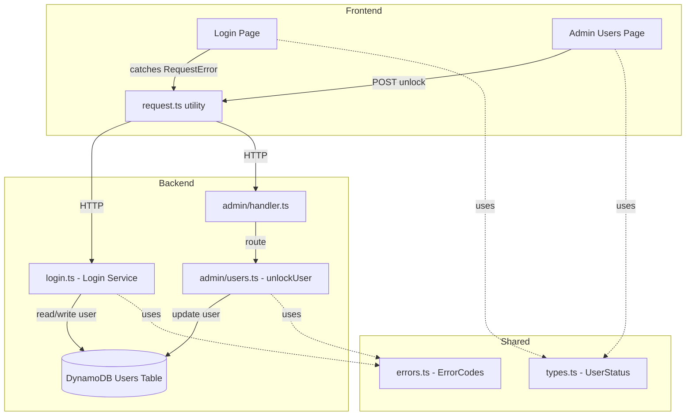

# Design Document: Account Lock Management

## Overview

This design addresses four areas of the account lock mechanism:

1. **Sliding-window failure counting** — Replace the current indefinite `loginFailCount` accumulation with a time-windowed approach using a new `firstFailAt` timestamp. Failures older than 15 minutes are discarded.
2. **Dynamic lock message** — Surface the `lockRemainingMs` value already returned by the backend through to the login page, displaying a localized "try again in X minutes" message.
3. **SuperAdmin manual unlock** — Add a `POST /api/admin/users/{id}/unlock` endpoint that resets lock state, restricted to SuperAdmin.
4. **Locked status visibility** — Show a "locked" badge in the admin user list and an unlock button for SuperAdmin users.

### Key Design Decisions

- **`firstFailAt` as a DynamoDB attribute**: Stored alongside `loginFailCount` and `lockUntil` on the user record. No new table or index needed.
- **Sliding window = 15 minutes**: Matches the existing `LOCK_DURATION_MS`. Configurable via the same constant pattern (`SLIDING_WINDOW_MS`).
- **`RequestError.data` for extra fields**: The frontend `RequestError` class gains an optional `data` property to carry `lockRemainingMs` and any future extra response fields, avoiding a breaking change to the constructor signature.
- **`UserStatus` type expansion**: Add `'locked'` to the shared `UserStatus` union type. The backend already sets `status: 'locked'` in `login.ts`; the shared type just needs to catch up.
- **Unlock is idempotent**: Unlocking a non-locked user returns success without modification, simplifying frontend logic.

## Architecture

The feature touches three layers with minimal new surface area:



### Change Scope

| Layer | File | Change |
|-------|------|--------|
| Shared | `packages/shared/src/types.ts` | Add `'locked'` to `UserStatus` |
| Backend | `packages/backend/src/auth/login.ts` | Sliding window logic with `firstFailAt`; reset on lock expiry; reset on success |
| Backend | `packages/backend/src/admin/users.ts` | New `unlockUser()` function |
| Backend | `packages/backend/src/admin/handler.ts` | Route `POST /api/admin/users/{id}/unlock` |
| Frontend | `packages/frontend/src/utils/request.ts` | Add `data` property to `RequestError` |
| Frontend | `packages/frontend/src/pages/login/index.tsx` | Dynamic lock message using `lockRemainingMs` |
| Frontend | `packages/frontend/src/pages/admin/users.tsx` | Locked badge + unlock button |
| Frontend | `packages/frontend/src/pages/admin/users.scss` | `user-status--locked` style |
| Frontend | `packages/frontend/src/i18n/types.ts` | New i18n keys |
| Frontend | `packages/frontend/src/i18n/{zh,en,ja,ko,zh-TW}.ts` | Translations |

## Components and Interfaces

### 1. Login Service (`login.ts`)

**Modified function: `loginUser()`**

Current behavior: `loginFailCount` increments indefinitely. Lock triggers at count ≥ 5 regardless of when failures occurred.

New behavior with sliding window:

```
function loginUser(request, dynamoClient, tableName):
  user = queryByEmail(request.email)
  if not found → return INVALID_CREDENTIALS

  now = Date.now()

  // Step 1: Check active lock
  if user.lockUntil exists AND user.lockUntil > now:
    return ACCOUNT_LOCKED with lockRemainingMs = lockUntil - now

  // Step 2: If lock expired, reset state before proceeding
  if user.lockUntil exists AND user.lockUntil <= now:
    reset loginFailCount=0, remove lockUntil, remove firstFailAt, set status='active'

  // Step 3: Check disabled
  if user.status == 'disabled' → return ACCOUNT_DISABLED

  // Step 4: Verify password
  if password incorrect:
    // Sliding window check
    if user.firstFailAt is missing OR (now - user.firstFailAt) > SLIDING_WINDOW_MS:
      set firstFailAt = now, loginFailCount = 1
    else:
      loginFailCount += 1

    if loginFailCount >= MAX_LOGIN_FAILURES:
      set lockUntil = now + LOCK_DURATION_MS, status = 'locked'
      return ACCOUNT_LOCKED with lockRemainingMs

    return INVALID_CREDENTIALS

  // Step 5: Password correct — full reset
  set loginFailCount=0, remove lockUntil, remove firstFailAt, set status='active'
  return success with user data
```

**Constants:**
- `SLIDING_WINDOW_MS = 15 * 60 * 1000` (15 minutes)
- `MAX_LOGIN_FAILURES = 5` (unchanged)
- `LOCK_DURATION_MS = 15 * 60 * 1000` (unchanged)

### 2. Unlock User API (`admin/users.ts`)

**New function: `unlockUser()`**

```typescript
interface UnlockUserResult {
  success: boolean;
  error?: { code: string; message: string };
}

async function unlockUser(
  userId: string,
  dynamoClient: DynamoDBDocumentClient,
  tableName: string,
): Promise<UnlockUserResult>
```

Logic:
1. Fetch user by `userId`. If not found → return `USER_NOT_FOUND`.
2. If user status is not `locked` → return success (idempotent).
3. Update: `loginFailCount=0`, remove `lockUntil`, remove `firstFailAt`, set `status='active'`.

Authorization is handled at the handler level (SuperAdmin check before calling this function).

### 3. Admin Handler Route (`admin/handler.ts`)

New route:
```
POST /api/admin/users/{userId}/unlock
```

- Requires SuperAdmin role (checked in handler before calling `unlockUser`)
- Regex: `USERS_UNLOCK_REGEX = /^\/api\/admin\/users\/([^/]+)\/unlock$/`
- Placed in the POST section, before other user routes

### 4. RequestError Enhancement (`request.ts`)

Add an optional `data` property to carry extra response fields:

```typescript
export class RequestError extends Error {
  code: string;
  statusCode: number;
  data?: Record<string, unknown>;  // NEW

  constructor(code: string, message: string, statusCode: number, data?: Record<string, unknown>) {
    super(message);
    this.code = code;
    this.statusCode = statusCode;
    this.data = data;
    this.name = 'RequestError';
  }
}
```

In the `request()` function, when constructing `RequestError` from a business error response, pass extra fields:

```typescript
if (errorData?.code && errorData?.message) {
  const { code, message, ...rest } = errorData as Record<string, unknown>;
  throw new RequestError(
    code as string,
    message as string,
    statusCode,
    Object.keys(rest).length > 0 ? rest : undefined,
  );
}
```

### 5. Login Page Error Handling (`login/index.tsx`)

When catching `ACCOUNT_LOCKED`:

```typescript
if (err.code === 'ACCOUNT_LOCKED') {
  const lockRemainingMs = err.data?.lockRemainingMs as number | undefined;
  if (lockRemainingMs && lockRemainingMs > 0) {
    const minutes = Math.ceil(lockRemainingMs / 60000);
    setError(t('login.errorAccountLockedWithTime', { minutes }));
  } else {
    setError(t('login.errorAccountLocked'));
  }
}
```

### 6. Admin Users Page Changes (`admin/users.tsx`)

- **UserListItem interface**: Add `'locked'` to the `status` union type.
- **Status badge**: Render `user-status--locked` class with warning color when `status === 'locked'`.
- **Unlock button**: Show for SuperAdmin users when a user's status is `locked`. Calls `POST /api/admin/users/{userId}/unlock`.
- **Success/error toasts**: Use i18n keys `admin.users.unlockSuccess` and `admin.users.unlockFailed`.

### 7. i18n Keys

New keys added to `TranslationDict`:

```typescript
// login section
login: {
  // existing...
  errorAccountLockedWithTime: string;  // "账号已锁定，请 {minutes} 分钟后重试"
}

// admin.users section
admin.users: {
  // existing...
  statusLocked: string;    // "已锁定"
  unlockUser: string;      // "解锁"
  unlockSuccess: string;   // "已解锁"
  unlockFailed: string;    // "解锁失败"
}
```

**Translations:**

| Key | zh | en | ja | ko | zh-TW |
|-----|----|----|----|----|-------|
| `login.errorAccountLockedWithTime` | 账号已锁定，请 {minutes} 分钟后重试 | Account locked, please try again in {minutes} minutes | アカウントがロックされました。{minutes}分後に再試行してください | 계정이 잠겼습니다. {minutes}분 후에 다시 시도해주세요 | 帳號已鎖定，請 {minutes} 分鐘後重試 |
| `admin.users.statusLocked` | 已锁定 | Locked | ロック中 | 잠김 | 已鎖定 |
| `admin.users.unlockUser` | 解锁 | Unlock | ロック解除 | 잠금 해제 | 解鎖 |
| `admin.users.unlockSuccess` | 已解锁 | Unlocked | ロック解除しました | 잠금 해제됨 | 已解鎖 |
| `admin.users.unlockFailed` | 解锁失败 | Unlock failed | ロック解除に失敗しました | 잠금 해제 실패 | 解鎖失敗 |

## Data Models

### User Record (DynamoDB)

No new table. Three fields on the existing user record:

| Field | Type | Description | Lifecycle |
|-------|------|-------------|-----------|
| `loginFailCount` | `number` | Failed attempts within current sliding window | Reset to 0 on success, lock expiry, or manual unlock |
| `lockUntil` | `number` (epoch ms) | When the lock expires | Set when threshold reached; removed on success, expiry, or unlock |
| `firstFailAt` | `number` (epoch ms) | **NEW** — Start of current sliding window | Set on first failure; removed on success, expiry, or unlock |
| `status` | `string` | `'active' \| 'disabled' \| 'locked'` | Set to `'locked'` when threshold reached; restored to `'active'` on success, expiry, or unlock |

### UserStatus Type Change

```typescript
// Before
export type UserStatus = 'active' | 'disabled';

// After
export type UserStatus = 'active' | 'disabled' | 'locked';
```


## Correctness Properties

*A property is a characteristic or behavior that should hold true across all valid executions of a system — essentially, a formal statement about what the system should do. Properties serve as the bridge between human-readable specifications and machine-verifiable correctness guarantees.*

### Property 1: Sliding window reset on stale or missing firstFailAt

*For any* user record where `firstFailAt` is either absent or older than `SLIDING_WINDOW_MS` (15 minutes), when a login attempt fails, the system SHALL set `firstFailAt` to the current timestamp and `loginFailCount` to 1, regardless of the previous `loginFailCount` value.

**Validates: Requirements 1.1, 1.2**

### Property 2: In-window failure increments count

*For any* user record where `firstFailAt` is within the last `SLIDING_WINDOW_MS` and `loginFailCount` is between 1 and `MAX_LOGIN_FAILURES - 2` (i.e., 1–3), when a login attempt fails, the system SHALL set `loginFailCount` to the previous value plus 1 and leave `firstFailAt` unchanged.

**Validates: Requirements 1.3**

### Property 3: Lock triggers at threshold

*For any* user record where `firstFailAt` is within the last `SLIDING_WINDOW_MS` and `loginFailCount` equals `MAX_LOGIN_FAILURES - 1` (i.e., 4), when a login attempt fails, the system SHALL set `status` to `'locked'`, set `lockUntil` to approximately `now + LOCK_DURATION_MS`, and return an `ACCOUNT_LOCKED` error with a positive `lockRemainingMs`.

**Validates: Requirements 1.4**

### Property 4: Successful login resets all lock state

*For any* user record with any combination of `loginFailCount`, `firstFailAt`, and expired `lockUntil`, when a login attempt succeeds (correct password), the system SHALL set `loginFailCount` to 0, remove `lockUntil`, remove `firstFailAt`, and set `status` to `'active'`.

**Validates: Requirements 1.5**

### Property 5: Expired lock auto-resets before credential validation

*For any* user record where `lockUntil` exists and is in the past, when a login attempt is made, the system SHALL reset `loginFailCount` to 0, remove `lockUntil`, remove `firstFailAt`, and set `status` to `'active'` before proceeding with password validation.

**Validates: Requirements 2.1**

### Property 6: Active lock rejects with correct remaining time

*For any* user record where `lockUntil` exists and is in the future, when a login attempt is made, the system SHALL reject with `ACCOUNT_LOCKED` and `lockRemainingMs` equal to `lockUntil - now` (within a small tolerance), regardless of the provided credentials.

**Validates: Requirements 2.2**

### Property 7: Lock remaining minutes rounds up

*For any* positive `lockRemainingMs` value, the displayed minutes SHALL equal `Math.ceil(lockRemainingMs / 60000)`, ensuring the user is never told they can retry before the lock actually expires.

**Validates: Requirements 3.2**

### Property 8: RequestError preserves extra response fields

*For any* backend error response containing fields beyond `code` and `message`, constructing a `RequestError` from that response SHALL preserve all extra fields in the `data` property, and `data[key]` SHALL equal the original response value for each extra key.

**Validates: Requirements 4.1**

### Property 9: Unlock clears all lock state for locked users

*For any* user record with `status === 'locked'` and any combination of `loginFailCount`, `lockUntil`, and `firstFailAt`, calling `unlockUser` SHALL set `loginFailCount` to 0, remove `lockUntil`, remove `firstFailAt`, set `status` to `'active'`, and return `{ success: true }`.

**Validates: Requirements 5.1**

### Property 10: Unlock is idempotent for non-locked users

*For any* user record where `status` is `'active'` or `'disabled'`, calling `unlockUser` SHALL return `{ success: true }` without modifying the user record.

**Validates: Requirements 5.3**

## Error Handling

### Backend Errors

| Scenario | Error Code | HTTP Status | Extra Data |
|----------|-----------|-------------|------------|
| Active lock (lockUntil in future) | `ACCOUNT_LOCKED` | 403 | `{ lockRemainingMs: number }` |
| Password incorrect (not yet locked) | `INVALID_CREDENTIALS` | 401 | — |
| Account disabled | `ACCOUNT_DISABLED` | 403 | — |
| Unlock: user not found | `USER_NOT_FOUND` | 404 | — |
| Unlock: caller not SuperAdmin | `FORBIDDEN` | 403 | — |
| Unlock: user not locked | — (success) | 200 | `{ success: true }` |

### Frontend Error Handling

**Login page:**
- `ACCOUNT_LOCKED` with `lockRemainingMs` → parameterized lock message with minutes
- `ACCOUNT_LOCKED` without `lockRemainingMs` → generic lock message (fallback)
- `INVALID_CREDENTIALS` → existing credential error message
- Other errors → generic error message

**Admin users page:**
- Unlock success → success toast + refresh user list
- Unlock failure → error toast with server message or generic fallback

### Edge Cases

- **Clock skew**: `lockRemainingMs` could be slightly negative if the lock just expired between the backend check and response. Frontend treats `lockRemainingMs <= 0` as "no time remaining" and falls back to generic message.
- **Concurrent unlock**: Two SuperAdmins unlock the same user simultaneously. Both succeed (idempotent). No conflict.
- **Lock expiry during page view**: Admin sees a user as "locked" but the lock has expired by the time they click unlock. The unlock call succeeds (idempotent) and the user list refreshes showing "active".

## Testing Strategy

### Unit Tests (Example-Based)

- **Login page**: Verify `ACCOUNT_LOCKED` error displays dynamic message with minutes; verify fallback to generic message when `lockRemainingMs` is missing.
- **Admin users page**: Verify unlock button appears only for SuperAdmin + locked user; verify unlock button hidden for non-SuperAdmin; verify success/error toasts.
- **Handler routing**: Verify `POST /api/admin/users/{id}/unlock` routes correctly and enforces SuperAdmin check.
- **i18n completeness**: Verify all new keys exist in all 5 language files.

### Property-Based Tests

Property-based tests use `fast-check` (already available in the project via vitest). Each test runs a minimum of 100 iterations.

| Property | Test File | What It Generates |
|----------|-----------|-------------------|
| P1: Sliding window reset | `login.property.test.ts` | Random user records with absent/stale `firstFailAt` |
| P2: In-window increment | `login.property.test.ts` | Random user records with recent `firstFailAt`, count 1–3 |
| P3: Lock trigger | `login.property.test.ts` | Random user records with recent `firstFailAt`, count=4 |
| P4: Success reset | `login.property.test.ts` | Random user records with various lock states + correct password |
| P5: Expired lock auto-reset | `login.property.test.ts` | Random user records with past `lockUntil` |
| P6: Active lock rejection | `login.property.test.ts` | Random user records with future `lockUntil` |
| P7: Minutes rounding | `login.property.test.ts` | Random positive `lockRemainingMs` values (1–900000) |
| P8: RequestError data | `request.property.test.ts` | Random error response objects with extra fields |
| P9: Unlock locked user | `users.property.test.ts` | Random locked user records |
| P10: Unlock idempotent | `users.property.test.ts` | Random non-locked user records |

Each property test is tagged with:
```
Feature: account-lock-management, Property {N}: {description}
```

### Integration Tests

- End-to-end login flow: 5 rapid failures → lock → wait for expiry → successful login
- Admin unlock flow: Lock a user → SuperAdmin unlocks → user can log in
- Non-SuperAdmin unlock attempt → 403 Forbidden
