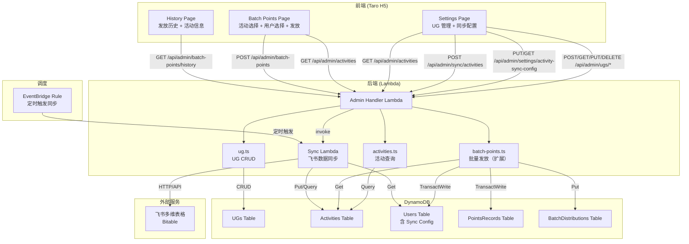

# 设计文档：活动积分追踪（Activity Points Tracking）

## Overview

本功能为社区积分商城系统新增活动维度的积分追踪能力，包含三个子功能模块：

1. **UG（User Group）管理**：SuperAdmin 在 Settings 页面管理社区用户组（CRUD + 状态切换），UG 作为独立实体存储在 DynamoDB UGs 表中。
2. **飞书活动数据同步**：通过 Web Scraping 或 Feishu Open API 从飞书多维表格同步活动数据到 DynamoDB Activities 表，支持 EventBridge 定时触发和手动触发。
3. **积分发放关联活动**：扩展现有批量积分发放流程，在发放前新增活动选择步骤，发放记录和积分记录均关联活动元数据，便于按活动维度统计和审计。

### 关键设计决策

1. **UG 独立于用户**：UG 不与用户 profile 绑定，仅作为活动的归属维度。活动记录中的 ugName 为快照值，UG 删除不影响历史数据。
2. **活动数据快照策略**：发放记录中存储活动元数据快照（activityType、activityUG、activityTopic、activityDate），避免活动数据变更影响历史发放记录的审计完整性。
3. **同步配置复用 Users 表**：Sync_Config 使用固定 settingKey="activity-sync-config" 存储在 Users 表中（复用现有表，避免新建配置表），与 feature-toggles 等设置存储方式一致。
4. **Sync Lambda 独立部署**：飞书同步逻辑部署为独立 Lambda，由 EventBridge 定时触发或 Admin Lambda 手动调用，避免同步耗时影响 Admin API 响应。
5. **活动去重策略**：基于 topic + activityDate + ugName 组合去重，避免重复同步同一活动。
6. **向后兼容**：批量发放接口新增 activityId 为必填字段，前端需先选择活动才能发放。

## Architecture



### 请求流程

1. **UG 管理**：Settings Page → POST/GET/PUT/DELETE `/api/admin/ugs/*` → Admin Handler → `ug.ts` → UGs Table
2. **同步配置**：Settings Page → PUT/GET `/api/admin/settings/activity-sync-config` → Admin Handler → Users Table（settingKey="activity-sync-config"）
3. **手动同步**：Settings Page → POST `/api/admin/sync/activities` → Admin Handler → invoke Sync Lambda → 飞书 Bitable → Activities Table
4. **定时同步**：EventBridge Rule → Sync Lambda → 读取 Users Table 中的 Sync Config → 飞书 Bitable → Activities Table
5. **活动查询**：Batch Points Page → GET `/api/admin/activities` → Admin Handler → `activities.ts` → Activities Table
6. **批量发放（扩展）**：Batch Points Page → POST `/api/admin/batch-points`（含 activityId + 活动快照）→ Admin Handler → `batch-points.ts` → 验证 activityId 存在 → 执行发放 → 写入 Distribution_Record（含活动元数据）

## Components and Interfaces

### Backend Module: `packages/backend/src/admin/ug.ts`

```typescript
/** UG 记录 */
export interface UGRecord {
  ugId: string;
  name: string;
  status: 'active' | 'inactive';
  createdAt: string;
  updatedAt: string;
}

/** 创建 UG 输入 */
export interface CreateUGInput {
  name: string;
}

/** 创建 UG */
export async function createUG(
  input: CreateUGInput,
  dynamoClient: DynamoDBDocumentClient,
  ugsTable: string,
): Promise<{ success: boolean; ug?: UGRecord; error?: { code: string; message: string } }>;

/** 删除 UG */
export async function deleteUG(
  ugId: string,
  dynamoClient: DynamoDBDocumentClient,
  ugsTable: string,
): Promise<{ success: boolean; error?: { code: string; message: string } }>;

/** 更新 UG 状态 */
export async function updateUGStatus(
  ugId: string,
  status: 'active' | 'inactive',
  dynamoClient: DynamoDBDocumentClient,
  ugsTable: string,
): Promise<{ success: boolean; error?: { code: string; message: string } }>;

/** 查询 UG 列表 */
export async function listUGs(
  options: { status?: 'active' | 'inactive' | 'all' },
  dynamoClient: DynamoDBDocumentClient,
  ugsTable: string,
): Promise<{ success: boolean; ugs?: UGRecord[]; error?: { code: string; message: string } }>;

/** 验证 UG 名称输入 */
export function validateUGName(name: unknown): { valid: boolean; error?: { code: string; message: string } };
```

### Backend Module: `packages/backend/src/admin/activities.ts`

```typescript
/** 活动记录 */
export interface ActivityRecord {
  activityId: string;
  activityType: '线上活动' | '线下活动';
  ugName: string;
  topic: string;
  activityDate: string;
  syncedAt: string;
  sourceUrl: string;
}

/** 查询活动列表 */
export async function listActivities(
  options: {
    ugName?: string;
    startDate?: string;
    endDate?: string;
    keyword?: string;
    pageSize?: number;
    lastKey?: string;
  },
  dynamoClient: DynamoDBDocumentClient,
  activitiesTable: string,
): Promise<{ success: boolean; activities?: ActivityRecord[]; lastKey?: string; error?: { code: string; message: string } }>;

/** 按 ID 获取活动 */
export async function getActivity(
  activityId: string,
  dynamoClient: DynamoDBDocumentClient,
  activitiesTable: string,
): Promise<{ success: boolean; activity?: ActivityRecord; error?: { code: string; message: string } }>;
```

### Backend Module: `packages/backend/src/sync/handler.ts`（Sync Lambda）

```typescript
/** 同步配置 */
export interface SyncConfig {
  settingKey: string;
  syncIntervalDays: number;
  feishuTableUrl: string;
  feishuAppId: string;
  feishuAppSecret: string;
  updatedAt: string;
  updatedBy: string;
}

/** 同步结果 */
export interface SyncResult {
  success: boolean;
  syncedCount?: number;
  skippedCount?: number;
  error?: { code: string; message: string };
}

/** 执行飞书活动数据同步 */
export async function syncActivities(
  config: SyncConfig,
  dynamoClient: DynamoDBDocumentClient,
  activitiesTable: string,
): Promise<SyncResult>;
```

### Batch Points 扩展（`packages/backend/src/admin/batch-points.ts`）

```typescript
/** 扩展后的批量发放请求输入 */
export interface BatchDistributionInput {
  userIds: string[];
  points: number;
  reason: string;
  targetRole: 'UserGroupLeader' | 'Speaker' | 'Volunteer';
  distributorId: string;
  distributorNickname: string;
  // 新增活动关联字段
  activityId: string;
  activityType: string;
  activityUG: string;
  activityTopic: string;
  activityDate: string;
}
```

### Admin Handler Routes（新增路由）

| Method | Path | Handler | Permission |
|--------|------|---------|------------|
| POST | `/api/admin/ugs` | `handleCreateUG` | SuperAdmin |
| GET | `/api/admin/ugs` | `handleListUGs` | SuperAdmin |
| PUT | `/api/admin/ugs/{ugId}/status` | `handleUpdateUGStatus` | SuperAdmin |
| DELETE | `/api/admin/ugs/{ugId}` | `handleDeleteUG` | SuperAdmin |
| POST | `/api/admin/sync/activities` | `handleManualSync` | SuperAdmin |
| GET | `/api/admin/activities` | `handleListActivities` | Admin / SuperAdmin |
| PUT | `/api/admin/settings/activity-sync-config` | `handleUpdateSyncConfig` | SuperAdmin |
| GET | `/api/admin/settings/activity-sync-config` | `handleGetSyncConfig` | SuperAdmin |

### Frontend Pages（修改/新增）

| Page | Path | Description |
|------|------|-------------|
| Settings Page（扩展） | `/pages/admin/settings` | 新增 UG 管理分类 + 活动同步配置分类 |
| Batch Points Page（扩展） | `/pages/admin/batch-points` | 新增活动选择步骤 |
| Batch History Page（扩展） | `/pages/admin/batch-history` | 显示活动关联信息 |

### Shared Types（新增到 `packages/shared/src/types.ts`）

```typescript
/** UG 记录 */
export interface UGRecord {
  ugId: string;
  name: string;
  status: 'active' | 'inactive';
  createdAt: string;
  updatedAt: string;
}

/** 活动记录 */
export interface ActivityRecord {
  activityId: string;
  activityType: '线上活动' | '线下活动';
  ugName: string;
  topic: string;
  activityDate: string;
  syncedAt: string;
  sourceUrl: string;
}

/** 扩展 DistributionRecord — 新增活动元数据字段 */
// 在现有 DistributionRecord 接口中新增：
//   activityId: string;
//   activityType: string;
//   activityUG: string;
//   activityTopic: string;
//   activityDate: string;
```

## Data Models

### UGs Table（新增）

| Attribute | Type | Description |
|-----------|------|-------------|
| ugId (PK) | String | ULID，唯一标识一个 UG |
| name | String | UG 名称，1~50 字符 |
| status | String | 状态：active / inactive |
| createdAt | String | ISO 8601 创建时间 |
| updatedAt | String | ISO 8601 更新时间 |

**GSI**:
- `name-index`：PK=`name` — 用于按名称查询和唯一性校验（不区分大小写需应用层处理）
- `status-index`：PK=`status`，SK=`createdAt` — 用于按状态筛选和排序

### Activities Table（新增）

| Attribute | Type | Description |
|-----------|------|-------------|
| activityId (PK) | String | ULID，唯一标识一条活动记录 |
| pk | String | 固定值 "ALL"，用于 GSI 分区 |
| activityType | String | 活动类型："线上活动" / "线下活动" |
| ugName | String | 所属 UG 名称（快照值） |
| topic | String | 活动主题 |
| activityDate | String | 活动日期，ISO 8601 日期格式 |
| syncedAt | String | 同步时间，ISO 8601 |
| sourceUrl | String | 来源飞书表格 URL |
| dedupeKey | String | 去重键：`{topic}#{activityDate}#{ugName}` |

**GSI**:
- `activityDate-index`：PK=`pk`（固定值 "ALL"），SK=`activityDate` — 用于按日期排序查询
- `dedupeKey-index`：PK=`dedupeKey` — 用于同步时去重校验

### Users Table（现有，新增 Sync Config 记录）

使用固定 `userId`（settingKey）值 `"activity-sync-config"` 存储同步配置：

| Attribute | Type | Description |
|-----------|------|-------------|
| userId (PK) | String | 固定值 "activity-sync-config" |
| syncIntervalDays | Number | 同步间隔天数，1~30 |
| feishuTableUrl | String | 飞书表格公开分享 URL |
| feishuAppId | String | 飞书 App ID（备用 API 方式） |
| feishuAppSecret | String | 飞书 App Secret（加密存储） |
| updatedAt | String | ISO 8601 更新时间 |
| updatedBy | String | 操作人 userId |

### BatchDistributions Table（现有，扩展字段）

在现有 DistributionRecord 基础上新增：

| Attribute | Type | Description |
|-----------|------|-------------|
| activityId | String | 关联活动 ID |
| activityType | String | 活动类型快照 |
| activityUG | String | 所属 UG 名称快照 |
| activityTopic | String | 活动主题快照 |
| activityDate | String | 活动日期快照 |

### PointsRecords Table（现有，扩展字段）

每条积分记录新增：

| Attribute | Type | Description |
|-----------|------|-------------|
| activityId | String | 关联活动 ID |


## Correctness Properties

*A property is a characteristic or behavior that should hold true across all valid executions of a system — essentially, a formal statement about what the system should do. Properties serve as the bridge between human-readable specifications and machine-verifiable correctness guarantees.*

### Property 1: UG name validation accepts valid names and rejects invalid names

*For any* string input, the UG name validation function should accept it if and only if it is a non-empty string of length 1–50 characters (after trimming). All other inputs (empty strings, strings longer than 50 characters, non-string types) should be rejected with an appropriate error code.

**Validates: Requirements 2.2**

### Property 2: UG name uniqueness is case-insensitive

*For any* existing UG with name N, attempting to create a new UG with a name that equals N when compared case-insensitively should be rejected with error code DUPLICATE_UG_NAME, regardless of the casing used.

**Validates: Requirements 2.3**

### Property 3: UG status toggle is a round-trip

*For any* UG, setting its status to inactive and then back to active should result in the UG having status "active" with an updated updatedAt timestamp. Similarly, setting to active then inactive should result in status "inactive". The status field should always reflect the most recent update.

**Validates: Requirements 4.1, 4.2**

### Property 4: UG list filtering returns correct results in descending order

*For any* set of UGs with mixed statuses, querying with status filter "active" should return only UGs with status "active", querying with "inactive" should return only UGs with status "inactive", and querying with "all" should return all UGs. In all cases, results should be sorted by createdAt in descending order.

**Validates: Requirements 5.1, 5.2, 5.3**

### Property 5: Activity sync deduplication prevents duplicate records

*For any* set of activity records, syncing the same activities (same topic + activityDate + ugName combination) multiple times should not create duplicate records in the Activities table. The number of records after N syncs of the same data should equal the number of unique activities.

**Validates: Requirements 7.3**

### Property 6: Activity selector filters by active UG and search query

*For any* set of activities and any search query, the activity selector should return only activities whose ugName matches an active UG. Additionally, if a keyword filter is provided, only activities whose topic contains the keyword (case-insensitive) should be included. No matching activity should be excluded from the results.

**Validates: Requirements 14.2, 14.3**

### Property 7: Distribution record and points records contain complete activity metadata

*For any* successful batch distribution with an associated activity, the created Distribution_Record should contain all activity metadata fields (activityId, activityType, activityUG, activityTopic, activityDate), and every PointsRecord created for each recipient should contain the activityId field matching the distribution's activityId.

**Validates: Requirements 15.1, 15.2**

### Property 8: Batch distribution validates activityId existence

*For any* batch distribution request, the validation function should accept the request if and only if the activityId field is present (non-empty string) and the corresponding activity exists in the Activities table. Requests with missing activityId should be rejected with INVALID_REQUEST, and requests with non-existent activityId should be rejected with ACTIVITY_NOT_FOUND.

**Validates: Requirements 15.3, 16.1, 16.3**

### Property 9: Activity list query returns filtered results in descending date order

*For any* set of activities in the database and any combination of query parameters (ugName, startDate, endDate, keyword), the returned activities should satisfy all specified filters simultaneously, and results should be sorted by activityDate in descending order. The pageSize should be clamped to [1, 100] with a default of 20.

**Validates: Requirements 19.2, 19.3, 19.4**

## Error Handling

### Backend Error Codes

| Error Code | HTTP Status | Message | Trigger |
|------------|-------------|---------|---------|
| `FORBIDDEN` | 403 | 需要超级管理员权限 | 非 SuperAdmin 调用 UG 管理或同步配置接口 |
| `FORBIDDEN` | 403 | 需要管理员权限 | 非 Admin/SuperAdmin 调用活动查询或批量发放接口 |
| `INVALID_REQUEST` | 400 | 具体字段错误消息 | 请求体缺少必填字段或格式无效 |
| `DUPLICATE_UG_NAME` | 409 | UG 名称已存在 | 创建 UG 时名称已存在（不区分大小写） |
| `UG_NOT_FOUND` | 404 | UG 不存在 | 删除或更新不存在的 UG |
| `ACTIVITY_NOT_FOUND` | 404 | 关联活动不存在 | 批量发放时 activityId 不存在 |
| `SYNC_FAILED` | 500 | 同步失败：具体原因 | 飞书数据同步失败（网络错误、页面结构变更、API 凭证无效等） |
| `INTERNAL_ERROR` | 500 | Internal server error | DynamoDB 操作失败等未预期错误 |

### 同步失败处理

- Web Scraping 失败（网络错误、页面结构变更）：记录错误日志，返回 SYNC_FAILED 错误码和具体原因
- Feishu API 失败（凭证无效、权限不足）：记录错误日志，返回 SYNC_FAILED 错误码和 API 错误详情
- 定时同步失败：Sync Lambda 记录 CloudWatch 日志，不影响下次调度执行
- 部分同步成功：返回 syncedCount 和 skippedCount，已成功写入的记录不回滚

### 前端错误处理

- API 请求失败：显示 Toast 提示具体错误消息
- 网络错误：显示通用错误提示"操作失败，请稍后重试"
- 权限不足：重定向到管理后台首页
- 同步超时：显示"同步超时，请稍后重试"提示
- UG 名称重复：在创建 UG 输入框下方显示"UG 名称已存在"错误提示

## Testing Strategy

### 单元测试

使用 Vitest 进行单元测试，覆盖以下场景：

1. **UG CRUD**：测试 createUG、deleteUG、updateUGStatus、listUGs 函数的正常和异常路径
2. **UG 输入验证**：测试 validateUGName 对各种有效/无效输入的处理
3. **活动查询**：测试 listActivities 的筛选、排序、分页逻辑
4. **同步去重**：测试 syncActivities 的去重逻辑
5. **批量发放扩展**：测试扩展后的 validateBatchDistributionInput 对 activityId 等新字段的校验
6. **权限校验**：测试各接口的 SuperAdmin / Admin 权限校验
7. **Admin Handler 路由**：测试新增路由的请求转发和响应格式

### 属性测试（Property-Based Testing）

使用 **fast-check** 库进行属性测试，每个属性测试运行最少 100 次迭代。

每个属性测试必须以注释标注对应的设计文档属性：
- 标签格式：`Feature: activity-points-tracking, Property {number}: {property_text}`

属性测试覆盖 9 个核心属性：
1. UG 名称验证的完备性
2. UG 名称大小写不敏感唯一性
3. UG 状态切换的往返正确性
4. UG 列表筛选和排序正确性
5. 活动同步去重保证
6. 活动选择器按 active UG 和搜索关键词过滤
7. 发放记录和积分记录的活动元数据完整性
8. 批量发放 activityId 存在性验证
9. 活动列表查询筛选和排序正确性

### 集成测试

- Admin Handler 路由测试：验证新增 UG 和活动相关路由的请求转发和响应格式
- Sync Lambda 集成测试：使用 mock HTTP 响应测试飞书数据解析和写入逻辑
- CDK 合成测试：验证 UGs 表、Activities 表定义、GSI、IAM 权限、环境变量、EventBridge 规则配置
