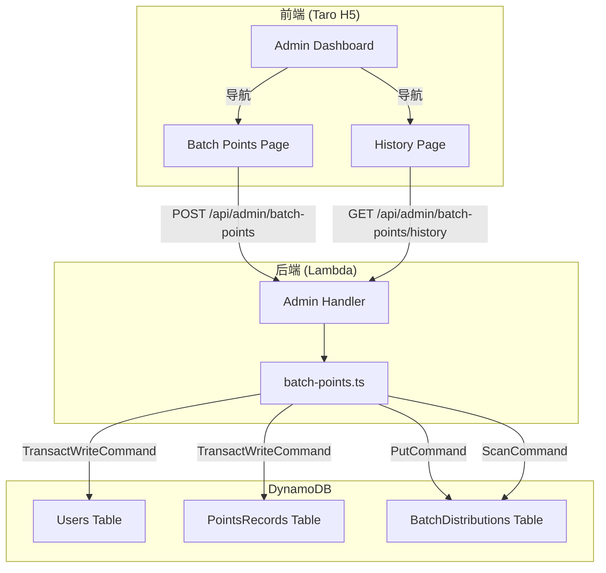

# 设计文档：管理员批量积分发放

## Overview

本功能为管理员提供批量积分发放能力。管理员选择目标角色（UserGroupLeader / Speaker / Volunteer），从该角色的活跃用户列表中多选用户，输入积分数值和发放原因，一次性完成批量积分发放。系统使用 DynamoDB 事务保证积分发放的原子性，并将每次发放操作记录到 BatchDistributions 表中。SuperAdmin 可查看发放历史用于审计。

### 关键设计决策

1. **事务拆分策略**：DynamoDB TransactWriteItems 限制每次最多 100 个操作。每个用户需要 2 个操作（更新积分 + 写入积分记录），因此单次事务最多处理 25 个用户。超过 25 人时按批次拆分事务，最后写入 Distribution_Record。
2. **去重在服务端执行**：前端尽量避免重复选择，但服务端对 userIds 做 Set 去重作为最终保障。
3. **发放历史仅 SuperAdmin 可见**：通过后端权限校验和前端导航控制双重保障。
4. **积分无上限**：需求明确积分数值不设上限（最小值 1），服务端仅校验正整数且 ≥ 1。

## Architecture



### 请求流程

1. **批量发放**：前端 POST `/api/admin/batch-points` → Admin Handler 路由 → `executeBatchDistribution()` → 验证权限和参数 → 去重 userIds → 按批次执行 DynamoDB 事务（更新用户积分 + 写入积分记录）→ 写入 Distribution_Record → 返回结果
2. **查看历史**：前端 GET `/api/admin/batch-points/history` → Admin Handler 路由 → `listDistributionHistory()` → 验证 SuperAdmin 权限 → 查询 BatchDistributions 表 → 返回分页结果
3. **查看详情**：前端 GET `/api/admin/batch-points/history/{id}` → Admin Handler 路由 → `getDistributionDetail()` → 验证 SuperAdmin 权限 → 查询单条记录 → 返回详情

## Components and Interfaces

### Backend Module: `packages/backend/src/admin/batch-points.ts`

```typescript
/** 批量发放请求输入 */
export interface BatchDistributionInput {
  userIds: string[];
  points: number;
  reason: string;
  targetRole: 'UserGroupLeader' | 'Speaker' | 'Volunteer';
  distributorId: string;
  distributorNickname: string;
}

/** 批量发放结果 */
export interface BatchDistributionResult {
  success: boolean;
  distributionId?: string;
  successCount?: number;
  totalPoints?: number;
  error?: { code: string; message: string };
}

/** 执行批量积分发放 */
export async function executeBatchDistribution(
  input: BatchDistributionInput,
  dynamoClient: DynamoDBDocumentClient,
  tables: {
    usersTable: string;
    pointsRecordsTable: string;
    batchDistributionsTable: string;
  },
): Promise<BatchDistributionResult>;

/** 发放历史查询选项 */
export interface ListDistributionHistoryOptions {
  pageSize?: number;
  lastKey?: string;
}

/** 发放历史查询结果 */
export interface ListDistributionHistoryResult {
  success: boolean;
  distributions?: DistributionRecord[];
  lastKey?: string;
  error?: { code: string; message: string };
}

/** 查询发放历史列表 */
export async function listDistributionHistory(
  options: ListDistributionHistoryOptions,
  dynamoClient: DynamoDBDocumentClient,
  batchDistributionsTable: string,
): Promise<ListDistributionHistoryResult>;

/** 发放详情查询结果 */
export interface GetDistributionDetailResult {
  success: boolean;
  distribution?: DistributionRecord;
  error?: { code: string; message: string };
}

/** 查询单条发放记录详情 */
export async function getDistributionDetail(
  distributionId: string,
  dynamoClient: DynamoDBDocumentClient,
  batchDistributionsTable: string,
): Promise<GetDistributionDetailResult>;
```

### Admin Handler Routes (additions to `handler.ts`)

| Method | Path | Handler | Permission |
|--------|------|---------|------------|
| POST | `/api/admin/batch-points` | `handleBatchDistribution` | Admin / SuperAdmin |
| GET | `/api/admin/batch-points/history` | `handleListDistributionHistory` | SuperAdmin only |
| GET | `/api/admin/batch-points/history/{id}` | `handleGetDistributionDetail` | SuperAdmin only |

### Frontend Pages

| Page | Path | Description |
|------|------|-------------|
| BatchPointsPage | `/pages/admin/batch-points` | 批量发放操作页面 |
| BatchHistoryPage | `/pages/admin/batch-history` | 发放历史查看页面（SuperAdmin） |

### Shared Types (additions to `types.ts`)

```typescript
/** 批量发放记录 */
export interface DistributionRecord {
  distributionId: string;
  distributorId: string;
  distributorNickname: string;
  targetRole: 'UserGroupLeader' | 'Speaker' | 'Volunteer';
  recipientIds: string[];
  recipientDetails?: { userId: string; nickname: string; email: string }[];
  points: number;
  reason: string;
  successCount: number;
  totalPoints: number;
  createdAt: string;
}
```

## Data Models

### BatchDistributions Table

| Attribute | Type | Description |
|-----------|------|-------------|
| distributionId (PK) | String | ULID，唯一标识一次发放操作 |
| distributorId | String | 发放人 userId |
| distributorNickname | String | 发放人昵称 |
| targetRole | String | 目标角色 |
| recipientIds | List\<String\> | 接收人 userId 列表 |
| recipientDetails | List\<Map\> | 接收人详情（userId, nickname, email） |
| points | Number | 每人积分数值 |
| reason | String | 发放原因 |
| successCount | Number | 成功发放人数 |
| totalPoints | Number | 积分总计（points × successCount） |
| createdAt | String | ISO 8601 时间戳 |

**GSI**: `createdAt-index` (PK: `pk`, SK: `createdAt`) — 用于按时间倒序查询历史记录。由于 DynamoDB Scan 无法保证排序，使用 GSI 实现高效的时间排序查询。`pk` 固定值为 `"ALL"`，`createdAt` 作为排序键。

### PointsRecords Table (existing, new records)

每个接收人会新增一条积分记录：
- `type`: `'earn'`
- `source`: `'管理员批量发放:{distributionId}'`
- `balanceAfter`: 发放后的积分余额

### Users Table (existing, updated fields)

- `points`: 增加发放的积分数值
- `updatedAt`: 更新时间戳

## Correctness Properties

*A property is a characteristic or behavior that should hold true across all valid executions of a system — essentially, a formal statement about what the system should do. Properties serve as the bridge between human-readable specifications and machine-verifiable correctness guarantees.*

### Property 1: Client-side search filters correctly by nickname or email

*For any* list of users and any non-empty search query string, the filtered result should only contain users whose nickname or email includes the query string (case-insensitive), and no user matching the query should be excluded.

**Validates: Requirements 1.5**

### Property 2: Request body validation accepts valid inputs and rejects invalid inputs

*For any* request body object, the validation function should accept it if and only if: `userIds` is a non-empty array of strings, `points` is a positive integer ≥ 1, `reason` is a string of length 1–200, and `targetRole` is one of `'UserGroupLeader'`, `'Speaker'`, `'Volunteer'`. All other inputs should be rejected with an appropriate error code.

**Validates: Requirements 3.2, 3.3, 4.5, 4.6**

### Property 3: Batch distribution increases each recipient's balance by exactly the specified points

*For any* set of valid recipient userIds and any positive integer points value, after executing a batch distribution, each recipient's points balance should equal their previous balance plus the specified points value, and a corresponding points record with `type: 'earn'` and `amount` equal to the specified points should exist for each recipient.

**Validates: Requirements 4.7, 4.8**

### Property 4: Distribution record and result contain correct aggregated data

*For any* successful batch distribution with N unique recipients and P points per person, the created Distribution_Record should have `successCount` equal to N, `totalPoints` equal to N × P, and the returned result should contain a valid `distributionId`, the same `successCount`, and the same `totalPoints`.

**Validates: Requirements 4.9, 4.10**

### Property 5: Duplicate userIds are deduplicated before distribution

*For any* userIds array containing duplicate entries, the batch distribution service should process each unique userId exactly once. The `successCount` in the result should equal the number of unique userIds, and each unique user should receive points exactly once.

**Validates: Requirements 5.1, 5.2**

### Property 6: Distribution history returns records with all required fields in descending time order

*For any* set of distribution records in the database, the history query should return records where each item contains `distributionId`, `distributorNickname`, `targetRole`, `recipientIds` (length = recipientCount), `points`, `reason`, and `createdAt`. The records should be sorted by `createdAt` in descending order (most recent first).

**Validates: Requirements 6.3, 6.4**

### Property 7: Pagination pageSize is clamped to valid range

*For any* requested pageSize value, the effective pageSize used in the query should be clamped to the range [1, 100], defaulting to 20 when not specified. Specifically: if pageSize is undefined, use 20; if pageSize < 1, use 1; if pageSize > 100, use 100; otherwise use the requested value.

**Validates: Requirements 6.5**

## Error Handling

### Backend Error Codes

| Error Code | HTTP Status | Message | Trigger |
|------------|-------------|---------|---------|
| `FORBIDDEN` | 403 | 需要管理员权限 | 非 Admin/SuperAdmin 调用批量发放接口 |
| `FORBIDDEN` | 403 | 需要超级管理员权限 | 非 SuperAdmin 调用发放历史接口 |
| `INVALID_REQUEST` | 400 | 具体字段错误消息 | 请求体缺少必填字段或格式无效 |
| `DISTRIBUTION_NOT_FOUND` | 404 | 发放记录不存在 | 查询不存在的 distributionId |
| `INTERNAL_ERROR` | 500 | Internal server error | DynamoDB 事务失败等未预期错误 |

### 事务失败处理

- DynamoDB TransactWriteCommand 失败时，该批次内的所有操作会自动回滚（DynamoDB 事务保证）
- 如果某个批次失败，已成功的批次不会回滚。为简化实现，当前版本将整个发放视为原子操作：如果任何批次失败，返回错误，不创建 Distribution_Record
- 前端收到错误后显示具体错误信息，管理员可重试

### 前端错误处理

- API 请求失败：显示 Toast 提示具体错误消息
- 网络错误：显示通用错误提示"操作失败，请稍后重试"
- 权限不足：重定向到管理后台首页

## Testing Strategy

### 单元测试

使用 Vitest 进行单元测试，覆盖以下场景：

1. **输入验证**：测试 `validateBatchDistributionInput` 函数对各种有效/无效输入的处理
2. **权限校验**：测试 Admin 和 SuperAdmin 角色的访问控制
3. **去重逻辑**：测试 userIds 去重行为
4. **事务构建**：测试 DynamoDB 事务参数的正确构建
5. **历史查询**：测试分页参数处理和结果排序
6. **前端搜索**：测试客户端模糊搜索过滤逻辑

### 属性测试（Property-Based Testing）

使用 **fast-check** 库进行属性测试，每个属性测试运行最少 100 次迭代。

每个属性测试必须以注释标注对应的设计文档属性：
- 标签格式：`Feature: admin-batch-points, Property {number}: {property_text}`

属性测试覆盖 7 个核心属性：
1. 客户端搜索过滤正确性
2. 请求体验证的完备性
3. 批量发放后每个用户积分余额正确性
4. 发放记录和返回结果的聚合数据正确性
5. userIds 去重保证
6. 历史记录字段完整性和时间排序
7. 分页 pageSize 范围钳制

### 集成测试

- Admin Handler 路由测试：验证新增路由的请求转发和响应格式
- CDK 合成测试：验证 BatchDistributions 表定义、IAM 权限、环境变量配置

