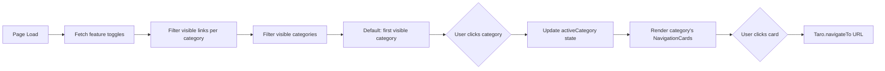
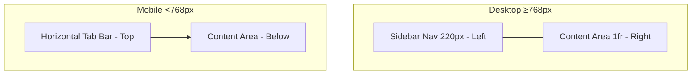

# Design Document: Admin Dashboard Redesign

## Overview

This design reorganizes the admin dashboard page (`packages/frontend/src/pages/admin/index.tsx`) from a flat scrolling list of 15 navigation cards into a category-based navigation layout with 6 logical groups, collapsible sections, and a sidebar/tab-bar navigation pattern. The redesign is purely frontend — no backend changes, no new API endpoints, no data model changes. All existing navigation behavior, feature toggle gating, role-based visibility, and authentication guards remain identical.

The current page renders all 15 `ADMIN_LINKS` entries as a single vertical card list. The redesign groups these into 6 navigable categories (商品管理, 订单管理, 用户管理, 内容管理, 运营工具, 系统设置) with a sidebar (desktop) or horizontal tab bar (mobile), following the same approach successfully applied in the settings-panel-redesign.

### Key Design Decisions

1. **Single-file refactor**: The redesign stays within `index.tsx` and `index.scss`. DashboardCategoryNav and CollapsibleSection are local components within the same file, matching the settings page pattern.

2. **State-driven navigation**: Active category is managed via a `useState<string>` hook. Only the active category's navigation cards render, reducing DOM size.

3. **CSS-only collapsible sections**: Expand/collapse uses CSS `max-height` transitions with a state toggle, same pattern as settings page. Chevron rotation uses CSS transform.

4. **No new dependencies**: Uses only existing Taro components (`View`, `Text`) and the project's CSS variable design system.

5. **SVG icon components for categories**: Unlike the settings page which uses emoji characters for category icons, the dashboard uses existing SVG icon components (`PackageIcon`, `ShoppingBagIcon`, `ProfileIcon`, `GlobeIcon`, `GiftIcon`, `SettingsIcon`) per Requirement 7.4.

6. **Category field on ADMIN_LINKS**: Each entry in `ADMIN_LINKS` gets a `category` string field that maps it to one of the 6 categories. This enables filtering and dynamic category visibility.

7. **Dynamic category filtering**: Categories with zero visible links (due to feature toggles or role restrictions) are automatically hidden from the navigation, per Requirement 6.6.

## Architecture

### Component Hierarchy

```
AdminDashboard
├── AdminHeader (existing, unchanged)
├── DashboardLayout (new wrapper)
│   ├── DashboardCategoryNav (new, similar to settings CategoryNav)
│   │   └── CategoryNavItem × 6
│   └── DashboardContent (new wrapper)
│       └── [Active Category Content]
│           ├── CategoryTitle
│           ├── CollapsibleSection (new, same pattern as settings)
│           │   └── NavigationCard × N
│           └── ...
└── (no modals needed)
```

### Navigation Flow



### Responsive Layout



## Components and Interfaces

### DashboardCategory Configuration

```typescript
interface DashboardCategory {
  key: string;
  label: string;
  icon: React.ComponentType<{ size: number; color: string }>;
}

const DASHBOARD_CATEGORIES: DashboardCategory[] = [
  { key: 'product-management', label: '商品管理', icon: PackageIcon },
  { key: 'order-management', label: '订单管理', icon: ShoppingBagIcon },
  { key: 'user-management', label: '用户管理', icon: ProfileIcon },
  { key: 'content-management', label: '内容管理', icon: GlobeIcon },
  { key: 'operations', label: '运营工具', icon: GiftIcon },
  { key: 'system-settings', label: '系统设置', icon: SettingsIcon },
];
```

### ADMIN_LINKS Category Extension

Each existing `ADMIN_LINKS` entry gets a `category` field added:

```typescript
const ADMIN_LINKS = [
  { key: 'products',       category: 'product-management', icon: PackageIcon, ... },
  { key: 'codes',          category: 'product-management', icon: TicketIcon, ... },
  { key: 'email-products', category: 'product-management', icon: MailIcon, ... },
  { key: 'orders',         category: 'order-management',   icon: PackageIcon, ... },
  { key: 'claims',         category: 'order-management',   icon: ClaimIcon, ... },
  { key: 'users',          category: 'user-management',    icon: ProfileIcon, ... },
  { key: 'invites',        category: 'user-management',    icon: ShoppingBagIcon, ... },
  { key: 'content',        category: 'content-management', icon: GlobeIcon, ... },
  { key: 'categories',     category: 'content-management', icon: SettingsIcon, ... },
  { key: 'tags',           category: 'content-management', icon: TagIcon, ... },
  { key: 'email-content',  category: 'content-management', icon: MailIcon, ... },
  { key: 'batch-points',   category: 'operations',         icon: GiftIcon, ... },
  { key: 'batch-history',  category: 'operations',         icon: ClockIcon, ... },
  { key: 'travel',         category: 'operations',         icon: LocationIcon, ... },
  { key: 'settings',       category: 'system-settings',    icon: SettingsIcon, ... },
];
```

### DashboardCategoryNav Component

A local component within `index.tsx` that renders the category navigation sidebar/tab bar.

**Props:**
```typescript
interface DashboardCategoryNavProps {
  categories: DashboardCategory[];
  activeCategory: string;
  onCategoryChange: (key: string) => void;
}
```

**Behavior:**
- Renders as vertical sidebar list on desktop (≥768px) with 220px width
- Renders as horizontal scrollable tab bar on mobile (<768px)
- Active item highlighted with `--accent-primary` background
- Each item shows SVG icon component (size=18, color contextual) + text label
- Only categories with at least one visible link are rendered

### CollapsibleSection Component

A local component that wraps a group of related navigation cards with expand/collapse behavior. Same pattern as settings page.

**Props:**
```typescript
interface CollapsibleSectionProps {
  title: string;
  description?: string;
  defaultExpanded?: boolean;  // defaults to true
  children: React.ReactNode;
}
```

**Behavior:**
- Header row with title, optional description, and chevron icon
- Click header toggles expanded/collapsed state
- Chevron rotates: right (collapsed) → down (expanded)
- Content area animates via `max-height` + `overflow: hidden` with `--transition-fast`
- All sections default to expanded on initial render

### NavigationCard Component

The existing card rendering logic, extracted into a consistent pattern within the active category content area.

**Rendering per card:**
- SVG icon component (size=24, color=`var(--accent-primary)`)
- Title text (`--font-display`, `--text-primary`)
- Description text (`--font-body`, `--text-secondary`)
- Directional arrow indicator (`›`)
- Hover: border color transition to `rgba(124, 109, 240, 0.3)` + subtle `translateX(var(--space-1))` within 200ms
- `cursor: pointer`
- Background: `--bg-surface`, border: `--card-border`, border-radius: `--radius-md`

### Category → Section Mapping

Each category contains one or more CollapsibleSections:

| Category Key | Sections | Links |
|---|---|---|
| `product-management` | 1 section: "商品管理" | products, codes, email-products |
| `order-management` | 1 section: "订单管理" | orders, claims |
| `user-management` | 1 section: "用户管理" | users, invites |
| `content-management` | 1 section: "内容管理" | content, categories, tags, email-content |
| `operations` | 1 section: "运营工具" | batch-points, batch-history, travel |
| `system-settings` | 1 section: "系统设置" | settings |

### Visibility Filtering Logic

The existing filtering logic is preserved but applied per-category:

```typescript
// 1. Filter all links by role and feature toggle (existing logic, unchanged)
const visibleLinks = ADMIN_LINKS
  .filter(link => !link.superAdminOnly || user?.roles?.includes('SuperAdmin'))
  .filter(link => {
    if (link.featureToggleKey && featureToggles[link.featureToggleKey] === false) return false;
    if (link.adminPermissionKey && !user?.roles?.includes('SuperAdmin')) {
      if (featureToggles[link.adminPermissionKey] === false) return false;
    }
    return true;
  });

// 2. Group visible links by category
const linksByCategory = DASHBOARD_CATEGORIES.reduce((acc, cat) => {
  acc[cat.key] = visibleLinks.filter(link => link.category === cat.key);
  return acc;
}, {} as Record<string, typeof visibleLinks>);

// 3. Filter categories to only those with visible links
const visibleCategories = DASHBOARD_CATEGORIES.filter(
  cat => (linksByCategory[cat.key]?.length ?? 0) > 0
);
```

### State Additions

Only one new state variable is added to `AdminDashboard`:

```typescript
const [activeCategory, setActiveCategory] = useState<string>('product-management');
```

The `activeCategory` defaults to `'product-management'`. If `product-management` has no visible links (edge case), the component should default to the first visible category from `visibleCategories`.

All existing state variables (`featureToggles`) remain unchanged.

## Data Models

No data model changes. The only structural change is adding a `category: string` field to each entry in the `ADMIN_LINKS` array. This is a local constant, not a shared type.

No new API endpoints. No changes to request payloads or responses. The existing feature toggle fetch (`/api/settings/feature-toggles`) remains identical.

## Error Handling

No new error handling is needed. All existing error handling patterns are preserved:

- **Feature toggle fetch failure**: Existing catch handler defaults all toggles to `true` (safe degradation) — unchanged
- **Authentication guard**: Existing `useEffect` redirects non-authenticated users to login — unchanged
- **Role guard**: Existing `useEffect` redirects non-Admin/non-SuperAdmin users to home — unchanged
- **OrderAdmin redirect**: Existing `useEffect` sends OrderAdmin users to orders page — unchanged

The only new UI behavior (category navigation, section collapse) is purely local state with no failure modes.

## Testing Strategy

### Why Property-Based Testing Does Not Apply

This feature is a pure UI reorganization:
- No data transformations or business logic changes
- No parsers, serializers, or algorithms
- No input space that varies meaningfully across generated inputs
- Navigation cards are reorganized into categories, not modified

There are no universal properties to test across generated inputs. The correct approach is example-based unit tests that verify the UI structure, data configuration, and interaction behavior.

### Unit Tests (Example-Based)

Tests should be written using the project's existing Vitest setup. Since this is a Taro mini-program, component rendering tests may be limited. Focus on testable data structures and logic:

1. **Category configuration completeness**: Verify `DASHBOARD_CATEGORIES` contains all 6 expected categories with correct keys and labels.

2. **ADMIN_LINKS category mapping completeness**: Verify every entry in `ADMIN_LINKS` has a `category` field that matches one of the `DASHBOARD_CATEGORIES` keys.

3. **Category → links mapping correctness**: Verify each category key maps to the expected set of link keys (e.g., `product-management` → `['products', 'codes', 'email-products']`).

4. **Default active category**: Verify `activeCategory` defaults to `'product-management'`.

5. **Empty category filtering**: Verify that when all links in a category are filtered out, that category is excluded from the visible categories list.

6. **All 15 links preserved**: Verify the total count of `ADMIN_LINKS` remains 15 and all existing keys are present.

### Manual Testing Checklist

Since this is a UI layout change, manual verification is essential:

- [ ] All 6 categories are visible in navigation (for SuperAdmin)
- [ ] Clicking each category shows the correct navigation cards
- [ ] All 15 navigation cards are accessible across categories
- [ ] Each card navigates to the correct URL via `Taro.navigateTo`
- [ ] Feature-toggle-gated cards are hidden when toggle is off
- [ ] SuperAdmin-only cards are hidden for regular Admin users
- [ ] Categories with all cards hidden are removed from navigation
- [ ] AdminPermissionKey-gated cards respect toggle state for non-SuperAdmin
- [ ] Sidebar layout on desktop (≥768px) with 220px sidebar + content area
- [ ] Horizontal tab bar on mobile (<768px) with touch scrolling
- [ ] Collapsible sections expand/collapse with animation
- [ ] `prefers-reduced-motion` disables animations
- [ ] All text uses correct design system fonts (`--font-display` for titles, `--font-body` for descriptions)
- [ ] All colors use CSS variables (no hardcoded values)
- [ ] SVG icon components used for category nav (no emoji)
- [ ] Card hover provides border color transition + subtle translateX
- [ ] Authentication guard still redirects non-authenticated users
- [ ] OrderAdmin redirect still works
- [ ] Feature toggle API failure defaults to showing all cards
