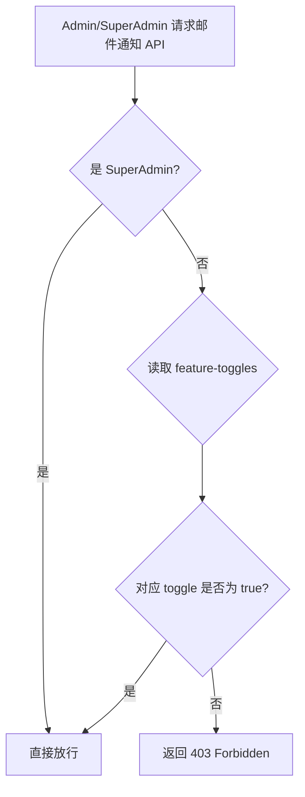
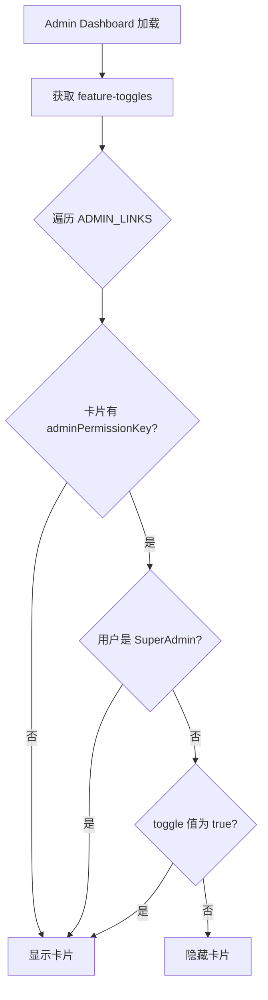
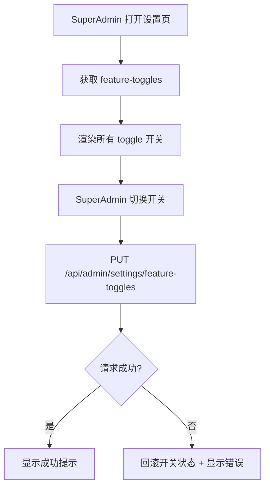

# Design Document: Admin Email Permission Toggles

## Overview

本设计为邮件通知触发页面（新商品邮件、新内容邮件）添加两个 SuperAdmin 可控的 Admin 权限开关：`adminEmailProductsEnabled` 和 `adminEmailContentEnabled`。设计完全复用已有的 `adminPermissionKey` 模式，与 `adminProductsEnabled`、`adminOrdersEnabled`、`adminContentReviewEnabled`、`adminCategoriesEnabled` 保持一致。

**关键设计决策：**
- **复用现有 feature-toggles 记录** — 新增两个布尔字段到 `userId = 'feature-toggles'` 的 DynamoDB 记录中，无需新建表或记录。
- **复用 `updateFeatureToggles` 的 `UpdateCommand` 模式** — 在现有 UpdateExpression 中追加两个字段，保持原子更新。
- **复用 `adminPermissionKey` 前端模式** — 在 `ADMIN_LINKS` 数组中为 email 卡片添加 `adminPermissionKey` 属性，dashboard 过滤逻辑自动生效。
- **后端权限检查在路由级别** — 在 `handleSendProductNotification` 和 `handleSendContentNotification` 中添加 SuperAdmin 旁路 + toggle 检查，与现有 `adminProductsEnabled` 检查模式一致。
- **默认值为 false** — 新开关默认关闭，仅 SuperAdmin 可以开启，确保最小权限原则。

## Architecture

### Permission Check Flow



### Dashboard Card Visibility Flow



### Settings Page Toggle Flow



## Components and Interfaces

### 1. Feature Toggles 数据层 (`packages/backend/src/settings/feature-toggles.ts`)

**修改内容：**

- `FeatureToggles` 接口新增两个字段：
  ```typescript
  adminEmailProductsEnabled: boolean;   // 默认 false
  adminEmailContentEnabled: boolean;    // 默认 false
  ```

- `UpdateFeatureTogglesInput` 接口新增对应字段。

- `getFeatureToggles` 函数：读取时对新字段使用 `=== true` 判断（缺失时默认 false）。

- `updateFeatureToggles` 函数：
  - 验证新字段为 boolean 类型。
  - 在 `UpdateCommand` 的 `UpdateExpression` 中追加两个 SET 子句。
  - 在 `ExpressionAttributeValues` 中追加对应值。

- `DEFAULT_TOGGLES` 常量：新增两个字段，默认值为 `false`。

### 2. Admin Handler 权限检查 (`packages/backend/src/admin/handler.ts`)

**修改内容：**

- `handleSendProductNotification`：在现有 `emailNewProductEnabled` 检查之后，添加 Admin 权限检查：
  ```
  如果不是 SuperAdmin → 读取 toggles → adminEmailProductsEnabled 为 false → 返回 403
  ```

- `handleSendContentNotification`：同上模式，检查 `adminEmailContentEnabled`。

### 3. Admin Dashboard (`packages/frontend/src/pages/admin/index.tsx`)

**修改内容：**

- 在 `ADMIN_LINKS` 数组中，为 `email-products` 和 `email-content` 卡片添加 `adminPermissionKey` 属性：
  ```typescript
  { key: 'email-products', ..., adminPermissionKey: 'adminEmailProductsEnabled' as const }
  { key: 'email-content', ..., adminPermissionKey: 'adminEmailContentEnabled' as const }
  ```

- 更新 `featureToggles` 状态类型和 fetch 请求，包含新字段。

- 现有的 `.filter()` 逻辑已支持 `adminPermissionKey` 模式，无需修改过滤逻辑。

### 4. Settings Page (`packages/frontend/src/pages/admin/settings.tsx`)

**修改内容：**

- `FeatureToggles` 接口新增两个字段。
- 在 Admin 权限开关区域（`adminProductsEnabled` 等之后）添加两个新的 toggle 开关。
- `handleToggle` 函数的 PUT 请求 data 中包含新字段。
- 使用 i18n key：`admin.settings.adminEmailProductsLabel`、`admin.settings.adminEmailProductsDesc`、`admin.settings.adminEmailContentLabel`、`admin.settings.adminEmailContentDesc`。

### 5. 国际化 (`packages/frontend/src/i18n/`)

**修改内容：**

在所有 5 个语言文件（zh.ts, en.ts, ja.ts, ko.ts, zh-TW.ts）和 types.ts 中添加：

```typescript
// types.ts admin.settings 新增
adminEmailProductsLabel: string;
adminEmailProductsDesc: string;
adminEmailContentLabel: string;
adminEmailContentDesc: string;
```

| Key | zh | en | ja | ko | zh-TW |
|-----|----|----|----|----|-------|
| adminEmailProductsLabel | Admin 新商品邮件通知权限 | Admin Email Products Permission | Admin 新商品メール通知権限 | Admin 새 상품 이메일 알림 권한 | Admin 新商品郵件通知權限 |
| adminEmailProductsDesc | 允许 Admin 触发新商品邮件通知 | Allow Admin to trigger new product email notifications | Admin に新商品メール通知のトリガーを許可 | Admin이 새 상품 이메일 알림을 트리거할 수 있도록 허용 | 允許 Admin 觸發新商品郵件通知 |
| adminEmailContentLabel | Admin 新内容邮件通知权限 | Admin Email Content Permission | Admin 新コンテンツメール通知権限 | Admin 새 콘텐츠 이메일 알림 권한 | Admin 新內容郵件通知權限 |
| adminEmailContentDesc | 允许 Admin 触发新内容邮件通知 | Allow Admin to trigger new content email notifications | Admin に新コンテンツメール通知のトリガーを許可 | Admin이 새 콘텐츠 이메일 알림을 트리거할 수 있도록 허용 | 允許 Admin 觸發新內容郵件通知 |

## Data Models

### Feature Toggles Record (DynamoDB)

现有 `userId = 'feature-toggles'` 记录扩展：

| 字段 | 类型 | 默认值 | 说明 |
|------|------|--------|------|
| adminEmailProductsEnabled | boolean | false | Admin 是否可触发新商品邮件通知 |
| adminEmailContentEnabled | boolean | false | Admin 是否可触发新内容邮件通知 |

**向后兼容性：** 字段缺失时 `getFeatureToggles` 返回 `false`（使用 `=== true` 判断），与现有 `adminContentReviewEnabled`、`adminCategoriesEnabled` 模式一致。

### UpdateFeatureTogglesInput 扩展

```typescript
interface UpdateFeatureTogglesInput {
  // ... 现有字段 ...
  adminEmailProductsEnabled: boolean;
  adminEmailContentEnabled: boolean;
  updatedBy: string;
}
```

## Correctness Properties

*A property is a characteristic or behavior that should hold true across all valid executions of a system — essentially, a formal statement about what the system should do. Properties serve as the bridge between human-readable specifications and machine-verifiable correctness guarantees.*

### Property 1: Feature toggle round-trip preserves values

*For any* valid set of boolean values for `adminEmailProductsEnabled` and `adminEmailContentEnabled`, calling `updateFeatureToggles` with those values and then calling `getFeatureToggles` should return the same boolean values for both fields.

**Validates: Requirements 1.1, 1.2, 1.3, 1.4, 1.6**

### Property 2: Feature toggle validation rejects non-boolean inputs

*For any* input where `adminEmailProductsEnabled` or `adminEmailContentEnabled` is not a boolean type (string, number, null, undefined, object, array), `updateFeatureToggles` should return `{ success: false }` with an error.

**Validates: Requirements 1.5**

### Property 3: Email notification API permission matrix

*For any* combination of user role (Admin or SuperAdmin) and toggle state (true or false), the email notification API permission check should satisfy: (1) SuperAdmin is always allowed regardless of toggle state, (2) Admin is allowed if and only if the corresponding toggle is true, and (3) Admin is denied with 403 if the corresponding toggle is false.

**Validates: Requirements 2.1, 2.2, 2.3, 2.4, 2.5, 2.6**

### Property 4: Dashboard card visibility matrix

*For any* combination of user role (Admin or SuperAdmin) and toggle state (true or false), the email notification dashboard card visibility should satisfy: (1) SuperAdmin always sees both email cards regardless of toggle state, and (2) Admin sees an email card if and only if the corresponding toggle is true.

**Validates: Requirements 3.1, 3.2, 3.3**

## Error Handling

| 场景 | 处理方式 |
|------|----------|
| `getFeatureToggles` 读取失败 | 返回默认值（新字段为 false），安全降级 |
| `updateFeatureToggles` 输入非 boolean | 返回 `{ success: false, error: { code: 'INVALID_REQUEST' } }` |
| Admin 调用邮件 API 但 toggle 为 false | 返回 403 Forbidden |
| 前端 toggle 保存失败 | 回滚 UI 状态到之前的值，显示错误提示 |
| 前端获取 feature-toggles 失败 | Dashboard 默认显示所有卡片（安全降级） |
| DynamoDB 记录缺少新字段 | `getFeatureToggles` 使用 `=== true` 判断，缺失字段返回 false |

## Testing Strategy

### Property-Based Tests (PBT)

使用 `fast-check` 库，每个 property test 至少运行 100 次迭代。

- **Property 1 (Round-trip)**: 生成随机 boolean 值组合，调用 update 后 get，验证值一致。使用 mock DynamoDB client。
  - Tag: `Feature: admin-email-permission, Property 1: Feature toggle round-trip preserves values`

- **Property 2 (Validation)**: 生成随机非 boolean 类型值（string, number, null, object），验证 update 返回失败。
  - Tag: `Feature: admin-email-permission, Property 2: Feature toggle validation rejects non-boolean inputs`

- **Property 3 (Permission matrix)**: 生成随机 role (Admin/SuperAdmin) × toggle state (true/false) 组合，验证 API 权限判断正确。
  - Tag: `Feature: admin-email-permission, Property 3: Email notification API permission matrix`

- **Property 4 (Card visibility)**: 生成随机 role × toggle state 组合，验证 dashboard 卡片过滤逻辑正确。
  - Tag: `Feature: admin-email-permission, Property 4: Dashboard card visibility matrix`

### Unit Tests (Example-Based)

- 验证 `getFeatureToggles` 在记录缺少新字段时返回 false 默认值。
- 验证 Settings 页面 PUT 请求包含新字段。
- 验证公开 API 响应包含新字段。
- 验证 i18n key 在所有 5 个语言文件中存在。

### Integration Points

- 验证 `ADMIN_LINKS` 中 email 卡片的 `adminPermissionKey` 与 `featureToggles` 状态类型匹配。
- 验证 `handleToggle` 发送的 PUT data 包含所有必需字段（包括新字段）。
