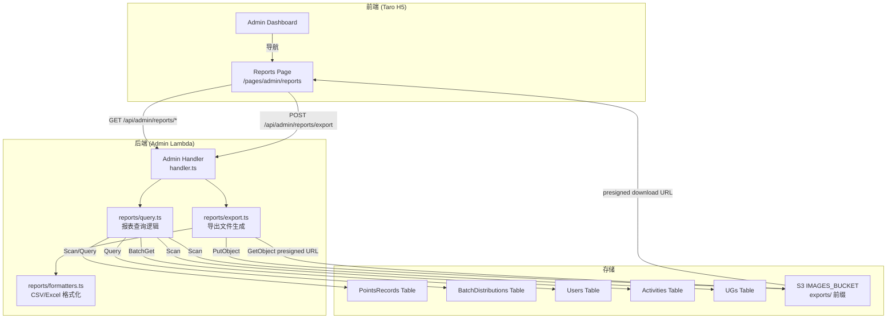

# 设计文档：SuperAdmin 报表与数据导出（Admin Reports Export）

## Overview

本功能为 SuperAdmin 提供四类报表的查询、展示和导出能力：积分明细、UG 活跃度汇总、用户积分排行、活动积分汇总。所有报表 API 仅 SuperAdmin 可访问（403 for non-SuperAdmin）。

### 关键设计决策

1. **DynamoDB 查询策略**：PointsRecords 表没有以 createdAt 为分区键的 GSI，但有 `type-createdAt-index`（PK=type, SK=createdAt）。积分明细报表使用该 GSI 按 type 查询（当指定 type 时）或 Scan + FilterExpression（当 type=all 时）。聚合报表（UG 汇总、用户排行、活动汇总）均需全量扫描后在 Lambda 内存中聚合。
2. **导出架构**：Lambda 内生成 CSV/Excel 文件 → 上传至 S3（IMAGES_BUCKET）的 `exports/` 前缀下 → 生成 30 分钟有效期的预签名下载 URL → 返回给前端。
3. **SheetJS (xlsx)**：在 backend package 中安装 `xlsx` npm 包用于 Excel 生成。CSV 使用字符串拼接 + UTF-8 BOM 编码。
4. **大数据量保护**：单次导出最大 50,000 条记录；Lambda 执行时间接近超时（预留 1 分钟缓冲）时中止。
5. **前端 Tab 架构**：4 个 Tab 各自维护独立的筛选状态，切换 Tab 不丢失已设置的筛选条件。
6. **复用现有 Admin Lambda**：报表路由注册在 Admin Handler 中，利用已有的 DynamoDB 全表读取权限和 S3 权限（需扩展 exports/ 前缀）。

## Architecture



### 请求流程

1. **报表查询**：前端 GET `/api/admin/reports/{reportType}` → Admin Handler → SuperAdmin 权限校验 → `query.ts` 查询 + 聚合 → 返回 JSON 数据
2. **报表导出**：前端 POST `/api/admin/reports/export` → Admin Handler → SuperAdmin 权限校验 → `query.ts` 查询完整数据集 → `formatters.ts` 生成 CSV/Excel Buffer → `export.ts` 上传 S3 + 生成预签名 URL → 返回 URL

## Components and Interfaces

### Backend Module: `packages/backend/src/reports/query.ts`

```typescript
/** 积分明细筛选条件 */
export interface PointsDetailFilter {
  startDate?: string;   // ISO 8601
  endDate?: string;     // ISO 8601
  ugName?: string;      // activityUG
  targetRole?: string;  // UserGroupLeader | Speaker | Volunteer
  activityId?: string;
  type?: 'earn' | 'spend' | 'all'; // 默认 all
  pageSize?: number;    // 默认 20，最大 100
  lastKey?: string;     // base64 编码的分页游标
}

/** 积分明细记录（已关联用户昵称和发放者昵称） */
export interface PointsDetailRecord {
  recordId: string;
  createdAt: string;
  userId: string;
  nickname: string;
  amount: number;
  type: 'earn' | 'spend';
  source: string;
  activityUG: string;
  activityTopic: string;
  activityId: string;
  targetRole: string;
  distributorNickname: string;
}

/** 积分明细查询结果 */
export interface PointsDetailResult {
  success: boolean;
  records?: PointsDetailRecord[];
  lastKey?: string;
  error?: { code: string; message: string };
}

/** 查询积分明细报表 */
export async function queryPointsDetail(
  filter: PointsDetailFilter,
  dynamoClient: DynamoDBDocumentClient,
  tables: { pointsRecordsTable: string; usersTable: string; batchDistributionsTable: string },
): Promise<PointsDetailResult>;

/** UG 活跃度汇总筛选条件 */
export interface UGActivityFilter {
  startDate?: string;
  endDate?: string;
}

/** UG 活跃度汇总记录 */
export interface UGActivitySummaryRecord {
  ugName: string;
  activityCount: number;
  totalPoints: number;
  participantCount: number;
}

/** UG 活跃度汇总查询结果 */
export interface UGActivitySummaryResult {
  success: boolean;
  records?: UGActivitySummaryRecord[];
  error?: { code: string; message: string };
}

/** 查询 UG 活跃度汇总报表 */
export async function queryUGActivitySummary(
  filter: UGActivityFilter,
  dynamoClient: DynamoDBDocumentClient,
  tables: { pointsRecordsTable: string },
): Promise<UGActivitySummaryResult>;

/** 用户积分排行筛选条件 */
export interface UserRankingFilter {
  startDate?: string;
  endDate?: string;
  targetRole?: string; // UserGroupLeader | Speaker | Volunteer | all
  pageSize?: number;   // 默认 50，最大 100
  lastKey?: string;
}

/** 用户积分排行记录 */
export interface UserRankingRecord {
  rank: number;
  userId: string;
  nickname: string;
  totalEarnPoints: number;
  targetRole: string;
}

/** 用户积分排行查询结果 */
export interface UserRankingResult {
  success: boolean;
  records?: UserRankingRecord[];
  lastKey?: string;
  error?: { code: string; message: string };
}

/** 查询用户积分排行报表 */
export async function queryUserPointsRanking(
  filter: UserRankingFilter,
  dynamoClient: DynamoDBDocumentClient,
  tables: { pointsRecordsTable: string; usersTable: string },
): Promise<UserRankingResult>;

/** 活动积分汇总筛选条件 */
export interface ActivitySummaryFilter {
  startDate?: string;
  endDate?: string;
  ugName?: string;
}

/** 活动积分汇总记录 */
export interface ActivitySummaryRecord {
  activityId: string;
  activityTopic: string;
  activityDate: string;
  activityUG: string;
  totalPoints: number;
  participantCount: number;
  uglCount: number;
  speakerCount: number;
  volunteerCount: number;
}

/** 活动积分汇总查询结果 */
export interface ActivitySummaryResult {
  success: boolean;
  records?: ActivitySummaryRecord[];
  error?: { code: string; message: string };
}

/** 查询活动积分汇总报表 */
export async function queryActivityPointsSummary(
  filter: ActivitySummaryFilter,
  dynamoClient: DynamoDBDocumentClient,
  tables: { pointsRecordsTable: string },
): Promise<ActivitySummaryResult>;
```

### Backend Module: `packages/backend/src/reports/formatters.ts`

```typescript
/** 导出格式 */
export type ExportFormat = 'csv' | 'xlsx';

/** 报表类型 */
export type ReportType = 'points-detail' | 'ug-activity-summary' | 'user-points-ranking' | 'activity-points-summary';

/** 列定义 */
export interface ColumnDef {
  key: string;
  label: string; // 中文列名
}

/** 获取报表列定义 */
export function getColumnDefs(reportType: ReportType): ColumnDef[];

/** 生成 CSV Buffer（UTF-8 BOM + 逗号分隔） */
export function generateCSV(records: Record<string, unknown>[], columns: ColumnDef[]): Buffer;

/** 生成 Excel Buffer（使用 SheetJS xlsx 库） */
export function generateExcel(records: Record<string, unknown>[], columns: ColumnDef[], sheetName: string): Buffer;

/** 将积分明细记录格式化为导出行 */
export function formatPointsDetailForExport(records: PointsDetailRecord[]): Record<string, unknown>[];

/** 将 UG 汇总记录格式化为导出行 */
export function formatUGSummaryForExport(records: UGActivitySummaryRecord[]): Record<string, unknown>[];

/** 将用户排行记录格式化为导出行 */
export function formatUserRankingForExport(records: UserRankingRecord[]): Record<string, unknown>[];

/** 将活动汇总记录格式化为导出行 */
export function formatActivitySummaryForExport(records: ActivitySummaryRecord[]): Record<string, unknown>[];
```

### Backend Module: `packages/backend/src/reports/export.ts`

```typescript
/** 导出请求输入 */
export interface ExportInput {
  reportType: ReportType;
  format: ExportFormat;
  filters: Record<string, string>; // 与查询接口相同的筛选条件
}

/** 导出结果 */
export interface ExportResult {
  success: boolean;
  downloadUrl?: string;
  error?: { code: string; message: string };
}

/** 执行报表导出 */
export async function executeExport(
  input: ExportInput,
  dynamoClient: DynamoDBDocumentClient,
  s3Client: S3Client,
  tables: {
    pointsRecordsTable: string;
    usersTable: string;
    batchDistributionsTable: string;
  },
  bucket: string,
  lambdaStartTime?: number, // 用于超时检测
): Promise<ExportResult>;

/** 验证导出请求 */
export function validateExportInput(body: unknown): { valid: boolean; error?: { code: string; message: string } };
```

### Admin Handler Routes (additions to `handler.ts`)

| Method | Path | Handler | Permission |
|--------|------|---------|------------|
| GET | `/api/admin/reports/points-detail` | `handlePointsDetailReport` | SuperAdmin |
| GET | `/api/admin/reports/ug-activity-summary` | `handleUGActivitySummary` | SuperAdmin |
| GET | `/api/admin/reports/user-points-ranking` | `handleUserPointsRanking` | SuperAdmin |
| GET | `/api/admin/reports/activity-points-summary` | `handleActivityPointsSummary` | SuperAdmin |
| POST | `/api/admin/reports/export` | `handleReportExport` | SuperAdmin |

所有路由在 handler.ts 中注册，使用现有的 `{proxy+}` 代理模式，无需在 CDK 中新增 API Gateway 路由。

### Frontend Page: `packages/frontend/src/pages/admin/reports.tsx`

```typescript
/** Tab 类型 */
type ReportTab = 'points-detail' | 'ug-activity' | 'user-ranking' | 'activity-summary';

/** 各 Tab 独立的筛选状态 */
interface TabFilterState {
  'points-detail': {
    startDate: string;
    endDate: string;
    ugName: string;
    targetRole: string;
    activityId: string;
    type: string;
  };
  'ug-activity': {
    startDate: string;
    endDate: string;
  };
  'user-ranking': {
    startDate: string;
    endDate: string;
    targetRole: string;
  };
  'activity-summary': {
    startDate: string;
    endDate: string;
    ugName: string;
  };
}
```

**组件结构**：

```
ReportsPage
├── TabBar (4 个 Tab 切换)
├── FilterPanel (根据当前 Tab 渲染不同筛选控件)
│   ├── DateRangePicker (所有 Tab 共用)
│   ├── UGSelector (积分明细、活动汇总)
│   ├── RoleSelector (积分明细、用户排行)
│   ├── ActivitySelector (积分明细)
│   └── TypeSelector (积分明细)
├── ExportButtons (CSV / Excel)
├── DataTable (根据当前 Tab 渲染不同列)
└── LoadMore / ScrollLoader
```

### Admin Dashboard Navigation

在 `packages/frontend/src/pages/admin/index.tsx` 的 `ADMIN_LINKS` 数组中新增：

```typescript
{
  key: 'reports',
  category: 'operations',
  icon: ClockIcon, // 复用现有图标
  titleKey: 'admin.dashboard.reportsTitle',
  descKey: 'admin.dashboard.reportsDesc',
  url: '/pages/admin/reports',
  superAdminOnly: true,
}
```

## Data Models

### DynamoDB 查询策略

#### 积分明细报表（Points Detail）

**场景 1：指定 type（earn 或 spend）**
- 使用 `type-createdAt-index` GSI（PK=type, SK=createdAt）
- KeyConditionExpression: `type = :type AND createdAt BETWEEN :start AND :end`
- FilterExpression: 根据 ugName、targetRole、activityId 动态构建

**场景 2：type=all 或未指定**
- 使用 `type-createdAt-index` GSI 分别查询 type='earn' 和 type='spend'，合并结果
- 或使用 Table Scan + FilterExpression（当筛选条件较多时）
- 推荐方案：分别查询 earn 和 spend 两次 GSI Query，合并后排序，避免全表 Scan

**数据关联**：
- 用户昵称：收集查询结果中的 userId 集合 → BatchGetCommand 从 Users 表获取 nickname
- 发放者昵称：对于 earn 类型记录，通过 activityId + targetRole 查询 BatchDistributions 表获取 distributorNickname

#### UG 活跃度汇总报表

- 使用 `type-createdAt-index` GSI 查询 type='earn' 的记录（仅统计获取积分）
- KeyConditionExpression: `type = :earn AND createdAt BETWEEN :start AND :end`
- 在 Lambda 内存中按 activityUG 分组聚合：
  - `activityCount`: 每个 UG 下不同 activityId 的数量
  - `totalPoints`: 每个 UG 下所有 amount 的总和
  - `participantCount`: 每个 UG 下不同 userId 的数量
- 按 totalPoints 倒序排列

#### 用户积分排行报表

- 使用 `type-createdAt-index` GSI 查询 type='earn' 的记录
- 可选 FilterExpression: targetRole 筛选
- 在 Lambda 内存中按 userId 分组聚合 totalEarnPoints
- BatchGetCommand 从 Users 表获取 nickname
- 按 totalEarnPoints 倒序排列，添加 rank 序号
- 分页：在聚合排序后的数组上做内存分页（offset-based）

#### 活动积分汇总报表

- 使用 `type-createdAt-index` GSI 查询 type='earn' 的记录
- 可选 FilterExpression: activityUG 筛选
- 在 Lambda 内存中按 activityId 分组聚合：
  - `totalPoints`: 该活动所有 amount 总和
  - `participantCount`: 不同 userId 数量
  - `uglCount/speakerCount/volunteerCount`: 按 targetRole 分组统计不同 userId 数量
  - `activityTopic/activityDate/activityUG`: 取自记录字段
- 按 activityDate 倒序排列

### 导出文件存储

| 属性 | 说明 |
|------|------|
| S3 前缀 | `exports/{reportType}/` |
| 文件名格式 | `{timestamp}_{randomId}.{csv\|xlsx}` |
| 示例 | `exports/points-detail/20240115_abc123.xlsx` |
| 预签名 URL 有效期 | 30 分钟 |
| 生命周期策略 | 建议添加 7 天自动过期规则清理导出文件 |

### 导出列定义

**积分明细报表**：

| 列名（中文） | 字段 key | 说明 |
|-------------|---------|------|
| 时间 | createdAt | 格式化为 YYYY-MM-DD HH:mm:ss |
| 用户昵称 | nickname | 关联 Users 表 |
| 积分数额 | amount | |
| 类型 | type | 显示为"获取"或"消费" |
| 来源 | source | |
| 所属 UG | activityUG | |
| 活动主题 | activityTopic | |
| 目标身份 | targetRole | |
| 发放者昵称 | distributorNickname | 关联 BatchDistributions 表 |

**UG 活跃度汇总报表**：

| 列名（中文） | 字段 key |
|-------------|---------|
| UG 名称 | ugName |
| 活动数量 | activityCount |
| 发放积分总额 | totalPoints |
| 参与人数 | participantCount |

**用户积分排行报表**：

| 列名（中文） | 字段 key |
|-------------|---------|
| 排名 | rank |
| 用户昵称 | nickname |
| 用户 ID | userId |
| 获取积分总额 | totalEarnPoints |
| 身份 | targetRole |

**活动积分汇总报表**：

| 列名（中文） | 字段 key |
|-------------|---------|
| 活动主题 | activityTopic |
| 活动日期 | activityDate |
| 所属 UG | activityUG |
| 发放积分总额 | totalPoints |
| 涉及人数 | participantCount |
| UGL 人数 | uglCount |
| Speaker 人数 | speakerCount |
| Volunteer 人数 | volunteerCount |

## Correctness Properties

*A property is a characteristic or behavior that should hold true across all valid executions of a system — essentially, a formal statement about what the system should do. Properties serve as the bridge between human-readable specifications and machine-verifiable correctness guarantees.*

### Property 1: SuperAdmin permission check

*For any* user with an arbitrary set of roles, the report API permission check should grant access if and only if the roles array contains 'SuperAdmin'. All other role combinations should be denied with HTTP 403.

**Validates: Requirements 1.1**

### Property 2: Points detail filter correctness

*For any* array of PointsRecord objects and any combination of filter parameters (startDate, endDate, ugName, targetRole, activityId, type), the filtered result should contain exactly those records that match ALL active filter criteria simultaneously, and no records that fail any active filter criterion.

**Validates: Requirements 2.2, 4.2, 6.2, 8.2**

### Property 3: Report output sorting correctness

*For any* non-empty array of report records, the output should be sorted in the specified order: points detail by createdAt descending, UG summary by totalPoints descending, user ranking by totalEarnPoints descending, activity summary by activityDate descending. For each pair of adjacent elements, the sort key of the first element should be greater than or equal to the sort key of the second element.

**Validates: Requirements 2.3, 4.3, 6.3, 8.3**

### Property 4: Pagination pageSize clamping

*For any* requested pageSize value (including undefined, negative, zero, and values exceeding 100), the effective pageSize should be clamped to the range [1, 100], defaulting to 20 when undefined. For user ranking, the default is 50.

**Validates: Requirements 2.4, 6.4**

### Property 5: UG aggregation correctness

*For any* array of earn-type PointsRecord objects, the UG activity summary aggregation should produce one record per unique activityUG where: activityCount equals the number of distinct activityId values for that UG, totalPoints equals the sum of all amount values for that UG, and participantCount equals the number of distinct userId values for that UG.

**Validates: Requirements 4.1**

### Property 6: User ranking aggregation correctness

*For any* array of earn-type PointsRecord objects, the user ranking aggregation should produce one record per unique userId where totalEarnPoints equals the sum of all amount values for that user. The rank field should be a sequential integer starting from 1, assigned in descending order of totalEarnPoints.

**Validates: Requirements 6.1**

### Property 7: Activity aggregation correctness

*For any* array of earn-type PointsRecord objects, the activity summary aggregation should produce one record per unique activityId where: totalPoints equals the sum of all amount values for that activity, participantCount equals the number of distinct userId values, and uglCount/speakerCount/volunteerCount equal the number of distinct userId values per targetRole for that activity.

**Validates: Requirements 8.1**

### Property 8: CSV generation round-trip

*For any* array of record objects and column definitions, generating a CSV string and then parsing it back should produce the same number of data rows as the input array, and each parsed row should contain values matching the original record for every column.

**Validates: Requirements 10.2, 13.1, 13.3**

### Property 9: Export field completeness

*For any* report type and any non-empty array of records for that report type, the formatted export rows should contain all columns defined for that report type, and no column should have an undefined value for any record that has the corresponding source field populated.

**Validates: Requirements 13.1, 14.1, 15.1, 16.1**

## Error Handling

### Backend Error Codes

| Error Code | HTTP Status | Message | Trigger |
|------------|-------------|---------|---------|
| `FORBIDDEN` | 403 | 需要超级管理员权限 | 非 SuperAdmin 调用报表接口 |
| `INVALID_REQUEST` | 400 | 具体字段错误消息 | 请求参数格式无效（如日期格式错误） |
| `EXPORT_LIMIT_EXCEEDED` | 400 | 导出数据量超过限制，请缩小筛选范围 | 导出记录数超过 50,000 条 |
| `EXPORT_TIMEOUT` | 504 | 导出超时，请缩小筛选范围后重试 | Lambda 执行时间接近 15 分钟超时 |
| `INVALID_REPORT_TYPE` | 400 | 不支持的报表类型 | reportType 参数不在允许列表中 |
| `INVALID_EXPORT_FORMAT` | 400 | 不支持的导出格式 | format 参数不是 csv 或 xlsx |
| `INTERNAL_ERROR` | 500 | Internal server error | DynamoDB 查询失败、S3 上传失败等 |

### 前端错误处理

- API 请求失败：显示 Toast 提示具体错误消息
- 导出超限/超时：显示具体错误信息，引导用户缩小筛选范围
- 网络错误：显示通用错误提示
- 权限不足：重定向到管理后台首页

### 大数据量保护

```typescript
const MAX_EXPORT_RECORDS = 50_000;
const SCAN_PAGE_SIZE = 1_000;
const TIMEOUT_BUFFER_MS = 60_000; // 1 分钟缓冲

// 在导出循环中检查
function isApproachingTimeout(startTime: number): boolean {
  const elapsed = Date.now() - startTime;
  const maxDuration = 15 * 60 * 1000; // 15 minutes
  return elapsed >= maxDuration - TIMEOUT_BUFFER_MS;
}
```

## Testing Strategy

### 单元测试

使用 Vitest 进行单元测试，覆盖以下场景：

1. **权限校验**：测试 SuperAdmin 角色检查逻辑
2. **筛选逻辑**：测试各报表的 filter 函数对有效/无效筛选条件的处理
3. **聚合逻辑**：测试 UG 汇总、用户排行、活动汇总的聚合计算
4. **分页参数**：测试 pageSize 钳制和 lastKey 解析
5. **CSV 生成**：测试 CSV 格式化输出（BOM、列名、字段值）
6. **Excel 生成**：测试 xlsx 库调用和表头加粗样式
7. **导出验证**：测试 validateExportInput 对各种输入的处理
8. **默认日期范围**：测试未提供筛选条件时默认 30 天范围
9. **超时检测**：测试 isApproachingTimeout 函数
10. **记录数限制**：测试超过 50,000 条时返回 EXPORT_LIMIT_EXCEEDED

### 属性测试（Property-Based Testing）

使用 **fast-check** 库进行属性测试，每个属性测试运行最少 100 次迭代。

每个属性测试必须以注释标注对应的设计文档属性：
- 标签格式：`Feature: admin-reports-export, Property {number}: {property_text}`

属性测试覆盖 9 个核心属性：
1. SuperAdmin 权限检查正确性
2. 积分明细筛选条件正确性
3. 报表输出排序正确性
4. 分页 pageSize 范围钳制
5. UG 聚合计算正确性
6. 用户排行聚合计算正确性
7. 活动聚合计算正确性
8. CSV 生成 round-trip
9. 导出字段完整性

### 集成测试

- Admin Handler 路由测试：验证 5 个新增路由的请求转发和响应格式
- S3 导出测试：使用 mocked S3 验证文件上传和预签名 URL 生成
- CDK 合成测试：验证 S3 权限扩展（exports/ 前缀）

### CDK 变更

1. **S3 权限扩展**：在 `configureImagesBucket()` 中为 Admin Lambda 添加 `exports/*` 前缀的 `s3:PutObject` 和 `s3:GetObject` 权限
2. **Admin Lambda 超时**：导出操作可能耗时较长，需将 Admin Lambda 超时从 30 秒提升至 900 秒（15 分钟），或创建独立的 Export Lambda。推荐方案：保持 Admin Lambda 30 秒超时用于查询，新增一个 Export Lambda（15 分钟超时）专门处理导出请求
3. **Export Lambda**（可选优化）：如果导出操作频繁超时，可拆分为独立 Lambda，但初始版本可先在 Admin Lambda 中实现，通过 API Gateway 的 29 秒超时限制来决定是否需要拆分

> **注意**：API Gateway REST API 有 29 秒的集成超时限制。对于大数据量导出，需要考虑：
> - 方案 A（推荐）：Admin Lambda 中同步处理，依赖筛选条件缩小数据量使其在 29 秒内完成
> - 方案 B（备选）：异步导出 — 前端发起导出请求后轮询状态，Lambda 异步生成文件后写入状态
> 
> 初始版本采用方案 A，如果实际使用中频繁超时再迁移到方案 B。
