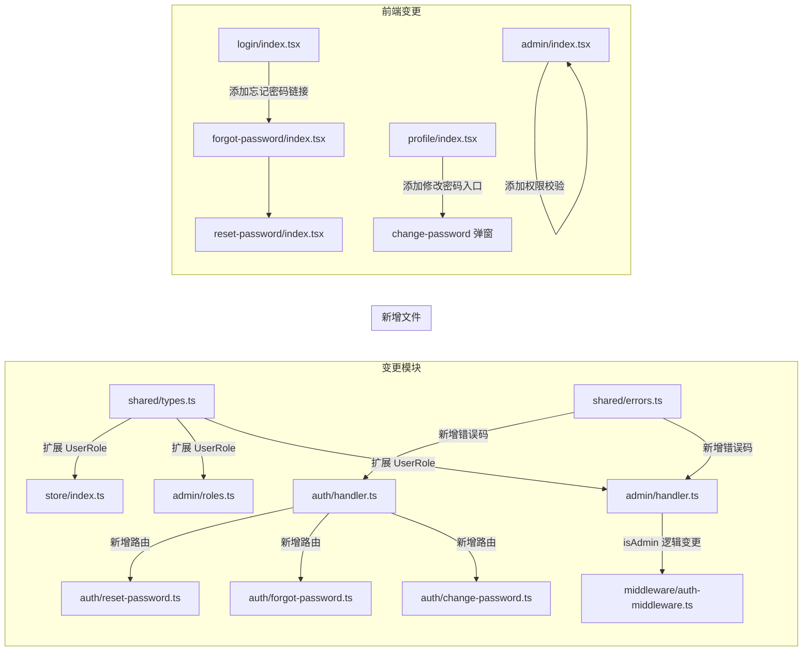

# 技术设计文档 - 管理角色与密码管理（Admin Roles & Password）

## 概述（Overview）

本设计为积分商城系统的增强功能，涵盖三个子特性：

1. **SuperAdmin + Admin 角色权限系统**：在现有四种普通角色基础上引入 Admin 和 SuperAdmin 两个管理角色，实现分级权限控制。SuperAdmin 为最高权限，仅可通过数据库直接设置；Admin 可管理商品、Code 和普通用户角色。
2. **修改密码**：已登录用户可在个人中心修改密码，需验证当前密码。
3. **忘记密码**：未登录用户可通过邮箱接收重置链接，使用一次性令牌设置新密码。

核心变更点：
- `UserRole` 类型从 4 种扩展为 6 种（新增 `Admin`、`SuperAdmin`）
- `isAdmin` 判断逻辑从"拥有任意角色"改为"拥有 Admin 或 SuperAdmin"
- 角色分配逻辑增加权限分级：Admin 只能分配普通角色，SuperAdmin 可分配 Admin 角色，SuperAdmin 角色不可通过 API 分配
- Auth Lambda 新增三个路由：change-password、forgot-password、reset-password
- Users 表新增 `resetToken` 和 `resetTokenExpiry` 字段

设计目标：
1. 最小化对现有代码的侵入，复用现有架构模式
2. 保持向后兼容：现有无管理角色的用户不受影响
3. 密码重置流程遵循安全最佳实践（防枚举、一次性令牌、过期机制）

---

## 架构（Architecture）

### 变更范围

本次增强不引入新的 Lambda 函数或 DynamoDB 表，仅在现有架构上扩展：



### 架构决策

| 决策 | 选择 | 理由 |
|------|------|------|
| 重置令牌存储 | Users 表新增字段 | 避免新建表，重置令牌与用户 1:1 关联，直接存在用户记录中 |
| 重置令牌格式 | ULID | 与现有 verificationToken 保持一致，全局唯一且包含时间信息 |
| 密码哈希 | bcryptjs（复用现有） | 已在注册和登录中使用，保持一致 |
| SuperAdmin 设置方式 | 种子脚本 + DynamoDB 直接操作 | 最高权限角色不应通过 API 暴露，降低攻击面 |
| 角色分类 | 代码常量定义 | 在 shared 包中定义 `ADMIN_ROLES` 和 `REGULAR_ROLES` 常量，便于复用 |

---

## 组件与接口（Components and Interfaces）

### 1. 角色权限变更

#### 1.1 类型扩展（packages/shared/src/types.ts）

```typescript
/** 用户角色类型（扩展后） */
export type UserRole = 'UserGroupLeader' | 'CommunityBuilder' | 'Speaker' | 'Volunteer' | 'Admin' | 'SuperAdmin';

/** 管理角色 */
export const ADMIN_ROLES: UserRole[] = ['Admin', 'SuperAdmin'];

/** 普通角色 */
export const REGULAR_ROLES: UserRole[] = ['UserGroupLeader', 'CommunityBuilder', 'Speaker', 'Volunteer'];

/** 判断是否为管理角色 */
export function isAdminRole(role: UserRole): boolean {
  return ADMIN_ROLES.includes(role);
}

/** 判断用户是否拥有管理权限 */
export function hasAdminAccess(roles: UserRole[]): boolean {
  return roles.some(r => ADMIN_ROLES.includes(r));
}

/** 判断用户是否为 SuperAdmin */
export function isSuperAdmin(roles: UserRole[]): boolean {
  return roles.includes('SuperAdmin');
}
```

#### 1.2 错误码扩展（packages/shared/src/errors.ts）

新增错误码：

| HTTP 状态码 | 错误码 | 描述 |
|-------------|--------|------|
| 400 | `INVALID_CURRENT_PASSWORD` | 当前密码错误 |
| 400 | `RESET_TOKEN_EXPIRED` | 重置链接已过期 |
| 400 | `RESET_TOKEN_INVALID` | 重置链接无效 |
| 403 | `SUPERADMIN_ASSIGN_FORBIDDEN` | 禁止通过 API 分配 SuperAdmin 角色 |
| 403 | `ADMIN_ROLE_REQUIRES_SUPERADMIN` | 仅 SuperAdmin 可分配/撤销管理角色 |
| 403 | `FORBIDDEN` | 需要管理员权限 |

#### 1.3 isAdmin 逻辑变更（packages/backend/src/admin/handler.ts）

```typescript
// 变更前
function isAdmin(event: AuthenticatedEvent): boolean {
  return event.user.roles.length > 0;
}

// 变更后
function isAdmin(event: AuthenticatedEvent): boolean {
  return event.user.roles.some(r => r === 'Admin' || r === 'SuperAdmin');
}
```

#### 1.4 角色分配权限分级（packages/backend/src/admin/roles.ts）

角色分配逻辑增加权限校验：

```typescript
// 分配角色时的权限校验
function validateRoleAssignment(callerRoles: string[], targetRoles: string[]): RoleOperationResult {
  // 禁止分配 SuperAdmin
  if (targetRoles.includes('SuperAdmin')) {
    return { success: false, error: { code: 'SUPERADMIN_ASSIGN_FORBIDDEN', message: '禁止通过 API 分配 SuperAdmin 角色' } };
  }
  // 分配 Admin 需要 SuperAdmin 权限
  if (targetRoles.includes('Admin') && !callerRoles.includes('SuperAdmin')) {
    return { success: false, error: { code: 'ADMIN_ROLE_REQUIRES_SUPERADMIN', message: '仅 SuperAdmin 可分配管理角色' } };
  }
  return { success: true };
}
```

### 2. 密码管理接口

#### 2.1 修改密码（POST /api/auth/change-password）

需要认证（JWT）。

```typescript
interface ChangePasswordRequest {
  currentPassword: string;
  newPassword: string;
}

// 成功响应: 200 { message: '密码修改成功' }
// 错误响应: 400 INVALID_CURRENT_PASSWORD | 400 INVALID_PASSWORD_FORMAT
```

流程：
1. 从 JWT 获取 userId
2. 从 Users 表读取用户记录（获取 passwordHash）
3. 使用 bcryptjs.compare 验证 currentPassword
4. 使用 validatePassword 验证 newPassword 格式
5. 使用 bcryptjs.hash 生成新哈希
6. 更新 Users 表的 passwordHash

#### 2.2 忘记密码 - 请求重置（POST /api/auth/forgot-password）

无需认证。

```typescript
interface ForgotPasswordRequest {
  email: string;
}

// 成功响应: 200 { message: '如果该邮箱已注册，重置邮件已发送' }
// 注意：无论邮箱是否存在都返回相同响应（防枚举）
```

流程：
1. 通过 email-index GSI 查询用户
2. 如果用户不存在，仍返回成功响应（防枚举）
3. 生成 ULID 作为 resetToken
4. 将 resetToken 和 resetTokenExpiry（当前时间 + 1 小时）写入用户记录
5. 通过 SES 发送包含重置链接的邮件

#### 2.3 忘记密码 - 执行重置（POST /api/auth/reset-password）

无需认证。

```typescript
interface ResetPasswordRequest {
  token: string;
  newPassword: string;
}

// 成功响应: 200 { message: '密码重置成功' }
// 错误响应: 400 RESET_TOKEN_EXPIRED | 400 RESET_TOKEN_INVALID | 400 INVALID_PASSWORD_FORMAT
```

流程：
1. 使用 Scan 或 GSI 查找拥有该 resetToken 的用户
2. 校验 resetTokenExpiry 是否未过期
3. 使用 validatePassword 验证 newPassword 格式
4. 使用 bcryptjs.hash 生成新哈希
5. 更新 Users 表：设置新 passwordHash，清除 resetToken 和 resetTokenExpiry，重置 loginFailCount 为 0，移除 lockUntil

### 3. API 路由变更

#### Auth Lambda 新增路由

| 方法 | 路径 | 认证 | 描述 |
|------|------|------|------|
| POST | `/api/auth/change-password` | 需要 JWT | 修改密码 |
| POST | `/api/auth/forgot-password` | 无需认证 | 请求密码重置 |
| POST | `/api/auth/reset-password` | 无需认证 | 执行密码重置 |

#### CDK 路由配置新增

```typescript
// 在 auth 资源下新增
auth.addResource('change-password').addMethod('POST', authInt);
auth.addResource('forgot-password').addMethod('POST', authInt);
auth.addResource('reset-password').addMethod('POST', authInt);
```

### 4. 前端变更

#### 4.1 Store 类型更新（packages/frontend/src/store/index.ts）

```typescript
export type UserRole = 'UserGroupLeader' | 'CommunityBuilder' | 'Speaker' | 'Volunteer' | 'Admin' | 'SuperAdmin';
```

新增 store 方法：
- `changePassword(currentPassword, newPassword)`: 调用修改密码 API
- `forgotPassword(email)`: 调用忘记密码 API
- `resetPassword(token, newPassword)`: 调用重置密码 API

#### 4.2 管理面板权限校验（packages/frontend/src/pages/admin/index.tsx）

```typescript
// 变更前：无权限校验
// 变更后：
const hasAdminAccess = user?.roles?.some(r => r === 'Admin' || r === 'SuperAdmin');
if (!hasAdminAccess) {
  Taro.redirectTo({ url: '/pages/index/index' });
}
```

#### 4.3 新增页面

- `pages/forgot-password/index.tsx`: 忘记密码页面（输入邮箱）
- `pages/reset-password/index.tsx`: 重置密码页面（输入新密码，URL 含 token 参数）
- `pages/profile/index.tsx` 中新增修改密码功能区域

#### 4.4 登录页面变更

在登录表单底部添加"忘记密码？"链接，跳转到忘记密码页面。

### 5. 种子脚本更新（scripts/seed.ts）

新增 SuperAdmin 设置功能：

```typescript
async function setupSuperAdmin(userId: string) {
  await client.send(new UpdateCommand({
    TableName: 'PointsMall-Users',
    Key: { userId },
    UpdateExpression: 'ADD #roles :roles SET updatedAt = :now',
    ExpressionAttributeNames: { '#roles': 'roles' },
    ExpressionAttributeValues: {
      ':roles': new Set(['SuperAdmin']),
      ':now': new Date().toISOString(),
    },
  }));
}
```

---

## 数据模型（Data Models）

### Users 表变更

在现有 Users 表基础上新增以下字段：

| 属性 | 类型 | 说明 |
|------|------|------|
| `resetToken` | String | 密码重置令牌（ULID），使用后删除 |
| `resetTokenExpiry` | Number | 重置令牌过期时间戳（毫秒），当前时间 + 3600000 |

`roles` StringSet 字段现在可包含 `Admin` 和 `SuperAdmin` 值。

无需新建 GSI。resetToken 查询使用 Scan + FilterExpression（与现有 verificationToken 查询模式一致），在 DAU < 1000 场景下性能可接受。

### 角色数据结构

```typescript
// 角色分类常量
const ADMIN_ROLES = ['Admin', 'SuperAdmin'] as const;
const REGULAR_ROLES = ['UserGroupLeader', 'CommunityBuilder', 'Speaker', 'Volunteer'] as const;
const ALL_ROLES = [...REGULAR_ROLES, ...ADMIN_ROLES] as const;
```

### 角色权限矩阵

| 操作 | 普通用户 | Admin | SuperAdmin |
|------|----------|-------|------------|
| 访问管理面板 | ❌ | ✅ | ✅ |
| 管理商品 | ❌ | ✅ | ✅ |
| 管理 Code | ❌ | ✅ | ✅ |
| 分配普通角色 | ❌ | ✅ | ✅ |
| 撤销普通角色 | ❌ | ✅ | ✅ |
| 分配 Admin 角色 | ❌ | ❌ | ✅ |
| 撤销 Admin 角色 | ❌ | ❌ | ✅ |
| 分配 SuperAdmin 角色 | ❌ | ❌ | ❌（仅数据库） |


---

## 正确性属性（Correctness Properties）

*属性（Property）是指在系统所有有效执行中都应成立的特征或行为——本质上是对系统应做什么的形式化陈述。属性是人类可读规范与机器可验证正确性保证之间的桥梁。*

### Property 1: 管理员判断逻辑正确性

*对于任何*用户角色集合，`hasAdminAccess` 函数应返回 `true` 当且仅当该集合包含 `'Admin'` 或 `'SuperAdmin'`。仅包含普通角色（UserGroupLeader、CommunityBuilder、Speaker、Volunteer）的集合应返回 `false`，空集合也应返回 `false`。

**Validates: Requirements 4.1, 4.2, 5.1, 5.2, 5.3, 5.4**

### Property 2: SuperAdmin 角色禁止通过 API 分配

*对于任何*调用者角色集合（包括 SuperAdmin 自身），通过角色分配 API 尝试分配 `SuperAdmin` 角色应始终被拒绝，并返回 `SUPERADMIN_ASSIGN_FORBIDDEN` 错误码。

**Validates: Requirements 2.1, 2.3**

### Property 3: SuperAdmin 分配/撤销 Admin 角色的往返一致性

*对于任何*目标用户，当 SuperAdmin 为其分配 Admin 角色后，该用户的角色列表应包含 `Admin`；随后撤销 Admin 角色后，该用户的角色列表应不再包含 `Admin`，且其他已有角色不受影响。

**Validates: Requirements 3.1, 3.2**

### Property 4: 非 SuperAdmin 用户无法分配或撤销管理角色

*对于任何*不包含 `SuperAdmin` 的调用者角色集合（包括仅有 `Admin` 的用户），尝试分配或撤销 `Admin` 角色应被拒绝，并返回 `ADMIN_ROLE_REQUIRES_SUPERADMIN` 错误码。

**Validates: Requirements 3.3, 3.4, 4.6**

### Property 5: 修改密码往返正确性

*对于任何*用户和任何符合规则的新密码，使用正确的当前密码调用修改密码接口后，使用新密码应能通过 bcrypt 验证（即 `bcrypt.compare(newPassword, updatedHash)` 返回 `true`）。

**Validates: Requirements 6.2**

### Property 6: 错误的当前密码被拒绝

*对于任何*用户和任何与当前密码不同的字符串作为 `currentPassword`，修改密码请求应被拒绝并返回 `INVALID_CURRENT_PASSWORD` 错误码，且用户的密码哈希不变。

**Validates: Requirements 6.3**

### Property 7: 忘记密码防枚举响应

*对于任何*邮箱地址（无论是否已注册），忘记密码接口应返回相同的 HTTP 状态码（200）和相同结构的成功响应，不泄露邮箱是否存在的信息。

**Validates: Requirements 7.5**

### Property 8: 重复请求重置使旧令牌失效

*对于任何*已注册用户，连续两次请求密码重置后，仅最新生成的 `resetToken` 有效，使用第一次生成的 `resetToken` 执行重置应被拒绝。

**Validates: Requirements 7.6**

### Property 9: 重置密码往返正确性

*对于任何*拥有有效 `resetToken` 的用户和任何符合规则的新密码，使用该令牌执行密码重置后，使用新密码应能通过 bcrypt 验证。

**Validates: Requirements 8.2**

### Property 10: 重置令牌一次性使用

*对于任何*有效的 `resetToken`，成功执行密码重置后，再次使用同一 `resetToken` 应被拒绝并返回 `RESET_TOKEN_INVALID` 错误码。

**Validates: Requirements 8.3**

### Property 11: 密码重置清除锁定状态

*对于任何*处于锁定状态（loginFailCount ≥ 5 且 lockUntil > 当前时间）的用户，成功执行密码重置后，该用户的 `loginFailCount` 应为 0 且 `lockUntil` 应被清除。

**Validates: Requirements 8.7**

---

## 错误处理（Error Handling）

### 新增错误码

在现有 `ErrorCodes` 基础上新增：

```typescript
// packages/shared/src/errors.ts 新增
export const ErrorCodes = {
  // ... 现有错误码 ...

  /** 当前密码错误 (400) - 需求 6.3 */
  INVALID_CURRENT_PASSWORD: 'INVALID_CURRENT_PASSWORD',
  /** 重置链接已过期 (400) - 需求 8.4 */
  RESET_TOKEN_EXPIRED: 'RESET_TOKEN_EXPIRED',
  /** 重置链接无效 (400) - 需求 8.5 */
  RESET_TOKEN_INVALID: 'RESET_TOKEN_INVALID',
  /** 禁止通过 API 分配 SuperAdmin 角色 (403) - 需求 2.1 */
  SUPERADMIN_ASSIGN_FORBIDDEN: 'SUPERADMIN_ASSIGN_FORBIDDEN',
  /** 仅 SuperAdmin 可分配/撤销管理角色 (403) - 需求 3.3 */
  ADMIN_ROLE_REQUIRES_SUPERADMIN: 'ADMIN_ROLE_REQUIRES_SUPERADMIN',
  /** 需要管理员权限 (403) - 需求 4.2 */
  FORBIDDEN: 'FORBIDDEN',
} as const;
```

### 错误码映射

| HTTP 状态码 | 错误码 | 消息 | 对应需求 |
|-------------|--------|------|----------|
| 400 | `INVALID_CURRENT_PASSWORD` | 当前密码错误 | 6.3 |
| 400 | `RESET_TOKEN_EXPIRED` | 重置链接已过期，请重新申请 | 8.4 |
| 400 | `RESET_TOKEN_INVALID` | 重置链接无效或已被使用 | 8.5 |
| 403 | `SUPERADMIN_ASSIGN_FORBIDDEN` | 禁止通过 API 分配 SuperAdmin 角色 | 2.1 |
| 403 | `ADMIN_ROLE_REQUIRES_SUPERADMIN` | 仅 SuperAdmin 可分配或撤销管理角色 | 3.3, 3.4 |
| 403 | `FORBIDDEN` | 需要管理员权限 | 4.2 |

### 错误处理策略

1. **密码验证错误**：复用现有 `validatePassword` 函数，返回具体格式错误提示
2. **重置令牌过期**：比较 `resetTokenExpiry` 与当前时间戳，过期返回 `RESET_TOKEN_EXPIRED`
3. **重置令牌无效**：Scan 未找到匹配令牌或令牌已被清除，返回 `RESET_TOKEN_INVALID`
4. **SES 邮件发送失败**：记录错误日志，仍返回成功响应（防枚举，不暴露内部错误）
5. **并发密码修改**：DynamoDB 单条记录更新为原子操作，无需额外并发控制

---

## 测试策略（Testing Strategy）

### 双重测试方法

延续现有系统的单元测试 + 属性测试双重策略。

### 技术选型

| 类别 | 工具 |
|------|------|
| 测试框架 | Vitest（现有） |
| 属性测试库 | fast-check（现有） |
| 密码哈希 | bcryptjs（现有） |

### 单元测试范围

单元测试聚焦于：
- 具体示例：SuperAdmin 设置种子脚本、修改密码成功流程、忘记密码邮件发送
- 边界情况：重置令牌过期（8.4）、重置令牌不存在（8.5）、新密码格式错误（6.4, 8.6）
- 错误条件：各种 403 权限错误场景
- 集成点：Auth Lambda handler 路由分发、SES 邮件发送 mock

### 属性测试范围

每个正确性属性对应一个属性测试，使用 fast-check 库实现。

**配置要求：**
- 每个属性测试最少运行 100 次迭代
- 每个测试必须用注释引用设计文档中的属性编号
- 标签格式：`Feature: admin-roles-password, Property {number}: {property_text}`

**属性测试清单：**

| 属性编号 | 测试描述 | 生成器 |
|----------|----------|--------|
| Property 1 | 管理员判断逻辑正确性 | 随机 UserRole 子集 |
| Property 2 | SuperAdmin 角色禁止 API 分配 | 随机调用者角色集合 |
| Property 3 | Admin 角色分配/撤销往返 | 随机目标用户 + 随机已有角色 |
| Property 4 | 非 SuperAdmin 无法分配管理角色 | 随机非 SuperAdmin 角色集合 |
| Property 5 | 修改密码往返正确性 | 随机合法密码对 |
| Property 6 | 错误当前密码被拒绝 | 随机用户 + 随机错误密码 |
| Property 7 | 忘记密码防枚举响应 | 随机邮箱（已注册/未注册） |
| Property 8 | 重复请求重置使旧令牌失效 | 随机已注册用户 |
| Property 9 | 重置密码往返正确性 | 随机有效令牌 + 随机合法密码 |
| Property 10 | 重置令牌一次性使用 | 随机有效令牌 |
| Property 11 | 密码重置清除锁定状态 | 随机锁定用户 + 有效令牌 |

### 测试示例

```typescript
import { describe, it, expect } from 'vitest';
import fc from 'fast-check';
import { hasAdminAccess, ADMIN_ROLES, REGULAR_ROLES } from '@points-mall/shared';

// Feature: admin-roles-password, Property 1: 管理员判断逻辑正确性
describe('Property 1: 管理员判断逻辑正确性', () => {
  const allRoles = [...REGULAR_ROLES, ...ADMIN_ROLES];

  it('包含管理角色时返回 true，否则返回 false', () => {
    fc.assert(
      fc.property(
        fc.subarray(allRoles, { minLength: 0 }),
        (roles) => {
          const result = hasAdminAccess(roles);
          const expected = roles.some(r => r === 'Admin' || r === 'SuperAdmin');
          expect(result).toBe(expected);
        }
      ),
      { numRuns: 100 }
    );
  });
});

// Feature: admin-roles-password, Property 5: 修改密码往返正确性
describe('Property 5: 修改密码往返正确性', () => {
  it('修改密码后新密码可通过验证', () => {
    fc.assert(
      fc.property(
        fc.string({ minLength: 8, maxLength: 32 }).filter(s => /[a-zA-Z]/.test(s) && /[0-9]/.test(s)),
        async (newPassword) => {
          // 模拟修改密码流程并验证 bcrypt 往返
          const hash = await bcrypt.hash(newPassword, 10);
          const match = await bcrypt.compare(newPassword, hash);
          expect(match).toBe(true);
        }
      ),
      { numRuns: 100 }
    );
  });
});
```
