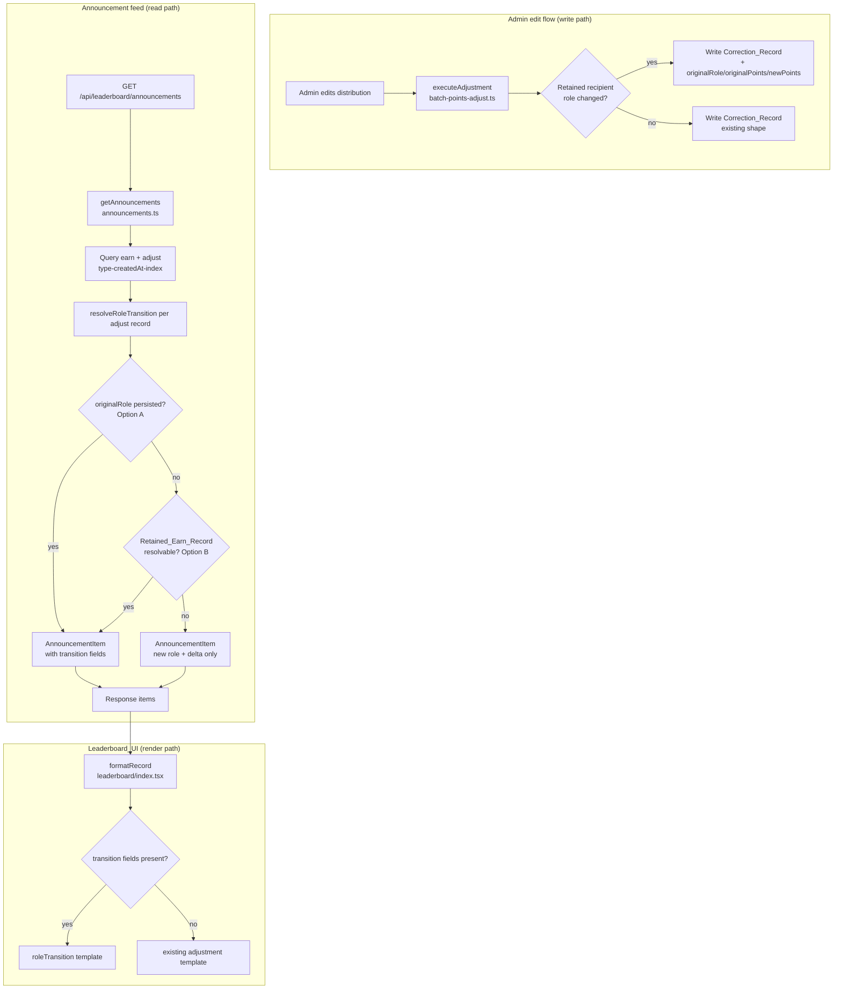

# Design Document

## Overview

This feature makes role-change adjustment records self-explanatory in the leaderboard announcement feed (`GET /api/leaderboard/announcements`). Today, when an administrator edits a distribution so that a retained recipient's role changes (e.g. Peter: Speaker/50 → Volunteer/30), the Adjustment_Writer writes a single net `type='adjust'` Correction_Record (`amount = -20`, `targetRole = Volunteer`). The feed shows only the net delta and the **new** role, so viewers cannot tell what the role was before or how the point value changed.

The design introduces:

1. **Write-time data capture (Option A, primary):** the Adjustment_Writer persists `originalRole`, `originalPoints`, and `newPoints` on Role_Change_Adjustment Correction_Records.
2. **Read-time inference (Option B, fallback):** for Historical_Adjustments that predate this feature and lack the new fields, the Announcement_Service derives `originalRole`/`originalPoints` from the earliest Retained_Earn_Record linked by `distributionId`/`activityId`.
3. **Graceful degradation:** when neither source resolves the original role, the record still renders using the existing adjustment wording (new role + net delta only).
4. **Display wording** in Leaderboard_UI that names both roles and the point change for role transitions, distinct from add/remove/deletion/skill adjustments.
5. **Full i18n** for the new strings across all five Supported_Locales, keeping `i18n.property.test.ts` green.

This feature is **display-and-supporting-data only**. It does not change how `points`, `earnTotal*` counters, or rankings are computed. The existing `computeAdjustmentDiff`, balance math, and transaction structure in `executeAdjustment` remain untouched except for adding new descriptive fields to the Correction_Record it already writes.

### Key design decisions

| Decision | Rationale |
| --- | --- |
| Option A (write-time capture) as the primary source | The Adjustment_Writer already has `original.targetRole`, `diff.originalPoints`, and `diff.newPoints` in scope at the exact moment it writes the Correction_Record. Persisting them is O(0) extra reads and produces authoritative data. |
| Option B (read-time inference) as the fallback only | Historical records cannot be back-filled cheaply; inferring from the Retained_Earn_Record keeps old entries readable without a data migration. |
| Add new fields, never mutate existing ones | Requirement 6 mandates that `amount` (Net_Delta), `targetRole` (New_Role), `source`, and Retained_Earn_Records stay byte-for-byte identical. New fields are additive. |
| Role-transition detection precedes sign-based branching in the UI | A role change can produce a positive, negative, or zero delta, so the current `amount > 0 ? added : reversed` branch must not run before the transition check. |
| Reuse `distributionId` first, `activityId` second for the earn lookup | `distributionId` is the precise link; `activityId` is the documented fallback in Requirement 2.3. |

## Architecture



The change touches three layers plus i18n:

- **Adjustment_Writer** (`packages/backend/src/admin/batch-points-adjust.ts`): add three fields to the Correction_Record `Put` for retained users whose role changed.
- **Announcement_Service** (`packages/backend/src/leaderboard/announcements.ts`): add a pure `resolveRoleTransition` step and an optional Retained_Earn_Record lookup; populate three new optional fields on `AnnouncementItem`.
- **Leaderboard_UI** (`packages/frontend/src/pages/leaderboard/index.tsx`): add a role-transition branch to `formatRecord` and a signed-delta formatter.
- **i18n** (`packages/frontend/src/i18n/*`): add the role-transition template key + fallback string in all five locales and declare it in `types.ts`.

## Components and Interfaces

### 1. Adjustment_Writer (write-time capture — Option A)

In `executeAdjustment`, the retained-user branch already knows every value needed. The only change is to the Correction_Record `Put.Item` inside the `userBatches` loop: when `roleChanged && isRetained`, add the three descriptive fields.

```ts
// Inside the retained-role-change case only:
const roleTransitionFields = (roleChanged && isRetained)
  ? {
      originalRole: original.targetRole,     // Original_Role (e.g. 'Speaker')
      originalPoints: diff.originalPoints,   // Original_Points (e.g. 50)
      newPoints: diff.newPoints,             // New_Points (e.g. 30)
    }
  : {};

// ...
Put: {
  TableName: tables.pointsRecordsTable,
  Item: {
    recordId,
    userId: ua.userId,
    type: 'adjust',
    amount: ua.delta,                        // Net_Delta — UNCHANGED
    source: `积分调整:${input.targetRole}|...`, // UNCHANGED
    createdAt: now,
    activityId: original.activityId ?? '',
    // ...existing fields unchanged...
    targetRole: isRemoved ? original.targetRole : input.targetRole, // New_Role — UNCHANGED
    distributionId: input.distributionId,
    ...roleTransitionFields,                  // additive only
  },
}
```

Notes:
- Added/removed recipients and same-role adjustments do **not** get these fields (their role did not change), so the UI naturally falls back to add/remove wording.
- No new transaction items, no new point movement — Requirement 6.3 preserved.

### 2. Announcement_Service (read-time resolution)

A new pure helper classifies and resolves the transition for each adjust record. It reads persisted fields first (Option A), then falls back to a Retained_Earn_Record supplied by the caller (Option B).

```ts
export interface RoleTransition {
  originalRole?: string;
  originalPoints?: number;
  newPoints?: number;
  resolvable: boolean; // true iff originalRole was determined
}

/**
 * Determine role-transition data for a `积分调整:` correction record.
 * - Option A: use persisted originalRole/originalPoints/newPoints if present.
 * - Option B: else infer from the earliest matching Retained_Earn_Record.
 * - Else: unresolvable (resolvable=false), caller renders new-role + delta only.
 *
 * A record is only a role transition when the resolved original role DIFFERS
 * from the correction's targetRole (New_Role). Same-role adjustments return
 * resolvable=false so they keep add/remove wording.
 */
export function resolveRoleTransition(
  correction: Record<string, any>,
  retainedEarnRecords: Record<string, any>[],
): RoleTransition;
```

Resolution algorithm:

1. If `source` is not an `积分调整:` record → `{ resolvable: false }` (deletion/skill/batch handled elsewhere).
2. **Option A:** if `correction.originalRole` is present and differs from `correction.targetRole`, return `{ originalRole, originalPoints, newPoints, resolvable: true }`, deriving `newPoints ?? correction.targetRole-points` and `originalPoints ?? (newPoints - correction.amount)` when a numeric field is missing.
3. **Option B:** else select the **earliest-created** earn record from `retainedEarnRecords` whose `distributionId` (preferred) or `activityId` matches the correction and whose `type === 'earn'`. If its `targetRole` differs from `correction.targetRole`, return `{ originalRole: earn.targetRole, originalPoints: earn.amount, newPoints: correction.targetRole-points-or-derived, resolvable: true }`.
4. Else → `{ resolvable: false }`.

Retained_Earn_Record fetching (only for adjust records lacking persisted `originalRole`):

- The service collects the `userId`s of such records, queries `PointsRecords` via the existing `userId-createdAt-index` GSI (`KeyConditionExpression: userId = :uid`, `FilterExpression: #type = :earn`), and groups the results by `userId`.
- Grouping into `retainedEarnRecords[]` per correction is done in memory; `resolveRoleTransition` picks the earliest match. No new GSI is required.
- This lookup is skipped entirely once Option A data is present (the common case after deployment), bounding cost to historical records only.

`getAnnouncements` populates three new optional fields on each `AnnouncementItem`:

```ts
export interface AnnouncementItem {
  // ...existing fields unchanged...
  originalRole?: string;    // Original_Role, when resolvable
  originalPoints?: number;  // Original_Points, when resolvable
  newPoints?: number;       // New_Points, when resolvable
}
```

Error isolation (Requirement 3.4): assembly of each item is wrapped so that a record which cannot produce a valid `AnnouncementItem` is omitted (filtered out) rather than aborting the page; remaining records still return.

### 3. Leaderboard_UI (render)

`formatRecord` gains a role-transition branch that runs **before** the existing sign-based `积分调整:` branches. A signed-delta helper renders the sign indicator.

```ts
function formatDelta(n: number): string {
  if (n > 0) return `+${n}`;
  if (n < 0) return `${n}`;   // native '-' sign
  return `${n}`;              // 0 → "0"
}

const isRoleTransition = (item: LeaderboardAnnouncementItem) =>
  isAdjustmentRecord(item.source) &&
  !!item.originalRole &&
  item.originalRole !== item.targetRole;

// Inside formatRecord, BEFORE the amount>0 / amount<0 adjustment branches:
if (isRoleTransition(item)) {
  return t('leaderboard.adjustmentRoleTransitionTemplate' as any, {
    recipientNickname: item.recipientNickname,
    activityUG: item.activityUG || '—',
    activityDate: item.activityDate || '—',
    originalRole: ROLE_DISPLAY_LABEL[item.originalRole!] || item.originalRole!,
    targetRole: ROLE_DISPLAY_LABEL[item.targetRole] || item.targetRole,
    originalPoints: item.originalPoints ?? '—',
    newPoints: item.newPoints ?? '—',
    delta: formatDelta(item.amount),
  });
}
```

When `originalRole` is absent (unresolvable / historical), control falls through to the existing `adjustmentAddedTemplate` / `adjustmentReversedTemplate` / `adjustmentReversedNoDistributorTemplate` branches, which reference the New_Role and Net_Delta only — satisfying Requirements 3.1, 4.2, and preserving add/remove/deletion/skill wording (4.3–4.6).

### 4. Shared type

`LeaderboardAnnouncementItem` in `packages/shared/src/types.ts` gains the same three optional fields (`originalRole?`, `originalPoints?`, `newPoints?`) so backend and frontend share one contract.

## Data Models

### PointsRecord (Correction_Record) — additive fields

| Field | Type | Existing? | Notes |
| --- | --- | --- | --- |
| `recordId` | string | yes | unchanged |
| `userId` | string | yes | unchanged |
| `type` | `'adjust'` | yes | unchanged |
| `amount` | number | yes | Net_Delta — unchanged |
| `source` | string | yes | `积分调整:{newRole}\|...` — unchanged |
| `targetRole` | string | yes | New_Role — unchanged |
| `distributionId` | string | yes | link to distribution — unchanged |
| `activityId`/`activityUG`/`activityTopic`/`activityDate` | string | yes | unchanged |
| `originalRole` | string | **new** | Original_Role; written only for retained role-change |
| `originalPoints` | number | **new** | Original_Points |
| `newPoints` | number | **new** | New_Points |

Historical records simply omit the three new fields; all reads treat them as optional.

### AnnouncementItem / LeaderboardAnnouncementItem — additive fields

`originalRole?: string`, `originalPoints?: number`, `newPoints?: number`. Present only when `resolveRoleTransition` returns `resolvable: true`.

### Retained_Earn_Record (read-only, unchanged)

The original `type='earn'` PointsRecord: carries `targetRole` = Original_Role, `amount` = Original_Points, linked by `distributionId`/`activityId`. This feature never writes to or mutates it (Requirement 6.5). It is queried via the existing `userId-createdAt-index` GSI.

### i18n keys

- New key `leaderboard.adjustmentRoleTransitionTemplate` declared in `packages/frontend/src/i18n/types.ts` and defined in `zh`, `en`, `zh-TW`, `ja`, `ko`.
- Each localized string contains five placeholders: `{originalRole}`, `{targetRole}`, `{originalPoints}`, `{newPoints}`, `{delta}` (plus recipient/activity context). The `{delta}` value is pre-formatted with its sign by `formatDelta`.
- The unresolvable fallback reuses the existing `adjustmentReversedTemplate` / `adjustmentReversedNoDistributorTemplate` keys, which already exist in all five locales — no new fallback key needed, satisfying Requirement 5.5 with existing coverage.

## Correctness Properties

*A property is a characteristic or behavior that should hold true across all valid executions of a system — essentially, a formal statement about what the system should do. Properties serve as the bridge between human-readable specifications and machine-verifiable correctness guarantees.*

The properties below are derived from the prework analysis. Redundant criteria were consolidated: signed-delta formatting (1.2/3.2/5.6), resolvable-transition rendering (1.1/1.3/1.4/1.5/4.1), unresolvable fallback rendering (1.6/3.1/4.2), resolution outcomes (2.1/2.3/2.5), the additive invariant (2.6/6.1), template selection (4.3–4.6), and backward-compatible assembly (3.3/3.4).

### Property 1: Signed delta formatting

*For any* integer Net_Delta, `formatDelta` SHALL produce a string prefixed with `+` when the value is greater than zero, prefixed with `-` when the value is less than zero, and with no positive sign when the value is zero.

**Validates: Requirements 1.2, 3.2, 5.6**

### Property 2: Role-transition resolution correctness

*For any* `积分调整:` Correction_Record, `resolveRoleTransition` SHALL return `resolvable: true` with the persisted original-role data when present (Option A), otherwise with the original role/points inferred from a matching Retained_Earn_Record whose role differs from the New_Role (Option B), and SHALL return `resolvable: false` when neither source yields a differing original role.

**Validates: Requirements 2.1, 2.3, 2.5**

### Property 3: Earliest-created Retained_Earn_Record selection

*For any* set of Retained_Earn_Records matching a Correction_Record's `distributionId` or `activityId`, `resolveRoleTransition` SHALL derive the Original_Role and Original_Points from the record with the earliest `createdAt`.

**Validates: Requirements 2.4**

### Property 4: Additive fields preserve core semantics

*For any* Correction_Record, the assembled `AnnouncementItem` SHALL carry an `amount`, `targetRole`, and `source` exactly equal to those of the source record, and the computed adjustment delta SHALL be unchanged by the presence or absence of the original-role fields.

**Validates: Requirements 2.6, 6.1**

### Property 5: Resolvable role-transition render completeness

*For any* resolvable Role_Change_Adjustment `AnnouncementItem`, `formatRecord` SHALL produce a message that contains the Role_Display_Label of both the Original_Role and the New_Role, the Original_Points, the New_Points, the signed Net_Delta, the recipient nickname, and the activity user group and date.

**Validates: Requirements 1.1, 1.3, 1.4, 1.5, 4.1**

### Property 6: Unresolvable fallback render

*For any* `积分调整:` `AnnouncementItem` whose original-role data is not resolvable, `formatRecord` SHALL produce a non-empty message that references the New_Role label and the Net_Delta and SHALL NOT contain any text asserting an original role.

**Validates: Requirements 1.6, 3.1, 4.2**

### Property 7: Every correction record renders a usable message

*For any* Correction_Record returned by the Announcement_Feed — of any adjustment kind and regardless of whether original-role data is present — `formatRecord` SHALL produce a non-empty message that contains a role label and a Net_Delta value.

**Validates: Requirements 3.5**

### Property 8: Adjustment-kind template selection

*For any* Correction_Record, `formatRecord` SHALL select the role-transition template only when the record is a `积分调整:` record with a resolved Original_Role differing from its New_Role; a same-role positive-delta record SHALL select the supplemental-award wording, a same-role negative-delta record SHALL select the reversal/adjustment wording, and Deletion_Adjustment and Skill_Adjustment records SHALL select their existing deletion and skill wording respectively and SHALL never select the role-transition template.

**Validates: Requirements 4.3, 4.4, 4.5, 4.6**

### Property 9: Backward-compatible, fault-isolated assembly

*For any* batch of Correction_Records that includes Historical_Adjustments lacking original-role fields, the Announcement_Service SHALL return a valid `AnnouncementItem` (populated with New_Role and Net_Delta) for every constructable record without raising an error, and SHALL omit only the records that cannot be constructed while still returning all remaining records.

**Validates: Requirements 3.3, 3.4**

### Property 10: Locale placeholder completeness

*For any* Supported_Locale, the role-transition template string SHALL contain a placeholder for each of the five values: Original_Role, New_Role, Original_Points, New_Points, and Net_Delta.

**Validates: Requirements 5.4**

## Error Handling

| Situation | Handling | Requirement |
| --- | --- | --- |
| Correction_Record has no persisted `originalRole` and no matching Retained_Earn_Record | `resolveRoleTransition` returns `resolvable: false`; item assembled with New_Role + Net_Delta only; UI renders existing adjustment wording | 2.5, 3.1, 4.2 |
| Historical_Adjustment lacks all new fields | Treated as unresolvable; produces a valid `AnnouncementItem`, never throws | 3.3 |
| A record cannot be turned into a valid `AnnouncementItem` | The record is filtered out of the page; the remaining records are still returned; processing does not abort | 3.4 |
| Retained_Earn_Record lookup query fails (transient DynamoDB error) | The lookup is best-effort; on failure the affected records fall back to `resolvable: false` rather than failing the whole feed | 3.4 |
| Adjustment transaction fails before commit (write path) | `executeAdjustment` returns `{ success: false, error }`; `TransactWriteCommand` atomicity guarantees `points`/`earnTotal*` remain at pre-change values | 6.4 |
| `originalPoints`/`newPoints` numeric field missing but `originalRole` present | Derive `originalPoints = newPoints − amount` (or `newPoints = originalPoints + amount`); if neither derivable, still show roles and mark points unavailable | 1.6 |

The UI defensive defaults (`|| '—'`) already used throughout `formatRecord` are retained so a missing activity field never yields an empty message (supports Property 7).

## Testing Strategy

### Dual approach

- **Property-based tests** verify the universal properties above across randomized inputs. This feature is a good PBT fit because the core logic — `resolveRoleTransition`, `formatDelta`, the template-selection predicate, and item assembly — are pure functions with large input spaces (roles, point values, presence/absence of persisted fields, sets of earn records).
- **Unit / example tests** cover concrete write-path behavior and specific scenarios.
- **Integration tests** cover DynamoDB transaction atomicity and audit-trail immutability.

### Property-based testing

- Library: **fast-check** with **vitest**, matching the existing suites (`*.property.test.ts`, `i18n.property.test.ts`).
- Each property test runs **minimum 100 iterations** (`{ numRuns: 100 }`).
- Each test is tagged with a comment referencing its design property, format:
  `// Feature: announcement-role-transition, Property {number}: {property_text}`
- Property-to-test mapping:
  - **P1** signed delta — pure `formatDelta`, generate `fc.integer()`.
  - **P2** resolution correctness — generate corrections with/without persisted fields and with/without matching earn records.
  - **P3** earliest-created selection — generate arrays of matching earn records with random `createdAt`.
  - **P4** additive invariant — assert assembled item's `amount`/`targetRole`/`source` equal source values; assert `computeAdjustmentDiff` output independent of new fields.
  - **P5** resolvable render — generate resolvable transition items, assert all required substrings present.
  - **P6** unresolvable render — generate unresolvable adjust items, assert new-role + delta present and no original-role phrase.
  - **P7** universal render — generate all correction-source kinds, assert non-empty with role label + delta.
  - **P8** template selection — generate all source kinds and resolvability states, assert selected template class.
  - **P9** backward-compat/isolation — generate mixed batches including historical and malformed records, assert valid items returned and no throw.
  - **P10** locale placeholders — iterate the five locale dictionaries, assert each role-transition template contains all five placeholders.

### Unit / example tests

- **AC 2.2 (Option A write):** one role-change-of-retained-recipient example → assert the written Correction_Record carries correct `originalRole`/`originalPoints`/`newPoints`.
- **AC 6.3:** role-change example → assert exactly one Correction_Record is written per retained user and no additional point-moving record is produced.
- Representative rendering examples for each template (batch, add, remove, deletion, skill, role transition) to guard exact wording per locale.

### Integration tests

- **AC 6.4:** simulate a failing `TransactWriteCommand`; assert `executeAdjustment` returns an error and no partial user updates persist.
- **AC 6.5:** assert the adjustment transaction issues no `Update`/`Put`/`Delete` against existing `type='earn'` records.

### Smoke / existing-suite gates

- **AC 5.1, 5.2, 5.3, 5.5:** the existing `i18n.property.test.ts` key-parity property (all locales share an identical key set) must pass with the new `adjustmentRoleTransitionTemplate` key added to `types.ts` and all five locales; TypeScript compilation enforces the type declaration.
- **AC 6.2:** confirm no changes to ranking-module code; rely on the existing verified ranking tests.
