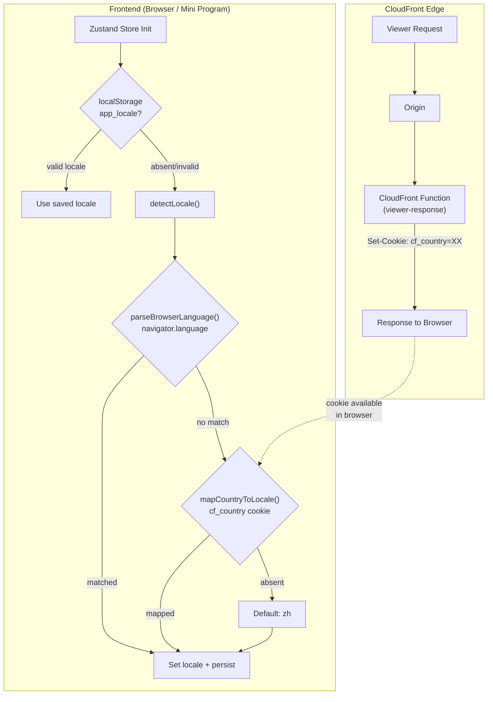

# Design Document: Auto Locale Detection

## Overview

This feature adds automatic locale detection to the Points Mall frontend so that first-time visitors see the UI in a language matching their browser preference or geographic location, rather than always defaulting to Chinese (`zh`).

The system uses a priority chain:
1. **localStorage manual selection** (highest priority) — respects explicit user choice
2. **Browser language** — `navigator.language` (H5) or `Taro.getSystemInfoSync().language` (WeChat Mini Program)
3. **Country cookie** — `cf_country` cookie set by a CloudFront Function from the `CloudFront-Viewer-Country` header
4. **Default `zh`** (lowest priority)

Detection runs synchronously at store initialization time, before any component renders, to avoid a flash of wrong-language content.

### Key Design Decisions

1. **Pure function architecture**: The `detectLocale()` function is a pure function that accepts callbacks for browser language and cookie reading. This makes it fully testable without mocking globals.
2. **CloudFront Function over Lambda@Edge**: CloudFront Functions run at the edge with sub-millisecond latency and are free for the first 2M invocations/month. They're ideal for the simple task of copying a header value into a cookie.
3. **Cookie-based country passing**: The `CloudFront-Viewer-Country` header is only available server-side. A CloudFront Function writes it into a `cf_country` cookie so the frontend JavaScript can read it.
4. **Synchronous detection**: Detection runs during Zustand store creation (IIFE), not in a `useEffect`, so the locale is available before the first render.

## Architecture



## Components and Interfaces

### 1. Locale Detector Module

**File**: `packages/frontend/src/i18n/locale-detector.ts`

This module exports three pure functions:

```typescript
import type { Locale } from './types';

/** Supported locales constant */
export const SUPPORTED_LOCALES: readonly Locale[] = ['zh', 'en', 'ja', 'ko', 'zh-TW'] as const;

/** Country code to locale mapping */
export const COUNTRY_LOCALE_MAP: Record<string, Locale> = {
  JP: 'ja',
  KR: 'ko',
  TW: 'zh-TW',
  US: 'en',
  GB: 'en',
  AU: 'en',
  NZ: 'en',
  CA: 'en',
};

/** Configuration for detectLocale */
export interface DetectLocaleConfig {
  getBrowserLanguage: () => string | null;
  getCountryCookie: () => string | null;
}

/**
 * Parse a BCP 47 language tag into a supported Locale.
 * Matching rules:
 *   1. Exact match against SUPPORTED_LOCALES (e.g., 'ja' → 'ja')
 *   2. Chinese variant handling: zh-TW/zh-HK/zh-Hant → 'zh-TW'; zh/zh-CN/zh-Hans → 'zh'
 *   3. Primary subtag match (e.g., 'en-US' → 'en', 'ko-KR' → 'ko')
 * Returns null if no match found.
 */
export function parseBrowserLanguage(tag: string): Locale | null;

/**
 * Map an ISO 3166-1 alpha-2 country code to a Locale.
 * Uses COUNTRY_LOCALE_MAP; defaults to 'zh' for unmapped codes.
 */
export function mapCountryToLocale(countryCode: string): Locale;

/**
 * Detect the best locale by evaluating sources in priority order:
 *   1. Browser language (via config.getBrowserLanguage)
 *   2. Country cookie (via config.getCountryCookie)
 *   3. Default 'zh'
 *
 * Note: localStorage check happens in the Zustand store BEFORE calling this function.
 */
export function detectLocale(config: DetectLocaleConfig): Locale;
```

### 2. Zustand Store Modification

**File**: `packages/frontend/src/store/index.ts`

The locale initialization IIFE changes from:

```typescript
// Before: always defaults to 'zh'
locale: ((): Locale => {
  try {
    const saved = Taro.getStorageSync('app_locale');
    if (['zh', 'en', 'ja', 'ko', 'zh-TW'].includes(saved)) return saved as Locale;
  } catch { /* ignore */ }
  return 'zh';
})(),
```

To:

```typescript
// After: auto-detect when no saved preference
locale: ((): Locale => {
  try {
    const saved = Taro.getStorageSync('app_locale');
    if (SUPPORTED_LOCALES.includes(saved as Locale)) return saved as Locale;
  } catch { /* ignore */ }

  const detected = detectLocale({
    getBrowserLanguage: () => {
      try {
        if (Taro.getEnv() === Taro.ENV_TYPE.WEAPP) {
          return Taro.getSystemInfoSync().language ?? null;
        }
        return navigator?.language ?? null;
      } catch { return null; }
    },
    getCountryCookie: () => {
      try {
        if (typeof document === 'undefined') return null;
        const match = document.cookie.match(/(?:^|;\s*)cf_country=([^;]*)/);
        return match?.[1]?.trim() || null;
      } catch { return null; }
    },
  });

  // Persist detected locale so detection doesn't re-run on next visit
  try { Taro.setStorageSync('app_locale', detected); } catch { /* ignore */ }
  return detected;
})(),
```

### 3. CloudFront Function (Viewer-Response)

**File**: `packages/cdk/lambda/cf-country-cookie/index.js`

A CloudFront Function (JavaScript runtime `cloudfront-js-2.0`) that runs on `VIEWER_RESPONSE`. It reads the `CloudFront-Viewer-Country` header from the original request and writes a `cf_country` cookie into the response so the frontend JavaScript can read it.

> **Why viewer-response?** CloudFront Functions on `viewer-request` cannot set response headers (`Set-Cookie`). The `viewer-response` event has access to both `event.request.headers` (including `CloudFront-Viewer-Country`) and `event.response.headers`, making it the correct event type for setting cookies.

```javascript
function handler(event) {
  var response = event.response;
  var request = event.request;
  var country = request.headers['cloudfront-viewer-country']
    ? request.headers['cloudfront-viewer-country'].value
    : '';

  if (country) {
    var cookieValue = 'cf_country=' + country + '; Path=/; Secure; SameSite=Lax; Max-Age=86400';
    if (!response.headers['set-cookie']) {
      response.headers['set-cookie'] = {};
    }
    // Use multiValue to avoid overwriting existing Set-Cookie headers
    if (!response.headers['set-cookie'].multiValue) {
      response.headers['set-cookie'].multiValue = [];
    }
    response.headers['set-cookie'].multiValue.push({ value: cookieValue });
  }

  return response;
}
```

### 4. CDK Stack Update

**File**: `packages/cdk/lib/frontend-stack.ts`

Add the CloudFront Function resource and associate it with the default behavior:

```typescript
// CloudFront Function: write cf_country cookie from Viewer-Country header
const countryCookieFn = new cloudfront.Function(this, 'CountryCookieFunction', {
  code: cloudfront.FunctionCode.fromFile({
    filePath: path.join(__dirname, '../lambda/cf-country-cookie/index.js'),
  }),
  runtime: cloudfront.FunctionRuntime.JS_2_0,
  comment: 'Sets cf_country cookie from CloudFront-Viewer-Country header',
});

// In the Distribution definition, update defaultBehavior:
defaultBehavior: {
  origin: staticOrigin,
  viewerProtocolPolicy: cloudfront.ViewerProtocolPolicy.REDIRECT_TO_HTTPS,
  cachePolicy: cloudfront.CachePolicy.CACHING_OPTIMIZED,
  functionAssociations: [{
    function: countryCookieFn,
    eventType: cloudfront.FunctionEventType.VIEWER_RESPONSE,
  }],
},
```

## Data Models

### Locale Type (existing)

```typescript
// packages/frontend/src/i18n/types.ts (no change)
export type Locale = 'zh' | 'en' | 'ja' | 'ko' | 'zh-TW';
```

### Country-to-Locale Mapping

| Country Code | Locale | Rationale |
|---|---|---|
| `JP` | `ja` | Japan → Japanese |
| `KR` | `ko` | South Korea → Korean |
| `TW` | `zh-TW` | Taiwan → Traditional Chinese |
| `US`, `GB`, `AU`, `NZ`, `CA` | `en` | English-speaking countries |
| `CN` | `zh` | China → Simplified Chinese |
| *(any other)* | `zh` | Default fallback |

### BCP 47 Tag Matching Rules

| Input Tag | Matched Locale | Rule Applied |
|---|---|---|
| `zh-TW` | `zh-TW` | Exact match |
| `zh-HK` | `zh-TW` | Chinese traditional variant |
| `zh-Hant` | `zh-TW` | Chinese traditional script |
| `zh-CN` | `zh` | Chinese simplified variant |
| `zh-Hans` | `zh` | Chinese simplified script |
| `zh` | `zh` | Exact match |
| `en-US` | `en` | Primary subtag match |
| `en-GB` | `en` | Primary subtag match |
| `ja` | `ja` | Exact match |
| `ja-JP` | `ja` | Primary subtag match |
| `ko-KR` | `ko` | Primary subtag match |
| `fr-FR` | `null` | No match → fall through to country |
| `de` | `null` | No match → fall through to country |

### localStorage Schema

| Key | Value | Description |
|---|---|---|
| `app_locale` | `zh \| en \| ja \| ko \| zh-TW` | Persisted locale (manual or auto-detected) |

### Cookie Schema

| Cookie Name | Value | Attributes | Set By |
|---|---|---|---|
| `cf_country` | ISO 3166-1 alpha-2 code (e.g., `JP`) | `Path=/; Secure; SameSite=Lax; Max-Age=86400` | CloudFront Function (viewer-response) |


## Correctness Properties

*A property is a characteristic or behavior that should hold true across all valid executions of a system — essentially, a formal statement about what the system should do. Properties serve as the bridge between human-readable specifications and machine-verifiable correctness guarantees.*

### Property 1: parseBrowserLanguage returns correct locale or null

*For any* BCP 47 language tag whose primary subtag is one of `{en, ja, ko, zh}`, `parseBrowserLanguage` SHALL return a valid `Locale` from `SUPPORTED_LOCALES`. *For any* BCP 47 tag whose primary subtag is NOT in that set, `parseBrowserLanguage` SHALL return `null`. Additionally, Chinese variant tags (`zh-TW`, `zh-HK`, `zh-Hant`) SHALL map to `zh-TW`, and simplified Chinese tags (`zh`, `zh-CN`, `zh-Hans`) SHALL map to `zh`.

**Validates: Requirements 2.3, 2.4, 2.5, 2.6, 7.2**

### Property 2: mapCountryToLocale always returns a valid locale

*For any* string input as a country code, `mapCountryToLocale` SHALL return a value that is a member of `SUPPORTED_LOCALES`. Specifically, mapped country codes (`JP`→`ja`, `KR`→`ko`, `TW`→`zh-TW`, `US/GB/AU/NZ/CA`→`en`) SHALL return their mapped locale, and *for any* country code not in the explicit map, the function SHALL return `zh`.

**Validates: Requirements 3.2, 3.3, 3.4, 3.5, 3.6, 3.7, 7.3**

### Property 3: detectLocale respects priority chain

*For any* combination of browser language result and country cookie result, `detectLocale` SHALL return the browser language match when available, the country cookie match when browser language returns no match, and `zh` when both sources return no match. The browser language source SHALL always be evaluated before the country cookie source.

**Validates: Requirements 1.2, 3.8**

### Property 4: BCP 47 round-trip consistency

*For any* supported `Locale` value, constructing a BCP 47 tag from that locale (e.g., `en` → `en`, `zh-TW` → `zh-TW`, `ja` → `ja`) and parsing it back with `parseBrowserLanguage` SHALL return the original locale value.

**Validates: Requirements 7.4**

### Property 5: Invalid localStorage values are rejected

*For any* string that is NOT a member of `SUPPORTED_LOCALES`, the locale initialization logic SHALL treat it as absent and proceed with automatic detection via `detectLocale`.

**Validates: Requirements 5.3, 1.1**

## Error Handling

| Scenario | Handling | Fallback |
|---|---|---|
| `navigator.language` throws or is undefined | `getBrowserLanguage` callback returns `null` | Skip to country cookie |
| `Taro.getSystemInfoSync()` throws | `getBrowserLanguage` callback returns `null` | Skip to country cookie |
| `document.cookie` is undefined (SSR/Mini Program) | `getCountryCookie` callback returns `null` | Use default `zh` |
| `cf_country` cookie is absent or empty | `getCountryCookie` returns `null` | Use default `zh` |
| `CloudFront-Viewer-Country` header is absent | CloudFront Function passes request through without adding cookie | Frontend falls back to browser language or default |
| `localStorage` read/write throws (private browsing) | Wrapped in try/catch, returns `null` for read | Detection runs every visit; locale still works in-memory |
| Invalid locale value in `localStorage` | Validation against `SUPPORTED_LOCALES` fails | Treated as absent, detection runs |

All error paths converge on the default locale `zh`, ensuring the application always renders in a valid language.

## Testing Strategy

### Property-Based Tests (using `fast-check`)

The locale detection module contains pure functions with clear input/output behavior and a large input space (arbitrary BCP 47 tags, arbitrary country codes). Property-based testing is well-suited here.

**Library**: `fast-check` (already in devDependencies)
**Minimum iterations**: 100 per property
**Test file**: `packages/frontend/src/i18n/locale-detector.property.test.ts`

Each property test will be tagged with:
```
Feature: auto-locale-detection, Property {N}: {property_text}
```

| Property | What It Tests | Generator Strategy |
|---|---|---|
| Property 1 | `parseBrowserLanguage` correctness | Generate random BCP 47 tags: supported primary subtags with random region/script suffixes, plus unsupported subtags (fr, de, pt, etc.) |
| Property 2 | `mapCountryToLocale` validity | Generate random 2-letter uppercase strings as country codes |
| Property 3 | `detectLocale` priority chain | Generate random `(browserLang, countryCookie)` pairs where each can be a matching tag, non-matching tag, or null |
| Property 4 | BCP 47 round-trip | Generate from the 5 supported locales, convert to tag, parse back |
| Property 5 | Invalid localStorage rejection | Generate random strings that are NOT in SUPPORTED_LOCALES |

### Unit Tests (example-based)

**Test file**: `packages/frontend/src/i18n/locale-detector.test.ts`

| Test | What It Verifies |
|---|---|
| `parseBrowserLanguage` specific examples | `en-US`→`en`, `zh-TW`→`zh-TW`, `zh-HK`→`zh-TW`, `zh-Hant`→`zh-TW`, `zh-CN`→`zh`, `fr-FR`→`null` |
| `mapCountryToLocale` specific examples | `JP`→`ja`, `KR`→`ko`, `TW`→`zh-TW`, `US`→`en`, `CN`→`zh`, `BR`→`zh` |
| `detectLocale` with all sources available | Browser language takes priority over cookie |
| `detectLocale` with only cookie | Falls back to country mapping |
| `detectLocale` with no sources | Returns `zh` |
| Store initialization with valid localStorage | Uses saved value, skips detection |
| Store initialization with invalid localStorage | Runs detection |

### Integration Tests

| Test | What It Verifies |
|---|---|
| CloudFront Function handler with country header | Sets `cf_country` cookie in response |
| CloudFront Function handler without country header | Passes response through unchanged |

### CDK Tests

| Test | What It Verifies |
|---|---|
| CDK snapshot/assertion test | CloudFront Function resource exists and is associated with default behavior as `VIEWER_RESPONSE` |
