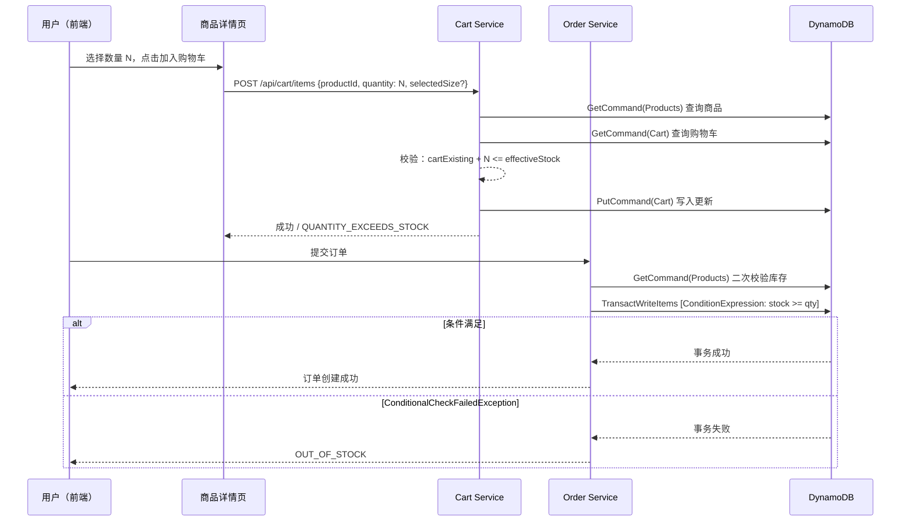

# 设计文档：购物车数量选择与库存校验

## 概述

本功能扩展现有购物车系统，支持用户在商品详情页自定义加购数量（当前固定为 1），并在加购和下单两个环节实施严格的库存校验。通过 DynamoDB ConditionExpression 和 TransactWriteItems 实现乐观锁，防止并发超卖。

### 核心变更

1. **前端**：商品详情页新增数量选择器组件；购物车页面数量控制增加库存上限校验
2. **后端 API**：`addToCart` 函数签名扩展 `quantity` 参数；`updateCartItem` 增加库存校验；下单流程已有 ConditionExpression 需确认覆盖完整
3. **Zustand Store**：`addToCart(productId)` 扩展为 `addToCart(productId, quantity, selectedSize?)`
4. **共享类型**：新增 `QUANTITY_EXCEEDS_STOCK` 和 `INVALID_QUANTITY` 错误码

### 设计决策

- **加购时校验 vs 仅下单时校验**：两处都校验。加购时校验提供即时反馈，下单时二次校验防止时间差导致的超卖。
- **数量上限取 min(有效库存, 限购剩余)**：当商品启用限购时，数量选择器上限为 `min(effectiveStock, purchaseLimitRemaining)`，确保两个约束同时满足。
- **向后兼容**：`POST /api/cart/items` 请求体中 `quantity` 缺省时默认为 1，不破坏现有调用方。

## 架构

### 数据流



### 影响范围

| 层级 | 文件 | 变更类型 |
|------|------|----------|
| 共享类型 | `packages/shared/src/errors.ts` | 新增 `QUANTITY_EXCEEDS_STOCK`、`INVALID_QUANTITY` 错误码 |
| 后端 | `packages/backend/src/cart/cart.ts` | `addToCart` 增加 `quantity` 参数 + 库存校验；`updateCartItem` 增加库存校验 |
| 后端 | `packages/backend/src/cart/handler.ts` | 解析 `quantity` 字段，校验正整数 |
| 后端 | `packages/backend/src/orders/order.ts` | 确认 ConditionExpression 已覆盖（现有代码已实现） |
| 前端 | `packages/frontend/src/pages/product/index.tsx` | 新增 QuantitySelector UI |
| 前端 | `packages/frontend/src/pages/cart/index.tsx` | 数量控制增加库存上限 |
| 前端 | `packages/frontend/src/store/index.ts` | `addToCart` 签名扩展 |

## 组件与接口

### 1. 后端：`addToCart` 函数签名变更

```typescript
// 当前签名
export async function addToCart(
  userId: string,
  productId: string,
  dynamoClient: DynamoDBDocumentClient,
  cartTable: string,
  productsTable: string,
  selectedSize?: string,
  ordersTable?: string,
): Promise<CartMutationResult>

// 新签名：增加 quantity 参数
export async function addToCart(
  userId: string,
  productId: string,
  quantity: number,  // 新增，默认 1
  dynamoClient: DynamoDBDocumentClient,
  cartTable: string,
  productsTable: string,
  selectedSize?: string,
  ordersTable?: string,
): Promise<CartMutationResult>
```

新增校验逻辑（在现有尺码校验和限购校验之间）：
- `quantity` 必须为正整数（≥ 1），否则返回 `INVALID_QUANTITY`
- 计算 `effectiveStock`：有尺码时取 `sizeOption.stock`，否则取 `product.stock`
- 校验 `cartExistingQty + quantity <= effectiveStock`，不满足返回 `QUANTITY_EXCEEDS_STOCK`
- 已有商品时 `items[i].quantity += quantity`（而非固定 +1）

### 2. 后端：`updateCartItem` 增加库存校验

```typescript
// 新签名：增加 productsTable 参数
export async function updateCartItem(
  userId: string,
  productId: string,
  quantity: number,
  dynamoClient: DynamoDBDocumentClient,
  cartTable: string,
  productsTable?: string,    // 新增，用于库存校验
  selectedSize?: string,     // 新增，用于尺码库存校验
): Promise<CartMutationResult>
```

当 `productsTable` 提供且 `quantity > 0` 时，查询商品库存并校验 `quantity <= effectiveStock`。

### 3. 后端：Handler 层变更

`POST /api/cart/items` 请求体新增 `quantity` 字段：
```typescript
interface AddToCartRequest {
  productId: string;
  quantity?: number;      // 可选，默认 1
  selectedSize?: string;
}
```

Handler 校验：
- `quantity` 缺省时默认为 1
- `quantity` 不是正整数时返回 400 `INVALID_QUANTITY`

### 4. 前端：数量选择器组件

在商品详情页 `handleAddToCart` 中传递 `quantity`：

```typescript
// store 变更
addToCart: async (productId: string, quantity?: number, selectedSize?: string) => {
  await request({
    url: '/api/cart/items',
    method: 'POST',
    data: { productId, quantity: quantity ?? 1, ...(selectedSize ? { selectedSize } : {}) },
  });
},
```

商品详情页新增状态：
```typescript
const [quantity, setQuantity] = useState(1);
const maxQuantity = useMemo(() => {
  if (!product) return 1;
  let max = getEffectiveStock();
  if (product.purchaseLimitEnabled && product.purchaseLimitCount) {
    max = Math.min(max, product.purchaseLimitCount); // 简化：前端不知道历史购买量
  }
  return Math.max(1, max);
}, [product, selectedSize]);
```

### 5. 前端：购物车页面数量控制

在 `handleQuantityChange` 中增加前端上限校验：
```typescript
const handleQuantityChange = async (productId: string, delta: number) => {
  const item = items.find((i) => i.productId === productId);
  if (!item) return;
  const newQty = item.quantity + delta;
  if (newQty < 1 || newQty > item.stock) return; // 增加 stock 上限
  // ... 调用 API
};
```

### 6. 下单时库存校验（已有实现确认）

现有 `createOrder` 函数已包含：
- 逐商品校验 `product.stock < item.quantity` → `OUT_OF_STOCK`
- 尺码商品校验 `sizeOptions[i].stock < item.quantity` → `SIZE_OUT_OF_STOCK`
- TransactWriteItems 中 `ConditionExpression: stock >= :qty AND status = :active`
- 尺码商品额外条件 `sizeOptions[i].stock >= :qty`

无需修改下单逻辑，已满足需求 4 和需求 5 的全部验收标准。

## 数据模型

### 现有表结构（无需修改）

**Products 表** (`PointsMall-Products`)：
- `productId` (PK)
- `stock: number` — 总库存
- `sizeOptions?: SizeOption[]` — 每个元素含 `{ name: string, stock: number }`
- `purchaseLimitEnabled?: boolean`
- `purchaseLimitCount?: number`

**Cart 表** (`PointsMall-Cart`)：
- `userId` (PK)
- `items: CartItem[]` — 每个元素含 `{ productId, quantity, addedAt, selectedSize? }`

### 新增错误码

```typescript
// packages/shared/src/errors.ts 新增
QUANTITY_EXCEEDS_STOCK: 'QUANTITY_EXCEEDS_STOCK',  // 加购/更新数量超过库存
INVALID_QUANTITY: 'INVALID_QUANTITY',              // 数量不是正整数

// ErrorHttpStatus
[ErrorCodes.QUANTITY_EXCEEDS_STOCK]: 400,
[ErrorCodes.INVALID_QUANTITY]: 400,

// ErrorMessages
[ErrorCodes.QUANTITY_EXCEEDS_STOCK]: '数量超过库存',
[ErrorCodes.INVALID_QUANTITY]: '数量必须为正整数',
```

### 有效库存计算逻辑

```typescript
function getEffectiveStock(product: Product, selectedSize?: string): number {
  if (product.sizeOptions?.length && selectedSize) {
    const sizeOpt = product.sizeOptions.find(s => s.name === selectedSize);
    return sizeOpt?.stock ?? 0;
  }
  return product.stock;
}
```


## 正确性属性（Correctness Properties）

*正确性属性是指在系统所有合法执行路径中都应成立的特征或行为——本质上是对系统应做什么的形式化陈述。属性是连接人类可读规格说明与机器可验证正确性保证之间的桥梁。*

### Property 1: 加购库存校验不变量

*对于任意*商品（有效库存为 S）、任意购物车已有数量 E（0 ≤ E ≤ S）、任意请求加购数量 N（N ≥ 1），`addToCart` 应当在 E + N ≤ S 时成功，在 E + N > S 时返回 `QUANTITY_EXCEEDS_STOCK` 错误码。

**Validates: Requirements 3.1, 3.2**

### Property 2: 加购后数量正确累加

*对于任意*商品和任意正整数 N，若加购成功：当购物车中已有该商品（相同 productId + selectedSize）且已有数量为 E 时，加购后数量应为 E + N；当购物车中无该商品时，加购后应新增一项且数量为 N。

**Validates: Requirements 3.3, 3.4**

### Property 3: 非正整数数量被拒绝

*对于任意*非正整数值（0、负数、小数、NaN），`addToCart` 应返回 `INVALID_QUANTITY` 错误码，购物车状态不变。

**Validates: Requirements 2.3**

### Property 4: 更新购物车数量时的库存校验

*对于任意*购物车中已有的商品项（有效库存为 S），当调用 `updateCartItem` 设置新数量 Q 时：若 Q > S 则应返回 `QUANTITY_EXCEEDS_STOCK` 错误码且购物车不变；若 1 ≤ Q ≤ S 则应成功且数量更新为 Q。

**Validates: Requirements 6.1, 6.2**

### Property 5: 下单时库存不足被拒绝

*对于任意*订单项列表，若其中任一商品的请求数量超过当前有效库存，`createOrder` 应返回 `OUT_OF_STOCK` 错误码，不创建订单且不扣减任何库存或积分。

**Validates: Requirements 4.1, 4.2**

### Property 6: 购物车详情包含当前库存

*对于任意*用户购物车中的商品项，`getCart` 返回的 `CartItemDetail` 中的 `stock` 字段应等于该商品在 Products 表中的当前库存值。

**Validates: Requirements 6.3**

### Property 7: 数量选择器上限为 min(有效库存, 限购剩余)

*对于任意*启用限购的商品，数量选择器的上限应等于 `min(effectiveStock, purchaseLimitRemaining)`；未启用限购时上限等于 `effectiveStock`。

**Validates: Requirements 1.6**

### Property 8: 数量选择器边界约束

*对于任意*有效库存 S ≥ 1 的商品，数量选择器的值域应为 [1, maxQuantity]：递增操作不超过 maxQuantity，递减操作不低于 1。

**Validates: Requirements 1.2, 1.3**

## 错误处理

| 场景 | 错误码 | HTTP 状态 | 消息模板 |
|------|--------|-----------|----------|
| 加购数量 + 已有数量 > 有效库存 | `QUANTITY_EXCEEDS_STOCK` | 400 | "加购数量超过库存，当前库存剩余 {X} 件，购物车已有 {Y} 件" |
| quantity 不是正整数 | `INVALID_QUANTITY` | 400 | "数量必须为正整数" |
| 更新购物车数量 > 有效库存 | `QUANTITY_EXCEEDS_STOCK` | 400 | "数量超过库存，当前库存 {X} 件" |
| 下单时库存不足 | `OUT_OF_STOCK` | 400 | "商品 {名称} 库存不足，当前库存 {X} 件" |
| 并发扣减失败 (ConditionalCheckFailedException) | `OUT_OF_STOCK` | 400 | "库存不足，请刷新页面重试" |
| 商品已下架或总库存为 0 | `PRODUCT_UNAVAILABLE` | 400 | 已有错误码，无需新增 |

### 错误处理策略

- **前端优先拦截**：数量选择器通过禁用按钮阻止用户选择超出范围的数量，减少无效请求
- **后端兜底校验**：即使前端校验通过，后端仍独立校验，防止绕过前端的请求
- **并发冲突友好提示**：ConditionalCheckFailedException 统一映射为 `OUT_OF_STOCK`，前端提示用户刷新重试
- **向后兼容**：`quantity` 缺省默认为 1，现有不传 quantity 的调用方不受影响

## 测试策略

### 属性测试（Property-Based Testing）

使用 `fast-check` 库进行属性测试，每个属性至少运行 100 次迭代。

每个测试用注释标注对应的设计属性：
```
// Feature: cart-quantity-stock-validation, Property N: {property_text}
```

**测试文件**：
- `packages/backend/src/cart/cart-stock-validation.property.test.ts` — Property 1~4, 6
- `packages/backend/src/orders/order-stock-validation.property.test.ts` — Property 5

**生成器设计**：
- 商品生成器：随机 stock (1~100)，可选 sizeOptions（1~5 个尺码，每个 stock 1~50），可选 purchaseLimit
- 购物车生成器：随机已有数量 (0~stock)
- 数量生成器：正整数 (1~200) 用于合法输入；非正整数（0、负数、小数）用于非法输入

### 单元测试

**测试文件**：
- `packages/backend/src/cart/cart.test.ts` — 扩展现有测试，覆盖 quantity 参数的具体场景
- `packages/backend/src/cart/handler.test.ts` — 扩展 handler 路由测试

**重点覆盖**：
- 边界情况：quantity 缺省默认 1（向后兼容）
- 边界情况：quantity 恰好等于剩余库存（应成功）
- 边界情况：quantity 恰好超过剩余库存 1（应失败）
- 尺码商品：不同尺码独立校验库存
- 限购商品：历史购买 + 购物车 + 新增 > 限购数量
- ConditionalCheckFailedException 映射为 OUT_OF_STOCK（下单场景）
