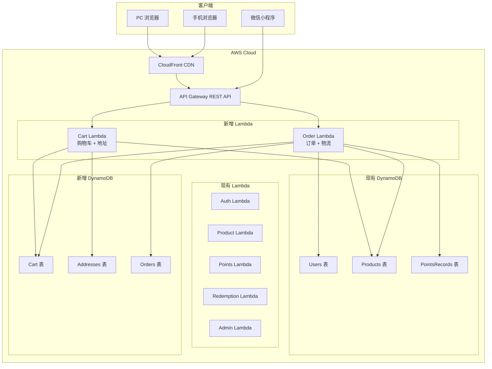
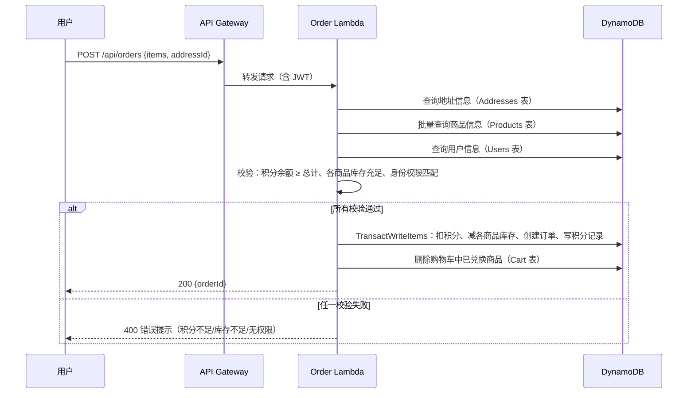
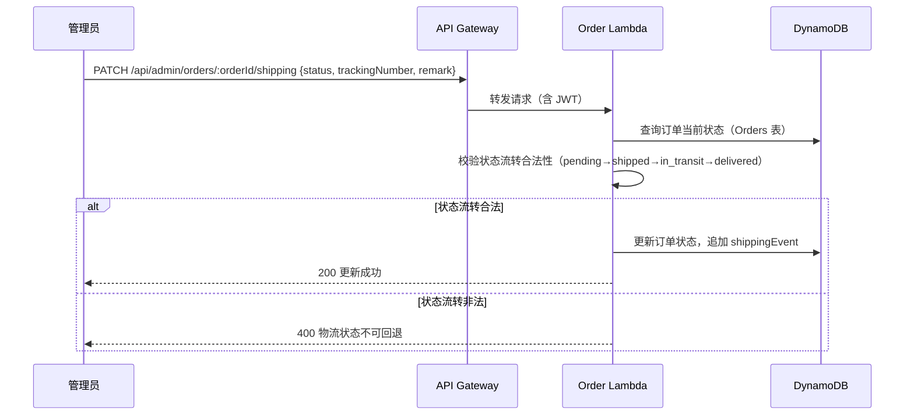

# 技术设计文档 - 购物车、收货信息与物流追踪

## 概述（Overview）

本功能为积分商城系统新增三大模块：购物车（Cart）、收货地址管理（Address）和订单物流追踪（Order）。当前系统仅支持单件商品逐一兑换，无收货信息收集和物流追踪能力。本次扩展将：

1. 新增购物车服务，支持用户批量选购积分商品并一次性兑换
2. 新增收货地址管理，用户可在个人中心维护多个收货地址
3. 新增订单服务，统一管理兑换订单并提供物流状态追踪
4. 扩展管理端，支持管理员查看订单和更新物流状态

设计原则：
- 复用现有认证、商品、积分等服务，不修改已有 Lambda 的核心逻辑
- 新增 3 张 DynamoDB 表（Cart、Addresses、Orders），遵循现有多表设计模式
- 新增 2 个 Lambda 函数（Cart+Address、Order），保持与现有 Lambda 一致的代码结构
- 前端新增 5 个页面，复用现有设计系统和组件模式

---

## 架构（Architecture）

### 扩展架构图



### 架构决策说明

| 决策 | 选择 | 理由 |
|------|------|------|
| Lambda 拆分 | Cart+Address 合一，Order 独立 | 购物车和地址操作轻量且关联紧密；订单涉及多表事务，独立部署便于调优 |
| 购物车存储 | DynamoDB 表 | 与现有数据层一致，支持持久化（用户关闭浏览器后购物车不丢失） |
| 订单表设计 | 订单项内嵌（items 列表） | 避免额外的 OrderItems 表，单次读取即可获取完整订单 |
| 物流状态机 | 应用层校验状态流转 | 状态仅 4 种且流转单向，无需引入 Step Functions |
| 手机号遮蔽 | 前端展示层处理 | 后端存储完整手机号，仅在订单详情展示时遮蔽中间四位 |

---

## 组件与接口（Components and Interfaces）

### 1. 购物车服务（Cart Service）

负责购物车的增删改查操作。

**API 接口：**

| 方法 | 路径 | 描述 |
|------|------|------|
| GET | `/api/cart` | 获取当前用户购物车 |
| POST | `/api/cart/items` | 添加商品到购物车 |
| PUT | `/api/cart/items/:productId` | 更新购物车项数量 |
| DELETE | `/api/cart/items/:productId` | 删除购物车项 |

**关键接口定义：**

```typescript
// 添加商品到购物车
interface AddToCartRequest {
  productId: string;
}

// 更新购物车项数量
interface UpdateCartItemRequest {
  quantity: number; // 0 表示删除
}

// 购物车响应
interface CartResponse {
  userId: string;
  items: CartItemDetail[];
  totalPoints: number;
  updatedAt: string;
}

// 购物车项详情（含商品信息）
interface CartItemDetail {
  productId: string;
  productName: string;
  imageUrl: string;
  pointsCost: number;
  quantity: number;
  subtotal: number;       // pointsCost * quantity
  stock: number;          // 当前库存
  status: 'active' | 'inactive';
  available: boolean;     // 是否可兑换（库存充足且上架）
}
```

### 2. 收货地址服务（Address Service）

负责收货地址的 CRUD 操作。

**API 接口：**

| 方法 | 路径 | 描述 |
|------|------|------|
| GET | `/api/addresses` | 获取用户所有收货地址 |
| POST | `/api/addresses` | 添加收货地址 |
| PUT | `/api/addresses/:addressId` | 编辑收货地址 |
| DELETE | `/api/addresses/:addressId` | 删除收货地址 |
| PATCH | `/api/addresses/:addressId/default` | 设为默认地址 |

**关键接口定义：**

```typescript
// 创建/编辑地址请求
interface AddressRequest {
  recipientName: string;  // 收件人姓名，1-20 字符
  phone: string;          // 手机号，11 位数字以 1 开头
  detailAddress: string;  // 详细地址，1-200 字符
  isDefault?: boolean;    // 是否设为默认
}

// 地址响应
interface AddressResponse {
  addressId: string;
  userId: string;
  recipientName: string;
  phone: string;
  detailAddress: string;
  isDefault: boolean;
  createdAt: string;
  updatedAt: string;
}
```

### 3. 订单服务（Order Service）

负责订单创建、查询和物流状态管理。

**API 接口：**

| 方法 | 路径 | 描述 |
|------|------|------|
| POST | `/api/orders` | 创建订单（购物车批量兑换） |
| POST | `/api/orders/direct` | 直接下单（单件商品立即兑换） |
| GET | `/api/orders` | 订单列表（分页） |
| GET | `/api/orders/:orderId` | 订单详情 |

**管理端 API 接口：**

| 方法 | 路径 | 描述 |
|------|------|------|
| GET | `/api/admin/orders` | 所有订单列表（支持状态筛选） |
| GET | `/api/admin/orders/:orderId` | 订单详情 |
| PATCH | `/api/admin/orders/:orderId/shipping` | 更新物流状态 |
| GET | `/api/admin/orders/stats` | 订单统计 |

**关键接口定义：**

```typescript
// 创建订单请求（购物车批量）
interface CreateOrderRequest {
  items: { productId: string; quantity: number }[];
  addressId: string;
}

// 直接下单请求（单件商品）
interface DirectOrderRequest {
  productId: string;
  quantity: number;
  addressId: string;
}

// 更新物流状态请求
interface UpdateShippingRequest {
  status: ShippingStatus;
  trackingNumber?: string; // shipped 时必填
  remark?: string;
}

// 物流状态
type ShippingStatus = 'pending' | 'shipped' | 'in_transit' | 'delivered';

// 物流事件
interface ShippingEvent {
  status: ShippingStatus;
  timestamp: string;
  remark?: string;
  operatorId?: string; // 管理员 ID
}

// 订单响应
interface OrderResponse {
  orderId: string;
  userId: string;
  items: OrderItem[];
  totalPoints: number;
  shippingAddress: {
    recipientName: string;
    phone: string;        // 完整手机号（详情展示时前端遮蔽）
    detailAddress: string;
  };
  shippingStatus: ShippingStatus;
  trackingNumber?: string;
  shippingEvents: ShippingEvent[];
  createdAt: string;
  updatedAt: string;
}

// 订单项
interface OrderItem {
  productId: string;
  productName: string;
  imageUrl: string;
  pointsCost: number;
  quantity: number;
  subtotal: number;
}

// 订单列表项（简略）
interface OrderListItem {
  orderId: string;
  itemCount: number;
  totalPoints: number;
  shippingStatus: ShippingStatus;
  createdAt: string;
}

// 订单统计
interface OrderStats {
  pending: number;
  shipped: number;
  inTransit: number;
  delivered: number;
  total: number;
}
```

### 组件交互流程

#### 购物车批量兑换下单流程



#### 管理员更新物流状态流程



---

## 数据模型（Data Models）

### 新增 DynamoDB 表设计

### 1. Cart 表

每个用户一条记录，购物车项以 Map 列表形式内嵌。

| 属性 | 类型 | 说明 |
|------|------|------|
| PK: `userId` | String | 用户 ID |
| `items` | List\<Map\> | 购物车项列表 |
| `items[].productId` | String | 商品 ID |
| `items[].quantity` | Number | 数量 |
| `items[].addedAt` | String | 添加时间 ISO 8601 |
| `updatedAt` | String | 最后更新时间 |

设计说明：以 `userId` 为分区键，每个用户仅一条记录。购物车项上限 20 种，数据量小，适合内嵌。

### 2. Addresses 表

| 属性 | 类型 | 说明 |
|------|------|------|
| PK: `addressId` | String | 地址唯一 ID（ULID） |
| `userId` | String | 用户 ID（GSI） |
| `recipientName` | String | 收件人姓名 |
| `phone` | String | 手机号码 |
| `detailAddress` | String | 详细地址 |
| `isDefault` | Boolean | 是否为默认地址 |
| `createdAt` | String | 创建时间 |
| `updatedAt` | String | 更新时间 |

**GSI：**
- `userId-index`：PK = `userId`，用于查询用户所有地址

### 3. Orders 表

| 属性 | 类型 | 说明 |
|------|------|------|
| PK: `orderId` | String | 订单唯一 ID（ULID） |
| `userId` | String | 用户 ID（GSI） |
| `items` | List\<Map\> | 订单商品列表 |
| `items[].productId` | String | 商品 ID |
| `items[].productName` | String | 商品名称（冗余） |
| `items[].imageUrl` | String | 商品图片 |
| `items[].pointsCost` | Number | 单价积分 |
| `items[].quantity` | Number | 数量 |
| `items[].subtotal` | Number | 小计积分 |
| `totalPoints` | Number | 积分总计 |
| `shippingAddress` | Map | 收货信息快照 |
| `shippingAddress.recipientName` | String | 收件人 |
| `shippingAddress.phone` | String | 手机号 |
| `shippingAddress.detailAddress` | String | 详细地址 |
| `shippingStatus` | String | 当前物流状态 |
| `trackingNumber` | String | 物流单号 |
| `shippingEvents` | List\<Map\> | 物流事件时间线 |
| `shippingEvents[].status` | String | 状态 |
| `shippingEvents[].timestamp` | String | 时间 |
| `shippingEvents[].remark` | String | 备注 |
| `shippingEvents[].operatorId` | String | 操作人 ID |
| `createdAt` | String | 创建时间 |
| `updatedAt` | String | 更新时间 |

**GSI：**
- `userId-createdAt-index`：PK = `userId`，SK = `createdAt`，用于查询用户订单列表（按时间倒序）
- `shippingStatus-createdAt-index`：PK = `shippingStatus`，SK = `createdAt`，用于管理端按状态筛选订单

### 数据一致性策略

购物车批量兑换涉及多表写入，使用 DynamoDB TransactWriteItems 保证原子性：

```typescript
// 批量兑换订单的事务写入
const transactItems = [
  // 1. 扣减用户积分（条件：余额充足）
  {
    Update: {
      TableName: 'Users',
      Key: { userId },
      UpdateExpression: 'SET points = points - :total, updatedAt = :now',
      ConditionExpression: 'points >= :total',
      ExpressionAttributeValues: { ':total': totalPoints, ':now': now },
    },
  },
  // 2. 对每个商品减库存（条件：库存充足且上架）
  ...items.map((item) => ({
    Update: {
      TableName: 'Products',
      Key: { productId: item.productId },
      UpdateExpression:
        'SET stock = stock - :qty, redemptionCount = redemptionCount + :qty, updatedAt = :now',
      ConditionExpression: 'stock >= :qty AND #s = :active',
      ExpressionAttributeNames: { '#s': 'status' },
      ExpressionAttributeValues: {
        ':qty': item.quantity,
        ':active': 'active',
        ':now': now,
      },
    },
  })),
  // 3. 创建订单记录
  {
    Put: {
      TableName: 'Orders',
      Item: orderRecord,
    },
  },
  // 4. 写入积分扣减记录
  {
    Put: {
      TableName: 'PointsRecords',
      Item: pointsRecord,
    },
  },
];
```

注意：DynamoDB TransactWriteItems 最多支持 100 个操作。购物车上限 20 种商品 + 用户积分更新 + 订单记录 + 积分记录 = 最多 23 个操作，在限制范围内。


---

## 正确性属性（Correctness Properties）

*属性（Property）是指在系统所有有效执行中都应成立的特征或行为——本质上是对系统应做什么的形式化陈述。属性是人类可读规范与机器可验证正确性保证之间的桥梁。*

### Property 1: 添加商品到购物车递增数量

*对于任何*用户和任何有效的积分商品，将该商品添加到购物车后，该商品在购物车中的数量应等于添加前的数量加 1（新商品从 0 开始计算）。

**Validates: Requirements 1.1, 1.2**

### Property 2: 拒绝无效商品加入购物车

*对于任何* Code 专属商品、已下架商品或库存为零的商品，添加到购物车的操作应被拒绝，且购物车内容保持不变。

**Validates: Requirements 1.3, 1.4**

### Property 3: 购物车积分总计正确性

*对于任何*购物车项集合，积分总计应等于所有项的 `pointsCost × quantity` 之和。

**Validates: Requirements 2.2, 2.3**

### Property 4: 数量为零时移除购物车项

*对于任何*包含商品的购物车，将某商品数量设为零后，该商品应不再出现在购物车项列表中，且购物车项总数减少 1。

**Validates: Requirements 2.4**

### Property 5: 购物车商品可用性检查

*对于任何*购物车项，如果对应商品已下架（status ≠ active）或库存不足（stock < quantity），则该项的 `available` 标记应为 false；否则应为 true。

**Validates: Requirements 2.5**

### Property 6: 收货地址 CRUD 往返一致性

*对于任何*有效的收货地址数据，创建地址后查询应返回相同的收件人、手机号和详细地址；编辑地址后查询应返回更新后的数据；删除地址后查询应不再返回该地址。

**Validates: Requirements 3.2, 3.6, 3.7**

### Property 7: 收货地址输入验证

*对于任何*不符合格式要求的地址输入（手机号不匹配 `^1\d{10}$`、收件人姓名为空或超过 20 字符、详细地址为空或超过 200 字符），创建或编辑地址的操作应被拒绝并返回对应的错误提示。

**Validates: Requirements 3.3, 3.4, 3.5**

### Property 8: 默认地址唯一性不变量

*对于任何*用户，在任意时刻其收货地址列表中最多只有一个地址的 `isDefault` 为 true。当设置某地址为默认时，之前的默认地址应自动取消默认标记。

**Validates: Requirements 3.8**

### Property 9: 默认地址排序优先

*对于任何*拥有多个收货地址且其中一个为默认地址的用户，查询地址列表时默认地址应排在第一位。

**Validates: Requirements 3.11**

### Property 10: 订单创建成功流程

*对于任何*积分充足、所有商品库存充足且身份权限匹配的用户和商品集合，创建订单后：用户积分应减少积分总计数量，每个商品库存应减少对应数量，系统应生成包含正确商品列表和收货信息的订单记录，订单初始物流状态应为 `pending`，且应生成积分扣减记录。

**Validates: Requirements 4.2, 4.3, 4.4, 4.5, 6.2**

### Property 11: 订单创建失败时状态不变

*对于任何*因积分不足、库存不足或身份不匹配而失败的订单创建请求，用户积分余额和所有商品库存应保持不变，且不应生成任何订单或积分记录。

**Validates: Requirements 4.8, 4.9, 4.11**

### Property 12: 订单创建后购物车清理

*对于任何*通过购物车成功创建的订单，购物车中已兑换的商品应被移除，未选中的商品应保留不变。

**Validates: Requirements 4.6**

### Property 13: 订单列表排序与完整性

*对于任何*用户的订单集合，订单列表应按创建时间倒序排列，且每条记录应包含订单编号、创建时间、商品数量、积分总计和当前物流状态。

**Validates: Requirements 5.1, 5.2**

### Property 14: 手机号遮蔽规则

*对于任何* 11 位中国大陆手机号，遮蔽后的格式应为前 3 位 + `****` + 后 4 位（例如 `138****1234`），且遮蔽前后的前 3 位和后 4 位应保持一致。

**Validates: Requirements 5.5**

### Property 15: 物流状态单向流转

*对于任何*订单和任何物流状态变更请求，仅当新状态是当前状态在序列 `pending → shipped → in_transit → delivered` 中的直接后继时，变更才应成功；否则应被拒绝。

**Validates: Requirements 7.4, 7.5**

### Property 16: 物流事件记录完整性

*对于任何*成功的物流状态变更，订单的 `shippingEvents` 列表应追加一条包含新状态、变更时间和备注的记录，且列表长度应增加 1。

**Validates: Requirements 6.4, 7.3**

### Property 17: 管理端订单状态筛选正确性

*对于任何*物流状态筛选条件，管理端返回的订单列表中每个订单的 `shippingStatus` 都应与筛选条件一致。

**Validates: Requirements 7.1**

### Property 18: 订单统计准确性

*对于任何*订单集合，统计接口返回的各状态数量之和应等于总订单数，且每个状态的数量应等于该状态下的实际订单数。

**Validates: Requirements 7.7**

### Property 19: 直接下单与购物车下单格式一致

*对于任何*通过商品详情页"立即兑换"创建的订单，其数据结构（items、shippingAddress、shippingStatus、shippingEvents）应与通过购物车创建的订单格式完全一致。

**Validates: Requirements 8.2, 8.4**

---

## 错误处理（Error Handling）

### 新增错误码定义

| HTTP 状态码 | 错误码 | 描述 | 对应需求 |
|-------------|--------|------|----------|
| 400 | `CODE_PRODUCT_NOT_CARTABLE` | Code 专属商品不支持加入购物车 | 1.3 |
| 400 | `PRODUCT_UNAVAILABLE` | 商品已下架或库存为零 | 1.4 |
| 400 | `CART_FULL` | 购物车已满（20 种上限） | 1.5 |
| 400 | `INVALID_PHONE` | 手机号格式错误 | 3.3 |
| 400 | `INVALID_RECIPIENT_NAME` | 收件人姓名格式错误 | 3.4 |
| 400 | `INVALID_DETAIL_ADDRESS` | 详细地址格式错误 | 3.5 |
| 400 | `ADDRESS_LIMIT_REACHED` | 收货地址数量已达上限（10 个） | 3.9 |
| 400 | `ADDRESS_NOT_FOUND` | 收货地址不存在 | 4.10 |
| 400 | `NO_ADDRESS_SELECTED` | 请选择收货地址 | 4.10 |
| 400 | `INSUFFICIENT_POINTS` | 积分不足（复用现有错误码） | 4.8 |
| 400 | `OUT_OF_STOCK` | 商品库存不足（复用现有错误码） | 4.9 |
| 400 | `NO_REDEMPTION_PERMISSION` | 无兑换权限（复用现有错误码） | 4.11 |
| 400 | `INVALID_STATUS_TRANSITION` | 物流状态不可回退 | 7.5 |
| 400 | `TRACKING_NUMBER_REQUIRED` | 发货时需填写物流单号 | 7.6 |
| 404 | `ORDER_NOT_FOUND` | 订单不存在 | 5.4 |
| 404 | `CART_ITEM_NOT_FOUND` | 购物车项不存在 | 2.4 |

### 错误处理策略

1. **输入验证错误（4xx）**：直接返回具体错误码和中文提示，不重试
2. **DynamoDB 事务冲突**：订单创建事务失败时自动重试最多 3 次（指数退避），重试仍失败则返回 500
3. **并发下单冲突**：依赖 DynamoDB ConditionExpression 保证积分和库存不会超扣
4. **购物车商品状态变化**：下单时实时校验商品状态，不依赖购物车缓存的商品信息
5. **地址删除后下单**：下单时校验 addressId 是否存在，不存在则返回 `ADDRESS_NOT_FOUND`

---

## 测试策略（Testing Strategy）

### 双重测试方法

本功能采用单元测试 + 属性测试的双重策略，与现有系统保持一致：

- **单元测试**：验证具体示例、边界情况和错误条件
- **属性测试**：验证跨所有输入的通用属性

### 技术选型

| 类别 | 工具 |
|------|------|
| 测试框架 | Vitest |
| 属性测试库 | fast-check |
| 覆盖率工具 | Vitest 内置 c8 |

### 单元测试范围

单元测试聚焦于：
- 边界情况：购物车满 20 种时添加第 21 种（1.5）、地址满 10 个时添加第 11 个（3.9）
- 具体示例：下单时未选择收货地址（4.10）、发货时未填物流单号（7.6）、查看订单详情（5.4）、管理员查看订单详情（7.2）
- 错误条件：各种 4xx 错误场景
- 集成点：DynamoDB 事务操作（批量兑换的原子性）

### 属性测试范围

每个正确性属性对应一个属性测试，使用 fast-check 库实现。

**配置要求：**
- 每个属性测试最少运行 100 次迭代
- 每个测试必须用注释引用设计文档中的属性编号
- 标签格式：`Feature: cart-shipping-tracking, Property {number}: {property_text}`
- 每个正确性属性由单个属性测试实现

**属性测试清单：**

| 属性编号 | 测试描述 | 生成器 |
|----------|----------|--------|
| Property 1 | 添加商品到购物车递增数量 | 随机用户 + 随机购物车状态 + 随机积分商品 |
| Property 2 | 拒绝无效商品加入购物车 | 随机 code_exclusive/inactive/零库存商品 |
| Property 3 | 购物车积分总计正确性 | 随机购物车项列表（随机 pointsCost 和 quantity） |
| Property 4 | 数量为零时移除购物车项 | 随机购物车 + 随机选择一项设为 0 |
| Property 5 | 购物车商品可用性检查 | 随机购物车项 + 随机商品状态/库存组合 |
| Property 6 | 收货地址 CRUD 往返 | 随机有效地址数据 |
| Property 7 | 收货地址输入验证 | 随机无效手机号/姓名/地址字符串 |
| Property 8 | 默认地址唯一性不变量 | 随机用户 + 随机多个地址 + 随机设置默认 |
| Property 9 | 默认地址排序优先 | 随机用户 + 随机地址列表（含一个默认） |
| Property 10 | 订单创建成功流程 | 随机用户（积分充足）+ 随机商品集合（库存充足） |
| Property 11 | 订单创建失败状态不变 | 随机用户（积分不足/库存不足/角色不匹配） |
| Property 12 | 订单创建后购物车清理 | 随机购物车（部分选中）+ 成功下单 |
| Property 13 | 订单列表排序与完整性 | 随机订单集合（随机创建时间） |
| Property 14 | 手机号遮蔽规则 | 随机 11 位手机号（以 1 开头） |
| Property 15 | 物流状态单向流转 | 随机订单状态 + 随机目标状态 |
| Property 16 | 物流事件记录完整性 | 随机订单 + 合法状态变更 |
| Property 17 | 管理端订单状态筛选 | 随机订单集合（混合状态）+ 随机筛选条件 |
| Property 18 | 订单统计准确性 | 随机订单集合（混合状态） |
| Property 19 | 直接下单格式一致 | 随机单件商品直接下单 vs 购物车下单 |

### 测试示例

```typescript
import { describe, it, expect } from 'vitest';
import fc from 'fast-check';

// Feature: cart-shipping-tracking, Property 3: 购物车积分总计正确性
describe('Property 3: 购物车积分总计正确性', () => {
  it('总计应等于所有项的 pointsCost × quantity 之和', () => {
    const cartItemArb = fc.record({
      pointsCost: fc.integer({ min: 1, max: 10000 }),
      quantity: fc.integer({ min: 1, max: 99 }),
    });

    fc.assert(
      fc.property(fc.array(cartItemArb, { minLength: 1, maxLength: 20 }), (items) => {
        const expectedTotal = items.reduce((sum, item) => sum + item.pointsCost * item.quantity, 0);
        const result = calculateCartTotal(items);
        expect(result).toBe(expectedTotal);
      }),
      { numRuns: 100 },
    );
  });
});

// Feature: cart-shipping-tracking, Property 14: 手机号遮蔽规则
describe('Property 14: 手机号遮蔽规则', () => {
  it('遮蔽后前3位和后4位应保持不变', () => {
    const phoneArb = fc
      .tuple(
        fc.constantFrom('1'),
        fc.stringOf(fc.constantFrom('0','1','2','3','4','5','6','7','8','9'), { minLength: 10, maxLength: 10 }),
      )
      .map(([prefix, rest]) => prefix + rest);

    fc.assert(
      fc.property(phoneArb, (phone) => {
        const masked = maskPhone(phone);
        expect(masked).toHaveLength(11);
        expect(masked.slice(0, 3)).toBe(phone.slice(0, 3));
        expect(masked.slice(7)).toBe(phone.slice(7));
        expect(masked.slice(3, 7)).toBe('****');
      }),
      { numRuns: 100 },
    );
  });
});

// Feature: cart-shipping-tracking, Property 15: 物流状态单向流转
describe('Property 15: 物流状态单向流转', () => {
  const STATUS_ORDER = ['pending', 'shipped', 'in_transit', 'delivered'] as const;

  it('仅允许流转到直接后继状态', () => {
    fc.assert(
      fc.property(
        fc.integer({ min: 0, max: 3 }),
        fc.integer({ min: 0, max: 3 }),
        (currentIdx, targetIdx) => {
          const current = STATUS_ORDER[currentIdx];
          const target = STATUS_ORDER[targetIdx];
          const result = validateStatusTransition(current, target);
          expect(result.valid).toBe(targetIdx === currentIdx + 1);
        },
      ),
      { numRuns: 100 },
    );
  });
});
```
