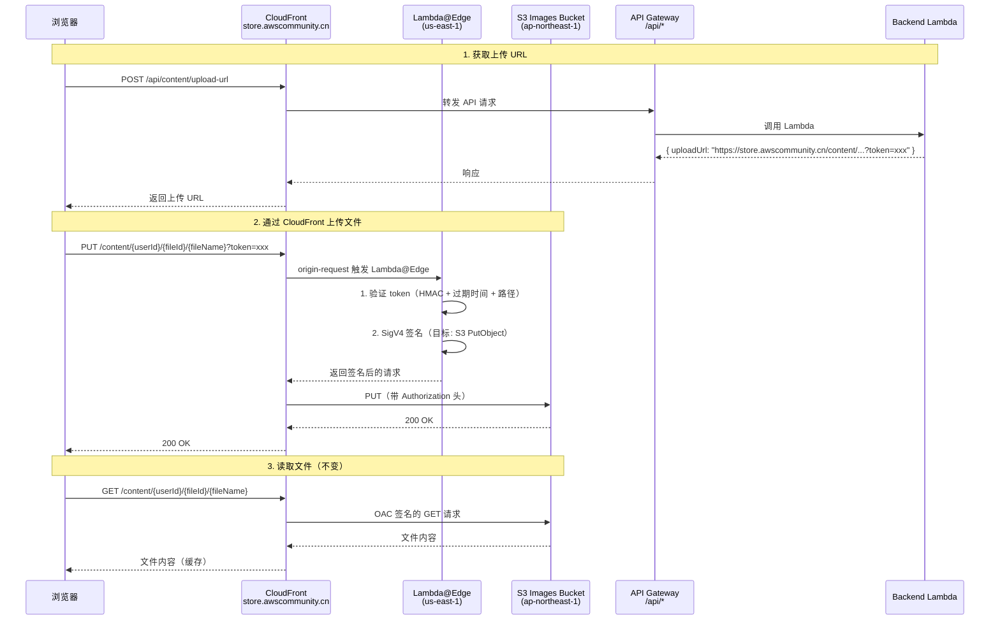

# 设计文档：CloudFront 上传代理

## 概述

本设计通过改造现有 CloudFront Distribution，使文件上传流量从前端经 CloudFront 边缘节点转发到 S3，替代当前直接访问 `*.amazonaws.com` 域名的 presigned URL 方案。核心变更包括：

1. **CloudFront 行为改造**：为 `/products/*`、`/content/*`、`/claims/*` 路径启用 PUT 方法，区分读写请求的缓存策略
2. **Lambda@Edge 边缘签名**：部署在 us-east-1 的 Lambda@Edge 函数，拦截 PUT 请求并使用 SigV4 对请求重新签名后转发到 S3
3. **上传鉴权令牌**：后端生成包含授权 S3 Key 的短期 HMAC 令牌，Lambda@Edge 验证令牌有效性和路径一致性
4. **后端 URL 生成改造**：通过环境变量 `UPLOAD_VIA_CLOUDFRONT` 控制，生成 `https://store.awscommunity.cn/{path}?token=xxx` 格式的上传 URL
5. **前端适配**：上传逻辑兼容两种 URL 格式，增加重试机制和错误提示

### 设计决策

**为什么选择 Lambda@Edge 而非 CloudFront Functions？**

CloudFront Functions 运行在 viewer 侧，有以下限制导致不适用：
- 不支持网络调用（无法执行 SigV4 签名所需的 crypto 操作以外的功能）
- 最大执行时间 1ms（签名计算可能超时）
- 不支持环境变量（无法传递 bucket 名称等配置）
- 无法访问请求体（PUT 上传需要 body hash）

Lambda@Edge 部署在 origin-request 阶段，可以：
- 访问完整请求（包括 body hash）
- 执行 SigV4 签名
- 通过 Lambda 环境变量或硬编码获取配置
- 最大执行时间 30 秒，足够完成签名

**为什么使用 HMAC 令牌而非复用 JWT？**

- JWT 令牌较大（~500 字节），作为查询参数会增加 URL 长度
- 上传令牌只需验证路径和过期时间，不需要完整的用户信息
- HMAC 令牌更轻量，生成和验证速度更快
- 令牌中编码了授权的 S3 Key，防止路径篡改

**为什么在 origin-request 阶段而非 viewer-request 阶段？**

- origin-request 阶段可以修改发往 origin 的请求头（添加 Authorization）
- 此阶段请求已经过 CloudFront 处理，可以获取最终的 origin 信息
- PUT 请求不会被缓存（CachePolicy 设为 CACHING_DISABLED），所以每次都会触发 origin-request

## 架构



### 关键架构约束

- Lambda@Edge 必须部署在 **us-east-1**，CloudFront 会自动将其复制到全球边缘节点
- Lambda@Edge **不支持环境变量**，bucket 名称和区域需要在构建时注入或硬编码
- Lambda@Edge 的 IAM Role 需要 `s3:PutObject` 权限
- 现有 OAC 配置仅用于 GET 请求，PUT 请求由 Lambda@Edge 的 SigV4 签名授权
- CloudFront 对 PUT 请求默认不缓存，无需额外配置

## 组件与接口

### 1. Lambda@Edge 边缘签名函数 (Edge Signer)

**文件位置**：`packages/cdk/lambda/edge-signer/index.ts`

**触发阶段**：CloudFront origin-request

**职责**：
- 验证上传鉴权令牌
- 对 PUT 请求执行 SigV4 签名
- 对非 PUT 请求直接放行

```typescript
// Lambda@Edge handler 接口
interface EdgeSignerConfig {
  bucketName: string;        // Images bucket 名称
  bucketRegion: string;      // 'ap-northeast-1'
  tokenSecret: string;       // HMAC 签名密钥
}

// 鉴权令牌结构（编码在查询参数 token 中）
interface UploadToken {
  key: string;               // 授权的 S3 Key（如 'content/user123/abc/file.pdf'）
  exp: number;               // 过期时间戳（Unix seconds）
  sig: string;               // HMAC-SHA256 签名
}

// origin-request handler
export async function handler(event: CloudFrontRequestEvent): Promise<CloudFrontRequest | CloudFrontResultResponse> {
  const request = event.Records[0].cf.request;
  
  // 非 PUT 请求直接放行
  if (request.method !== 'PUT') {
    return request;
  }
  
  // 1. 从查询参数提取并验证 token
  // 2. 验证 token 未过期
  // 3. 验证请求路径与 token 中的 key 一致
  // 4. 使用 SigV4 签名请求
  // 5. 返回签名后的请求
}
```

### 2. 上传令牌生成模块 (Upload Token Generator)

**文件位置**：`packages/backend/src/utils/upload-token.ts`

**职责**：
- 生成包含 S3 Key 和过期时间的 HMAC 令牌
- 验证令牌（供测试使用）

```typescript
interface GenerateUploadTokenInput {
  key: string;               // S3 Key
  expiresIn?: number;        // 过期秒数，默认 300
}

interface UploadTokenResult {
  token: string;             // Base64URL 编码的令牌字符串
}

// 令牌格式: base64url({ key, exp }) + '.' + hmac_signature
export function generateUploadToken(input: GenerateUploadTokenInput, secret: string): UploadTokenResult;
export function verifyUploadToken(token: string, secret: string): { valid: boolean; key?: string; error?: string };
```

### 3. 后端上传 URL 生成改造

**影响文件**：
- `packages/backend/src/admin/images.ts` — 商品图片上传
- `packages/backend/src/content/upload.ts` — Content Hub 文档上传
- `packages/backend/src/claims/images.ts` — 积分申请图片上传

**改造逻辑**：

```typescript
// 环境变量控制
const UPLOAD_VIA_CLOUDFRONT = process.env.UPLOAD_VIA_CLOUDFRONT === 'true';
const CLOUDFRONT_DOMAIN = 'https://store.awscommunity.cn';
const UPLOAD_TOKEN_SECRET = process.env.UPLOAD_TOKEN_SECRET || '';

// 改造后的 URL 生成逻辑
if (UPLOAD_VIA_CLOUDFRONT) {
  // 生成 CloudFront URL: https://store.awscommunity.cn/{key}?token=xxx
  const token = generateUploadToken({ key }, UPLOAD_TOKEN_SECRET);
  const uploadUrl = `${CLOUDFRONT_DOMAIN}/${key}?token=${token.token}`;
} else {
  // 保留原有 S3 presigned URL 逻辑
  const uploadUrl = await getSignedUrl(s3Client, command, { expiresIn: 300 });
}
```

### 4. CDK 基础设施变更

**影响文件**：
- `packages/cdk/lib/frontend-stack.ts` — CloudFront 行为配置
- `packages/cdk/bin/app.ts` — Stack 间参数传递

**新增资源**：
- Lambda@Edge 函数（us-east-1）
- Lambda@Edge IAM Role（含 s3:PutObject 权限）
- CloudFront 上传路径的自定义 Origin Request Policy
- CloudFront 上传路径的 Response Headers Policy（CORS）

### 5. 前端上传适配

**影响文件**：
- `packages/frontend/src/pages/admin/products.tsx` — 商品图片上传
- `packages/frontend/src/pages/content/upload.tsx` — Content Hub 文档上传
- 积分申请图片上传页面

**改造逻辑**：
- 前端无需区分 URL 格式，直接使用后端返回的 `uploadUrl` 执行 PUT
- 增加重试机制：失败后自动重试最多 2 次，间隔 2 秒
- 增加 403 错误特殊处理：提示"上传授权已过期"

## 数据模型

### 上传鉴权令牌格式

令牌采用紧凑的自定义格式，避免 JWT 的体积开销：

```
token = base64url(payload) + '.' + base64url(hmac_sha256(payload, secret))

payload = JSON.stringify({
  k: string,    // S3 Key（如 'products/abc/123.jpg'）
  e: number     // 过期时间戳（Unix seconds）
})
```

**示例**：
```
eyJrIjoicHJvZHVjdHMvYWJjLzEyMy5qcGciLCJlIjoxNzA5MTIzNDU2fQ.dGhpcyBpcyBhIHNpZ25hdHVyZQ
```

### 环境变量

| 变量名 | 所属组件 | 说明 |
|--------|---------|------|
| `UPLOAD_VIA_CLOUDFRONT` | Backend Lambda | 是否启用 CloudFront 上传代理（`true`/`false`） |
| `UPLOAD_TOKEN_SECRET` | Backend Lambda | HMAC 令牌签名密钥 |
| `UPLOAD_TOKEN_SECRET` | Lambda@Edge（构建时注入） | HMAC 令牌验证密钥（与后端一致） |

### CloudFront 行为配置变更

| 路径 | 当前配置 | 改造后配置 |
|------|---------|-----------|
| `/products/*` | GET only, CACHING_OPTIMIZED | GET: CACHING_OPTIMIZED; PUT: CACHING_DISABLED + Lambda@Edge |
| `/content/*` | GET only, CACHING_OPTIMIZED | GET: CACHING_OPTIMIZED; PUT: CACHING_DISABLED + Lambda@Edge |
| `/claims/*` | GET only, CACHING_OPTIMIZED | GET: CACHING_OPTIMIZED; PUT: CACHING_DISABLED + Lambda@Edge |

> **注意**：CloudFront 的单个行为（behavior）无法按 HTTP 方法区分缓存策略。实际实现中，将行为的 AllowedMethods 改为包含 PUT，CachePolicy 改为 CACHING_DISABLED。由于图片/文档的 GET 请求量远大于 PUT，禁用缓存会影响读取性能。
>
> **解决方案**：使用 Lambda@Edge 在 origin-request 阶段处理。对于 GET 请求，Lambda@Edge 直接放行，CloudFront 仍然可以缓存响应（因为缓存是基于响应头的 Cache-Control）。对于 PUT 请求，Lambda@Edge 执行签名逻辑。同时配置自定义 Cache Policy，设置较短的默认 TTL 但允许 origin 通过 Cache-Control 头控制缓存行为。


## 正确性属性

*属性（Property）是指在系统所有有效执行中都应成立的特征或行为——本质上是对系统应做什么的形式化陈述。属性是人类可读规格说明与机器可验证正确性保证之间的桥梁。*

### 属性 1：仅对 PUT 请求执行签名

*对于任意* HTTP 方法的 CloudFront origin-request 事件，Edge Signer 应仅对 PUT 方法执行 SigV4 签名逻辑，对所有其他方法（GET、HEAD、OPTIONS 等）直接放行原始请求，不修改任何请求头。

**验证需求：2.1**

### 属性 2：无效令牌拒绝访问

*对于任意* PUT 请求，若请求未携带鉴权令牌、令牌签名无效、或令牌已过期，Edge Signer 应返回 HTTP 403 状态码并拒绝该请求，不执行 S3 签名。

**验证需求：3.1, 3.2, 3.3**

### 属性 3：路径篡改防护

*对于任意* 有效的上传鉴权令牌（授权 S3 Key 为 X）和任意请求路径 Y（其中 Y ≠ X），Edge Signer 应返回 HTTP 403 状态码并拒绝该请求。

**验证需求：3.5**

### 属性 4：上传 URL 格式正确性

*对于任意* 有效的上传参数（productId、userId、fileName），当 `UPLOAD_VIA_CLOUDFRONT=true` 时，Upload URL Generator 生成的 URL 应满足：
- 商品图片：匹配 `https://store.awscommunity.cn/products/{productId}/{fileId}.{ext}?token=...`
- Content Hub 文档：匹配 `https://store.awscommunity.cn/content/{userId}/{fileId}/{fileName}?token=...`
- 积分申请图片：匹配 `https://store.awscommunity.cn/claims/{userId}/{fileId}.{ext}?token=...`

**验证需求：4.1, 4.2, 4.3, 4.4**

### 属性 5：令牌往返一致性

*对于任意* S3 Key，生成的上传鉴权令牌经解析后应满足：
- 令牌中编码的 Key 与输入的 S3 Key 完全一致
- 令牌的过期时间为生成时刻 + 300 秒（±1 秒容差）
- 令牌的 HMAC 签名可通过相同密钥验证

**验证需求：4.5, 4.6, 3.4**

### 属性 6：功能开关控制 URL 格式

*对于任意* 有效的上传参数，当 `UPLOAD_VIA_CLOUDFRONT` 环境变量为 `true` 时，生成的上传 URL 域名应为 `store.awscommunity.cn`；当环境变量未设置或为 `false` 时，生成的上传 URL 应为 S3 presigned URL（域名包含 `s3.ap-northeast-1.amazonaws.com`）。

**验证需求：8.1, 8.2, 8.3**

## 错误处理

### Lambda@Edge 错误处理

| 错误场景 | HTTP 状态码 | 响应体 | 说明 |
|---------|-----------|--------|------|
| 缺少 token 参数 | 403 | `{ "error": "MISSING_TOKEN", "message": "Upload token is required" }` | PUT 请求未携带 token |
| token 签名无效 | 403 | `{ "error": "INVALID_TOKEN", "message": "Upload token is invalid" }` | HMAC 验证失败 |
| token 已过期 | 403 | `{ "error": "TOKEN_EXPIRED", "message": "Upload token has expired" }` | 当前时间 > exp |
| 路径不匹配 | 403 | `{ "error": "PATH_MISMATCH", "message": "Upload path does not match token" }` | 请求路径 ≠ token.key |
| 签名过程异常 | 500 | `{ "error": "SIGNING_ERROR", "message": "Internal signing error" }` | SigV4 签名失败 |

### 后端 URL 生成错误处理

- 文件类型校验失败：保留现有的 `INVALID_FILE_TYPE` / `INVALID_CONTENT_FILE_TYPE` 错误码
- 图片数量超限：保留现有的 `IMAGE_LIMIT_EXCEEDED` 错误码
- `UPLOAD_TOKEN_SECRET` 未配置：当 `UPLOAD_VIA_CLOUDFRONT=true` 但密钥未设置时，抛出配置错误

### 前端错误处理

| 错误场景 | 处理方式 |
|---------|---------|
| HTTP 403 | 显示"上传授权已过期，请重新获取上传链接" |
| 网络错误 | 自动重试最多 2 次（间隔 2 秒），全部失败后显示"网络不稳定，请稍后重试" |
| HTTP 500 | 显示"服务器错误，请稍后重试" |

## 测试策略

### 属性测试（Property-Based Testing）

使用 `fast-check` 库（项目已有依赖），每个属性测试运行最少 100 次迭代。

**适用属性测试的模块**：

1. **上传令牌生成与验证** (`packages/backend/src/utils/upload-token.ts`)
   - 属性 5：令牌往返一致性 — 生成 → 解析 → 验证 key 和 exp
   - 属性 2：无效令牌拒绝 — 生成随机无效令牌，验证拒绝
   - 属性 3：路径篡改防护 — 生成 (key, path) 对，验证不匹配时拒绝

2. **Edge Signer 逻辑** (`packages/cdk/lambda/edge-signer/index.ts`)
   - 属性 1：PUT-only 签名 — 生成随机 HTTP 方法，验证行为
   - 属性 2/3：令牌验证 — 通过 mock 测试签名函数的鉴权逻辑

3. **上传 URL 生成** (改造后的 images.ts / upload.ts / claims/images.ts)
   - 属性 4：URL 格式正确性 — 生成随机参数，验证 URL 格式
   - 属性 6：功能开关 — 切换环境变量，验证 URL 域名

**属性测试标签格式**：`Feature: cloudfront-upload-proxy, Property {number}: {property_text}`

### 单元测试（Example-Based）

1. **Edge Signer**
   - SigV4 签名格式验证（已知输入 → 验证 Authorization 头格式）
   - S3 endpoint 正确性验证
   - 错误场景：签名异常返回 500

2. **前端上传适配**
   - 403 错误提示文案验证
   - 重试逻辑：模拟连续失败，验证重试次数和间隔
   - 全部重试失败后的错误提示

### CDK 基础设施测试

使用 CDK assertions 库验证合成的 CloudFormation 模板：
- CloudFront 行为的 AllowedMethods 包含 PUT
- Lambda@Edge 函数配置（运行时、区域）
- IAM 权限（s3:PutObject）
- CORS 响应头配置
- OAC 配置保留

### 集成测试

- 端到端上传流程：通过 CloudFront 域名执行完整的 PUT 上传
- 从中国大陆网络环境验证上传延迟和成功率（手动测试）
