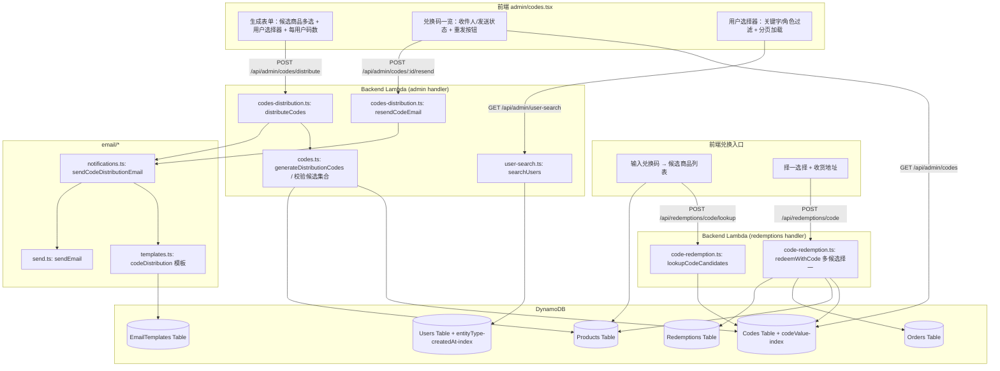

# Design Document: Code 兑换码多候选与按用户邮件分发

## Overview

本功能在现有「Code 兑换码」能力上扩展两个方向，均以现有后端服务与数据模型为基础，尽量复用既有组件：

1. **多商品候选兑换码（择一兑换）**：`CodeInfo` 新增 `productIds`（有序候选集合，1–10）。兑换码 `type` 仍为 `product`、`maxUses=1`。兑换时用户从候选集合中选择恰好 1 个商品（`Selected_Product`）完成兑换；兑换流程 `redeemWithCode` 在现有原子事务基础上，将"绑定校验"从"单商品相等"放宽为"所选商品属于候选集合"。单候选码同时写入 `productId` 以保持向后兼容。

2. **按用户列表生成并邮件分发**：在「生成兑换码」页面，将"数量(count)"输入改造为"选择用户列表 + 每用户分配码数"。新增后端 `Code_Distribution_Service`（`admin/codes-distribution.ts`）负责：校验候选商品 → 计算应生成总数 → 为每个用户独占分配兑换码（写入 `allocatedUserId` 与 `batchId`）→ 批量写入 → 触发邮件分发。邮件复用现有 `email/*` 体系：新增一个 `codeDistribution` 邮件模板类型，由 SuperAdmin 通过现有邮件模板管理编辑，模板含 `storeUrl` 商城 CTA 按钮。

### 关键设计决策

1. **`productIds` 为新的权威字段，`productId` 退化为兼容镜像**：候选集合恰好 1 个商品时同时写 `productId`；候选集合 >1 时 `productId` 省略。兑换/展示逻辑统一通过"候选集合 = `productIds ?? [productId]`"读取，老数据（仅 `productId`）天然兼容。
2. **分发是显式管理员动作，不受用户订阅开关限制**：现有通知（如 `pointsEarned`）通过 `feature-toggles` 的订阅开关 `isEmailEnabled` 门控；分发邮件属于管理员主动发起的事务性邮件，**不**经过该门控，确保码一定送达。
3. **生成与发送解耦、不回滚**：先一次性生成并持久化全部兑换码（含 `allocatedUserId`/`batchId`），再逐用户发送邮件。任何邮件失败或用户无邮箱都不删除已生成的码（Req 8.5），便于审计与重发。
4. **用户查询复用 `entityType-createdAt-index` GSI**：新增 `searchUsers`，服务端用 `FilterExpression` 做角色过滤，关键字（昵称/邮箱）做**不区分大小写**匹配在每页结果上内存过滤，返回单页 + 游标 `lastKey`，不改动现有 `listUsers` 的语义。
5. **重发依据持久化的 `allocatedUserId`**：单码重发从码记录读取收件人，杜绝越权发送给他人（Req 9.6）。

## Architecture



### 数据流

1. **用户查询流**：前端用户选择器以 `GET /api/admin/user-search?keyword=&role=&pageSize=&lastKey=` 拉取一页，追加显示并保留已选；服务端按 GSI 查询、角色服务端过滤、关键字不区分大小写内存过滤。
2. **生成 + 分发流**：管理员选定候选商品（1–10）与用户（各自码数，默认 1）→ `POST /api/admin/codes/distribute` → 校验候选商品（存在/上架/类型/去重/数量）→ 计算 `Total_Code_Count = Σ allocatedCount` → 逐用户分配生成码（`productIds`、`allocatedUserId`、`batchId`）→ 25 条/批写入 → 逐用户发送分发邮件 → 返回分发结果摘要。
3. **择一兑换流**：用户提交码 → `lookupCodeCandidates` 返回候选商品；用户择一 + 选地址 → `redeemWithCode` 校验所选商品属于候选集合 → 原子事务完成（码耗尽、所选商品扣库存、写兑换记录与订单）。
4. **重发流**：管理员对某码点重发 → 读取该码 `allocatedUserId` → 仅向该用户重发含该码的邮件。

## Components and Interfaces

### 1. 共享类型 — `packages/shared/src/types.ts`（修改 `CodeInfo`）

```typescript
export interface CodeInfo {
  codeId: string;
  codeValue: string;
  type: CodeType;
  name?: string;
  pointsValue?: number;
  productId?: string;            // 兼容字段：候选集合恰好 1 个时写入
  productIds?: string[];         // NEW 候选集合（有序，1–10）
  maxUses: number;
  currentUses: number;
  status: CodeStatus;
  usedBy: string[];              // 存储层为 Map<userId, timestamp>
  createdAt: string;
  allocatedUserId?: string;      // NEW 该码被分配到的收件用户
  batchId?: string;              // NEW 所属分发批次
  emailStatus?: CodeEmailStatus; // NEW 该码的邮件发送状态
}

export type CodeEmailStatus = 'sent' | 'failed' | 'no_email' | 'pending';
```

### 2. 后端 — `admin/codes.ts`（新增候选集合校验与分发码生成）

```typescript
export const MAX_CANDIDATE_PRODUCTS = 10;

export interface CandidateValidationResult {
  valid: boolean;
  products?: { productId: string; name: string }[]; // 校验通过的候选商品（用于邮件 productNames）
  error?: { code: string; message: string };
}

/**
 * 校验候选商品集合：非空、≤10、无重复、均为 code_exclusive 且存在且 active。
 * 错误码：INVALID_PRODUCT_SELECTION / TOO_MANY_PRODUCTS / DUPLICATE_PRODUCT / INVALID_PRODUCT_TYPE
 */
export async function validateCandidateProducts(
  productIds: string[],
  dynamoClient: DynamoDBDocumentClient,
  productsTable: string,
): Promise<CandidateValidationResult>;

export interface RecipientAllocation {
  userId: string;
  allocatedCount: number; // 必须为正整数
}

export interface GenerateDistributionCodesInput {
  productIds: string[];
  recipients: RecipientAllocation[];
}

export interface DistributionCodeRecord extends CodeInfo {
  allocatedUserId: string;
  batchId: string;
}

/**
 * 生成一个分发批次的兑换码：每个 recipient 独占分配 allocatedCount 个码。
 * 每个码：type='product'、maxUses=1、productIds=候选集合、
 *   候选集合长度为 1 时另写 productId；allocatedUserId、batchId、createdAt。
 * 按 25 条/批 BatchWrite 写入（Req 8.4）。
 */
export async function generateDistributionCodes(
  input: GenerateDistributionCodesInput,
  dynamoClient: DynamoDBDocumentClient,
  codesTable: string,
): Promise<CodeOperationResult<{ batchId: string; codes: DistributionCodeRecord[] }>>;
```

`generateProductCodes`（旧单商品生成）保留不变以兼容现有 `/api/admin/codes/product-code`。

### 3. 后端 — `admin/codes-distribution.ts`（新增 `Code_Distribution_Service`）

```typescript
export interface DistributeCodesInput {
  productIds: string[];
  recipients: RecipientAllocation[];
}

export interface DistributionResultSummary {
  batchId: string;
  totalCodes: number;            // = Σ allocatedCount
  sentSuccess: string[];         // 生成成功且发送成功的 userId
  sentFailed: { userId: string; error: string }[];   // 生成成功但发送失败
  skippedNoEmail: string[];      // 生成成功但用户无邮箱被跳过
}

/**
 * 编排：校验候选商品 → 生成分发码 → 逐用户邮件分发 → 汇总。
 * 校验失败（含商品不存在/已下架）在生成前整体拒绝，返回 INVALID_PRODUCT_SELECTION（Req 8.2）。
 * 生成后不因邮件失败回滚（Req 8.5）。
 */
export async function distributeCodes(
  input: DistributeCodesInput,
  deps: { dynamoClient; sesClient; codesTable; productsTable; usersTable; emailTemplatesTable; senderEmail },
): Promise<CodeOperationResult<DistributionResultSummary>>;

/**
 * 单码重发：读取该码 allocatedUserId，仅向该用户重发含该码的分发邮件。
 * 用户无邮箱 → NO_EMAIL；发送后更新该码 emailStatus。
 */
export async function resendCodeEmail(
  codeId: string,
  deps: { dynamoClient; sesClient; codesTable; productsTable; usersTable; emailTemplatesTable; senderEmail },
): Promise<CodeOperationResult<{ codeId: string; emailStatus: CodeEmailStatus }>>;
```

分配算法（纯函数，便于属性测试）：

```typescript
/** 将 recipients 展开为待生成的 (userId) 序列，长度 = Σ allocatedCount。 */
export function buildAllocationPlan(recipients: RecipientAllocation[]): string[];
```

### 4. 后端 — `admin/user-search.ts`（新增 `User_Query_Service`）

```typescript
export interface SearchUsersOptions {
  keyword?: string;             // 不区分大小写，匹配 nickname 或 email（contains）
  role?: UserRole;              // UserGroupLeader/Speaker/Volunteer/Admin/SuperAdmin/OrderAdmin
  pageSize?: number;            // 默认 20，clamp [1,100]
  lastKey?: Record<string, unknown>;
}

export interface SearchUserItem {
  userId: string;
  nickname: string;
  email: string;
  roles: string[];
}

export interface SearchUsersResult {
  users: SearchUserItem[];
  lastKey?: Record<string, unknown>;
}

/**
 * 复用 entityType-createdAt-index GSI（ScanIndexForward=false）。
 * role 通过 FilterExpression contains(#roles,:role) 服务端过滤；
 * keyword 在每页结果上 toLowerCase().includes() 内存过滤（不区分大小写）。
 * 返回单页 + lastKey 游标。
 */
export async function searchUsers(
  options: SearchUsersOptions,
  dynamoClient: DynamoDBDocumentClient,
  usersTable: string,
): Promise<SearchUsersResult>;
```

### 5. 后端 — `email/templates.ts` & `email/seed.ts`（新增 `codeDistribution` 模板）

- `NotificationType` 增加 `'codeDistribution'`。
- `TEMPLATE_VARIABLE_MAP.codeDistribution = ['nickname', 'codeList', 'productNames', 'codeCount', 'storeUrl']`（Req 7.4）。
- `seed.ts` 增加多语言默认模板，正文复用 `STORE_LINK` 风格的 CTA 按钮并使用 `{{storeUrl}}`（Req 7.5、7.6）。
- 校验仍由 `validateTemplateInput` 处理（主题 1–200、正文 1–10000，Req 7.7）。

`STORE_LINK` 当前为硬编码 `https://store.awscommunity.cn`。分发模板将其参数化为 `{{storeUrl}}`，由分发服务注入 `storeUrl`（默认值取该商城地址），保证默认模板也含商城链接（Req 7.6）。

### 6. 后端 — `email/notifications.ts`（新增 `sendCodeDistributionEmail`）

```typescript
export interface CodeDistributionEmailResult {
  status: 'sent' | 'failed' | 'no_email';
  error?: string;
}

/**
 * 向单个用户发送其被分配的兑换码邮件。
 * 不经过 isEmailEnabled 订阅门控（管理员事务性邮件）。
 * 加载用户 → 无邮箱返回 no_email；加载 codeDistribution 模板（locale 回退 zh，缺失用默认）
 *   → 渲染变量 nickname/codeList/productNames/codeCount/storeUrl → 发送。
 */
export async function sendCodeDistributionEmail(
  ctx: NotificationContext & { senderEmail: string },
  userId: string,
  codeValues: string[],
  productNames: string[],
  storeUrl: string,
): Promise<CodeDistributionEmailResult>;
```

`codeList` 渲染：将 `codeValues` 以 HTML 列表/换行拼接；`codeCount = codeValues.length`；`productNames` 以候选商品名称列表拼接。

### 7. 后端 — `redemptions/code-redemption.ts`（多候选择一）

新增候选查询：

```typescript
export interface CodeCandidate {
  productId: string;
  name: string;
  imageUrl?: string;
  stock: number;
  status: string;
}

/**
 * 按 codeValue 查码 → 取候选集合 productIds ?? [productId] → 批量取商品详情。
 * 返回候选商品列表供前端择一（Req 2.1）。码无效/非 product/已耗尽 → 对应错误码。
 */
export async function lookupCodeCandidates(
  code: string,
  dynamoClient: DynamoDBDocumentClient,
  tables: { codesTable: string; productsTable: string },
): Promise<{ success: boolean; candidates?: CodeCandidate[]; error?: {code:string; message:string} }>;
```

`redeemWithCode` 修改点（其余逻辑、原子事务结构不变）：

- 候选集合读取：`const candidateIds = codeItem.productIds ?? (codeItem.productId ? [codeItem.productId] : []);`
- 绑定校验由 `codeItem.productId !== input.productId` 改为 `!candidateIds.includes(input.productId)`，不匹配返回 `INVALID_PRODUCT_SELECTION`（Req 2.3）。
- 单候选码（`candidateIds.length === 1`）：`input.productId` 必须等于该唯一候选（前端可自动填充，Req 2.4）。
- 其余（库存校验、地址校验、原子事务：码 currentUses+1 且置 `exhausted`、所选商品库存 -1、写 Redemptions、写 1 单 1 项 Orders）保持现状（Req 2.5–2.11）。仅对 `input.productId`（Selected_Product）扣库存，不动其它候选商品（Req 2.5）。

### 8. 后端路由 — `admin/handler.ts` & `redemptions/handler.ts`

| Method & Path | Handler | 鉴权 |
|---|---|---|
| `GET /api/admin/user-search` | `handleSearchUsers` | Admin/SuperAdmin（Req 4.4、10.4）|
| `POST /api/admin/codes/distribute` | `handleDistributeCodes` | Admin/SuperAdmin（Req 10.1、10.2）|
| `POST /api/admin/codes/{codeId}/resend` | `handleResendCodeEmail` | Admin/SuperAdmin（Req 10.1）|
| `PUT /api/admin/email-templates/{id}/{locale}` | 现有，含 `codeDistribution` | SuperAdmin（Req 7.1、10.3）|
| `POST /api/redemptions/code/lookup` | `handleLookupCodeCandidates` | 已登录用户 |
| `POST /api/redemptions/code` | 现有 `handleRedeemWithCode` | 已登录用户 |

`admin/handler.ts` 顶层 `isAdmin` 守卫已覆盖 Admin/SuperAdmin，OrderAdmin 在 admin handler 一律 403，天然满足分发鉴权要求。

### 9. 前端 — `pages/admin/codes.tsx`（生成表单改造 + 一览增强）

- 新增第三种生成模式 `multi-candidate-distribute`：
  - **候选商品多选**：从 `code_exclusive` 商品中选 1–10 个（超 10 阻止提交并提示，Req 3.2、3.3、3.5）。
  - **用户选择器**：调用 `/api/admin/user-search`，支持关键字输入、角色下拉过滤、分页/滚动加载；切换查询条件或加载更多时保留已选用户（Req 4.7）。无结果显示空提示（Req 4.6）。
  - **每用户码数**：加入即默认 1，可改为任意正整数；非正整数阻止提交（Req 5.1–5.3）。
  - **实时汇总**：显示已选用户数与 `Total_Code_Count`（Req 3.4）。
  - 未选商品/未选用户阻止提交并提示（Req 3.5、3.6）。
- **一览增强**：对属于分发批次（有 `batchId`/`allocatedUserId`）的码展示收件人（昵称/邮箱）与 `emailStatus`，并提供"重发"按钮（Req 9.1、9.2）；重发结果更新该码状态显示（Req 9.5）。
- 样式遵循前端设计规范（CSS 变量、`--space-*`、`.btn-*`、`--font-mono` 展示码值）。

### 10. 前端 — 兑换入口（择一选择）

- 用户提交兑换码后调用 `/api/redemptions/code/lookup` 获取候选商品；候选 >1 时展示选择列表，择一后连同地址提交 `/api/redemptions/code`；候选 =1 时自动选中、直接进入地址选择（Req 2.4）。

## Data Models

### Codes 表记录（扩展后）

| 属性 | 类型 | 说明 |
|---|---|---|
| codeId | String (PK) | ULID |
| codeValue | String | 码值，`codeValue-index` GSI |
| type | String | `points` / `product` |
| productId | String? | 兼容字段：候选集合恰好 1 个时写入 |
| **productIds** | List\<String\>? | **NEW** 候选集合（有序，1–10）|
| maxUses | Number | 产品码恒为 1 |
| currentUses | Number | 兑换成功后 +1 |
| status | String | `active`/`disabled`/`exhausted` |
| usedBy | Map | `{ userId: timestamp }`（存储层） |
| **allocatedUserId** | String? | **NEW** 分配到的收件用户 |
| **batchId** | String? | **NEW** 分发批次标识 |
| **emailStatus** | String? | **NEW** `sent`/`failed`/`no_email`/`pending` |
| createdAt | String | ISO 8601 |

> 候选集合读取统一为 `productIds ?? (productId ? [productId] : [])`，老数据兼容（Req 1.10、2.x）。

### EmailTemplates 表记录（新增 templateId）

| templateId | locale | 变量 |
|---|---|---|
| `codeDistribution` | zh/en/ja/ko/zh-TW | `nickname`、`codeList`、`productNames`、`codeCount`、`storeUrl` |

### 分发请求/响应

```typescript
// POST /api/admin/codes/distribute
{
  productIds: string[];                                  // 候选集合 1–10
  recipients: { userId: string; allocatedCount: number }[]; // 每用户正整数
}
// 201 →
{
  batchId: string;
  totalCodes: number;
  sentSuccess: string[];
  sentFailed: { userId: string; error: string }[];
  skippedNoEmail: string[];
}

// GET /api/admin/user-search?keyword=&role=&pageSize=20&lastKey=
{
  users: { userId; nickname; email; roles }[];
  lastKey?: Record<string, unknown>;
}
```

### 错误码

| 错误码 | 触发场景 | 需求 |
|---|---|---|
| `INVALID_PRODUCT_SELECTION` | 候选集合为空 / 含不存在或已下架商品 / 兑换所选不在候选集合 | 1.6、2.3、8.2 |
| `TOO_MANY_PRODUCTS` | 候选集合 > 10 | 1.7 |
| `INVALID_PRODUCT_TYPE` | 候选含非 code_exclusive 商品 | 1.8 |
| `DUPLICATE_PRODUCT` | 候选集合含重复商品 | 1.9 |
| `CODE_EXHAUSTED` / `CODE_ALREADY_USED` | 码已用尽 / 用户已用过 | 2.9 |
| `OUT_OF_STOCK` | 所选商品下架或缺货 | 2.10 |
| `NO_EMAIL` | 重发目标无有效邮箱 | 9.4 |
| `FORBIDDEN` | 非 Admin/SuperAdmin | 10.1 |

## Correctness Properties

*A property is a characteristic or behavior that should hold true across all valid executions of a system — essentially, a formal statement about what the system should do. Properties serve as the bridge between human-readable specifications and machine-verifiable correctness guarantees.*

以下属性由前述验收标准的可测条目（prework 分类为 PROPERTY/EDGE_CASE）归约、合并而来。UI 流程类（EXAMPLE）与配置类（SMOKE）条目由示例/单元测试覆盖，见测试策略。

### Property 1: 生成码不变量

*For any* 合法的分发输入（候选集合 1–10、recipients 各自码数为正整数），所生成的每个兑换码 SHALL 满足 `type === 'product'`、`maxUses === 1`、`currentUses === 0`、`status === 'active'`，且 `productIds` 深度等于输入候选集合（保持顺序）；当且仅当候选集合长度为 1 时，`productId` 等于该唯一候选商品。

**Validates: Requirements 1.2, 1.3, 1.4, 1.5**

### Property 2: 候选集合校验

*For any* 候选商品列表：当列表为空时 SHALL 返回 `INVALID_PRODUCT_SELECTION`；当长度 > 10 时 SHALL 返回 `TOO_MANY_PRODUCTS`；当含重复标识符时 SHALL 返回 `DUPLICATE_PRODUCT`；当含非 `code_exclusive` 商品时 SHALL 返回 `INVALID_PRODUCT_TYPE`；当含不存在或已下架商品时 SHALL 返回 `INVALID_PRODUCT_SELECTION` 且不生成任何码；仅当全部为存在且 active 的 `code_exclusive` 商品且数量在 1–10 且无重复时校验通过。

**Validates: Requirements 1.6, 1.7, 1.8, 1.9, 8.2**

### Property 3: 候选集合解析向后兼容

*For any* 兑换码记录，候选集合解析 `productIds ?? (productId ? [productId] : [])` SHALL 对仅含 `productId` 的旧记录返回 `[productId]`，对含 `productIds` 的新记录返回 `productIds`，使旧单商品码与新多候选码在兑换与展示逻辑中行为一致。

**Validates: Requirements 1.10**

### Property 4: 兑换返回候选集合

*For any* 有效的 `product` 类型兑换码，`lookupCodeCandidates` 返回的候选商品标识集合 SHALL 恰好等于该码候选集合（`productIds ?? [productId]`）。

**Validates: Requirements 2.1**

### Property 5: 择一校验

*For any* 兑换码及任一不属于其候选集合的商品标识，`redeemWithCode` SHALL 拒绝兑换并返回 `INVALID_PRODUCT_SELECTION`，且不消耗兑换码、不扣减任何库存。

**Validates: Requirements 2.3**

### Property 6: 兑换成功的原子事务不变量

*For any* 成功的择一兑换，系统 SHALL 在单个原子事务内完成：将兑换码 `currentUses` 增加 1 并因 `maxUses=1` 置为 `exhausted`；仅对 `Selected_Product` 扣减库存 1（不修改其余候选商品库存）；写入 1 条兑换记录；写入恰好包含 1 个订单项（对应 `Selected_Product`）的 1 个订单。

**Validates: Requirements 2.5, 2.6, 2.8, 2.11**

### Property 7: 缺货/下架的无副作用拒绝

*For any* 所选商品处于已下架或库存不足状态的兑换请求，`redeemWithCode` SHALL 返回 `OUT_OF_STOCK`，且不消耗兑换码、不扣减任何库存、不写入订单或兑换记录。

**Validates: Requirements 2.10**

### Property 8: 关键字不区分大小写匹配

*For any* 用户集合与关键字，`searchUsers` 返回的用户集合 SHALL 恰好等于其昵称或邮箱以不区分大小写方式包含该关键字的用户。

**Validates: Requirements 4.1**

### Property 9: 角色过滤

*For any* 用户集合与角色过滤值，`searchUsers` 返回的每个用户 SHALL 拥有该角色；不拥有该角色的用户 SHALL 不出现在结果中。

**Validates: Requirements 4.2**

### Property 10: 查询结果字段完整

*For any* `searchUsers` 返回的用户条目，SHALL 同时包含 `userId`、`nickname`、`email` 与 `roles`。

**Validates: Requirements 4.4**

### Property 11: 分配一致性

*For any* recipients 列表（每个 `allocatedCount` 为正整数），分发批次生成结果 SHALL 满足：生成码总数等于所有 `allocatedCount` 之和；按 `allocatedUserId` 分组后每个用户恰好获得其 `allocatedCount` 个码；任一码只属于一个用户（跨用户 `codeId` 两两不相交）；每个码均带有同一 `batchId` 且其 `allocatedUserId` 属于 recipients；不存在未分配或重复分配的码。

**Validates: Requirements 5.4, 5.5, 5.6, 5.7, 5.8**

### Property 12: 总数汇总计算

*For any* recipients 列表，`Total_Code_Count` SHALL 等于所有 `allocatedCount` 之和。

**Validates: Requirements 3.4, 5.4**

### Property 13: 分发邮件包含本人全部码且含商城链接

*For any* 拥有有效邮箱的收件用户及其被分配的码集合，渲染后的分发邮件正文 SHALL 包含该用户全部被分配的码值、包含一个 `href` 为 `storeUrl` 的商城链接，且不残留任何已提供变量的 `{{占位符}}`。

**Validates: Requirements 6.1, 6.2, 6.3, 7.3, 7.5**

### Property 14: 收件人隔离

*For any* 两个不同收件用户 A 与 B，发送给 A 的分发邮件正文 SHALL 仅包含 A 被分配的码值而不含 B 的码值；对单码重发，重发邮件 SHALL 仅发送给该码持久化的 `allocatedUserId`，不发送给其他任何用户。

**Validates: Requirements 6.4, 9.3, 9.6**

### Property 15: 分发结果三态划分

*For any* 一次分发运行，每个收件用户 SHALL 被划入"生成成功且发送成功"、"生成成功但发送失败"、"生成成功但无邮箱被跳过"三类中恰好一类（互斥且穷尽）；摘要中成功数、失败数、跳过数之和 SHALL 等于收件用户总数。

**Validates: Requirements 6.5, 8.6**

### Property 16: 部分失败不回滚

*For any* 含部分发送失败或部分用户无邮箱的分发运行，全部已生成的兑换码记录 SHALL 保留（不删除、不回滚），无邮箱用户进入 `skippedNoEmail`，发送失败用户连同错误进入 `sentFailed`，其余用户继续被处理。

**Validates: Requirements 8.1, 8.3, 8.5**

### Property 17: 分批写入上限

*For any* 应生成总数 N，兑换码记录 SHALL 以每批不超过 25 条（DynamoDB BatchWrite 上限）的方式写入，且写入条目总数等于 N。

**Validates: Requirements 8.4**

### Property 18: 模板长度校验

*For any* 主题与正文字符串，`validateTemplateInput` SHALL 当且仅当主题长度在 1–200 且正文长度在 1–10000 时返回有效，否则返回校验失败。

**Validates: Requirements 7.7**

### Property 19: 分发与重发鉴权

*For any* 请求者角色集合，生成、分发与重发接口 SHALL 当且仅当角色集合包含 `Admin` 或 `SuperAdmin` 时被允许，否则返回 `FORBIDDEN`。

**Validates: Requirements 10.1**

## Error Handling

### 候选集合 / 生成（`codes.ts` validateCandidateProducts / generateDistributionCodes）

| 条件 | 处理 |
|---|---|
| 候选为空 | 返回 `INVALID_PRODUCT_SELECTION`，不写入 |
| 候选 > 10 | 返回 `TOO_MANY_PRODUCTS`，不写入 |
| 候选含重复 | 返回 `DUPLICATE_PRODUCT`，不写入 |
| 候选含非 code_exclusive | 返回 `INVALID_PRODUCT_TYPE`，不写入 |
| 候选含不存在/已下架 | 返回 `INVALID_PRODUCT_SELECTION`，**生成前**整体拒绝（Req 8.2） |
| recipients 为空 / 某 allocatedCount 非正整数 | 返回 `INVALID_REQUEST`（前端已先行拦截，后端二次校验） |
| BatchWrite 部分批失败 | 让错误向上传播；已写入批次不回滚（不删除已生成码） |

### 择一兑换（`code-redemption.ts`）

| 条件 | 处理 |
|---|---|
| 码不存在/非 active/非 product | `INVALID_CODE` |
| 所选不在候选集合 | `INVALID_PRODUCT_SELECTION`，无副作用 |
| 码已耗尽 / 用户已用 | `CODE_EXHAUSTED` / `CODE_ALREADY_USED` |
| 所选商品下架/缺货 | `OUT_OF_STOCK`，事务条件表达式保证无副作用 |
| 地址缺失/非本人 | `NO_ADDRESS_SELECTED` / `ADDRESS_NOT_FOUND` |
| 事务条件冲突（并发兑换） | TransactWrite 条件失败 → 返回失败，不产生部分写入 |

### 邮件分发（`codes-distribution.ts` / `notifications.ts`）

| 条件 | 处理 |
|---|---|
| 用户无有效邮箱 | 跳过发送，记入 `skippedNoEmail`，保留已生成码（Req 8.1）；码 `emailStatus='no_email'` |
| 单用户发送抛错 | 记入 `sentFailed`，继续处理其余用户（Req 8.3）；码 `emailStatus='failed'` |
| 模板缺失/未配置 | 使用系统默认模板（含 `storeUrl`），保证可送达（Req 7.6） |
| locale 模板缺失 | 回退 `zh` 默认模板（沿用 `loadTemplateWithFallback`） |
| 重发目标无邮箱 | 返回 `NO_EMAIL`（Req 9.4） |

### 用户查询（`user-search.ts`）

| 条件 | 处理 |
|---|---|
| `lastKey` 解析失败 | 忽略，从首页查询 |
| `pageSize` 缺失/越界 | 默认 20，clamp 至 [1,100] |
| 无匹配 | 返回空 `users`，前端显示无结果提示（Req 4.6） |
| 非 Admin/SuperAdmin | `FORBIDDEN`（admin handler 守卫） |

### 鉴权

所有新增 admin 路由经 `admin/handler.ts` 顶层 `isAdmin` 守卫（Admin/SuperAdmin，OrderAdmin 一律 403）；模板编辑沿用 `EMAIL_TEMPLATES_UPDATE_REGEX` 的 SuperAdmin 校验（Req 10.3）。

## Testing Strategy

### 双重测试方法

- **单元/示例测试**：覆盖 UI 流程（EXAMPLE 类：表单替换数量为用户选择器、择一选择、保留已选、默认码数=1 等）、配置（SMOKE 类：支持的角色集合、`TEMPLATE_VARIABLE_MAP.codeDistribution` 变量集合、模板管理暴露 codeDistribution）、以及边界/错误（EDGE_CASE 类：空候选、>10、非整数码数、已耗尽码、无邮箱重发、路由鉴权 10.2/10.3/10.4）。
- **属性测试**：覆盖上文 Property 1–19，验证跨输入的普遍正确性。

PBT 适用性说明：本功能核心为纯逻辑——候选集合校验、分配规划（`buildAllocationPlan`）、候选集合解析、择一兑换的事务组装、邮件变量渲染、模板长度校验、查询过滤、鉴权判定——均可表达为"对任意输入 X，性质 P(X) 成立"，因此适用属性测试。SES 实际投递、DynamoDB 实际写入等外部副作用以 mock 注入，属性测试聚焦于我方逻辑（事务命令组成、BatchWrite 分批、per-user 发送调用），不对外部服务做 100 次真实调用。

### 属性测试配置

- 库：沿用项目现有 `vitest` + `fast-check`（参见既有 `*.property.test.ts`）。
- 每个属性测试至少运行 100 次迭代。
- 每个属性以单个属性测试实现，并以注释标注：`Feature: code-user-email-distribution, Property {N}: {property_text}`。

### 属性到测试文件映射

| 属性 | 测试文件 | 生成内容 |
|---|---|---|
| P1 生成码不变量 | `admin/codes-distribution.property.test.ts` | 随机候选集合(1–10) + recipients |
| P2 候选集合校验 | `admin/codes.property.test.ts`（扩展） | 含空/超限/重复/错误类型/下架的候选列表 |
| P3 候选解析兼容 | `redemptions/code-candidate-resolve.property.test.ts` | 旧(仅 productId)/新(productIds) 记录 |
| P4 返回候选集合 | `redemptions/code-redemption.property.test.ts`（扩展） | 随机码 + 候选商品 |
| P5 择一校验 | `redemptions/code-redemption.property.test.ts`（扩展） | 候选集合 + 集合外商品 |
| P6 成功事务不变量 | `redemptions/code-redemption.property.test.ts`（扩展） | 多候选码 + 任选其一 |
| P7 缺货拒绝 | `redemptions/code-redemption.property.test.ts`（扩展） | 下架/缺货所选商品 |
| P8 关键字大小写 | `admin/user-search.property.test.ts` | 随机用户集合 + 关键字 |
| P9 角色过滤 | `admin/user-search.property.test.ts` | 随机角色 + 过滤值 |
| P10 字段完整 | `admin/user-search.property.test.ts` | 随机用户集合 |
| P11 分配一致性 | `admin/codes-distribution.property.test.ts` | 随机 recipients 与码数 |
| P12 总数汇总 | `admin/codes-distribution.property.test.ts` | 随机 recipients |
| P13 邮件含全部码+链接 | `email/code-distribution-email.property.test.ts` | 随机码集合 + storeUrl |
| P14 收件人隔离 | `email/code-distribution-email.property.test.ts` | 多用户码分配 / 重发 |
| P15 三态划分 | `admin/codes-distribution.property.test.ts` | 混合 有邮箱/无邮箱/发送失败 |
| P16 部分失败不回滚 | `admin/codes-distribution.property.test.ts` | 注入部分失败 |
| P17 分批写入上限 | `admin/codes-distribution.property.test.ts` | 随机大总数 |
| P18 模板长度校验 | `email/templates.property.test.ts`（扩展） | 随机主题/正文长度 |
| P19 鉴权 | `admin/codes-distribution.property.test.ts` | 随机角色集合 |

### 集成/示例测试

- 路由层：`admin/handler.test.ts`、`redemptions/handler.test.ts` 扩展，验证新路由经鉴权守卫并正确转发参数。
- 兑换端到端（mock DynamoDB）：单候选码自动择一、多候选码择一成功、择一失败回滚行为。
- 模板回退：未配置 codeDistribution 时使用默认模板且含商城链接。
