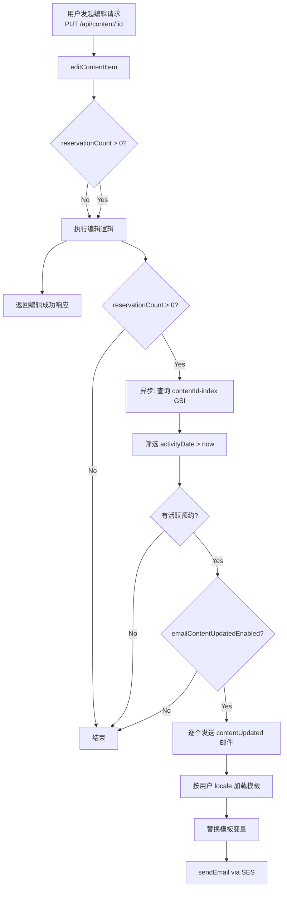

# 技术设计文档 — 内容编辑解锁与预约用户变更通知（Content Edit Notification）

## 概述（Overview）

本设计实现两项核心变更：

1. **移除预约编辑限制**：修改 `editContentItem` 函数，删除 `reservationCount > 0` 时返回 `CONTENT_NOT_EDITABLE` 的检查，允许内容上传者在内容已有预约的情况下继续编辑。
2. **编辑后异步邮件通知**：内容编辑成功后，如果存在活跃预约（activityDate 在未来），系统异步查询预约用户并发送 `contentUpdated` 类型的邮件通知。通知功能通过 `emailContentUpdatedEnabled` 开关控制，默认关闭。

**关键设计决策：**

| 决策 | 选择 | 理由 |
|------|------|------|
| 预约查询方式 | 使用现有 `contentId-index` GSI | GSI 已存在，无需新建索引 |
| 邮件发送方式 | 逐个 `sendEmail`（TO 字段） | 每位用户需要个性化的 locale 模板，且收件人数量有限（预约用户） |
| 异步执行方式 | fire-and-forget（不 await 通知 Promise） | 不阻塞编辑 API 响应，邮件发送失败不影响编辑结果 |
| 通知类型 | 新增 `contentUpdated` 到 `NotificationType` | 复用现有邮件系统架构，与其他通知类型一致 |
| 开关存储 | 复用 feature-toggles 记录 | 与现有 `emailPointsEarnedEnabled` 等开关模式一致 |
| 默认模板 | 添加到 `seed.ts` 的 `getDefaultTemplates()` | 复用现有模板种子机制 |

---

## 架构（Architecture）

### 变更范围

```
变更文件:
  packages/backend/src/content/edit.ts              — 移除 reservationCount 检查，编辑后触发异步通知
  packages/backend/src/content/handler.ts           — 传递额外依赖（reservationsTable、usersTable、sesClient 等）给 editContentItem
  packages/backend/src/email/send.ts                — NotificationType 新增 'contentUpdated'
  packages/backend/src/email/notifications.ts       — 新增 sendContentUpdatedEmail 函数 + TOGGLE_MAP 新增条目
  packages/backend/src/email/templates.ts           — TEMPLATE_VARIABLE_MAP 新增 contentUpdated 条目
  packages/backend/src/email/seed.ts                — 新增 contentUpdated 默认模板（5 种语言）
  packages/backend/src/settings/feature-toggles.ts  — FeatureToggles 接口新增 emailContentUpdatedEnabled
  packages/frontend/src/pages/admin/settings.tsx    — 邮件通知区域新增 contentUpdated 开关和模板编辑入口
  packages/frontend/src/i18n/zh.ts                  — 新增中文翻译
  packages/frontend/src/i18n/en.ts                  — 新增英文翻译
  packages/frontend/src/i18n/ja.ts                  — 新增日文翻译
  packages/frontend/src/i18n/ko.ts                  — 新增韩文翻译
  packages/frontend/src/i18n/zh-TW.ts               — 新增繁体中文翻译
  packages/frontend/src/i18n/types.ts               — 翻译类型新增 contentUpdatedLabel/Desc
  packages/shared/src/types.ts                      — ErrorCodes 移除 CONTENT_NOT_EDITABLE（如仍需保留则保留但不再使用）
```

### 数据流



---

## 组件与接口（Components and Interfaces）

### 1. editContentItem 变更（`packages/backend/src/content/edit.ts`）

#### 1.1 移除预约编辑限制

删除以下代码块（当前第 3 步）：

```typescript
// 删除此检查
if (item.reservationCount > 0) {
  return {
    success: false,
    error: { code: ErrorCodes.CONTENT_NOT_EDITABLE, message: ErrorMessages[ErrorCodes.CONTENT_NOT_EDITABLE] },
  };
}
```

#### 1.2 新增异步通知触发

在 `editContentItem` 函数签名中新增可选参数，用于传递通知所需的依赖：

```typescript
export interface EditContentItemInput {
  // ... 现有字段不变 ...
}

export interface EditNotificationContext {
  dynamoClient: DynamoDBDocumentClient;
  sesClient: SESClient;
  reservationsTable: string;
  usersTable: string;
  emailTemplatesTable: string;
  senderEmail: string;
}

export async function editContentItem(
  input: EditContentItemInput,
  dynamoClient: DynamoDBDocumentClient,
  s3Client: S3Client,
  tables: { contentItemsTable: string; categoriesTable: string; contentTagsTable?: string },
  bucket: string,
  notificationCtx?: EditNotificationContext,  // 新增可选参数
): Promise<EditContentItemResult>
```

在编辑成功返回前，如果 `reservationCount > 0` 且提供了 `notificationCtx`，触发异步通知（fire-and-forget）：

```typescript
// 编辑成功后，异步触发通知（不 await）
if (item.reservationCount > 0 && notificationCtx) {
  sendContentUpdatedNotifications(
    notificationCtx,
    input.contentId,
    updatedItem.title,
  ).catch((err) => {
    console.error('[Content] Failed to send content updated notifications:', err);
  });
}

return { success: true, item: updatedItem };
```

#### 1.3 异步通知函数

新增内部函数（或放在 `notifications.ts` 中）：

```typescript
async function sendContentUpdatedNotifications(
  ctx: EditNotificationContext,
  contentId: string,
  contentTitle: string,
): Promise<void>
```

实现步骤：
1. 检查 `emailContentUpdatedEnabled` 开关
2. 使用 `contentId-index` GSI 查询 ContentReservations 表
3. 筛选 `activityDate > new Date().toISOString()` 的活跃预约
4. 对每个活跃预约的 userId，从 Users 表加载用户信息（email、nickname、locale）
5. 按用户 locale 加载 `contentUpdated` 模板
6. 替换模板变量：`{{contentTitle}}`、`{{userName}}`、`{{activityTopic}}`、`{{activityDate}}`
7. 使用 `sendEmail`（TO 字段）逐个发送
8. 单个发送失败记录日志，继续发送其余用户

### 2. Email 模块扩展

#### 2.1 NotificationType 扩展（`send.ts`）

```typescript
export type NotificationType =
  | 'pointsEarned'
  | 'newOrder'
  | 'orderShipped'
  | 'newProduct'
  | 'newContent'
  | 'contentUpdated';  // 新增
```

#### 2.2 模板变量映射（`templates.ts`）

在 `TEMPLATE_VARIABLE_MAP` 中新增：

```typescript
contentUpdated: ['contentTitle', 'userName', 'activityTopic', 'activityDate'],
```

#### 2.3 通知函数（`notifications.ts`）

在 `TOGGLE_MAP` 中新增：

```typescript
contentUpdated: 'emailContentUpdatedEnabled',
```

新增 `sendContentUpdatedEmail` 函数：

```typescript
/**
 * Send a "content updated" email to a single reservation user.
 * Checks toggle, loads user locale, loads template, replaces variables, sends.
 */
export async function sendContentUpdatedEmail(
  ctx: NotificationContext,
  userId: string,
  contentTitle: string,
  activityTopic: string,
  activityDate: string,
): Promise<void>
```

实现模式与 `sendPointsEarnedEmail` 一致：
1. 检查 `isEmailEnabled(ctx, 'contentUpdated')`
2. `loadUser(ctx, userId)` 获取 email、nickname、locale
3. `loadTemplateWithFallback(ctx, 'contentUpdated', locale)`
4. `replaceVariables` 替换 `contentTitle`、`userName`（= nickname）、`activityTopic`、`activityDate`
5. `sendEmail` 发送

#### 2.4 默认模板（`seed.ts`）

新增 `contentUpdatedTemplates` 对象，包含 5 种语言的默认模板：

| Locale | Subject |
|--------|---------|
| zh | 📝 您预约的内容有更新，请确认最新版本 |
| en | 📝 Reserved content has been updated, please review the latest version |
| ja | 📝 予約したコンテンツが更新されました。最新版をご確認ください |
| ko | 📝 예약한 콘텐츠가 업데이트되었습니다. 최신 버전을 확인해 주세요 |
| zh-TW | 📝 您預約的內容有更新，請確認最新版本 |

所有模板 body 包含 `{{contentTitle}}`、`{{userName}}`、`{{activityTopic}}`、`{{activityDate}}` 四个变量，末尾包含自动发送声明。

将 `contentUpdated` 加入 `ALL_TYPES` 数组和 `TEMPLATE_MAP`，使 `getDefaultTemplates()` 返回 30 条模板（6 类型 × 5 语言）。

> **注意**：`seedDefaultTemplates` 使用 `BatchWriteCommand`，DynamoDB 限制每次最多 25 条。新增 5 条后总数为 30，需要分两批写入。

### 3. Feature Toggles 扩展（`feature-toggles.ts`）

#### 3.1 接口变更

```typescript
export interface FeatureToggles {
  // ... 现有字段 ...
  /** Whether contentUpdated email notifications are enabled */
  emailContentUpdatedEnabled: boolean;  // 新增，默认 false
}
```

#### 3.2 默认值

在 `DEFAULT_TOGGLES` 中新增：

```typescript
emailContentUpdatedEnabled: false,
```

#### 3.3 读取逻辑

在 `getFeatureToggles` 中新增：

```typescript
emailContentUpdatedEnabled: result.Item.emailContentUpdatedEnabled === true,
```

#### 3.4 更新逻辑

在 `UpdateFeatureTogglesInput` 接口和 `updateFeatureToggles` 函数中新增 `emailContentUpdatedEnabled` 字段的验证和持久化。

### 4. Content Handler 变更（`handler.ts`）

在 `handleEditContentItem` 中构建 `EditNotificationContext` 并传递给 `editContentItem`：

```typescript
async function handleEditContentItem(contentId: string, event: AuthenticatedEvent) {
  // ... 现有逻辑 ...

  const notificationCtx: EditNotificationContext = {
    dynamoClient,
    sesClient,
    reservationsTable: CONTENT_RESERVATIONS_TABLE,
    usersTable: USERS_TABLE,
    emailTemplatesTable: EMAIL_TEMPLATES_TABLE,
    senderEmail: SENDER_EMAIL,
  };

  const result = await editContentItem(
    { /* ... */ },
    dynamoClient,
    s3Client,
    { contentItemsTable: CONTENT_ITEMS_TABLE, categoriesTable: CONTENT_CATEGORIES_TABLE, contentTagsTable: CONTENT_TAGS_TABLE },
    IMAGES_BUCKET,
    notificationCtx,  // 新增参数
  );

  // ...
}
```

需要在 handler 顶部新增：
- `import { SESClient } from '@aws-sdk/client-ses';`
- `const sesClient = new SESClient({});`
- 读取环境变量 `EMAIL_TEMPLATES_TABLE` 和 `SENDER_EMAIL`

### 5. 前端设置页面变更（`settings.tsx`）

#### 5.1 FeatureToggles 接口

新增 `emailContentUpdatedEnabled: boolean` 字段。

#### 5.2 NotificationType 类型

新增 `'contentUpdated'` 到 `NotificationType` 联合类型。

#### 5.3 邮件通知开关列表

在现有邮件通知开关列表（pointsEarned、newOrder、orderShipped、newProduct、newContent）之后新增：

```typescript
{
  key: 'emailContentUpdatedEnabled',
  notificationType: 'contentUpdated',
  labelKey: 'admin.settings.email.contentUpdatedLabel',
  descKey: 'admin.settings.email.contentUpdatedDesc',
}
```

#### 5.4 NOTIFICATION_TYPE_LABELS

新增：

```typescript
contentUpdated: 'admin.settings.email.contentUpdatedLabel',
```

### 6. 国际化（i18n）

在所有 5 种语言文件的 `admin.settings.email` 对象中新增：

| Key | zh | en | ja | ko | zh-TW |
|-----|----|----|----|----|-------|
| contentUpdatedLabel | 内容更新通知 | Content Update Notification | コンテンツ更新通知 | 콘텐츠 업데이트 알림 | 內容更新通知 |
| contentUpdatedDesc | 内容编辑后自动通知活跃预约用户 | Automatically notify active reservation users after content is edited | コンテンツ編集後、アクティブな予約ユーザーに自動通知 | 콘텐츠 편집 후 활성 예약 사용자에게 자동 알림 | 內容編輯後自動通知活躍預約用戶 |

在 `types.ts` 的 `admin.settings.email` 接口中新增：

```typescript
contentUpdatedLabel: string;
contentUpdatedDesc: string;
```

---

## 数据模型（Data Models）

### ContentReservations 表（已存在，无变更）

| 属性 | 类型 | 说明 |
|------|------|------|
| pk | String (PK) | `{userId}#{contentId}` |
| userId | String | 预约用户 ID |
| contentId | String | 内容 ID |
| activityId | String | 活动 ID |
| activityTopic | String | 活动主题 |
| activityDate | String | 活动日期（ISO 8601） |
| status | String | 预约状态 |
| createdAt | String | 创建时间 |

**GSI `contentId-index`**：PK = contentId（已存在）

### Feature Toggles 记录（Users 表，新增字段）

| 新增属性 | 类型 | 默认值 | 说明 |
|----------|------|--------|------|
| emailContentUpdatedEnabled | Boolean | false | 控制 contentUpdated 邮件通知是否启用 |

### EmailTemplates 表（新增记录）

新增 5 条记录（templateId = `contentUpdated`，locale = zh/en/ja/ko/zh-TW）。

模板变量集：`contentTitle`、`userName`、`activityTopic`、`activityDate`

---

## 正确性属性（Correctness Properties）

*A property is a characteristic or behavior that should hold true across all valid executions of a system — essentially, a formal statement about what the system should do. Properties serve as the bridge between human-readable specifications and machine-verifiable correctness guarantees.*

### Property 1: 编辑不受 reservationCount 限制

*For any* content item with any non-negative reservationCount value (including 0 and values > 0), when the original uploader submits a valid edit request, the edit operation SHALL succeed and not return a CONTENT_NOT_EDITABLE error.

**Validates: Requirements 1.1**

### Property 2: 编辑保持计数器不变量

*For any* content item with any values of likeCount, commentCount, and reservationCount, after a successful edit operation, the returned item's likeCount, commentCount, and reservationCount SHALL be identical to the values before the edit.

**Validates: Requirements 1.2, 1.4**

### Property 3: 编辑重置状态为 pending

*For any* content item in any status (pending, approved, rejected), after a successful edit operation, the returned item's status SHALL be 'pending', and the fields rejectReason, reviewerId, and reviewedAt SHALL be absent (undefined/deleted).

**Validates: Requirements 1.3**

### Property 4: 活跃预约筛选正确性

*For any* set of reservation records with various activityDate values (past, present, and future), the active reservation filter SHALL return exactly those reservations whose activityDate is strictly later than the current time, and exclude all others.

**Validates: Requirements 2.2**

### Property 5: 开关控制通知发送

*For any* toggle state of emailContentUpdatedEnabled, when the toggle is false, the contentUpdated notification function SHALL not invoke any SES SendEmailCommand and SHALL return early without error. When the toggle is true and active reservations exist, the function SHALL attempt to send emails.

**Validates: Requirements 4.2, 4.3**

---

## 错误处理（Error Handling）

| 场景 | 行为 |
|------|------|
| 预约查询失败（DynamoDB 错误） | 记录错误日志，不阻塞编辑成功返回。编辑结果正常返回给用户。 |
| 用户信息加载失败 | 跳过该用户的邮件发送，记录警告日志，继续处理其余用户。 |
| 模板未找到（locale 和 zh 均不存在） | 记录错误日志，跳过该用户的邮件发送。 |
| SES 发送失败（单个用户） | 记录错误日志，继续向其余用户发送，不中断整体流程。 |
| emailContentUpdatedEnabled 为 false | 直接返回，不执行任何查询或发送操作。 |
| 用户无 email 地址 | 跳过该用户，记录警告日志。 |
| 用户无 locale 偏好 | 使用 `zh` 作为默认 locale。 |

---

## 测试策略（Testing Strategy）

### 技术选型

| 类别 | 工具 |
|------|------|
| 测试框架 | Vitest（现有） |
| 属性测试库 | fast-check（现有） |

### 属性测试范围

**配置要求：**
- 每个属性测试最少运行 100 次迭代（`{ numRuns: 100 }`）
- 标签格式：`Feature: content-edit-notification, Property {number}: {property_text}`

| 属性编号 | 测试文件 | 测试描述 | 生成器 |
|----------|----------|----------|--------|
| Property 1 | `content/edit.property.test.ts`（更新） | 编辑不受 reservationCount 限制 | 随机 reservationCount（0 ~ 1000），随机有效编辑输入 |
| Property 2 | `content/edit.property.test.ts`（更新） | 编辑保持计数器不变量 | 随机 likeCount、commentCount、reservationCount，随机编辑字段 |
| Property 3 | `content/edit.property.test.ts`（更新） | 编辑重置状态为 pending | 随机初始 status（pending/approved/rejected），随机编辑输入 |
| Property 4 | `content/edit-notification.property.test.ts`（新建） | 活跃预约筛选正确性 | 随机预约列表，随机 activityDate（过去/未来） |
| Property 5 | `content/edit-notification.property.test.ts`（新建） | 开关控制通知发送 | 随机布尔值 emailContentUpdatedEnabled，随机预约列表 |

### 单元测试范围

- **`content/edit.test.ts`（更新）**：
  - 编辑 reservationCount > 0 的内容不再返回错误
  - 编辑成功后异步触发通知（mock 验证）
  - 通知查询失败不影响编辑结果
- **`content/edit-notification.test.ts`（新建）**：
  - `sendContentUpdatedNotifications` 完整流程测试
  - 活跃预约筛选逻辑
  - 单个邮件发送失败不中断其余发送
  - 无活跃预约时不发送邮件
  - 开关关闭时不发送邮件
- **`email/seed.test.ts`（更新）**：
  - 验证 `getDefaultTemplates()` 返回 30 条模板（含 contentUpdated）
  - 验证 contentUpdated 模板包含正确的变量占位符
- **`settings/feature-toggles.test.ts`（更新）**：
  - 验证 `emailContentUpdatedEnabled` 默认值为 false
  - 验证更新和读取 round-trip

### 不使用属性测试的部分

- 前端组件渲染（使用示例测试）
- CDK 基础设施（使用 CDK 断言测试）
- SES API 行为（外部服务，使用 mock）
- 模板种子（一次性操作，使用冒烟测试）
- i18n 翻译键存在性（使用冒烟测试）
