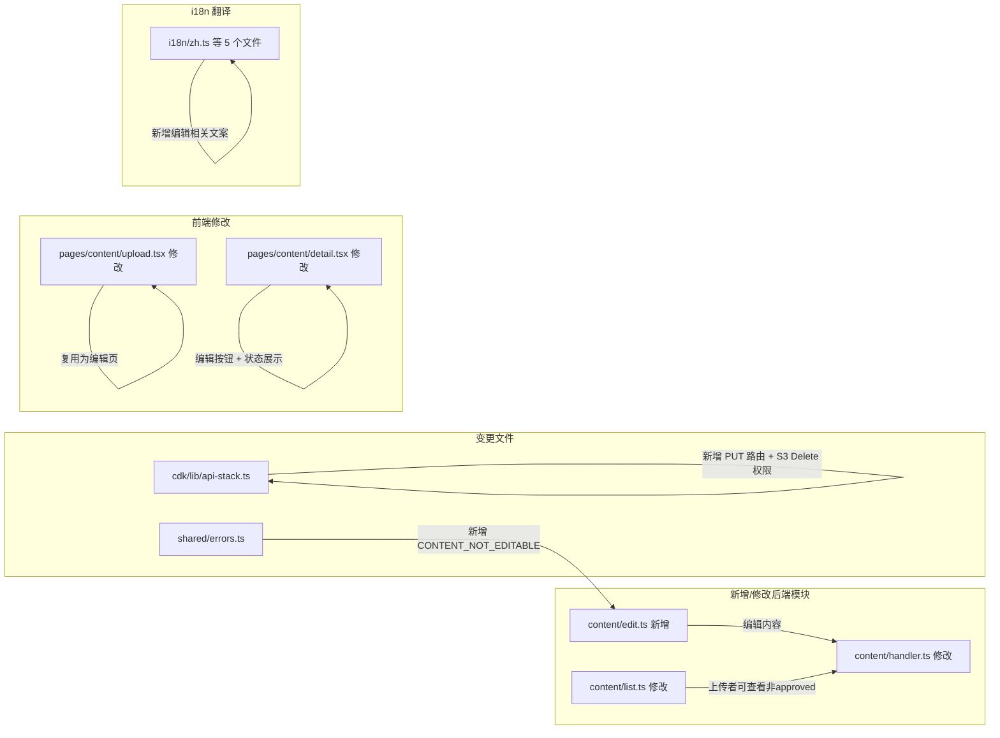

# 技术设计文档 - 内容编辑与预约数展示增强（Content Edit & Reservation Count Display）

## 概述（Overview）

本设计为现有 Content Hub 模块新增内容编辑功能，并增强预约次数展示。核心变更包括：

1. **新增后端编辑模块**：`packages/backend/src/content/edit.ts`，实现 `editContentItem` 函数
2. **新增错误码**：`CONTENT_NOT_EDITABLE`（400），用于拒绝对 approved 状态内容的编辑
3. **Content Handler 路由扩展**：新增 `PUT /api/content/{id}` 路由
4. **CDK 路由配置**：在 API Gateway 中为 `content/{id}` 资源添加 PUT 方法
5. **Content Lambda S3 权限扩展**：新增 `s3:DeleteObject` 权限用于删除旧文档文件
6. **前端上传页复用为编辑页**：通过 URL 参数 `id` 区分新建/编辑模式，预填充现有数据
7. **前端详情页增强**：上传者可见编辑按钮、审核状态展示、拒绝原因展示
8. **getContentDetail 接口增强**：允许上传者查看自己的非 approved 内容
9. **i18n 翻译扩展**：5 种语言新增编辑相关文案

设计目标：
- 最小化变更范围，复用现有上传页面和校验逻辑
- 编辑后状态重置为 pending，确保修改内容经过重新审核
- 替换文件时异步删除旧 S3 文件，删除失败不阻塞编辑操作
- 保持 likeCount、commentCount、reservationCount 不变量

---

## 架构（Architecture）

### 变更范围



### 架构决策

| 决策 | 选择 | 理由 |
|------|------|------|
| 编辑接口 | 新增 `PUT /api/content/{id}` | RESTful 语义清晰，与现有 POST 创建接口分离 |
| 编辑逻辑 | 独立 `edit.ts` 模块 | 与 `upload.ts` 职责分离，避免单文件过大 |
| 前端编辑页 | 复用 `upload.tsx` | 表单结构完全一致，通过 `id` 参数区分模式，减少代码重复 |
| 旧文件删除 | 编辑成功后异步删除 | 删除失败仅记录日志不阻塞，保证编辑操作的可靠性 |
| 权限校验 | uploaderId === userId | 仅原始上传者可编辑，无需额外权限表 |
| 可编辑状态 | 所有状态（pending + rejected + approved） | 任何状态的内容都可编辑，编辑后状态重置为 pending 重新审核 |
| 详情接口增强 | 上传者可查看自己的非 approved 内容 | 编辑前需要获取当前数据，上传者需要看到自己的 pending/rejected 内容 |

---

## 组件与接口（Components and Interfaces）

### 1. 内容编辑模块（packages/backend/src/content/edit.ts）

#### 1.1 editContentItem - 编辑内容记录

```typescript
interface EditContentItemInput {
  contentId: string;
  userId: string;
  title?: string;
  description?: string;
  categoryId?: string;
  videoUrl?: string;       // 空字符串表示清除
  fileKey?: string;        // 新文件的 S3 Key
  fileName?: string;
  fileSize?: number;
}

interface EditContentItemResult {
  success: boolean;
  item?: ContentItem;
  error?: { code: string; message: string };
}

export async function editContentItem(
  input: EditContentItemInput,
  dynamoClient: DynamoDBDocumentClient,
  s3Client: S3Client,
  tables: { contentItemsTable: string; categoriesTable: string },
  bucket: string,
): Promise<EditContentItemResult>;
```

实现要点：
1. **权限校验**：GetCommand 获取 ContentItem，验证 `uploaderId === userId`，不一致返回 FORBIDDEN
2. **状态校验**：验证 `status` 为 `pending` 或 `rejected`，否则返回 CONTENT_NOT_EDITABLE
3. **字段校验**（仅对提供的字段）：
   - title：1~100 字符
   - description：1~2000 字符
   - categoryId：存在于 ContentCategories 表
   - videoUrl：空字符串清除，非空需合法 URL 格式
4. **文件替换**：如果提供了新 fileKey，记录旧 fileKey 用于后续删除
5. **DynamoDB 更新**：使用 UpdateCommand 更新提供的字段 + status=pending + 清除 rejectReason/reviewerId/reviewedAt + 更新 updatedAt
6. **旧文件清理**：如果 fileKey 变更，使用 DeleteObjectCommand 删除旧 S3 文件，失败仅 console.error
7. **不变量保持**：不修改 likeCount、commentCount、reservationCount

### 2. 内容详情接口增强（packages/backend/src/content/list.ts）

#### 2.1 getContentDetail 修改

```typescript
// 现有签名不变，增加逻辑：
// 当 item.status !== 'approved' 时，如果 userId === item.uploaderId，仍然返回内容
// 否则返回 CONTENT_NOT_FOUND
```

修改要点：
- 现有逻辑：非 approved 状态一律返回 CONTENT_NOT_FOUND
- 新增逻辑：非 approved 状态时，检查 `userId === item.uploaderId`，如果是上传者本人则正常返回

### 3. Content Handler 路由扩展（packages/backend/src/content/handler.ts）

新增路由：
```typescript
// PUT /api/content/:id → editContentItem
```

新增正则：
```typescript
const CONTENT_ID_REGEX = /^\/api\/content\/([^/]+)$/;  // 已存在，复用
```

在 `authenticatedHandler` 中新增 PUT 方法分支。

### 4. CDK 配置变更（packages/cdk/lib/api-stack.ts）

- 在 `contentById` 资源上添加 `PUT` 方法，指向 `contentInt`（Content Lambda）
- 在 `configureImagesBucket` 方法中为 Content Lambda 添加 `s3:DeleteObject` 权限（`content/*` 路径）

---

## 数据模型（Data Models）

### ContentItems 表变更

无表结构变更。编辑操作通过 UpdateCommand 更新以下字段：

| 字段 | 编辑行为 |
|------|----------|
| `title` | 可选更新，需校验 1~100 字符 |
| `description` | 可选更新，需校验 1~2000 字符 |
| `categoryId` | 可选更新，需校验分类存在 |
| `categoryName` | 随 categoryId 同步更新（从 Categories 表获取） |
| `videoUrl` | 可选更新，空字符串清除，非空需合法 URL |
| `fileKey` | 可选更新（替换文件时） |
| `fileName` | 随 fileKey 同步更新 |
| `fileSize` | 随 fileKey 同步更新 |
| `status` | 强制重置为 `pending` |
| `rejectReason` | 强制清除（REMOVE） |
| `reviewerId` | 强制清除（REMOVE） |
| `reviewedAt` | 强制清除（REMOVE） |
| `updatedAt` | 更新为当前时间 |
| `likeCount` | **不变** |
| `commentCount` | **不变** |
| `reservationCount` | **不变** |

### 新增错误码

| HTTP 状态码 | 错误码 | 消息 | 对应需求 |
|-------------|--------|------|----------|
| 400 | `CONTENT_NOT_EDITABLE` | 该内容当前状态不允许编辑（仅 pending/rejected 可编辑） | 1.4 |


---

## 正确性属性（Correctness Properties）

*属性（Property）是指在系统所有有效执行中都应成立的特征或行为——本质上是对系统应做什么的形式化陈述。属性是人类可读规范与机器可验证正确性保证之间的桥梁。*

### Property 1: 编辑权限与状态门控

*对于任何*用户和 ContentItem 的组合，编辑操作成功当且仅当 `userId === uploaderId`。当 `userId !== uploaderId` 时应返回 FORBIDDEN。编辑后 status 重置为 pending。

**Validates: Requirements 1.1, 1.2, 1.3, 1.4**

### Property 2: 部分更新正确性

*对于任何*有效的编辑请求，请求中提供的字段应被更新为新值，未提供的字段应保留原始值不变。具体而言：如果请求包含 title 则 title 更新，否则 title 不变；fileKey/fileName/fileSize 同理；其他可选字段同理。

**Validates: Requirements 2.1, 2.7, 3.1, 3.4, 3.5**

### Property 3: 编辑输入校验正确性

*对于任何*编辑请求中提供的字段值：title 为空或超过 100 字符时应被拒绝；description 为空或超过 2000 字符时应被拒绝；categoryId 不存在于 ContentCategories 表时应被拒绝；videoUrl 非空且非合法 URL 时应被拒绝。合法值应通过校验。

**Validates: Requirements 2.2, 2.3, 2.4, 2.5**

### Property 4: 文件替换时旧文件删除

*对于任何*编辑操作，当请求中提供了新的 fileKey 且与原 fileKey 不同时，系统应对旧 fileKey 发起 S3 DeleteObject 调用。当 fileKey 未变更时，不应发起删除调用。

**Validates: Requirements 3.2**

### Property 5: 编辑后状态重置不变量

*对于任何*成功的编辑操作，编辑后的 ContentItem 应满足：status 为 `pending`，rejectReason/reviewerId/reviewedAt 被清除，updatedAt 被更新，且 likeCount、commentCount、reservationCount 与编辑前完全一致。

**Validates: Requirements 4.1, 4.2, 4.3, 4.4, 7.3**

### Property 6: 上传者可查看自己的非 approved 内容

*对于任何* ContentItem 和用户，当 `userId === uploaderId` 时，getContentDetail 应返回该内容（无论 status 为何值）；当 `userId !== uploaderId` 且 `status !== approved` 时，应返回 CONTENT_NOT_FOUND。

**Validates: Requirements 6.3**

---

## 错误处理（Error Handling）

### 新增错误码

在现有 `ErrorCodes` 基础上新增：

```typescript
// packages/shared/src/errors.ts 新增
export const ErrorCodes = {
  // ... 现有错误码 ...
  CONTENT_NOT_EDITABLE: 'CONTENT_NOT_EDITABLE',
} as const;

// ErrorHttpStatus 新增
[ErrorCodes.CONTENT_NOT_EDITABLE]: 400,

// ErrorMessages 新增
[ErrorCodes.CONTENT_NOT_EDITABLE]: '该内容当前状态不允许编辑（仅 pending/rejected 可编辑）',
```

### 错误处理策略

1. **权限校验失败**：返回 FORBIDDEN（403），不泄露内容是否存在
2. **状态校验失败**：返回 CONTENT_NOT_EDITABLE（400），明确告知仅 pending/rejected 可编辑
3. **内容不存在**：返回 CONTENT_NOT_FOUND（404）
4. **输入校验失败**：复用现有错误码（INVALID_CONTENT_TITLE、INVALID_CONTENT_DESCRIPTION、CATEGORY_NOT_FOUND、INVALID_VIDEO_URL）
5. **S3 旧文件删除失败**：console.error 记录日志，不影响编辑操作返回成功
6. **校验顺序**：内容存在 → 权限校验（uploaderId） → 状态校验 → 输入校验 → 执行更新

---

## 测试策略（Testing Strategy）

### 双重测试方法

延续现有系统的单元测试 + 属性测试双重策略。

### 技术选型

| 类别 | 工具 |
|------|------|
| 测试框架 | Vitest（现有） |
| 属性测试库 | fast-check（现有） |

### 单元测试范围

- **content/edit.test.ts**（新增）：编辑功能的具体场景
  - 上传者编辑自己的 pending 内容成功
  - 上传者编辑自己的 rejected 内容成功
  - 非上传者编辑被拒绝（FORBIDDEN）
  - 编辑 approved 内容被拒绝（CONTENT_NOT_EDITABLE）
  - 编辑不存在的内容被拒绝（CONTENT_NOT_FOUND）
  - 标题超长被拒绝
  - 描述超长被拒绝
  - 无效分类 ID 被拒绝
  - 无效视频 URL 被拒绝
  - 空字符串视频 URL 清除字段
  - 文件替换时旧文件被删除
  - S3 删除失败不阻塞编辑成功
  - 编辑后 status 重置为 pending
  - 编辑后 rejectReason/reviewerId/reviewedAt 被清除
  - 编辑后 likeCount/commentCount/reservationCount 不变
  - 部分字段更新（仅提供 title）
  - 部分字段更新（仅提供 description）
- **content/list.test.ts**（修改）：详情接口增强
  - 上传者可查看自己的 pending 内容
  - 上传者可查看自己的 rejected 内容
  - 非上传者无法查看非 approved 内容
- **content/handler.test.ts**（修改）：新增 PUT 路由测试

### 属性测试范围

**配置要求：**
- 每个属性测试最少运行 100 次迭代
- 标签格式：`Feature: content-edit, Property {number}: {property_text}`

**属性测试清单：**

| 属性编号 | 测试文件 | 测试描述 | 生成器 |
|----------|----------|----------|--------|
| Property 1 | content/edit.property.test.ts | 编辑权限与状态门控 | 随机 userId + 随机 ContentItem（随机 uploaderId、随机 status） |
| Property 2 | content/edit.property.test.ts | 部分更新正确性 | 随机 ContentItem + 随机字段子集 |
| Property 3 | content/edit.property.test.ts | 编辑输入校验正确性 | 随机长度字符串（title/description）+ 随机 URL + 随机 categoryId |
| Property 4 | content/edit.property.test.ts | 文件替换时旧文件删除 | 随机旧/新 fileKey 对 |
| Property 5 | content/edit.property.test.ts | 编辑后状态重置不变量 | 随机有效编辑输入 + 随机初始计数器值 |
| Property 6 | content/edit.property.test.ts | 上传者可查看自己的非 approved 内容 | 随机 userId + 随机 ContentItem（随机 status） |
