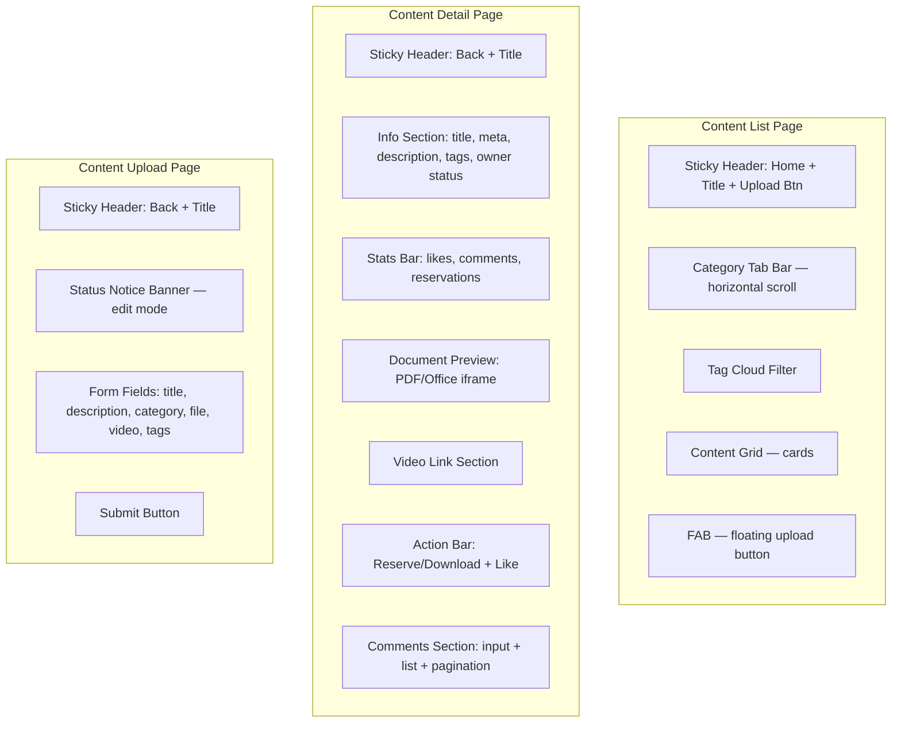
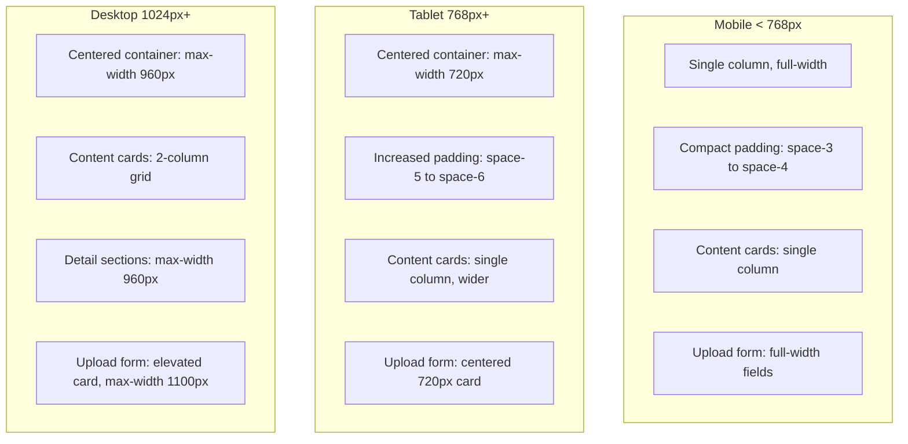

# Design Document: Content Hub UI Redesign

## Overview

This design applies visual polish, consistent hierarchy, and modern interaction patterns to the three content hub pages: content list (`packages/frontend/src/pages/content/index.tsx`), content detail (`packages/frontend/src/pages/content/detail.tsx`), and content upload/edit (`packages/frontend/src/pages/content/upload.tsx`). The redesign is purely frontend — no backend changes, no new API endpoints, no data model changes. All existing functionality (upload, preview, comments, likes, reservations, permissions, i18n, role-based visibility) is preserved identically.

The current pages are functionally complete but lack the visual polish applied in the admin-dashboard-redesign and settings-panel-redesign. This redesign brings all three pages into alignment with the project's design system by updating SCSS files and making minimal JSX class name adjustments where needed.

### Key Design Decisions

1. **SCSS-only refactor for styling**: The primary changes are in `index.scss`, `detail.scss`, and `upload.scss`. TSX files receive only minimal class name additions or adjustments where the existing markup needs a new class hook for styling.

2. **No new components**: No new React components are introduced. The existing component structure is preserved — only visual styling changes.

3. **BEM naming convention**: All CSS classes follow the existing BEM pattern already used across the three pages (e.g., `.content-card__title`, `.detail-info__meta`, `.upload-field__input`).

4. **Design system compliance**: All colors, spacing, typography, radius, shadows, and transitions use CSS variables from `app.scss`. No hardcoded values.

5. **Global classes reused**: `.btn-primary`, `.btn-secondary`, `.role-badge` classes from `app.scss` are used directly — no page-level redefinitions.

6. **SVG/text icons over emoji**: Stats icons (likes, comments, reservations) use text-based symbols or SVG instead of emoji characters. The content list page already uses text symbols (`♡`, `✎`, `⊞`); the detail page's emoji stats (`♥`, `💬`, `📋`) will be replaced with consistent text/SVG equivalents.

7. **Responsive breakpoints**: 375px (mobile), 768px (tablet), 1024px (desktop) — matching the existing breakpoint strategy.

8. **`prefers-reduced-motion` support**: Inherited from the global `app.scss` rule that disables all animations and transitions.

## Architecture

### File Change Scope

```
packages/frontend/src/pages/content/
├── index.tsx    — Minimal: replace emoji stat icons with text/SVG equivalents
├── index.scss   — Major: refine card styles, responsive grid, header, FAB
├── detail.tsx   — Minimal: replace emoji stat icons with text/SVG, ensure role-badge classes
├── detail.scss  — Major: refine info hierarchy, stats bar, actions, comments, responsive
├── upload.tsx   — No changes (already uses correct classes)
└── upload.scss  — Moderate: refine form field focus states, file area, desktop card layout
```

### Page Structure Overview



### Responsive Layout Strategy



## Components and Interfaces

### No New Components

All three pages retain their existing component structure. The redesign modifies only:
- **SCSS files**: Updated styles for visual polish, hierarchy, and responsive behavior
- **TSX files**: Minimal changes to replace emoji icons with text/SVG equivalents in the stats display areas

### Content List Page — CSS Class Structure

The existing BEM classes are preserved. Key styling updates:

| Class | Current | Updated |
|---|---|---|
| `.content-page` | `--bg-base` background | Unchanged |
| `.content-header` | Sticky, `--bg-void` | Unchanged — already well-styled |
| `.content-header__upload-btn` | `--accent-primary` | Unchanged — already correct |
| `.content-filter` | Underline tabs | Unchanged — already correct |
| `.content-card` | `--bg-surface`, `--card-border` | Refine hover: ensure `--card-border-hover` + `--shadow-card-hover` |
| `.content-card__stats` | Text symbols `♡ ✎ ⊞` | Keep text symbols (already non-emoji) |
| `.content-card__new-badge` | Red pulse badge | Unchanged — already correct |
| `.content-grid` | Single col mobile, 2-col desktop | Unchanged — already correct |
| `.content-fab` | Fixed bottom-right | Unchanged — already correct |

The content list page is already well-aligned with the design system. Changes are minor refinements.

### Content Detail Page — CSS Class Structure

The detail page needs the most visual refinement:

| Class | Current | Updated |
|---|---|---|
| `.detail-header` | Basic flex layout | Add `gap` for consistent spacing, refine back button with border + radius |
| `.detail-header__back` | Plain text | Add border, padding, radius like upload page back button |
| `.detail-info__title` | `--text-h2`, `--font-body` | Use `--font-body` at `--text-h2` — already correct |
| `.detail-info__meta` | Flex row with gaps | Ensure consistent `--space-3` gaps |
| `.detail-info__desc` | `--text-secondary`, line-height 1.7 | Unchanged — already correct |
| `.detail-info__tags` | Pill chips with accent tint | Unchanged — already correct |
| `.detail-stats` | Emoji icons `♥ 💬 📋` | **Replace with SVG icons** in TSX; update SCSS for SVG sizing |
| `.detail-stats__icon` | Emoji text | SVG icon component or text symbol |
| `.detail-actions__like-btn` | Elevated button with liked state | Unchanged — already correct |
| `.detail-preview__frame` | 500px height iframe | Unchanged — already correct |
| `.comment-item` | Border-bottom dividers | Unchanged — already correct |
| `.comment-input__field` | Textarea with focus state | Unchanged — already correct |

### Content Detail Page — Stats Bar Icon Replacement

The detail page currently uses emoji for stats:
- `♥` for likes → Replace with SVG heart icon or text `♥` (already non-emoji in liked state)
- `💬` for comments → Replace with SVG comment icon or text symbol `✎`
- `📋` for reservations → Replace with SVG clipboard icon or text symbol `⊞`

This requires a small TSX change in `detail.tsx` to replace the emoji `Text` elements with inline SVG components or consistent text symbols matching the list page.

**SVG Icon Approach** (preferred for consistency):

```typescript
// Inline SVG icons for stats — small, self-contained
function HeartIcon({ size = 16, color = 'currentColor' }) {
  return (
    <svg width={size} height={size} viewBox="0 0 24 24" fill="none" stroke={color}
      strokeWidth="2" strokeLinecap="round" strokeLinejoin="round">
      <path d="M20.84 4.61a5.5 5.5 0 0 0-7.78 0L12 5.67l-1.06-1.06a5.5 5.5 0 0 0-7.78 7.78l1.06 1.06L12 21.23l7.78-7.78 1.06-1.06a5.5 5.5 0 0 0 0-7.78z" />
    </svg>
  );
}

function CommentIcon({ size = 16, color = 'currentColor' }) {
  return (
    <svg width={size} height={size} viewBox="0 0 24 24" fill="none" stroke={color}
      strokeWidth="2" strokeLinecap="round" strokeLinejoin="round">
      <path d="M21 15a2 2 0 0 1-2 2H7l-4 4V5a2 2 0 0 1 2-2h14a2 2 0 0 1 2 2z" />
    </svg>
  );
}

function ClipboardIcon({ size = 16, color = 'currentColor' }) {
  return (
    <svg width={size} height={size} viewBox="0 0 24 24" fill="none" stroke={color}
      strokeWidth="2" strokeLinecap="round" strokeLinejoin="round">
      <path d="M16 4h2a2 2 0 0 1 2 2v14a2 2 0 0 1-2 2H6a2 2 0 0 1-2-2V6a2 2 0 0 1 2-2h2" />
      <rect x="8" y="2" width="8" height="4" rx="1" ry="1" />
    </svg>
  );
}
```

### Content Detail Page — Header Refinement

The detail page header currently uses a plain text back button. To match the upload page's polished header:

```scss
.detail-header {
  display: flex;
  align-items: center;
  padding: var(--space-4) var(--space-5);
  background: var(--bg-void);
  border-bottom: 1px solid var(--card-border);
  position: sticky;
  top: 0;
  z-index: 20;
  gap: var(--space-4);  // ADD: consistent gap

  &__back {
    flex-shrink: 0;
    font-size: var(--text-body);
    color: var(--text-secondary);
    cursor: pointer;
    transition: color var(--transition-fast);
    padding: var(--space-2) var(--space-3);          // ADD
    border-radius: var(--radius-md);                  // ADD
    border: 1px solid var(--card-border);             // ADD

    &:hover {
      color: var(--text-primary);
      border-color: var(--card-border-hover);         // ADD
    }
  }

  &__title {
    flex: 1;
    font-family: var(--font-display);
    font-size: var(--text-h3);
    font-weight: 700;
    color: var(--text-primary);
    white-space: nowrap;
    text-align: center;                               // ADD
  }

  &__spacer {
    flex-shrink: 0;
    width: 72px;  // Match back button width for centering
  }
}
```

### Content Upload Page — CSS Class Structure

The upload page is already well-styled. Minor refinements:

| Class | Current | Updated |
|---|---|---|
| `.upload-page` | `--bg-base` mobile, `--bg-void` desktop | Unchanged |
| `.upload-header` | Sticky, centered title | Unchanged — already matches design |
| `.upload-field__input` | Focus → `--accent-primary` border | Desktop: add `box-shadow: 0 0 0 3px rgba(124, 109, 240, 0.12)` on focus — already done |
| `.upload-file-area` | Dashed border, hover state | Unchanged — already correct |
| `.upload-submit__btn` | Full width mobile, centered desktop | Unchanged — already correct |

The upload page requires no SCSS changes — it's already fully aligned with the design system from the initial implementation.

### Category Tab Bar — Existing Implementation

The content list page's category tab bar (`.content-filter`) is already well-implemented with:
- Horizontal scroll with `ScrollView scrollX`
- Active/inactive states with underline indicator
- `--accent-primary` underline for active tab
- `--text-tertiary` for inactive, `--text-primary` for active

No changes needed.

### Tag Cloud — Existing Implementation

The `TagCloud` component is imported from `../../components/TagCloud` and handles its own styling. No changes needed for the redesign.

## Data Models

No data model changes. No new TypeScript interfaces. No changes to API request/response shapes.

The only structural change is replacing emoji `Text` elements with SVG icon components in `detail.tsx` for the stats bar — this is a JSX-level change, not a data model change.

## Error Handling

No new error handling is needed. All existing error handling patterns are preserved:

- **Content list**: Loading states, empty states, infinite scroll error handling — unchanged
- **Content detail**: Loading/error states with retry, API error toasts for like/reserve/download/comment — unchanged
- **Content upload**: Form validation errors, file upload error handling with `UploadError` types, API error toasts — unchanged
- **Authentication guards**: Redirect non-authenticated users to login — unchanged
- **Permission checks**: Role-based permission computation for access/upload/download/reserve — unchanged

The redesign introduces no new failure modes. All changes are purely visual.

## Testing Strategy

### Why Property-Based Testing Does Not Apply

This feature is a pure UI/UX visual redesign:
- No data transformations or business logic changes
- No parsers, serializers, or algorithms
- No input space that varies meaningfully across generated inputs
- All functionality is preserved — only visual styling changes
- SCSS changes and minor JSX icon replacements have no testable properties

There are no universal properties to test across generated inputs. The correct approach is manual visual verification and example-based checks.

### Unit Tests (Example-Based)

Since this is a visual-only redesign with no logic changes, unit testing scope is minimal:

1. **SVG icon components render**: Verify the new `HeartIcon`, `CommentIcon`, and `ClipboardIcon` components render without errors when given size and color props.

2. **Existing functionality preserved**: Run the existing test suite to confirm no regressions from the minimal TSX changes.

### Manual Testing Checklist

Visual verification is the primary testing approach for this redesign:

**Content List Page:**
- [ ] Header displays correctly: home button, centered title, upload button (when permitted)
- [ ] Upload button hidden when user lacks upload permission
- [ ] Category tab bar scrolls horizontally on mobile with hidden scrollbar
- [ ] Active tab shows `--accent-primary` underline indicator
- [ ] Tag cloud filter works correctly
- [ ] Content cards display with `--bg-surface` background, `--card-border` border
- [ ] Card hover shows `--card-border-hover` border + `--shadow-card-hover`
- [ ] NEW badge displays on cards for items < 7 days old with pulse animation
- [ ] Stats use text/SVG icons (no emoji)
- [ ] Single-column layout on mobile (< 768px)
- [ ] Centered 720px container on tablet (768px+)
- [ ] Two-column grid on desktop (1024px+) with 960px container
- [ ] FAB visible at bottom-right with glow shadow
- [ ] Infinite scroll pagination works
- [ ] Card click navigates to detail page
- [ ] No-access view displays for unauthorized users

**Content Detail Page:**
- [ ] Header: back button with border/radius, centered title
- [ ] Content title in `--text-h2` with proper weight
- [ ] Meta row: uploader, role badge (global `.role-badge`), category pill, date
- [ ] Description in `--text-secondary` with line-height 1.7
- [ ] Tags displayed as accent-tinted pills
- [ ] Owner status section: pending (warning), approved (success), rejected (error)
- [ ] Reject reason displayed in error-tinted box
- [ ] Edit button visible when owner and no reservations
- [ ] Stats bar: SVG icons for likes/comments/reservations (no emoji)
- [ ] Document preview iframe with border and radius
- [ ] Video link in `--accent-primary` with hover state
- [ ] Reserve button uses `.btn-primary`
- [ ] Download button appears after reservation
- [ ] Like button with liked/unliked visual states
- [ ] Comment input with focus border transition
- [ ] Comment submit uses `.btn-primary` with disabled state
- [ ] Comment list with role badges and dividers
- [ ] Load more / no more comments states
- [ ] Centered content at 800px (tablet) and 960px (desktop)

**Content Upload Page:**
- [ ] Header: back button with border, centered title
- [ ] Status notice banners (rejected/pending) in edit mode
- [ ] Form fields with `--bg-elevated` background, focus → `--accent-primary` border
- [ ] File upload area with dashed border, hover state
- [ ] Category picker with select styling
- [ ] Tag input component works
- [ ] Submit button: full-width mobile, centered 360px desktop
- [ ] Desktop card layout with `--bg-surface`, `--shadow-md`
- [ ] Form validation errors display correctly
- [ ] File upload to S3 works in create and edit modes

**Cross-Cutting:**
- [ ] All text uses `--font-display` for titles/numbers, `--font-body` for body text
- [ ] All colors use CSS variables (no hardcoded values)
- [ ] All spacing uses `--space-*` variables
- [ ] `prefers-reduced-motion` disables all animations (inherited from `app.scss`)
- [ ] Focus-visible outlines on all interactive elements (inherited from `app.scss`)
- [ ] i18n translation keys all work correctly
- [ ] Authentication guard redirects work on all three pages
