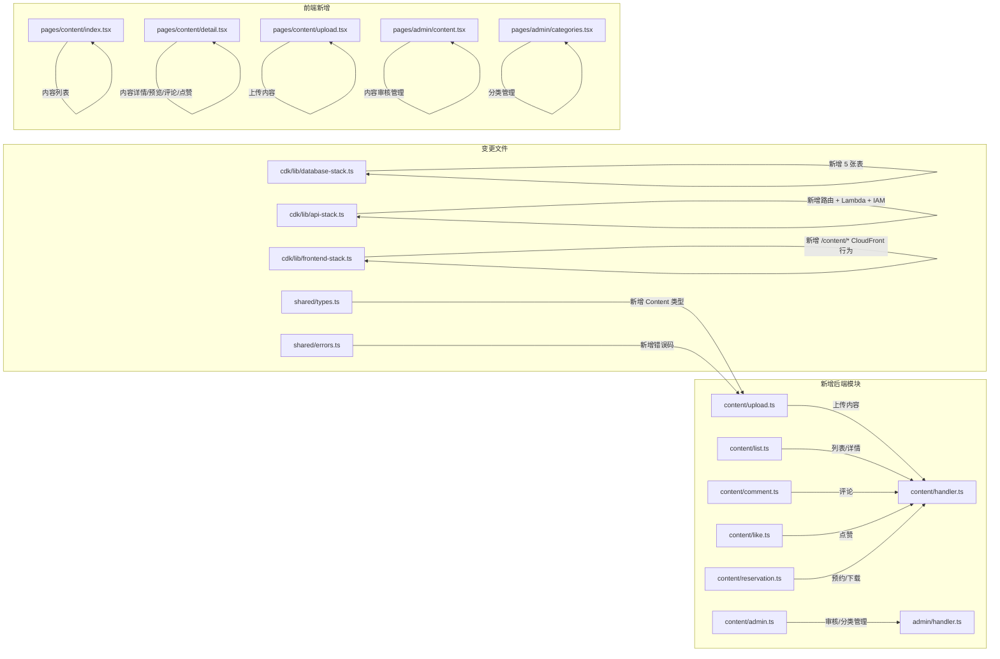

# 技术设计文档 - 内容中心（Content Hub）

## 概述（Overview）

本设计为积分商城系统新增内容共享与知识管理模块。核心变更包括：

1. **新增 5 张 DynamoDB 表**：ContentItems、ContentCategories、ContentComments、ContentLikes、ContentReservations
2. **复用现有 S3 Images Bucket**：新增 `content/` 前缀路径存储文档文件（PPT、PDF、DOC 等）
3. **新增 Content Lambda**：独立 Lambda 函数处理内容中心用户端 API（上传、列表、详情、评论、点赞、预约）
4. **Admin Handler 路由扩展**：新增内容审核、分类管理等管理端路由
5. **前端新增页面**：内容列表页、内容详情页、内容上传页、管理端内容管理页
6. **CDK 配置**：新增 5 张表定义、Content Lambda、API Gateway 路由、S3/CloudFront 权限

设计目标：
- 复用现有架构模式（Handler 路由分发、auth-middleware、DynamoDB Query + 分页、ErrorCodes 体系）
- 文档预览采用 Office Online Viewer（PPT/DOC）+ 内嵌 PDF.js（PDF），无需额外后端服务
- 使用预约时通过 DynamoDB TransactWriteItems 保证预约记录创建与积分发放的原子性
- 点赞操作幂等：同一用户对同一内容最多一条 Like 记录

---

## 架构（Architecture）

### 变更范围



### 架构决策

| 决策 | 选择 | 理由 |
|------|------|------|
| 文档存储 | 复用现有 Images S3 Bucket，`content/` 前缀 | 避免新建 Bucket，复用 CloudFront 分发和 OAC 配置 |
| 文档预览 | Office Online Viewer + PDF.js | 无需后端转换服务；Office Online 免费支持 PPT/DOC 在线预览，PDF.js 支持 PDF 渲染 |
| Content Lambda | 独立新建 Lambda | 内容模块路由较多，独立 Lambda 避免现有 Lambda 代码膨胀，职责清晰 |
| 管理端路由 | 扩展现有 Admin Lambda | 复用管理员权限校验逻辑，保持管理端路由统一入口 |
| 积分发放 | TransactWriteItems | 预约创建 + 积分发放 + 积分记录三步原子操作，防止部分失败 |
| 点赞存储 | 独立 ContentLikes 表 | PK=`userId#contentId` 天然保证幂等，查询高效 |
| 评论存储 | 独立 ContentComments 表 | GSI 按 contentId + createdAt 排序，支持分页查询 |
| 预约去重 | ContentReservations 表 PK=`userId#contentId` | 天然幂等，ConditionExpression 防止重复创建 |
| 分类管理 | 独立 ContentCategories 表 | 分类数据量小，Scan 即可；支持动态增删改 |

---

## 组件与接口（Components and Interfaces）

### 1. 内容上传模块（packages/backend/src/content/upload.ts）

#### 1.1 getContentUploadUrl - 获取文档上传预签名 URL

```typescript
interface GetContentUploadUrlInput {
  userId: string;
  fileName: string;
  contentType: string;
}

interface GetContentUploadUrlResult {
  success: boolean;
  data?: { uploadUrl: string; fileKey: string };
  error?: { code: string; message: string };
}

export async function getContentUploadUrl(
  input: GetContentUploadUrlInput,
  s3Client: S3Client,
  bucket: string,
): Promise<GetContentUploadUrlResult>;
```

实现要点：
- 校验 contentType 属于允许的 MIME 类型：`application/pdf`, `application/vnd.ms-powerpoint`, `application/vnd.openxmlformats-officedocument.presentationml.presentation`, `application/msword`, `application/vnd.openxmlformats-officedocument.wordprocessingml.document`
- 生成 S3 Key：`content/{userId}/{ulid}/{fileName}`
- 使用 PutObjectCommand 生成预签名 URL，设置 ContentLength 上限 50MB

#### 1.2 createContentItem - 创建内容记录

```typescript
interface CreateContentItemInput {
  userId: string;
  userNickname: string;
  userRole: string;
  title: string;
  description: string;
  categoryId: string;
  fileKey: string;
  fileName: string;
  fileSize: number;
  videoUrl?: string;
}

interface CreateContentItemResult {
  success: boolean;
  item?: ContentItem;
  error?: { code: string; message: string };
}

export async function createContentItem(
  input: CreateContentItemInput,
  dynamoClient: DynamoDBDocumentClient,
  tables: { contentItemsTable: string; categoriesTable: string },
): Promise<CreateContentItemResult>;
```

实现要点：
- 校验 title（1~100 字符）、description（1~2000 字符）
- 校验 categoryId 存在于 ContentCategories 表
- 校验 videoUrl 格式合法性（可选）
- 使用 ULID 生成 contentId，状态设为 `pending`
- 初始化 likeCount=0、commentCount=0、reservationCount=0

### 2. 内容列表与详情模块（packages/backend/src/content/list.ts）

#### 2.1 listContentItems - 内容列表（用户端）

```typescript
interface ListContentItemsOptions {
  categoryId?: string;
  pageSize?: number;
  lastKey?: string;
}

interface ListContentItemsResult {
  success: boolean;
  items?: ContentItemSummary[];
  lastKey?: string;
}

export async function listContentItems(
  options: ListContentItemsOptions,
  dynamoClient: DynamoDBDocumentClient,
  contentItemsTable: string,
): Promise<ListContentItemsResult>;
```

实现要点：
- 仅返回 status=approved 的内容
- 无分类筛选时：使用 GSI `status-createdAt-index` 查询 status=approved，ScanIndexForward=false
- 有分类筛选时：使用 GSI `categoryId-createdAt-index` 查询 + FilterExpression status=approved
- 返回摘要字段：contentId、title、categoryName、uploaderNickname、likeCount、commentCount、reservationCount、createdAt

#### 2.2 getContentDetail - 内容详情

```typescript
interface GetContentDetailResult {
  success: boolean;
  item?: ContentItem;
  hasReserved?: boolean;
  hasLiked?: boolean;
  error?: { code: string; message: string };
}

export async function getContentDetail(
  contentId: string,
  userId: string | null,
  dynamoClient: DynamoDBDocumentClient,
  tables: { contentItemsTable: string; reservationsTable: string; likesTable: string },
): Promise<GetContentDetailResult>;
```

实现要点：
- GetCommand 获取内容记录，非 approved 状态返回 CONTENT_NOT_FOUND（除非是上传者本人或管理员）
- 如果 userId 存在，并行查询 Reservations 和 Likes 表判断当前用户是否已预约/已点赞
- 返回完整内容信息 + hasReserved + hasLiked 标志

### 3. 评论模块（packages/backend/src/content/comment.ts）

#### 3.1 addComment - 添加评论

```typescript
interface AddCommentInput {
  contentId: string;
  userId: string;
  userNickname: string;
  userRole: string;
  content: string;
}

interface AddCommentResult {
  success: boolean;
  comment?: ContentComment;
  error?: { code: string; message: string };
}

export async function addComment(
  input: AddCommentInput,
  dynamoClient: DynamoDBDocumentClient,
  tables: { commentsTable: string; contentItemsTable: string },
): Promise<AddCommentResult>;
```

实现要点：
- 校验 content 非空且 ≤ 500 字符
- 校验 contentId 对应的内容存在且 status=approved
- PutCommand 写入 Comments 表
- UpdateCommand 原子递增 ContentItems 表的 commentCount

#### 3.2 listComments - 评论列表

```typescript
interface ListCommentsOptions {
  contentId: string;
  pageSize?: number;
  lastKey?: string;
}

interface ListCommentsResult {
  success: boolean;
  comments?: ContentComment[];
  lastKey?: string;
}

export async function listComments(
  options: ListCommentsOptions,
  dynamoClient: DynamoDBDocumentClient,
  commentsTable: string,
): Promise<ListCommentsResult>;
```

实现要点：
- 使用 GSI `contentId-createdAt-index` 查询，ScanIndexForward=false（时间倒序）
- pageSize 默认 20，最大 100

### 4. 点赞模块（packages/backend/src/content/like.ts）

#### 4.1 toggleLike - 切换点赞状态

```typescript
interface ToggleLikeInput {
  contentId: string;
  userId: string;
}

interface ToggleLikeResult {
  success: boolean;
  liked: boolean;
  likeCount: number;
  error?: { code: string; message: string };
}

export async function toggleLike(
  input: ToggleLikeInput,
  dynamoClient: DynamoDBDocumentClient,
  tables: { likesTable: string; contentItemsTable: string },
): Promise<ToggleLikeResult>;
```

实现要点：
- PK=`{userId}#{contentId}`，先 GetCommand 查询是否已存在
- 已存在：DeleteCommand 删除 + UpdateCommand 原子递减 likeCount
- 不存在：PutCommand 创建 + UpdateCommand 原子递增 likeCount
- 返回操作后的 liked 状态和最新 likeCount

### 5. 预约与下载模块（packages/backend/src/content/reservation.ts）

#### 5.1 createReservation - 创建使用预约

```typescript
interface CreateReservationInput {
  contentId: string;
  userId: string;
}

interface CreateReservationResult {
  success: boolean;
  alreadyReserved?: boolean;
  error?: { code: string; message: string };
}

export async function createReservation(
  input: CreateReservationInput,
  dynamoClient: DynamoDBDocumentClient,
  tables: {
    reservationsTable: string;
    contentItemsTable: string;
    usersTable: string;
    pointsRecordsTable: string;
  },
  rewardPoints: number,
): Promise<CreateReservationResult>;
```

实现要点：
- PK=`{userId}#{contentId}`，使用 ConditionExpression `attribute_not_exists(pk)` 防止重复
- 如果已存在，返回 `{ success: true, alreadyReserved: true }`，不重复发放积分
- 新建预约时使用 TransactWriteItems 原子操作：
  1. PutCommand 写入 Reservations 表（带 ConditionExpression）
  2. UpdateCommand 递增 ContentItems 表的 reservationCount
  3. UpdateCommand 递增上传者（ContentItem.uploaderId）的 Users 表 points
  4. PutCommand 写入 PointsRecords 表，source="content_hub_reservation"
- rewardPoints 从环境变量读取（SuperAdmin 可配置）

#### 5.2 getDownloadUrl - 获取文档下载 URL

```typescript
interface GetDownloadUrlResult {
  success: boolean;
  downloadUrl?: string;
  error?: { code: string; message: string };
}

export async function getDownloadUrl(
  contentId: string,
  userId: string,
  dynamoClient: DynamoDBDocumentClient,
  s3Client: S3Client,
  tables: { contentItemsTable: string; reservationsTable: string },
  bucket: string,
): Promise<GetDownloadUrlResult>;
```

实现要点：
- 先查询 Reservations 表确认用户已预约，未预约返回 RESERVATION_REQUIRED
- 获取 ContentItem 的 fileKey，生成 S3 GetObject 预签名 URL（有效期 1 小时）

### 6. 管理端内容模块（packages/backend/src/content/admin.ts）

#### 6.1 reviewContent - 审核内容

```typescript
interface ReviewContentInput {
  contentId: string;
  reviewerId: string;
  action: 'approve' | 'reject';
  rejectReason?: string;
}

interface ReviewContentResult {
  success: boolean;
  item?: ContentItem;
  error?: { code: string; message: string };
}

export async function reviewContent(
  input: ReviewContentInput,
  dynamoClient: DynamoDBDocumentClient,
  contentItemsTable: string,
): Promise<ReviewContentResult>;
```

#### 6.2 deleteContent - 删除内容

```typescript
export async function deleteContent(
  contentId: string,
  dynamoClient: DynamoDBDocumentClient,
  s3Client: S3Client,
  tables: {
    contentItemsTable: string;
    commentsTable: string;
    likesTable: string;
    reservationsTable: string;
  },
  bucket: string,
): Promise<{ success: boolean; error?: { code: string; message: string } }>;
```

实现要点：
- 删除 S3 文档文件
- 批量删除关联的 Comments、Likes、Reservations 记录（BatchWriteCommand）
- 删除 ContentItem 记录

#### 6.3 分类管理 CRUD

```typescript
export async function createCategory(name: string, dynamoClient, table): Promise<...>;
export async function updateCategory(categoryId: string, name: string, dynamoClient, table): Promise<...>;
export async function deleteCategory(categoryId: string, dynamoClient, table): Promise<...>;
export async function listCategories(dynamoClient, table): Promise<...>;
```

### 7. Content Handler（packages/backend/src/content/handler.ts）

新增独立 Lambda 函数，路由分发：

```typescript
// POST /api/content/upload-url       → getContentUploadUrl
// POST /api/content                  → createContentItem
// GET  /api/content                  → listContentItems
// GET  /api/content/categories       → listCategories（公开）
// GET  /api/content/:id              → getContentDetail
// POST /api/content/:id/comments     → addComment
// GET  /api/content/:id/comments     → listComments
// POST /api/content/:id/like         → toggleLike
// POST /api/content/:id/reserve      → createReservation
// GET  /api/content/:id/download     → getDownloadUrl
```

### 8. Admin Handler 路由扩展

新增路由：

```typescript
// GET    /api/admin/content              → listAllContent（含所有状态）
// PATCH  /api/admin/content/:id/review   → reviewContent
// DELETE /api/admin/content/:id          → deleteContent
// POST   /api/admin/content/categories   → createCategory
// PUT    /api/admin/content/categories/:id → updateCategory
// DELETE /api/admin/content/categories/:id → deleteCategory
```

---

## 数据模型（Data Models）

### ContentItems 表（新增）

| 属性 | 类型 | 说明 |
|------|------|------|
| PK: `contentId` | String | 内容唯一 ID（ULID） |
| `title` | String | 标题（1~100 字符） |
| `description` | String | 描述（1~2000 字符） |
| `categoryId` | String | 分类 ID |
| `categoryName` | String | 分类名称（冗余存储） |
| `uploaderId` | String | 上传者用户 ID |
| `uploaderNickname` | String | 上传者昵称（冗余存储） |
| `uploaderRole` | String | 上传者角色 |
| `fileKey` | String | S3 文档文件 Key |
| `fileName` | String | 原始文件名 |
| `fileSize` | Number | 文件大小（字节） |
| `videoUrl` | String | 视频链接（可选） |
| `status` | String | pending / approved / rejected |
| `rejectReason` | String | 拒绝原因（可选） |
| `reviewerId` | String | 审核人 ID（可选） |
| `reviewedAt` | String | 审核时间（可选） |
| `likeCount` | Number | 点赞总数 |
| `commentCount` | Number | 评论总数 |
| `reservationCount` | Number | 预约总数 |
| `createdAt` | String | 创建时间 ISO 8601 |
| `updatedAt` | String | 更新时间 ISO 8601 |

**GSI：**
- `status-createdAt-index`：PK=`status`，SK=`createdAt`，用于按状态查询（用户端查 approved，管理端查所有状态）
- `categoryId-createdAt-index`：PK=`categoryId`，SK=`createdAt`，用于按分类筛选
- `uploaderId-createdAt-index`：PK=`uploaderId`，SK=`createdAt`，用于查询用户自己上传的内容

### ContentCategories 表（新增）

| 属性 | 类型 | 说明 |
|------|------|------|
| PK: `categoryId` | String | 分类唯一 ID（ULID） |
| `name` | String | 分类名称 |
| `createdAt` | String | 创建时间 ISO 8601 |

数据量小（预计 < 50），使用 Scan 即可。

### ContentComments 表（新增）

| 属性 | 类型 | 说明 |
|------|------|------|
| PK: `commentId` | String | 评论唯一 ID（ULID） |
| `contentId` | String | 关联的内容 ID |
| `userId` | String | 评论者用户 ID |
| `userNickname` | String | 评论者昵称 |
| `userRole` | String | 评论者角色 |
| `content` | String | 评论内容（1~500 字符） |
| `createdAt` | String | 评论时间 ISO 8601 |

**GSI：**
- `contentId-createdAt-index`：PK=`contentId`，SK=`createdAt`，用于按内容查询评论列表

### ContentLikes 表（新增）

| 属性 | 类型 | 说明 |
|------|------|------|
| PK: `pk` | String | `{userId}#{contentId}` 复合键 |
| `userId` | String | 点赞用户 ID |
| `contentId` | String | 关联的内容 ID |
| `createdAt` | String | 点赞时间 ISO 8601 |

PK 设计天然保证同一用户对同一内容最多一条记录（幂等性）。

**GSI：**
- `contentId-index`：PK=`contentId`，用于查询某内容的所有点赞记录（删除内容时批量清理）

### ContentReservations 表（新增）

| 属性 | 类型 | 说明 |
|------|------|------|
| PK: `pk` | String | `{userId}#{contentId}` 复合键 |
| `userId` | String | 预约用户 ID |
| `contentId` | String | 关联的内容 ID |
| `createdAt` | String | 预约时间 ISO 8601 |

PK 设计天然保证同一用户对同一内容最多一条预约记录。

**GSI：**
- `contentId-index`：PK=`contentId`，用于查询某内容的所有预约记录（删除内容时批量清理）

### 新增共享类型（packages/shared/src/types.ts）

```typescript
/** 内容状态 */
export type ContentStatus = 'pending' | 'approved' | 'rejected';

/** 内容记录 */
export interface ContentItem {
  contentId: string;
  title: string;
  description: string;
  categoryId: string;
  categoryName: string;
  uploaderId: string;
  uploaderNickname: string;
  uploaderRole: string;
  fileKey: string;
  fileName: string;
  fileSize: number;
  videoUrl?: string;
  status: ContentStatus;
  rejectReason?: string;
  reviewerId?: string;
  reviewedAt?: string;
  likeCount: number;
  commentCount: number;
  reservationCount: number;
  createdAt: string;
  updatedAt: string;
}

/** 内容列表摘要 */
export interface ContentItemSummary {
  contentId: string;
  title: string;
  categoryName: string;
  uploaderNickname: string;
  likeCount: number;
  commentCount: number;
  reservationCount: number;
  createdAt: string;
}

/** 内容分类 */
export interface ContentCategory {
  categoryId: string;
  name: string;
  createdAt: string;
}

/** 内容评论 */
export interface ContentComment {
  commentId: string;
  contentId: string;
  userId: string;
  userNickname: string;
  userRole: string;
  content: string;
  createdAt: string;
}

/** 内容预约记录 */
export interface ContentReservation {
  pk: string;
  userId: string;
  contentId: string;
  createdAt: string;
}
```

### 新增错误码（packages/shared/src/errors.ts）

| HTTP 状态码 | 错误码 | 消息 | 对应需求 |
|-------------|--------|------|----------|
| 400 | `INVALID_CONTENT_FILE_TYPE` | 不支持的文档格式，仅支持 PPT/PPTX/PDF/DOC/DOCX | 1.4 |
| 400 | `CONTENT_FILE_TOO_LARGE` | 文档文件大小超过 50MB 上限 | 1.5 |
| 400 | `INVALID_VIDEO_URL` | 视频链接格式无效 | 1.6 |
| 400 | `INVALID_CONTENT_TITLE` | 内容标题格式无效（1~100 字符） | 1.2 |
| 400 | `INVALID_CONTENT_DESCRIPTION` | 内容描述格式无效（1~2000 字符） | 1.2 |
| 404 | `CONTENT_NOT_FOUND` | 内容不存在 | 4.1 |
| 404 | `CATEGORY_NOT_FOUND` | 分类不存在 | 3.2 |
| 400 | `CONTENT_ALREADY_REVIEWED` | 该内容已被审核 | 2.3 |
| 400 | `INVALID_COMMENT_CONTENT` | 评论内容无效（1~500 字符） | 7.3, 7.4 |
| 400 | `RESERVATION_REQUIRED` | 需先完成使用预约才能下载 | 5.2 |
| 403 | `CONTENT_REVIEW_FORBIDDEN` | 仅 SuperAdmin 可审核内容 | 2.1 |

---

## 正确性属性（Correctness Properties）

*属性（Property）是指在系统所有有效执行中都应成立的特征或行为——本质上是对系统应做什么的形式化陈述。属性是人类可读规范与机器可验证正确性保证之间的桥梁。*

### Property 1: 文档格式校验正确性

*对于任何* MIME 类型字符串，如果该字符串不属于 `application/pdf`、`application/vnd.ms-powerpoint`、`application/vnd.openxmlformats-officedocument.presentationml.presentation`、`application/msword`、`application/vnd.openxmlformats-officedocument.wordprocessingml.document` 五种之一，则上传请求应被拒绝并返回 INVALID_CONTENT_FILE_TYPE；反之，校验应通过。

**Validates: Requirements 1.4**

### Property 2: 视频 URL 格式校验正确性

*对于任何*字符串，如果该字符串不是合法的 URL 格式，则作为 videoUrl 提交时应被拒绝并返回 INVALID_VIDEO_URL；如果是合法 URL，则校验应通过。

**Validates: Requirements 1.6**

### Property 3: 新建内容初始状态不变量

*对于任何*有效的内容上传输入，创建成功后的 ContentItem 的 status 应始终为 `pending`，且 likeCount、commentCount、reservationCount 均为 0。

**Validates: Requirements 1.7**

### Property 4: 内容审核权限校验

*对于任何*用户角色集合，如果该集合不包含 SuperAdmin，则审核内容操作应被拒绝并返回 CONTENT_REVIEW_FORBIDDEN；如果包含 SuperAdmin，则权限校验应通过。

**Validates: Requirements 2.1**

### Property 5: 管理端状态筛选正确性

*对于任何*有效的 ContentStatus 筛选值，管理端列表查询使用该状态筛选后返回的每条 ContentItem 的 status 都应等于指定的筛选值。

**Validates: Requirements 2.2**

### Property 6: 内容审核状态流转正确性

*对于任何*处于 pending 状态的 ContentItem，审核通过操作成功后 status 应变为 approved；审核拒绝操作成功后 status 应变为 rejected 且 rejectReason 非空。*对于任何*状态为 approved 或 rejected 的 ContentItem，再次审核应被拒绝并返回 CONTENT_ALREADY_REVIEWED。

**Validates: Requirements 2.3, 2.4**

### Property 7: 用户端内容列表仅展示已审核通过内容且按时间倒序

*对于任何*包含混合状态 ContentItem 的数据集，用户端列表查询返回的每条记录的 status 都应为 approved，且结果按 createdAt 降序排列。

**Validates: Requirements 4.1, 9.1**

### Property 8: 分类筛选正确性

*对于任何*有效的 categoryId，按分类筛选后返回的每条 ContentItem 的 categoryId 都应等于指定的筛选值，且每条 ContentItem 有且仅有一个 categoryId。

**Validates: Requirements 3.1, 3.4**

### Property 9: 预约与下载权限联动（Round-Trip）

*对于任何*用户和已审核通过的 ContentItem，未预约时请求下载应返回 RESERVATION_REQUIRED；完成预约后请求下载应成功返回下载 URL。

**Validates: Requirements 4.5, 5.1, 5.2**

### Property 10: 预约幂等性

*对于任何*用户和 ContentItem 的组合，重复执行预约操作后，Reservations 表中该组合的记录应最多存在一条，且上传者仅获得一次积分奖励。

**Validates: Requirements 6.4**

### Property 11: 预约积分发放正确性

*对于任何*新建的 Reservation，上传者的积分余额应增加配置的奖励积分数，且系统应生成一条 type=earn、source="content_hub_reservation" 的积分记录。

**Validates: Requirements 6.1, 6.3**

### Property 12: 评论内容校验正确性

*对于任何*字符串，如果该字符串为空（含纯空白字符）或长度超过 500 字符，则提交评论应被拒绝；如果长度在 1~500 字符范围内且非纯空白，则校验应通过。

**Validates: Requirements 7.3, 7.4**

### Property 13: 评论列表时间倒序

*对于任何*包含多条评论的 ContentItem，查询评论列表返回的结果应按 createdAt 降序排列。

**Validates: Requirements 7.2**

### Property 14: 评论记录完整性

*对于任何*成功创建的评论，返回的 Comment 记录应包含 userNickname、userRole 和 createdAt 字段，且 commentCount 应递增 1。

**Validates: Requirements 7.5, 7.6**

### Property 15: 点赞切换 Round-Trip

*对于任何*用户和 ContentItem 的组合，执行点赞后再执行取消点赞，likeCount 应恢复到初始值，且 Like 记录应被删除。

**Validates: Requirements 8.1, 8.2**

### Property 16: 点赞计数非负不变量

*对于任何*点赞/取消点赞操作序列，ContentItem 的 likeCount 在任何时刻都应大于等于 0。

**Validates: Requirements 8.5**

### Property 17: 点赞幂等性

*对于任何*用户和 ContentItem 的组合，无论执行多少次点赞操作，ContentLikes 表中该组合的记录最多存在一条。

**Validates: Requirements 8.6**

### Property 18: 内容列表摘要字段完整性

*对于任何*用户端列表返回的 ContentItemSummary，应包含 title、categoryName、uploaderNickname、likeCount、commentCount、reservationCount 全部字段。

**Validates: Requirements 9.2**

### Property 19: 分页正确性

*对于任何*大于 pageSize 的内容数据集，分页查询应返回不超过 pageSize 条记录，且使用 lastKey 继续查询应返回下一页不重复的记录。

**Validates: Requirements 9.3**

---

## 错误处理（Error Handling）

### 新增错误码

在现有 `ErrorCodes` 基础上新增：

```typescript
// packages/shared/src/errors.ts 新增
export const ErrorCodes = {
  // ... 现有错误码 ...
  INVALID_CONTENT_FILE_TYPE: 'INVALID_CONTENT_FILE_TYPE',
  CONTENT_FILE_TOO_LARGE: 'CONTENT_FILE_TOO_LARGE',
  INVALID_VIDEO_URL: 'INVALID_VIDEO_URL',
  INVALID_CONTENT_TITLE: 'INVALID_CONTENT_TITLE',
  INVALID_CONTENT_DESCRIPTION: 'INVALID_CONTENT_DESCRIPTION',
  CONTENT_NOT_FOUND: 'CONTENT_NOT_FOUND',
  CATEGORY_NOT_FOUND: 'CATEGORY_NOT_FOUND',
  CONTENT_ALREADY_REVIEWED: 'CONTENT_ALREADY_REVIEWED',
  INVALID_COMMENT_CONTENT: 'INVALID_COMMENT_CONTENT',
  RESERVATION_REQUIRED: 'RESERVATION_REQUIRED',
  CONTENT_REVIEW_FORBIDDEN: 'CONTENT_REVIEW_FORBIDDEN',
} as const;
```

### 错误处理策略

1. **输入验证错误（4xx）**：直接返回具体错误码和消息，不重试
2. **预约事务冲突**：TransactWriteItems 的 ConditionExpression 失败时，判断为重复预约，返回 `{ success: true, alreadyReserved: true }`
3. **并发点赞**：使用 GetCommand + PutCommand/DeleteCommand 模式，PK 唯一性保证幂等
4. **级联删除失败**：删除内容时，如果关联记录删除部分失败，记录日志但不阻塞主记录删除
5. **权限校验顺序**：先检查登录状态 → 再检查角色权限 → 再检查资源是否存在 → 最后执行操作

---

## 测试策略（Testing Strategy）

### 双重测试方法

延续现有系统的单元测试 + 属性测试双重策略。

### 技术选型

| 类别 | 工具 |
|------|------|
| 测试框架 | Vitest（现有） |
| 属性测试库 | fast-check（现有） |

### 单元测试范围

- **content/upload.test.ts**：上传 URL 生成和内容创建的具体场景
  - 有效文件类型上传成功
  - 无效文件类型被拒绝
  - 文件大小超限被拒绝
  - 必填字段缺失被拒绝
  - videoUrl 格式校验
  - 分类不存在被拒绝
- **content/list.test.ts**：列表和详情查询
  - 用户端仅返回 approved 内容
  - 分类筛选正确性
  - 分页查询正确性
  - 详情返回 hasReserved/hasLiked 标志
- **content/comment.test.ts**：评论功能
  - 有效评论创建成功
  - 空白评论被拒绝
  - 超长评论被拒绝
  - 评论列表时间倒序
  - commentCount 递增
- **content/like.test.ts**：点赞功能
  - 首次点赞创建记录
  - 重复点赞取消记录
  - likeCount 正确递增/递减
- **content/reservation.test.ts**：预约与下载
  - 预约创建成功 + 积分发放
  - 重复预约幂等
  - 未预约下载被拒绝
  - 已预约下载成功
- **content/admin.test.ts**：管理端功能
  - 审核通过/拒绝
  - 重复审核被拒绝
  - 删除内容级联清理
  - 分类 CRUD

### 属性测试范围

**配置要求：**
- 每个属性测试最少运行 100 次迭代
- 标签格式：`Feature: content-hub, Property {number}: {property_text}`

**属性测试清单：**

| 属性编号 | 测试文件 | 测试描述 | 生成器 |
|----------|----------|----------|--------|
| Property 1 | content/upload.property.test.ts | 文档格式校验 | 随机 MIME 类型字符串 |
| Property 2 | content/upload.property.test.ts | 视频 URL 校验 | 随机字符串 + 合法/非法 URL |
| Property 3 | content/upload.property.test.ts | 新建内容初始状态 | 随机有效上传输入 |
| Property 4 | content/admin.property.test.ts | 审核权限校验 | 随机角色集合 |
| Property 5 | content/admin.property.test.ts | 管理端状态筛选 | 随机内容记录 + 随机状态 |
| Property 6 | content/admin.property.test.ts | 审核状态流转 | 随机 pending/approved/rejected 内容 |
| Property 7 | content/list.property.test.ts | 用户端列表仅 approved + 倒序 | 随机混合状态内容集 |
| Property 8 | content/list.property.test.ts | 分类筛选正确性 | 随机内容 + 随机分类 |
| Property 9 | content/reservation.property.test.ts | 预约与下载权限联动 | 随机用户/内容对 |
| Property 10 | content/reservation.property.test.ts | 预约幂等性 | 随机用户/内容对 + 重复操作 |
| Property 11 | content/reservation.property.test.ts | 预约积分发放 | 随机内容 + 随机预约 |
| Property 12 | content/comment.property.test.ts | 评论内容校验 | 随机长度字符串 + 空白字符串 |
| Property 13 | content/comment.property.test.ts | 评论列表倒序 | 随机评论集 |
| Property 14 | content/comment.property.test.ts | 评论记录完整性 | 随机有效评论输入 |
| Property 15 | content/like.property.test.ts | 点赞切换 Round-Trip | 随机用户/内容对 |
| Property 16 | content/like.property.test.ts | 点赞计数非负 | 随机点赞/取消序列 |
| Property 17 | content/like.property.test.ts | 点赞幂等性 | 随机用户/内容对 + 多次操作 |
| Property 18 | content/list.property.test.ts | 列表摘要字段完整性 | 随机内容记录 |
| Property 19 | content/list.property.test.ts | 分页正确性 | 随机大数据集 + 分页参数 |
