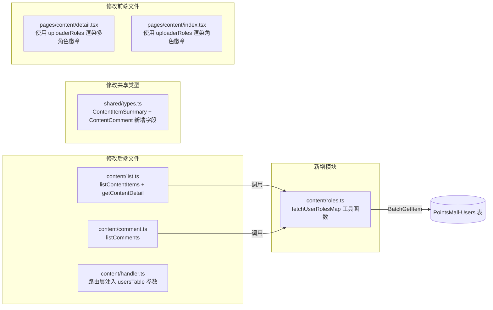

# 技术设计文档 - 内容实时角色显示（Content Live Roles）

## 概述（Overview）

当前内容中心在创建内容或评论时，将用户角色快照存储到 `uploaderRole` / `userRole` 字段。当用户角色变更后（如从 CommunityBuilder 变为 Speaker），页面仍显示旧角色。本功能改为在 API 查询时从 Users 表实时查找用户当前角色，确保角色徽章始终反映最新状态。

核心变更：
1. **新增共享工具函数** `fetchUserRolesMap`：批量从 Users 表查询用户当前角色，过滤 CommunityBuilder，支持去重和 >100 条自动分批
2. **修改 Content Detail API**：在返回内容详情时附加 `uploaderRoles` 字段（实时角色数组）
3. **修改 Content List API**：在返回内容列表时为每条记录附加 `uploaderRoles` 字段
4. **修改 Comment List API**：在返回评论列表时为每条评论附加 `userRoles` 字段
5. **修改前端详情页和列表页**：从新的数组字段渲染角色徽章，支持多角色显示
6. **扩展共享类型**：`ContentItemSummary` 新增 `uploaderRoles`，`ContentComment` 新增 `userRoles`

设计原则：
- 保持向后兼容：原有 `uploaderRole` / `userRole` 快照字段不变
- 使用 DynamoDB `BatchGetItem` 高效批量查询，仅投影 `userId` 和 `roles` 两个属性
- 工具函数可复用于未来任何需要批量查询用户角色的场景

---

## 架构（Architecture）

### 变更范围



### 架构决策

| 决策 | 选择 | 理由 |
|------|------|------|
| 角色查询时机 | API 查询时实时查找 | 避免维护角色变更同步机制，Users 表是角色的唯一权威来源 |
| 批量查询方式 | DynamoDB BatchGetItem | 单次请求获取多个用户角色，比逐个 GetItem 更高效 |
| 工具函数位置 | `packages/backend/src/content/roles.ts` | 与内容模块同目录，职责清晰，便于复用 |
| CommunityBuilder 过滤 | 在工具函数内统一过滤 | 集中处理，避免各调用方重复过滤逻辑 |
| 向后兼容 | 保留原有快照字段 | 旧客户端可继续使用 `uploaderRole` / `userRole`，新客户端使用数组字段 |
| 前端多角色显示 | 遍历数组渲染多个 `.role-badge` | 复用现有全局角色徽章样式，无需新增 CSS |

---

## 组件与接口（Components and Interfaces）

### 1. 角色查询工具函数（packages/backend/src/content/roles.ts）

#### 1.1 fetchUserRolesMap - 批量查询用户实时角色

```typescript
import { DynamoDBDocumentClient, BatchGetCommand } from '@aws-sdk/lib-dynamodb';
import type { UserRole } from '@points-mall/shared';

/** 被过滤的角色 */
const FILTERED_ROLES = ['CommunityBuilder'];

/**
 * 批量查询用户当前角色，返回 userId → roles 映射。
 * - 自动去重输入的 userIds
 * - 超过 100 个 userId 时自动分批（BatchGetItem 限制）
 * - 过滤掉 CommunityBuilder 角色
 * - 仅投影 userId 和 roles 属性
 * - 未找到的用户映射为空数组
 */
export async function fetchUserRolesMap(
  userIds: string[],
  dynamoClient: DynamoDBDocumentClient,
  usersTable: string,
): Promise<Map<string, string[]>>;
```

实现要点：
- 输入去重：`const uniqueIds = [...new Set(userIds)]`
- 空数组直接返回空 Map
- 分批：每批最多 100 个 key，使用 `BatchGetCommand`
- ProjectionExpression：仅查询 `userId` 和 `roles`
- 处理 `UnprocessedKeys`：如果有未处理的 key，重试查询
- 角色数组处理：兼容 `Set` 和 `Array` 类型（与现有 `admin/users.ts` 一致）
- 过滤：`roles.filter(r => !FILTERED_ROLES.includes(r))`
- 未找到的 userId：在结果 Map 中设为空数组

### 2. 修改 Content List（packages/backend/src/content/list.ts）

#### 2.1 listContentItems - 新增 uploaderRoles 字段

```typescript
// 修改 ListContentItemsResult 中的 items 类型
export interface ListContentItemsResult {
  success: boolean;
  items?: ContentItemSummary[];  // ContentItemSummary 新增 uploaderRoles 字段
  lastKey?: string;
}

// 函数签名新增 usersTable 参数
export async function listContentItems(
  options: ListContentItemsOptions,
  dynamoClient: DynamoDBDocumentClient,
  contentItemsTable: string,
  usersTable: string,           // 新增
): Promise<ListContentItemsResult>;
```

实现要点：
- 查询内容列表后，收集所有 `uploaderId`
- 调用 `fetchUserRolesMap` 批量查询角色
- 在构建 `ContentItemSummary` 时附加 `uploaderRoles` 字段

#### 2.2 getContentDetail - 新增 uploaderRoles 字段

```typescript
// 函数签名新增 usersTable 参数
export async function getContentDetail(
  contentId: string,
  userId: string | null,
  dynamoClient: DynamoDBDocumentClient,
  tables: {
    contentItemsTable: string;
    reservationsTable: string;
    likesTable: string;
    usersTable: string;          // 新增
  },
): Promise<GetContentDetailResult>;
```

实现要点：
- 获取内容详情后，调用 `fetchUserRolesMap([item.uploaderId], ...)` 查询上传者角色
- 在返回的 `ContentItem` 上附加 `uploaderRoles` 字段
- 可与现有的 reservation/like 并行查询合并为 `Promise.all`

### 3. 修改 Comment List（packages/backend/src/content/comment.ts）

#### 3.1 listComments - 新增 userRoles 字段

```typescript
// 函数签名新增 usersTable 参数
export async function listComments(
  options: ListCommentsOptions,
  dynamoClient: DynamoDBDocumentClient,
  commentsTable: string,
  usersTable: string,            // 新增
): Promise<ListCommentsResult>;
```

实现要点：
- 查询评论列表后，收集所有 `userId`
- 调用 `fetchUserRolesMap` 批量查询角色
- 在每条 `ContentComment` 上附加 `userRoles` 字段

### 4. 修改 Content Handler（packages/backend/src/content/handler.ts）

修改路由处理函数，将 `USERS_TABLE` 传递给 `listContentItems`、`getContentDetail`、`listComments`：

- `handleListContentItems`：传递 `USERS_TABLE` 给 `listContentItems`
- `handleGetContentDetail`：在 tables 对象中新增 `usersTable: USERS_TABLE`
- `handleListComments`：传递 `USERS_TABLE` 给 `listComments`

`USERS_TABLE` 环境变量已在 handler.ts 中定义，无需新增。

### 5. 前端修改

#### 5.1 内容详情页（packages/frontend/src/pages/content/detail.tsx）

- API 响应类型：`ContentItem` 新增可选 `uploaderRoles?: string[]`
- 上传者角色徽章渲染：从 `ROLE_CONFIG[item.uploaderRole]` 改为遍历 `item.uploaderRoles`
- 评论角色徽章渲染：从 `c.userRole` 改为遍历 `c.userRoles`
- 空数组时不渲染任何徽章

#### 5.2 内容列表页（packages/frontend/src/pages/content/index.tsx）

- `ContentItemSummary` 新增 `uploaderRoles` 字段
- 在内容卡片中渲染上传者角色徽章（当前列表页未显示角色，新增显示）

---

## 数据模型（Data Models）

### 现有表变更：无

本功能不修改任何 DynamoDB 表结构。所有变更在 API 层完成。

### 共享类型变更（packages/shared/src/types.ts）

#### ContentItemSummary 新增字段

```typescript
export interface ContentItemSummary {
  contentId: string;
  title: string;
  categoryName: string;
  uploaderNickname: string;
  uploaderRoles?: string[];      // 新增：上传者实时角色数组
  likeCount: number;
  commentCount: number;
  reservationCount: number;
  createdAt: string;
}
```

#### ContentComment 新增字段

```typescript
export interface ContentComment {
  commentId: string;
  contentId: string;
  userId: string;
  userNickname: string;
  userRole: string;              // 保留：向后兼容
  userRoles?: string[];          // 新增：评论者实时角色数组
  content: string;
  createdAt: string;
}
```

#### ContentItem 新增字段

```typescript
// 在 ContentItem 接口中新增（可选字段，API 层附加）
export interface ContentItem {
  // ... 现有字段 ...
  uploaderRoles?: string[];      // 新增：上传者实时角色数组
}
```

### Users 表查询模式

| 操作 | 表 | Key | 投影 |
|------|-----|-----|------|
| BatchGetItem | PointsMall-Users | `userId` (多个) | `userId`, `roles` |

---

## 正确性属性（Correctness Properties）

*属性（Property）是指在系统所有有效执行中都应成立的特征或行为——本质上是对系统应做什么的形式化陈述。属性是人类可读规范与机器可验证正确性保证之间的桥梁。*

### Property 1: 角色映射正确性（Role Mapping Correctness）

*对于任何*用户 ID 列表和 Users 表中的角色数据，`fetchUserRolesMap` 返回的映射中，每个存在于 Users 表的 userId 对应的角色数组应等于该用户在 Users 表中的 roles 字段去除 CommunityBuilder 后的结果；每个不存在于 Users 表的 userId 应映射为空数组。

**Validates: Requirements 1.1, 1.2, 1.3, 2.1, 2.4, 2.5, 3.1, 3.4, 3.5, 5.1, 5.4**

### Property 2: CommunityBuilder 过滤不变量（CommunityBuilder Exclusion Invariant）

*对于任何*包含 CommunityBuilder 的角色数组，经过 `fetchUserRolesMap` 处理后，返回的角色数组中绝不包含 CommunityBuilder，且所有非 CommunityBuilder 角色均被保留且顺序不变。

**Validates: Requirements 1.2, 2.4, 3.4**

### Property 3: 用户 ID 去重正确性（User ID Deduplication）

*对于任何*包含重复元素的用户 ID 列表，`fetchUserRolesMap` 向 DynamoDB 发送的 BatchGetItem 请求中的 key 集合应不包含重复项，且其大小等于输入列表中不同 userId 的数量。

**Validates: Requirements 2.2, 3.2, 5.2**

### Property 4: 批次分割正确性（Batch Chunking）

*对于任何*去重后超过 100 个 userId 的输入列表，`fetchUserRolesMap` 应将请求分割为多个 BatchGetItem 调用，每个调用的 key 数量不超过 100，且所有调用的 key 合集等于去重后的完整 userId 集合。

**Validates: Requirements 5.3**

---

## 错误处理（Error Handling）

### 无新增错误码

本功能不引入新的错误码。角色查询失败的处理策略：

| 场景 | 处理方式 |
|------|----------|
| 用户不存在于 Users 表 | 返回空角色数组 `[]`，不报错 |
| BatchGetItem 部分失败（UnprocessedKeys） | 自动重试未处理的 key |
| BatchGetItem 完全失败（网络/权限错误） | 向上抛出异常，由 handler 统一捕获返回 500 |
| Users 表中 roles 字段为空或格式异常 | 兼容处理：Set → Array，undefined → `[]` |

### 降级策略

如果角色查询失败，API 仍应返回内容数据，`uploaderRoles` / `userRoles` 字段设为空数组。前端在收到空数组时不显示角色徽章，用户体验降级但不阻塞核心功能。

---

## 测试策略（Testing Strategy）

### 双重测试方法

- **单元测试**：验证具体场景、边界条件和错误处理
- **属性测试**：验证工具函数在所有输入下的通用正确性

### 技术选型

| 类别 | 工具 |
|------|------|
| 测试框架 | Vitest（现有） |
| 属性测试库 | fast-check（现有） |

### 单元测试范围

- **content/roles.test.ts**（新增）：
  - 空 userId 列表返回空 Map
  - 单个 userId 查询返回正确角色
  - 多个 userId 批量查询返回正确映射
  - 不存在的 userId 映射为空数组
  - CommunityBuilder 被过滤
  - roles 字段为 Set 类型时正确转换为 Array
  - UnprocessedKeys 重试逻辑

- **content/list.test.ts**（修改）：
  - listContentItems 返回的每条记录包含 uploaderRoles
  - getContentDetail 返回的 item 包含 uploaderRoles
  - uploaderRole 快照字段保持不变

- **content/comment.test.ts**（修改）：
  - listComments 返回的每条评论包含 userRoles
  - userRole 快照字段保持不变

### 属性测试范围

**配置要求：**
- 每个属性测试最少运行 100 次迭代
- 标签格式：`Feature: content-live-roles, Property {number}: {property_text}`

| 属性编号 | 测试文件 | 测试描述 | 生成器 |
|----------|----------|----------|--------|
| Property 1 | content/roles.property.test.ts | 角色映射正确性 | 随机 userId 列表 + 随机角色数据（含/不含 CommunityBuilder） |
| Property 2 | content/roles.property.test.ts | CommunityBuilder 过滤不变量 | 随机角色数组（保证部分包含 CommunityBuilder） |
| Property 3 | content/roles.property.test.ts | 用户 ID 去重 | 随机 userId 列表（含重复元素） |
| Property 4 | content/roles.property.test.ts | 批次分割正确性 | 随机生成 1~300 个不同 userId |
