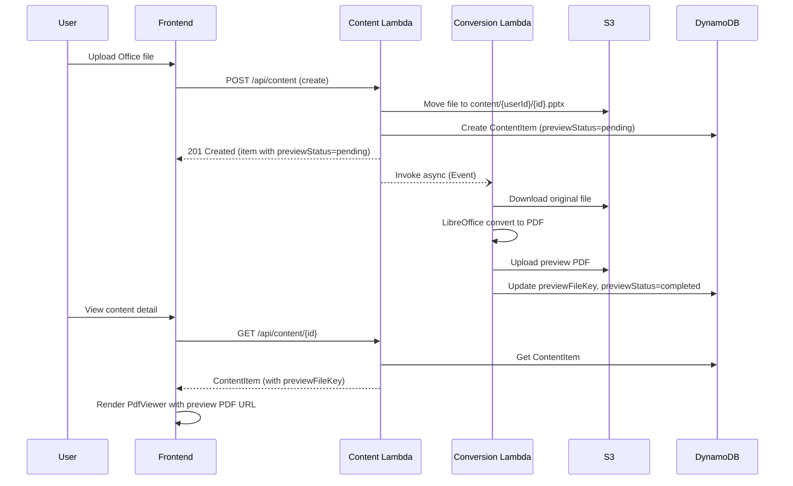
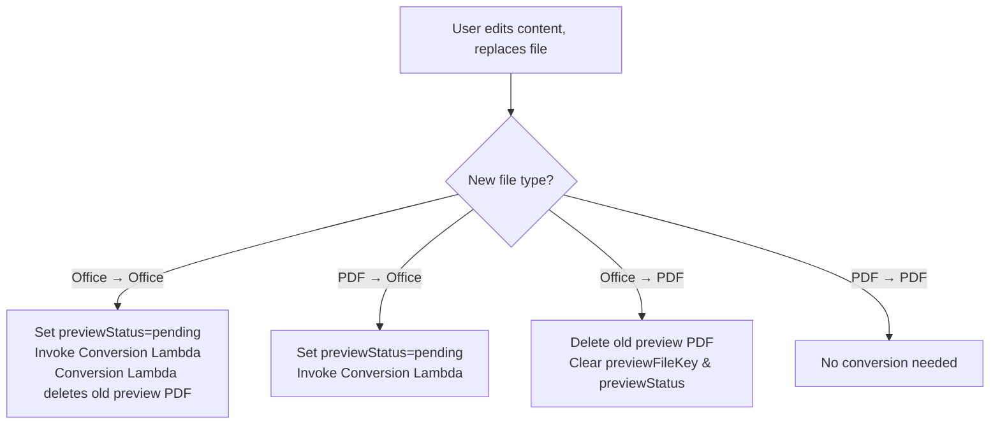

# Design Document: Content Preview PDF Conversion

## Overview

This feature adds automatic Office-to-PDF conversion for secure document preview in the Content Hub. When users upload Office files (PPT/PPTX/DOC/DOCX), a dedicated Docker-based Conversion Lambda (with LibreOffice) converts them to PDF. The frontend replaces the Microsoft Office Online Viewer iframe with the existing PdfViewer component (CDN-loaded pdf.js), providing a uniform, secure preview experience for all document types. Downloads continue to serve the original file.

### Key Design Decisions

1. **Separate Docker Lambda for conversion**: LibreOffice (~400MB) exceeds Lambda layer limits (250MB). A Docker-based Lambda (`DockerImageFunction`) packages LibreOffice in the container image, keeping the main Content Lambda lightweight.

2. **Asynchronous invocation**: The Content Lambda invokes the Conversion Lambda with `InvocationType: 'Event'` so content creation/edit responses are not blocked by conversion time (~10-60s).

3. **Preview status tracking**: A `previewStatus` field (`pending` | `completed` | `failed`) on ContentItem lets the frontend show appropriate UI states while conversion is in progress.

4. **PdfViewer for all documents**: Both native PDFs and converted Office files render through the same PdfViewer component, eliminating the Office Online Viewer iframe (which exposed download buttons and doesn't work in China).

5. **Original file preserved for download**: The Preview PDF is only for rendering; downloads always use the original `fileKey` to preserve full document fidelity.

## Architecture



### Component Interaction (Edit Flow)



## Components and Interfaces

### 1. Conversion Lambda (`packages/backend/src/conversion/`)

**Dockerfile** (`packages/backend/src/conversion/Dockerfile`):
- Base image: `public.ecr.aws/lambda/nodejs:20`
- Installs LibreOffice headless via `yum` (Amazon Linux 2023)
- Copies handler code

**Handler** (`packages/backend/src/conversion/handler.ts`):

```typescript
interface ConversionEvent {
  contentId: string;
  fileKey: string;           // S3 key of original file
  uploaderId: string;        // For constructing preview path
  bucket: string;            // S3 bucket name
  contentItemsTable: string; // DynamoDB table name
  oldPreviewFileKey?: string; // Previous preview PDF to delete (on re-conversion)
}
```

**Processing steps:**
1. Download original file from S3 to `/tmp/{contentId}/{originalFileName}`
2. Execute `libreoffice --headless --convert-to pdf --outdir /tmp/{contentId}/ /tmp/{contentId}/{originalFileName}`
3. Upload resulting PDF to S3 at `content/{uploaderId}/{fileId}_preview.pdf`
4. Update DynamoDB ContentItem: set `previewFileKey` and `previewStatus = 'completed'`
5. If `oldPreviewFileKey` is provided and differs from new key, delete old preview PDF from S3
6. On failure: set `previewStatus = 'failed'`, log error
7. Clean up `/tmp` files in all cases (finally block)

### 2. Content Upload Integration (`packages/backend/src/content/upload.ts`)

**Changes to `createContentItem`:**
- After creating the ContentItem in DynamoDB, check `isOfficeFile(fileName)`
- If Office file: set `previewStatus: 'pending'` on the item, invoke Conversion Lambda asynchronously
- If PDF file: no changes (no `previewStatus`, no `previewFileKey`)
- New dependency: `@aws-sdk/client-lambda` for `InvokeCommand`

```typescript
// New helper (in shared types)
function isOfficeFile(fileName: string): boolean {
  const ext = fileName.split('.').pop()?.toLowerCase() ?? '';
  return ['ppt', 'pptx', 'doc', 'docx'].includes(ext);
}
```

### 3. Content Edit Integration (`packages/backend/src/content/edit.ts`)

**Changes to `editContentItem`:**
- When `fileKey` changes, determine old and new file types
- Office → Office: set `previewStatus: 'pending'`, invoke Conversion Lambda with `oldPreviewFileKey`
- PDF → Office: set `previewStatus: 'pending'`, invoke Conversion Lambda
- Office → PDF: delete old preview PDF from S3 (best-effort), clear `previewFileKey` and `previewStatus` via REMOVE expression
- PDF → PDF: no conversion changes

### 4. Content Admin Deletion (`packages/backend/src/content/admin.ts`)

**Changes to `deleteContent`:**
- After fetching the ContentItem, check if `previewFileKey` is non-empty
- If so, delete the preview PDF from S3 (best-effort, log error but don't block)

### 5. CDK Infrastructure (`packages/cdk/lib/api-stack.ts`)

**New resources:**
- `DockerImageFunction` for Conversion Lambda:
  - Dockerfile path: `packages/backend/src/conversion/`
  - Timeout: 120 seconds
  - Memory: 1024 MB
  - Environment: `IMAGES_BUCKET`, `CONTENT_ITEMS_TABLE`
- IAM permissions:
  - Conversion Lambda: S3 read/write/delete on `content/*`, DynamoDB read/write on ContentItems table
  - Content Lambda: `lambda:InvokeFunction` on Conversion Lambda
  - Admin Lambda: S3 delete on `content/*` (already exists)
- Environment variable: `CONVERSION_FUNCTION_NAME` added to Content Lambda

### 6. Frontend Content Detail Page (`packages/frontend/src/pages/content/detail.tsx`)

**Changes:**
- Remove the Office Online Viewer iframe (`view.officeapps.live.com`)
- Import and use the existing `PdfViewer` component for all document previews
- Preview logic:
  - If `previewFileKey` exists → render PdfViewer with CloudFront URL of preview PDF
  - If file is PDF (no `previewFileKey`) → render PdfViewer with CloudFront URL of original PDF
  - If `previewStatus === 'pending'` → show loading indicator
  - If `previewStatus === 'failed'` → show error message
- Add i18n keys for preview status messages

## Data Models

### ContentItem Type Extension

```typescript
// Added to ContentItem interface in packages/shared/src/types.ts
interface ContentItem {
  // ... existing fields ...
  previewFileKey?: string;                          // S3 key of converted PDF preview
  previewStatus?: 'pending' | 'completed' | 'failed'; // Conversion status
}

// New type alias
type PreviewStatus = 'pending' | 'completed' | 'failed';

// New helper function
function isOfficeFile(fileName: string): boolean;
```

### S3 Storage Layout

```
s3://{bucket}/
  content/
    {uploaderId}/
      {fileId}.pptx          ← Original Office file (fileKey)
      {fileId}_preview.pdf    ← Converted PDF preview (previewFileKey)
      {fileId2}.pdf           ← Original PDF file (no preview needed)
```

### DynamoDB ContentItems Table

No schema changes required — `previewFileKey` and `previewStatus` are optional attributes added to existing items. DynamoDB's schemaless nature accommodates this without migration.

| Field | Type | When Set |
|-------|------|----------|
| `previewFileKey` | String (optional) | After successful conversion |
| `previewStatus` | String (optional) | `pending` on create/edit, `completed`/`failed` by Conversion Lambda |


## Correctness Properties

*A property is a characteristic or behavior that should hold true across all valid executions of a system — essentially, a formal statement about what the system should do. Properties serve as the bridge between human-readable specifications and machine-verifiable correctness guarantees.*

### Property 1: Office file detection correctly triggers conversion

*For any* file name string, `isOfficeFile` returns `true` if and only if the file extension (case-insensitive) is one of `ppt`, `pptx`, `doc`, or `docx`. When creating a ContentItem, conversion is triggered (previewStatus set to `pending`) if and only if `isOfficeFile(fileName)` returns `true`.

**Validates: Requirements 1.1, 1.6, 2.3, 2.4**

### Property 2: Preview PDF path follows the canonical format

*For any* valid uploaderId and fileId (extracted from the original fileKey), the generated preview file key SHALL match the pattern `content/{uploaderId}/{fileId}_preview.pdf`, where `{fileId}` is the original file's base name without extension.

**Validates: Requirements 1.3**

### Property 3: File type transition on edit determines correct conversion action

*For any* pair of (oldFileName, newFileName) where the file key has changed during an edit operation, the system SHALL:
- Trigger conversion (set `previewStatus: 'pending'`, invoke Conversion Lambda) when the new file is an Office file (regardless of old file type)
- Clear preview fields and delete old preview PDF when the old file was Office and the new file is PDF
- Take no conversion action when both old and new files are PDF

**Validates: Requirements 6.1, 6.3, 6.4**

### Property 4: Admin deletion cleans up preview PDF when present

*For any* ContentItem, when deleted by an admin: if `previewFileKey` is non-empty, both the original file and the preview PDF SHALL be deleted from S3; if `previewFileKey` is empty/undefined, only the original file SHALL be deleted.

**Validates: Requirements 7.1**

## Error Handling

### Conversion Lambda Errors

| Error Scenario | Handling | Impact |
|---|---|---|
| S3 download fails (original file missing) | Log error, set `previewStatus = 'failed'` | User sees "preview unavailable" message |
| LibreOffice conversion fails (corrupt file, unsupported format variant) | Log error with stderr output, set `previewStatus = 'failed'`, clean up `/tmp` | User sees "preview unavailable" message |
| S3 upload fails (preview PDF) | Log error, set `previewStatus = 'failed'`, clean up `/tmp` | User sees "preview unavailable" message |
| DynamoDB update fails (setting previewFileKey) | Log error; preview PDF exists in S3 but item not updated — orphaned file | User sees "pending" indefinitely; orphaned S3 file cleaned by lifecycle rule |
| `/tmp` disk space exhaustion | LibreOffice fails, caught by conversion failure handler | Set `previewStatus = 'failed'` |
| Lambda timeout (>120s for very large files) | Lambda runtime terminates, no status update | `previewStatus` remains `pending`; frontend shows loading state |

### Content Lambda Errors (Trigger)

| Error Scenario | Handling | Impact |
|---|---|---|
| Conversion Lambda invocation fails | Log error; ContentItem is created successfully with `previewStatus = 'pending'` | Preview stays in pending state; admin can re-trigger manually |
| `CONVERSION_FUNCTION_NAME` env var missing | Skip conversion invocation, log warning | No preview generated; original file still accessible |

### Frontend Error States

| State | Display |
|---|---|
| `previewStatus === 'pending'` | Loading spinner with "预览正在生成中，请稍候..." |
| `previewStatus === 'failed'` | Error message "预览生成失败，暂时无法预览此文档" |
| PdfViewer load error (CDN failure, corrupt PDF) | PdfViewer's built-in error state: "PDF 加载失败" |
| `previewFileKey` present but S3 file missing | PdfViewer shows load error (handled by existing component) |

### Cleanup Error Handling

- Preview PDF deletion on edit (Office → PDF transition): best-effort, log error, don't block edit operation
- Preview PDF deletion on admin delete: best-effort, log error, don't block content deletion
- Old preview PDF deletion by Conversion Lambda (re-conversion): best-effort, log error, don't block new preview creation

## Testing Strategy

### Unit Tests (Example-Based)

**Conversion Handler:**
- Test successful conversion flow with mocked S3 and child_process
- Test failure scenario sets `previewStatus = 'failed'`
- Test `/tmp` cleanup in both success and failure paths
- Test old preview PDF deletion when `oldPreviewFileKey` is provided

**Content Upload (Trigger):**
- Test Office file creation invokes Conversion Lambda
- Test PDF file creation does NOT invoke Conversion Lambda
- Test `previewStatus` is set to `pending` for Office files

**Content Edit (Trigger):**
- Test Office → Office re-conversion trigger
- Test Office → PDF clears preview fields and deletes old preview
- Test PDF → Office triggers conversion
- Test PDF → PDF takes no conversion action

**Admin Deletion (Cleanup):**
- Test deletion with `previewFileKey` deletes both files
- Test deletion without `previewFileKey` only deletes original
- Test preview PDF deletion failure doesn't block content deletion

**Frontend:**
- Test PdfViewer renders for items with `previewFileKey`
- Test PdfViewer renders for native PDF items
- Test loading indicator for `previewStatus === 'pending'`
- Test error message for `previewStatus === 'failed'`
- Test Office Online Viewer iframe is removed

### Property-Based Tests

Property-based testing applies to the pure logic functions in this feature. The PBT library used is [fast-check](https://github.com/dubzzz/fast-check) (already available in the project's test setup with vitest).

**Configuration:** Minimum 100 iterations per property test.

**Property 1: Office file detection** (Tag: `Feature: content-preview-pdf-conversion, Property 1: Office file detection correctly triggers conversion`)
- Generator: random strings for file names with random extensions
- Assertion: `isOfficeFile` returns true iff extension is in `{ppt, pptx, doc, docx}` (case-insensitive)

**Property 2: Preview path format** (Tag: `Feature: content-preview-pdf-conversion, Property 2: Preview PDF path follows canonical format`)
- Generator: random alphanumeric strings for uploaderId and fileId
- Assertion: constructed path matches `content/{uploaderId}/{fileId}_preview.pdf`

**Property 3: File type transition logic** (Tag: `Feature: content-preview-pdf-conversion, Property 3: File type transition on edit determines correct conversion action`)
- Generator: random pairs of file names with extensions drawn from `{pdf, ppt, pptx, doc, docx, txt, png}`
- Assertion: correct action (trigger conversion, clear preview, or no-op) based on old/new file types

**Property 4: Deletion cleanup** (Tag: `Feature: content-preview-pdf-conversion, Property 4: Admin deletion cleans up preview PDF when present`)
- Generator: random ContentItem objects with/without `previewFileKey`
- Assertion: preview PDF deletion is attempted iff `previewFileKey` is non-empty

### Integration Tests

- End-to-end conversion test with a real small Office file (requires Docker environment)
- CDK synth snapshot test to verify Conversion Lambda resource configuration (timeout, memory, IAM)

### What Is NOT Tested with PBT

- LibreOffice conversion quality (external tool — integration test)
- CDK infrastructure configuration (IaC — snapshot tests)
- Frontend rendering (UI — example-based tests)
- S3/DynamoDB interactions (external services — mock-based unit tests)
