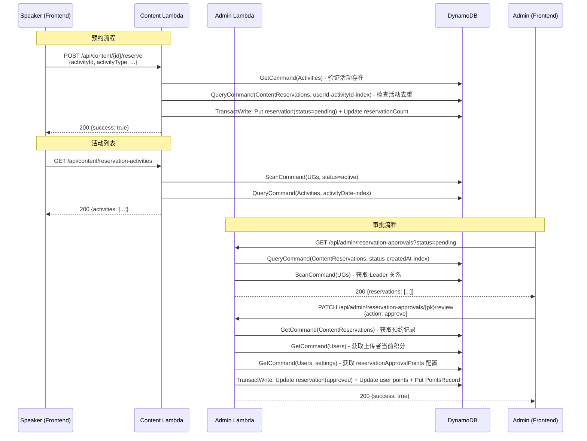

# 设计文档：内容预约活动审批（Content Reservation Approval）

## Overview

本功能将现有内容中心的"预约即发积分"模式改造为"预约 → 审批 → 发积分"模式。核心变更包括：

1. **预约流程改造**：Speaker 预约内容时必须选择一个真实活动（从 Activities 表中获取），预约创建后不再即时发放积分，而是创建 status=pending 的预约记录
2. **审批流程新增**：管理后台新增"活动预约审批"页面，Leader Admin 仅可见其负责 UG 的预约，SuperAdmin 可见全部，普通 Admin 可见无 Leader 的 UG 预约
3. **积分发放改造**：审批通过后原子性发放积分，积分记录包含完整活动信息（与批量发放格式一致）
4. **积分值可配置**：SuperAdmin 可在设置页面配置审批通过后的积分值，默认 10 分

### 设计决策

- **复用现有 ContentReservations 表**：在现有记录上新增字段（activityId、status 等），而非创建新表。pk 格式 `{userId}#{contentId}` 保持不变，确保向后兼容
- **活动快照存储**：预约记录中冗余存储活动信息（activityType、activityUG、activityTopic、activityDate），避免审批时需要跨表查询
- **新增 userId-activityId-index GSI**：用于检查同一 Speaker 是否已预约同一活动（跨内容去重）
- **复用 claims/review.ts 审批模式**：审批逻辑（approve/reject + TransactWriteCommand 原子操作）与积分申请审批保持一致
- **复用 batch-points.ts 积分记录格式**：审批通过后的积分记录包含 activityId、activityType 等字段，与批量发放记录格式一致
- **CDK 路由自动捕获**：API Gateway 使用 `{proxy+}` 模式，新增路由无需修改 CDK 路由配置，仅需确保 Lambda 环境变量和表权限

## Architecture



## Components and Interfaces

### Backend Components

#### 1. Reservation Service 改造 (`packages/backend/src/content/reservation.ts`)

**改造 `createReservation` 函数**：

```typescript
export interface CreateReservationInput {
  contentId: string;
  userId: string;
  activityId: string;        // 新增：关联活动 ID
  activityType: string;      // 新增：活动类型快照
  activityUG: string;        // 新增：所属 UG 名称快照
  activityTopic: string;     // 新增：活动主题快照
  activityDate: string;      // 新增：活动日期快照
}

export interface CreateReservationResult {
  success: boolean;
  alreadyReserved?: boolean;
  error?: { code: string; message: string };
}
```

**关键变更**：
- 移除 TransactWriteCommand 中的积分发放操作（步骤 c、d）
- 新增 activityId 存在性验证（查询 Activities 表）
- 新增 userId+activityId 去重检查（查询 userId-activityId-index GSI）
- 预约记录新增 status=pending 和活动快照字段
- 保留 pk=`{userId}#{contentId}` 的重复预约防护

#### 2. 预约审批服务（新增 `packages/backend/src/content/reservation-approval.ts`）

```typescript
export interface ReviewReservationInput {
  pk: string;                // 预约记录主键
  reviewerId: string;
  action: 'approve' | 'reject';
}

export interface ReviewReservationResult {
  success: boolean;
  error?: { code: string; message: string };
}

export async function reviewReservation(
  input: ReviewReservationInput,
  dynamoClient: DynamoDBDocumentClient,
  tables: {
    reservationsTable: string;
    contentItemsTable: string;
    usersTable: string;
    pointsRecordsTable: string;
  },
  rewardPoints: number,
): Promise<ReviewReservationResult>;

export interface ListReservationApprovalsOptions {
  status?: 'pending' | 'approved' | 'rejected';
  ugNames?: string[];       // Leader Admin 的 UG 名称列表
  pageSize?: number;
  lastKey?: string;
}

export interface ListReservationApprovalsResult {
  success: boolean;
  reservations?: ReservationApprovalItem[];
  lastKey?: string;
}

export interface ReservationApprovalItem {
  pk: string;
  userId: string;
  contentId: string;
  contentTitle: string;       // 从 ContentItems 表 join
  reserverNickname: string;   // 从 Users 表 join
  activityId: string;
  activityType: string;
  activityUG: string;
  activityTopic: string;
  activityDate: string;
  status: 'pending' | 'approved' | 'rejected';
  reviewerId?: string;
  reviewedAt?: string;
  createdAt: string;
}

export async function listReservationApprovals(
  options: ListReservationApprovalsOptions,
  dynamoClient: DynamoDBDocumentClient,
  tables: {
    reservationsTable: string;
    contentItemsTable: string;
    usersTable: string;
  },
): Promise<ListReservationApprovalsResult>;
```

**审批通过流程**（TransactWriteCommand 原子操作）：
1. Update ContentReservations: status=approved, reviewerId, reviewedAt
2. Update Users: points += reservationApprovalPoints
3. Put PointsRecords: 包含完整活动信息 + targetRole=Speaker

**审批拒绝流程**：
1. Update ContentReservations: status=rejected, reviewerId, reviewedAt

#### 3. 活动列表接口（新增路由 in `packages/backend/src/content/handler.ts`）

```typescript
// GET /api/content/reservation-activities
// 返回所有 active UG 关联的活动列表
// 1. 查询 UGs 表获取 active UG 名称列表
// 2. 查询 Activities 表，过滤 ugName in active UG names
// 3. 按 activityDate 倒序排列
// 4. 支持分页，默认 50 条
```

#### 4. Admin Handler 路由扩展 (`packages/backend/src/admin/handler.ts`)

新增路由：
- `GET /api/admin/reservation-approvals` → 查询预约审批列表
- `PATCH /api/admin/reservation-approvals/{pk}/review` → 审批预约

路由正则：
```typescript
const RESERVATION_APPROVAL_REVIEW_REGEX = /^\/api\/admin\/reservation-approvals\/([^/]+)\/review$/;
```

### Frontend Components

#### 1. Activity Selector 组件（内容详情页内嵌弹窗）

在内容详情页的预约按钮点击后弹出活动选择器弹窗：
- 调用 `GET /api/content/reservation-activities` 获取活动列表
- 显示活动类型徽章（线上/线下）、UG 名称、主题、日期
- 提供搜索框（模糊匹配 UG 名称、主题、日期）
- 选择活动后启用确认按钮，确认后调用 `POST /api/content/{id}/reserve`

#### 2. 预约审批管理页面 (`packages/frontend/src/pages/admin/reservation-approvals.tsx`)

复用 claims.tsx 的审批页面模式：
- 状态筛选标签（全部 / 待审批 / 已通过 / 已拒绝）
- 预约列表卡片（内容标题、预约人、活动信息、状态）
- 通过/拒绝操作按钮
- 分页加载

#### 3. 设置页面扩展

在 Settings 页面新增"预约审批积分值"配置项（SuperAdmin 可见）：
- 正整数输入框，默认值 10
- 存储在 feature-toggles 配置中的 `reservationApprovalPoints` 字段

### CDK Changes (`packages/cdk/lib/database-stack.ts`)

1. ContentReservations 表新增 GSI：
   - `status-createdAt-index`（PK=status, SK=createdAt）
   - `userId-activityId-index`（PK=userId, SK=activityId）

2. Lambda 环境变量和权限：
   - Admin Lambda 已有 CONTENT_RESERVATIONS_TABLE 环境变量
   - Content Lambda 需新增 ACTIVITIES_TABLE 和 UGS_TABLE 环境变量及读权限

## Data Models

### ContentReservation（改造后）

| 字段 | 类型 | 说明 |
|------|------|------|
| pk | string | 主键，格式 `{userId}#{contentId}` |
| userId | string | 预约人 ID |
| contentId | string | 内容 ID |
| activityId | string | 关联活动 ID（新增，必填） |
| activityType | string | 活动类型快照（新增） |
| activityUG | string | 所属 UG 名称快照（新增） |
| activityTopic | string | 活动主题快照（新增） |
| activityDate | string | 活动日期快照（新增） |
| status | string | 审批状态：pending / approved / rejected（新增，默认 pending） |
| reviewerId | string | 审批人 ID（新增，审批后填入） |
| reviewedAt | string | 审批时间 ISO 8601（新增，审批后填入） |
| createdAt | string | 创建时间 |

**GSI**：
- `status-createdAt-index`：PK=status, SK=createdAt（按状态查询审批列表）
- `userId-activityId-index`：PK=userId, SK=activityId（检查同一 Speaker 是否已预约同一活动）
- `contentId-index`：已有（按内容查询预约）

### PointsRecord（审批通过后创建）

| 字段 | 类型 | 说明 |
|------|------|------|
| recordId | string | ULID |
| userId | string | 内容上传者 ID |
| type | string | 固定 `earn` |
| amount | number | 配置的积分值 |
| source | string | `预约审批通过:{reservationPk}` |
| balanceAfter | number | 发放后余额 |
| createdAt | string | ISO 8601 |
| activityId | string | 关联活动 ID |
| activityType | string | 活动类型 |
| activityUG | string | 所属 UG |
| activityTopic | string | 活动主题 |
| activityDate | string | 活动日期 |
| targetRole | string | 固定 `Speaker` |

### Feature Toggles 扩展

在现有 feature-toggles 配置记录中新增字段：

| 字段 | 类型 | 默认值 | 说明 |
|------|------|--------|------|
| reservationApprovalPoints | number | 10 | 预约审批通过后发放的积分值 |


## Correctness Properties

*A property is a characteristic or behavior that should hold true across all valid executions of a system — essentially, a formal statement about what the system should do. Properties serve as the bridge between human-readable specifications and machine-verifiable correctness guarantees.*

### Property 1: Reservation creation produces correct record

*For any* valid reservation input (contentId, userId, activityId, activityType, activityUG, activityTopic, activityDate), the created reservation record SHALL contain all input fields, have status=pending, and have pk formatted as `{userId}#{contentId}`.

**Validates: Requirements 1.1, 1.2, 1.3, 3.1**

### Property 2: No points awarded on reservation creation

*For any* newly created reservation, the content uploader's points balance SHALL remain unchanged and no PointsRecord SHALL be created. Only the content's reservationCount SHALL increment by 1.

**Validates: Requirements 3.2**

### Property 3: User+content duplicate prevention

*For any* userId and contentId pair, attempting to create a second reservation SHALL return alreadyReserved=true without creating a duplicate record or incrementing reservationCount again.

**Validates: Requirements 3.3**

### Property 4: User+activity uniqueness constraint

*For any* userId and activityId pair, if a reservation already exists for that combination (regardless of contentId), a new reservation attempt SHALL return DUPLICATE_ACTIVITY_RESERVATION. Different userIds with the same activityId SHALL succeed independently, and the same userId with different activityIds SHALL succeed independently.

**Validates: Requirements 4.1, 4.2, 4.3, 4.4**

### Property 5: Visibility rules by role and UG assignment

*For any* set of reservation records and admin user: if the user is SuperAdmin, all reservations SHALL be visible; if the user is a Leader Admin, only reservations where activityUG matches one of their responsible UG names SHALL be visible; if the user is a non-Leader Admin, only reservations where activityUG matches a UG with no assigned leader SHALL be visible.

**Validates: Requirements 6.1, 6.2, 6.3**

### Property 6: Review state transition correctness

*For any* pending reservation and valid reviewer (Admin or SuperAdmin), approving SHALL set status=approved with reviewerId and reviewedAt, and rejecting SHALL set status=rejected with reviewerId and reviewedAt. The reviewedAt SHALL be a valid ISO 8601 timestamp.

**Validates: Requirements 7.2, 7.4**

### Property 7: Approval points award with complete activity record

*For any* approved reservation, the system SHALL atomically: (a) increase the content uploader's points by the configured reservationApprovalPoints value, (b) create a PointsRecord with type=earn, correct amount, source=`预约审批通过:{pk}`, balanceAfter matching the new balance, and all activity info fields (activityId, activityType, activityUG, activityTopic, activityDate) plus targetRole=Speaker. For any rejected reservation, no points SHALL be awarded and no PointsRecord SHALL be created.

**Validates: Requirements 7.3, 7.5, 8.1, 8.2, 8.3**

### Property 8: Already-reviewed guard

*For any* reservation with status other than pending (approved or rejected), attempting to review it SHALL return RESERVATION_ALREADY_REVIEWED error without modifying the record.

**Validates: Requirements 7.6**

### Property 9: Authorization guard for review

*For any* user without Admin or SuperAdmin role, attempting to review a reservation SHALL return FORBIDDEN error without modifying the record.

**Validates: Requirements 7.7**

### Property 10: Config round-trip persistence

*For any* valid positive integer value for reservationApprovalPoints, saving it via the settings API and then reading it back SHALL return the same value. If the config does not exist, the system SHALL use default value 10.

**Validates: Requirements 9.1, 9.2, 9.3, 9.5**

### Property 11: Activity list filtering and sorting

*For any* set of activities and UG records, the reservation-activities endpoint SHALL return only activities whose ugName matches an active UG, and the results SHALL be sorted by activityDate in descending order.

**Validates: Requirements 10.2, 10.3, 10.4**

### Property 12: Reservation input validation

*For any* reservation request missing activityId, the system SHALL return INVALID_REQUEST error. For any request with an activityId that does not exist in the Activities table, the system SHALL return ACTIVITY_NOT_FOUND error.

**Validates: Requirements 12.1, 12.3, 12.4, 12.5**

### Property 13: Activity selector search filtering

*For any* search query string and activity list, the filtered results SHALL only contain activities where the UG name, topic, or date contains the query as a case-insensitive substring.

**Validates: Requirements 2.4**

### Property 14: Status filter correctness

*For any* status filter value (pending, approved, rejected) and reservation list, the filtered results SHALL only contain reservations matching that status, and SHALL be sorted by createdAt in descending order.

**Validates: Requirements 5.3, 5.4**

## Error Handling

### 错误码定义

| 错误码 | HTTP 状态码 | 消息 | 触发场景 |
|--------|------------|------|----------|
| INVALID_REQUEST | 400 | activityId 为必填字段 | 预约请求缺少 activityId |
| ACTIVITY_NOT_FOUND | 404 | 关联活动不存在 | activityId 在 Activities 表中不存在 |
| CONTENT_NOT_FOUND | 404 | 内容不存在 | contentId 在 ContentItems 表中不存在 |
| DUPLICATE_ACTIVITY_RESERVATION | 409 | 您已预约过该活动 | 同一 Speaker 对同一 activityId 重复预约 |
| RESERVATION_ALREADY_REVIEWED | 409 | 该预约已被审批 | 尝试审批非 pending 状态的预约 |
| FORBIDDEN | 403 | 需要管理员权限 | 非 Admin/SuperAdmin 尝试审批 |
| PERMISSION_DENIED | 403 | 您没有预约内容的权限 | 用户角色无 canReserve 权限 |

### 错误处理策略

- **输入验证**：在业务逻辑执行前验证所有必填字段和格式
- **幂等性**：同一用户对同一内容的重复预约返回 `alreadyReserved: true`（非错误）
- **原子性**：审批通过的积分发放使用 TransactWriteCommand，确保状态更新和积分发放的原子性
- **乐观锁**：审批操作使用 ConditionExpression `status = :pending` 防止并发审批
- **向后兼容**：旧的预约记录（无 status 字段）在查询时视为 approved（已完成的历史预约）

### 新增 ErrorCodes 和 ErrorMessages

在 `packages/shared/src/types.ts` 的 ErrorCodes 和 ErrorMessages 中新增：
- `DUPLICATE_ACTIVITY_RESERVATION`
- `RESERVATION_ALREADY_REVIEWED`
- `ACTIVITY_NOT_FOUND`（如尚未存在）

## Testing Strategy

### Property-Based Tests（使用 fast-check）

每个 correctness property 对应一个 property-based test，最少 100 次迭代。测试文件：

- `packages/backend/src/content/reservation-approval.property.test.ts`：Properties 1-4, 6-9, 12
- `packages/backend/src/content/reservation-activities.property.test.ts`：Property 11
- `packages/backend/src/content/reservation-approval-visibility.property.test.ts`：Property 5
- `packages/backend/src/content/reservation-approval-filter.property.test.ts`：Property 14

每个 property test 使用 mock DynamoDB client，生成随机输入数据验证属性。

**Tag 格式**：`Feature: content-reservation-approval, Property {N}: {property_text}`

### Unit Tests（使用 vitest）

- `packages/backend/src/content/reservation.test.ts`：更新现有测试，覆盖新的预约创建逻辑
- `packages/backend/src/content/reservation-approval.test.ts`：审批逻辑的具体示例测试
- `packages/backend/src/content/handler.test.ts`：更新路由测试，覆盖新增路由

### Integration Points

- Admin handler 路由注册测试
- Content handler 新增路由测试
- CDK stack GSI 定义验证（snapshot test）

### 前端测试

- Activity selector 组件的搜索过滤逻辑（Property 13）
- 审批页面的状态筛选逻辑（Property 14）
