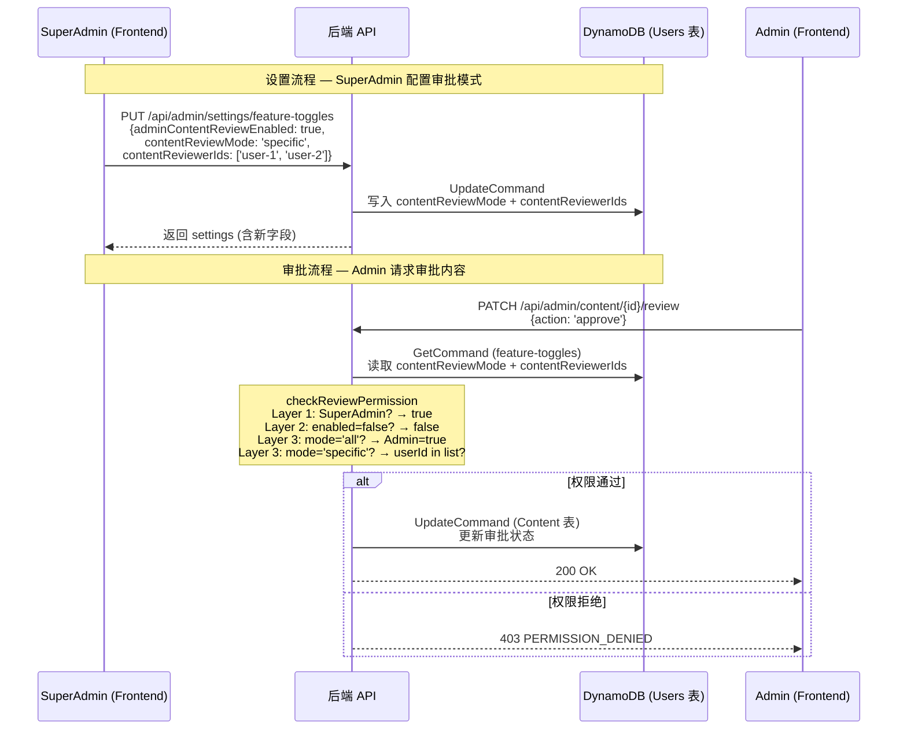

# 设计文档：内容审批权限精细化控制（Content Review Permissions）

## 概述

本功能在现有 `adminContentReviewEnabled` 布尔开关的基础上，增加一层精细化控制。当开关打开时，SuperAdmin 可以选择"所有 Admin"（`'all'`）或"指定 Admin"（`'specific'`）拥有内容审批权限。选择"指定 Admin"时，仅被勾选的 Admin 才能审批内容。SuperAdmin 始终拥有审批权限，不受此设置影响。

设计原则：
- **渐进式披露**：新增的 UI 控件仅在 `adminContentReviewEnabled` 开关打开时展示，关闭时完全隐藏
- **向后兼容**：所有现有记录（不含新字段）继续正常工作，缺失字段安全降级为默认值
- **最小侵入**：仅扩展现有 `FeatureToggles` 数据模型和 `checkReviewPermission` 函数，不改变现有逻辑流程
- **三层权限判断**：SuperAdmin → 开关检查 → 模式检查，层次清晰

## 架构

本功能涉及四个层次的变更，数据流如下：



变更范围：
1. **数据层**：`FeatureToggles` 接口新增 `contentReviewMode` 和 `contentReviewerIds` 字段
2. **后端权限层**：`checkReviewPermission` 函数扩展为三层+模式判断
3. **后端 API 层**：Admin Handler 传递新参数，Feature Toggles API 读写新字段
4. **前端 UI 层**：Settings 页面增加 Radio 选择和可搜索 Admin 勾选列表
5. **国际化层**：5 种语言的翻译键

## 组件与接口

### 1. 后端 — FeatureToggles 数据模型（`packages/backend/src/settings/feature-toggles.ts`）

**变更接口：**

- `FeatureToggles` 接口新增：
  - `contentReviewMode: 'all' | 'specific'` — 内容审批模式，默认 `'all'`
  - `contentReviewerIds: string[]` — 指定审批人 userId 列表，默认 `[]`

- `UpdateFeatureTogglesInput` 接口新增：
  - `contentReviewMode: 'all' | 'specific'`
  - `contentReviewerIds: string[]`

**变更函数：**

- `getFeatureToggles(dynamoClient, usersTable)` — 读取逻辑扩展：
  - `contentReviewMode`：若值为 `'all'` 或 `'specific'` 则使用，否则安全降级为 `'all'`
  - `contentReviewerIds`：若值为字符串数组则使用，否则安全降级为 `[]`

- `updateFeatureToggles(input, dynamoClient, usersTable)` — 更新逻辑扩展：
  - 验证 `contentReviewMode` 必须为 `'all'` 或 `'specific'`，否则返回 `INVALID_REQUEST`
  - 验证 `contentReviewerIds` 必须为字符串数组，否则返回 `INVALID_REQUEST`
  - UpdateExpression 增加 `contentReviewMode = :crm, contentReviewerIds = :cri`
  - 返回的 settings 对象包含新字段

- `DEFAULT_TOGGLES` 常量扩展：
  - `contentReviewMode: 'all'`
  - `contentReviewerIds: []`

### 2. 后端 — 审批权限检查（`packages/backend/src/content/content-permission.ts`）

**变更函数：**

- `checkReviewPermission(userRoles, adminContentReviewEnabled, userId?, contentReviewMode?, contentReviewerIds?)` — 扩展签名和逻辑：
  - 新增可选参数 `userId: string`、`contentReviewMode: 'all' | 'specific'`、`contentReviewerIds: string[]`
  - Layer 1（不变）：SuperAdmin → `true`
  - Layer 2（不变）：`adminContentReviewEnabled === false` → `false`
  - Layer 3（扩展）：
    - `contentReviewMode === 'all'`（或未传入）：Admin → `true`（与现有行为一致）
    - `contentReviewMode === 'specific'`：Admin 且 `userId` 在 `contentReviewerIds` 中 → `true`，否则 → `false`

### 3. 后端 — Admin Handler（`packages/backend/src/admin/handler.ts`）

**变更函数：**

- `handleReviewContent(contentId, event)` — 更新权限检查调用：
  - 从 `getFeatureToggles` 获取 `contentReviewMode` 和 `contentReviewerIds`
  - 调用 `checkReviewPermission` 时传入 `event.user.userId`、`toggles.contentReviewMode`、`toggles.contentReviewerIds`

- `handleUpdateFeatureToggles(event)` — 更新输入构造：
  - 从请求体中提取 `contentReviewMode` 和 `contentReviewerIds`
  - `contentReviewMode`：使用 `body.contentReviewMode`，默认 `'all'`
  - `contentReviewerIds`：使用 `body.contentReviewerIds`，默认 `[]`

### 4. 前端 — Settings 页面（`packages/frontend/src/pages/admin/settings.tsx`）

**变更内容：**

- **FeatureToggles 接口**：新增 `contentReviewMode: 'all' | 'specific'` 和 `contentReviewerIds: string[]`

- **审批模式 Radio 选择**：
  - 位置：`adminContentReviewEnabled` 开关下方的条件展开区域
  - 仅在 `adminContentReviewEnabled === true` 时显示
  - 两个选项："所有 Admin"（`'all'`）和"指定 Admin"（`'specific'`），默认 `'all'`
  - 切换时立即更新 `contentReviewMode` 并触发保存

- **可搜索 Admin 勾选列表**（Admin_Checklist）：
  - 仅在 `contentReviewMode === 'specific'` 时显示
  - 通过 `GET /api/admin/users?role=Admin` 获取 Admin 用户列表
  - 每行：勾选框 + 昵称 + 邮箱 + 角色徽章（使用全局 `.role-badge` 样式）
  - 顶部搜索框：按昵称或邮箱过滤
  - 底部计数："已选 N 人"
  - 根据 `contentReviewerIds` 预选已有审批人
  - 切换回"所有 Admin"时隐藏列表但保留 `contentReviewerIds` 数据

### 5. 前端 — i18n 翻译（`packages/frontend/src/i18n/{zh,en,ja,ko,zh-TW}.ts`）

**新增翻译键：**

| 键 | zh | en |
|---|---|---|
| `admin.settings.contentReviewModeLabel` | 审批模式 | Review Mode |
| `admin.settings.contentReviewModeAll` | 所有 Admin | All Admins |
| `admin.settings.contentReviewModeSpecific` | 指定 Admin | Specific Admins |
| `admin.settings.contentReviewSearchPlaceholder` | 搜索昵称或邮箱 | Search by nickname or email |
| `admin.settings.contentReviewSelectedCount` | 已选 {count} 人 | {count} selected |

其余 3 种语言（ja、ko、zh-TW）按相同结构翻译。

## 数据模型

### FeatureToggles 记录变更（DynamoDB Users 表，`userId='feature-toggles'`）

| 字段 | 类型 | 必填 | 默认值 | 说明 |
|------|------|------|--------|------|
| `contentReviewMode` | `'all' \| 'specific'` | 否 | `'all'` | 内容审批模式 |
| `contentReviewerIds` | `string[]` | 否 | `[]` | 指定审批人 userId 列表 |

现有字段不变：`adminContentReviewEnabled`、`adminCategoriesEnabled`、`contentRolePermissions` 等全部保留。

**DynamoDB 注意事项：**
- 不需要新增 GSI（新字段仅在读取 feature-toggles 记录时使用）
- 旧记录不含新字段，读取时安全降级为默认值
- `contentReviewerIds` 存储为 DynamoDB List 类型

### TypeScript 类型变更

```typescript
// packages/backend/src/settings/feature-toggles.ts

export interface FeatureToggles {
  // ... 现有字段 ...
  /** 内容审批模式：'all' = 所有 Admin，'specific' = 指定 Admin */
  contentReviewMode: 'all' | 'specific';
  /** 指定审批人 userId 列表，仅在 contentReviewMode 为 'specific' 时生效 */
  contentReviewerIds: string[];
}

export interface UpdateFeatureTogglesInput {
  // ... 现有字段 ...
  contentReviewMode: 'all' | 'specific';
  contentReviewerIds: string[];
}
```

```typescript
// packages/backend/src/content/content-permission.ts

export function checkReviewPermission(
  userRoles: string[],
  adminContentReviewEnabled: boolean,
  userId?: string,
  contentReviewMode?: 'all' | 'specific',
  contentReviewerIds?: string[],
): boolean;
```

### 权限判断决策表

| SuperAdmin? | adminContentReviewEnabled | contentReviewMode | userId in contentReviewerIds | 结果 |
|:-----------:|:------------------------:|:-----------------:|:---------------------------:|:----:|
| ✅ | 任意 | 任意 | 任意 | ✅ `true` |
| ❌ | `false` | 任意 | 任意 | ❌ `false` |
| ❌ (Admin) | `true` | `'all'` | 任意 | ✅ `true` |
| ❌ (Admin) | `true` | `'specific'` | ✅ 在列表中 | ✅ `true` |
| ❌ (Admin) | `true` | `'specific'` | ❌ 不在列表中 | ❌ `false` |
| ❌ (非 Admin) | `true` | 任意 | 任意 | ❌ `false` |

## 正确性属性

*正确性属性是一种在系统所有有效执行中都应成立的特征或行为——本质上是对系统应做什么的形式化陈述。属性是人类可读规范与机器可验证正确性保证之间的桥梁。*

### Property 1: SuperAdmin 始终拥有审批权限

*For any* `adminContentReviewEnabled` 布尔值、`contentReviewMode`（`'all'` 或 `'specific'`）和 `contentReviewerIds`（任意字符串数组），当用户角色包含 `SuperAdmin` 时，`checkReviewPermission` SHALL 返回 `true`。

**Validates: Requirements 3.1**

### Property 2: 开关关闭时模式和审批人列表被忽略

*For any* `contentReviewMode`（`'all'` 或 `'specific'`）和 `contentReviewerIds`（任意字符串数组），当 `adminContentReviewEnabled` 为 `false` 且用户角色不包含 `SuperAdmin` 时，`checkReviewPermission` SHALL 返回 `false`。

**Validates: Requirements 1.4, 3.2**

### Property 3: 审批模式权限检查正确性

*For any* Admin 用户（角色包含 `Admin` 但不包含 `SuperAdmin`）、`userId` 和 `contentReviewerIds`（任意字符串数组），当 `adminContentReviewEnabled` 为 `true` 时：
- 若 `contentReviewMode` 为 `'all'`，`checkReviewPermission` SHALL 返回 `true`
- 若 `contentReviewMode` 为 `'specific'` 且 `userId` 存在于 `contentReviewerIds` 中，SHALL 返回 `true`
- 若 `contentReviewMode` 为 `'specific'` 且 `userId` 不存在于 `contentReviewerIds` 中，SHALL 返回 `false`

**Validates: Requirements 3.3, 3.4, 3.5**

### Property 4: 无效 contentReviewMode 安全降级

*For any* 非 `'all'` 且非 `'specific'` 的值（包括 `undefined`、`null`、数字、随机字符串等），`getFeatureToggles` 读取后 SHALL 将 `contentReviewMode` 降级为 `'all'`；`updateFeatureToggles` 接收到无效值时 SHALL 返回 `INVALID_REQUEST` 错误。

**Validates: Requirements 2.3, 4.3**

### Property 5: 无效 contentReviewerIds 安全降级

*For any* 非字符串数组的值（包括 `undefined`、`null`、数字、对象、混合类型数组等），`getFeatureToggles` 读取后 SHALL 将 `contentReviewerIds` 降级为空数组 `[]`；`updateFeatureToggles` 接收到无效值时 SHALL 返回 `INVALID_REQUEST` 错误。

**Validates: Requirements 2.4, 4.4**

### Property 6: Feature Toggles 读写往返一致性

*For any* 有效的 `FeatureToggles` 对象（包含 `contentReviewMode` 和 `contentReviewerIds`），通过 `updateFeatureToggles` 写入后再通过 `getFeatureToggles` 读取，`contentReviewMode` 和 `contentReviewerIds` 的值 SHALL 与写入时一致。

**Validates: Requirements 2.5**

## 错误处理

### Feature Toggles 更新

- `contentReviewMode` 不是 `'all'` 或 `'specific'`：返回 `400 INVALID_REQUEST`
- `contentReviewerIds` 不是字符串数组：返回 `400 INVALID_REQUEST`
- `contentReviewMode` 为 `'specific'` 且 `contentReviewerIds` 为空数组：**允许**（此时无 Admin 可审批，仅 SuperAdmin 可审批）
- 非 SuperAdmin 调用更新接口：返回 `403 FORBIDDEN`（现有行为不变）

### Feature Toggles 读取

- `contentReviewMode` 字段缺失或无效：安全降级为 `'all'`，不报错
- `contentReviewerIds` 字段缺失或无效：安全降级为 `[]`，不报错
- DynamoDB 读取失败：返回 `DEFAULT_TOGGLES`（现有行为不变）

### 内容审批权限检查

- `checkReviewPermission` 返回 `false`：Admin Handler 返回 `403 PERMISSION_DENIED`
- `userId` 未传入（向后兼容旧调用方式）：在 `'specific'` 模式下视为不在列表中，返回 `false`

### 前端

- Admin 用户列表加载失败：显示错误提示，Admin_Checklist 显示空状态
- 搜索无结果：显示"无匹配结果"提示

## 测试策略

### 属性测试（Property-Based Testing）

使用 `fast-check` 库，每个属性测试最少运行 100 次迭代。

| 属性 | 测试文件 | 说明 |
|------|----------|------|
| Property 1 | `packages/backend/src/content/content-permission.property.test.ts` | SuperAdmin 始终返回 true |
| Property 2 | `packages/backend/src/content/content-permission.property.test.ts` | 开关关闭时忽略模式和审批人列表 |
| Property 3 | `packages/backend/src/content/content-permission.property.test.ts` | 审批模式权限检查正确性 |
| Property 4 | `packages/backend/src/settings/feature-toggles.test.ts` | 无效 contentReviewMode 安全降级 |
| Property 5 | `packages/backend/src/settings/feature-toggles.test.ts` | 无效 contentReviewerIds 安全降级 |
| Property 6 | `packages/backend/src/settings/feature-toggles.test.ts` | Feature Toggles 读写往返一致性 |

标签格式：`Feature: content-review-permissions, Property {N}: {property_text}`

### 单元测试（Example-Based）

| 测试文件 | 覆盖内容 |
|----------|----------|
| `packages/backend/src/settings/feature-toggles.test.ts` | 新字段默认值、向后兼容、更新验证、空数组边界 |
| `packages/backend/src/content/content-permission.test.ts` | 扩展现有测试，覆盖权限决策表中的所有场景 |
| `packages/backend/src/admin/handler.test.ts` | 验证 handleReviewContent 传递新参数、403 响应 |

### 前端测试

- Settings 页面：验证 Radio 选择的条件渲染和交互
- Admin_Checklist：验证搜索过滤、勾选交互、计数显示
- 渐进式披露：验证开关关闭时隐藏、模式切换时保留数据

### 向后兼容测试

- 使用不含 `contentReviewMode` 和 `contentReviewerIds` 字段的模拟数据，验证所有现有功能不受影响
- 验证旧的 `checkReviewPermission` 调用方式（仅传 `userRoles` 和 `adminContentReviewEnabled`）仍然正常工作
