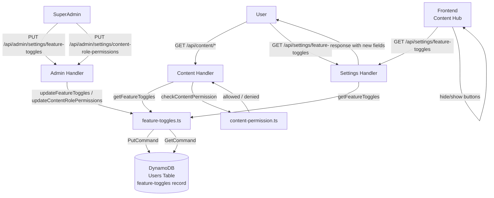

# 设计文档：内容角色权限设置（Content Role Settings）

## 概述

本功能在现有 feature-toggles 基础设施上扩展两类新配置：

1. **`adminContentReviewEnabled`**：控制 Admin 角色是否可以审批内容。默认 `false`，关闭时仅 SuperAdmin 可审批。
2. **`contentRolePermissions`**：3×4 权限矩阵，为 Speaker、UserGroupLeader、Volunteer 三个角色各自配置 canAccess、canUpload、canDownload、canReserve 四项权限。默认全部为 `true`。

两类配置均存储在 DynamoDB Users 表的 `feature-toggles` 记录中，与现有 feature-toggles 共用同一条记录。后端内容 API 在处理请求时读取配置并执行权限校验；前端内容中心在加载时读取配置并动态控制功能显示。

---

## 架构

### 数据流



### 三层权限逻辑

所有内容操作权限（canAccess、canUpload、canDownload、canReserve）均遵循同一套三层逻辑：

```
1. 用户拥有 SuperAdmin 角色 → 始终允许
2. 用户为 Pure_Admin（仅有 Admin，无任何 Content_Role）→ 始终拒绝
3. 用户拥有至少一个 Content_Role → 取所有匹配角色权限的并集
   （任一 Content_Role 的对应权限为 true 即允许）
```

Content_Role 定义为：`Speaker`、`UserGroupLeader`、`Volunteer`。

内容审批权限（`adminContentReviewEnabled`）逻辑略有不同：

```
1. 用户拥有 SuperAdmin 角色 → 始终允许
2. adminContentReviewEnabled = true → Admin 也允许
3. adminContentReviewEnabled = false → 仅 SuperAdmin 允许
```

---

## 组件与接口

### 后端组件

#### 1. `packages/backend/src/settings/feature-toggles.ts`（扩展）

**扩展 `FeatureToggles` 接口：**

```typescript
export interface RolePermissions {
  canAccess: boolean;
  canUpload: boolean;
  canDownload: boolean;
  canReserve: boolean;
}

export interface ContentRolePermissions {
  Speaker: RolePermissions;
  UserGroupLeader: RolePermissions;
  Volunteer: RolePermissions;
}

export interface FeatureToggles {
  // 现有字段（不变）
  codeRedemptionEnabled: boolean;
  pointsClaimEnabled: boolean;
  adminProductsEnabled: boolean;
  adminOrdersEnabled: boolean;
  // 新增字段
  adminContentReviewEnabled: boolean;
  adminCategoriesEnabled: boolean;
  contentRolePermissions: ContentRolePermissions;
}
```

**新增 `UpdateContentRolePermissionsInput` 接口：**

```typescript
export interface UpdateContentRolePermissionsInput {
  contentRolePermissions: ContentRolePermissions;
  updatedBy: string;
}

export interface UpdateContentRolePermissionsResult {
  success: boolean;
  contentRolePermissions?: ContentRolePermissions;
  error?: { code: string; message: string };
}
```

**默认值常量：**

```typescript
const DEFAULT_ROLE_PERMISSIONS: RolePermissions = {
  canAccess: true,
  canUpload: true,
  canDownload: true,
  canReserve: true,
};

const DEFAULT_CONTENT_ROLE_PERMISSIONS: ContentRolePermissions = {
  Speaker: { ...DEFAULT_ROLE_PERMISSIONS },
  UserGroupLeader: { ...DEFAULT_ROLE_PERMISSIONS },
  Volunteer: { ...DEFAULT_ROLE_PERMISSIONS },
};
```

**`getFeatureToggles` 扩展**：读取时对新字段做 safe-default 处理，缺失字段回退到默认值（`adminContentReviewEnabled` 默认 `false`，各权限默认 `true`）。

**新增 `updateContentRolePermissions` 函数**：独立于 `updateFeatureToggles`，使用 `UpdateCommand` 仅更新 `contentRolePermissions` 字段，避免覆盖其他 feature-toggle 字段。

#### 2. `packages/backend/src/content/content-permission.ts`（新文件）

核心权限校验工具函数，纯函数，无 I/O 依赖：

```typescript
export type ContentPermissionKey = 'canAccess' | 'canUpload' | 'canDownload' | 'canReserve';

const CONTENT_ROLES = ['Speaker', 'UserGroupLeader', 'Volunteer'] as const;

/**
 * 三层权限校验逻辑：
 * 1. SuperAdmin → 始终允许
 * 2. Pure_Admin（无 Content_Role）→ 始终拒绝
 * 3. 有 Content_Role → 取并集
 */
export function checkContentPermission(
  userRoles: string[],
  permission: ContentPermissionKey,
  featureToggles: FeatureToggles,
): boolean

/**
 * 计算用户的完整有效权限（四项权限的集合）
 */
export function computeEffectivePermissions(
  userRoles: string[],
  featureToggles: FeatureToggles,
): { canAccess: boolean; canUpload: boolean; canDownload: boolean; canReserve: boolean }

/**
 * 校验内容审批权限
 * 1. SuperAdmin → 始终允许
 * 2. adminContentReviewEnabled = true → Admin 也允许
 * 3. 否则 → 拒绝
 */
export function checkReviewPermission(
  userRoles: string[],
  adminContentReviewEnabled: boolean,
): boolean
```

#### 3. `packages/backend/src/admin/handler.ts`（扩展）

新增路由：

```
PUT /api/admin/settings/content-role-permissions  → handleUpdateContentRolePermissions
```

`handleUpdateContentRolePermissions` 逻辑：
- SuperAdmin 角色检查（非 SuperAdmin 返回 403 FORBIDDEN）
- 验证请求体包含三个角色各自的四项布尔值（共 12 个字段），任一非布尔值返回 400 INVALID_REQUEST
- 调用 `updateContentRolePermissions`
- 返回更新后的权限矩阵

`handleUpdateFeatureToggles` 扩展：
- 接受并传递 `adminContentReviewEnabled` 和 `adminCategoriesEnabled` 字段
- 验证两个新字段均为布尔值

分类管理路由保护（`handleCreateCategory`、`handleUpdateCategory`、`handleDeleteCategory`）：
- 在每个处理函数入口调用 `getFeatureToggles`，读取 `adminCategoriesEnabled`
- 若 `adminCategoriesEnabled` 为 false 且请求者不是 SuperAdmin，返回 403 FORBIDDEN 和消息"需要超级管理员权限才能管理分类"
- SuperAdmin 始终放行

#### 4. `packages/backend/src/content/handler.ts`（扩展）

在以下路由处理函数中注入权限校验：

| 路由 | 权限检查 |
|------|---------|
| `GET /api/content` | `checkContentPermission(roles, 'canAccess', toggles)` |
| `GET /api/content/:id` | `checkContentPermission(roles, 'canAccess', toggles)` |
| `POST /api/content` | `checkContentPermission(roles, 'canUpload', toggles)` |
| `POST /api/content/upload-url` | `checkContentPermission(roles, 'canUpload', toggles)` |
| `GET /api/content/:id/download` | `checkContentPermission(roles, 'canDownload', toggles)` |
| `POST /api/content/:id/reserve` | `checkContentPermission(roles, 'canReserve', toggles)` |

在 `PATCH /api/admin/content/:id/review`（admin handler）中注入：
- `checkReviewPermission(roles, toggles.adminContentReviewEnabled)`

权限拒绝时统一返回：
```json
{ "code": "PERMISSION_DENIED", "message": "您没有[操作]内容的权限" }
```
HTTP 状态码 403。

### 前端组件

#### 5. `packages/frontend/src/pages/admin/settings.tsx`（扩展）

新增两个 SuperAdmin 专属区块（`{isSuperAdmin && (...)}` 条件渲染）：

**区块一：内容审批权限**
- 使用现有 `toggle-item` 样式
- 开关绑定 `adminContentReviewEnabled`
- 切换时调用 `PUT /api/admin/settings/feature-toggles`（与现有 `handleToggle` 逻辑相同，扩展 payload 包含 `adminContentReviewEnabled`）

**区块二：内容角色权限**
- 3×4 矩阵布局，使用新增 CSS 类 `.permissions-matrix`
- 每个单元格为一个 Switch 控件
- 切换任意开关时调用 `PUT /api/admin/settings/content-role-permissions`，提交完整矩阵
- 失败时回滚到更新前状态

#### 6. `packages/frontend/src/pages/content/index.tsx`（扩展）

- 页面加载时调用 `GET /api/settings/feature-toggles` 获取权限配置
- 调用 `computeEffectivePermissions(userRoles, featureToggles)` 计算有效权限
- 根据 `canAccess` 决定是否显示无权限页面
- 根据 `canUpload` 决定是否显示上传按钮

#### 7. `packages/frontend/src/pages/content/detail.tsx`（扩展）

- 从父页面或重新请求获取权限配置
- 根据 `canDownload` 决定是否显示下载按钮
- 根据 `canReserve` 决定是否显示预约按钮
- 两者独立判断，互不影响

---

## 数据模型

### DynamoDB 记录结构（扩展后）

```json
{
  "userId": "feature-toggles",
  "codeRedemptionEnabled": false,
  "pointsClaimEnabled": false,
  "adminProductsEnabled": true,
  "adminOrdersEnabled": true,
  "adminContentReviewEnabled": false,
  "adminCategoriesEnabled": false,
  "contentRolePermissions": {
    "Speaker": {
      "canAccess": true,
      "canUpload": true,
      "canDownload": true,
      "canReserve": true
    },
    "UserGroupLeader": {
      "canAccess": true,
      "canUpload": true,
      "canDownload": true,
      "canReserve": true
    },
    "Volunteer": {
      "canAccess": true,
      "canUpload": true,
      "canDownload": true,
      "canReserve": true
    }
  },
  "updatedAt": "2025-01-01T00:00:00.000Z",
  "updatedBy": "user-id"
}
```

### 前端状态类型（扩展）

```typescript
// settings.tsx 中扩展 FeatureToggles 接口
interface RolePermissions {
  canAccess: boolean;
  canUpload: boolean;
  canDownload: boolean;
  canReserve: boolean;
}

interface ContentRolePermissions {
  Speaker: RolePermissions;
  UserGroupLeader: RolePermissions;
  Volunteer: RolePermissions;
}

interface FeatureToggles {
  codeRedemptionEnabled: boolean;
  pointsClaimEnabled: boolean;
  adminProductsEnabled: boolean;
  adminOrdersEnabled: boolean;
  adminContentReviewEnabled: boolean;
  adminCategoriesEnabled: boolean;
  contentRolePermissions: ContentRolePermissions;
}
```

### i18n 新增键（TranslationDict 扩展）

在 `admin.settings` 命名空间下新增：

```typescript
// admin.settings 新增键
adminContentReviewLabel: string;       // "Admin 内容审批"
adminContentReviewDesc: string;        // "允许 Admin 审批内容（通过/拒绝）..."
contentRolePermissionsTitle: string;   // "内容角色权限"
contentRolePermissionsDesc: string;    // "为各角色配置内容中心操作权限"
permissionCanAccess: string;           // "访问权限"
permissionCanUpload: string;           // "上传权限"
permissionCanDownload: string;         // "下载权限"
permissionCanReserve: string;          // "预约权限"
roleSpeaker: string;                   // "Speaker"
roleUserGroupLeader: string;           // "Leader"
roleVolunteer: string;                 // "Volunteer"
```

在 `contentHub` 命名空间下新增：

```typescript
// contentHub 新增键
noAccessTitle: string;     // "暂无访问权限"
noAccessDesc: string;      // "您当前没有访问内容中心的权限"
noAccessBack: string;      // "返回"
```

---

## 正确性属性

*属性（Property）是在系统所有有效执行中都应成立的特征或行为——本质上是对系统应做什么的形式化陈述。属性是人类可读规范与机器可验证正确性保证之间的桥梁。*

### 属性 1：getFeatureToggles 始终返回完整的新字段

*对于任意* DynamoDB 记录状态（记录不存在、字段缺失、字段部分存在、字段完整存在），`getFeatureToggles` 的返回值中 `adminContentReviewEnabled` 始终为布尔值，`contentRolePermissions` 始终包含 Speaker、UserGroupLeader、Volunteer 三个角色各自的四项布尔权限。

**验证：需求 1.1、1.2、1.3、2.1、2.2、2.3、2.4、3.1、3.2、3.3**

### 属性 2：adminContentReviewEnabled 写入读取往返

*对于任意* 布尔值 `v`，调用 `updateFeatureToggles({ adminContentReviewEnabled: v, ... })` 后再调用 `getFeatureToggles`，返回的 `adminContentReviewEnabled` 应等于 `v`。

**验证：需求 1.4、4.1、4.3**

### 属性 3：contentRolePermissions 写入读取往返

*对于任意* 合法的 `ContentRolePermissions` 对象（12 个布尔值的任意组合），调用 `updateContentRolePermissions` 后再调用 `getFeatureToggles`，返回的 `contentRolePermissions` 应与写入值完全一致。

**验证：需求 2.5、5.5**

### 属性 4：contentRolePermissions 更新幂等性

*对于任意* 合法的 `ContentRolePermissions` 对象，连续调用 `updateContentRolePermissions` 两次（相同输入），第二次调用后读取的状态与第一次调用后读取的状态相同。

**验证：需求 5.6**

### 属性 5：checkContentPermission 三层逻辑正确性

*对于任意* 用户角色集合 `roles`、权限键 `permission`（canAccess/canUpload/canDownload/canReserve）和 `featureToggles`，`checkContentPermission` 的返回值满足：
- 若 `roles` 包含 `SuperAdmin` → 返回 `true`
- 若 `roles` 不包含任何 Content_Role（Speaker/UserGroupLeader/Volunteer）→ 返回 `false`
- 否则 → 返回值等于 `roles` 中所有 Content_Role 对应权限值的逻辑或（OR）

**验证：需求 6.1–6.6、7.1–7.6、8.1–8.7、9.1–9.7**

### 属性 6：checkReviewPermission 审批权限逻辑正确性

*对于任意* 用户角色集合 `roles` 和布尔值 `adminContentReviewEnabled`，`checkReviewPermission` 的返回值满足：
- 若 `roles` 包含 `SuperAdmin` → 返回 `true`
- 若 `adminContentReviewEnabled` 为 `true` 且 `roles` 包含 `Admin` → 返回 `true`
- 否则 → 返回 `false`

**验证：需求 10.1–10.4**

### 属性 7：非 SuperAdmin 调用 content-role-permissions 接口被拒绝

*对于任意* 不包含 `SuperAdmin` 角色的用户，调用 `PUT /api/admin/settings/content-role-permissions` 应返回 403 FORBIDDEN。

**验证：需求 5.1、5.2**

### 属性 8：非布尔值权限字段被拒绝

*对于任意* 包含至少一个非布尔值权限字段的请求体，调用 `PUT /api/admin/settings/content-role-permissions` 应返回 400 INVALID_REQUEST。

**验证：需求 5.4**

### 属性 9：computeEffectivePermissions 与 checkContentPermission 一致性

*对于任意* 用户角色集合和 `featureToggles`，`computeEffectivePermissions` 返回的四项权限值，应与分别调用 `checkContentPermission` 四次（每次传入不同的 `permission` 键）的结果完全一致。

**验证：需求 13.1–13.9**

---

## 错误处理

### 后端错误码

| 场景 | 错误码 | HTTP 状态 | 消息 |
|------|--------|-----------|------|
| 非 SuperAdmin 调用 content-role-permissions | `FORBIDDEN` | 403 | 需要超级管理员权限 |
| 权限矩阵字段缺失或非布尔值 | `INVALID_REQUEST` | 400 | 请求参数无效 |
| 分类管理权限校验失败（adminCategoriesEnabled=false） | `FORBIDDEN` | 403 | 需要超级管理员权限才能管理分类 |
| canAccess 校验失败 | `PERMISSION_DENIED` | 403 | 您没有访问内容中心的权限 |
| canUpload 校验失败 | `PERMISSION_DENIED` | 403 | 您没有上传内容的权限 |
| canDownload 校验失败 | `PERMISSION_DENIED` | 403 | 您没有下载内容的权限 |
| canReserve 校验失败 | `PERMISSION_DENIED` | 403 | 您没有预约内容的权限 |
| 审批权限校验失败 | `PERMISSION_DENIED` | 403 | 需要超级管理员权限才能审批内容 |
| DynamoDB 读取失败 | 降级为默认值（不抛错） | — | — |

### 前端错误处理

- **权限加载失败**：降级为最保守策略（隐藏所有受限功能按钮，不显示无权限页面），避免因网络错误误拦截用户。
- **设置更新失败**：显示 toast 错误提示，回滚开关状态到更新前的值（与现有 `handleToggle` 模式一致）。
- **canAccess 为 false**：显示无权限提示页面，提供返回按钮。

---

## 测试策略

### 单元测试（示例测试）

- `feature-toggles.ts`：验证 `getFeatureToggles` 在记录不存在时返回正确默认值
- `feature-toggles.ts`：验证 `updateContentRolePermissions` 调用 `UpdateCommand` 而非 `PutCommand`（避免覆盖其他字段）
- `content-permission.ts`：验证 SuperAdmin 对所有权限键均返回 `true`
- `content-permission.ts`：验证 Pure_Admin 对所有权限键均返回 `false`
- `admin/handler.ts`：验证 `PUT /api/admin/settings/content-role-permissions` 对非 SuperAdmin 返回 403
- `admin/handler.ts`：验证 `PUT /api/admin/settings/feature-toggles` 接受 `adminContentReviewEnabled` 字段

### 属性测试（Property-Based Tests）

使用 `fast-check` 库，每个属性测试运行至少 100 次迭代。

**`content-permission.property.test.ts`**：

```typescript
// Feature: content-role-settings, Property 5: checkContentPermission 三层逻辑正确性
fc.assert(fc.property(
  fc.array(fc.constantFrom('SuperAdmin', 'Admin', 'Speaker', 'UserGroupLeader', 'Volunteer')),
  fc.constantFrom('canAccess', 'canUpload', 'canDownload', 'canReserve'),
  arbitraryFeatureToggles(),
  (roles, permission, toggles) => {
    const result = checkContentPermission(roles, permission, toggles);
    if (roles.includes('SuperAdmin')) return result === true;
    const contentRoles = roles.filter(r => ['Speaker', 'UserGroupLeader', 'Volunteer'].includes(r));
    if (contentRoles.length === 0) return result === false;
    const expected = contentRoles.some(r => toggles.contentRolePermissions[r][permission]);
    return result === expected;
  }
));

// Feature: content-role-settings, Property 6: checkReviewPermission 审批权限逻辑正确性
fc.assert(fc.property(
  fc.array(fc.constantFrom('SuperAdmin', 'Admin', 'Speaker', 'UserGroupLeader', 'Volunteer')),
  fc.boolean(),
  (roles, adminContentReviewEnabled) => {
    const result = checkReviewPermission(roles, adminContentReviewEnabled);
    if (roles.includes('SuperAdmin')) return result === true;
    if (adminContentReviewEnabled && roles.includes('Admin')) return result === true;
    return result === false;
  }
));
```

**`feature-toggles.property.test.ts`**（新增测试用例）：

```typescript
// Feature: content-role-settings, Property 1: getFeatureToggles 始终返回完整的新字段
// Feature: content-role-settings, Property 2: adminContentReviewEnabled 写入读取往返
// Feature: content-role-settings, Property 3: contentRolePermissions 写入读取往返
// Feature: content-role-settings, Property 4: contentRolePermissions 更新幂等性
```

**`content-permission.property.test.ts`**（新增测试用例）：

```typescript
// Feature: content-role-settings, Property 9: computeEffectivePermissions 与 checkContentPermission 一致性
```

### 集成测试

- 验证 `GET /api/settings/feature-toggles` 响应包含 `adminContentReviewEnabled` 和 `contentRolePermissions` 字段
- 验证内容 API 在权限被拒绝时返回正确的 403 响应
- 验证 `PUT /api/admin/settings/content-role-permissions` 端到端写入和读取
