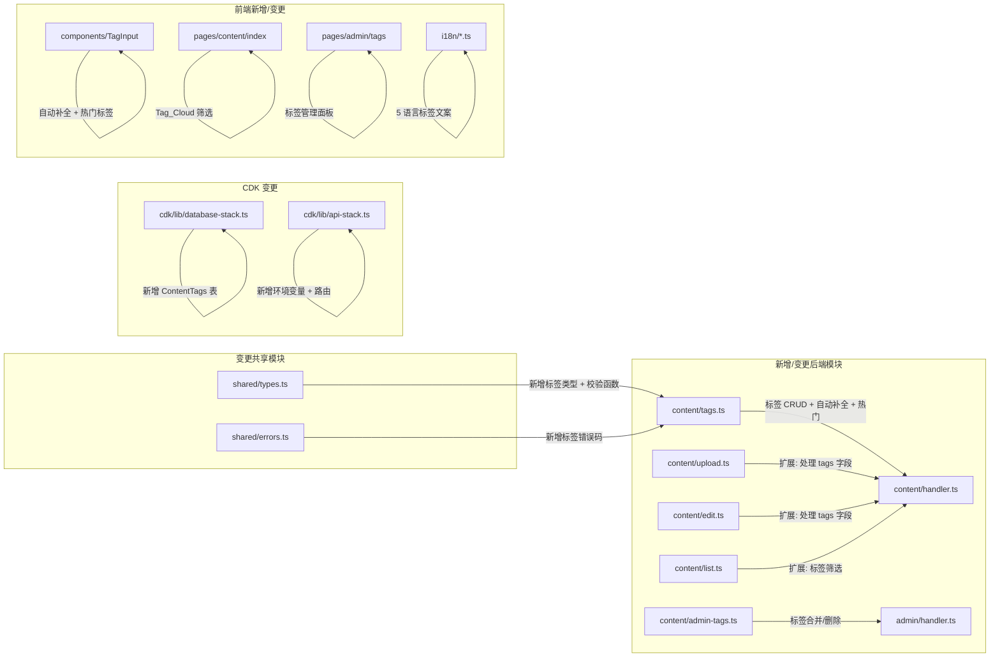

# 技术设计文档 - 内容标签系统（Content Tags）

## 概述（Overview）

本设计为内容中心（Content Hub）新增用户创建的标签系统，与现有 SuperAdmin 管理的分类体系互补。核心变更包括：

1. **新增 1 张 DynamoDB 表**：ContentTags（存储唯一标签记录，含 usageCount）
2. **ContentItems 表扩展**：新增 `tags` 字符串数组字段（0~5 个标签名）
3. **Content Handler 路由扩展**：新增标签自动补全、热门标签 API
4. **Admin Handler 路由扩展**：新增标签管理（合并、删除）路由
5. **共享校验函数**：新增 `validateTagName`、`normalizeTagName`、`validateTagsArray` 到 `packages/shared/src/types.ts`
6. **前端新增组件**：Tag_Input_Component（自动补全输入）、Tag_Cloud（标签云筛选）、Tag_Management_Panel（管理端）
7. **CDK 配置**：新增 ContentTags 表定义、环境变量传递
8. **i18n 扩展**：5 种语言新增标签相关 UI 文案

设计目标：
- 复用现有架构模式（Handler 路由分发、auth-middleware、DynamoDB Query + 分页、ErrorCodes 体系）
- 标签名存储前统一 trim + 小写化，保证一致性
- 标签 usageCount 通过原子操作（UpdateCommand ADD）维护，避免并发不一致
- 向后兼容：无 `tags` 字段的旧内容在读取时默认为空数组，无需数据迁移

---

## 架构（Architecture）

### 变更范围



### 架构决策

| 决策 | 选择 | 理由 |
|------|------|------|
| 标签存储 | 独立 ContentTags 表 + ContentItems.tags 数组 | ContentTags 表维护全局唯一标签和 usageCount，ContentItems.tags 数组支持快速读取和筛选 |
| 标签名规范化 | trim + toLowerCase | 避免 "React" 和 "react" 被视为不同标签，保证一致性 |
| 自动补全查询 | ContentTags 表 Scan + FilterExpression begins_with | 标签总量预计 < 1000，Scan 性能可接受；避免引入 GSI 复杂度 |
| 热门标签 | ContentTags 表 Scan + 客户端排序取 Top 10 | 数据量小，Scan 后排序即可；无需维护额外索引 |
| 标签筛选 | ContentItems 表 Scan + FilterExpression contains(tags, tagName) | DynamoDB 不支持数组元素索引；数据量可控时 Scan + Filter 是最简方案 |
| usageCount 维护 | UpdateCommand ADD 原子操作 | 避免 read-modify-write 竞态条件 |
| 标签合并 | Scan 全表 + BatchWrite 更新 | 合并操作低频（SuperAdmin 手动触发），全表扫描可接受 |
| 向后兼容 | 读取时 `item.tags ?? []` | 无需数据迁移，旧记录自动兼容 |

---

## 组件与接口（Components and Interfaces）

### 1. 标签模块（packages/backend/src/content/tags.ts）

#### 1.1 searchTags - 标签自动补全搜索

```typescript
interface SearchTagsOptions {
  prefix: string;
  limit?: number; // 默认 10，最大 10
}

interface SearchTagsResult {
  success: boolean;
  tags?: TagRecord[];
}

export async function searchTags(
  options: SearchTagsOptions,
  dynamoClient: DynamoDBDocumentClient,
  contentTagsTable: string,
): Promise<SearchTagsResult>;
```

实现要点：
- prefix 长度 < 1 时返回空数组
- 对 prefix 执行 normalizeTagName 后进行匹配
- Scan ContentTags 表，FilterExpression `begins_with(tagName, :prefix)`
- 按 usageCount 降序排序，取前 limit 条（默认 10）

#### 1.2 getHotTags - 获取热门标签

```typescript
interface GetHotTagsResult {
  success: boolean;
  tags?: TagRecord[];
}

export async function getHotTags(
  dynamoClient: DynamoDBDocumentClient,
  contentTagsTable: string,
): Promise<GetHotTagsResult>;
```

实现要点：
- Scan ContentTags 表全量数据
- 按 usageCount 降序排序，取前 10 条
- 不足 10 条时返回全部

#### 1.3 syncTagsOnCreate - 内容创建时同步标签

```typescript
export async function syncTagsOnCreate(
  tags: string[],
  dynamoClient: DynamoDBDocumentClient,
  contentTagsTable: string,
): Promise<void>;
```

实现要点：
- 对每个标签名执行 normalizeTagName
- 对每个标签：尝试 GetCommand 查询是否存在
  - 不存在：PutCommand 创建新 TagRecord（usageCount=1）
  - 已存在：UpdateCommand `ADD usageCount :one` 原子递增

#### 1.4 syncTagsOnEdit - 内容编辑时同步标签

```typescript
export async function syncTagsOnEdit(
  oldTags: string[],
  newTags: string[],
  dynamoClient: DynamoDBDocumentClient,
  contentTagsTable: string,
): Promise<void>;
```

实现要点：
- 计算 removedTags = oldTags - newTags，addedTags = newTags - oldTags
- removedTags：UpdateCommand `ADD usageCount :minusOne`（SET usageCount = usageCount - 1，最小为 0）
- addedTags：同 syncTagsOnCreate 逻辑

#### 1.5 getTagCloudTags - 获取标签云标签

```typescript
interface GetTagCloudResult {
  success: boolean;
  tags?: TagRecord[];
}

export async function getTagCloudTags(
  dynamoClient: DynamoDBDocumentClient,
  contentTagsTable: string,
): Promise<GetTagCloudResult>;
```

实现要点：
- Scan ContentTags 表全量数据
- 按 usageCount 降序排序，取前 20 条

### 2. 标签管理模块（packages/backend/src/content/admin-tags.ts）

#### 2.1 listAllTags - 列出所有标签（管理端）

```typescript
interface ListAllTagsResult {
  success: boolean;
  tags?: TagRecord[];
}

export async function listAllTags(
  dynamoClient: DynamoDBDocumentClient,
  contentTagsTable: string,
): Promise<ListAllTagsResult>;
```

实现要点：
- Scan ContentTags 表全量数据
- 按 tagName 升序排序

#### 2.2 mergeTags - 合并标签

```typescript
interface MergeTagsInput {
  sourceTagId: string;
  targetTagId: string;
}

interface MergeTagsResult {
  success: boolean;
  error?: { code: string; message: string };
}

export async function mergeTags(
  input: MergeTagsInput,
  dynamoClient: DynamoDBDocumentClient,
  tables: { contentTagsTable: string; contentItemsTable: string },
): Promise<MergeTagsResult>;
```

实现要点：
- 校验 sourceTagId !== targetTagId，否则返回 TAG_MERGE_SELF_ERROR
- GetCommand 获取 source 和 target TagRecord，不存在返回 TAG_NOT_FOUND
- Scan ContentItems 表，FilterExpression `contains(tags, :sourceTagName)`
- 对每条匹配的 ContentItem：
  - 替换 tags 数组中的 sourceTagName 为 targetTagName
  - 如果替换后出现重复（targetTagName 已存在），去重
  - UpdateCommand 更新 ContentItem.tags
  - 如果发生去重，实际 usageCount 增量需减少（因为该 item 已经有 target tag）
- UpdateCommand 将 source.usageCount 加到 target.usageCount（减去去重数量）
- DeleteCommand 删除 source TagRecord

#### 2.3 deleteTag - 删除标签

```typescript
interface DeleteTagResult {
  success: boolean;
  error?: { code: string; message: string };
}

export async function deleteTag(
  tagId: string,
  dynamoClient: DynamoDBDocumentClient,
  tables: { contentTagsTable: string; contentItemsTable: string },
): Promise<DeleteTagResult>;
```

实现要点：
- GetCommand 获取 TagRecord，不存在返回 TAG_NOT_FOUND
- Scan ContentItems 表，FilterExpression `contains(tags, :tagName)`
- 对每条匹配的 ContentItem：从 tags 数组中移除该 tagName，UpdateCommand 更新
- DeleteCommand 删除 TagRecord

### 3. 现有模块扩展

#### 3.1 upload.ts 扩展 - createContentItem

- 新增可选参数 `tags?: string[]`
- 校验：调用 `validateTagsArray(tags)` 验证标签数组
- 对每个标签执行 `normalizeTagName`
- 创建 ContentItem 时写入 `tags` 字段（默认 `[]`）
- 创建成功后调用 `syncTagsOnCreate(normalizedTags)` 更新 ContentTags 表

#### 3.2 edit.ts 扩展 - editContentItem

- 新增可选参数 `tags?: string[]`
- 校验：调用 `validateTagsArray(tags)` 验证标签数组
- 对每个标签执行 `normalizeTagName`
- 读取旧 ContentItem 的 `tags`（`item.tags ?? []`）
- UpdateCommand 更新 `tags` 字段
- 调用 `syncTagsOnEdit(oldTags, newTags)` 更新 ContentTags 表

#### 3.3 list.ts 扩展 - listContentItems

- 新增可选参数 `tag?: string`
- 有 tag 筛选时：使用 GSI `status-createdAt-index` 查询 status=approved + FilterExpression `contains(tags, :tag)`
- tag 筛选可与 categoryId 筛选同时使用：先按 categoryId GSI 查询，再 FilterExpression 同时过滤 status=approved AND contains(tags, :tag)

#### 3.4 handler.ts 路由扩展

新增路由：
```typescript
// GET  /api/content/tags/search?prefix=xxx    → searchTags
// GET  /api/content/tags/hot                  → getHotTags
// GET  /api/content/tags/cloud                → getTagCloudTags
```

#### 3.5 admin/handler.ts 路由扩展

新增路由：
```typescript
// GET    /api/admin/tags                      → listAllTags
// POST   /api/admin/tags/merge                → mergeTags
// DELETE /api/admin/tags/:id                  → deleteTag
```

### 4. Content Handler 路由传递

handler.ts 中 `handleCreateContentItem` 和 `handleEditContentItem` 需要将 `body.tags` 传递给对应函数，并将 `contentTagsTable` 环境变量传入。

---

## 数据模型（Data Models）

### ContentTags 表（新增）

| 属性 | 类型 | 说明 |
|------|------|------|
| PK: `tagId` | String | 标签唯一 ID（ULID） |
| `tagName` | String | 标签名称（规范化后，2~20 字符） |
| `usageCount` | Number | 使用次数（≥ 0） |
| `createdAt` | String | 创建时间 ISO 8601 |

**GSI：**
- `tagName-index`：PK=`tagName`，用于按标签名精确查找（创建时去重检查）

数据量预计 < 1000，自动补全和热门标签使用 Scan + 客户端排序即可。

### ContentItems 表扩展

| 新增属性 | 类型 | 说明 |
|----------|------|------|
| `tags` | List\<String\> | 标签名数组，0~5 个元素，每个 2~20 字符 |

- 旧记录无此字段，读取时默认 `[]`
- 无需数据迁移

### 新增共享类型（packages/shared/src/types.ts）

```typescript
/** 标签记录 */
export interface TagRecord {
  tagId: string;
  tagName: string;
  usageCount: number;
  createdAt: string;
}

/** 标签名规范化：trim + toLowerCase */
export function normalizeTagName(name: string): string {
  return name.trim().toLowerCase();
}

/** 校验单个标签名（规范化后 2~20 字符，非纯空白） */
export function validateTagName(name: string): boolean {
  const normalized = normalizeTagName(name);
  return normalized.length >= 2 && normalized.length <= 20;
}

/** 校验标签数组（0~5 个，每个合法，无重复） */
export function validateTagsArray(tags: string[]): {
  valid: boolean;
  normalizedTags: string[];
  error?: string;
} {
  if (tags.length > 5) {
    return { valid: false, normalizedTags: [], error: 'TOO_MANY_TAGS' };
  }
  const normalized = tags.map(normalizeTagName);
  for (const tag of normalized) {
    if (tag.length < 2 || tag.length > 20) {
      return { valid: false, normalizedTags: [], error: 'INVALID_TAG_NAME' };
    }
  }
  const unique = new Set(normalized);
  if (unique.size !== normalized.length) {
    return { valid: false, normalizedTags: [], error: 'DUPLICATE_TAG_NAME' };
  }
  return { valid: true, normalizedTags: normalized };
}
```

### 新增错误码（packages/shared/src/errors.ts）

| HTTP 状态码 | 错误码 | 消息 | 对应需求 |
|-------------|--------|------|----------|
| 400 | `INVALID_TAG_NAME` | 标签名无效（需 2~20 字符，不能为纯空白） | 2.1, 2.6, 9.1 |
| 400 | `TOO_MANY_TAGS` | 标签数量超过上限（最多 5 个） | 2.2 |
| 400 | `DUPLICATE_TAG_NAME` | 标签名重复 | 2.8 |
| 400 | `TAG_MERGE_SELF_ERROR` | 不能将标签合并到自身 | 7.7 |
| 404 | `TAG_NOT_FOUND` | 标签不存在 | 7.8 |

### CDK 变更（packages/cdk/lib/database-stack.ts）

```typescript
// ContentTags 表：PK=tagId, GSI: tagName-index
this.contentTagsTable = new dynamodb.Table(this, 'ContentTagsTable', {
  tableName: 'PointsMall-ContentTags',
  partitionKey: { name: 'tagId', type: dynamodb.AttributeType.STRING },
  billingMode: dynamodb.BillingMode.PAY_PER_REQUEST,
  removalPolicy: cdk.RemovalPolicy.DESTROY,
});

this.contentTagsTable.addGlobalSecondaryIndex({
  indexName: 'tagName-index',
  partitionKey: { name: 'tagName', type: dynamodb.AttributeType.STRING },
});
```

### CDK 变更（packages/cdk/lib/api-stack.ts）

- Content Lambda 新增环境变量 `CONTENT_TAGS_TABLE`
- Admin Lambda 新增环境变量 `CONTENT_TAGS_TABLE`
- Content Lambda 新增 ContentTags 表读写权限
- Admin Lambda 已有 `PointsMall-*` 通配符权限，无需额外配置
- API Gateway 新增路由：
  - `GET /api/content/tags/search` → contentFn
  - `GET /api/content/tags/hot` → contentFn
  - `GET /api/content/tags/cloud` → contentFn
  - Admin 路由通过现有 `{proxy+}` 自动覆盖


---

## 正确性属性（Correctness Properties）

*属性（Property）是指在系统所有有效执行中都应成立的特征或行为——本质上是对系统应做什么的形式化陈述。属性是人类可读规范与机器可验证正确性保证之间的桥梁。*

### Property 1: 标签数组校验正确性

*对于任何*字符串数组，`validateTagsArray` 应当：
- 当数组长度超过 5 时返回 `valid: false`（TOO_MANY_TAGS）
- 当任一元素规范化后长度不在 2~20 范围内时返回 `valid: false`（INVALID_TAG_NAME）
- 当数组中存在规范化后大小写相同的重复元素时返回 `valid: false`（DUPLICATE_TAG_NAME）
- 当所有条件满足时返回 `valid: true` 且 `normalizedTags` 为规范化后的数组

**Validates: Requirements 1.4, 1.5, 2.1, 2.2, 2.6, 2.8, 3.1, 9.1**

### Property 2: 标签名规范化正确性

*对于任何*字符串，`normalizeTagName` 应当返回 trim 后的小写形式，即 `normalizeTagName(s) === s.trim().toLowerCase()`。

**Validates: Requirements 2.7, 9.2**

### Property 3: 标签名规范化幂等性

*对于任何*字符串 s，`normalizeTagName(normalizeTagName(s)) === normalizeTagName(s)`。

**Validates: Requirements 9.5**

### Property 4: 规范化与校验可交换性

*对于任何*字符串 s，先规范化再校验的结果应与直接校验规范化后字符串的结果一致：`validateTagName(normalizeTagName(s)) === validateTagName(normalizeTagName(s))`。更具体地说，对于任何有效的标签名输入，规范化不会改变其校验结果。

**Validates: Requirements 9.4**

### Property 5: 内容创建时标签同步正确性

*对于任何*有效的标签名数组（0~5 个，每个 2~20 字符），调用 `syncTagsOnCreate` 后：
- 每个标签名在 ContentTags 表中应存在对应的 TagRecord
- 新标签的 usageCount 应为 1
- 已存在标签的 usageCount 应比调用前增加 1
- 所有 TagRecord 的 usageCount 应 ≥ 0

**Validates: Requirements 1.1, 1.6, 2.3, 2.4**

### Property 6: 内容编辑时标签同步正确性

*对于任何*旧标签数组和新标签数组，调用 `syncTagsOnEdit(oldTags, newTags)` 后：
- 被移除的标签（在 oldTags 中但不在 newTags 中）的 usageCount 应减少 1
- 被新增的标签（在 newTags 中但不在 oldTags 中）的 usageCount 应增加 1
- 未变化的标签的 usageCount 应不变
- 所有 TagRecord 的 usageCount 应 ≥ 0

**Validates: Requirements 1.6, 3.2**

### Property 7: 标签编辑 Round-Trip

*对于任何*有效的标签数组，编辑 ContentItem 的 tags 后再读取，返回的 tags 数组应与编辑时提交的规范化标签数组完全一致。

**Validates: Requirements 3.4**

### Property 8: 标签自动补全搜索正确性

*对于任何*长度 ≥ 1 的搜索前缀和任意 TagRecord 集合，`searchTags` 返回的每条 TagRecord 的 tagName 都应以规范化后的前缀开头，结果按 usageCount 降序排列，且结果数量不超过 10。

**Validates: Requirements 4.1, 4.2**

### Property 9: 热门标签正确性

*对于任何* TagRecord 集合，`getHotTags` 返回的结果应按 usageCount 降序排列，数量不超过 10，且当集合中不足 10 条时返回全部。

**Validates: Requirements 5.1, 5.2**

### Property 10: 标签筛选正确性

*对于任何*标签名和可选的 categoryId 筛选条件，内容列表查询返回的每条 ContentItem 应同时满足：
- `tags` 数组包含指定的标签名
- 如果指定了 categoryId，则 `categoryId` 等于指定值
- `status` 等于 "approved"

**Validates: Requirements 6.2, 6.4, 6.5**

### Property 11: 标签云正确性

*对于任何* TagRecord 集合，`getTagCloudTags` 返回的结果应按 usageCount 降序排列，数量不超过 20。

**Validates: Requirements 6.6**

### Property 12: 标签合并正确性

*对于任何*源标签和目标标签的合并操作，完成后：
- 所有原本包含源标签名的 ContentItem 的 tags 数组中，源标签名应被替换为目标标签名
- 如果某 ContentItem 原本同时包含源标签和目标标签，合并后 tags 数组中目标标签应仅出现一次（去重）
- 目标 TagRecord 的 usageCount 应等于合并前 source.usageCount + target.usageCount 减去去重数量
- 源 TagRecord 应被删除

**Validates: Requirements 7.3, 7.4, 7.9**

### Property 13: 标签删除正确性

*对于任何*被删除的标签，完成后：
- 所有原本包含该标签名的 ContentItem 的 tags 数组中不再包含该标签名
- 受影响的 ContentItem 的 tags 数组长度应相应减少
- 该 TagRecord 应被删除

**Validates: Requirements 7.5, 7.6**

### Property 14: 向后兼容性

*对于任何*不包含 `tags` 字段的 ContentItem 记录，读取时应返回空数组 `[]`；*对于任何*不包含 `tags` 参数的上传或编辑请求，应正常处理且 ContentItem 的 tags 字段为空数组。

**Validates: Requirements 8.1, 8.2, 8.4**

### Property 15: 管理端标签列表排序正确性

*对于任何* TagRecord 集合，`listAllTags` 返回的结果应按 tagName 升序排列，且包含所有 TagRecord。

**Validates: Requirements 7.2**

### Property 16: 标签管理权限校验

*对于任何*用户角色集合，如果该集合不包含 SuperAdmin，则标签管理操作（合并、删除）应被拒绝；如果包含 SuperAdmin，则权限校验应通过。

**Validates: Requirements 7.1**

---

## 错误处理（Error Handling）

### 新增错误码

在现有 `ErrorCodes` 基础上新增：

```typescript
// packages/shared/src/errors.ts 新增
export const ErrorCodes = {
  // ... 现有错误码 ...
  INVALID_TAG_NAME: 'INVALID_TAG_NAME',
  TOO_MANY_TAGS: 'TOO_MANY_TAGS',
  DUPLICATE_TAG_NAME: 'DUPLICATE_TAG_NAME',
  TAG_MERGE_SELF_ERROR: 'TAG_MERGE_SELF_ERROR',
  TAG_NOT_FOUND: 'TAG_NOT_FOUND',
} as const;
```

### 错误处理策略

1. **标签校验错误（400）**：直接返回具体错误码和消息，不重试
2. **标签同步失败**：syncTagsOnCreate / syncTagsOnEdit 中单个标签的 usageCount 更新失败时，记录日志但不阻塞主操作（最终一致性）
3. **合并操作部分失败**：Scan + BatchWrite 更新 ContentItems 时，如果部分更新失败，记录日志并返回错误（合并操作非原子，但低频操作可接受）
4. **删除操作部分失败**：同合并操作，记录日志并返回错误
5. **并发 usageCount 更新**：使用 DynamoDB UpdateCommand `ADD` 操作保证原子性，无需额外锁机制
6. **权限校验顺序**：先检查登录状态 → 再检查 SuperAdmin 角色 → 再检查资源是否存在 → 最后执行操作

---

## 测试策略（Testing Strategy）

### 双重测试方法

延续现有系统的单元测试 + 属性测试双重策略。

### 技术选型

| 类别 | 工具 |
|------|------|
| 测试框架 | Vitest（现有） |
| 属性测试库 | fast-check（现有） |

### 单元测试范围

- **shared/types.test.ts 扩展**：标签校验和规范化函数
  - validateTagName 有效/无效输入
  - normalizeTagName trim + toLowerCase
  - validateTagsArray 各种边界情况
- **content/tags.test.ts**：标签模块
  - searchTags 前缀匹配、排序、限制
  - getHotTags 排序、限制
  - syncTagsOnCreate 新建/已存在标签
  - syncTagsOnEdit 增删标签 usageCount 变化
  - getTagCloudTags 排序、限制
- **content/admin-tags.test.ts**：标签管理模块
  - listAllTags 排序
  - mergeTags 正常合并、去重、自合并拒绝、不存在拒绝
  - deleteTag 正常删除、不存在拒绝
- **content/upload.test.ts 扩展**：上传时标签处理
  - 带标签上传成功
  - 无标签上传默认空数组
  - 无效标签被拒绝
- **content/edit.test.ts 扩展**：编辑时标签处理
  - 编辑标签成功
  - 编辑后读取 round-trip
- **content/list.test.ts 扩展**：标签筛选
  - 按标签筛选正确性
  - 标签 + 分类组合筛选
  - 无标签字段的旧内容兼容
- **content/handler.test.ts 扩展**：新路由
  - GET /api/content/tags/search
  - GET /api/content/tags/hot
  - GET /api/content/tags/cloud
- **admin/handler.test.ts 扩展**：新路由
  - GET /api/admin/tags
  - POST /api/admin/tags/merge
  - DELETE /api/admin/tags/:id
  - 非 SuperAdmin 被拒绝

### 属性测试范围

**配置要求：**
- 每个属性测试最少运行 100 次迭代
- 标签格式：`Feature: content-tags, Property {number}: {property_text}`

**属性测试清单：**

| 属性编号 | 测试文件 | 测试描述 | 生成器 |
|----------|----------|----------|--------|
| Property 1 | shared/types.test.ts | 标签数组校验正确性 | 随机字符串数组（长度 0~10，字符串长度 0~30，含空白/重复变体） |
| Property 2 | shared/types.test.ts | 标签名规范化正确性 | 随机字符串（含前后空白、大小写混合） |
| Property 3 | shared/types.test.ts | 标签名规范化幂等性 | 随机字符串 |
| Property 4 | shared/types.test.ts | 规范化与校验可交换性 | 随机字符串 |
| Property 5 | content/tags.property.test.ts | 内容创建时标签同步 | 随机有效标签数组 + mock DynamoDB |
| Property 6 | content/tags.property.test.ts | 内容编辑时标签同步 | 随机旧/新标签数组 + mock DynamoDB |
| Property 7 | content/tags.property.test.ts | 标签编辑 Round-Trip | 随机有效标签数组 + mock DynamoDB |
| Property 8 | content/tags.property.test.ts | 标签自动补全搜索 | 随机前缀 + 随机 TagRecord 集合 |
| Property 9 | content/tags.property.test.ts | 热门标签正确性 | 随机 TagRecord 集合（不同 usageCount） |
| Property 10 | content/list.property.test.ts | 标签筛选正确性 | 随机 ContentItem 集合（混合状态/标签/分类） |
| Property 11 | content/tags.property.test.ts | 标签云正确性 | 随机 TagRecord 集合 |
| Property 12 | content/admin-tags.property.test.ts | 标签合并正确性 | 随机源/目标标签 + 随机 ContentItem 集合 |
| Property 13 | content/admin-tags.property.test.ts | 标签删除正确性 | 随机标签 + 随机 ContentItem 集合 |
| Property 14 | content/tags.property.test.ts | 向后兼容性 | 随机 ContentItem（有/无 tags 字段） |
| Property 15 | content/admin-tags.property.test.ts | 管理端标签列表排序 | 随机 TagRecord 集合 |
| Property 16 | content/admin-tags.property.test.ts | 标签管理权限校验 | 随机角色集合 |
