# 设计文档：证书自助申请（Credential Self-Application）

## Overview

本功能是现有「社区凭证系统」（community-credentials）的扩展，新增一条**用户自助申请证书**的路径。在保持现有批量导入证书、公开展示页面（`/c/{credentialId}`）、凭证管理后台与撤销逻辑完全不变的前提下，新增：

1. **活动-证书模版关联（Activity_Template_Association）数据模型**：SuperAdmin 在凭证管理后台为某个活动配置一条关联记录，描述该活动生成证书所需的全部信息（活动名称、凭证 ID 前缀、年份季节、允许申请的身份集合及各身份的证书身份文案等）。
2. **证书申请资格判定**：基于用户已有的身份积分（`PointsRecord` 中 `targetRole ∈ {Speaker, UserGroupLeader, Volunteer}` 且带 `activityId` 的记录）与活动关联，计算用户的「可申请项（Eligible_Application）」。
3. **自助即时生成证书**：用户填写姓名后，复用现有 `PointsMall-Credentials` 表、凭证 ID 序号生成器（`PointsMall-CredentialSequences`）与公开展示页面，即时生成一张英文（`locale = en`）证书。
4. **证书申请标签（Certificate_Application_Tab）**：在商城页面标签栏「差旅申请」右侧新增。
5. **我的—获得证书管理（My_Credentials_View）**：在「我的」页面查看本人全部已获得证书并复制链接。

### 关键设计决策

1. **复用现有 Credential Lambda，不新建函数**：所有新增的用户侧接口（资格判定、申请、查询我的证书）与管理员侧接口（关联管理）都加入现有 `PointsMall-Credential` Lambda（`packages/backend/src/credentials/handler.ts`）。这样自助生成的证书天然复用现有 `renderCredentialPage`、`revokeCredential`、`getNextSequence` 等逻辑，公开页面与撤销行为零改动即可生效。符合需求 11.6（不改变现有渲染/撤销行为）与需求 7（复用公开页面）。

2. **新增独立 DynamoDB 表 `PointsMall-ActivityTemplateAssociations`**：关联数据存放在独立表，不与积分商城核心数据（商品、订单、积分记录、用户积分余额）共享存储，满足需求 11.2 的数据隔离要求。该表既支持按 `associationId` 主键访问，也需按 `activityId` 唯一查询（用于资格判定与「一个活动至多一个关联」约束）。

3. **资格判定为只读计算，零副作用**：资格判定只读取 `PointsMall-PointsRecords`（通过 `userId-createdAt-index` GSI）、`PointsMall-ActivityTemplateAssociations` 与 `PointsMall-Credentials`，不写入任何数据，确保积分余额与积分记录不被改动（需求 11.1、3.x）。

4. **自助证书与批量证书共表共字段、靠 `appliedByUserId` 区分来源**：`Self_Applied_Credential` 写入现有 `PointsMall-Credentials` 表，复用全部既有字段，并额外记录 `appliedByUserId`、`sourceActivityId`、`sourceRole` 三个非空字段标识自助来源。凭证管理后台据 `appliedByUserId` 是否存在区分「自助申请 / 批量导入」（需求 10.2、10.3）。

5. **并发安全的「至多一张」保证靠条件写入 + 确定性主键**：自助证书的并发去重通过 DynamoDB `PutItem` 的条件表达式 `attribute_not_exists` 实现，作用在一个由 `(userId, activityId, sourceRole)` 派生的去重键上，保证同一三元组并发申请时仅一个成功（需求 5.5、6.3）。

6. **凭证 ID 序号复用现有原子计数器**：序号通过现有 `getNextSequence`（`PointsMall-CredentialSequences` 表的 `ADD` 原子递增）分配，与批量导入共享同一计数器分区键 `{eventPrefix}-{year}-{season}-{roleCode}`，确保同一前缀+角色下序号全局单调递增、无冲突（需求 6.2、6.3）。

7. **角色代码（Role_Code）固定派生**：`Speaker → SPK`、`Volunteer → VOL`、`UserGroupLeader → UGL`。注意现有 `ROLE_CODES`（`types.ts`）使用的是 `CredentialRole`（Volunteer/Speaker/Workshop/Organizer），与本功能的 `Source_Role`（Speaker/UserGroupLeader/Volunteer）取值域不同，因此本功能引入独立的 `SOURCE_ROLE_CODES` 映射，并扩展凭证 ID 正则以接受 `UGL`。

## Architecture

### 整体架构

```mermaid
graph TB
    subgraph Client["客户端 (Taro H5)"]
        MallTab["商城页 / 证书申请标签"]
        MyView["我的 / 获得证书管理"]
        AdminPage["凭证管理后台 / 关联管理"]
        Browser["浏览器 / 社交爬虫"]
    end

    subgraph CDN["CloudFront"]
        CF["Distribution"]
    end

    subgraph API["API Gateway"]
        GW["RestApi"]
    end

    subgraph Compute["Credential Lambda (复用现有)"]
        Handler["handler.ts 路由分发"]
        Eligible["eligibility.ts 资格判定"]
        Apply["self-apply.ts 申请生成"]
        Assoc["association.ts 关联CRUD"]
        Render["render.ts 公开页(复用)"]
        Revoke["revoke.ts 撤销(复用)"]
    end

    subgraph Data["DynamoDB"]
        AssocTable["PointsMall-ActivityTemplateAssociations (新增)"]
        CredTable["PointsMall-Credentials (复用)"]
        SeqTable["PointsMall-CredentialSequences (复用)"]
        PointsTable["PointsMall-PointsRecords (只读)"]
        ActTable["PointsMall-Activities (只读)"]
        UsersTable["PointsMall-Users (只读, 鉴权)"]
    end

    MallTab -->|/api/credentials/my-applications<br/>/api/credentials/apply| CF
    MyView -->|/api/credentials/my-credentials| CF
    AdminPage -->|/api/admin/credential-associations/*| CF
    Browser -->|GET /c/&#123;id&#125;| CF
    CF --> GW --> Handler
    Handler --> Eligible & Apply & Assoc & Render & Revoke
    Eligible --> PointsTable & AssocTable & CredTable
    Apply --> AssocTable & PointsTable & CredTable & SeqTable
    Assoc --> AssocTable & ActTable
    Render --> CredTable
    Revoke --> CredTable
    Handler -->|鉴权| UsersTable
```



### 请求流

**资格判定与申请列表（`GET /api/credentials/my-applications`）**：
1. 用户在「证书申请」标签打开页面，前端携带 JWT 调用接口。
2. Lambda 经 `withAuth` 鉴权得到 `userId`（忽略任何客户端传入的用户标识，需求 9.5）。
3. 查询该用户全部 `targetRole ∈ {Speaker, UserGroupLeader, Volunteer}` 且带 `activityId` 的 `PointsRecord`，归约出 `(activityId, sourceRole)` 集合。
4. 对每个出现过的 `activityId` 查询其 `Activity_Template_Association`；命中且 `sourceRole` 在 `allowedRoles` 中的三元组成为候选。
5. 查询用户已存在的 `Self_Applied_Credential`（按 `appliedByUserId`），标记候选三元组为「已申请 / 可申请」。
6. 返回可申请项与已申请项的合并列表。

**自助申请生成（`POST /api/credentials/apply`）**：
1. 前端提交 `{ activityId, sourceRole, recipientName }`。
2. Lambda 鉴权得 `userId`，去除姓名首尾空白并校验长度 1–100。
3. 重新做一次资格判定（防止前端绕过）；不合格返回 403。
4. 选取关联 `allowedRoles` 中 `role === sourceRole` 的 `identityText` 与派生 `roleCode`。
5. 通过 `getNextSequence` 取序号，`formatCredentialId` 生成凭证 ID。
6. 以去重键 `appliedDedupeKey = {userId}#{activityId}#{sourceRole}` 条件写入证书（`attribute_not_exists`），并发下仅一个成功。
7. 返回 `{ credentialId, url }`。

**公开页面 / 撤销 / 后台列表**：完全复用现有逻辑，自助证书与批量证书走同一代码路径。

### 与现有系统的隔离

- 新增 API 路由前缀 `/api/credentials/*`（用户侧）与 `/api/admin/credential-associations/*`（管理侧），与现有 `/api/admin/credentials/*`、`/api/*` 商城路由均不重叠（需求 11.5）。
- 关联数据落在独立表，资格判定与申请均不触碰积分记录与用户余额（需求 11.1、11.3）。
- 该功能任何异常都被各 handler 的 try/catch 捕获并返回结构化错误，不抛出到现有商城/差旅 Lambda（它们是独立函数，需求 11.4）。

## Components and Interfaces

新增模块全部位于 `packages/backend/src/credentials/` 下，与现有凭证模块同目录，便于复用类型与工具。

### 1. 类型扩展（`packages/backend/src/credentials/types.ts`）

```typescript
/** 自助申请来源身份（与积分记录 targetRole 的身份分子集一致） */
export type SourceRole = 'Speaker' | 'UserGroupLeader' | 'Volunteer';

/** Source_Role → Role_Code 固定映射（用于凭证 ID 拼装） */
export const SOURCE_ROLE_CODES: Record<SourceRole, string> = {
  Speaker: 'SPK',
  Volunteer: 'VOL',
  UserGroupLeader: 'UGL',
};

/** 季节取值 */
export type Season = 'Spring' | 'Summer' | 'Fall' | 'Winter';

/** 允许身份配置（Allowed_Role_Config） */
export interface AllowedRoleConfig {
  role: SourceRole;          // 来源身份
  roleCode: string;          // 由 role 派生：SPK/VOL/UGL
  identityText: string;      // 证书展示身份文案，长度 1–100
}

/** 活动-证书模版关联（Activity_Template_Association） */
export interface ActivityTemplateAssociation {
  associationId: string;             // 主键 (ulid)
  activityId: string;                // 关联活动 ID（唯一）
  eventName: string;                 // 活动名称 1–200
  eventPrefix: string;               // 凭证 ID 前缀，1–20 个 A–Z 与 '-'
  year: string;                      // 四位年份 2000–2100
  season: Season;                    // 季节
  allowedRoles: AllowedRoleConfig[]; // 1–3 项，role 不重复
  locale: 'en';                      // 固定 en
  issuingOrganization: string;       // 默认 'AWS User Group China'
  createdAt: string;
  createdBy: string;
  // 可选字段
  eventDate?: string;                // 活动日期
  eventLocation?: string;            // 活动地点 1–200
  updatedAt?: string;
  updatedBy?: string;
}

/** Self_Applied_Credential 新增字段（写入现有 Credentials 表） */
export interface SelfAppliedFields {
  appliedByUserId: string;   // 申请人 userId（非空 → 自助来源标识）
  sourceActivityId: string;  // 来源活动 ID
  sourceRole: SourceRole;    // 来源身份
  appliedDedupeKey: string;  // '{userId}#{activityId}#{sourceRole}' 并发去重键
}
```

注：`Credential` 接口将扩展为同时支持 `role: CredentialRole | SourceRole`（实际持久化时 `role` 存 `SourceRole`，渲染时 `identityText` 作为展示身份覆盖默认角色翻译）。为不破坏现有渲染，自助证书额外持久化 `identityText` 字段，渲染层优先使用它（见组件 5）。

### 2. 关联校验与 CRUD（`packages/backend/src/credentials/association.ts`）

```typescript
/** 创建/编辑关联的输入（管理员提交） */
export interface AssociationInput {
  activityId: string;
  eventName: string;
  eventPrefix: string;
  year: string;
  season: string;
  allowedRoles: Array<{ role: string; identityText: string }>;
  eventDate?: string;
  eventLocation?: string;
  issuingOrganization?: string;
}

export type AssociationValidationResult =
  | { valid: true; normalized: { /* 校验并补全 roleCode/默认值后的数据 */ } }
  | { valid: false; error: { code: string; message: string } };

/** 纯函数：校验关联输入（不访问 DynamoDB），供单元/属性测试 */
export function validateAssociationInput(input: unknown): AssociationValidationResult;

/** 依据 Source_Role 派生 Role_Code（纯函数） */
export function deriveRoleCode(role: SourceRole): string;

/** 创建关联：校验 → activityId 唯一性条件写入 */
export async function createAssociation(params: {...}): Promise<AssociationResult>;

/** 编辑关联：校验 → 按 associationId 更新（保留 createdAt/createdBy） */
export async function updateAssociation(params: {...}): Promise<AssociationResult>;

/** 删除关联：按 associationId 删除 */
export async function deleteAssociation(params: {...}): Promise<AssociationResult>;

/** 列表 / 详情查询 */
export async function listAssociations(params: {...}): Promise<...>;
export async function getAssociationByActivityId(
  activityId: string, dynamoClient, tableName,
): Promise<ActivityTemplateAssociation | null>;
```

**校验规则（需求 2.3、2.5、2.7、1.x）**：
- `eventPrefix`：`/^[A-Z-]{1,20}$/` 且仅含 A–Z 与 `-`（与现有凭证 ID 前缀规则一致）。
- `year`：`/^\d{4}$/` 且 `2000 ≤ year ≤ 2100`。
- `season ∈ {Spring, Summer, Fall, Winter}`。
- `eventName`：去空白后 1–200 字符。
- `eventLocation` / `issuingOrganization`：若提供，1–200 字符；`issuingOrganization` 缺省为 `AWS User Group China`。
- `allowedRoles`：1–3 项；每项 `role ∈ {Speaker, UserGroupLeader, Volunteer}`、`identityText` 1–100 字符；`role` 互不重复，否则返回指明非法/重复身份的错误。
- 缺失必填字段返回指明缺失字段的错误。

**唯一性（需求 1.6、2.6）**：`createAssociation` 通过对 `activityId` 建立的 GSI 先查重，并在写入时使用条件表达式兜底；已存在则返回「该活动已存在证书模版关联」。

### 3. 资格判定（`packages/backend/src/credentials/eligibility.ts`）

```typescript
export interface EligibleItem {
  activityId: string;
  sourceRole: SourceRole;
  eventName: string;
  identityText: string;
  applied: boolean;          // 是否已申请
  credentialId?: string;     // 已申请时的凭证 ID
  status?: 'active' | 'revoked';
}

/**
 * 纯函数：给定用户的身份积分记录、活动关联映射、已申请证书集合，
 * 计算可申请项与已申请项。便于属性测试（不访问 DynamoDB）。
 */
export function computeEligibleApplications(args: {
  identityPointsRecords: Array<{ activityId: string; targetRole: SourceRole }>;
  associationsByActivityId: Map<string, ActivityTemplateAssociation>;
  appliedCredentials: Array<{ sourceActivityId: string; sourceRole: SourceRole;
                              credentialId: string; status: 'active' | 'revoked' }>;
}): EligibleItem[];

/** I/O 编排：查询数据 → 调用纯函数 */
export async function getMyApplications(
  userId: string, dynamoClient, tables,
): Promise<{ items: EligibleItem[] }>;
```

**判定逻辑（需求 3.x）**：
1. 只取 `type === 'earn'`（以及任何带 `activityId` 的身份分记录）中 `targetRole ∈ {Speaker, UserGroupLeader, Volunteer}` 且 `activityId` 非空的记录；显式排除 `targetRole === 'SpecialActivity'`。
2. 对记录按 `(activityId, targetRole)` 去重，得到候选三元组集合（同一三元组多条记录只产生一个候选，需求 3.4）。
3. 对每个候选查 `associationsByActivityId`：无关联 → 丢弃（需求 3.5）；`sourceRole` 不在 `allowedRoles` → 丢弃（需求 3.6）。
4. 若 `appliedCredentials` 中存在该 `(sourceActivityId, sourceRole)`（无论 `active` 或 `revoked`），标记 `applied = true` 并附凭证 ID/状态；否则为可申请项（需求 3.3）。
5. 读数据失败时抛错，由 handler 返回描述性错误而非空列表（需求 3.7）。

### 4. 自助申请生成（`packages/backend/src/credentials/self-apply.ts`）

```typescript
export interface ApplyInput {
  activityId: string;
  sourceRole: SourceRole;
  recipientName: string;
}

export type ApplyResult =
  | { success: true; credentialId: string; url: string }
  | { success: false; code: string; message: string; statusCode: number };

/** 纯函数：去空白 + 长度 1–100 校验 */
export function validateRecipientName(name: unknown):
  | { valid: true; value: string }
  | { valid: false; message: string };

/** 主流程编排 */
export async function applyForCredential(
  userId: string, input: ApplyInput, dynamoClient, tables, baseUrl,
): Promise<ApplyResult>;
```

**生成流程（需求 5.x、6.x、7.x）**：
1. 校验 `recipientName`（去空白 1–100），不合格返回 `INVALID_REQUEST`（需求 5.4）。
2. 资格复核：查关联 + 查身份积分 + 查是否已申请；不合格返回 403（需求 5.7）；已申请返回「该证书已申请」（需求 5.6）。
3. 选 `allowedRoles` 中 `role === sourceRole` 的配置取 `identityText`、`roleCode`；缺失则中止并报错（需求 6.5）。
4. **抢占申请锁**：以 `appliedDedupeKey = {userId}#{activityId}#{sourceRole}` 为 `sequenceKey`，对 `CredentialSequences` 表条件写入（`attribute_not_exists(sequenceKey)`）。失败（`ConditionalCheckFailedException`）即并发竞败或重复申请 → 返回 `ALREADY_APPLIED`（需求 5.5、5.6）。
5. 抢锁成功后 `getNextSequence(...)` 取序号 → `formatCredentialId` 生成凭证 ID。
6. 组装 `Credential`：`status='active'`、`locale='en'`、`issueDate=今日 YYYY-MM-DD`、`identityText`、`appliedByUserId/sourceActivityId/sourceRole/appliedDedupeKey`、`issuingOrganization` 来自关联，写入 `Credentials` 表。
7. 成功返回凭证 ID 与 `/c/{credentialId}` 完整 URL（需求 5.3）。
8. 全程不写积分相关表（需求 5.8、11.1）。

> 并发互斥与序号唯一性的完整设计见数据模型「并发去重策略」。强一致的「三元组至多一张」由步骤 4 的单主键条件写入保证；凭证 ID 唯一性由步骤 5 的原子序号保证。

### 5. 渲染层适配（复用 `render.ts`，最小改动）

为使自助证书展示管理员配置的 `identityText` 而非固定角色翻译，`renderCredentialPage` 在存在 `credential.identityText` 时优先使用它作为展示身份；否则回退到现有 `s.roles[role]` 逻辑。LinkedIn / OG / QR / 撤销标记等全部不变（需求 7.2、7.4、7.7）。自助证书 `locale` 固定 `en`，因此走英文文案分支（需求 7.3、7.4）。

### 6. Handler 路由扩展（`packages/backend/src/credentials/handler.ts`）

在现有 handler 中新增路由分发（保持现有 `/c/*` 与 `/api/admin/credentials/*` 不变）：

| 方法 | 路径 | 认证 | 处理 |
|------|------|------|------|
| GET | `/api/credentials/my-applications` | 用户 | `getMyApplications(event.user.userId)` |
| POST | `/api/credentials/apply` | 用户 | `applyForCredential(event.user.userId, body)` |
| GET | `/api/credentials/my-credentials` | 用户 | 查询本人全部自助证书 |
| GET | `/api/admin/credential-associations` | SuperAdmin | `listAssociations` |
| POST | `/api/admin/credential-associations` | SuperAdmin | `createAssociation` |
| GET | `/api/admin/credential-associations/{id}` | SuperAdmin | 详情 |
| PUT | `/api/admin/credential-associations/{id}` | SuperAdmin | `updateAssociation` |
| DELETE | `/api/admin/credential-associations/{id}` | SuperAdmin | `deleteAssociation` |

- 用户侧路由：经 `withAuth` 鉴权即可，仅以 `event.user.userId` 取数据，忽略客户端传入的任何 userId（需求 9.5）。
- 管理侧路由：`withAuth` 后额外校验 `event.user.roles.includes('SuperAdmin')`，否则返回 403（需求 2.8、2.9、9.7、9.8、10.6、10.7）。
- 现有 admin handler 已先做 `Admin/SuperAdmin` 校验；关联路由需在其内部进一步收紧为 SuperAdmin。

### API 接口定义

#### `GET /api/credentials/my-applications` — 我的可申请项与已申请项

**认证**：Bearer JWT（任意已登录用户）

**响应 200**：
```json
{
  "items": [
    { "activityId": "act-001", "sourceRole": "Speaker",
      "eventName": "AWS Community Day 2026 Summer",
      "identityText": "Speaker", "applied": false },
    { "activityId": "act-001", "sourceRole": "Volunteer",
      "eventName": "AWS Community Day 2026 Summer",
      "identityText": "Volunteer", "applied": true,
      "credentialId": "ACD-2026-Summer-VOL-0007", "status": "active" }
  ]
}
```

#### `POST /api/credentials/apply` — 提交申请并即时生成

**认证**：Bearer JWT

**请求体**：
```json
{ "activityId": "act-001", "sourceRole": "Speaker", "recipientName": "Jane Doe" }
```

**响应 200**：
```json
{ "credentialId": "ACD-2026-Summer-SPK-0003",
  "url": "https://creds.awscommunity.cn/c/ACD-2026-Summer-SPK-0003" }
```

**错误**：`INVALID_REQUEST`(400 姓名非法)、`ALREADY_APPLIED`(400/409 已申请)、`NOT_ELIGIBLE`(403 不合格)。

#### `GET /api/credentials/my-credentials` — 我的全部已获得证书

**认证**：Bearer JWT

**响应 200**：按 `issueDate` 降序的自助证书数组：
```json
{ "items": [
  { "credentialId": "ACD-2026-Summer-SPK-0003", "eventName": "...",
    "identityText": "Speaker", "issueDate": "2026-06-20", "status": "active",
    "url": "https://creds.awscommunity.cn/c/ACD-2026-Summer-SPK-0003" }
] }
```

#### `GET|POST|PUT|DELETE /api/admin/credential-associations[/{id}]` — 关联管理（SuperAdmin）

请求/响应体为 `ActivityTemplateAssociation`（创建/编辑见组件 2 输入）。错误码：`MISSING_REQUIRED_FIELD`、`INVALID_REQUEST`、`DUPLICATE_ASSOCIATION`、`ASSOCIATION_NOT_FOUND`、`FORBIDDEN`。

## Data Models

### 新增表：`PointsMall-ActivityTemplateAssociations`

| 属性 | 类型 | 说明 |
|------|------|------|
| `associationId` | String (PK) | 关联唯一 ID（ulid） |
| `activityId` | String | 关联活动 ID（GSI 分区键，唯一） |
| `eventName` | String | 活动名称 |
| `eventPrefix` | String | 凭证 ID 前缀（A–Z 与 `-`，1–20） |
| `year` | String | 四位年份 |
| `season` | String | Spring/Summer/Fall/Winter |
| `allowedRoles` | List | `AllowedRoleConfig[]`（1–3 项） |
| `locale` | String | 固定 `en` |
| `issuingOrganization` | String | 默认 `AWS User Group China` |
| `createdAt` / `createdBy` | String | 创建审计 |
| `eventDate` / `eventLocation` | String (可选) | 活动日期 / 地点 |
| `updatedAt` / `updatedBy` | String (可选) | 更新审计 |

**GSI**：
- `activityId-index`：PK=`activityId` — 用于按活动查关联、保证「一活动至多一关联」与资格判定的高效查询。

CDK 定义（`packages/cdk/lib/database-stack.ts`）新增表 + GSI；`api-stack.ts` 为 `credentialFn` 增加该表读写权限，并在 API Gateway `admin` 资源下、`addProxy` 之前注册 `credential-associations` 显式路由（指向 `credentialInt`），在 `api` 根下注册 `credentials` 用户路由（指向 `credentialInt`）。`credentialFn` 还需新增 `POINTS_RECORDS_TABLE`、`ACTIVITIES_TABLE`、`ASSOCIATIONS_TABLE` 环境变量及对应只读/读写权限。

### 扩展（不破坏）：`PointsMall-Credentials`

自助证书复用现有表与现有字段，并新增以下属性（仅自助证书写入）：

| 属性 | 类型 | 说明 |
|------|------|------|
| `appliedByUserId` | String | 申请人 userId（存在即「自助申请」来源） |
| `sourceActivityId` | String | 来源活动 ID |
| `sourceRole` | String | Source_Role（Speaker/UserGroupLeader/Volunteer） |
| `identityText` | String | 证书展示身份文案（渲染优先使用） |
| `appliedDedupeKey` | String | `{userId}#{activityId}#{sourceRole}`，并发去重键（GSI 分区键） |

`role` 字段对自助证书存 `SourceRole` 值；`status` 初始 `active`；`batchId` 不存在（区别于批量导入）。

**新增 GSI**：
- `appliedByUserId-index`：PK=`appliedByUserId`，SK=`issueDate` — 用于「我的证书」按 `issueDate` 降序查询（需求 8.2）与资格判定中查询本人已申请记录。
- `appliedDedupeKey-index`：PK=`appliedDedupeKey` — 用于资格判定/申请去重复核。

### 复用：`PointsMall-CredentialSequences`

序号分区键沿用 `{eventPrefix}-{year}-{season}-{roleCode}`，自助申请每次 `count = 1` 原子递增，与批量导入共享计数器，保证全局序号唯一递增（需求 6.2、6.3）。

### 凭证 ID 格式扩展

现有正则仅接受 `VOL|SPK|WKS|ORG`，需扩展接受 `UGL`：
```
/^([A-Z](?:[A-Z-]*[A-Z])?|[A-Z])-(\d{4})-(Spring|Summer|Fall|Winter)-(VOL|SPK|WKS|ORG|UGL)-(\d{4})$/
```
`formatCredentialId` 无需改动（已通用）。示例：`ACD-2026-Summer-UGL-0001`。

### 只读引用

- `PointsMall-PointsRecords`（`userId-createdAt-index`）：资格判定数据源，只读。
- `PointsMall-Activities`：创建关联时校验 `activityId` 存在、回填活动信息，只读。
- `PointsMall-Users`：`withAuth` 鉴权用，只读。

### 并发去重策略（需求 5.5、5.6、6.3）

DynamoDB 的 `PutItem` 条件表达式只能作用于「相同主键」的项，无法跨主键约束「同一三元组至多一项」。因此同一 `(userId, activityId, sourceRole)` 至多一张证书的保证采用**确定性主键 + 条件写入**实现，分两步：

1. **三元组互斥（强一致、原子）**：在 `PointsMall-CredentialSequences` 表中以 `appliedDedupeKey = {userId}#{activityId}#{sourceRole}` 直接作为 `sequenceKey`，写入一条「申请锁」项，使用条件表达式：
   ```
   PutCommand({
     TableName: CREDENTIAL_SEQUENCES_TABLE,
     Item: { sequenceKey: appliedDedupeKey, claimedAt: now },
     ConditionExpression: 'attribute_not_exists(sequenceKey)',
   })
   ```
   该写入作用于单一主键项，具备强一致原子性。并发提交同一三元组时，恰有一个请求成功，其余抛 `ConditionalCheckFailedException`，被映射为 `ALREADY_APPLIED`「该证书已申请」。已申请用户重复提交时锁项已存在，同样失败，行为一致（需求 5.6）。

2. **凭证 ID 唯一性**：抢锁成功后，再以 `{eventPrefix}-{year}-{season}-{roleCode}` 为分区键调用现有 `getNextSequence`（原子 `ADD`）取序号生成 `credentialId`，最后将证书写入 `PointsMall-Credentials` 表。由于序号原子递增，不同申请的 `credentialId` 必不相同，不会相互覆盖（需求 6.3）。

> 「申请锁」与「凭证序号计数器」共用 `PointsMall-CredentialSequences` 表但分区键命名空间不重叠（锁项含 `#`，序号项形如 `ACD-2026-Summer-SPK`），互不干扰。资格判定时仍通过 `Credentials` 表的 `appliedDedupeKey-index` GSI 查询用户已申请记录（最终一致即可，强一致互斥由步骤 1 保证）。若步骤 2 因极端故障失败，锁项可由后台校对脚本依据 `Credentials` 表实际记录回收，属可接受的最终一致折衷。

## Correctness Properties

*属性（property）是指在系统所有有效执行中都应当成立的特征或行为——本质上是对「系统应该做什么」的形式化陈述。属性在人类可读的规格说明与机器可验证的正确性保证之间架起桥梁。*

下列属性基于前述 prework 分析，对可作属性测试的验收标准进行归并去冗后得到。撤销相关验收标准（10.4–10.7）由自助证书与批量证书结构一致而完全复用现有 community-credentials 的撤销属性（其设计文档 Property 11、12），不在此重复列出，仅在测试策略中说明。

### Property 1: 角色代码派生固定且全覆盖

*For any* `Source_Role`（取值 `Speaker`、`Volunteer`、`UserGroupLeader`），`deriveRoleCode` 返回的 `Role_Code` 恒为固定映射：`Speaker → SPK`、`Volunteer → VOL`、`UserGroupLeader → UGL`，且对集合外的任意字符串返回错误或不产生有效代码。

**Validates: Requirements 1.4, 2.4, 6.4**

### Property 2: 关联输入校验正确性

*For any* 关联输入，`validateAssociationInput` 当且仅当满足以下全部条件时判定为合法：`eventName` 去空白后长度 1–200；`eventPrefix` 仅含 A–Z 与 `-` 且长度 1–20；`year` 为四位数字且取值 2000–2100；`season ∈ {Spring, Summer, Fall, Winter}`；`allowedRoles` 含 1–3 项、每项 `role ∈ {Speaker, Volunteer, UserGroupLeader}` 且 `identityText` 长度 1–100、`role` 互不重复；可选 `eventLocation`/`issuingOrganization` 若提供则长度 1–200。对非法、重复或缺失必填字段的输入，返回指明问题字段的描述性错误且不产生规范化结果；当 `issuingOrganization` 未提供时，规范化结果使用默认值 `AWS User Group China`。

**Validates: Requirements 1.1, 1.2, 1.3, 1.7, 2.3, 2.5, 2.7**

### Property 3: 资格判定正确性

*For any* 用户积分记录集合、活动-关联映射与已申请证书集合，`computeEligibleApplications` 将某个 `(活动, Source_Role)` 三元组判定为恰好一个可申请项，当且仅当：该用户存在至少一条该活动该 `Source_Role` 的身份积分记录（`targetRole ∈ {Speaker, UserGroupLeader, Volunteer}` 且 `activityId` 非空）、该活动存在关联、该 `Source_Role` 在关联的 `allowedRoles` 中、且不存在该三元组对应的自助证书。`targetRole = SpecialActivity` 的记录与不带 `activityId` 的记录绝不产生可申请项；同一三元组的多条记录只产生一个结果项；已存在自助证书（无论 `active` 或 `revoked`）的三元组被标记为已申请而非可申请。

**Validates: Requirements 3.1, 3.2, 3.3, 3.4, 3.5, 3.6**

### Property 4: 收件人姓名校验

*For any* 字符串，`validateRecipientName` 当且仅当其去除首尾空白后长度在 1 到 100 之间时判定为合法；对于空字符串、纯空白字符串或去空白后超过 100 字符的字符串，判定为非法并返回描述性错误。

**Validates: Requirements 5.2, 5.4**

### Property 5: 自助证书生成不变式

*For any* 合格的 `(用户, 活动, Source_Role)` 三元组与合法收件人姓名，`applyForCredential` 生成的 `Self_Applied_Credential` 满足：`status = 'active'`、`locale = 'en'`、`issueDate` 匹配 `^\d{4}-\d{2}-\d{2}$` 且为生成当日；`identityText` 等于关联 `allowedRoles` 中 `role` 等于该 `Source_Role` 项的 `identityText`；`appliedByUserId`、`sourceActivityId`、`sourceRole` 三个字段非空且与输入一致；返回的 `url` 等于 `baseUrl + '/c/' + credentialId`。*For any* 不合格三元组，返回 403 且不写入任何证书；*For any* 关联中不存在匹配 `Source_Role` 的 `allowedRoles` 配置的情形，中止生成、不写入任何证书并返回描述性错误。

**Validates: Requirements 5.3, 5.7, 6.1, 6.5, 7.5, 7.6, 10.2**

### Property 6: 凭证 ID 往返一致性

*For any* 合法凭证 ID 组件（`eventPrefix`、`year`、`season`、`roleCode ∈ {SPK, VOL, UGL, WKS, ORG}`、`sequence`），`formatCredentialId` 格式化为字符串后再 `parseCredentialId` 解析，得到的组件与原始组件完全一致，且序号部分为四位零填充数字；对不符合格式的字符串，`parseCredentialId` 返回描述性错误。

**Validates: Requirements 6.2**

### Property 7: 序号分配唯一且单调递增

*For any* 在同一 `{eventPrefix}-{year}-{season}-{roleCode}` 分区键下的 N 次序号分配，得到的序号互不重复、构成自当前最大值加 1 起的连续递增区间，从而保证凭证 ID 无重复或冲突。

**Validates: Requirements 6.3**

### Property 8: 同一三元组至多一张证书（并发互斥）

*For any* 针对同一 `(用户, 活动, Source_Role)` 三元组并发提交的 N 次申请，恰有一次成功生成证书，其余全部被拒绝并返回「该证书已申请」；对已存在自助证书的三元组再次申请同样被拒绝且不改变已有证书。

**Validates: Requirements 5.5, 5.6**

### Property 9: 自助证书公开页面渲染完整性

*For any* 自助申请证书，`renderCredentialPage` 返回的 HTML 同时包含收件人姓名、证书身份（`identityText`）、活动名称、签发日期、凭证 ID、签发组织、含完整页面 URL 的 QR 码，以及 `og:title`、`og:description`、`og:url`、`og:type`、`og:image` 五个 OG meta 标签，且所有固定文案为英文（`locale = en`）；当证书 `status = 'revoked'` 时，HTML 包含已撤销标记且不包含「Add to LinkedIn」按钮。

**Validates: Requirements 7.2, 7.4, 7.7**

### Property 10: 关联管理操作仅限 SuperAdmin

*For any* 角色集合，创建、编辑或删除 `Activity_Template_Association` 的操作被允许，当且仅当该角色集合包含 `SuperAdmin`；对不含 `SuperAdmin` 的任意角色集合，返回 403 且不创建、修改或删除任何关联。

**Validates: Requirements 2.8, 2.9, 9.7, 9.8**

### Property 11: 用户侧数据隔离

*For any* 客户端提交的用户标识符（无论位于请求体或查询参数），用户侧接口（可申请项、申请、我的证书）返回的数据仅属于由认证身份确定的 `userId`，客户端提交的标识符被忽略。

**Validates: Requirements 9.5**

### Property 12: 积分数据零副作用

*For any* 资格判定、申请提交、证书生成或证书查询操作，以及任意关联的创建、编辑、删除操作，执行前后用户的积分余额与积分记录（`PointsRecord`）均不被创建、修改或删除，且不写入任何积分商城核心数据表（商品、订单、积分记录、用户积分余额）。

**Validates: Requirements 5.8, 11.1, 11.3**

### Property 13: 我的证书查询完整性与排序

*For any* 某用户名下的自助证书集合，「我的证书」查询返回的列表恰好等于该用户的全部自助证书（含 `active` 与 `revoked`），且按 `issueDate` 降序排列；其中每条记录的来源类型按 `appliedByUserId` 是否存在被正确判定为自助申请。

**Validates: Requirements 8.2, 10.3**

## Error Handling

| 场景 | HTTP 状态码 | 错误码 | 说明 |
|------|------------|--------|------|
| 缺少认证 / token 过期 | 401 | `UNAUTHORIZED` / `TOKEN_EXPIRED` | 复用 `withAuth`，不返回业务数据（需求 9.9） |
| 非 SuperAdmin 访问关联管理 | 403 | `FORBIDDEN` | 不创建/修改/删除任何关联，不暴露内部结构（需求 2.9、9.8） |
| 关联缺少必填字段 | 400 | `MISSING_REQUIRED_FIELD` | 错误消息指明缺失字段（需求 2.7） |
| 关联字段非法 / 身份重复或非法 | 400 | `INVALID_REQUEST` | 指明非法或重复的字段/身份（需求 2.3、2.5） |
| 活动已存在关联 | 409 | `DUPLICATE_ASSOCIATION` | 「该活动已存在证书模版关联」，原关联不变（需求 2.6、1.6） |
| 关联不存在（编辑/删除/详情） | 404 | `ASSOCIATION_NOT_FOUND` | — |
| 资格判定读取失败 | 500 | `INTERNAL_ERROR` | 返回描述性错误而非空/部分结果（需求 3.7） |
| 申请姓名为空或超长 | 400 | `INVALID_REQUEST` | 不生成证书（需求 5.4） |
| 申请不合格三元组 | 403 | `NOT_ELIGIBLE` | 不生成证书（需求 5.7） |
| 重复申请 / 并发竞败 | 409 | `ALREADY_APPLIED` | 「该证书已申请」，已有证书不变（需求 5.5、5.6） |
| 关联缺失匹配身份配置 | 500 | `INTERNAL_ERROR` | 中止生成，不写入证书（需求 6.5） |
| 凭证不存在（公开页/撤销） | 404 | `CREDENTIAL_NOT_FOUND` | 复用现有行为（需求 7.8） |
| 撤销已撤销/不存在证书 | 400/404 | `ALREADY_REVOKED` / `CREDENTIAL_NOT_FOUND` | 复用现有撤销逻辑（需求 10.5） |

**错误响应格式**（JSON）：`{ "code": "...", "message": "..." }`，与现有凭证模块一致。

**容错与隔离**：所有新增 handler 分支均以 try/catch 包裹并返回结构化错误；本功能位于独立 `PointsMall-Credential` Lambda，任何异常不会传播到商城/差旅等其他 Lambda（需求 11.4）。

## Testing Strategy

### 双重测试策略

- **单元测试（vitest）**：覆盖具体示例、边界与错误条件，以及无法用属性表达的 UI/集成/配置项。
- **属性测试（fast-check）**：覆盖上述 13 条 Correctness Properties 的全输入空间，每个属性单测、最少 100 次迭代。
- 二者互补：属性测试保证一般正确性，单元/集成测试锁定具体行为与外部接线。

### 适用性评估

本功能包含大量纯逻辑（资格判定、凭证 ID 生成、关联校验、姓名校验、角色派生、序号分配），非常适合属性测试，因此包含 Correctness Properties 节。UI 标签/「我的」视图渲染、API 路由接线、CDK 基础设施、关联唯一性的 DynamoDB 条件写入等不适合 PBT，分别采用示例测试、集成测试与现有回归测试守护。

### 属性测试库与配置

- 复用项目既有依赖 **fast-check**（与 community-credentials、travel 等模块一致），不自行实现属性测试框架。
- 每个属性测试配置 `{ numRuns: 100 }`。
- 每个属性测试以注释标注对应设计属性，标签格式：
  `// Feature: credential-self-application, Property {N}: {属性标题}`
- 每条 Correctness Property 用**单个**属性测试实现。

### 测试文件规划（`packages/backend/src/credentials/`）

| 文件 | 覆盖属性 |
|------|----------|
| `source-role.property.test.ts` | Property 1（角色代码派生） |
| `association.property.test.ts` | Property 2（关联校验）、Property 10（授权） |
| `eligibility.property.test.ts` | Property 3（资格判定） |
| `self-apply.property.test.ts` | Property 4（姓名校验）、Property 5（生成不变式）、Property 8（至多一张/并发）、Property 11（数据隔离）、Property 12（积分零副作用） |
| `credential-id.property.test.ts`（扩展现有） | Property 6（ID 往返，增加 UGL） |
| `sequence.property.test.ts` | Property 7（序号唯一递增，model-based） |
| `render.property.test.ts`（扩展现有） | Property 9（自助证书渲染，identityText 展示路径） |
| `my-credentials.property.test.ts` | Property 13（查询完整性与排序） |

### 单元 / 集成测试要点

- **关联唯一性**（需求 1.6、2.6）：示例测试 + 集成测试验证同一 `activityId` 二次创建被拒、原关联不变。
- **资格判定 I/O 失败**（需求 3.7）：mock DynamoDB 抛错，断言返回错误而非空列表。
- **撤销复用**（需求 10.4–10.7）：复用 community-credentials 既有撤销属性/单测，补充一条针对自助证书（`appliedByUserId` 存在）的示例，确认撤销行为一致。
- **后台列表搜索/筛选**（需求 10.1）：示例测试验证自助证书出现在列表中、可按凭证 ID/姓名/活动名不区分大小写子串搜索、可按状态筛选，并展示来源类型标签。
- **前端 UI**（需求 4.x、8.x）：组件/示例测试覆盖证书申请标签位置（差旅右侧）、可申请/已申请态切换、空态/错误态/加载态、复制链接成功与失败路径、姓名为空的前端拦截（需求 5.2）。
- **路由隔离**（需求 11.5）：集成/路由检查确认 `/api/credentials/*` 与 `/api/admin/credential-associations/*` 不与现有路由冲突。
- **向后兼容**（需求 11.6）：现有 community-credentials 全部测试保持通过，确认批量证书存储/渲染/撤销未受影响。

### 并发与序号测试

- Property 7、Property 8 采用 model-based 测试：用内存版原子计数器模拟 `CredentialSequences` 的 `ADD` 语义，断言 N 次分配序号唯一连续、N 次同三元组申请恰一次成功。
- 另补充针对真实 DynamoDB 的集成测试，验证 `getNextSequence` 原子性与去重占位键在真实环境下的并发安全。
