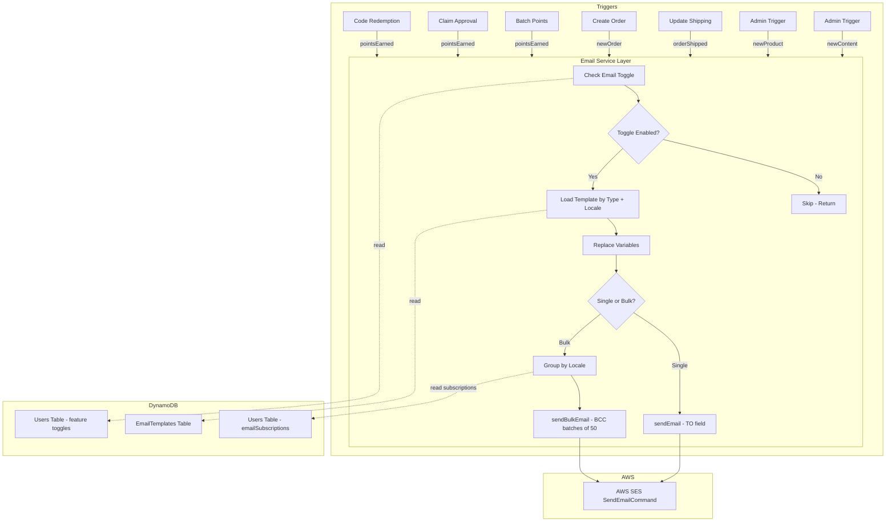
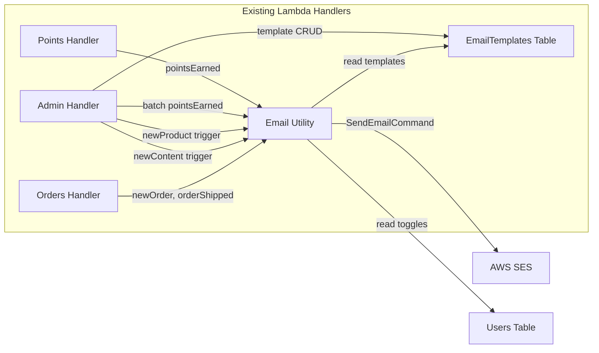

# Design Document: Email Notification System

## Overview

This design adds a multi-locale email notification system to the Points Mall application using AWS SES. The system supports six notification types (pointsEarned, newOrder, orderShipped, newProduct, newContent, templateManagement), five locales (zh, en, ja, ko, zh-TW), and provides SuperAdmin controls for toggles and template editing. Users can opt in to marketing emails (newProduct, newContent) via subscription preferences.

**Key design decisions:**
- **No new Lambda functions** — email logic is added to existing handlers (admin, points, orders, content).
- **Shared email utility** in `packages/backend/src/email/` — provides `sendEmail`, `sendBulkEmail`, and `replaceVariables` functions.
- **EmailTemplates stored in a new DynamoDB table** with composite key `templateId` (notification type) + `locale`.
- **Email toggles added to existing feature toggles record** in the Users table (same `userId = 'feature-toggles'` pattern).
- **User subscription preferences** stored as `emailSubscriptions` object on each user record in the Users table.
- **BCC-based bulk sends** batched at 50 recipients max with 100ms inter-batch delay.
- **Locale grouping** for bulk sends — recipients grouped by locale, separate emails per group.

## Architecture

### Data Flow Diagram



### System Integration Points



## Components and Interfaces

### 1. Email Utility Module (`packages/backend/src/email/`)

#### `send.ts` — Core email sending functions

```typescript
// Types
export type NotificationType = 'pointsEarned' | 'newOrder' | 'orderShipped' | 'newProduct' | 'newContent';
export type EmailLocale = 'zh' | 'en' | 'ja' | 'ko' | 'zh-TW';

export interface SendEmailInput {
  to: string;
  subject: string;
  htmlBody: string;
}

export interface SendBulkEmailInput {
  recipients: string[];  // BCC recipients
  subject: string;
  htmlBody: string;
}

export interface BulkSendResult {
  totalBatches: number;
  successCount: number;
  failureCount: number;
  errors: { batchIndex: number; error: string }[];
}

// Functions
export async function sendEmail(sesClient: SESClient, input: SendEmailInput, senderEmail: string): Promise<void>;
export async function sendBulkEmail(sesClient: SESClient, input: SendBulkEmailInput, senderEmail: string): Promise<BulkSendResult>;
```

**Design rationale:** `sendEmail` handles single-recipient transactional emails (TO field). `sendBulkEmail` handles multi-recipient marketing emails (BCC field, batched at 50, 100ms delay). Both use `store@awscommunity.cn` as sender.

#### `templates.ts` — Template management functions

```typescript
export interface EmailTemplate {
  templateId: string;   // NotificationType
  locale: EmailLocale;
  subject: string;      // 1–200 chars
  body: string;         // HTML, 1–10000 chars
  updatedAt: string;
  updatedBy?: string;
}

export interface TemplateVariableSet {
  pointsEarned: ['nickname', 'points', 'source', 'balance'];
  newOrder: ['orderId', 'productNames', 'totalPoints', 'buyerNickname'];
  orderShipped: ['nickname', 'orderId', 'trackingNumber'];
  newProduct: ['nickname', 'productList'];
  newContent: ['nickname', 'contentList'];
}

// Functions
export function replaceVariables(template: string, variables: Record<string, string>): string;
export async function getTemplate(dynamoClient, tableName, templateId: NotificationType, locale: EmailLocale): Promise<EmailTemplate | null>;
export async function updateTemplate(dynamoClient, tableName, template: Partial<EmailTemplate> & { templateId: string; locale: string }): Promise<EmailTemplate>;
export async function listTemplates(dynamoClient, tableName, templateId?: NotificationType): Promise<EmailTemplate[]>;
export function validateTemplateInput(subject: string, body: string): { valid: boolean; error?: string };
export function getRequiredVariables(templateId: NotificationType): string[];
```

#### `notifications.ts` — High-level notification orchestration

```typescript
export interface NotificationContext {
  sesClient: SESClient;
  dynamoClient: DynamoDBDocumentClient;
  emailTemplatesTable: string;
  usersTable: string;
  senderEmail: string;
}

// Transactional notifications
export async function sendPointsEarnedEmail(ctx: NotificationContext, userId: string, points: number, source: string, balance: number): Promise<void>;
export async function sendNewOrderEmail(ctx: NotificationContext, orderId: string, productNames: string[], totalPoints: number, buyerNickname: string): Promise<void>;
export async function sendOrderShippedEmail(ctx: NotificationContext, userId: string, orderId: string, trackingNumber?: string): Promise<void>;

// Bulk notifications
export async function sendNewProductNotification(ctx: NotificationContext, productList: string, subscribedUsers: { email: string; locale: EmailLocale }[]): Promise<BulkSendResult>;
export async function sendNewContentNotification(ctx: NotificationContext, contentList: string, subscribedUsers: { email: string; locale: EmailLocale }[]): Promise<BulkSendResult>;
```

**Design rationale:** Each notification function:
1. Checks the email toggle for its type (reads from feature toggles)
2. Loads the template for the recipient's locale (or `zh` default)
3. Replaces variables
4. Calls `sendEmail` or `sendBulkEmail`

#### `seed.ts` — Default template seeding

```typescript
export async function seedDefaultTemplates(dynamoClient, tableName: string): Promise<void>;
export function getDefaultTemplates(): EmailTemplate[];
```

### 2. Email Toggle Integration (Feature Toggles)

Email toggles are added to the existing `FeatureToggles` interface in `packages/backend/src/settings/feature-toggles.ts`:

```typescript
export interface FeatureToggles {
  // ... existing toggles ...
  emailPointsEarnedEnabled: boolean;    // default: false
  emailNewOrderEnabled: boolean;        // default: false
  emailOrderShippedEnabled: boolean;    // default: false
  emailNewProductEnabled: boolean;      // default: false
  emailNewContentEnabled: boolean;      // default: false
}
```

These are stored in the same `userId = 'feature-toggles'` record in the Users table, alongside existing toggles.

### 3. User Subscription Preferences

Added to each user record in the Users table:

```typescript
// On the user record
{
  userId: string;
  // ... existing fields ...
  emailSubscriptions?: {
    newProduct: boolean;   // default: false
    newContent: boolean;   // default: false
  };
  locale?: EmailLocale;    // user's preferred locale, default: 'zh'
}
```

New API endpoints (added to Points handler since it already has Users table access):
- `GET /api/user/email-subscriptions` — returns current subscription state
- `PUT /api/user/email-subscriptions` — updates subscription preferences

### 4. Admin API Endpoints (added to Admin handler)

- `GET /api/admin/email-templates?type={notificationType}` — list templates for a type (all locales)
- `PUT /api/admin/email-templates/{type}/{locale}` — update a template (SuperAdmin only)
- `POST /api/admin/email/send-product-notification` — trigger new product bulk send
- `POST /api/admin/email/send-content-notification` — trigger new content bulk send

### 5. Frontend Components

#### Admin Settings Page (existing `packages/frontend/src/pages/admin/settings.tsx`)
- Add "Email Notification" section with 5 toggle switches (one per notification type)
- Add "Edit Template" button per notification type → opens template editor modal
- Template editor: locale tabs, subject input, body textarea, variable reference panel
- Only visible to SuperAdmin

#### User Settings Page (existing `packages/frontend/src/pages/settings/index.tsx`)
- Add "Email Subscriptions" section with toggles for newProduct and newContent
- Conditionally hidden when the corresponding admin toggle is disabled

#### New Admin Pages
- `packages/frontend/src/pages/admin/email-products.tsx` — New product notification trigger page
- `packages/frontend/src/pages/admin/email-content.tsx` — New content notification trigger page
- Both pages: item selection (last 7 days), preview, send button, result summary

## Data Models

### EmailTemplates DynamoDB Table

| Attribute | Type | Description |
|-----------|------|-------------|
| `templateId` | String (PK) | Notification type: `pointsEarned`, `newOrder`, `orderShipped`, `newProduct`, `newContent` |
| `locale` | String (SK) | Locale code: `zh`, `en`, `ja`, `ko`, `zh-TW` |
| `subject` | String | Email subject line (1–200 chars) |
| `body` | String | HTML email body (1–10000 chars) |
| `updatedAt` | String | ISO 8601 timestamp |
| `updatedBy` | String | userId of last editor |

**Table name:** `PointsMall-EmailTemplates`
**Billing mode:** PAY_PER_REQUEST
**Key schema:** Composite key (templateId = partition key, locale = sort key)

### Default Template Content

#### pointsEarned (zh)
- **Subject:** `🎉 积分到账啦，快来商城逛逛吧！`
- **Body:**
```html
<div style="max-width:600px;margin:0 auto;font-family:'Noto Sans SC',sans-serif;padding:24px;">
  <h2 style="color:#6366f1;">Hi {{nickname}}，你的积分到账啦！</h2>
  <p style="font-size:16px;color:#334155;">恭喜你获得了 <strong style="color:#6366f1;">{{points}} 积分</strong>！</p>
  <p style="color:#64748b;">来源：{{source}}</p>
  <p style="color:#64748b;">当前余额：<strong>{{balance}} 积分</strong></p>
  <p style="margin-top:24px;">快去商城看看有什么好东西可以兑换吧～ 🛍️</p>
  <hr style="border:none;border-top:1px solid #e2e8f0;margin:24px 0;" />
  <p style="font-size:12px;color:#94a3b8;">此邮件由 AWS Community 积分商城自动发送</p>
</div>
```

#### newOrder (zh)
- **Subject:** `📦 有新订单啦，注意发货哦！`
- **Body:**
```html
<div style="max-width:600px;margin:0 auto;font-family:'Noto Sans SC',sans-serif;padding:24px;">
  <h2 style="color:#6366f1;">新订单提醒 🎯</h2>
  <p style="font-size:16px;color:#334155;">用户 <strong>{{buyerNickname}}</strong> 下了一笔新订单！</p>
  <p style="color:#64748b;">订单号：{{orderId}}</p>
  <p style="color:#64748b;">商品：{{productNames}}</p>
  <p style="color:#64748b;">总积分：<strong>{{totalPoints}}</strong></p>
  <p style="margin-top:24px;">请尽快处理发货哦～ 🚀</p>
  <hr style="border:none;border-top:1px solid #e2e8f0;margin:24px 0;" />
  <p style="font-size:12px;color:#94a3b8;">此邮件由 AWS Community 积分商城自动发送</p>
</div>
```

#### orderShipped (zh)
- **Subject:** `🚚 你的包裹已发出，注意查收！`
- **Body:**
```html
<div style="max-width:600px;margin:0 auto;font-family:'Noto Sans SC',sans-serif;padding:24px;">
  <h2 style="color:#6366f1;">Hi {{nickname}}，你的包裹发出啦！</h2>
  <p style="font-size:16px;color:#334155;">订单 <strong>{{orderId}}</strong> 已发货～</p>
  <p style="color:#64748b;">物流单号：{{trackingNumber}}</p>
  <p style="margin-top:24px;">耐心等待，好物马上到手！ 📬</p>
  <hr style="border:none;border-top:1px solid #e2e8f0;margin:24px 0;" />
  <p style="font-size:12px;color:#94a3b8;">此邮件由 AWS Community 积分商城自动发送</p>
</div>
```

#### newProduct (zh)
- **Subject:** `🆕 商城上新啦，快来看看有什么好东西！`
- **Body:**
```html
<div style="max-width:600px;margin:0 auto;font-family:'Noto Sans SC',sans-serif;padding:24px;">
  <h2 style="color:#6366f1;">商城上新提醒 ✨</h2>
  <p style="font-size:16px;color:#334155;">以下新商品已上架：</p>
  <div style="background:#f8fafc;border-radius:8px;padding:16px;margin:16px 0;">{{productList}}</div>
  <p style="margin-top:24px;">快去商城逛逛吧～ 🛒</p>
  <hr style="border:none;border-top:1px solid #e2e8f0;margin:24px 0;" />
  <p style="font-size:12px;color:#94a3b8;">此邮件由 AWS Community 积分商城自动发送。如不想收到此类邮件，请在设置中关闭订阅。</p>
</div>
```

#### newContent (zh)
- **Subject:** `📚 有新内容发布啦，快来看看！`
- **Body:**
```html
<div style="max-width:600px;margin:0 auto;font-family:'Noto Sans SC',sans-serif;padding:24px;">
  <h2 style="color:#6366f1;">新内容上线提醒 📖</h2>
  <p style="font-size:16px;color:#334155;">以下新内容已发布：</p>
  <div style="background:#f8fafc;border-radius:8px;padding:16px;margin:16px 0;">{{contentList}}</div>
  <p style="margin-top:24px;">快去内容中心看看吧～ 🎓</p>
  <hr style="border:none;border-top:1px solid #e2e8f0;margin:24px 0;" />
  <p style="font-size:12px;color:#94a3b8;">此邮件由 AWS Community 积分商城自动发送。如不想收到此类邮件，请在设置中关闭订阅。</p>
</div>
```

#### Other Locale Templates (Summary)

| Locale | pointsEarned Subject | newOrder Subject | orderShipped Subject | newProduct Subject | newContent Subject |
|--------|---------------------|-----------------|---------------------|-------------------|-------------------|
| en | 🎉 Points credited! Check out the mall! | 📦 New order received! | 🚚 Your package is on the way! | 🆕 New products available! | 📚 New content published! |
| ja | 🎉 ポイントが付与されました！ | 📦 新しい注文が入りました！ | 🚚 荷物が発送されました！ | 🆕 新商品が入荷しました！ | 📚 新しいコンテンツが公開されました！ |
| ko | 🎉 포인트가 적립되었습니다! | 📦 새 주문이 들어왔습니다! | 🚚 택배가 발송되었습니다! | 🆕 새 상품이 등록되었습니다! | 📚 새 콘텐츠가 게시되었습니다! |
| zh-TW | 🎉 積分到帳啦，快來商城逛逛吧！ | 📦 有新訂單啦，注意出貨哦！ | 🚚 你的包裹已寄出，注意查收！ | 🆕 商城上新啦，快來看看！ | 📚 有新內容發佈啦，快來看看！ |

All non-Chinese templates follow the same HTML structure with translated text and the same `{{variableName}}` placeholders.

### CDK Changes

In `packages/cdk/lib/database-stack.ts`, add:

```typescript
// EmailTemplates table: PK=templateId, SK=locale
this.emailTemplatesTable = new dynamodb.Table(this, 'EmailTemplatesTable', {
  tableName: 'PointsMall-EmailTemplates',
  partitionKey: { name: 'templateId', type: dynamodb.AttributeType.STRING },
  sortKey: { name: 'locale', type: dynamodb.AttributeType.STRING },
  billingMode: dynamodb.BillingMode.PAY_PER_REQUEST,
  removalPolicy: cdk.RemovalPolicy.DESTROY,
});
```

In `packages/cdk/lib/api-stack.ts`, add SES permissions to relevant Lambda functions:

```typescript
// Add SES permissions to Admin, Points, Orders, and Content Lambdas
const sesPolicy = new iam.PolicyStatement({
  actions: ['ses:SendEmail', 'ses:SendRawEmail'],
  resources: [`arn:aws:ses:${this.region}:${this.account}:identity/awscommunity.cn`],
});
[adminFn, pointsFn, orderFn, contentFn].forEach(fn => fn.addToRolePolicy(sesPolicy));

// Add EmailTemplates table env var and permissions
[adminFn, pointsFn, orderFn, contentFn].forEach(fn => {
  fn.addEnvironment('EMAIL_TEMPLATES_TABLE', emailTemplatesTable.tableName);
});
emailTemplatesTable.grantReadWriteData(adminFn);
emailTemplatesTable.grantReadData(pointsFn);
emailTemplatesTable.grantReadData(orderFn);
emailTemplatesTable.grantReadData(contentFn);
```

## Correctness Properties

*A property is a characteristic or behavior that should hold true across all valid executions of a system — essentially, a formal statement about what the system should do. Properties serve as the bridge between human-readable specifications and machine-verifiable correctness guarantees.*

### Property 1: Template variable replacement completeness

*For any* template string containing `{{variableName}}` placeholders and *any* values map (possibly incomplete), after calling `replaceVariables(template, values)`, the result SHALL contain no `{{...}}` patterns — all placeholders are replaced with their corresponding value or an empty string if the value is missing.

**Validates: Requirements 4.1, 4.2**

### Property 2: Template validation accepts valid and rejects invalid lengths

*For any* subject string of length 1–200 and body string of length 1–10000, `validateTemplateInput(subject, body)` SHALL return `{ valid: true }`. *For any* subject of length 0 or >200, or body of length 0 or >10000, it SHALL return `{ valid: false }`.

**Validates: Requirements 1.3, 3.4**

### Property 3: Bulk send batch splitting correctness

*For any* recipient list of size N (where N ≥ 1), `sendBulkEmail` SHALL split recipients into `Math.ceil(N / 50)` batches, each batch containing at most 50 recipients, and the total number of recipients across all batches SHALL equal N.

**Validates: Requirements 5.5, 5.6, 13.1, 13.2**

### Property 4: Subscription filtering excludes unsubscribed users

*For any* set of users with mixed `emailSubscriptions.newProduct` and `emailSubscriptions.newContent` values, the bulk send recipient list for `newProduct` SHALL contain only users with `emailSubscriptions.newProduct === true`, and similarly for `newContent`. No subscribed user SHALL be excluded, and no unsubscribed user SHALL be included.

**Validates: Requirements 7.6, 7.7**

### Property 5: Locale-based template selection with zh default

*For any* user with a locale preference from `{zh, en, ja, ko, zh-TW}`, the system SHALL select the template matching that locale. *For any* user with no locale preference (undefined/null), the system SHALL select the `zh` locale template.

**Validates: Requirements 8.4, 14.1, 14.4**

### Property 6: Locale grouping for bulk sends

*For any* set of subscribed users with various locale preferences, `sendNewProductNotification` and `sendNewContentNotification` SHALL group recipients by locale and send separate emails per locale group. Each locale group SHALL receive an email using the template for that locale. The union of all locale groups SHALL equal the full set of subscribed users.

**Validates: Requirements 11.4, 12.4, 14.2, 14.3**

### Property 7: Bulk send resilience and summary accuracy

*For any* bulk send operation where some SES batch calls succeed and some fail, the system SHALL attempt all batches (not stop on first failure), and the returned `BulkSendResult` SHALL have `successCount + failureCount === totalBatches`.

**Validates: Requirements 13.5, 13.6**

### Property 8: Email toggle disables sending

*For any* notification type with its corresponding email toggle set to `false`, the notification function SHALL not invoke any SES `SendEmailCommand`. The function SHALL return early without error.

**Validates: Requirements 6.3, 8.6, 9.5, 10.5**

## Error Handling

| Scenario | Behavior |
|----------|----------|
| SES send failure (transactional) | Log error, do not fail the parent operation (points award, order creation, etc.). Email is best-effort. |
| SES send failure (bulk batch) | Log error with batch index and recipient count, continue processing remaining batches. Return failure count in summary. |
| Template not found for locale | Fall back to `zh` locale template. If `zh` also missing, log error and skip sending. |
| Invalid template edit (subject/body length) | Return 400 with validation error message. |
| Non-SuperAdmin attempts toggle/template edit | Return 403 FORBIDDEN. |
| User has no email address | Skip sending for that user (log warning). |
| SES throttling | The 100ms inter-batch delay mitigates throttling. If still throttled, the SES SDK will throw and the batch is logged as failed. |

## Testing Strategy

### Property-Based Tests (using `fast-check`)

Each correctness property above will be implemented as a property-based test with minimum 100 iterations. The project already uses `vitest` + `fast-check` for property testing (see existing `*.property.test.ts` files).

**Test files:**
- `packages/backend/src/email/send.property.test.ts` — Properties 1, 2, 3, 7
- `packages/backend/src/email/notifications.property.test.ts` — Properties 4, 5, 6, 8

**Property test configuration:**
- Minimum 100 iterations per property (`{ numRuns: 100 }`)
- Each test tagged with: `Feature: email-notification, Property {N}: {title}`
- Generators for: notification types, locales, template strings with placeholders, user lists with mixed subscriptions/locales, recipient lists of varying sizes

### Unit Tests (example-based)

- `packages/backend/src/email/send.test.ts` — sendEmail/sendBulkEmail with mocked SES client
- `packages/backend/src/email/templates.test.ts` — template CRUD, seed verification, validation edge cases
- `packages/backend/src/email/notifications.test.ts` — notification orchestration with mocked dependencies
- Integration with existing handler tests to verify email calls are made at correct trigger points

### Integration Points to Test

- Points handler: verify `sendPointsEarnedEmail` called after code redemption, claim approval
- Admin handler: verify `sendPointsEarnedEmail` called after batch distribution
- Orders handler: verify `sendNewOrderEmail` called after order creation, `sendOrderShippedEmail` after shipping update
- Admin handler: verify template CRUD endpoints, toggle update endpoints, bulk send trigger endpoints

### What is NOT property-tested

- Frontend component rendering (use example-based component tests)
- CDK infrastructure (use CDK assertion/snapshot tests)
- SES API behavior (external service — use mocks)
- Template seeding (one-time setup — use smoke test)
