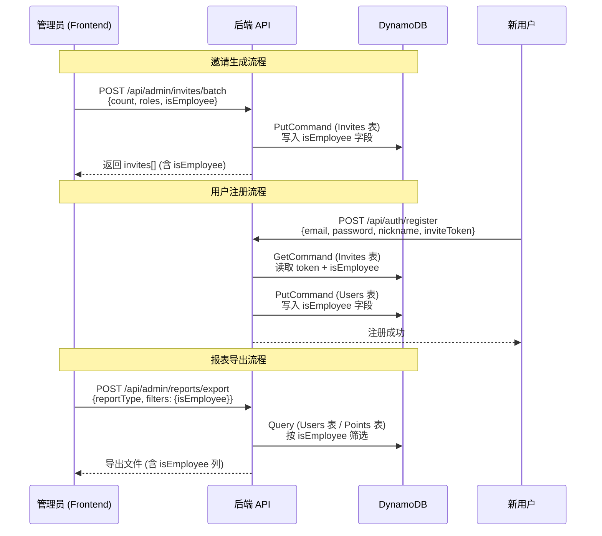

# 设计文档：员工身份标记（Employee Badge）

## 概述

本功能在现有邀请链接生成流程中增加一个可选的 `isEmployee` 布尔字段。管理员生成邀请链接时可勾选"员工邀请"开关，标记该邀请为内部员工专用。通过该邀请注册的用户，其 User 记录中会携带 `isEmployee: true`。此字段不在任何用户界面中展示，仅用于后端报表导出时区分员工与社区用户。

设计原则：
- **最小侵入**：仅在现有数据模型中新增一个可选布尔字段，不改变现有逻辑流程
- **向后兼容**：所有现有记录（不含 `isEmployee`）继续正常工作，缺失字段默认视为 `false`
- **单向传递**：`isEmployee` 从邀请记录 → 注册流程 → 用户记录，单向传递，不可后续修改

## 架构

本功能涉及三个层次的变更，数据流如下：



变更范围：
1. **数据层**：Invites 表和 Users 表各新增一个可选布尔字段
2. **后端 API 层**：邀请生成、邀请验证、用户注册、报表导出四个模块
3. **前端 UI 层**：邀请管理页面的生成表单和列表展示

## 组件与接口

### 1. 后端 — 邀请生成（`packages/backend/src/auth/invite.ts`）

**变更函数：**

- `createInviteRecord(roles, dynamoClient, invitesTable, registerBaseUrl, expiryMs?, isEmployee?)`
  - 新增可选参数 `isEmployee?: boolean`
  - 创建 `InviteRecord` 时写入 `isEmployee: isEmployee ?? false`

- `batchCreateInvites(count, roles, dynamoClient, invitesTable, registerBaseUrl, expiryMs?, isEmployee?)`
  - 新增可选参数 `isEmployee?: boolean`
  - 将 `isEmployee` 传递给 `createInviteRecord`
  - 响应中每条邀请记录包含 `isEmployee` 字段

**变更函数：**

- `validateInviteToken(token, dynamoClient, invitesTable)`
  - 返回类型从 `{ success: true; roles: UserRole[] }` 扩展为 `{ success: true; roles: UserRole[]; isEmployee: boolean }`
  - 从 `InviteRecord` 中读取 `isEmployee`，缺失时默认为 `false`

### 2. 后端 — 邀请管理（`packages/backend/src/admin/invites.ts`）

**变更函数：**

- `batchGenerateInvites(count, roles, dynamoClient, invitesTable, registerBaseUrl, expiryMs?, isEmployee?)`
  - 新增可选参数 `isEmployee?: boolean`，透传给 `batchCreateInvites`
  - 响应类型中每条邀请增加 `isEmployee` 字段

### 3. 后端 — 用户注册（`packages/backend/src/auth/register.ts`）

**变更函数：**

- `registerUser(request, dynamoClient, tableName, invitesTable)`
  - 在 `validateInviteToken` 返回后，提取 `isEmployee` 字段
  - 创建用户记录时，若 `isEmployee === true`，写入 `isEmployee: true`
  - 若 `isEmployee` 为 `false` 或未定义，不写入该字段（节省存储，兼容旧数据）

### 4. 后端 — 报表导出（`packages/backend/src/reports/`）

**变更内容：**

- `export.ts` — `executeExport` 函数：
  - 对涉及用户数据的报表类型（`user-points-ranking`、`points-detail`），在 BatchGet 用户信息时额外读取 `isEmployee` 字段
  - 支持 `filters.isEmployee` 筛选参数（`'true'` / `'false'`），在内存中过滤用户数据
  - 导出列定义中增加 `isEmployee` 列

- `formatters.ts`：
  - `USER_RANKING_COLUMNS` 增加 `{ key: 'isEmployee', label: '员工标记' }`
  - `POINTS_DETAIL_COLUMNS` 增加 `{ key: 'isEmployee', label: '员工标记' }`
  - 对应的 format 函数增加 `isEmployee` 字段映射（`true` → `'是'`，`false`/undefined → `'否'`）

- `query.ts`：
  - `batchGetUserDetails` 函数的 ProjectionExpression 增加 `isEmployee`
  - 返回的 Map 值类型增加 `isEmployee?: boolean`

### 5. 前端 — 邀请管理页面（`packages/frontend/src/pages/admin/invites.tsx`）

**变更内容：**

- **生成表单**：在角色选择区域下方增加"员工邀请"开关（Switch/Toggle）
  - 默认关闭状态
  - 开启后，POST 请求中携带 `isEmployee: true`
  - 关闭时不携带或携带 `isEmployee: false`

- **邀请列表**：每条邀请行中，若 `isEmployee === true`，显示"员工"标签
  - 标签样式使用 `--info` 色系（蓝色调），与角色徽章（彩色）区分
  - 位置：在角色徽章之后、状态标签之前

- **接口类型更新**：
  - `InviteRecord` 接口增加 `isEmployee?: boolean`
  - `NewInvite` 接口增加 `isEmployee?: boolean`

### 6. 共享类型（`packages/shared/src/types.ts`）

**变更内容：**

- `InviteRecord` 接口增加 `isEmployee?: boolean`
- 新增辅助函数 `getInviteIsEmployee(record: { isEmployee?: boolean }): boolean`
  - 返回 `record.isEmployee ?? false`，确保向后兼容

## 数据模型

### Invites 表变更

| 字段 | 类型 | 必填 | 说明 |
|------|------|------|------|
| `isEmployee` | `boolean` | 否 | 是否为员工邀请，默认 `false` |

现有字段不变：`token`（PK）、`role`、`roles`、`status`、`createdAt`、`expiresAt`、`usedAt`、`usedBy`

**DynamoDB 注意事项**：
- 不需要新增 GSI（`isEmployee` 不作为查询条件，仅在读取时使用）
- 旧记录不含 `isEmployee` 字段，读取时默认视为 `false`

### Users 表变更

| 字段 | 类型 | 必填 | 说明 |
|------|------|------|------|
| `isEmployee` | `boolean` | 否 | 是否为内部员工，默认 `false` |

现有字段不变：`userId`（PK）、`email`、`nickname`、`roles`、`points`、`status` 等

**DynamoDB 注意事项**：
- 不需要新增 GSI（报表导出时通过内存筛选，不需要按 `isEmployee` 查询索引）
- 仅当 `isEmployee === true` 时写入该字段，`false` 时不写入（节省存储）
- 旧用户记录不含 `isEmployee` 字段，读取时默认视为 `false`

### TypeScript 类型变更

```typescript
// packages/shared/src/types.ts

/** 邀请记录（扩展） */
export interface InviteRecord {
  token: string;
  role: UserRole;
  roles?: UserRole[];
  status: InviteStatus;
  createdAt: string;
  expiresAt: string;
  usedAt?: string;
  usedBy?: string;
  isEmployee?: boolean;  // 新增
}

/** 辅助函数：安全获取 isEmployee（兼容旧数据） */
export function getInviteIsEmployee(record: { isEmployee?: boolean }): boolean {
  return record.isEmployee ?? false;
}
```

## 正确性属性

*正确性属性是一种在系统所有有效执行中都应成立的特征或行为——本质上是对系统应做什么的形式化陈述。属性是人类可读规范与机器可验证正确性保证之间的桥梁。*

### Property 1: 邀请创建 isEmployee 标记往返一致性

*For any* 有效的角色组合 `roles`、数量 `count ∈ [1, 100]` 和布尔值 `isEmployee`，调用 `batchCreateInvites(count, roles, ..., isEmployee)` 后，所有 `count` 条生成的邀请记录中的 `isEmployee` 字段 SHALL 等于传入的 `isEmployee` 值；当未传入 `isEmployee` 时，所有记录的 `isEmployee` SHALL 为 `false`。

**Validates: Requirements 1.1, 1.2, 1.3, 4.1, 4.2, 4.3, 4.4**

### Property 2: 注册流程传递 isEmployee 标记

*For any* 有效的注册请求和对应的邀请记录，注册后创建的用户记录中的 `isEmployee` 值 SHALL 与邀请记录中的 `isEmployee` 值一致。当邀请记录不含 `isEmployee` 字段（旧数据）时，用户记录 SHALL 不包含 `isEmployee: true`。

**Validates: Requirements 5.1, 5.2, 5.3, 5.4**

### Property 3: 报表导出 isEmployee 筛选正确性

*For any* 用户记录集合和可选的 `isEmployee` 筛选条件，当指定 `isEmployee` 筛选时，导出结果中的每条记录 SHALL 满足筛选条件；当未指定筛选时，导出结果 SHALL 包含所有用户记录。导出的每条记录 SHALL 包含 `isEmployee` 字段。

**Validates: Requirements 7.1, 7.2, 7.3**

### Property 4: 向后兼容默认值

*For any* 不含 `isEmployee` 字段的邀请记录或用户记录（旧数据），系统读取时 SHALL 将 `isEmployee` 默认视为 `false`。具体地，`getInviteIsEmployee({ })` SHALL 返回 `false`，`getInviteIsEmployee({ isEmployee: true })` SHALL 返回 `true`。

**Validates: Requirements 8.1, 8.2, 8.3**

### Property 5: 记录序列化往返一致性

*For any* 邀请记录或用户记录（无论是否包含 `isEmployee` 字段），将其序列化为 JSON 再反序列化后 SHALL 产生与原始对象等价的结果。`isEmployee` 字段的存在与否和值在往返过程中 SHALL 保持不变。

**Validates: Requirements 8.4**

## 错误处理

### 邀请生成

- `isEmployee` 参数类型错误（非布尔值）：API handler 层校验，返回 `400 Bad Request`
- 现有错误处理不变：`INVALID_COUNT`、`INVALID_ROLES`、`EXCLUSIVE_ROLE_CONFLICT` 等

### 注册流程

- 邀请记录不含 `isEmployee` 字段：默认视为 `false`，不报错
- 现有错误处理不变：`INVITE_TOKEN_INVALID`、`INVITE_TOKEN_USED`、`INVITE_TOKEN_EXPIRED` 等

### 报表导出

- `isEmployee` 筛选参数值非法（非 `'true'`/`'false'`）：忽略该筛选条件，导出全部数据
- 现有错误处理不变：`INVALID_REPORT_TYPE`、`EXPORT_LIMIT_EXCEEDED` 等

## 测试策略

### 属性测试（Property-Based Testing）

使用 `fast-check` 库，每个属性测试最少运行 100 次迭代。

| 属性 | 测试文件 | 说明 |
|------|----------|------|
| Property 1 | `packages/backend/src/admin/employee-badge.property.test.ts` | 测试 `batchCreateInvites` 的 `isEmployee` 标记传递 |
| Property 2 | `packages/backend/src/auth/register-employee.property.test.ts` | 测试注册流程的 `isEmployee` 传递 |
| Property 3 | `packages/backend/src/reports/employee-filter.property.test.ts` | 测试报表导出的 `isEmployee` 筛选逻辑 |
| Property 4 | `packages/backend/src/admin/employee-badge.property.test.ts` | 测试 `getInviteIsEmployee` 辅助函数 |
| Property 5 | `packages/backend/src/admin/employee-badge.property.test.ts` | 测试记录序列化往返 |

标签格式：`Feature: employee-badge, Property {N}: {property_text}`

### 单元测试（Example-Based）

| 测试文件 | 覆盖内容 |
|----------|----------|
| `packages/backend/src/admin/invites.test.ts` | 扩展现有测试，验证 `isEmployee` 参数传递 |
| `packages/backend/src/auth/register.test.ts` | 扩展现有测试，验证员工邀请注册流程 |
| `packages/backend/src/auth/invite.test.ts` | 验证 `validateInviteToken` 返回 `isEmployee` |
| `packages/backend/src/reports/export.test.ts` | 验证报表导出含 `isEmployee` 列和筛选 |

### 前端测试

- 邀请生成表单：验证"员工邀请"开关的默认状态和交互行为
- 邀请列表：验证"员工"标签的条件渲染

### 向后兼容测试

- 使用不含 `isEmployee` 字段的模拟数据，验证所有现有功能不受影响
- 验证旧邀请记录的验证、消耗、列表查询均正常工作
