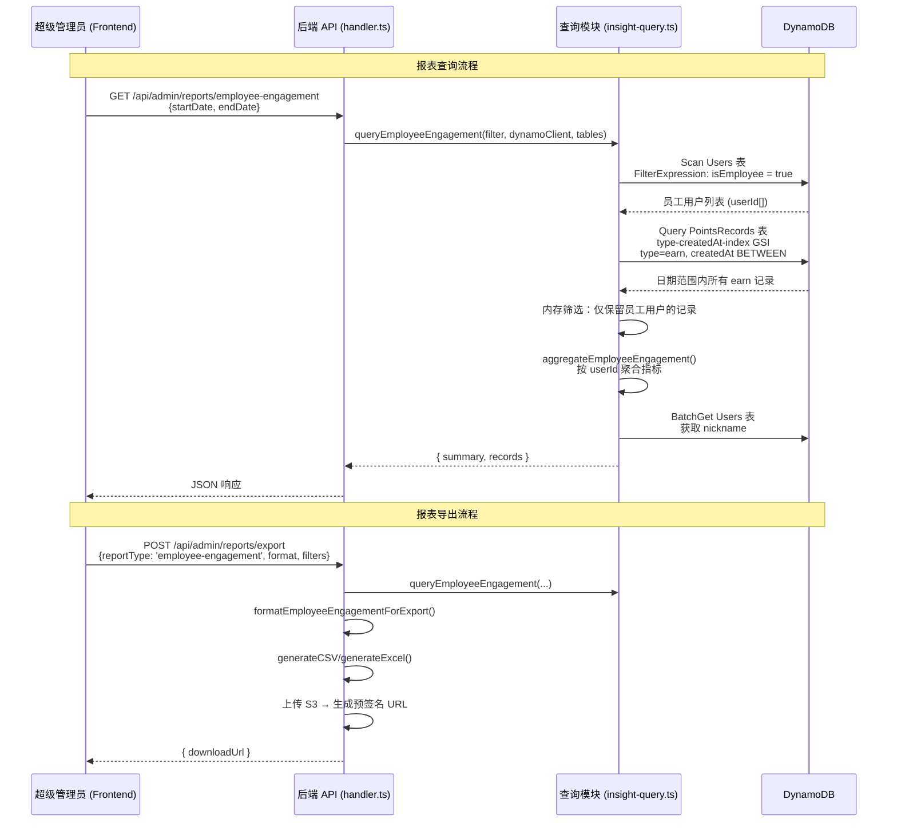
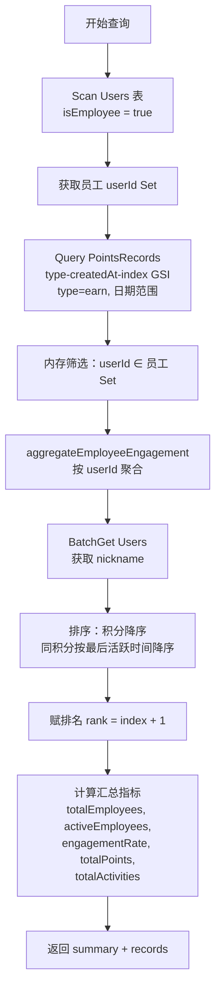

# 设计文档：活跃员工报表（Employee Engagement Report）

## 概述

在现有报表中心（Reports Page）中新增第 11 个标签页"活跃员工"，用于向 AWS 内部汇报员工在社区中的参与情况。系统已有 `isEmployee` 布尔字段标识员工用户（来自 employee-badge 功能）。本报表通过查询员工用户的积分记录，汇总员工的活跃度指标，并提供按员工维度的明细表格，支持日期范围筛选和 CSV/Excel 导出。

设计原则：
- **复用现有模式**：遵循 invite-conversion 标签页的"汇总指标卡片 + 明细表格"双区域布局模式
- **纯函数聚合**：核心聚合逻辑作为纯函数导出，便于属性测试验证正确性
- **最小变更**：在现有 formatters、export、handler 模块中注册新报表类型，不改变现有架构

## 架构

本功能涉及后端查询/聚合、格式化/导出、前端展示三个层次，数据流如下：



变更范围：
1. **后端查询层**：`insight-query.ts` 新增查询函数和纯函数聚合逻辑
2. **后端格式化层**：`formatters.ts` 新增报表类型、列定义和格式化函数
3. **后端导出层**：`export.ts` 注册新报表类型的导出逻辑
4. **后端路由层**：`handler.ts` 新增 GET 路由和 handler 函数
5. **前端展示层**：`reports.tsx` 新增标签页、汇总卡片组件和明细表格列定义
6. **国际化**：`zh.ts` / `en.ts` 新增 i18n 键

## 组件与接口

### 1. 后端 — 查询模块（`packages/backend/src/reports/insight-query.ts`）

**新增接口：**

```typescript
/** 活跃员工报表筛选条件 */
export interface EmployeeEngagementFilter {
  startDate?: string;   // ISO 8601
  endDate?: string;     // ISO 8601
}

/** 活跃员工明细记录 */
export interface EmployeeEngagementRecord {
  rank: number;
  userId: string;
  nickname: string;
  totalPoints: number;        // earn 类型积分总额
  activityCount: number;      // 不同 activityId 数量
  lastActiveTime: string;     // 最近一条记录的 createdAt
  primaryRoles: string;       // targetRole 集合，逗号分隔
  ugList: string;             // 不同 activityUG 集合，顿号分隔
}

/** 活跃员工汇总指标 */
export interface EmployeeEngagementSummary {
  totalEmployees: number;     // 员工总数
  activeEmployees: number;    // 活跃员工数
  engagementRate: number;     // 活跃率（百分比，一位小数）
  totalPoints: number;        // 员工积分总额
  totalActivities: number;    // 参与活动数（所有员工的不同 activityId 总数）
}

/** 活跃员工报表查询结果 */
export interface EmployeeEngagementResult {
  success: boolean;
  summary?: EmployeeEngagementSummary;
  records?: EmployeeEngagementRecord[];
  error?: { code: string; message: string };
}
```

**新增纯函数（导出供属性测试使用）：**

```typescript
/**
 * 按 userId 聚合员工积分记录。
 * 返回每位员工的聚合数据（未排序、未赋排名）。
 */
export function aggregateEmployeeEngagement(
  records: { userId: string; amount: number; activityId?: string; createdAt: string; targetRole?: string; activityUG?: string }[],
): {
  userId: string;
  totalPoints: number;
  activityCount: number;
  lastActiveTime: string;
  primaryRoles: Set<string>;
  ugSet: Set<string>;
}[]

/**
 * 计算活跃率。
 * 公式: activeCount / totalCount × 100，保留一位小数。
 * 当 totalCount 为 0 时返回 0。
 */
export function calculateEngagementRate(activeCount: number, totalCount: number): number
```

**新增查询函数：**

```typescript
/**
 * 查询活跃员工报表。
 * 1. Scan Users 表获取所有 isEmployee=true 的用户 ID
 * 2. Query PointsRecords type-createdAt-index GSI (type=earn, 日期范围)
 * 3. 内存筛选员工记录 → aggregateEmployeeEngagement() 聚合
 * 4. BatchGet Users 获取 nickname
 * 5. 排序（积分降序，同积分按最后活跃时间降序）→ 赋排名
 * 6. 计算汇总指标
 */
export async function queryEmployeeEngagement(
  filter: EmployeeEngagementFilter,
  dynamoClient: DynamoDBDocumentClient,
  tables: { usersTable: string; pointsRecordsTable: string },
): Promise<EmployeeEngagementResult>
```

### 2. 后端 — 格式化模块（`packages/backend/src/reports/formatters.ts`）

**变更内容：**

- `ReportType` 联合类型新增 `'employee-engagement'`
- 新增 `EMPLOYEE_ENGAGEMENT_COLUMNS` 列定义：

```typescript
const EMPLOYEE_ENGAGEMENT_COLUMNS: ColumnDef[] = [
  { key: 'rank', label: '排名' },
  { key: 'nickname', label: '用户昵称' },
  { key: 'totalPoints', label: '积分总额' },
  { key: 'activityCount', label: '参与活动数' },
  { key: 'lastActiveTime', label: '最后活跃时间' },
  { key: 'primaryRoles', label: '主要角色' },
  { key: 'ugList', label: '参与UG列表' },
];
```

- `getColumnDefs` switch 新增 `'employee-engagement'` 分支
- 新增格式化函数：

```typescript
/** 将活跃员工记录格式化为导出行 */
export function formatEmployeeEngagementForExport(
  records: EmployeeEngagementRecord[],
): Record<string, unknown>[]
```

格式化规则：
- `lastActiveTime`：格式化为 `YYYY-MM-DD HH:mm:ss`
- `ugList`：多个 UG 以中文顿号（、）分隔
- 其他字段直接映射

### 3. 后端 — 导出模块（`packages/backend/src/reports/export.ts`）

**变更内容：**

- `VALID_REPORT_TYPES` 数组新增 `'employee-engagement'`
- `executeExport` 函数新增 `employee-engagement` 分支：
  - 调用 `queryEmployeeEngagement` 获取数据
  - 调用 `formatEmployeeEngagementForExport` 格式化
  - 生成 CSV/Excel 文件 → 上传 S3 → 返回预签名 URL

### 4. 后端 — 路由模块（`packages/backend/src/admin/handler.ts`）

**变更内容：**

- 新增 GET 路由：`/api/admin/reports/employee-engagement`
  - SuperAdmin 权限校验
  - 解析 `startDate`、`endDate` 查询参数
  - 调用 `queryEmployeeEngagement`
  - 返回 `{ summary, records }`

```typescript
// GET /api/admin/reports/employee-engagement — SuperAdmin only
if (method === 'GET' && path === '/api/admin/reports/employee-engagement') {
  if (!isSuperAdmin(event.user.roles as UserRole[])) {
    return errorResponse(ErrorCodes.FORBIDDEN, '需要超级管理员权限', 403);
  }
  return await handleEmployeeEngagementReport(event);
}
```

### 5. 前端 — 报表页面（`packages/frontend/src/pages/admin/reports.tsx`）

**变更内容：**

- `ReportTab` 联合类型新增 `'employee-engagement'`
- `TabFilterState` 新增 `'employee-engagement'` 筛选状态（startDate, endDate）
- `REPORT_TABS` 数组新增标签项
- `tabToReportType` / `tabToEndpoint` 映射新增条目
- `getDefaultFilters` 新增默认值
- 新增 `EmployeeEngagementSummary` 和 `EmployeeEngagementRecord` 接口
- 数据获取逻辑：`employee-engagement` 标签返回 `{ summary, records }`，需分别存储
- 新增 `EmployeeMetricCards` 组件：展示 5 个汇总指标卡片
- `getColumns` 新增 `'employee-engagement'` 列定义
- 布局：汇总卡片 + 明细表格（类似 invite-conversion 的卡片区域 + 下方表格）

### 6. 国际化（`packages/frontend/src/i18n/zh.ts` / `en.ts`）

**新增 i18n 键：**

```typescript
// 标签页
'admin.reports.tabEmployeeEngagement': '活跃员工',

// 汇总指标卡片
'admin.reports.metricTotalEmployees': '员工总数',
'admin.reports.metricActiveEmployees': '活跃员工数',
'admin.reports.metricEngagementRate': '活跃率',
'admin.reports.metricEmployeeTotalPoints': '员工积分总额',
'admin.reports.metricTotalActivities': '参与活动数',

// 明细表格列
'admin.reports.colTotalPoints': '积分总额',
'admin.reports.colActivityCount': '参与活动数',
'admin.reports.colLastActiveTime': '最后活跃时间',
'admin.reports.colPrimaryRoles': '主要角色',
'admin.reports.colUGList': '参与UG列表',
```

## 数据模型

### 数据源（只读，不新增表或字段）

本功能不修改任何数据库表结构，仅读取现有数据：

**Users 表**

| 字段 | 类型 | 说明 |
|------|------|------|
| `userId` | `string` (PK) | 用户 ID |
| `nickname` | `string` | 用户昵称 |
| `isEmployee` | `boolean?` | 是否为员工（来自 employee-badge 功能） |
| `roles` | `string[]` | 用户角色列表 |

查询方式：`Scan` + `FilterExpression: isEmployee = :true`

**PointsRecords 表**

| 字段 | 类型 | 说明 |
|------|------|------|
| `recordId` | `string` (PK) | 记录 ID |
| `userId` | `string` | 用户 ID |
| `type` | `'earn' \| 'spend'` | 积分类型 |
| `amount` | `number` | 积分数额 |
| `createdAt` | `string` | 创建时间 (ISO 8601) |
| `activityId` | `string?` | 活动 ID |
| `activityUG` | `string?` | 所属 UG |
| `targetRole` | `string?` | 目标角色 |

查询方式：`Query` on `type-createdAt-index` GSI（`type = 'earn' AND createdAt BETWEEN :start AND :end`）

### 查询策略



### TypeScript 类型定义

```typescript
// 聚合中间结果（纯函数输出）
interface EmployeeAggregation {
  userId: string;
  totalPoints: number;
  activityIds: Set<string>;
  lastActiveTime: string;
  roles: Set<string>;
  ugSet: Set<string>;
}

// 最终明细记录
interface EmployeeEngagementRecord {
  rank: number;
  userId: string;
  nickname: string;
  totalPoints: number;
  activityCount: number;
  lastActiveTime: string;
  primaryRoles: string;    // Set → 逗号分隔字符串
  ugList: string;          // Set → 顿号分隔字符串
}

// 汇总指标
interface EmployeeEngagementSummary {
  totalEmployees: number;
  activeEmployees: number;
  engagementRate: number;  // 百分比，一位小数
  totalPoints: number;
  totalActivities: number;
}
```


## 正确性属性

*正确性属性是一种在系统所有有效执行中都应成立的特征或行为——本质上是对系统应做什么的形式化陈述。属性是人类可读规范与机器可验证正确性保证之间的桥梁。*

基于需求文档中的验收标准，经过逐条分析和冗余消除，提炼出以下 9 个可测试属性：

### Property 1: 积分守恒（Points Conservation）

*For any* 有效的积分记录集合，调用 `aggregateEmployeeEngagement` 聚合后，所有员工的 `totalPoints` 之和 SHALL 等于原始记录集合中所有 `amount` 之和。聚合过程不会丢失或凭空产生积分。

**Validates: Requirements 2.6, 3.5, 6.1, 9.1**

### Property 2: 用户计数一致性（User Count Consistency）

*For any* 有效的积分记录集合，调用 `aggregateEmployeeEngagement` 聚合后，返回的聚合条目数量 SHALL 等于原始记录集合中不同 `userId` 的数量。每位有记录的员工恰好对应一条聚合结果。

**Validates: Requirements 2.4, 6.5, 9.2**

### Property 3: 活动数上界（Activity Count Upper Bound）

*For any* 有效的积分记录集合和其中任意一位员工，该员工的 `activityCount`（不同 activityId 数量）SHALL 小于或等于该员工的积分记录总数。不同活动数不可能超过记录条数。

**Validates: Requirements 3.6, 9.3**

### Property 4: 最后活跃时间为最大值（Last Active Time is Maximum）

*For any* 有效的积分记录集合和其中任意一位员工，该员工的 `lastActiveTime` SHALL 大于或等于该员工所有积分记录中的任意 `createdAt` 值。最后活跃时间是该员工所有记录时间的最大值。

**Validates: Requirements 3.7, 9.4**

### Property 5: 活跃率公式正确性与范围（Engagement Rate Formula and Range）

*For any* 非负整数 `activeCount` 和 `totalCount`（其中 `activeCount ≤ totalCount`），`calculateEngagementRate(activeCount, totalCount)` 的返回值 SHALL 满足：
- 当 `totalCount = 0` 时，返回 `0`
- 当 `totalCount > 0` 时，返回 `activeCount / totalCount × 100`，保留一位小数
- 返回值始终在 `[0, 100]` 范围内

**Validates: Requirements 2.5, 6.3, 9.5**

### Property 6: 汇总与明细一致性（Summary-Detail Consistency）

*For any* 有效的员工集合和积分记录集合，查询结果中的 `summary.activeEmployees` SHALL 等于 `records.length`（明细行数），且 `summary.totalPoints` SHALL 等于 `records` 中所有员工 `totalPoints` 之和。汇总指标与明细数据保持数学一致。

**Validates: Requirements 4.4, 6.5, 6.6**

### Property 7: 排名排序正确性（Ranking Order Correctness）

*For any* 有效的聚合结果集合，排名 SHALL 满足：
- 排名从 1 开始连续编号
- 按 `totalPoints` 降序排列
- `totalPoints` 相同时，按 `lastActiveTime` 降序排列
- 对于任意相邻排名 i 和 i+1，`records[i].totalPoints >= records[i+1].totalPoints`

**Validates: Requirements 3.3, 6.4**

### Property 8: 员工集合完整性（Per-Employee Set Completeness）

*For any* 有效的积分记录集合和其中任意一位员工，该员工聚合结果中的 `roles` 集合 SHALL 包含该员工所有记录中出现的每个非空 `targetRole` 值，`ugSet` 集合 SHALL 包含该员工所有记录中出现的每个非空 `activityUG` 值。不会遗漏任何角色或 UG。

**Validates: Requirements 3.8, 3.9**

### Property 9: 格式化函数确定性与正确性（Formatter Determinism and Correctness）

*For any* 有效的 `EmployeeEngagementRecord` 数组，调用 `formatEmployeeEngagementForExport` SHALL 满足：
- 输出行数等于输入记录数
- 每行包含所有 7 个列键（rank, nickname, totalPoints, activityCount, lastActiveTime, primaryRoles, ugList）
- `lastActiveTime` 字段匹配 `YYYY-MM-DD HH:mm:ss` 格式
- 对相同输入调用两次，输出完全相同（确定性）

**Validates: Requirements 7.3, 8.1, 8.2, 8.3, 8.4**

## 错误处理

### 查询接口

| 场景 | 处理方式 |
|------|----------|
| 非 SuperAdmin 用户访问 | 返回 `403 Forbidden`，错误码 `FORBIDDEN` |
| `startDate` / `endDate` 未提供 | 使用默认最近 30 天（复用 `applyDefaultDateRange`） |
| DynamoDB 查询异常 | 捕获异常，返回 `{ success: false, error: { code: 'INTERNAL_ERROR', message: 'Internal server error' } }` |
| 员工总数为 0 | 正常返回，`engagementRate = 0`，`records = []` |
| 日期范围内无 earn 记录 | 正常返回，所有指标为 0，`records = []` |

### 导出接口

| 场景 | 处理方式 |
|------|----------|
| `reportType` 不是 `'employee-engagement'` | 由现有 `validateExportInput` 校验，返回 `INVALID_REPORT_TYPE` |
| 导出记录超过 50,000 条 | 返回 `EXPORT_LIMIT_EXCEEDED` 错误 |
| 接近 Lambda 15 分钟超时 | 返回 `EXPORT_TIMEOUT` 错误 |
| S3 上传失败 | 捕获异常，返回 `INTERNAL_ERROR` |

### 前端

| 场景 | 处理方式 |
|------|----------|
| API 请求失败 | 显示 Toast 错误提示，保留上次数据 |
| 导出请求失败 | 显示 Toast 错误提示，恢复导出按钮状态 |
| 数据为空 | 显示空状态占位符（复用现有 `noData` 样式） |

## 测试策略

### 属性测试（Property-Based Testing）

使用 `fast-check` 库，每个属性测试最少运行 100 次迭代。

| 属性 | 测试文件 | 说明 |
|------|----------|------|
| Property 1 | `packages/backend/src/reports/employee-engagement.property.test.ts` | 积分守恒：聚合后总积分 = 原始总积分 |
| Property 2 | `packages/backend/src/reports/employee-engagement.property.test.ts` | 用户计数：聚合条目数 = 不同 userId 数 |
| Property 3 | `packages/backend/src/reports/employee-engagement.property.test.ts` | 活动数上界：activityCount ≤ 记录数 |
| Property 4 | `packages/backend/src/reports/employee-engagement.property.test.ts` | 最后活跃时间：lastActiveTime ≥ 所有 createdAt |
| Property 5 | `packages/backend/src/reports/employee-engagement.property.test.ts` | 活跃率公式：正确计算 + 范围 [0,100] |
| Property 6 | `packages/backend/src/reports/employee-engagement.property.test.ts` | 汇总-明细一致性：activeEmployees = records.length |
| Property 7 | `packages/backend/src/reports/employee-engagement.property.test.ts` | 排名排序：积分降序 + 时间降序 tiebreaker |
| Property 8 | `packages/backend/src/reports/employee-engagement.property.test.ts` | 集合完整性：roles 和 UG 不遗漏 |
| Property 9 | `packages/backend/src/reports/employee-engagement.property.test.ts` | 格式化确定性：输出行数、列键、日期格式 |

标签格式：`Feature: employee-engagement-report, Property {N}: {property_text}`

### 单元测试（Example-Based）

| 测试文件 | 覆盖内容 |
|----------|----------|
| `packages/backend/src/reports/employee-engagement.test.ts` | `queryEmployeeEngagement` 集成测试（mock DynamoDB） |
| `packages/backend/src/admin/handler.test.ts` | 扩展现有测试，验证新路由的权限校验和参数传递 |
| `packages/backend/src/reports/formatters.test.ts` | 验证 `formatEmployeeEngagementForExport` 的具体输出 |
| `packages/backend/src/reports/export.test.ts` | 验证 `employee-engagement` 导出流程 |

### 前端测试

- 标签页渲染：验证"活跃员工"标签存在且可切换
- 汇总卡片：验证 5 个指标卡片正确渲染
- 明细表格：验证 7 列数据正确展示
- 导出按钮：验证导出请求携带正确参数

### 测试数据生成策略

属性测试的 `fast-check` 生成器设计：

```typescript
// 生成随机积分记录
const pointsRecordArb = fc.record({
  userId: fc.stringOf(fc.constantFrom('emp1', 'emp2', 'emp3', 'emp4', 'emp5'), { minLength: 1, maxLength: 1 }),
  amount: fc.integer({ min: 1, max: 1000 }),
  activityId: fc.stringOf(fc.constantFrom('act1', 'act2', 'act3'), { minLength: 1, maxLength: 1 }),
  createdAt: fc.date({ min: new Date('2024-01-01'), max: new Date('2025-12-31') }).map(d => d.toISOString()),
  targetRole: fc.constantFrom('Speaker', 'Volunteer', 'UserGroupLeader', ''),
  activityUG: fc.constantFrom('UG-Beijing', 'UG-Shanghai', 'UG-Shenzhen', ''),
});

// 生成随机记录数组（1~50 条）
const recordsArb = fc.array(pointsRecordArb, { minLength: 1, maxLength: 50 });
```
