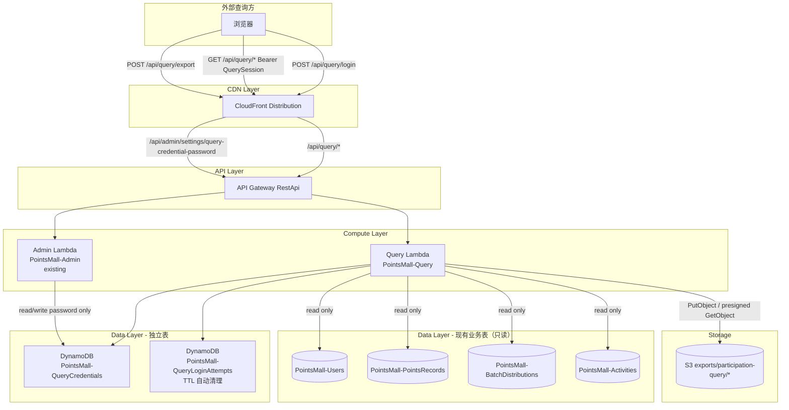

# Design Document: 员工活动参与度查询 (Employee Participation Query)

## Overview

本功能新增一个与商城用户体系完全隔离的"员工活动参与度查询"系统。外部查询方通过独立的登录页面，使用 SuperAdmin 维护的固定账号密码登录，获得 24 小时有效的查询会话（Query_Session），随后可以查看四类只读数据视图：

1. Speaker 支持次数视图
2. 志愿者支持次数视图
3. 员工活动支持总计视图
4. 活动支持记录明细视图

四类视图的数据均来源于现有的 `PointsRecords` 表、`BatchDistributions` 表、`Users` 表和 `Activities` 表，但计算逻辑、鉴权体系、前端页面均与商城主体系统隔离。

### 设计决策

**决策 1：独立 Lambda + 独立 DynamoDB 表**

新增 `PointsMall-Query` Lambda（`packages/backend/src/participation/handler.ts`），不复用 Admin/Auth Lambda 的入口路由。新增两张独立的 DynamoDB 表：
- `PointsMall-QueryCredentials`：存储查询登录凭证（用户名 + 密码哈希 + 版本号）
- `PointsMall-QueryLoginAttempts`：存储按来源 IP 的登录失败计数与锁定状态（TTL 自动清理）

这确保该模块完全独立于商城用户账号体系（Requirement 1, 3.4），且故障隔离——即使商城 Auth/Admin Lambda 出现问题，查询系统仍可正常工作（读取的四张业务表除外）。

**决策 2：会话使用"版本号"而非显式黑名单实现吊销**

Query_Session 是一个 JWT，payload 中携带发放时刻的 `credentialVersion`。`PointsMall-QueryCredentials` 表中的凭证记录也保存当前 `version` 字段。会话校验时比较 token 中的版本号与表中当前版本号：

- 相等 → 会话有效（若未过期）
- 不相等 → 会话已被吊销（Requirement 4.3）

SuperAdmin 修改密码时，`version` 原子递增（`version = version + 1`）。这样"修改密码后所有已有会话失效"（Requirement 2.7）无需维护显式黑名单表，逻辑简单且与现有 `rolesVersion` 机制（`auth-middleware.ts`）风格一致。

**决策 3：会话使用独立 JWT 密钥，不复用商城 Auth 密钥**

新增 SSM 参数 `/points-mall/query-jwt-secret`（与现有 `/points-mall/jwt-secret` 模式一致），Query_Session 的签发与校验完全独立于 `auth/token.ts`。这防止商城用户 token 被误用于查询系统接口，也防止查询会话被误用于商城接口——两套 token 结构不同（Query_Session 不含 `userId`/`roles`，仅含 `credentialVersion`），互不兼容。

**决策 4：初始凭证通过 SSM SecureString 注入，不硬编码明文密码**

`PointsMall-QueryCredentials` 表为空时的默认记录（Requirement 1.3）由部署时提供的 `queryDefaultUsername` / `queryDefaultPassword` CDK 参数生成：密码通过 SSM SecureString 参数 `/points-mall/query-default-password` 传递，Lambda 冷启动时读取该参数，仅在表中不存在任何记录时用 bcrypt 哈希后写入一次，随后不再读取该参数值用于业务逻辑。代码和 CDK 模板中不出现任何明文密码。

**决策 5：密码修改接口挂在现有管理后台设置页对应的 Admin Lambda 上**

Requirement 2 要求"SuperAdmin 在现有管理后台设置页中维护"查询密码。为满足这一点，新增路由 `PUT /api/admin/settings/query-credential-password` 挂载在现有 `PointsMall-Admin` Lambda 上（复用现有权限校验中间件），但其实现调用的是 `participation/credential.ts` 中的共享纯函数模块——该模块同时被 Admin Lambda（写密码）和 Query Lambda（登录校验读密码）引用，避免逻辑重复，同时两个 Lambda 各自拥有独立的表读写权限（Admin Lambda 仅需读写 `QueryCredentials` 表，不需要读写 `QueryLoginAttempts` 表）。

**决策 6：导出走 S3 预签名下载链接，而非直接返回二进制**

由于导出上限为 50,000 条记录，导出文件可能超过 Lambda 同步响应体 6MB 限制。因此复用现有 `reports/export.ts` 的模式：生成文件后上传到现有图片 S3 桶的 `exports/participation-query/*` 前缀下，返回 30 分钟有效的预签名下载 URL，而不是像小体量的 `order-export-phone` 那样直接返回 base64 内容。

## Architecture



### 请求流程

**登录**：
1. 外部查询方在 Query_Login_Page 提交用户名/密码
2. Query Lambda 先检查来源 IP 是否被锁定（`QueryLoginAttempts` 表）
3. 未锁定 → 校验用户名/密码（bcrypt compare against `QueryCredentials` 表当前记录）
4. 成功 → 重置该 IP 失败计数，签发携带当前 `credentialVersion` 的 24 小时 JWT
5. 失败 → 按滑动窗口规则累加失败计数，达到 5 次则锁定该 IP 15 分钟

**数据查询**：
1. Query_Dashboard 携带 `Authorization: Bearer <QuerySession>` 请求四类视图接口
2. Query Lambda 的鉴权中间件校验 token 格式、过期时间、以及 `credentialVersion` 是否与当前记录一致
3. 通过后并行查询 `PointsRecords`（`type-createdAt-index` 过滤 `targetRole in [Speaker, Volunteer]`）与 `BatchDistributions`（`createdAt-index`），按 `activityId` 关联 `Activities` 表补全主题/UG/日期，按 `userId` BatchGet `Users` 表获取当前花名/邮箱/`isEmployee`
4. 在内存中执行聚合、搜索关键字过滤、日期范围过滤、排序、分页，返回结果

**导出**：
1. Query_Dashboard 触发导出，携带当前生效的搜索关键字与日期范围
2. Query Lambda 复用与视图查询相同的查询/聚合/过滤管道生成完整数据集（不分页）
3. 校验记录数 ≤ 50,000，生成 CSV/Excel，上传 S3，返回预签名下载 URL

**密码修改（SuperAdmin）**：
1. SuperAdmin 在管理后台设置页提交新密码
2. Admin Lambda 校验角色为 SuperAdmin、新密码强度合规
3. 写入 `QueryCredentials` 表：更新 `passwordHash`，`version = version + 1`
4. 此后所有携带旧 `credentialVersion` 的 Query_Session 在下一次请求时被判定为失效

## Components and Interfaces

### 1. 凭证模块 (`packages/backend/src/participation/credential.ts`)

```typescript
export interface QueryCredentialRecord {
  username: string;      // PK，≤64 字符
  passwordHash: string;  // bcrypt 哈希
  version: number;       // 密码版本号，每次修改 +1
  createdAt: string;
  updatedAt: string;
  updatedBy?: string;    // 最近一次修改密码的 SuperAdmin userId
}

/** bcrypt 哈希格式校验：$2[aby]$轮数$53字符 */
export function isValidBcryptHash(hash: string): boolean;

/** 密码强度校验：长度 ≥8 且包含至少一个字母和一个数字 */
export function validateQueryPasswordStrength(password: string): { valid: boolean; error?: { code: string; message: string } };

/** 权限校验：仅 SuperAdmin 可修改查询密码 */
export function isAuthorizedToUpdateCredential(roles: string[]): boolean;

/**
 * 读取当前凭证记录；若表为空，使用注入的默认用户名/密码哈希创建默认记录（幂等，使用条件写防止并发重复创建）。
 * 若已存在记录但 passwordHash 格式不合法，抛出错误（由调用方转换为 500 并记录日志，不修改数据）。
 */
export async function getOrBootstrapCredential(
  dynamoClient: DynamoDBDocumentClient,
  table: string,
  defaults: { username: string; passwordHash: string },
): Promise<QueryCredentialRecord>;

/**
 * 校验登录用户名密码是否匹配当前凭证记录（bcrypt compare）。
 */
export async function verifyCredential(
  username: string,
  password: string,
  dynamoClient: DynamoDBDocumentClient,
  table: string,
): Promise<{ valid: boolean; version?: number }>;

/**
 * SuperAdmin 修改密码：校验角色 + 密码强度后，原子更新 passwordHash 与 version+1。
 * 任一校验失败时不发生任何写入。
 */
export async function updateCredentialPassword(
  input: { newPassword: string; requesterRoles: string[]; requesterId: string },
  dynamoClient: DynamoDBDocumentClient,
  table: string,
): Promise<{ success: boolean; version?: number; error?: { code: string; message: string } }>;

/** 从任意对象中剔除密码相关字段，用于 API 响应序列化 */
export function stripSecrets<T extends Record<string, unknown>>(record: T): Omit<T, 'passwordHash' | 'password'>;
```

### 2. 登录锁定模块 (`packages/backend/src/participation/login-lockout.ts`)

按来源 IP 隔离的滑动窗口失败计数器，逻辑与现有 `auth/login.ts` 的账号锁定机制同构，但以 IP 为分区键、独立表存储。

```typescript
export const MAX_LOGIN_FAILURES = 5;
export const SLIDING_WINDOW_MS = 15 * 60 * 1000; // 15 分钟
export const LOCK_DURATION_MS = 15 * 60 * 1000;  // 15 分钟

export interface LockoutState {
  failCount: number;
  firstFailAt?: number; // epoch ms
  lockUntil?: number;    // epoch ms
}

/** 纯函数：给定当前状态与当前时间，判断是否处于锁定中及剩余时长 */
export function evaluateLockout(state: LockoutState, now: number): { locked: boolean; remainingMs?: number };

/** 纯函数：记录一次失败尝试后的新状态（滑动窗口过期则重开窗口） */
export function recordFailure(state: LockoutState, now: number): LockoutState;

/** 纯函数：登录成功后的重置状态 */
export function recordSuccess(): LockoutState;

/** IO：读取指定 IP 当前锁定状态 */
export async function getLockoutState(ip: string, dynamoClient, table: string): Promise<LockoutState>;

/** IO：写回指定 IP 的锁定状态（附加 TTL 属性用于 DynamoDB 自动清理） */
export async function saveLockoutState(ip: string, state: LockoutState, dynamoClient, table: string): Promise<void>;
```

### 3. 会话模块 (`packages/backend/src/participation/session.ts`)

```typescript
export interface QuerySessionPayload {
  credentialVersion: number;
}

/** 签发 24 小时有效的 Query_Session（独立 JWT 密钥，通过 QUERY_JWT_SECRET_PARAM 读取） */
export async function issueQuerySession(payload: QuerySessionPayload): Promise<string>;

export type VerifyQuerySessionError = 'MALFORMED' | 'EXPIRED' | 'STALE_VERSION';

/**
 * 校验 Query_Session：
 * - 格式无法解析/签名不合法 → { valid: false, error: 'MALFORMED' }
 * - 已超过 24 小时（JWT 原生 exp 判断） → { valid: false, error: 'EXPIRED' }
 * - payload.credentialVersion !== currentVersion → { valid: false, error: 'STALE_VERSION' }（即"已被显式吊销"，包括改密码触发的失效）
 * - 否则 → { valid: true }
 */
export async function verifyQuerySession(
  token: string,
  currentVersion: number,
): Promise<{ valid: boolean; error?: VerifyQuerySessionError }>;
```

### 4. 查询鉴权中间件 (`packages/backend/src/participation/auth-middleware.ts`)

```typescript
export type QueryHandler = (event: APIGatewayProxyEvent) => Promise<APIGatewayProxyResult>;

/**
 * 包装查询数据接口：
 * 1. 解析 Authorization: Bearer <token>，缺失或非 Bearer 格式 → 401
 * 2. 读取当前凭证 version（getOrBootstrapCredential）
 * 3. verifyQuerySession(token, currentVersion)，失败 → 401
 * 4. 通过则调用被包装的 handler
 */
export function withQuerySession(handler: QueryHandler): QueryHandler;
```

### 5. 聚合模块 (`packages/backend/src/participation/aggregate.ts`)

所有聚合函数均为纯函数，输入是已从 DynamoDB 取出并与 `Users`/`Activities` 表关联好的内存数据结构，便于属性测试。

```typescript
export type SupportRole = 'Speaker' | 'Volunteer';

/** 从 PointsRecords / BatchDistributions 归一化出的支持记录 */
export interface SupportRecord {
  userId: string;
  activityId: string;
  targetRole: SupportRole;
}

/** Users 表当前状态的最小投影（查询时刻的当前值） */
export interface EmployeeDirectoryEntry {
  nickname: string;
  email: string;
  isEmployee: boolean;
}

/** Activities 表的最小投影 */
export interface ActivityMeta {
  topic: string;
  ugName: string;
  activityDate: string; // YYYY-MM-DD
}

export interface SupportCountRow {
  userId: string;
  nickname: string;
  email: string;
  supportCount: number;
}

/**
 * 仅保留关联用户当前 isEmployee===true 且账号仍存在于 directory 中的记录。
 * Requirement 12.1, 12.2 的核心过滤逻辑。
 */
export function filterCurrentEmployeeRecords(
  records: SupportRecord[],
  directory: Map<string, EmployeeDirectoryEntry>,
): SupportRecord[];

/**
 * 按角色聚合支持次数：按 userId 分组，按 activityId 去重计数。
 * 仅返回 count >= 1 的员工。Requirement 6, 7 通用实现（role 参数化）。
 */
export function aggregateSupportCount(
  records: SupportRecord[],
  role: SupportRole,
  directory: Map<string, EmployeeDirectoryEntry>,
): SupportCountRow[];

export interface EmployeeSummaryRow {
  userId: string;
  nickname: string;
  email: string;
  totalActivityCount: number;
}

/**
 * 按用户合并 Speaker 与 Volunteer 的 activityId 集合后去重计数。
 * 仅返回 totalActivityCount >= 1 的员工。Requirement 8。
 */
export function aggregateEmployeeSummary(
  records: SupportRecord[],
  directory: Map<string, EmployeeDirectoryEntry>,
): EmployeeSummaryRow[];

export interface ActivityDetailEmployee {
  userId: string;
  nickname: string;
  email: string;
  roles: SupportRole[]; // 1 或 2 个元素，无重复
}

export interface ActivityDetailRow {
  activityId: string;
  topic: string;
  ugName: string;
  activityDate: string;
  employees: ActivityDetailEmployee[]; // 按 nickname 字母顺序排列
}

/**
 * 按活动聚合参与员工及身份。仅返回员工列表非空的活动，
 * 活动按 activityDate 降序排列，每个活动的员工按 nickname 升序排列。
 * Requirement 9.1-9.4。
 */
export function aggregateActivityDetail(
  records: SupportRecord[],
  directory: Map<string, EmployeeDirectoryEntry>,
  activityMeta: Map<string, ActivityMeta>,
): ActivityDetailRow[];

/**
 * 关键字过滤：nickname 或 email 经 trim + 小写后包含 trim + 小写关键字。
 * 关键字为空/未提供时原样返回。Requirement 10.1, 10.3, 10.4。
 */
export function filterByKeyword<T extends { nickname: string; email: string }>(
  rows: T[],
  keyword?: string,
): T[];

/** 关键字长度校验（1-100），超长返回校验错误。Requirement 10.2。 */
export function validateKeyword(keyword?: string): { valid: boolean; error?: { code: string; message: string } };

/**
 * 日期范围校验：
 * - 都不提供 → valid（不做范围限制）
 * - 都提供且均为合法 YYYY-MM-DD 且 startDate<=endDate → valid
 * - 仅提供一个 / 格式非法 / 非有效日期 / start>end → invalid
 * Requirement 11.2-11.5。
 */
export function validateDateRange(
  startDate?: string,
  endDate?: string,
): { valid: boolean; error?: { code: string; message: string } };

/**
 * 按 activityDate 过滤支持记录（通过 activityMeta 关联到对应活动的日期）。
 * 未提供范围时返回全部记录。Requirement 11.1, 11.2。
 */
export function filterRecordsByDateRange(
  records: SupportRecord[],
  activityMeta: Map<string, ActivityMeta>,
  startDate?: string,
  endDate?: string,
): SupportRecord[];

/**
 * 活动查询过滤：按 activityId 精确匹配 / topic 关键字子串匹配（不区分大小写）/
 * activityDate 范围过滤，多条件同时生效（AND）。无匹配时返回空数组。
 * Requirement 9.5, 9.6。
 */
export function filterActivities(
  activities: ActivityDetailRow[],
  query: { activityId?: string; topicKeyword?: string; startDate?: string; endDate?: string },
): ActivityDetailRow[];

export interface PaginatedActivities {
  items: ActivityDetailRow[];
  page: number;
  pageSize: number;
  totalPages: number;
  total: number;
}

/** 按最多 50/页 分页；page 从 1 开始。Requirement 9.7。 */
export function paginateActivities(
  activities: ActivityDetailRow[],
  page: number,
  pageSize?: number, // 默认 50，最大 50
): PaginatedActivities;
```

### 6. DynamoDB 查询编排 (`packages/backend/src/participation/query.ts`)

负责从 `PointsRecords`（`type-createdAt-index`，过滤 `targetRole in ['Speaker','Volunteer']`）与 `BatchDistributions`（`createdAt-index`）拉取全部历史记录，归一化为 `SupportRecord[]`，并通过 `BatchGetCommand` 从 `Users` 表批量获取 `EmployeeDirectoryEntry`、从 `Activities` 表批量获取 `ActivityMeta`，然后调用 `aggregate.ts` 中的纯函数完成计算。四个视图分别导出：

```typescript
export async function querySpeakerSupport(filter: ViewFilter, ctx: QueryContext): Promise<QueryResult<SupportCountRow>>;
export async function queryVolunteerSupport(filter: ViewFilter, ctx: QueryContext): Promise<QueryResult<SupportCountRow>>;
export async function queryEmployeeSummary(filter: ViewFilter, ctx: QueryContext): Promise<QueryResult<EmployeeSummaryRow>>;
export async function queryActivityDetail(filter: ActivityViewFilter, ctx: QueryContext): Promise<QueryResult<ActivityDetailRow> & { page: number; totalPages: number; total: number }>;

export interface ViewFilter { keyword?: string; startDate?: string; endDate?: string }
export interface ActivityViewFilter { activityId?: string; topicKeyword?: string; startDate?: string; endDate?: string; page?: number }
export interface QueryContext {
  dynamoClient: DynamoDBDocumentClient;
  usersTable: string;
  pointsRecordsTable: string;
  batchDistributionsTable: string;
  activitiesTable: string;
}
export interface QueryResult<T> { success: boolean; rows?: T[]; error?: { code: string; message: string } }
```

### 7. 导出模块 (`packages/backend/src/participation/export.ts` + `formatters.ts`)

```typescript
export type ParticipationView = 'speaker-support' | 'volunteer-support' | 'employee-summary' | 'activity-detail';
export type ExportFormat = 'csv' | 'xlsx';

/** 校验导出格式：仅 'csv' | 'xlsx' 合法 */
export function validateExportFormat(format: unknown): { valid: boolean; error?: { code: string; message: string } };

/** 每种视图固定的列定义（顺序即导出列顺序），与视图页面展示字段一致，不含时间戳/操作者等元数据 */
export function getColumnDefs(view: ParticipationView): { key: string; label: string }[];

/** 记录数超过 50,000 时拒绝导出 */
export function checkExportSizeLimit(count: number): { allowed: boolean; error?: { code: string; message: string } };

/**
 * 执行导出：复用 query.ts 中与视图查询相同的查询/聚合/过滤管道（不分页，取全部匹配数据），
 * 生成 CSV/Excel，上传 S3 `exports/participation-query/*`，返回预签名下载 URL。
 */
export async function executeParticipationExport(
  input: { view: ParticipationView; format: ExportFormat; filter: ViewFilter | ActivityViewFilter },
  ctx: QueryContext & { s3Client: S3Client; bucket: string },
): Promise<{ success: boolean; downloadUrl?: string; error?: { code: string; message: string } }>;
```

### 8. Lambda 入口 (`packages/backend/src/participation/handler.ts`)

```typescript
// 公开路由（无需 Query_Session）
// POST /api/query/login         → handleLogin (IP 锁定检查 + 凭证校验 + 签发 Session)

// 受保护路由（withQuerySession 包装）
// GET  /api/query/speaker-support
// GET  /api/query/volunteer-support
// GET  /api/query/employee-summary
// GET  /api/query/activity-detail
// POST /api/query/export
// POST /api/query/logout        → 直接返回 200（JWT 无状态，客户端清除本地存储）
```

### 9. 管理后台密码维护接口（挂载在现有 Admin Lambda）

在 `packages/backend/src/admin/handler.ts` 新增（复用现有 `withAuth` + `isSuperAdmin` 校验）：

```typescript
// PUT /api/admin/settings/query-credential-password — SuperAdmin only
if (path === '/api/admin/settings/query-credential-password') {
  if (!isSuperAdmin(event.user.roles as UserRole[])) {
    return errorResponse(ErrorCodes.FORBIDDEN, '需要超级管理员权限', 403);
  }
  return await handleUpdateQueryCredentialPassword(event);
}
```

`handleUpdateQueryCredentialPassword` 调用 `participation/credential.ts` 的 `updateCredentialPassword`，Admin Lambda 新增环境变量 `QUERY_CREDENTIALS_TABLE` 并被授予该表的读写权限（不涉及 `QueryLoginAttempts` 表）。

### 10. 前端：独立登录页 (`packages/frontend/src/pages/query-login/index.tsx`)

全新页面，不 import 任何 `pages/login` 下的组件，不调用 `useAppStore` 中商城登录相关 action。使用独立的 `request` 封装（复用现有 `utils/request.ts` 的底层 HTTP 客户端即可，但走独立的 `/api/query/login` 地址，不携带商城 `Authorization` token）。登录成功后将 Query_Session 存入独立的本地存储 key（如 `queryToken`，与商城 `token` 区分），跳转至 `pages/query-dashboard/index`。

### 11. 前端：查询主页面 (`packages/frontend/src/pages/query-dashboard/index.tsx`)

四个 Tab，分别对应四类视图：
- 顶部：搜索框（花名/邮箱关键字，人员类视图）或活动筛选（ID/主题关键字，活动明细视图）+ 日期范围选择器 + 导出按钮
- 表格：分页（活动明细视图每页 50 条，人员类视图不强制分页但沿用同一页码组件以保持一致体验）
- 所有请求携带 `Authorization: Bearer <queryToken>`；收到 401 响应时清除本地 `queryToken` 并 `redirectTo` 至 `pages/query-login/index`（Requirement 4.5）

### 12. 前端：管理后台设置页新增区块 (`packages/frontend/src/pages/settings/index.tsx`)

复用 `useSuperAdminGuard`/角色判断模式，仅当 `user.roles.includes('SuperAdmin')` 时渲染"查询系统密码管理"区块，提交新密码到 `PUT /api/admin/settings/query-credential-password`，校验规则（≥8 位且含字母和数字）与提交前的前端校验保持一致（体验优化，后端仍为最终校验）。

## Data Models

### QueryCredentials 表（`PointsMall-QueryCredentials`）

| 属性 | 类型 | 说明 |
|------|------|------|
| `username` | String (PK) | ≤64 字符 |
| `passwordHash` | String | bcrypt 哈希，不出现在任何 API 响应中 |
| `version` | Number | 密码版本号，每次修改 +1，用于会话吊销判定 |
| `createdAt` | String | ISO 8601 |
| `updatedAt` | String | ISO 8601 |
| `updatedBy` | String（可选） | 最近一次修改密码的 SuperAdmin userId |

无 GSI（单条记录，按 `username` 直接 Get）。

### QueryLoginAttempts 表（`PointsMall-QueryLoginAttempts`）

| 属性 | 类型 | 说明 |
|------|------|------|
| `ip` | String (PK) | 来源 IP |
| `failCount` | Number | 当前滑动窗口内失败次数 |
| `firstFailAt` | Number（可选） | 当前窗口起始时间（epoch ms） |
| `lockUntil` | Number（可选） | 锁定截止时间（epoch ms） |
| `ttl` | Number | DynamoDB TTL 属性（epoch 秒），锁定解除后一段时间自动清理记录 |

无 GSI。

### 支持记录归一化来源（现有表，只读）

`PointsRecord`（`targetRole` 为 `Speaker`/`Volunteer` 的记录）与 `DistributionRecord`（`recipientIds` + `targetRole`）均可映射为：

```typescript
interface SupportRecord {
  userId: string;
  activityId: string;
  targetRole: 'Speaker' | 'Volunteer';
}
```

`Users` 表投影字段：`userId, nickname, email, isEmployee`（查询时刻当前值）。
`Activities` 表投影字段：`activityId, topic, ugName, activityDate`。

### Query_Session JWT Payload

```typescript
interface QuerySessionJwtPayload {
  credentialVersion: number;
  iat: number; // 签发时间（JWT 标准字段）
  exp: number; // 签发时间 + 24h（JWT 标准字段，由 jsonwebtoken 库自动维护）
}
```

### 导出列定义

| 视图 | 列（顺序即导出顺序） |
|------|----------------------|
| Speaker 支持次数 | 花名、邮箱、Speaker 支持次数 |
| 志愿者支持次数 | 花名、邮箱、志愿者支持次数 |
| 员工活动支持总计 | 花名、邮箱、活动总数量 |
| 活动支持记录明细 | 活动主题、所属UG、活动日期、参与员工（花名+身份，以分号拼接） |

## Correctness Properties

*A property is a characteristic or behavior that should hold true across all valid executions of a system—essentially, a formal statement about what the system should do. Properties serve as the bridge between human-readable specifications and machine-verifiable correctness guarantees.*

### Property 1: 密码哈希存储正确性

*For any* password string, creating or updating a `QueryCredentialRecord` never persists the plaintext password as `passwordHash`; comparing the stored hash against the original password succeeds, and comparing it against any different password fails.

**Validates: Requirements 1.2, 1.4**

### Property 2: API 响应密码字段剥离

*For any* internal credential-like object containing a `passwordHash` or `password` field (with arbitrary string values), `stripSecrets` never includes those keys in its output, while preserving all other fields unchanged.

**Validates: Requirements 1.5**

### Property 3: 哈希格式校验正确性

*For any* string, `isValidBcryptHash` returns true if and only if the string matches the bcrypt hash pattern (`$2[aby]$rounds$53chars`); any generated valid bcrypt hash is always accepted, and any arbitrary non-matching string is always rejected.

**Validates: Requirements 1.6**

### Property 4: 密码强度校验正确性

*For any* string, `validateQueryPasswordStrength` accepts it if and only if its length is at least 8 AND it contains at least one letter AND it contains at least one digit.

**Validates: Requirements 2.3, 2.4**

### Property 5: 密码修改授权正确性

*For any* roles array, `isAuthorizedToUpdateCredential(roles)` is true if and only if the array includes `'SuperAdmin'`. *For any* update-password request, the stored credential (passwordHash and version) is mutated if and only if the requester is authorized AND the new password passes strength validation; in every other case, the stored record and version remain unchanged.

**Validates: Requirements 2.5, 2.6**

### Property 6: 密码修改导致会话版本递增

*For any* current credential version `V`, successfully updating the password produces a new version `V' ≠ V` (specifically `V' = V + 1`). A `Query_Session` token whose embedded version equals `V` is rejected by session validation once the current version is `V'`, while a token freshly issued carrying `V'` is accepted.

**Validates: Requirements 2.7**

### Property 7: 登录正确性

*For any* stored credential `(username, passwordHash)` and any login attempt `(submittedUsername, submittedPassword)`, the login succeeds and issues a valid Query_Session carrying the current credential version if and only if `submittedUsername === username` AND `submittedPassword` matches the stored hash; on any mismatch (wrong username, wrong password, or both), the result is the same generic invalid-credentials error and no session is issued.

**Validates: Requirements 3.2, 3.3**

### Property 8: 会话校验正确性

*For any* current credential version and any token, `verifyQuerySession` accepts the token if and only if it is a syntactically well-formed, correctly-signed, non-expired (< 24h since issuance) JWT whose `credentialVersion` equals the current version. Malformed/corrupted strings, tokens with an expired `exp`, and tokens carrying a stale (non-matching) `credentialVersion` are all rejected.

**Validates: Requirements 4.1, 4.2, 4.3, 4.4**

### Property 9: 按来源隔离的登录失败锁定

*For any* sequence of login failure/success events distributed across one or more source IPs within the sliding window rules, each IP's derived lockout state (fail count, lock status, remaining lock duration) depends only on that IP's own event history and never on any other IP's events. An IP accumulating 5 failures within a 15-minute window becomes locked for 15 minutes and rejects all further attempts (regardless of correctness) with the correct remaining duration; a successful login while unlocked resets that IP's failure count to 0.

**Validates: Requirements 5.1, 5.2, 5.3**

### Property 10: Speaker/志愿者支持次数聚合正确性

*For any* set of Speaker/Volunteer support records (possibly containing duplicate `activityId`s per user, records referencing non-employee users, and records referencing users absent from the directory) and *for any* target role, `aggregateSupportCount` returns exactly one row per employee who has at least one qualifying record for that role, with `supportCount` equal to the number of distinct `activityId`s that employee holds for that role; the field is always a positive integer, and employees with zero qualifying support never appear in the result.

**Validates: Requirements 6.1, 6.2, 6.3, 6.4, 7.1, 7.2, 7.3, 7.4**

### Property 11: 员工活动支持总计聚合正确性

*For any* set of qualifying Speaker and Volunteer support records for an employee, `aggregateEmployeeSummary`'s `totalActivityCount` equals the size of the union of that employee's Speaker `activityId` set and Volunteer `activityId` set (an activity supported under both roles counts once); the field is always a positive integer when the employee appears in the result, and employees with zero total support are absent.

**Validates: Requirements 8.1, 8.2, 8.3, 8.4, 8.5**

### Property 12: 活动支持记录明细聚合正确性

*For any* set of qualifying support records, `aggregateActivityDetail` returns exactly the activities that have at least one qualifying employee; each returned activity lists every distinct participating employee with the correct role set (containing both `'Speaker'` and `'Volunteer'` when that employee held both roles for that activity), sorted by nickname ascending; the returned activity list is sorted by `activityDate` descending; activities with no qualifying employees never appear.

**Validates: Requirements 9.1, 9.2, 9.3, 9.4**

### Property 13: 活动查询过滤正确性

*For any* set of activities and any combination of `activityId` / topic-keyword / date-range filter criteria, `filterActivities` returns exactly the activities satisfying all provided criteria (exact `activityId` match, case-insensitive substring match on topic, inclusive date range); when no activity matches, the result is an empty array rather than a thrown error.

**Validates: Requirements 9.5, 9.6**

### Property 14: 活动列表分页往返一致性

*For any* sorted activity list and any page size capped at 50, `paginateActivities` returns pages that each contain at most 50 items, and concatenating every page in page order reproduces exactly the original sorted list with no duplication or omission.

**Validates: Requirements 9.7**

### Property 15: 员工关键字搜索过滤正确性

*For any* keyword string and any list of `{nickname, email}` rows, `filterByKeyword` returns exactly the rows whose `nickname` or `email` contains the trimmed, case-insensitive keyword as a substring. An empty or missing keyword returns the full, unfiltered list. `validateKeyword` rejects any keyword longer than 100 characters. A keyword that matches nothing yields an empty list, never an error.

**Validates: Requirements 10.1, 10.2, 10.3, 10.4**

### Property 16: 日期范围输入校验正确性

*For any* optional `(startDate, endDate)` pair, `validateDateRange` accepts it if and only if either both are omitted, or both are present, well-formed `YYYY-MM-DD` valid calendar dates with `startDate <= endDate`. Every other combination — exactly one provided, malformed format, an invalid calendar date, or `startDate > endDate` — is rejected.

**Validates: Requirements 11.2, 11.3, 11.4, 11.5**

### Property 17: 日期范围记录过滤正确性

*For any* validated date range (or its absence) and any set of support records with associated activity dates, `filterRecordsByDateRange` returns exactly the records whose activity date falls within the inclusive range; when no range is provided, it returns all records unfiltered.

**Validates: Requirements 11.1, 11.2**

### Property 18: 当前员工状态关联过滤正确性

*For any* set of support records and a directory representing the *current* state of the Users table, `filterCurrentEmployeeRecords` retains a record if and only if its `userId` maps to a present directory entry with `isEmployee === true`. Toggling a given user's `isEmployee` flag between two otherwise-identical filtering calls (with the same records) flips whether that user's records are retained, demonstrating the filter always evaluates the *current* directory value rather than any value implied at record-creation time.

**Validates: Requirements 12.1, 12.2**

### Property 19: 导出格式校验正确性

*For any* string, `validateExportFormat` accepts it if and only if it is exactly `'csv'` or `'xlsx'`; every other value is rejected.

**Validates: Requirements 13.2**

### Property 20: 导出数据与视图查询结果一致

*For any* of the four view types and any filter (including the "no filter" case), the rows written into the exported file equal exactly the formatted output of the same query/aggregation/filter pipeline used to render that view for that filter — including the boundary case where the filtered result set is empty, in which case the export still succeeds and produces a header-only file rather than being treated as a failure.

**Validates: Requirements 13.3, 13.4**

### Property 21: 导出记录数上限保护

*For any* candidate export record count, `checkExportSizeLimit` allows the export to proceed if and only if the count is at most 50,000; any count exceeding that threshold is always rejected with a size-guidance error, and no file is produced for a rejected export.

**Validates: Requirements 13.5**

### Property 22: 导出列与页面展示字段一致

*For each* of the four view types, the exported file's header row equals exactly that view's `getColumnDefs` result, in the same order and count, with no additional columns such as export timestamp or operator identity.

**Validates: Requirements 13.6**

## Error Handling

| 场景 | HTTP 状态码 | 错误码 | 说明 |
|------|------------|--------|------|
| 查询接口缺少/格式错误的 Authorization | 401 | `QUERY_UNAUTHORIZED` | Requirement 4.1 |
| Query_Session 已过期（>24h） | 401 | `QUERY_SESSION_EXPIRED` | Requirement 4.2 |
| Query_Session 已被吊销（版本不匹配，含改密码触发） | 401 | `QUERY_SESSION_REVOKED` | Requirement 4.3 |
| 登录用户名或密码错误 | 401 | `QUERY_INVALID_CREDENTIALS` | 统一提示，不区分用户名/密码错误，Requirement 3.3 |
| 来源 IP 处于锁定状态 | 403 | `QUERY_LOGIN_LOCKED` | 响应含剩余锁定时长，Requirement 5.2 |
| 修改查询密码：非 SuperAdmin 调用 | 403 | `FORBIDDEN` | 复用现有 Admin 错误码，Requirement 2.6 |
| 修改查询密码：新密码不合规 | 400 | `INVALID_PASSWORD_FORMAT` | 复用现有错误码，Requirement 2.4 |
| 搜索关键字超过 100 字符 | 400 | `QUERY_KEYWORD_TOO_LONG` | Requirement 10.2 |
| 日期范围参数不合法（仅一个/格式错误/start>end） | 400 | `QUERY_INVALID_DATE_RANGE` | Requirement 11.3, 11.4, 11.5 |
| 活动/员工筛选无匹配结果 | 200（空列表） | — | 不视为错误，Requirement 9.6, 10.4 |
| 导出格式非 csv/xlsx | 400 | `QUERY_INVALID_EXPORT_FORMAT` | Requirement 13.2 |
| 导出记录数超过 50,000 | 400 | `QUERY_EXPORT_LIMIT_EXCEEDED` | Requirement 13.5 |
| 导出过程中系统错误（文件生成/S3 上传失败） | 500 | `QUERY_EXPORT_FAILED` | 不生成部分/损坏文件，Requirement 13.7 |
| 凭证表中密码哈希格式不合法（冷启动检测） | 500 | `QUERY_CREDENTIAL_CORRUPTED` | 记录错误日志，保留现有数据不做修改，所有查询/登录请求在修复前持续返回该错误，Requirement 1.6 |
| DynamoDB / 内部异常 | 500 | `INTERNAL_ERROR` | 记录日志 |

## Testing Strategy

### 单元测试（vitest）

| 测试目标 | 文件 | 说明 |
|---------|------|------|
| 凭证 bootstrap 与读取 | `participation/credential.test.ts` | 表为空时创建默认记录；已存在记录直接读取；哈希格式不合法时抛错 |
| 密码修改路由权限 | `admin/handler.test.ts` | 非 SuperAdmin 调用 `PUT /api/admin/settings/query-credential-password` 返回 403 |
| 登录路由集成 | `participation/handler.test.ts` | 路由分发、CORS 头、401/403 场景 |
| 会话中间件 | `participation/auth-middleware.test.ts` | 缺失/畸形 Authorization 头场景 |
| 导出失败注入 | `participation/export.test.ts` | Mock S3 上传抛出异常 → 断言返回失败且不残留部分文件（Requirement 13.7，错误注入场景，不适合 PBT） |
| 前端：SuperAdmin 密码入口可见性 | `pages/settings/settings.property.test.tsx`（新增用例） | 有/无 SuperAdmin 角色时区块的显示/隐藏（Requirement 2.1, 2.2，UI 条件渲染，具体场景） |
| 前端：401 后清除会话并跳转 | `pages/query-dashboard/*.test.tsx` | Mock 401 响应 → 断言清除 `queryToken` 并 `redirectTo` 登录页（Requirement 4.5） |
| 前端：导出按钮存在性 | `pages/query-dashboard/*.test.tsx` | 四个视图分别渲染导出按钮（Requirement 13.1） |

### 属性测试（fast-check，每个属性最少 100 次迭代）

标签格式：`Feature: employee-participation-query, Property {N}: {title}`

| 属性 | 文件 |
|------|------|
| Property 1: 密码哈希存储正确性 | `participation/credential.property.test.ts` |
| Property 2: API 响应密码字段剥离 | `participation/credential.property.test.ts` |
| Property 3: 哈希格式校验正确性 | `participation/credential.property.test.ts` |
| Property 4: 密码强度校验正确性 | `participation/credential.property.test.ts` |
| Property 5: 密码修改授权正确性 | `participation/credential.property.test.ts` |
| Property 6: 密码修改导致会话版本递增 | `participation/session.property.test.ts` |
| Property 7: 登录正确性 | `participation/credential.property.test.ts` |
| Property 8: 会话校验正确性 | `participation/session.property.test.ts` |
| Property 9: 按来源隔离的登录失败锁定 | `participation/login-lockout.property.test.ts` |
| Property 10: Speaker/志愿者支持次数聚合正确性 | `participation/aggregate.property.test.ts` |
| Property 11: 员工活动支持总计聚合正确性 | `participation/aggregate.property.test.ts` |
| Property 12: 活动支持记录明细聚合正确性 | `participation/aggregate.property.test.ts` |
| Property 13: 活动查询过滤正确性 | `participation/aggregate.property.test.ts` |
| Property 14: 活动列表分页往返一致性 | `participation/aggregate.property.test.ts` |
| Property 15: 员工关键字搜索过滤正确性 | `participation/aggregate.property.test.ts` |
| Property 16: 日期范围输入校验正确性 | `participation/aggregate.property.test.ts` |
| Property 17: 日期范围记录过滤正确性 | `participation/aggregate.property.test.ts` |
| Property 18: 当前员工状态关联过滤正确性 | `participation/aggregate.property.test.ts` |
| Property 19: 导出格式校验正确性 | `participation/export.property.test.ts` |
| Property 20: 导出数据与视图查询结果一致 | `participation/export.property.test.ts` |
| Property 21: 导出记录数上限保护 | `participation/export.property.test.ts` |
| Property 22: 导出列与页面展示字段一致 | `participation/export.property.test.ts` |

**配置要求**：
- 每个属性测试至少 100 次迭代（`fc.assert(..., { numRuns: 100 })`）
- 生成器覆盖：不同长度/字符集的用户名密码、含重复 `activityId` 的支持记录、非员工/已删除用户的记录、跨越 Speaker+Volunteer 双身份的员工、边界日期（含首尾/跨年）、超长关键字、超大导出记录数（用计数参数模拟而非真实生成 5 万+对象）

### 集成测试

- `PUT /api/admin/settings/query-credential-password` 端到端：修改密码后，用旧凭证登录仍成功签发新 Session（因为登录只校验密码是否匹配，不依赖旧 Session），但用改密码前签发的旧 Session 访问数据接口应返回 401（验证 Property 6 在真实 DynamoDB 环境下的行为）
- Lambda 冷启动 bootstrap：空表场景下首次调用创建默认记录，验证 SSM 默认密码参数读取路径
