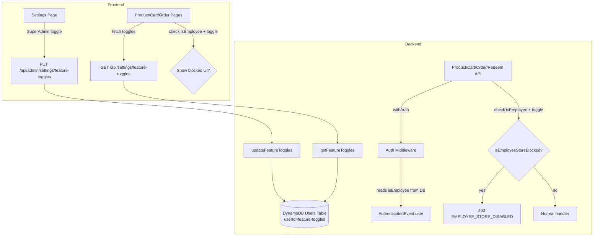

# 设计文档：员工商城访问控制（Employee Store Access Control）

## Overview

本功能在现有的 Feature Toggles 系统中新增 `employeeStoreEnabled` 布尔开关，由 SuperAdmin 控制。当开关关闭时，后端 API 层拦截员工用户（`isEmployee: true`）对商城相关接口的访问，前端展示友好的拦截提示。非员工用户和非商城功能完全不受影响。

### 设计目标

- **最小侵入**：复用现有 Feature Toggles 读写机制，仅新增一个字段
- **后端为主**：访问控制在 API 层执行，前端提示为辅助体验优化
- **向后兼容**：旧数据缺少该字段时默认为 `true`（员工可用），不影响现有功能

## Architecture



### 关键决策

1. **`isEmployee` 通过 auth middleware 传递**：auth middleware 已经在每次请求时读取用户记录（roles, status），只需在 ProjectionExpression 中增加 `isEmployee` 字段，将其附加到 `AuthenticatedUser` 接口上。零额外 DynamoDB 调用。

2. **检查逻辑提取为纯函数**：将 `isEmployeeStoreBlocked(isEmployee, employeeStoreEnabled)` 提取为独立纯函数，便于各 handler 复用和单元测试。

3. **Product List API 特殊处理**：返回空列表 + `employeeStoreBlocked: true` 标记（而非 403），让前端能区分"无商品"和"被拦截"，展示不同 UI。

4. **前端双重检查**：前端通过 `GET /api/settings/feature-toggles` 获取开关状态，结合用户 profile 中的 `isEmployee` 字段，在页面级别提前展示拦截 UI，避免无意义的 API 调用。

## Components and Interfaces

### 1. Shared Error Code

在 `packages/shared/src/errors.ts` 中新增：

```typescript
// ErrorCodes
EMPLOYEE_STORE_DISABLED: 'EMPLOYEE_STORE_DISABLED',

// ErrorHttpStatus
[ErrorCodes.EMPLOYEE_STORE_DISABLED]: 403,

// ErrorMessages
[ErrorCodes.EMPLOYEE_STORE_DISABLED]: '员工商城功能暂时关闭',
```

### 2. Feature Toggles 扩展

**文件**: `packages/backend/src/settings/feature-toggles.ts`

```typescript
// FeatureToggles interface 新增
export interface FeatureToggles {
  // ... existing fields ...
  /** Whether employee users can access store functions (browse, cart, order, redeem) */
  employeeStoreEnabled: boolean;
}

// DEFAULT_TOGGLES 新增
const DEFAULT_TOGGLES: FeatureToggles = {
  // ... existing defaults ...
  employeeStoreEnabled: true,  // 默认允许员工使用商城
};

// getFeatureToggles 读取逻辑
// 使用 `result.Item.employeeStoreEnabled !== false` 模式（与 adminProductsEnabled 一致）
// 缺失或非布尔值时默认为 true

// UpdateFeatureTogglesInput 新增
export interface UpdateFeatureTogglesInput {
  // ... existing fields ...
  employeeStoreEnabled: boolean;
}

// updateFeatureToggles 验证逻辑
// 新增 typeof input.employeeStoreEnabled !== 'boolean' 检查
// UpdateExpression 新增 employeeStoreEnabled = :ese
```

### 3. Auth Middleware 扩展

**文件**: `packages/backend/src/middleware/auth-middleware.ts`

```typescript
export interface AuthenticatedUser {
  userId: string;
  email?: string;
  roles: string[];
  isEmployee: boolean;  // 新增
}
```

修改 `withAuth` 中的 DynamoDB ProjectionExpression，增加 `isEmployee`：

```typescript
// 当前: ProjectionExpression: 'rolesVersion, #r, #s'
// 修改: ProjectionExpression: 'rolesVersion, #r, #s, isEmployee'

// 构建 authenticatedEvent.user 时：
authenticatedEvent.user = {
  userId: payload.userId,
  email: payload.email,
  roles,
  isEmployee: userRecord?.Item?.isEmployee === true,  // 缺失时默认 false
};
```

注意：两个分支（`needsDbRead` 和 old token）都需要读取 `isEmployee` 并传递。

### 4. Employee Store Check 纯函数

**新文件**: `packages/backend/src/middleware/employee-store-check.ts`

```typescript
/**
 * 判断员工用户是否被拦截使用商城。
 * 仅当 isEmployee=true 且 employeeStoreEnabled=false 时返回 true。
 */
export function isEmployeeStoreBlocked(
  isEmployee: boolean,
  employeeStoreEnabled: boolean,
): boolean {
  return isEmployee && !employeeStoreEnabled;
}
```

### 5. 受影响的 API Handlers

以下 handler 需要在路由入口处增加员工商城检查：

| Handler 文件 | 受影响路由 | 拦截行为 |
|---|---|---|
| `products/handler.ts` | `GET /api/products` | 返回 `{ products: [], employeeStoreBlocked: true }` |
| `products/handler.ts` | `GET /api/products/:id` | 返回 403 `EMPLOYEE_STORE_DISABLED` |
| `cart/handler.ts` | `POST /api/cart/items` | 返回 403 `EMPLOYEE_STORE_DISABLED` |
| `cart/handler.ts` | `GET /api/cart` | 返回 403 `EMPLOYEE_STORE_DISABLED` |
| `points/handler.ts` | `POST /api/points/redeem-code` | 返回 403 `EMPLOYEE_STORE_DISABLED` |
| `orders/handler.ts` | `POST /api/orders` | 返回 403 `EMPLOYEE_STORE_DISABLED` |
| `orders/handler.ts` | `POST /api/orders/direct` | 返回 403 `EMPLOYEE_STORE_DISABLED` |

**实现模式**（以 products handler 为例）：

```typescript
import { getFeatureToggles } from '../settings/feature-toggles';
import { isEmployeeStoreBlocked } from '../middleware/employee-store-check';

// GET /api/products
if (method === 'GET' && path === '/api/products') {
  const toggles = await getFeatureToggles(dynamoClient, USERS_TABLE);
  if (isEmployeeStoreBlocked(event.user.isEmployee, toggles.employeeStoreEnabled)) {
    return jsonResponse(200, { products: [], employeeStoreBlocked: true });
  }
  return await handleListProducts(event);
}

// GET /api/products/:id
if (method === 'GET') {
  const match = path.match(PRODUCT_DETAIL_REGEX);
  if (match) {
    const toggles = await getFeatureToggles(dynamoClient, USERS_TABLE);
    if (isEmployeeStoreBlocked(event.user.isEmployee, toggles.employeeStoreEnabled)) {
      return errorResponse('EMPLOYEE_STORE_DISABLED', '员工商城功能暂时关闭', 403);
    }
    return await handleGetProductDetail(match[1], event);
  }
}
```

### 6. Frontend Settings Page

**文件**: `packages/frontend/src/pages/admin/settings.tsx`

在 `FeatureToggles` 接口中新增 `employeeStoreEnabled: boolean`。

在 feature-toggles 分类的渲染区域中，仅当 `isSuperAdmin` 时显示员工商城开关：

```tsx
{isSuperAdmin && (
  <View className='settings-toggle-item'>
    <View className='settings-toggle-info'>
      <Text className='settings-toggle-label'>{t('admin.settings.employeeStoreLabel')}</Text>
      <Text className='settings-toggle-desc'>{t('admin.settings.employeeStoreDesc')}</Text>
    </View>
    <Switch
      checked={settings.employeeStoreEnabled}
      onChange={(e) => handleToggleChange('employeeStoreEnabled', e.detail.value)}
    />
  </View>
)}
```

### 7. Frontend Blocked State UI

在商品列表页、商品详情页、购物车页中，检测到员工被拦截时展示统一的拦截提示组件：

**新组件**: `packages/frontend/src/components/EmployeeStoreBlocked.tsx`

```tsx
export default function EmployeeStoreBlocked() {
  const { t } = useTranslation();
  return (
    <View className='employee-store-blocked'>
      <View className='employee-store-blocked__icon'>
        <LockIcon size={48} color='var(--text-tertiary)' />
      </View>
      <Text className='employee-store-blocked__title'>
        {t('store.employeeBlocked.title')}
      </Text>
      <Text className='employee-store-blocked__desc'>
        {t('store.employeeBlocked.description')}
      </Text>
    </View>
  );
}
```

**前端检测逻辑**：

商品列表页已通过 `GET /api/settings/feature-toggles` 获取开关状态。需要额外获取用户的 `isEmployee` 状态。方案：

- 在 `GET /api/user/profile` 响应中增加 `isEmployee` 字段
- 前端 store 的 `UserState` 接口增加 `isEmployee?: boolean`
- `fetchProfile` 时保存 `isEmployee` 到 store

页面级检测：
```typescript
const user = useAppStore((s) => s.user);
const isEmployee = user?.isEmployee ?? false;
// featureToggles 已通过 GET /api/settings/feature-toggles 获取
const isBlocked = isEmployee && !featureToggles.employeeStoreEnabled;
```

### 8. User Profile API 扩展

**文件**: `packages/backend/src/user/profile.ts`

在 `getUserProfile` 返回的 profile 对象中增加 `isEmployee` 字段：

```typescript
return {
  success: true,
  profile: {
    // ... existing fields ...
    isEmployee: userRecord.isEmployee === true,
  },
};
```

## Data Models

### Feature Toggles Record (DynamoDB)

```
userId: "feature-toggles"  (partition key)
employeeStoreEnabled: boolean  (新增，缺失时默认 true)
// ... 其他现有字段不变 ...
```

### User Record (DynamoDB) — 无变更

```
userId: string  (partition key)
isEmployee: boolean  (已存在，通过员工邀请注册时设为 true)
// ... 其他字段不变 ...
```

### AuthenticatedUser (运行时) — 扩展

```typescript
interface AuthenticatedUser {
  userId: string;
  email?: string;
  roles: string[];
  isEmployee: boolean;  // 新增，从 DB 读取
}
```

### Frontend UserState — 扩展

```typescript
interface UserState {
  userId: string;
  nickname: string;
  email?: string;
  roles: UserRole[];
  points: number;
  isEmployee?: boolean;  // 新增，从 profile API 获取
}
```

### i18n Keys — 新增

```typescript
// admin.settings 命名空间
'admin.settings.employeeStoreLabel': '员工商城访问',
'admin.settings.employeeStoreDesc': '关闭后，AWS 员工将无法浏览商品、加入购物车、下单和兑换码',

// store 命名空间
'store.employeeBlocked.title': '商城功能暂时关闭',
'store.employeeBlocked.description': '当前商城功能对员工用户暂时不可用，请联系管理员了解详情。',
```

需要在所有 5 个 locale 文件中添加对应翻译（zh, en, ja, ko, zh-TW）。

## Correctness Properties

*A property is a characteristic or behavior that should hold true across all valid executions of a system — essentially, a formal statement about what the system should do. Properties serve as the bridge between human-readable specifications and machine-verifiable correctness guarantees.*

### Property 1: Safe default for employeeStoreEnabled

*For any* DynamoDB feature-toggles record where the `employeeStoreEnabled` field is missing, `undefined`, `null`, or any non-boolean value, `getFeatureToggles` SHALL return `employeeStoreEnabled: true`.

**Validates: Requirements 1.2, 1.4, 8.2**

### Property 2: Existing fields unaffected by new toggle

*For any* valid feature-toggles record, the values of all existing fields (codeRedemptionEnabled, pointsClaimEnabled, adminProductsEnabled, etc.) returned by `getFeatureToggles` SHALL be identical regardless of whether `employeeStoreEnabled` is present, absent, or set to any value.

**Validates: Requirements 1.3, 8.1**

### Property 3: Employee store access check correctness

*For any* combination of `isEmployee` (boolean) and `employeeStoreEnabled` (boolean), `isEmployeeStoreBlocked` SHALL return `true` if and only if `isEmployee === true` AND `employeeStoreEnabled === false`. In all other cases it SHALL return `false`.

**Validates: Requirements 3.1, 3.2, 3.3, 3.4, 3.5, 3.6, 3.7, 6.1, 6.2, 6.3, 6.4**

### Property 4: Update validation rejects non-boolean employeeStoreEnabled

*For any* `updateFeatureToggles` input where `employeeStoreEnabled` is not a boolean (string, number, null, undefined, object, array), the function SHALL return `{ success: false }` with error code `INVALID_REQUEST`.

**Validates: Requirements 7.3**

### Property 5: Feature toggles round-trip preservation

*For any* valid feature-toggles object (including `employeeStoreEnabled`), writing it via `updateFeatureToggles` and then reading it back via `getFeatureToggles` SHALL produce an equivalent object for all toggle fields.

**Validates: Requirements 8.4**

## Error Handling

| 场景 | 错误码 | HTTP 状态 | 消息 |
|---|---|---|---|
| 员工用户访问被禁用的商城 API | `EMPLOYEE_STORE_DISABLED` | 403 | 员工商城功能暂时关闭 |
| 更新开关时 employeeStoreEnabled 非布尔 | `INVALID_REQUEST` | 400 | 请求参数无效 |
| 非 SuperAdmin 尝试更新开关 | `FORBIDDEN` | 403 | 需要超级管理员权限 |
| DynamoDB 读取失败 | — | — | 安全降级：`employeeStoreEnabled` 默认 `true`（不阻断员工） |

**安全降级策略**：当 feature toggles 读取失败时，`getFeatureToggles` 返回默认值（`employeeStoreEnabled: true`），确保故障时不会误拦截员工用户。这与现有的安全降级模式一致。

## Testing Strategy

### Property-Based Tests

使用 `fast-check` 库进行属性测试，每个属性至少 100 次迭代。

| 测试文件 | 覆盖属性 | 说明 |
|---|---|---|
| `employee-store-check.property.test.ts` | Property 3 | 生成随机 (isEmployee, employeeStoreEnabled) 组合，验证 `isEmployeeStoreBlocked` 的正确性 |
| `feature-toggles.property.test.ts` | Property 1, 2, 4, 5 | 生成随机 DynamoDB 记录，验证读取默认值、字段隔离、验证拒绝、round-trip |

每个属性测试必须包含注释引用设计属性：
```typescript
// Feature: employee-store-access, Property 3: Employee store access check correctness
```

### Unit Tests (Example-Based)

| 测试文件 | 覆盖需求 | 说明 |
|---|---|---|
| `feature-toggles.test.ts` | 1.1, 7.1, 7.2, 8.3 | 默认值包含 employeeStoreEnabled、API 响应包含字段、contentRolePermissions 独立更新不受影响 |
| `products/handler.test.ts` | 3.1, 3.2 | 员工被拦截时 product list 返回空列表 + blocked 标记、product detail 返回 403 |
| `cart/handler.test.ts` | 3.3 | 员工被拦截时 cart add 返回 403 |
| `points/handler.test.ts` | 3.5 | 员工被拦截时 redeem 返回 403 |

### Integration Tests

| 场景 | 覆盖需求 |
|---|---|
| 员工登录 → 关闭开关 → 访问商品列表 → 收到空列表 + blocked 标记 | 5.1, 3.1 |
| 员工登录 → 关闭开关 → 访问个人资料 → 正常返回 | 5.2 |
| 非员工登录 → 关闭开关 → 访问商品列表 → 正常返回商品 | 6.1 |

### Frontend Tests

| 场景 | 覆盖需求 |
|---|---|
| SuperAdmin 设置页面显示员工商城开关 | 2.1, 2.3, 2.5 |
| Admin 设置页面不显示员工商城开关 | 2.2 |
| 员工用户 + 开关关闭 → 商品列表页显示拦截提示 | 4.1 |
| 非员工用户 + 开关关闭 → 商品列表页正常显示 | 6.1 |
