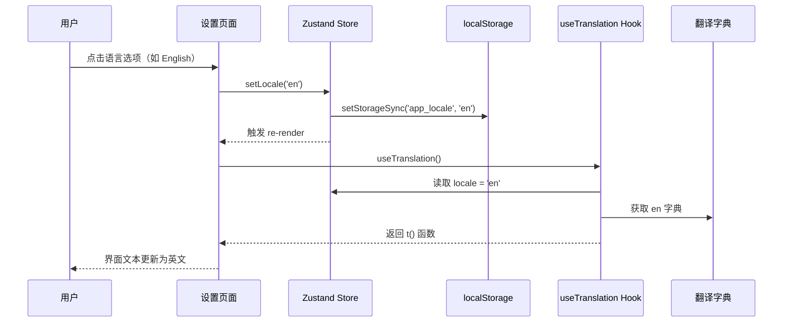
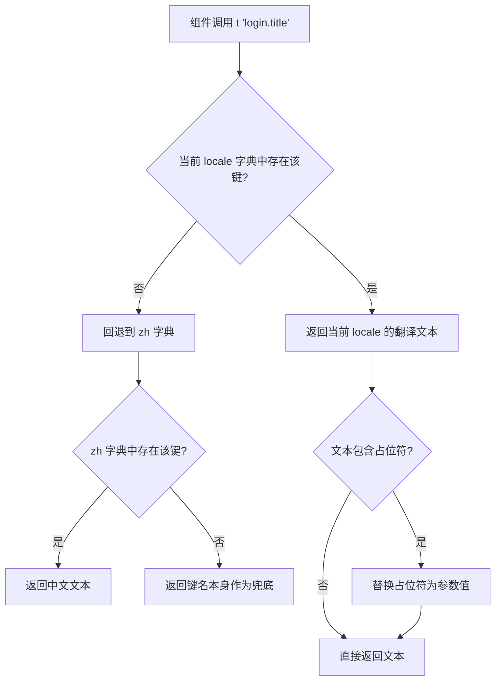

# 设计文档：多语言（i18n）支持

## 概述

为积分商城前端添加轻量级自定义国际化方案，支持中文（zh）、英文（en）、日文（ja）、韩文（ko）四种语言。方案不引入外部 i18n 库，通过 TypeScript 类型系统保证翻译键完整性，通过 Zustand store + localStorage 实现语言持久化。

### 核心变更

1. **i18n 模块**：新建 `packages/frontend/src/i18n/` 目录，包含类型定义、翻译字典、`useTranslation` Hook
2. **Store 扩展**：在现有 Zustand store 中新增 `locale` 状态字段和 `setLocale` 方法，复用 `theme` 的持久化模式
3. **页面改造**：所有页面组件使用 `useTranslation` Hook 替换硬编码中文字符串
4. **语言切换 UI**：在设置页面新增语言切换组件，样式与主题切换一致

### 设计决策

- **自定义方案 vs i18n 库**：项目 UI 文本量有限（约 300-400 个键），自定义方案零依赖、包体积小、与 Taro 兼容性好，无需处理复杂的复数/性别/日期格式化
- **静态 TS 文件 vs JSON**：使用 `.ts` 文件存放翻译字典，可直接获得 TypeScript 类型检查和 tree-shaking，编译时即可发现缺失键
- **中文作为 fallback**：中文是主要用户语言且翻译最完整，作为回退语言最合理
- **仅翻译 UI 文本**：商品名称、描述、用户昵称等动态内容来自 API，不做翻译，避免误翻译和维护负担

## 架构

### 模块结构

```
packages/frontend/src/i18n/
├── index.ts          # 导出 useTranslation Hook 和类型
├── types.ts          # TranslationDict 类型定义（嵌套键结构）
├── zh.ts             # 中文字典（基准）
├── en.ts             # 英文字典
├── ja.ts             # 日文字典
└── ko.ts             # 韩文字典
```

### 数据流



### 翻译函数调用流程



## 组件与接口

### 1. 类型定义（types.ts）

```typescript
/** 支持的语言标识 */
export type Locale = 'zh' | 'en' | 'ja' | 'ko';

/** 翻译字典结构（嵌套对象，叶节点为 string） */
export interface TranslationDict {
  common: {
    loading: string;
    loadMore: string;
    noData: string;
    confirm: string;
    cancel: string;
    delete: string;
    edit: string;
    save: string;
    back: string;
    submit: string;
    submitting: string;
    success: string;
    failed: string;
    retry: string;
    points: string;
    pointsUnit: string;
    // ... 更多公共键
  };
  tabBar: {
    mall: string;
    cart: string;
    orders: string;
    profile: string;
  };
  login: {
    title: string;
    subtitle: string;
    emailLabel: string;
    emailPlaceholder: string;
    passwordLabel: string;
    passwordPlaceholder: string;
    loginButton: string;
    loggingIn: string;
    forgotPassword: string;
    noAccount: string;
    registerLink: string;
    errorInvalidCredentials: string;
    errorAccountLocked: string;
    errorDefault: string;
    // 表单验证
    errorEmailRequired: string;
    errorEmailInvalid: string;
    errorPasswordRequired: string;
    errorPasswordInvalid: string;
  };
  register: { /* 注册页所有键 */ };
  forgotPassword: { /* 忘记密码页所有键 */ };
  resetPassword: { /* 重置密码页所有键 */ };
  mall: { /* 商城首页所有键 */ };
  product: { /* 商品详情页所有键 */ };
  redeem: { /* 兑换页所有键 */ };
  cart: { /* 购物车页所有键 */ };
  orderConfirm: { /* 订单确认页所有键 */ };
  orders: { /* 订单列表页所有键 */ };
  orderDetail: { /* 订单详情页所有键 */ };
  profile: { /* 个人中心页所有键 */ };
  settings: { /* 设置页所有键 */ };
  address: { /* 收货地址页所有键 */ };
  claims: { /* 积分申请页所有键 */ };
  admin: {
    dashboard: { /* 管理后台首页 */ };
    products: { /* 商品管理 */ };
    codes: { /* Code 管理 */ };
    users: { /* 用户管理 */ };
    orders: { /* 订单管理 */ };
    invites: { /* 邀请管理 */ };
    claims: { /* 积分审批 */ };
  };
}
```

每种语言的字典文件必须满足 `TranslationDict` 类型，TypeScript 编译器会在缺少任何键时报错。

### 2. useTranslation Hook（index.ts）

```typescript
import { useAppStore } from '../store';
import type { Locale, TranslationDict } from './types';
import { zh } from './zh';
import { en } from './en';
import { ja } from './ja';
import { ko } from './ko';

const dictionaries: Record<Locale, TranslationDict> = { zh, en, ja, ko };

/**
 * 根据点分隔的键路径从嵌套对象中取值
 * 例如 getNestedValue(dict, 'login.title') => dict.login.title
 */
function getNestedValue(obj: Record<string, any>, path: string): string | undefined {
  return path.split('.').reduce((acc, key) => acc?.[key], obj) as string | undefined;
}

/**
 * 替换翻译文本中的 {paramName} 占位符
 */
function interpolate(text: string, params?: Record<string, string | number>): string {
  if (!params) return text;
  return text.replace(/\{(\w+)\}/g, (match, key) => {
    return key in params ? String(params[key]) : match;
  });
}

export function useTranslation() {
  const locale = useAppStore((s) => s.locale);
  const dict = dictionaries[locale] || dictionaries.zh;
  const fallback = dictionaries.zh;

  const t = (key: string, params?: Record<string, string | number>): string => {
    const value = getNestedValue(dict as any, key)
      ?? getNestedValue(fallback as any, key)
      ?? key;
    return interpolate(value, params);
  };

  return { t, locale };
}
```

### 3. Store 扩展

在现有 `useAppStore` 中新增：

```typescript
import type { Locale } from '../i18n/types';

// 在 AppState 接口中新增：
locale: Locale;
setLocale: (locale: Locale) => void;

// 在 create() 中新增初始化和 setter：
locale: ((): Locale => {
  try {
    const saved = Taro.getStorageSync('app_locale');
    if (['zh', 'en', 'ja', 'ko'].includes(saved)) return saved as Locale;
  } catch { /* ignore */ }
  return 'zh';
})(),

setLocale: (locale) => {
  try { Taro.setStorageSync('app_locale', locale); } catch { /* ignore */ }
  set({ locale });
},
```

模式与现有 `theme` / `setTheme` 完全一致。

### 4. 语言切换组件（设置页）

在设置页面的主题切换区域下方，新增语言切换组件：

```typescript
const LOCALE_OPTIONS: { key: Locale; label: string }[] = [
  { key: 'zh', label: '中文' },
  { key: 'en', label: 'English' },
  { key: 'ja', label: '日本語' },
  { key: 'ko', label: '한국어' },
];
```

视觉样式复用 `profile-theme-toggle` 的 CSS 类名模式，保持一致的选项卡外观。

### 5. 页面消费方式

每个页面组件在顶部调用 Hook，然后用 `t()` 替换硬编码字符串：

```typescript
// 改造前
<Text>购物车</Text>
<Text>加载中...</Text>
Taro.showToast({ title: '删除成功', icon: 'success' });

// 改造后
const { t } = useTranslation();
<Text>{t('cart.title')}</Text>
<Text>{t('common.loading')}</Text>
Taro.showToast({ title: t('common.deleteSuccess'), icon: 'success' });

// 带参数的翻译
<Text>{t('redeem.pointsEarned', { count: 100 })}</Text>
// 对应字典：'redeem.pointsEarned': '获得 {count} 积分'
```

### 6. TabBar 翻译

TabBar 组件中的 `TABS` 数组的 `label` 字段当前是硬编码中文。改造方案：

- TabBar 组件内部调用 `useTranslation()`
- 将 `TABS` 中的 `label` 改为翻译键引用
- 渲染时通过 `t()` 获取当前语言的标签文本

## 数据模型

### 翻译键命名规范

采用 `模块.功能描述` 的点分隔命名：

| 前缀 | 说明 | 示例 |
|------|------|------|
| `common.*` | 全局通用文本 | `common.loading`、`common.confirm` |
| `tabBar.*` | 底部导航标签 | `tabBar.mall`、`tabBar.cart` |
| `login.*` | 登录页 | `login.title`、`login.emailPlaceholder` |
| `register.*` | 注册页 | `register.title`、`register.nicknameLabel` |
| `mall.*` | 商城首页 | `mall.greeting`、`mall.filterAll` |
| `product.*` | 商品详情页 | `product.addToCart`、`product.outOfStock` |
| `cart.*` | 购物车页 | `cart.title`、`cart.empty` |
| `orders.*` | 订单列表页 | `orders.title`、`orders.noOrders` |
| `profile.*` | 个人中心页 | `profile.pointsLabel`、`profile.quickActions` |
| `settings.*` | 设置页 | `settings.title`、`settings.language` |
| `admin.*` | 管理后台 | `admin.dashboard.title`、`admin.products.create` |

### Locale 持久化

| 存储位置 | 键名 | 值 | 说明 |
|---------|------|-----|------|
| localStorage | `app_locale` | `zh` / `en` / `ja` / `ko` | 通过 `Taro.getStorageSync` / `setStorageSync` 读写 |

### 翻译字典估算

| 模块 | 预估键数 |
|------|---------|
| common | ~30 |
| tabBar | 4 |
| login | ~15 |
| register | ~20 |
| forgotPassword | ~10 |
| resetPassword | ~12 |
| mall | ~15 |
| product | ~20 |
| redeem | ~25 |
| cart | ~20 |
| orderConfirm | ~15 |
| orders | ~15 |
| orderDetail | ~15 |
| profile | ~20 |
| settings | ~15 |
| address | ~15 |
| claims | ~25 |
| admin（合计） | ~60 |
| **总计** | **~350** |


## 正确性属性（Correctness Properties）

*属性（Property）是指在系统所有有效执行中都应成立的特征或行为——本质上是对系统应做什么的形式化陈述。属性是人类可读规格说明与机器可验证正确性保证之间的桥梁。*

### Property 1: 翻译字典键集完整性

*For all* 非中文 Locale（en、ja、ko），该 Locale 的翻译字典的键集合（递归展开所有嵌套键路径）应与中文（zh）字典的键集合完全相同。

**Validates: Requirements 1.1, 5.1**

### Property 2: 翻译键回退到中文

*For any* Locale 和 *any* 在中文字典中存在的翻译键路径，如果该键在当前 Locale 字典中不存在，则 `t(key)` 应返回中文字典中对应的值。

**Validates: Requirements 1.4**

### Property 3: Locale 持久化往返一致性

*For any* 有效的 Locale 值，调用 `setLocale(locale)` 后，从 localStorage 读取 `app_locale` 的值应等于所设置的 Locale。

**Validates: Requirements 2.3, 2.4**

### Property 4: 参数插值正确性

*For any* 包含 `{paramName}` 占位符的翻译文本和 *any* 提供了对应参数的 params 对象，`interpolate` 函数应将所有匹配的占位符替换为参数值，且不改变文本中非占位符的部分。

**Validates: Requirements 7.1, 7.3**

### Property 5: 翻译字典 JSON 往返一致性

*For all* 翻译字典，`JSON.parse(JSON.stringify(dict))` 应产生与原始字典深度相等的对象。

**Validates: Requirements 1.6**

### Property 6: 语言切换更新 Store 状态

*For any* 有效的 Locale 选项，在设置页面点击该选项后，Store 中的 `locale` 值应更新为对应的 Locale，且该选项应获得激活状态的 CSS 类名。

**Validates: Requirements 3.3, 3.4**

## 错误处理

| 场景 | 处理方式 |
|------|---------|
| 翻译键在当前 Locale 字典中不存在 | 回退到 zh 字典 |
| 翻译键在 zh 字典中也不存在 | 返回键名本身（如 `login.title`），便于开发时发现遗漏 |
| localStorage 中 `app_locale` 值无效 | 忽略，使用默认值 `zh` |
| localStorage 读写异常（隐私模式等） | try-catch 静默处理，使用内存中的 locale 值 |
| 占位符参数缺失 | 保留原始占位符文本 `{paramName}` 不替换 |
| 占位符参数多余（提供了文本中不存在的参数） | 忽略多余参数，不影响输出 |

## 测试策略

### 双重测试方法

本功能采用单元测试 + 属性测试的双重策略：

- **单元测试**：验证具体示例、边界情况和错误条件
- **属性测试**：验证跨所有输入的通用属性

### 属性测试配置

- **测试库**：使用 `fast-check` 作为属性测试库（TypeScript 生态最成熟的 PBT 库）
- **迭代次数**：每个属性测试至少运行 100 次
- **标签格式**：每个测试用注释标注对应的设计属性
  - 格式：`Feature: i18n-multi-language, Property {number}: {property_text}`
- **每个正确性属性由单个属性测试实现**

### 单元测试范围

| 测试目标 | 测试内容 |
|---------|---------|
| `useTranslation` Hook | 默认返回中文翻译；切换 locale 后返回对应语言 |
| `interpolate` 函数 | 无参数时原样返回；多个占位符替换；嵌套大括号处理 |
| Store `setLocale` | 调用后 locale 状态更新；localStorage 写入正确值 |
| Store 初始化 | localStorage 有有效值时使用；无效值时回退 zh |
| 设置页语言切换 | 渲染 4 个选项；点击切换；激活状态高亮 |
| TabBar | 不同 locale 下标签文本正确 |

### 属性测试范围

| 属性 | 测试策略 |
|------|---------|
| Property 1: 键集完整性 | 生成随机 Locale，提取所有键路径，与 zh 比较 |
| Property 2: 回退到中文 | 构造缺失键的场景，验证 t() 返回 zh 值 |
| Property 3: Locale 持久化 | 生成随机有效 Locale，setLocale 后读取 localStorage 验证 |
| Property 4: 参数插值 | 生成随机文本模板和参数对象，验证替换正确性 |
| Property 5: JSON 往返 | 对所有字典执行 JSON 序列化/反序列化，验证深度相等 |
| Property 6: 语言切换 | 生成随机 Locale 选项，模拟点击，验证 Store 状态 |
