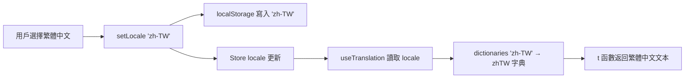

# 設計文檔：新增繁體中文（zh-TW）語言支持

## 概述

在現有多語言（i18n）系統中新增繁體中文（zh-TW）作為第五種語言。現有架構已支持 zh、en、ja、ko 四種語言，本次擴展遵循完全相同的模式，不改變任何現有架構。

### 核心變更

1. `types.ts`：Locale 聯合類型新增 `'zh-TW'`
2. `zh-TW.ts`：新建繁體中文翻譯字典文件（約 350 個鍵，從 zh.ts 簡轉繁）
3. `index.ts`：dictionaries 映射新增 `'zh-TW'` 條目
4. `store/index.ts`：locale 驗證數組新增 `'zh-TW'`
5. `settings/index.tsx`：LOCALE_OPTIONS 新增繁體中文選項
6. `i18n.property.test.ts`：屬性測試覆蓋 zh-TW

### 設計決策

- **zh-TW 而非 zh-Hant**：使用 `zh-TW` 作為 locale 標識符，與 BCP 47 語言標籤一致，且更直觀地表示「台灣繁體中文」
- **獨立字典文件而非運行時轉換**：雖然可以用 OpenCC 等庫在運行時將簡體轉繁體，但靜態字典文件更可靠、零運行時開銷、可人工校對特定用語差異（如「信息」vs「資訊」）
- **複用現有 fallback 機制**：zh-TW 的 fallback 仍為 zh（簡體中文），與其他語言一致

## 架構

本次擴展不改變現有架構，僅在各層新增 zh-TW 支持：

```
packages/frontend/src/i18n/
├── index.ts          # dictionaries 新增 'zh-TW': zhTW
├── types.ts          # Locale 新增 'zh-TW'
├── zh.ts             # 簡體中文（基準，不變）
├── zh-TW.ts          # 【新增】繁體中文字典
├── en.ts             # 英文（不變）
├── ja.ts             # 日文（不變）
└── ko.ts             # 韓文（不變）
```

數據流與現有語言完全一致：



## 組件與接口

### 1. 類型定義變更（types.ts）

```typescript
// 變更前
export type Locale = 'zh' | 'en' | 'ja' | 'ko';

// 變更後
export type Locale = 'zh' | 'en' | 'ja' | 'ko' | 'zh-TW';
```

### 2. 繁體中文字典（zh-TW.ts）

新建文件，導出 `zhTW` 常量，實現 `TranslationDict` 介面。所有值為 zh.ts 對應值的繁體中文轉換：

```typescript
import type { TranslationDict } from './types';

export const zhTW: TranslationDict = {
  common: {
    loading: '載入中...',
    loadMore: '載入更多',
    noData: '暫無資料',
    confirm: '確認',
    cancel: '取消',
    // ... 所有鍵的繁體中文翻譯
  },
  // ... 所有模組
};
```

簡繁轉換要點：
- 基礎字詞轉換：加载→載入、数据→資料、信息→資訊、视频→影片
- 用語差異：积分→積分、商城→商城、购物车→購物車
- 標點符號保持一致（中文標點）

### 3. 翻譯模組註冊（index.ts）

```typescript
// 新增 import
import { zhTW } from './zh-TW';

// dictionaries 新增條目
const dictionaries: Record<Locale, TranslationDict> = {
  zh, en, ja, ko,
  'zh-TW': zhTW,
};
```

### 4. Store 驗證更新（store/index.ts）

```typescript
// 變更前
if (['zh', 'en', 'ja', 'ko'].includes(saved)) return saved as Locale;

// 變更後
if (['zh', 'en', 'ja', 'ko', 'zh-TW'].includes(saved)) return saved as Locale;
```

### 5. 設置頁面選項（settings/index.tsx）

```typescript
const LOCALE_OPTIONS: { key: Locale; label: string }[] = [
  { key: 'zh', label: '中文' },
  { key: 'zh-TW', label: '繁體中文' },
  { key: 'en', label: 'English' },
  { key: 'ja', label: '日本語' },
  { key: 'ko', label: '한국어' },
];
```

繁體中文選項放在簡體中文之後，因為兩者關聯性最強。

## 數據模型

### Locale 持久化

| 存儲位置 | 鍵名 | 新增值 | 說明 |
|---------|------|--------|------|
| localStorage | `app_locale` | `'zh-TW'` | 與現有 zh/en/ja/ko 並列 |

### 翻譯字典規模

zhTW 字典與 zh 字典鍵數完全相同（約 350 個鍵），僅值不同。

## 正確性屬性（Correctness Properties）

*屬性（Property）是指在系統所有有效執行中都應成立的特徵或行為——本質上是對系統應做什麼的形式化陳述。屬性是人類可讀規格說明與機器可驗證正確性保證之間的橋樑。*

本功能的正確性屬性是對現有 i18n-multi-language 屬性測試的擴展，將 zh-TW 納入已有的屬性驗證範圍。

### Property 1: 翻譯字典鍵集完整性（擴展）

*For all* 非中文 Locale（en、ja、ko、zh-TW），該 Locale 的翻譯字典的鍵集合（遞歸展開所有嵌套鍵路徑）應與中文（zh）字典的鍵集合完全相同。

**Validates: Requirements 2.2, 2.4, 6.1, 6.3**

### Property 2: 翻譯字典 JSON 往返一致性（擴展）

*For all* 翻譯字典（包含 zhTW），`JSON.parse(JSON.stringify(dict))` 應產生與原始字典深度相等的對象。

**Validates: Requirements 6.2**

## 錯誤處理

本次擴展不引入新的錯誤場景，所有錯誤處理複用現有機制：

| 場景 | 處理方式 |
|------|---------|
| localStorage 中 `app_locale` 為 `'zh-TW'` | 正常識別，使用 zhTW 字典 |
| zhTW 字典中某鍵缺失 | 回退到 zh 字典（現有 fallback 機制） |
| 舊版本客戶端不認識 `'zh-TW'` | 不影響，驗證數組不包含時回退到 `'zh'` |

## 測試策略

### 屬性測試（擴展現有測試）

本功能通過擴展現有 `i18n.property.test.ts` 中的屬性測試來覆蓋 zh-TW：

- **測試庫**：fast-check（已在使用）
- **迭代次數**：每個屬性測試至少 100 次
- **標籤格式**：`Feature: i18n-multi-language, Property {number}: {property_text}`

| 屬性 | 擴展方式 |
|------|---------|
| Property 1: 鍵集完整性 | `dictMap` 新增 `'zh-TW': zhTW`，`constantFrom` 新增 `'zh-TW'` |
| Property 5: JSON 往返 | `allDicts` 數組新增 `{ name: 'zh-TW', dict: zhTW }` |

### 單元測試

| 測試目標 | 測試內容 |
|---------|---------|
| Store 初始化 | localStorage 為 `'zh-TW'` 時正確初始化 |
| `setLocale('zh-TW')` | locale 狀態更新，localStorage 寫入正確 |
| `useTranslation` | locale 為 `'zh-TW'` 時返回 zhTW 字典的值 |
| 設置頁面 | LOCALE_OPTIONS 包含繁體中文選項 |
