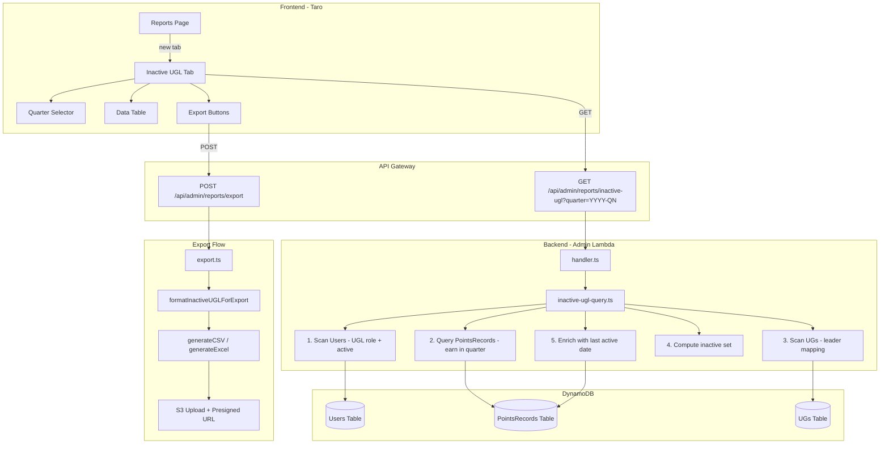

# Design Document: Inactive UGL Report (不活跃UGL报表)

## Overview

本功能为 SuperAdmin 提供按季度查看不活跃 UGL（User Group Leader）的报表。系统识别在指定季度内没有任何 UGL 或 SpecialActivity 类型积分记录的 UGL 用户，并以表格形式展示，支持 CSV/Excel 导出。

核心逻辑：
1. 从 Users 表扫描所有 active 且拥有 UserGroupLeader 角色的用户
2. 排除在季度开始后才注册的用户
3. 查询 PointsRecords 表获取该季度内 targetRole 为 UGL 或 SpecialActivity 的 earn 记录
4. 计算集合差：eligible UGLs - active UGLs = inactive UGLs
5. 为每个 inactive UGL 补充 UG 名称和最后活跃日期

## Architecture



### 设计决策

**决策 1：Users 表扫描策略**

Users 表没有按 role 的 GSI，因此需要使用 `entityType-createdAt-index` GSI 查询所有用户，然后在应用层过滤 `roles contains UserGroupLeader` 和 `status = active`。对于 500 以内的 UGL 用户规模，这是可接受的。

使用 `QueryCommand` on `entityType-createdAt-index`（PK=`user`）+ FilterExpression `contains(roles, :ugl) AND #status = :active`，与现有 `listUsers` 函数模式一致。

**决策 2：PointsRecords 查询策略**

复用现有 `type-createdAt-index` GSI，查询 `type='earn'` + `createdAt BETWEEN quarterStart AND quarterEnd`，再用 FilterExpression 过滤 `targetRole IN ('UserGroupLeader', 'SpecialActivity')`。这与现有报表查询模式完全一致。

**决策 3：UG 名称关联**

UGs 表（`PointsMall-UGs`）的 `leaderId` 字段关联用户。通过 Scan UGs 表构建 `leaderId → ugName` 映射，为每个 inactive UGL 查找其负责的 UG 名称。UGs 表数据量小（通常 < 50 条），Scan 成本可忽略。

**决策 4：Last_Active_Date 查询**

对每个 inactive UGL，需要查询其历史上最近一条 qualifying record。使用 `userId-createdAt-index` GSI（如果存在）或在初始 PointsRecords 全量查询中一并收集。考虑到性能，采用在全量 earn 记录查询时不限制日期范围会导致数据量过大，因此对每个 inactive UGL 单独查询其最近记录，使用 BatchGet 或逐个 Query。

优化方案：在查询季度内 earn 记录时，同时查询所有时间的 earn 记录（按 userId 分组取最大 createdAt）。但这会导致全表扫描。最终方案：对 inactive UGL 列表（通常 < 100 人），逐个使用 `type-createdAt-index` 反向查询最近一条 qualifying record（Limit=1, ScanIndexForward=false + FilterExpression on targetRole and userId）。

**决策 5：季度计算为纯函数**

季度解析、日期范围计算、eligible 过滤、inactive 集合差等核心逻辑抽取为纯函数，便于单元测试和 property-based testing。

## Components and Interfaces

### 1. 季度工具函数 (`packages/backend/src/reports/quarter-utils.ts`)

```typescript
/** 季度格式验证结果 */
export type QuarterValidationResult =
  | { valid: true; year: number; quarter: 1 | 2 | 3 | 4 }
  | { valid: false; error: { code: string; message: string } };

/** 季度日期范围 */
export interface QuarterDateRange {
  start: string; // ISO 8601, e.g. "2026-01-01T00:00:00.000Z"
  end: string;   // ISO 8601, e.g. "2026-03-31T23:59:59.999Z"
}

/**
 * 解析并验证季度字符串。
 * 格式: YYYY-QN (N = 1|2|3|4)
 * 如果是未来季度返回 FUTURE_QUARTER 错误。
 */
export function parseQuarter(quarter: string): QuarterValidationResult;

/**
 * 获取当前日历季度字符串。
 * 返回格式: "YYYY-QN"
 */
export function getCurrentQuarter(): string;

/**
 * 将季度转换为日期范围（UTC）。
 */
export function quarterToDateRange(year: number, quarter: 1 | 2 | 3 | 4): QuarterDateRange;

/**
 * 生成可选季度列表（从系统上线季度到当前季度）。
 * 返回 ["2024-Q1", "2024-Q2", ...] 降序排列。
 */
export function getAvailableQuarters(): string[];
```

### 2. Inactive UGL 查询模块 (`packages/backend/src/reports/inactive-ugl-query.ts`)

```typescript
/** Inactive UGL 查询筛选条件 */
export interface InactiveUGLFilter {
  quarter?: string; // "YYYY-QN" 格式，缺省为当前季度
}

/** Inactive UGL 记录（已关联 UG 名称和最后活跃日期） */
export interface InactiveUGLRecord {
  userId: string;
  nickname: string;
  email: string;
  ugName: string;         // 该 UGL 负责的 UG 名称（从 UGs 表 leaderId 关联）
  createdAt: string;      // 账号注册时间
  lastActiveDate: string | null; // 最近一次 qualifying record 的 createdAt，无则 null
}

/** Inactive UGL 查询结果 */
export interface InactiveUGLResult {
  success: boolean;
  records?: InactiveUGLRecord[];
  quarter?: string;       // 实际使用的季度值
  totalCount?: number;    // inactive UGL 总数
  error?: { code: string; message: string };
}

/**
 * 查询指定季度的不活跃 UGL 列表。
 * 
 * 步骤：
 * 1. 解析并验证 quarter 参数
 * 2. 查询所有 active UGL 用户（entityType-createdAt-index + filter）
 * 3. 过滤掉 createdAt >= quarterStart 的用户
 * 4. 查询季度内 earn 记录（type-createdAt-index + targetRole filter）
 * 5. 计算 inactive 集合 = eligible - active
 * 6. 查询 UGs 表获取 leaderId → ugName 映射
 * 7. 为每个 inactive UGL 查询 lastActiveDate
 * 8. 返回结果
 */
export async function queryInactiveUGLs(
  filter: InactiveUGLFilter,
  dynamoClient: DynamoDBDocumentClient,
  tables: {
    usersTable: string;
    pointsRecordsTable: string;
    ugsTable: string;
  },
): Promise<InactiveUGLResult>;
```

### 3. 纯函数（可测试核心逻辑）

```typescript
/** 用户记录（从 Users 表查询后的精简结构） */
export interface EligibleUser {
  userId: string;
  nickname: string;
  email: string;
  roles: string[];
  status: string;
  createdAt: string;
}

/**
 * 从用户列表中筛选 eligible UGLs：
 * - roles 包含 'UserGroupLeader'
 * - status === 'active'
 * - createdAt < quarterStart
 */
export function filterEligibleUGLs(
  users: EligibleUser[],
  quarterStart: string,
): EligibleUser[];

/**
 * 从 PointsRecords 中提取 active userId 集合：
 * - 仅保留 targetRole 为 'UserGroupLeader' 或 'SpecialActivity' 的记录
 * - 返回去重的 userId Set
 */
export function extractActiveUserIds(
  records: Array<{ userId: string; targetRole?: string }>,
): Set<string>;

/**
 * 计算 inactive UGL 列表 = eligible - active。
 */
export function computeInactiveUGLs(
  eligibleUsers: EligibleUser[],
  activeUserIds: Set<string>,
): EligibleUser[];

/**
 * 从 qualifying records 中找到指定用户的最近一条记录的 createdAt。
 * 如果没有记录，返回 null。
 */
export function findLastActiveDate(
  userId: string,
  records: Array<{ userId: string; createdAt: string; targetRole?: string }>,
): string | null;
```

### 4. Export 格式化 (`packages/backend/src/reports/formatters.ts` 扩展)

```typescript
// 新增 ReportType
export type ReportType = /* existing types */ | 'inactive-ugl';

// 新增列定义
const INACTIVE_UGL_COLUMNS: ColumnDef[] = [
  { key: 'nickname', label: '用户昵称' },
  { key: 'email', label: '邮箱' },
  { key: 'ugName', label: '负责UG' },
  { key: 'createdAt', label: '注册时间' },
  { key: 'lastActiveDate', label: '最后活跃时间' },
];

/** 将 InactiveUGLRecord 格式化为导出行 */
export function formatInactiveUGLForExport(
  records: InactiveUGLRecord[],
): Record<string, unknown>[];
```

### 5. Handler 路由 (`packages/backend/src/admin/handler.ts` 扩展)

```typescript
// GET /api/admin/reports/inactive-ugl — SuperAdmin only
if (method === 'GET' && path === '/api/admin/reports/inactive-ugl') {
  if (!isSuperAdmin(event.user.roles as UserRole[])) {
    return errorResponse(ErrorCodes.FORBIDDEN, '需要超级管理员权限', 403);
  }
  return await handleInactiveUGLReport(event);
}
```

### 6. Frontend Tab (`packages/frontend/src/pages/admin/reports.tsx` 扩展)

```typescript
// 新增 tab 类型
type ReportTab = /* existing */ | 'inactive-ugl';

// 新增 tab 配置
{ key: 'inactive-ugl', labelKey: 'admin.reports.tabInactiveUGL' }

// 新增 filter state
'inactive-ugl': {
  quarter: string; // "YYYY-QN"
}

// Tab 仅对 SuperAdmin 可见（复用 useSuperAdminGuard）
```

## Data Models

### Users Table (existing)

| Field | Type | Notes |
|-------|------|-------|
| userId | String (PK) | ULID |
| entityType | String | 'user' (GSI PK for entityType-createdAt-index) |
| email | String | |
| nickname | String | |
| roles | String[] | e.g. ['UserGroupLeader', 'Admin'] |
| status | String | 'active' / 'disabled' / 'locked' |
| createdAt | String | ISO 8601 (GSI SK for entityType-createdAt-index) |

### PointsRecords Table (existing)

| Field | Type | Notes |
|-------|------|-------|
| recordId | String (PK) | ULID |
| userId | String | |
| type | String | 'earn' / 'spend' (GSI PK for type-createdAt-index) |
| createdAt | String | ISO 8601 (GSI SK for type-createdAt-index) |
| targetRole | String | 'UserGroupLeader' / 'Speaker' / 'Volunteer' / 'SpecialActivity' |
| amount | Number | |

### UGs Table (existing: PointsMall-UGs)

| Field | Type | Notes |
|-------|------|-------|
| ugId | String (PK) | ULID |
| name | String | UG 名称 |
| status | String | 'active' / 'inactive' |
| leaderId | String? | 负责人 userId |
| leaderNickname | String? | 负责人昵称 |

## Error Handling

| Scenario | HTTP Status | Error Code | Message |
|----------|-------------|------------|---------|
| Non-SuperAdmin access | 403 | FORBIDDEN | 需要超级管理员权限 |
| Invalid quarter format | 400 | INVALID_QUARTER_FORMAT | 季度格式无效，请使用 YYYY-QN 格式 |
| Future quarter | 400 | FUTURE_QUARTER | 不能查询未来季度 |
| Internal error | 500 | INTERNAL_ERROR | Internal server error |

## API Response Format

```typescript
// Success response
{
  success: true,
  quarter: "2026-Q2",
  totalCount: 5,
  records: [
    {
      userId: "01HXYZ...",
      nickname: "张三",
      email: "zhangsan@example.com",
      ugName: "Beijing UG",
      createdAt: "2024-06-15T08:30:00.000Z",
      lastActiveDate: "2025-12-20T10:00:00.000Z"
    },
    // ...
  ]
}

// Error response
{
  success: false,
  error: {
    code: "INVALID_QUARTER_FORMAT",
    message: "季度格式无效，请使用 YYYY-QN 格式"
  }
}
```

## i18n Keys

新增以下 i18n key（5 个 locale 文件均需添加）：

| Key | zh-CN | en |
|-----|-------|-----|
| admin.reports.tabInactiveUGL | 不活跃UGL | Inactive UGLs |
| admin.reports.inactiveUGL.quarterLabel | 季度 | Quarter |
| admin.reports.inactiveUGL.totalCount | 共 {count} 位不活跃UGL | {count} inactive UGLs |
| admin.reports.inactiveUGL.emptyState | 该季度所有UGL均有活跃记录 | All UGLs were active this quarter |
| admin.reports.inactiveUGL.colNickname | 用户昵称 | Nickname |
| admin.reports.inactiveUGL.colEmail | 邮箱 | Email |
| admin.reports.inactiveUGL.colUGName | 负责UG | UG Name |
| admin.reports.inactiveUGL.colCreatedAt | 注册时间 | Registered |
| admin.reports.inactiveUGL.colLastActive | 最后活跃 | Last Active |
| admin.reports.inactiveUGL.noLastActive | 从未活跃 | Never active |

## Correctness Properties

*A property is a characteristic or behavior that should hold true across all valid executions of a system — essentially, a formal statement about what the system should do. Properties serve as the bridge between human-readable specifications and machine-verifiable correctness guarantees.*

### Property 1: Quarter Format Validation

*For any* string input to `parseQuarter`, the function SHALL return `valid: true` if and only if the string matches the regex `^\d{4}-Q[1-4]$` AND the referenced quarter is not in the future (i.e., its start date is ≤ current time). All other inputs SHALL return `valid: false` with the appropriate error code (`INVALID_QUARTER_FORMAT` for format mismatch, `FUTURE_QUARTER` for future quarters).

**Validates: Requirements 2.1, 2.3, 2.4**

### Property 2: Eligible UGL Identification

*For any* list of users and a given quarter start date, `filterEligibleUGLs` SHALL return exactly those users where: (a) `roles` contains `'UserGroupLeader'`, AND (b) `status === 'active'`, AND (c) `createdAt < quarterStart`. No other users shall be included, and no eligible user shall be excluded.

**Validates: Requirements 3.1, 3.2**

### Property 3: Inactive UGL Set-Difference Computation

*For any* set of eligible UGL users and any set of PointsRecords within a quarter, the computed inactive UGL list SHALL equal exactly the set of eligible users whose `userId` does NOT appear in any record where `targetRole` is `'UserGroupLeader'` or `'SpecialActivity'`. Formally: `inactive = eligible.filter(u => !activeIds.has(u.userId))` where `activeIds` is the unique userId set from qualifying records.

**Validates: Requirements 4.1, 4.2, 4.3, 4.4**

### Property 4: Last Active Date Computation

*For any* user and any list of PointsRecords (across all time) where `targetRole` is `'UserGroupLeader'` or `'SpecialActivity'`, `findLastActiveDate` SHALL return the maximum `createdAt` value among matching records for that user. If no matching records exist, it SHALL return `null`.

**Validates: Requirements 5.2, 5.3**

### Property 5: Export Formatter Completeness

*For any* `InactiveUGLRecord`, the formatted export row SHALL contain all five fields (nickname, email, ugName, createdAt, lastActiveDate) with values matching the source record. The `lastActiveDate` field SHALL display a formatted date string when non-null, or a placeholder (e.g., "-") when null.

**Validates: Requirements 8.3, 5.1**


## Testing Strategy

### Property-Based Tests

核心纯函数使用 property-based testing（fast-check），每个 property 至少 100 次迭代：

| Property | Target Function | Generator Strategy |
|----------|----------------|-------------------|
| Property 1 | `parseQuarter` | 随机字符串 + 有效/无效 YYYY-QN 格式 + 未来季度 |
| Property 2 | `filterEligibleUGLs` | 随机用户列表（混合角色、状态、createdAt） |
| Property 3 | `computeInactiveUGLs` + `extractActiveUserIds` | 随机 eligible 用户集 + 随机 PointsRecords |
| Property 4 | `findLastActiveDate` | 随机 userId + 随机 records 列表（含/不含匹配记录） |
| Property 5 | `formatInactiveUGLForExport` | 随机 InactiveUGLRecord 列表 |

### Unit Tests

- Quarter 工具函数边界值：Q1/Q4 边界、闰年、当前季度
- Handler 路由：SuperAdmin 权限检查、参数传递
- Export 集成：验证 reportType='inactive-ugl' 正确路由到格式化函数

### Integration Tests

- 完整查询流程：mock DynamoDB 返回预设数据，验证端到端结果
- Export 流程：mock S3，验证文件生成和 URL 返回
