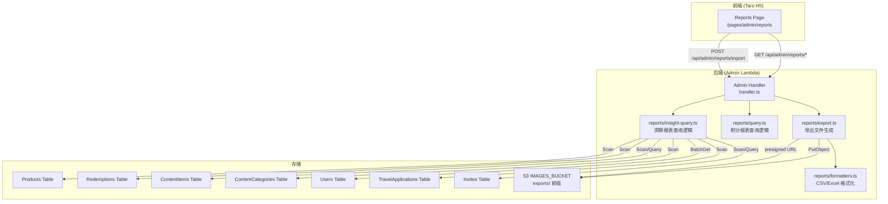

# 设计文档：洞察报表扩展（Insight Reports Expansion）

## Overview

本功能在现有 SuperAdmin 报表页面（4 个 Tab）基础上扩展六类新的洞察报表 Tab，总计 10 个 Tab。新增报表类型包括：人气商品排行、热门内容排行、内容贡献者排行、库存预警、差旅申请统计、邀请转化率。

### 关键设计决策

1. **新增查询模块分离**：新增 `packages/backend/src/reports/insight-query.ts` 文件，将 6 个新报表的查询逻辑与现有 `query.ts`（积分相关报表）分离，保持职责清晰。
2. **复用现有导出架构**：扩展 `formatters.ts` 添加 6 种新报表的列定义和格式化函数；扩展 `export.ts` 的 `executeExport` 函数支持新报表类型。
3. **DynamoDB Scan + 内存聚合**：所有新报表均使用 DynamoDB Scan（或 Query）获取原始数据，在 Lambda 内存中完成聚合计算，与现有报表保持一致的查询模式。
4. **邀请转化率特殊展示**：该报表返回单条汇总记录而非列表，前端以指标卡片（Metric Cards）形式展示，而非表格。
5. **Tab 栏横向滚动**：10 个 Tab 在移动端屏幕上通过 `overflow-x: auto` 实现横向滚动，已有 CSS 支持。
6. **复用现有权限和路由模式**：6 个新 GET 路由注册在 Admin Handler 中，使用现有 `{proxy+}` 代理模式和 SuperAdmin 权限校验。
7. **库存预警无时间筛选**：库存预警报表直接查询 Products 表当前状态，不涉及时间范围筛选，而是使用库存阈值、商品类型和商品状态作为筛选条件。

## Architecture



### 请求流程

1. **报表查询**：前端 GET `/api/admin/reports/{reportType}` → Admin Handler → SuperAdmin 权限校验 → `insight-query.ts` 查询 + 聚合 → 返回 JSON 数据
2. **报表导出**：前端 POST `/api/admin/reports/export` → Admin Handler → SuperAdmin 权限校验 → `insight-query.ts` 查询完整数据集 → `formatters.ts` 生成 CSV/Excel Buffer → `export.ts` 上传 S3 + 生成预签名 URL → 返回 URL

## Components and Interfaces

### Backend Module: `packages/backend/src/reports/insight-query.ts`

```typescript
// ============================================================
// 人气商品排行（Popular Products Ranking）
// ============================================================

/** 人气商品排行筛选条件 */
export interface PopularProductsFilter {
  startDate?: string;   // 按 Redemptions 的 createdAt 筛选
  endDate?: string;
  productType?: 'points' | 'code_exclusive' | 'all'; // 默认 all
}

/** 人气商品排行记录 */
export interface PopularProductRecord {
  productId: string;
  productName: string;
  productType: 'points' | 'code_exclusive';
  redemptionCount: number;
  totalPointsSpent: number;
  currentStock: number;
  stockConsumptionRate: number; // 百分比，保留一位小数
}

/** 人气商品排行查询结果 */
export interface PopularProductsResult {
  success: boolean;
  records?: PopularProductRecord[];
  error?: { code: string; message: string };
}

/** 查询人气商品排行报表 */
export async function queryPopularProducts(
  filter: PopularProductsFilter,
  dynamoClient: DynamoDBDocumentClient,
  tables: { redemptionsTable: string; productsTable: string },
): Promise<PopularProductsResult>;

// ============================================================
// 热门内容排行（Hot Content Ranking）
// ============================================================

/** 热门内容排行筛选条件 */
export interface HotContentFilter {
  categoryId?: string;
  startDate?: string;
  endDate?: string;
}

/** 热门内容排行记录 */
export interface HotContentRecord {
  contentId: string;
  title: string;
  uploaderNickname: string;
  categoryName: string;
  likeCount: number;
  commentCount: number;
  reservationCount: number;
  engagementScore: number; // likeCount + commentCount + reservationCount
}

/** 热门内容排行查询结果 */
export interface HotContentResult {
  success: boolean;
  records?: HotContentRecord[];
  error?: { code: string; message: string };
}

/** 查询热门内容排行报表 */
export async function queryHotContent(
  filter: HotContentFilter,
  dynamoClient: DynamoDBDocumentClient,
  tables: { contentItemsTable: string; contentCategoriesTable: string },
): Promise<HotContentResult>;

// ============================================================
// 内容贡献者排行（Content Contributor Ranking）
// ============================================================

/** 内容贡献者排行筛选条件 */
export interface ContentContributorFilter {
  startDate?: string;
  endDate?: string;
}

/** 内容贡献者排行记录 */
export interface ContentContributorRecord {
  rank: number;
  userId: string;
  nickname: string;
  approvedCount: number;
  totalLikes: number;
  totalComments: number;
}

/** 内容贡献者排行查询结果 */
export interface ContentContributorResult {
  success: boolean;
  records?: ContentContributorRecord[];
  error?: { code: string; message: string };
}

/** 查询内容贡献者排行报表 */
export async function queryContentContributors(
  filter: ContentContributorFilter,
  dynamoClient: DynamoDBDocumentClient,
  tables: { contentItemsTable: string; usersTable: string },
): Promise<ContentContributorResult>;

// ============================================================
// 库存预警（Inventory Alert）
// ============================================================

/** 库存预警筛选条件 */
export interface InventoryAlertFilter {
  stockThreshold?: number;  // 默认 5
  productType?: 'points' | 'code_exclusive' | 'all'; // 默认 all
  productStatus?: 'active' | 'inactive' | 'all'; // 默认 all
}

/** 库存预警记录 */
export interface InventoryAlertRecord {
  productId: string;
  productName: string;
  productType: 'points' | 'code_exclusive';
  currentStock: number;
  totalStock: number;    // 含尺码选项时为所有尺码 stock 之和
  productStatus: 'active' | 'inactive';
}

/** 库存预警查询结果 */
export interface InventoryAlertResult {
  success: boolean;
  records?: InventoryAlertRecord[];
  error?: { code: string; message: string };
}

/** 查询库存预警报表 */
export async function queryInventoryAlert(
  filter: InventoryAlertFilter,
  dynamoClient: DynamoDBDocumentClient,
  tables: { productsTable: string },
): Promise<InventoryAlertResult>;

// ============================================================
// 差旅申请统计（Travel Application Statistics）
// ============================================================

/** 差旅申请统计筛选条件 */
export interface TravelStatisticsFilter {
  periodType?: 'month' | 'quarter'; // 默认 month
  startDate?: string;
  endDate?: string;
  category?: 'domestic' | 'international' | 'all'; // 默认 all
}

/** 差旅申请统计记录 */
export interface TravelStatisticsRecord {
  period: string;              // YYYY-MM 或 YYYY-QN
  totalApplications: number;
  approvedCount: number;
  rejectedCount: number;
  pendingCount: number;
  approvalRate: number;        // 百分比，保留一位小数
  totalSponsoredAmount: number;
}

/** 差旅申请统计查询结果 */
export interface TravelStatisticsResult {
  success: boolean;
  records?: TravelStatisticsRecord[];
  error?: { code: string; message: string };
}

/** 查询差旅申请统计报表 */
export async function queryTravelStatistics(
  filter: TravelStatisticsFilter,
  dynamoClient: DynamoDBDocumentClient,
  tables: { travelApplicationsTable: string },
): Promise<TravelStatisticsResult>;

// ============================================================
// 邀请转化率（Invite Conversion Rate）
// ============================================================

/** 邀请转化率筛选条件 */
export interface InviteConversionFilter {
  startDate?: string;
  endDate?: string;
}

/** 邀请转化率汇总记录 */
export interface InviteConversionRecord {
  totalInvites: number;
  usedCount: number;
  expiredCount: number;
  pendingCount: number;
  conversionRate: number; // 百分比，保留一位小数
}

/** 邀请转化率查询结果 */
export interface InviteConversionResult {
  success: boolean;
  record?: InviteConversionRecord; // 单条汇总记录
  error?: { code: string; message: string };
}

/** 查询邀请转化率报表 */
export async function queryInviteConversion(
  filter: InviteConversionFilter,
  dynamoClient: DynamoDBDocumentClient,
  tables: { invitesTable: string },
): Promise<InviteConversionResult>;

// ============================================================
// 纯函数（导出供属性测试使用）
// ============================================================

/** 按 productId 聚合兑换记录 */
export function aggregateRedemptionsByProduct(
  redemptions: { productId: string; pointsSpent?: number }[],
): Map<string, { redemptionCount: number; totalPointsSpent: number }>;

/** 计算库存消耗率 */
export function calculateStockConsumptionRate(stock: number, redemptionCount: number): number;

/** 计算互动总分 */
export function calculateEngagementScore(likeCount: number, commentCount: number, reservationCount: number): number;

/** 按 uploaderId 聚合内容贡献数据 */
export function aggregateContentByUploader(
  items: { uploaderId: string; likeCount: number; commentCount: number }[],
): Map<string, { approvedCount: number; totalLikes: number; totalComments: number }>;

/** 按时间周期聚合差旅申请 */
export function aggregateTravelByPeriod(
  applications: { createdAt: string; status: string; totalCost: number }[],
  periodType: 'month' | 'quarter',
): TravelStatisticsRecord[];

/** 聚合邀请转化率 */
export function aggregateInviteConversion(
  invites: { status: string }[],
): InviteConversionRecord;

/** 计算商品总库存（含尺码选项） */
export function calculateTotalStock(
  stock: number,
  sizeOptions?: { name: string; stock: number }[],
): number;

/** 判断商品是否低库存（含尺码选项逻辑） */
export function isLowStock(
  stock: number,
  sizeOptions: { name: string; stock: number }[] | undefined,
  threshold: number,
): boolean;
```

### Backend Module: `packages/backend/src/reports/formatters.ts`（扩展）

扩展现有 `ReportType` 联合类型和 `getColumnDefs` 函数：

```typescript
/** 报表类型（扩展后） */
export type ReportType =
  | 'points-detail'
  | 'ug-activity-summary'
  | 'user-points-ranking'
  | 'activity-points-summary'
  // 新增 6 种报表类型
  | 'popular-products'
  | 'hot-content'
  | 'content-contributors'
  | 'inventory-alert'
  | 'travel-statistics'
  | 'invite-conversion';

/** 新增格式化函数 */
export function formatPopularProductsForExport(records: PopularProductRecord[]): Record<string, unknown>[];
export function formatHotContentForExport(records: HotContentRecord[]): Record<string, unknown>[];
export function formatContentContributorsForExport(records: ContentContributorRecord[]): Record<string, unknown>[];
export function formatInventoryAlertForExport(records: InventoryAlertRecord[]): Record<string, unknown>[];
export function formatTravelStatisticsForExport(records: TravelStatisticsRecord[]): Record<string, unknown>[];
export function formatInviteConversionForExport(records: InviteConversionRecord[]): Record<string, unknown>[];
```

### Backend Module: `packages/backend/src/reports/export.ts`（扩展）

扩展 `VALID_REPORT_TYPES` 数组和 `executeExport` 函数，添加 6 种新报表类型的导出逻辑。每种新报表类型调用 `insight-query.ts` 中对应的查询函数获取完整数据集，然后通过 `formatters.ts` 生成文件。

### Admin Handler Routes（新增 6 个 GET 路由）

| Method | Path | Handler | Permission |
|--------|------|---------|------------|
| GET | `/api/admin/reports/popular-products` | `handlePopularProductsReport` | SuperAdmin |
| GET | `/api/admin/reports/hot-content` | `handleHotContentReport` | SuperAdmin |
| GET | `/api/admin/reports/content-contributors` | `handleContentContributorsReport` | SuperAdmin |
| GET | `/api/admin/reports/inventory-alert` | `handleInventoryAlertReport` | SuperAdmin |
| GET | `/api/admin/reports/travel-statistics` | `handleTravelStatisticsReport` | SuperAdmin |
| GET | `/api/admin/reports/invite-conversion` | `handleInviteConversionReport` | SuperAdmin |

所有路由在 `handler.ts` 中注册，使用现有的 `{proxy+}` 代理模式，无需在 CDK 中新增 API Gateway 路由。

### Frontend Page: `packages/frontend/src/pages/admin/reports.tsx`（扩展）

```typescript
/** Tab 类型（扩展后） */
type ReportTab =
  | 'points-detail'
  | 'ug-activity'
  | 'user-ranking'
  | 'activity-summary'
  // 新增 6 个 Tab
  | 'popular-products'
  | 'hot-content'
  | 'content-contributors'
  | 'inventory-alert'
  | 'travel-statistics'
  | 'invite-conversion';

/** 新增 Tab 的筛选状态 */
interface TabFilterState {
  // ... 现有 4 个 Tab 的筛选状态保持不变 ...
  'popular-products': {
    startDate: string;
    endDate: string;
    productType: string; // 'points' | 'code_exclusive' | 'all'
  };
  'hot-content': {
    startDate: string;
    endDate: string;
    categoryId: string;
  };
  'content-contributors': {
    startDate: string;
    endDate: string;
  };
  'inventory-alert': {
    stockThreshold: string; // 数字字符串，默认 '5'
    productType: string;
    productStatus: string;
  };
  'travel-statistics': {
    startDate: string;
    endDate: string;
    periodType: string; // 'month' | 'quarter'
    category: string;   // 'domestic' | 'international' | 'all'
  };
  'invite-conversion': {
    startDate: string;
    endDate: string;
  };
}
```

**新增前端记录类型**：

```typescript
interface PopularProductRecord {
  productId: string;
  productName: string;
  productType: 'points' | 'code_exclusive';
  redemptionCount: number;
  totalPointsSpent: number;
  currentStock: number;
  stockConsumptionRate: number;
}

interface HotContentRecord {
  contentId: string;
  title: string;
  uploaderNickname: string;
  categoryName: string;
  likeCount: number;
  commentCount: number;
  reservationCount: number;
  engagementScore: number;
}

interface ContentContributorRecord {
  rank: number;
  userId: string;
  nickname: string;
  approvedCount: number;
  totalLikes: number;
  totalComments: number;
}

interface InventoryAlertRecord {
  productId: string;
  productName: string;
  productType: 'points' | 'code_exclusive';
  currentStock: number;
  totalStock: number;
  productStatus: 'active' | 'inactive';
}

interface TravelStatisticsRecord {
  period: string;
  totalApplications: number;
  approvedCount: number;
  rejectedCount: number;
  pendingCount: number;
  approvalRate: number;
  totalSponsoredAmount: number;
}

interface InviteConversionRecord {
  totalInvites: number;
  usedCount: number;
  expiredCount: number;
  pendingCount: number;
  conversionRate: number;
}
```

**组件结构（扩展后）**：

```
ReportsPage
├── TabBar (10 个 Tab，横向滚动)
├── FilterPanel (根据当前 Tab 渲染不同筛选控件)
│   ├── DateRangePicker (大部分 Tab 共用，库存预警除外)
│   ├── ProductTypeSelector (人气商品、库存预警)
│   ├── CategorySelector (热门内容 — 从 ContentCategories 加载)
│   ├── StockThresholdInput (库存预警)
│   ├── ProductStatusSelector (库存预警)
│   ├── PeriodTypeSelector (差旅统计)
│   ├── TravelCategorySelector (差旅统计)
│   └── ExportButtons (CSV / Excel)
├── DataTable (大部分 Tab 使用表格展示)
├── MetricCards (邀请转化率 Tab 使用卡片展示)
└── LoadMore / ScrollLoader
```

**邀请转化率 MetricCards 组件**：

```typescript
/** 指标卡片组件 — 用于邀请转化率报表 */
function MetricCards({ record }: { record: InviteConversionRecord | null }) {
  // 展示 5 个指标卡片：邀请总数、已使用数、已过期数、待使用数、转化率
  // 转化率使用 var(--font-display) 字体加粗展示
  // 卡片使用 var(--bg-surface) 背景 + var(--card-border) 边框
}
```

**条件高亮逻辑**：
- 人气商品排行：库存消耗率 > 80% 的行使用 `var(--warning)` 背景色高亮
- 库存预警：库存为 0 的行使用 `var(--error)` 背景色高亮

## Data Models

### DynamoDB 查询策略

#### 人气商品排行报表

1. **Scan Redemptions 表**：获取所有兑换记录（可选 FilterExpression 按 createdAt 时间范围筛选）
2. **内存聚合**：按 productId 分组，统计 redemptionCount 和 totalPointsSpent（所有 pointsSpent 之和）
3. **BatchGet Products 表**：收集聚合结果中的 productId 集合 → BatchGetCommand 获取 name、type、stock
4. **可选筛选**：按 productType 过滤
5. **计算库存消耗率**：`redemptionCount / (stock + redemptionCount) × 100`，当分母为 0 时返回 0
6. **排序**：按 redemptionCount 倒序

**DynamoDB 索引使用**：
- Redemptions 表无按 createdAt 的全局索引，使用 Scan + FilterExpression
- Products 表使用 BatchGetCommand（PK=productId）

#### 热门内容排行报表

1. **Query ContentItems 表**：使用 `status-createdAt-index` GSI（PK=status='approved'），可选 SK 按 createdAt 范围筛选
2. **可选筛选**：FilterExpression 按 categoryId 筛选
3. **计算互动总分**：`engagementScore = likeCount + commentCount + reservationCount`
4. **排序**：按 engagementScore 倒序
5. **分类名称**：Scan ContentCategories 表获取 categoryId → name 映射

#### 内容贡献者排行报表

1. **Query ContentItems 表**：使用 `status-createdAt-index` GSI（PK=status='approved'），可选 SK 按 createdAt 范围筛选
2. **内存聚合**：按 uploaderId 分组，统计 approvedCount、totalLikes（likeCount 之和）、totalComments（commentCount 之和）
3. **BatchGet Users 表**：获取 nickname
4. **排序**：按 approvedCount 倒序，添加 rank 序号

#### 库存预警报表

1. **Scan Products 表**：获取所有商品
2. **内存筛选**：
   - 按 productType 筛选（可选）
   - 按 productStatus 筛选（可选）
   - 按库存阈值筛选：`stock < threshold`
   - 含尺码选项时：任一尺码 stock < threshold 即纳入
3. **计算总库存**：含尺码选项时为所有尺码 stock 之和，否则为 stock 字段值
4. **排序**：按 currentStock 升序（库存最少的排在最前）

#### 差旅申请统计报表

1. **Scan TravelApplications 表**：可选 FilterExpression 按 createdAt 时间范围和 category 筛选
2. **内存聚合**：按时间周期（月/季度）分组
   - 月：从 createdAt 提取 `YYYY-MM`
   - 季度：从 createdAt 提取 `YYYY-QN`（Q1=1-3月, Q2=4-6月, Q3=7-9月, Q4=10-12月）
3. **每个周期统计**：totalApplications、approvedCount、rejectedCount、pendingCount
4. **计算审批通过率**：`approvedCount / totalApplications × 100`，分母为 0 时返回 0
5. **计算赞助总金额**：该周期内所有 status=approved 的 totalCost 之和
6. **排序**：按 period 倒序
7. **默认范围**：未提供时间范围时返回最近 12 个月

**DynamoDB 索引使用**：
- TravelApplications 表有 `status-createdAt-index` GSI，但统计需要所有状态的数据，因此使用 Scan

#### 邀请转化率报表

1. **Scan Invites 表**：可选 FilterExpression 按 createdAt 时间范围筛选
2. **内存聚合**：统计 totalInvites（数组长度）、usedCount（status=used）、expiredCount（status=expired）、pendingCount（status=pending）
3. **计算转化率**：`usedCount / totalInvites × 100`，分母为 0 时返回 0
4. **返回单条汇总记录**

**DynamoDB 索引使用**：
- Invites 表有 `status-createdAt-index` GSI，但需要所有状态的数据，因此使用 Scan + FilterExpression

### 导出列定义（新增 6 种报表）

**人气商品排行报表**：

| 列名（中文） | 字段 key | 说明 |
|-------------|---------|------|
| 商品名称 | productName | |
| 商品类型 | productType | 显示为"积分商品"或"Code 专属商品" |
| 兑换次数 | redemptionCount | |
| 消耗积分总额 | totalPointsSpent | |
| 当前库存 | currentStock | |
| 库存消耗率 | stockConsumptionRate | 格式化为 "XX.X%" |

**热门内容排行报表**：

| 列名（中文） | 字段 key |
|-------------|---------|
| 标题 | title |
| 作者昵称 | uploaderNickname |
| 分类名称 | categoryName |
| 点赞数 | likeCount |
| 评论数 | commentCount |
| 预约数 | reservationCount |
| 互动总分 | engagementScore |

**内容贡献者排行报表**：

| 列名（中文） | 字段 key |
|-------------|---------|
| 排名 | rank |
| 用户昵称 | nickname |
| 已审核通过内容数量 | approvedCount |
| 获得总点赞数 | totalLikes |
| 获得总评论数 | totalComments |

**库存预警报表**：

| 列名（中文） | 字段 key |
|-------------|---------|
| 商品名称 | productName |
| 商品类型 | productType | 显示为"积分商品"或"Code 专属商品" |
| 当前库存 | currentStock |
| 总库存 | totalStock |
| 商品状态 | productStatus | 显示为"上架中"或"已下架" |

**差旅申请统计报表**：

| 列名（中文） | 字段 key |
|-------------|---------|
| 时间周期 | period |
| 申请总数 | totalApplications |
| 已批准数 | approvedCount |
| 已拒绝数 | rejectedCount |
| 待审核数 | pendingCount |
| 审批通过率 | approvalRate | 格式化为 "XX.X%" |
| 赞助总金额 | totalSponsoredAmount |

**邀请转化率报表**：

| 列名（中文） | 字段 key |
|-------------|---------|
| 邀请总数 | totalInvites |
| 已使用数 | usedCount |
| 已过期数 | expiredCount |
| 待使用数 | pendingCount |
| 转化率 | conversionRate | 格式化为 "XX.X%" |

