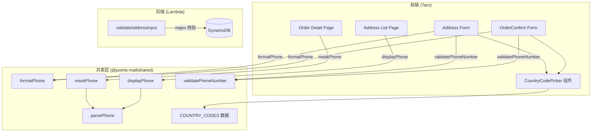

# Design Document: International Phone Number Support

## Overview

当前系统的手机号验证硬编码为中国大陆格式 `/^1\d{10}$/`，无法支持国际用户。本设计将手机号字段改造为「国际区号选择器 + 号码输入框」的组合形式，引入 `Phone_Storage_Format`（`+区号-号码`）作为统一存储格式，并更新前后端验证、遮蔽函数和展示逻辑，同时保持对旧格式数据的向后兼容。

### 设计目标

1. **前端**：新增 `CountryCodePicker` 组件，改造地址表单和订单确认表单
2. **共享层**：新增 `parsePhone`、`formatPhone`、`displayPhone` 工具函数，更新 `maskPhone`
3. **后端**：更新 `validateAddressInput` 正则为国际格式
4. **i18n**：更新 5 种语言的手机号相关翻译
5. **向后兼容**：所有函数均能处理旧格式纯数字手机号

## Architecture



### 数据流

1. **输入流**：用户选择区号 → 输入号码 → 前端 `validatePhoneNumber` 校验 → `formatPhone` 组合为 `+CC-NNNN` → 发送至后端
2. **存储流**：后端 `validateAddressInput` 用正则 `/^\+\d{1,4}-\d{4,15}$/` 校验 → 原样存入 DynamoDB
3. **展示流**：从 DynamoDB 读取 → `displayPhone` 格式化为 `+CC NNNN` 或 `maskPhone` 遮蔽展示

## Components and Interfaces

### 1. COUNTRY_CODES 数据 (`packages/shared/src/phone.ts`)

```typescript
export interface CountryCode {
  code: string;       // ISO 3166-1 alpha-2, e.g. "CN"
  dialCode: string;   // 区号数字部分, e.g. "86"
  flag: string;       // 国旗 emoji, e.g. "🇨🇳"
  name: string;       // 英文名称, e.g. "China"
}

/** 常用区号列表（置顶） */
export const COMMON_DIAL_CODES: string[] = ['86', '81', '886', '852', '82'];

/** 全球区号数据（约 30+ 常见国家/地区） */
export const COUNTRY_CODES: CountryCode[] = [/* ... */];

/** 获取排序后的区号列表：常用在前，其余按 name 字母序 */
export function getSortedCountryCodes(): { common: CountryCode[]; others: CountryCode[] };

/** 根据 locale 和可选的 country cookie 获取默认区号 */
export function getDefaultDialCode(locale: string, cfCountry?: string | null): string;
```

### 2. 手机号工具函数 (`packages/shared/src/phone.ts`)

```typescript
export interface ParsedPhone {
  countryCode: string;   // 区号数字部分, e.g. "86"
  phoneNumber: string;   // 号码部分, e.g. "13800138000"
}

/** 解析 Phone_Storage_Format 字符串，旧格式纯数字返回 countryCode='86' */
export function parsePhone(phone: string): ParsedPhone | null;

/** 组合区号和号码为 Phone_Storage_Format */
export function formatPhone(countryCode: string, phoneNumber: string): string;

/** 格式化为展示用格式：+CC NNNN，旧格式原样返回 */
export function displayPhone(phone: string): string;

/** 校验号码部分：纯数字，4-15 位 */
export function validatePhoneNumber(phoneNumber: string): boolean;
```

### 3. 更新后的 maskPhone (`packages/shared/src/types.ts`)

```typescript
/**
 * 手机号遮蔽（支持国际格式和旧格式）
 * - 国际格式 "+CC-NNNN"：保留区号，号码部分 ≥6 位时保留前3后2中间****，<6 位时保留首末中间****
 * - 旧格式纯数字：保留前3 + **** + 后4（向后兼容）
 */
export function maskPhone(phone: string): string;
```

### 4. CountryCodePicker 组件 (`packages/frontend/src/components/CountryCodePicker/`)

```typescript
interface CountryCodePickerProps {
  value: string;              // 当前选中的区号, e.g. "86"
  onChange: (code: string) => void;
}
```

- 展示：国旗 emoji + `+区号` 的紧凑按钮
- 点击展开下拉列表：常用区号置顶 → 分隔线 → 其余按英文名字母序
- 每个选项：国旗 + `+区号` + 国家名称
- 选择后关闭下拉并回调 `onChange`

### 5. 后端验证更新 (`packages/backend/src/cart/address.ts`)

```typescript
// 旧正则: /^1\d{10}$/
// 新正则: /^\+\d{1,4}-\d{4,15}$/
function validateAddressInput(data: AddressRequest): { code: string; message: string } | null;
```

## Data Models

### Phone_Storage_Format

| 字段 | 格式 | 示例 |
|------|------|------|
| 完整格式 | `+{1-4位区号}-{4-15位号码}` | `+86-13800138000` |
| 正则 | `/^\+\d{1,4}-\d{4,15}$/` | |

### DynamoDB 存储

`addresses` 表的 `phone` 字段从纯数字格式变更为 Phone_Storage_Format。旧数据保持不变，所有读取函数通过 `parsePhone` 的向后兼容逻辑处理。

### Locale 到默认区号映射

| Locale | 默认区号 | 说明 |
|--------|---------|------|
| `zh` | `86` | 中国大陆 |
| `ja` | `81` | 日本 |
| `zh-TW` | `886` | 台湾 |
| `ko` | `82` | 韩国 |
| `en` | 由 `cf_country` 决定 | 通过 cookie 映射 |
| 其他/默认 | `86` | 回退默认值 |

## Correctness Properties

*A property is a characteristic or behavior that should hold true across all valid executions of a system — essentially, a formal statement about what the system should do. Properties serve as the bridge between human-readable specifications and machine-verifiable correctness guarantees.*

### Property 1: Phone number format validation

*For any* string, the phone number validation function should accept it if and only if it consists of exactly 4 to 15 digit characters (no other characters allowed). Equivalently, the backend regex `/^\+\d{1,4}-\d{4,15}$/` should accept a full Phone_Storage_Format string if and only if it has a valid `+` prefix, 1-4 digit country code, a `-` separator, and 4-15 digit phone number.

**Validates: Requirements 3.2, 4.1, 4.2**

### Property 2: parsePhone/formatPhone round-trip

*For any* valid Phone_Storage_Format string `s` (matching `/^\+\d{1,4}-\d{4,15}$/`), calling `parsePhone(s)` should return a non-null `ParsedPhone` object, and then calling `formatPhone(result.countryCode, result.phoneNumber)` should produce a string equal to `s`.

**Validates: Requirements 8.1, 8.2, 8.3**

### Property 3: parsePhone rejects invalid input

*For any* string that does not match the Phone_Storage_Format regex and is not a legacy pure-digit phone number (11 digits starting with 1), `parsePhone` should return `null`.

**Validates: Requirements 8.4**

### Property 4: parsePhone backward compatibility

*For any* 11-digit string consisting of digit `1` followed by 10 random digits, `parsePhone` should return `{ countryCode: '86', phoneNumber: <the original string> }`.

**Validates: Requirements 8.5**

### Property 5: maskPhone for international format

*For any* valid Phone_Storage_Format string where the phone number part has 6 or more digits, `maskPhone` should produce a string that: (a) starts with `+{countryCode} ` preserving the full country code, (b) contains the first 3 digits of the phone number, (c) contains `****`, and (d) ends with the last 2 digits of the phone number. For phone number parts with fewer than 6 digits, the masked output should preserve the first and last digit with `****` in between.

**Validates: Requirements 5.2, 5.3, 5.4**

### Property 6: maskPhone backward compatibility

*For any* 11-digit pure numeric string (legacy format), `maskPhone` should produce a string equal to `first3digits + "****" + last4digits`, preserving the original masking behavior.

**Validates: Requirements 5.5**

### Property 7: Country code list sorting

*For any* pair of consecutive entries in the "others" section (non-common codes) returned by `getSortedCountryCodes()`, the first entry's `name` should be alphabetically less than or equal to the second entry's `name`.

**Validates: Requirements 1.3**

## Error Handling

| 场景 | 前端行为 | 后端行为 |
|------|---------|---------|
| 号码为空或非数字 | 输入框下方显示本地化错误提示 | 返回 `INVALID_PHONE` 错误码 |
| 号码长度 <4 或 >15 | 输入框下方显示本地化错误提示 | 返回 `INVALID_PHONE` 错误码 |
| Phone_Storage_Format 格式不合法 | 前端不会发送（已在提交前组合） | 返回 `INVALID_PHONE` 错误码 |
| 旧格式纯数字手机号读取 | `parsePhone` 自动补充 countryCode='86' | 存储时已为旧格式，读取正常 |
| `parsePhone` 返回 null | 展示页面显示原始字符串 | N/A |
| 区号选择器无法加载 | 使用默认区号 +86 | N/A |

## Testing Strategy

### 单元测试（Example-based）

- `parsePhone` 具体示例：`"+86-13800138000"` → `{ countryCode: "86", phoneNumber: "13800138000" }`
- `formatPhone` 具体示例：`formatPhone("86", "13800138000")` → `"+86-13800138000"`
- `displayPhone` 具体示例：`"+86-13800138000"` → `"+86 13800138000"`
- `maskPhone` 具体示例：`"+86-13800138000"` → `"+86 138****00"`
- `getDefaultDialCode` 各 locale 映射验证
- `getSortedCountryCodes` 常用区号置顶验证
- `validatePhoneNumber` 边界值：4 位、15 位、3 位、16 位
- 后端 `validateAddressInput` 新格式接受、旧格式拒绝
- i18n 各语言文件包含新增翻译 key 的 smoke test

### 属性测试（Property-based）

使用 `fast-check` 库，每个属性测试最少运行 100 次迭代。

| 属性 | 测试文件 | 标签 |
|------|---------|------|
| Property 1: Phone format validation | `packages/shared/src/phone.property.test.ts` | Feature: international-phone, Property 1: Phone number format validation |
| Property 2: parsePhone/formatPhone round-trip | `packages/shared/src/phone.property.test.ts` | Feature: international-phone, Property 2: parsePhone/formatPhone round-trip |
| Property 3: parsePhone rejects invalid | `packages/shared/src/phone.property.test.ts` | Feature: international-phone, Property 3: parsePhone rejects invalid input |
| Property 4: parsePhone backward compat | `packages/shared/src/phone.property.test.ts` | Feature: international-phone, Property 4: parsePhone backward compatibility |
| Property 5: maskPhone international | `packages/shared/src/types.test.ts` | Feature: international-phone, Property 5: maskPhone for international format |
| Property 6: maskPhone backward compat | `packages/shared/src/types.test.ts` | Feature: international-phone, Property 6: maskPhone backward compatibility |
| Property 7: Country code sorting | `packages/shared/src/phone.property.test.ts` | Feature: international-phone, Property 7: Country code list sorting |

### 生成器策略

```typescript
// 生成合法区号（1-4 位数字）
const arbCountryCode = fc.stringOf(fc.constantFrom(...'0123456789'.split('')), { minLength: 1, maxLength: 4 });

// 生成合法号码（4-15 位数字）
const arbPhoneNumber = fc.stringOf(fc.constantFrom(...'0123456789'.split('')), { minLength: 4, maxLength: 15 });

// 生成合法 Phone_Storage_Format
const arbPhoneStorageFormat = fc.tuple(arbCountryCode, arbPhoneNumber)
  .map(([cc, num]) => `+${cc}-${num}`);

// 生成旧格式中国手机号（1 + 10位数字）
const arbLegacyPhone = fc.stringOf(fc.constantFrom(...'0123456789'.split('')), { minLength: 10, maxLength: 10 })
  .map(digits => '1' + digits);
```
