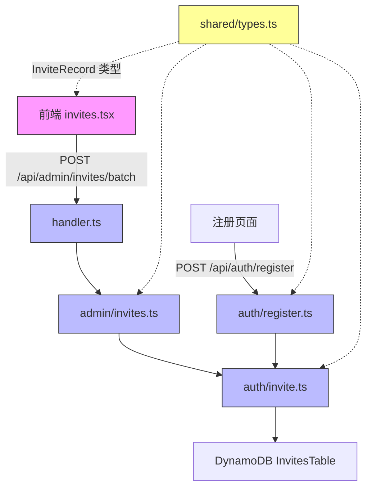

# 设计文档：邀请链接多角色选择（Invite Multi-Role）

## 概述

本设计将邀请链接系统从单角色（`role: UserRole`）升级为多角色（`roles: UserRole[]`）。变更涉及四个层面：

1. **共享类型层**：`InviteRecord` 新增 `roles` 字段，保留 `role` 用于向后兼容
2. **后端 API 层**：批量生成接口参数从 `role` 改为 `roles`，含去重与校验逻辑
3. **后端注册层**：注册时从 `roles` 数组分配多角色给新用户
4. **前端交互层**：角色选择器从单选改为多选，列表展示多角色徽章

设计原则：最小化变更范围，保持向后兼容，确保旧数据（仅含 `role` 字段）可被正确读取。

## 架构

### 变更范围



### 数据流

**创建邀请链接：**
```
前端 (roles[]) → handler.ts → batchGenerateInvites(roles[]) → batchCreateInvites(roles[]) → DynamoDB
```

**注册流程：**
```
注册页面 (token) → register.ts → validateInviteToken(token) → 返回 roles[] → 创建用户 (roles[])
```

## 组件与接口

### 1. 共享类型变更（packages/shared/src/types.ts）

**InviteRecord 接口变更：**

```typescript
export interface InviteRecord {
  token: string;
  role: UserRole;       // 保留，向后兼容旧数据
  roles: UserRole[];    // 新增，多角色数组
  status: InviteStatus;
  createdAt: string;
  expiresAt: string;
  usedAt?: string;
  usedBy?: string;
}
```

**新增辅助函数：**

```typescript
/** 从 InviteRecord 安全获取 roles 数组（兼容旧数据） */
export function getInviteRoles(record: { role?: UserRole; roles?: UserRole[] }): UserRole[] {
  if (record.roles && record.roles.length > 0) return record.roles;
  if (record.role) return [record.role];
  return [];
}
```

### 2. 后端邀请创建（packages/backend/src/auth/invite.ts）

**函数签名变更：**

```typescript
// 旧
export async function createInviteRecord(
  role: UserRole, ...
): Promise<CreateInviteResult>

// 新
export async function createInviteRecord(
  roles: UserRole[], ...
): Promise<CreateInviteResult>

// 旧
export async function batchCreateInvites(
  count: number, role: UserRole, ...
): Promise<BatchCreateInvitesResult>

// 新
export async function batchCreateInvites(
  count: number, roles: UserRole[], ...
): Promise<BatchCreateInvitesResult>
```

**校验逻辑：**
- `roles` 去重后长度必须 ≥ 1 且 ≤ 4
- 每个角色必须属于 `REGULAR_ROLES`
- 写入 DynamoDB 时同时写入 `role`（取 `roles[0]`）和 `roles` 字段

**validateInviteToken 返回值变更：**

```typescript
// 旧
export type ValidateInviteResult =
  | { success: true; role: UserRole }
  | { success: false; error: { code: string; message: string } };

// 新
export type ValidateInviteResult =
  | { success: true; roles: UserRole[] }
  | { success: false; error: { code: string; message: string } };
```

`validateInviteToken` 内部使用 `getInviteRoles()` 从记录中提取角色数组。

### 3. 后端管理接口（packages/backend/src/admin/invites.ts）

**batchGenerateInvites 签名变更：**

```typescript
// 旧
export async function batchGenerateInvites(
  count: number, role: UserRole, ...
): Promise<BatchGenerateInvitesResult>

// 新
export async function batchGenerateInvites(
  count: number, roles: UserRole[], ...
): Promise<BatchGenerateInvitesResult>
```

**BatchGenerateInvitesResult 类型变更：**

```typescript
export type BatchGenerateInvitesResult =
  | { success: true; invites: Array<{ token: string; link: string; roles: UserRole[]; expiresAt: string }> }
  | { success: false; error: { code: string; message: string } };
```

### 4. 后端 Handler（packages/backend/src/admin/handler.ts）

**handleBatchGenerateInvites 变更：**
- 请求体校验从 `body.role` 改为 `body.roles`（数组）
- 传递 `roles` 数组给 `batchGenerateInvites`

### 5. 注册逻辑（packages/backend/src/auth/register.ts）

**registerUser 变更：**
- `validateInviteToken` 返回 `roles[]` 而非 `role`
- 创建用户时 `roles` 字段直接使用邀请记录中的 `roles` 数组

### 6. 前端邀请管理页（packages/frontend/src/pages/admin/invites.tsx）

**交互变更：**
- `formRole: string` → `formRoles: string[]`（多选状态）
- 角色选择器点击行为：切换选中/取消
- 提交校验：`formRoles.length === 0` 时阻止提交并显示错误
- 默认状态：无角色选中
- 请求参数：`{ count, roles: formRoles }`

**列表展示变更：**
- `InviteRecord` 接口新增 `roles` 字段
- 角色徽章展示：使用 `getInviteRoles()` 获取角色数组，遍历渲染多个徽章
- 新生成邀请结果中展示 `roles` 数组

### 7. 前端 SCSS 变更（packages/frontend/src/pages/admin/invites.scss）

角色徽章已使用全局 `.role-badge` 类，无需新增样式。多角色徽章水平排列已由 `.invite-row__top` 的 `flex-wrap: wrap` 支持。

## 数据模型

### InviteRecord（DynamoDB）

| 字段 | 类型 | 说明 |
|------|------|------|
| token | String (PK) | 邀请 Token |
| role | String | 首个角色（向后兼容） |
| roles | List\<String\> | 角色数组（新增） |
| status | String | pending / used / expired |
| createdAt | String (ISO) | 创建时间 |
| expiresAt | String (ISO) | 过期时间 |
| usedAt | String (ISO) | 使用时间（可选） |
| usedBy | String | 使用者 userId（可选） |

**向后兼容策略：**
- 新记录同时写入 `role`（`roles[0]`）和 `roles`
- 读取时通过 `getInviteRoles()` 统一处理：优先取 `roles`，回退到 `[role]`
- 无需数据迁移

### API 请求/响应变更

**POST /api/admin/invites/batch**

请求体：
```json
{
  "count": 5,
  "roles": ["UserGroupLeader", "Speaker"]
}
```

响应体：
```json
{
  "invites": [
    {
      "token": "abc123...",
      "link": "https://...",
      "roles": ["UserGroupLeader", "Speaker"],
      "expiresAt": "2025-01-02T00:00:00.000Z"
    }
  ]
}
```

**GET /api/auth/validate-invite?token=xxx**（validateInviteToken 内部）

返回值从 `{ success: true, role }` 变为 `{ success: true, roles }`.


## 正确性属性（Correctness Properties）

*属性（Property）是在系统所有合法执行中都应成立的特征或行为——本质上是对系统应做之事的形式化陈述。属性是人类可读规格与机器可验证正确性保证之间的桥梁。*

### Property 1: 邀请创建往返一致性（Invite creation round-trip）

*For any* 非空的 REGULAR_ROLES 子集 `roles`，调用 `batchCreateInvites(1, roles, ...)` 创建的邀请记录中，`roles` 字段应与输入的去重后角色数组完全一致，且 `role` 字段应等于 `roles[0]`。

**Validates: Requirements 2.1, 2.5, 3.1**

### Property 2: 角色去重幂等性（Roles deduplication idempotence）

*For any* 包含重复元素的 UserRole 数组 `rolesWithDups`，调用 `batchCreateInvites` 后存储的 `roles` 数组应等于 `[...new Set(rolesWithDups)]`，即去重后的结果。对同一组角色，无论输入中重复多少次，结果不变。

**Validates: Requirements 2.4**

### Property 3: 非法角色拒绝（Invalid role rejection）

*For any* 角色数组，若其中包含至少一个不属于 `REGULAR_ROLES` 的值（如 `'Admin'`、`'SuperAdmin'` 或任意非法字符串），`batchCreateInvites` 应返回 `success: false` 并包含角色无效错误码。

**Validates: Requirements 2.3**

### Property 4: 向后兼容读取（Backward-compatible role extraction）

*For any* `UserRole` 值 `r`，`getInviteRoles({ role: r })` 应返回 `[r]`。*For any* 非空 `UserRole[]` 值 `rs`，`getInviteRoles({ roles: rs })` 应返回 `rs`。当 `roles` 和 `role` 同时存在时，`roles` 优先。

**Validates: Requirements 3.2**

### Property 5: 角色数组长度不变量（Roles array length invariant）

*For all* 成功创建的 `InviteRecord`，其 `roles` 数组长度应满足 `1 ≤ roles.length ≤ 4`。

**Validates: Requirements 3.3**

### Property 6: 注册角色完整分配（Registration assigns all invite roles）

*For any* 有效邀请记录，通过该邀请 Token 注册的用户，其 `roles` 数组应包含邀请记录 `roles` 数组中的所有角色。

**Validates: Requirements 4.1, 4.2, 4.3**

## 错误处理

### 新增/变更错误码

| 错误码 | HTTP 状态 | 触发条件 | 消息 |
|--------|----------|---------|------|
| INVALID_ROLES | 400 | `roles` 为空数组或未提供 | 请至少选择一个角色 |
| INVALID_ROLE | 400 | `roles` 中包含非 REGULAR_ROLES 的值 | 角色必须为普通角色之一 |

### 现有错误码（不变）

- `INVITE_TOKEN_INVALID`：Token 不存在
- `INVITE_TOKEN_USED`：Token 已使用
- `INVITE_TOKEN_EXPIRED`：Token 已过期
- `INVITE_NOT_FOUND`：邀请记录不存在
- `INVITE_NOT_REVOCABLE`：非 pending 状态无法撤销

### 前端错误处理

- 角色未选中时点击生成：本地校验，显示 `t('admin.invites.errorRolesRequired')` 错误提示
- API 返回 INVALID_ROLES / INVALID_ROLE：显示后端错误消息

## 测试策略

### 属性测试（Property-Based Testing）

使用 `fast-check` 库，每个属性测试至少运行 100 次迭代。

**测试文件：** `packages/backend/src/admin/invites-multi-role.property.test.ts`

| 属性 | 测试内容 | 生成器 |
|------|---------|--------|
| Property 1 | 创建邀请后读取 roles 一致 | `fc.subarray(REGULAR_ROLES, { minLength: 1 })` |
| Property 2 | 含重复角色的输入去重后结果一致 | `fc.array(fc.constantFrom(...REGULAR_ROLES), { minLength: 1 })` |
| Property 3 | 含非法角色时返回错误 | `fc.array(fc.string())` 混入非法值 |
| Property 4 | getInviteRoles 向后兼容 | `fc.constantFrom(...REGULAR_ROLES)` + `fc.subarray(REGULAR_ROLES)` |
| Property 5 | 创建结果 roles 长度 ∈ [1,4] | `fc.subarray(REGULAR_ROLES, { minLength: 1 })` |
| Property 6 | 注册用户 roles ⊇ 邀请 roles | `fc.subarray(REGULAR_ROLES, { minLength: 1 })` |

每个测试标注格式：`Feature: invite-multi-role, Property N: {property_text}`

### 单元测试

**测试文件：** `packages/backend/src/admin/invites.test.ts`（扩展现有）

- 空 roles 数组返回 INVALID_ROLES 错误
- 单角色 roles 数组正常工作（向后兼容场景）
- handler 层参数解析：`body.roles` 替代 `body.role`

**测试文件：** `packages/backend/src/auth/register.test.ts`（扩展现有）

- 多角色邀请注册后用户拥有所有角色
- 旧格式邀请（仅 role 字段）注册仍正常工作

### 前端测试

- 角色选择器多选交互（切换选中/取消）
- 空选择时提交阻止
- 邀请列表多角色徽章渲染
