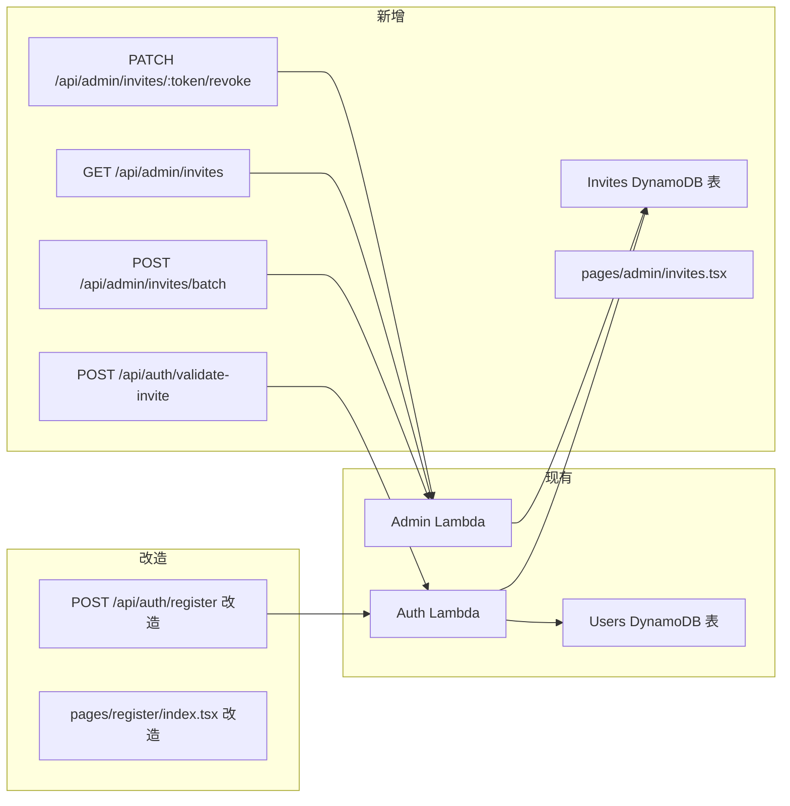

# 技术设计文档 - 邀请制注册（Invite Registration）

## 概述（Overview）

本功能将系统注册方式从开放注册改为邀请制注册。核心变更：

- 新增 `Invites` DynamoDB 表，存储邀请记录（token、目标角色、状态、过期时间）
- Auth Lambda 新增 `POST /api/auth/validate-invite` 路由（token 验证），改造 `POST /api/auth/register`（需携带有效 token）
- Admin Lambda 新增三个路由：批量生成邀请、查询邀请列表、撤销邀请
- 前端 `register` 页面改造为邀请制入口，新增 `admin/invites` 管理页面

设计目标：
1. 最小化对现有代码的侵入，复用现有架构模式（handler 路由分发、withAuth 中间件、ErrorCodes 体系）
2. Token 使用加密安全随机算法（`crypto.randomBytes`），长度 ≥ 32 字符
3. 注册流程保持原子性：token 消耗与用户创建在同一逻辑单元内，邮箱重复时不消耗 token

---

## 架构（Architecture）

### 变更范围

本次功能不引入新的 Lambda 函数，仅在现有架构上扩展：



### 架构决策

| 决策 | 选择 | 理由 |
|------|------|------|
| Token 生成算法 | `crypto.randomBytes(32).toString('hex')` | 加密安全，64 字符十六进制，满足唯一性和不可预测性要求 |
| Token 存储位置 | 独立 Invites 表（PK = token） | token 是主要查询键，独立表结构清晰，避免污染 Users 表 |
| 过期检查时机 | 验证时惰性检查 + 写入 expired 状态 | 无需定时任务，按需更新，符合 DynamoDB 使用模式 |
| 注册原子性 | 先验证 token → 检查邮箱 → 创建用户 → 更新 token 状态 | DynamoDB 不支持跨表事务写入 + 条件检查，采用乐观锁：更新 token 时加条件 `status = pending` |
| 邀请管理路由归属 | Admin Lambda | 与现有管理功能一致，复用 withAuth + isAdmin 中间件 |

---

## 组件与接口（Components and Interfaces）

### 1. 邀请验证接口（Auth Lambda 新增）

#### POST /api/auth/validate-invite

无需认证。用于注册页面加载时验证 token 有效性。

```typescript
// 请求
interface ValidateInviteRequest {
  token: string;
}

// 成功响应 200
interface ValidateInviteResponse {
  valid: true;
  role: UserRole; // 该邀请对应的目标角色
}

// 错误响应
// 400 INVITE_TOKEN_INVALID  - token 不存在
// 400 INVITE_TOKEN_USED     - token 已使用
// 400 INVITE_TOKEN_EXPIRED  - token 已过期
```

### 2. 注册接口改造（Auth Lambda）

#### POST /api/auth/register（改造）

在现有字段基础上新增 `inviteToken` 必填字段。

```typescript
// 请求（新增 inviteToken 字段）
interface RegisterRequest {
  email: string;
  password: string;
  nickname: string;
  inviteToken: string; // 新增，必填
}

// 成功响应 201（不变）
interface RegisterResponse {
  userId: string;
}
```

注册流程变更：
1. 验证 `inviteToken` 有效性（存在、pending、未过期）
2. 验证密码格式
3. 检查邮箱唯一性（邮箱重复时直接返回错误，不消耗 token）
4. 创建用户记录，`roles` 初始值为 `[invite.role]`（而非原来的空数组）
5. 使用条件更新将 token 状态改为 `used`（条件：`status = pending`），防止并发重复使用
6. 发送邮箱验证邮件

### 3. 邀请管理接口（Admin Lambda 新增）

#### POST /api/admin/invites/batch

需要 Admin 或 SuperAdmin 角色。

```typescript
// 请求
interface BatchCreateInvitesRequest {
  count: number;   // 1 ~ 100
  role: UserRole;  // 仅限普通角色：UserGroupLeader | CommunityBuilder | Speaker | Volunteer
}

// 成功响应 201
interface BatchCreateInvitesResponse {
  invites: Array<{
    token: string;
    link: string;  // 完整注册链接
    role: UserRole;
    expiresAt: string; // ISO 8601
  }>;
}
```

#### GET /api/admin/invites

需要 Admin 或 SuperAdmin 角色。支持按状态筛选和分页。

```typescript
// 查询参数
interface ListInvitesQuery {
  status?: 'pending' | 'used' | 'expired'; // 可选，不传则返回全部
  lastKey?: string;  // 分页游标（JSON 序列化后 URL encode）
  pageSize?: number; // 默认 50
}

// 成功响应 200
interface ListInvitesResponse {
  invites: InviteRecord[];
  lastKey?: string;
}
```

#### PATCH /api/admin/invites/{token}/revoke

需要 Admin 或 SuperAdmin 角色。仅可撤销 `pending` 状态的邀请。

```typescript
// 无请求体

// 成功响应 200
{ message: '邀请已撤销' }

// 错误响应
// 404 INVITE_NOT_FOUND      - token 不存在
// 400 INVITE_NOT_REVOCABLE  - 状态不为 pending
```

### 4. 前端变更

#### 4.1 注册页面改造（pages/register/index.tsx）

- 页面加载时从 URL query 参数读取 `token`，调用 `validate-invite` 接口
- token 无效时：隐藏注册表单，展示"邀请链接无效"提示
- token 有效时：展示注册表单，并显示目标角色徽章（使用全局 `.role-badge` 类）
- 提交注册时将 `inviteToken` 附加到请求体

#### 4.2 新增邀请管理页面（pages/admin/invites.tsx）

展示邀请记录列表，支持：
- 按状态筛选（pending / used / expired）
- 批量生成表单（选择角色 + 数量）
- 复制邀请链接到剪贴板
- 撤销 pending 状态的邀请

#### 4.3 管理后台导航更新（pages/admin/index.tsx）

在 `ADMIN_LINKS` 中新增邀请管理入口：

```typescript
{
  key: 'invites',
  icon: '✉️',
  title: '邀请管理',
  desc: '生成邀请链接，管理邀请记录',
  url: '/pages/admin/invites',
}
```

#### 4.4 app.config.ts 新增页面路由

```typescript
'pages/admin/invites',
```

### 5. 新增错误码（packages/shared/src/errors.ts）

```typescript
/** 邀请 token 不存在 (400) */
INVITE_TOKEN_INVALID: 'INVITE_TOKEN_INVALID',
/** 邀请 token 已使用 (400) */
INVITE_TOKEN_USED: 'INVITE_TOKEN_USED',
/** 邀请 token 已过期 (400) */
INVITE_TOKEN_EXPIRED: 'INVITE_TOKEN_EXPIRED',
/** 邀请记录不存在 (404) */
INVITE_NOT_FOUND: 'INVITE_NOT_FOUND',
/** 邀请状态不可撤销（非 pending）(400) */
INVITE_NOT_REVOCABLE: 'INVITE_NOT_REVOCABLE',
```

### 6. 新增共享类型（packages/shared/src/types.ts）

```typescript
/** 邀请状态 */
export type InviteStatus = 'pending' | 'used' | 'expired';

/** 邀请记录 */
export interface InviteRecord {
  token: string;
  role: UserRole;
  status: InviteStatus;
  createdAt: string;
  expiresAt: string;
  usedAt?: string;
  usedBy?: string; // userId
}
```

---

## 数据模型（Data Models）

### Invites 表（新增）

| 属性 | 类型 | 说明 |
|------|------|------|
| PK: `token` | String | 邀请 token（64 字符十六进制，`crypto.randomBytes(32).toString('hex')`） |
| `role` | String | 目标 UserRole（普通角色之一） |
| `status` | String | `pending` / `used` / `expired` |
| `createdAt` | String | 创建时间 ISO 8601 |
| `expiresAt` | String | 过期时间 ISO 8601（createdAt + 24 小时） |
| `usedAt` | String | 使用时间 ISO 8601（可选） |
| `usedBy` | String | 注册用户的 userId（可选） |

**GSI：**
- `status-createdAt-index`：PK = `status`，SK = `createdAt`，用于按状态筛选并按时间排序

**表名：** `PointsMall-Invites`

**CDK 定义：**

```typescript
this.invitesTable = new dynamodb.Table(this, 'InvitesTable', {
  tableName: 'PointsMall-Invites',
  partitionKey: { name: 'token', type: dynamodb.AttributeType.STRING },
  billingMode: dynamodb.BillingMode.PAY_PER_REQUEST,
  removalPolicy: cdk.RemovalPolicy.DESTROY,
});

this.invitesTable.addGlobalSecondaryIndex({
  indexName: 'status-createdAt-index',
  partitionKey: { name: 'status', type: dynamodb.AttributeType.STRING },
  sortKey: { name: 'createdAt', type: dynamodb.AttributeType.STRING },
});
```

### Users 表变更

`roles` 字段初始值从空数组改为包含邀请指定角色的数组：

```typescript
// 变更前
roles: [],

// 变更后
roles: [invite.role],
```

无需新增字段或 GSI。

### 注册流程并发控制

token 消耗使用 DynamoDB 条件更新防止并发重复使用：

```typescript
await dynamoClient.send(new UpdateCommand({
  TableName: invitesTable,
  Key: { token },
  UpdateExpression: 'SET #status = :used, usedAt = :now, usedBy = :userId',
  ConditionExpression: '#status = :pending',
  ExpressionAttributeNames: { '#status': 'status' },
  ExpressionAttributeValues: {
    ':used': 'used',
    ':pending': 'pending',
    ':now': new Date().toISOString(),
    ':userId': userId,
  },
}));
// 若条件不满足（ConditionalCheckFailedException），说明 token 已被并发使用，返回 INVITE_TOKEN_USED
```

---

## 正确性属性（Correctness Properties）

*属性（Property）是指在系统所有有效执行中都应成立的特征或行为——本质上是对系统应做什么的形式化陈述。属性是人类可读规范与机器可验证正确性保证之间的桥梁。*

### Property 1: 批量生成记录完整性

*对于任何*合法的批量生成请求（数量 N ∈ [1, 100]，合法普通角色 R），生成的记录数量应等于 N，每条记录的 `role` 应等于 R，`status` 应为 `pending`，且 `expiresAt` 与 `createdAt` 的差值应恰好等于 86400 秒。

**Validates: Requirements 1.1, 5.1, 5.3**

### Property 2: Invite_Link 格式正确性

*对于任何* Invite_Token，生成的 Invite_Link 应满足格式 `{REGISTER_BASE_URL}?token={token}`，且 token 值在链接中完整保留。

**Validates: Requirements 1.2**

### Property 3: 数量参数边界验证

*对于任何*小于 1 或大于 100 的数量参数，批量生成请求应被拒绝并返回参数无效错误，且不创建任何 Invite_Record。

**Validates: Requirements 1.3**

### Property 4: 非法角色被拒绝

*对于任何*不属于 `REGULAR_ROLES`（UserGroupLeader、CommunityBuilder、Speaker、Volunteer）的角色字符串，批量生成请求应被拒绝并返回角色无效错误。

**Validates: Requirements 1.4**

### Property 5: 非管理员无法生成邀请

*对于任何*不包含 `Admin` 或 `SuperAdmin` 的用户角色集合，调用邀请生成接口应返回 403 权限不足错误。

**Validates: Requirements 1.5**

### Property 6: 无效 token 被拒绝

*对于任何*在 Invites 表中不存在的 token 字符串，调用 validate-invite 接口应返回 `INVITE_TOKEN_INVALID` 错误。

**Validates: Requirements 2.1, 2.2**

### Property 7: 已使用 token 的幂等性

*对于任何*状态为 `used` 的 Invite_Token，无论调用 validate-invite 还是 register 接口，均应返回 `INVITE_TOKEN_USED` 错误，且系统状态不发生变化。

**Validates: Requirements 2.3, 6.3**

### Property 8: 过期 token 被拒绝并更新状态

*对于任何* `expiresAt` 早于当前时间的 Invite_Token，调用 validate-invite 接口应返回 `INVITE_TOKEN_EXPIRED` 错误，且该记录的 `status` 应被更新为 `expired`。

**Validates: Requirements 2.4, 5.2**

### Property 9: 验证成功返回目标角色

*对于任何*状态为 `pending` 且未过期的 Invite_Token，调用 validate-invite 接口应返回 `valid: true` 及该邀请记录中存储的 `role` 值。

**Validates: Requirements 2.5**

### Property 10: 注册成功后 token 状态变为 used

*对于任何*有效的 Invite_Token 和合法的注册信息（邮箱未注册、密码合法），注册成功后：新用户的 `roles` 应包含且仅包含该 token 对应的 `role`，且该 token 的 `status` 应变为 `used`，`usedBy` 应等于新用户的 `userId`。

**Validates: Requirements 3.1, 3.2**

### Property 11: 失效 token 拒绝注册

*对于任何*状态为 `used` 或 `expired` 的 Invite_Token，注册请求应被拒绝并返回对应错误，且不创建任何新用户记录。

**Validates: Requirements 3.3**

### Property 12: 邮箱重复不消耗 token

*对于任何*有效的 Invite_Token 和已被注册的邮箱地址，注册请求应返回 `EMAIL_ALREADY_EXISTS` 错误，且该 token 的 `status` 应保持为 `pending`（不被消耗）。

**Validates: Requirements 3.4**

### Property 13: 按状态筛选正确性

*对于任何*状态筛选条件（pending / used / expired）和任意 Invite_Record 集合，筛选结果中的每条记录的 `status` 应等于筛选条件，且所有符合条件的记录均应出现在结果中。

**Validates: Requirements 4.2**

### Property 14: 撤销操作更新状态

*对于任何*状态为 `pending` 的 Invite_Token，执行撤销操作后，该记录的 `status` 应变为 `expired`，且对应的 Invite_Link 在后续验证中应返回 `INVITE_TOKEN_EXPIRED` 错误。

**Validates: Requirements 4.3**

### Property 15: 使用时间早于过期时间

*对于任何*状态为 `used` 的 Invite_Record，其 `usedAt` 时间戳应严格早于 `expiresAt` 时间戳。

**Validates: Requirements 5.4**

### Property 16: token 生成安全性

*对于任何*批量生成的 N 个 Invite_Token，每个 token 的长度应不少于 32 字符，且 N 个 token 中任意两个的值应不相同。

**Validates: Requirements 6.1, 6.2**

---

## 错误处理（Error Handling）

### 新增错误码

在现有 `ErrorCodes` 基础上新增：

| HTTP 状态码 | 错误码 | 消息 | 对应需求 |
|-------------|--------|------|----------|
| 400 | `INVITE_TOKEN_INVALID` | 邀请链接无效或不存在 | 2.2 |
| 400 | `INVITE_TOKEN_USED` | 邀请链接已被使用 | 2.3, 6.3 |
| 400 | `INVITE_TOKEN_EXPIRED` | 邀请链接已过期 | 2.4 |
| 400 | `INVITE_NOT_REVOCABLE` | 该邀请无法撤销（非 pending 状态） | 4.3 |
| 404 | `INVITE_NOT_FOUND` | 邀请记录不存在 | 4.3 |

### 错误处理策略

1. **token 验证失败**：区分三种状态（不存在 / 已使用 / 已过期），返回不同错误码，前端据此展示不同提示
2. **注册时 token 并发消耗**：捕获 DynamoDB `ConditionalCheckFailedException`，返回 `INVITE_TOKEN_USED`
3. **邮箱重复时不消耗 token**：在 token 消耗步骤之前先检查邮箱唯一性，确保 token 不被浪费
4. **撤销非 pending 状态的邀请**：返回 `INVITE_NOT_REVOCABLE`，不修改记录
5. **过期检查**：验证时惰性更新 `status` 为 `expired`，更新失败（已被并发更新）时忽略错误，仍返回过期错误

### 注册流程错误优先级

```
1. inviteToken 缺失 → 400 INVALID_REQUEST
2. inviteToken 不存在 → 400 INVITE_TOKEN_INVALID
3. inviteToken 已使用 → 400 INVITE_TOKEN_USED
4. inviteToken 已过期 → 400 INVITE_TOKEN_EXPIRED
5. 密码格式错误 → 400 INVALID_PASSWORD_FORMAT
6. 邮箱已注册 → 409 EMAIL_ALREADY_EXISTS
7. 创建用户 + 消耗 token（并发冲突 → 400 INVITE_TOKEN_USED）
```

---

## 测试策略（Testing Strategy）

### 双重测试方法

延续现有系统的单元测试 + 属性测试双重策略：

- **单元测试**：验证具体示例、边界情况和错误条件
- **属性测试**：验证跨所有输入的通用属性（使用 fast-check）

### 技术选型

| 类别 | 工具 |
|------|------|
| 测试框架 | Vitest（现有） |
| 属性测试库 | fast-check（现有） |
| Mock | vitest 内置 vi.mock |

### 单元测试范围

聚焦于：
- 具体示例：完整注册流程（有效 token → 注册成功 → token 变为 used）
- 边界情况：token 恰好在过期时刻（expiresAt = now）、数量边界（1 和 100）
- 错误条件：各种 token 失效场景、邮箱重复时 token 不被消耗
- 集成点：Admin handler 路由分发、Auth handler 改造后的 register 路由

### 属性测试范围

每个正确性属性对应一个属性测试，使用 fast-check 实现。

**配置要求：**
- 每个属性测试最少运行 100 次迭代
- 每个测试必须用注释引用设计文档中的属性编号
- 标签格式：`Feature: invite-registration, Property {number}: {property_text}`
- 每个正确性属性由单个属性测试实现

**属性测试清单：**

| 属性编号 | 测试描述 | 生成器 |
|----------|----------|--------|
| Property 1 | 批量生成记录完整性 | `fc.integer({ min: 1, max: 100 })` + `fc.constantFrom(...REGULAR_ROLES)` |
| Property 2 | Invite_Link 格式正确性 | `fc.hexaString({ minLength: 64, maxLength: 64 })` |
| Property 3 | 数量参数边界验证 | `fc.oneof(fc.integer({ max: 0 }), fc.integer({ min: 101 }))` |
| Property 4 | 非法角色被拒绝 | `fc.string().filter(s => !REGULAR_ROLES.includes(s as any))` |
| Property 5 | 非管理员无法生成邀请 | `fc.subarray(REGULAR_ROLES)` |
| Property 6 | 无效 token 被拒绝 | `fc.hexaString({ minLength: 64, maxLength: 64 })` |
| Property 7 | 已使用 token 的幂等性 | 随机 used 状态的 InviteRecord |
| Property 8 | 过期 token 被拒绝并更新状态 | 随机 expiresAt 早于 now 的 InviteRecord |
| Property 9 | 验证成功返回目标角色 | 随机 pending 且未过期的 InviteRecord |
| Property 10 | 注册成功后 token 状态变为 used | 随机有效 token + 随机合法注册信息 |
| Property 11 | 失效 token 拒绝注册 | 随机 used/expired 状态的 InviteRecord |
| Property 12 | 邮箱重复不消耗 token | 随机有效 token + 已注册邮箱 |
| Property 13 | 按状态筛选正确性 | `fc.constantFrom('pending', 'used', 'expired')` + 随机 InviteRecord 数组 |
| Property 14 | 撤销操作更新状态 | 随机 pending 状态的 InviteRecord |
| Property 15 | 使用时间早于过期时间 | 随机 used 状态的 InviteRecord |
| Property 16 | token 生成安全性 | `fc.integer({ min: 1, max: 100 })` |

### 测试示例

```typescript
import { describe, it, expect } from 'vitest';
import fc from 'fast-check';
import { REGULAR_ROLES } from '@points-mall/shared';
import { generateInviteToken, buildInviteLink } from '../auth/invite';

// Feature: invite-registration, Property 1: 批量生成记录完整性
describe('Property 1: 批量生成记录完整性', () => {
  it('生成的记录数量、角色、状态和过期时间应符合规范', () => {
    fc.assert(
      fc.property(
        fc.integer({ min: 1, max: 100 }),
        fc.constantFrom(...REGULAR_ROLES),
        (count, role) => {
          const records = batchCreateInviteRecords(count, role);
          expect(records).toHaveLength(count);
          for (const record of records) {
            expect(record.role).toBe(role);
            expect(record.status).toBe('pending');
            const diff = (new Date(record.expiresAt).getTime() - new Date(record.createdAt).getTime()) / 1000;
            expect(diff).toBe(86400);
          }
        }
      ),
      { numRuns: 100 }
    );
  });
});

// Feature: invite-registration, Property 16: token 生成安全性
describe('Property 16: token 生成安全性', () => {
  it('批量生成的 token 应满足长度要求且互不重复', () => {
    fc.assert(
      fc.property(
        fc.integer({ min: 1, max: 100 }),
        (count) => {
          const tokens = Array.from({ length: count }, () => generateInviteToken());
          expect(tokens.every(t => t.length >= 32)).toBe(true);
          expect(new Set(tokens).size).toBe(count);
        }
      ),
      { numRuns: 100 }
    );
  });
});
```
