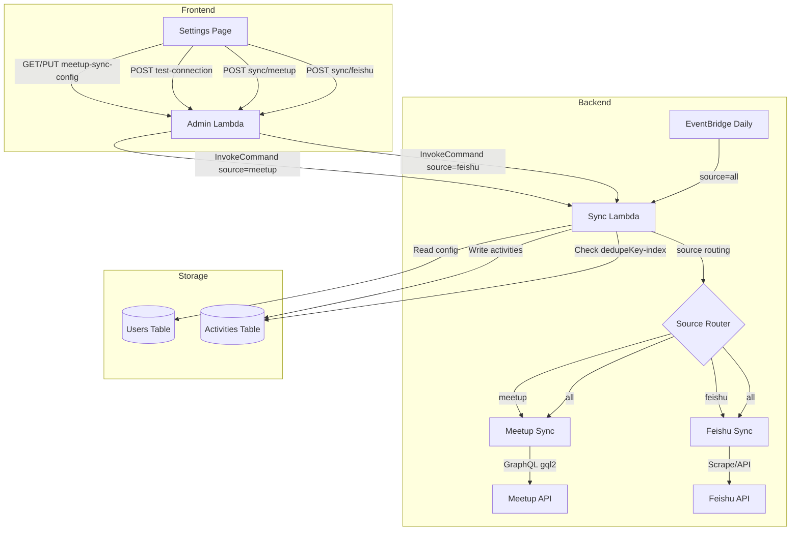

# Design Document: Meetup Sync

## Overview

Extend the existing activity sync system to support Meetup.com as a second data source alongside Feishu Bitable. A new `meetup-api.ts` module handles GraphQL queries to Meetup's `gql2` endpoint using Cookie-based authentication. The sync handler gains a `source` parameter (`feishu` | `meetup` | `all`) to route sync execution independently. Admin API endpoints provide CRUD for Meetup config and manual sync triggers. The frontend settings page adds a dedicated Meetup sync card with group management, cookie inputs, and independent sync/test buttons. All UI text is i18n-enabled across 5 languages.

## Architecture



### Key Design Decisions

1. **Separate module, shared handler**: `meetup-api.ts` is a new module in `packages/backend/src/sync/`. The existing `handler.ts` gains a source router but keeps the same Lambda function — no new Lambda needed.

2. **Cookie auth over OAuth2**: Meetup's public API requires OAuth2 with limited event access. Cookie auth (token + CSRF + session headers) provides full access to the GQL2 endpoint. OAuth2 fields are reserved in the config schema for future migration.

3. **Independent sync triggers**: Feishu and Meetup syncs are decoupled. Each has its own trigger button in the UI and its own API route (`POST /api/admin/sync/feishu`, `POST /api/admin/sync/meetup`). EventBridge uses `source=all` to run both sequentially.

4. **Config stored alongside Feishu config**: Meetup config uses a separate DynamoDB record (`meetup-sync-config`) in the same Users table, following the existing pattern for `activity-sync-config`.

## Components and Interfaces

### 1. Meetup GraphQL Client (`packages/backend/src/sync/meetup-api.ts`)

```typescript
/** Meetup group configuration */
export interface MeetupGroup {
  urlname: string;       // e.g. "hong-kong-amazon-aws-user-group"
  displayName: string;   // e.g. "AWS UGHK"
}

/** Cookie auth credentials */
export interface MeetupCookieAuth {
  meetupToken: string;   // MEETUP_MEMBER cookie value
  meetupCsrf: string;    // CSRF token
  meetupSession: string; // Session cookie
}

/** Single mapped Meetup event */
export interface MeetupEvent {
  activityType: string;    // Always "线下活动"
  ugName: string;          // From group displayName
  topic: string;           // Event title
  activityDate: string;    // YYYY-MM-DD from dateTime
  dedupeKey: string;       // {topic}#{activityDate}#{ugName}
  // Meetup-specific extra fields
  meetupEventId: string;
  meetupEventUrl: string;
  meetupGoingCount: number;
  meetupVenueName?: string;
  meetupVenueCity?: string;
}

/** Result from fetching a single group's events */
export interface MeetupGroupResult {
  success: boolean;
  events?: MeetupEvent[];
  error?: { code: string; message: string };
}

/** Fetch all events for a single Meetup group */
export async function fetchMeetupGroupEvents(
  group: MeetupGroup,
  auth: MeetupCookieAuth,
): Promise<MeetupGroupResult>;

/** Test connection by sending a lightweight query */
export async function testMeetupConnection(
  auth: MeetupCookieAuth,
): Promise<{ success: boolean; error?: { code: string; message: string } }>;

/** Map a raw GraphQL event node to MeetupEvent */
export function mapMeetupEvent(
  node: MeetupGraphQLEventNode,
  group: MeetupGroup,
): MeetupEvent | null;
```

**GraphQL Query Structure:**
```graphql
query ($urlname: String!, $status: EventStatus, $first: Int, $after: String) {
  groupByUrlname(urlname: $urlname) {
    events(input: { first: $first, after: $after, status: $status }) {
      pageInfo { hasNextPage endCursor }
      edges {
        node {
          id title dateTime eventUrl
          going { totalCount }
          venue { name city }
        }
      }
    }
  }
}
```

The client sends this query twice per group (once with `status: PAST`, once with `status: UPCOMING`), paginating with `first: 20` and cursor-based `after` parameter. HTTP headers include `Cookie`, `x-meetup-csrf`, and `Authorization: Bearer {token}`.

### 2. Sync Handler Updates (`packages/backend/src/sync/handler.ts`)

**New `source` parameter in event payload:**
```typescript
interface SyncEvent {
  source?: 'feishu' | 'meetup' | 'all';  // default: 'all'
}
```

**New config interface:**
```typescript
export interface MeetupSyncConfig {
  settingKey: string;  // 'meetup-sync-config'
  groups: MeetupGroup[];
  meetupToken: string;
  meetupCsrf: string;
  meetupSession: string;
  autoSyncEnabled: boolean;  // Whether EventBridge auto-sync includes Meetup
  // Reserved for future OAuth2
  clientId?: string;
  clientSecret?: string;
  refreshToken?: string;
  updatedAt: string;
  updatedBy: string;
}
```

**Updated handler flow:**
1. Parse `source` from event payload (default `'all'`)
2. If `source` is `'feishu'` or `'all'`: run existing Feishu sync
3. If `source` is `'meetup'` or `'all'`: read `meetup-sync-config`, if `source` is `'all'` check `autoSyncEnabled` flag (skip if false), iterate groups, call `fetchMeetupGroupEvents`, deduplicate via `dedupeKey-index` GSI, write to Activities table
4. Return combined result with `{ source, syncedCount, skippedCount, warnings }`

### 3. Admin Handler Routes (`packages/backend/src/admin/handler.ts`)

New routes (all SuperAdmin-only):

| Method | Path | Handler | Description |
|--------|------|---------|-------------|
| GET | `/api/admin/settings/meetup-sync-config` | `handleGetMeetupSyncConfig` | Read config, mask cookies |
| PUT | `/api/admin/settings/meetup-sync-config` | `handleUpdateMeetupSyncConfig` | Update config |
| POST | `/api/admin/settings/meetup-sync-config/test` | `handleTestMeetupConnection` | Test cookie auth |
| POST | `/api/admin/sync/meetup` | `handleMeetupSync` | Trigger Meetup-only sync |
| POST | `/api/admin/sync/feishu` | `handleFeishuSync` | Trigger Feishu-only sync (refactored) |

The existing `POST /api/admin/sync/activities` route is kept for backward compatibility but internally uses `source: 'all'`.

**Cookie masking logic:**
```typescript
function maskCookie(value: string): string {
  if (!value || value.length <= 4) return value ? '****' : '';
  return '*'.repeat(value.length - 4) + value.slice(-4);
}
```

**Masked PUT detection:** If a PUT request contains a cookie value starting with `*`, the handler retains the existing stored value from DynamoDB instead of overwriting.

### 4. Frontend Settings Page (`packages/frontend/src/pages/admin/settings.tsx`)

Add a new "Meetup Sync" section within the existing `activity-sync` category. The section renders as a separate card below the Feishu config card.

**State additions:**
```typescript
interface MeetupSyncConfigState {
  groups: { urlname: string; displayName: string }[];
  meetupToken: string;
  meetupCsrf: string;
  meetupSession: string;
  autoSyncEnabled: boolean;
  lastSyncTime?: string;
  lastSyncResult?: string;
}
```

**UI components:**
- Group list with add/remove controls
- Three password-masked inputs for cookie values
- "Save" button → `PUT /api/admin/settings/meetup-sync-config`
- "Test Connection" button → `POST /api/admin/settings/meetup-sync-config/test`
- "Sync Meetup" button → `POST /api/admin/sync/meetup`
- Last sync timestamp and status display

The existing Feishu sync button is refactored from `POST /api/admin/sync/activities` to `POST /api/admin/sync/feishu`.

### 5. i18n Keys (`packages/frontend/src/i18n/`)

New keys added under the existing `activitySync` namespace with a `meetup` prefix:

```typescript
// Added to activitySync in TranslationDict
meetupSectionTitle: string;
meetupSectionDesc: string;
meetupGroupsLabel: string;
meetupGroupUrlnamePlaceholder: string;
meetupGroupDisplayNamePlaceholder: string;
meetupAddGroup: string;
meetupRemoveGroup: string;
meetupTokenLabel: string;
meetupTokenPlaceholder: string;
meetupCsrfLabel: string;
meetupCsrfPlaceholder: string;
meetupSessionLabel: string;
meetupSessionPlaceholder: string;
meetupTestButton: string;
meetupTesting: string;
meetupTestSuccess: string;
meetupTestFailed: string;
meetupSyncButton: string;
meetupSyncing: string;
meetupSyncSuccess: string;
meetupSyncFailed: string;
meetupLastSyncLabel: string;
meetupAuthExpired: string;
meetupAutoSyncLabel: string;
meetupAutoSyncDesc: string;
meetupNoGroups: string;
feishuSyncButton: string;
feishuSyncing: string;
```

## Data Models

### Meetup Sync Config (DynamoDB Users Table)

| Field | Type | Description |
|-------|------|-------------|
| `userId` | String (PK) | `"meetup-sync-config"` |
| `groups` | List | Array of `{ urlname, displayName }` |
| `meetupToken` | String | MEETUP_MEMBER cookie value |
| `meetupCsrf` | String | CSRF token |
| `meetupSession` | String | Session cookie |
| `autoSyncEnabled` | Boolean | Whether EventBridge auto-sync includes Meetup (default `false`) |
| `clientId` | String | Reserved for OAuth2 |
| `clientSecret` | String | Reserved for OAuth2 |
| `refreshToken` | String | Reserved for OAuth2 |
| `lastSyncTime` | String | ISO timestamp of last sync |
| `lastSyncResult` | String | `"success"` or `"failed"` |
| `updatedAt` | String | ISO timestamp |
| `updatedBy` | String | User ID of last updater |

### Activity Record (Activities Table — existing, no schema changes)

| Field | Type | Description |
|-------|------|-------------|
| `activityId` | String (PK) | ULID |
| `pk` | String | `"ALL"` (for GSI) |
| `activityType` | String | `"线下活动"` for Meetup events |
| `ugName` | String | Group displayName |
| `topic` | String | Event title |
| `activityDate` | String | `YYYY-MM-DD` |
| `dedupeKey` | String | `{topic}#{activityDate}#{ugName}` |
| `syncedAt` | String | ISO timestamp |
| `sourceUrl` | String | Meetup event URL |
| `meetupEventId` | String | Meetup event ID (new, optional) |
| `meetupGoingCount` | Number | Attendee count (new, optional) |
| `meetupVenueName` | String | Venue name (new, optional) |
| `meetupVenueCity` | String | Venue city (new, optional) |

## Correctness Properties

*A property is a characteristic or behavior that should hold true across all valid executions of a system — essentially, a formal statement about what the system should do. Properties serve as the bridge between human-readable specifications and machine-verifiable correctness guarantees.*

### Property 1: Event data mapping preserves all fields

*For any* valid Meetup GraphQL event node and group configuration, mapping the event SHALL produce an activity record where: `activityType` equals `"线下活动"`, `ugName` equals the group's `displayName`, `topic` equals the event `title`, `activityDate` is the `YYYY-MM-DD` portion of `dateTime`, `dedupeKey` equals `{topic}#{activityDate}#{ugName}`, and Meetup-specific fields (`meetupEventId`, `meetupEventUrl`, `meetupGoingCount`, `meetupVenueName`, `meetupVenueCity`) are preserved from the source event.

**Validates: Requirements 2.1, 2.2, 2.3, 2.4, 2.5, 2.6**

### Property 2: Pagination collects all events across pages

*For any* sequence of paginated GraphQL responses (1 to N pages) where each page has `hasNextPage` and `endCursor` fields, the Meetup client SHALL collect all events from all pages into a single list whose length equals the sum of events across all pages.

**Validates: Requirements 1.3**

### Property 3: Cookie masking reveals only last 4 characters

*For any* non-empty cookie string of length L, the masking function SHALL return a string of length L where the first (L-4) characters are asterisks and the last 4 characters match the original string's last 4 characters. For strings of length ≤ 4, the function SHALL return `"****"`.

**Validates: Requirements 7.1, 8.4**

### Property 4: PUT with masked values retains existing stored values

*For any* existing Meetup config in DynamoDB and a PUT request body where some cookie fields contain masked values (starting with `*`), the handler SHALL retain the existing DynamoDB values for masked fields while updating non-masked fields with the new values from the request body.

**Validates: Requirements 8.5**

### Property 5: Group failure isolation

*For any* list of Meetup groups (2 or more) where some groups return errors during sync, the Sync Lambda SHALL still successfully sync events from the non-failing groups, and the total `syncedCount` SHALL equal the sum of events from successful groups only.

**Validates: Requirements 4.5, 9.2**

### Property 6: Deduplication skips existing events

*For any* set of Meetup events where some have dedupeKeys already present in the Activities table, the Sync Lambda SHALL write only events with new dedupeKeys, and `skippedCount` SHALL equal the number of events with existing dedupeKeys.

**Validates: Requirements 4.7**

### Property 7: Malformed event filtering

*For any* list of raw GraphQL event nodes where some are missing required fields (title, dateTime, or id), the mapping function SHALL skip malformed events and return only valid events, with the count of valid events being less than or equal to the total input count.

**Validates: Requirements 9.3**

## Error Handling

| Scenario | Error Code | Behavior |
|----------|-----------|----------|
| Meetup API unreachable (timeout) | `MEETUP_TIMEOUT` | Return failure after 10s timeout, log error |
| Cookie auth expired (401/403) | `MEETUP_AUTH_EXPIRED` | Return failure with descriptive warning |
| Group not found / private | `MEETUP_GROUP_ERROR` | Log error for group, continue with remaining groups |
| GraphQL errors in response | `MEETUP_API_ERROR` | Return failure with first error message |
| Malformed event (missing fields) | N/A | Skip event silently, log warning |
| No Meetup config in DynamoDB | N/A | Skip Meetup sync, proceed with Feishu only |
| Empty cookie fields in config | N/A | Skip Meetup sync, log warning |
| Meetup sync fails, Feishu succeeds | N/A | Return partial success with warnings |
| Non-SuperAdmin access | `FORBIDDEN` | Return 403 |

## Testing Strategy

### Unit Tests (Example-Based)

- **Meetup client**: Test GraphQL query construction, response parsing with mock data, error handling for various HTTP status codes
- **Source routing**: Test handler with `source=feishu`, `source=meetup`, `source=all`, verify correct functions are called
- **Admin routes**: Test GET/PUT/POST endpoints with mock DynamoDB, verify auth checks, input validation
- **Config defaults**: Test behavior when no config exists, when config has empty cookies

### Property-Based Tests

Property-based tests use `fast-check` (already used in the project) with minimum 100 iterations per property.

| Property | Test File | What Varies |
|----------|-----------|-------------|
| P1: Event mapping | `meetup-api.property.test.ts` | Event titles, dateTimes, group names, venue data |
| P2: Pagination | `meetup-api.property.test.ts` | Number of pages (1-5), events per page (0-20) |
| P3: Cookie masking | `meetup-api.property.test.ts` | Cookie string length and content |
| P4: Masked PUT | `handler.property.test.ts` | Which fields are masked vs updated |
| P5: Group failure | `handler.property.test.ts` | Number of groups, which ones fail |
| P6: Deduplication | `handler.property.test.ts` | Events with/without existing dedupeKeys |
| P7: Malformed filtering | `meetup-api.property.test.ts` | Events with random missing fields |

Each property test is tagged: `Feature: meetup-sync, Property {N}: {description}`

### Integration Tests

- End-to-end sync flow with mocked Meetup API and real DynamoDB local
- Admin API route integration with auth middleware
