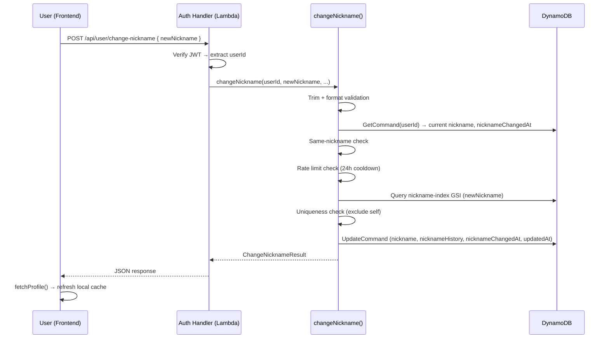
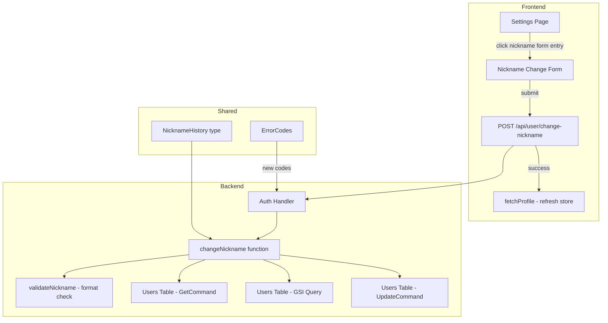

# Design Document: Nickname Change（昵称修改）

## Overview

本功能在现有设置页（Settings Page）新增「修改昵称」能力，允许已登录用户自行更新 `Users.nickname` 字段。设计复用现有「修改密码」的前端 UI 模式（展开/收起表单）和后端更新模式（Lambda handler → service function → DynamoDB UpdateCommand），保持架构一致性。

### Key Design Decisions

1. **昵称唯一性查重方案**：使用 DynamoDB `nickname-index` GSI（Global Secondary Index）在 Users 表上按 `nickname` 字段建立索引。通过 GSI Query 检查新昵称是否已存在（排除自身）。不使用 Scan 操作以保证性能。若 GSI 尚不存在则需新建。

2. **冷却期存储**：在 Users 表新增 `nicknameChangedAt` 字段（ISO 时间戳），记录最近一次成功改名时间。通过比较当前时间与 `nicknameChangedAt` 判断是否在 24 小时冷却期内。

3. **原子性写入**：`nickname`、`nicknameHistory`、`nicknameChangedAt`、`updatedAt` 四个字段在同一次 DynamoDB UpdateCommand 中更新，确保一致性。无需 TransactWriteItems，因为只涉及单条 Users 记录的更新。

4. **并发控制**：使用 DynamoDB ConditionExpression 在写入时检查 `nickname <> :newNickname`（确保写入时该用户的昵称未被并发修改为目标值）。对于跨用户并发场景（两人同时改为同一昵称），依赖 GSI 查询的最终一致性——极端情况下可能出现短暂重复，但需求文档（Req 3.3）已明确此为可接受行为。

5. **路由位置**：新增 `POST /api/user/change-nickname` 路由，挂载在现有 `auth handler` 中（与 `change-password` 并列），因为两者共享相同的认证验证逻辑。

## Architecture



### Component Interaction



## Components and Interfaces

### Backend: New Function — `changeNickname`

**File**: `packages/backend/src/user/change-nickname.ts`

```typescript
export interface NicknameHistoryEntry {
  previousNickname: string;
  changedAt: string; // ISO timestamp
}

export interface ChangeNicknameResult {
  success: boolean;
  error?: { code: string; message: string };
}

export async function changeNickname(
  userId: string,
  newNickname: string,
  dynamoClient: DynamoDBDocumentClient,
  tableName: string,
  nicknameIndexName: string,
): Promise<ChangeNicknameResult>;
```

### Backend: New Function — `validateNickname`

**File**: `packages/backend/src/user/nickname-validators.ts`

```typescript
export interface NicknameValidationResult {
  valid: boolean;
  trimmed: string; // trimmed value for downstream use
  error?: { code: string; message: string };
}

/**
 * Validates nickname format:
 * 1. Trim whitespace
 * 2. Check length >= 1 (not empty after trim)
 * 3. Check length <= 20 (Unicode codepoints)
 * 4. Check no control characters
 *
 * Returns first failing validation error (ordered).
 */
export function validateNickname(nickname: string): NicknameValidationResult;
```

### Backend: New Route

| Method | Path | Auth | Description |
|--------|------|------|-------------|
| `POST` | `/api/user/change-nickname` | Required (JWT) | Change the authenticated user's nickname |

**Request body:**
```json
{ "newNickname": "新昵称" }
```

**Response (success — 200):**
```json
{ "message": "昵称修改成功" }
```

**Response (error — 4xx):**
```json
{ "code": "NICKNAME_*", "message": "..." }
```

### Shared: New Error Codes

**File**: `packages/shared/src/errors.ts`

```typescript
// New error codes for nickname change
NICKNAME_EMPTY: 'NICKNAME_EMPTY',               // 400
NICKNAME_TOO_LONG: 'NICKNAME_TOO_LONG',         // 400
NICKNAME_INVALID_CHARS: 'NICKNAME_INVALID_CHARS', // 400
NICKNAME_SAME_AS_CURRENT: 'NICKNAME_SAME_AS_CURRENT', // 400
NICKNAME_ALREADY_TAKEN: 'NICKNAME_ALREADY_TAKEN', // 409
NICKNAME_CHANGE_TOO_FREQUENT: 'NICKNAME_CHANGE_TOO_FREQUENT', // 429
```

### Frontend: Settings Page Updates

**File**: `packages/frontend/src/pages/settings/index.tsx`

Changes (following existing `changePassword` pattern):
1. Add state variables: `showNicknameForm`, `newNickname`, `nicknameError`, `nicknameLoading`, `nicknameSuccess`
2. Add "修改昵称" item with expand/collapse chevron (positioned above "修改密码")
3. Add expandable form with single Input field + submit button
4. On success: call `fetchProfile()` to refresh store, show success message, collapse form after 1.5s

### Frontend: Store Updates

**File**: `packages/frontend/src/store/index.ts`

Add `changeNickname` action that calls `POST /api/user/change-nickname` (similar to existing `changePassword` pattern).

### Frontend: i18n Updates

All locale files need new keys:

| Key | zh | en |
|-----|----|----|
| `settings.changeNickname` | 修改昵称 | Change Nickname |
| `settings.newNicknamePlaceholder` | 请输入新昵称 | Enter new nickname |
| `settings.nicknameChangeSuccess` | 昵称修改成功 | Nickname changed successfully |
| `settings.nicknameEmpty` | 昵称不能为空 | Nickname cannot be empty |
| `settings.nicknameTooLong` | 昵称不能超过20个字符 | Nickname cannot exceed 20 characters |
| `settings.nicknameInvalidChars` | 昵称包含非法字符 | Nickname contains invalid characters |
| `settings.nicknameSameAsCurrent` | 新昵称与当前昵称相同 | New nickname is same as current |
| `settings.nicknameAlreadyTaken` | 该昵称已被使用 | This nickname is already taken |
| `settings.nicknameTooFrequent` | 改名过于频繁，请稍后再试 | Nickname change too frequent, please try later |

## Data Models

### Users Table (`PointsMall-Users`)

**Existing fields** (no change):

| Field | Type | Description |
|-------|------|-------------|
| `userId` | String (PK) | 用户主键 |
| `nickname` | String | 当前昵称 |
| `updatedAt` | String (ISO) | 最后更新时间 |

**New fields**:

| Field | Type | Description |
|-------|------|-------------|
| `nicknameHistory` | List\<NicknameHistoryEntry\> | 历次改名记录 `[{previousNickname, changedAt}]` |
| `nicknameChangedAt` | String (ISO) | 最近一次成功改名时间（用于冷却期判断） |

**New GSI** (if not exists):

| GSI Name | Partition Key | Sort Key | Projection |
|----------|--------------|----------|------------|
| `nickname-index` | `nickname` | — | `userId` only (KEYS_ONLY) |

### DynamoDB Operations

**1. GetCommand** — 获取当前用户记录：
```
Key: { userId }
ProjectionExpression: 'nickname, nicknameHistory, nicknameChangedAt'
```

**2. GSI Query** — 检查唯一性：
```
IndexName: 'nickname-index'
KeyConditionExpression: 'nickname = :newNickname'
ProjectionExpression: 'userId'
Limit: 1
```
若返回结果中包含 userId 且 ≠ 当前用户，则拒绝。

**3. UpdateCommand** — 原子更新：
```
Key: { userId }
UpdateExpression: 'SET nickname = :newNick, nicknameChangedAt = :now, updatedAt = :now, nicknameHistory = list_append(if_not_exists(nicknameHistory, :emptyList), :historyEntry)'
ExpressionAttributeValues: {
  ':newNick': trimmedNewNickname,
  ':now': new Date().toISOString(),
  ':emptyList': [],
  ':historyEntry': [{ previousNickname: currentNickname, changedAt: now }]
}
```

### Validation Pipeline (Fixed Order)

```
Input: rawNewNickname
  │
  ├─ Step 0: Check field exists → NICKNAME_EMPTY if missing
  │
  ├─ Step 1: trimmed = rawNewNickname.trim()
  │          if trimmed.length === 0 → NICKNAME_EMPTY
  │
  ├─ Step 2: if [...trimmed].length > 20 → NICKNAME_TOO_LONG
  │
  ├─ Step 3: if /[\x00-\x1F\x7F\u0080-\u009F]/.test(trimmed) → NICKNAME_INVALID_CHARS
  │
  ├─ Step 4: if trimmed === currentNickname → NICKNAME_SAME_AS_CURRENT
  │
  ├─ Step 5: if nicknameChangedAt && (now - nicknameChangedAt) < 24h → NICKNAME_CHANGE_TOO_FREQUENT
  │
  ├─ Step 6: GSI Query uniqueness check → NICKNAME_ALREADY_TAKEN
  │
  └─ Step 7: UpdateCommand → success
```

## Correctness Properties

*A property is a characteristic or behavior that should hold true across all valid executions of a system — essentially, a formal statement about what the system should do. Properties serve as the bridge between human-readable specifications and machine-verifiable correctness guarantees.*

### Property 1: Nickname format validation

*For any* string input, `validateNickname` SHALL accept the input if and only if its trimmed value has between 1 and 20 Unicode codepoints (inclusive) and contains no Unicode control characters (U+0000–U+001F, U+007F, U+0080–U+009F). Furthermore, when a string fails multiple validation rules, the returned error code SHALL correspond to the first failing rule in the fixed order: (1) empty → NICKNAME_EMPTY, (2) too long → NICKNAME_TOO_LONG, (3) control chars → NICKNAME_INVALID_CHARS.

**Validates: Requirements 2.1, 2.2, 2.3, 2.4, 2.5, 2.6, 2.7**

### Property 2: Same-nickname rejection

*For any* valid nickname string N that passes format validation, if the user's current nickname equals N (case-sensitive comparison after trim), then `changeNickname` SHALL reject the request with `NICKNAME_SAME_AS_CURRENT` and SHALL NOT modify any field on the user record (including `updatedAt`).

**Validates: Requirements 1.6**

### Property 3: Uniqueness enforcement

*For any* valid nickname string N and any set of existing users, `changeNickname` SHALL reject the request with `NICKNAME_ALREADY_TAKEN` if and only if there exists another user (userId ≠ requesting user) whose current `nickname` field exactly equals N (case-sensitive). Historical nicknames in `nicknameHistory` of any user SHALL NOT affect the uniqueness check.

**Validates: Requirements 3.1, 3.2, 3.4**

### Property 4: Rate limit cooldown

*For any* user with a `nicknameChangedAt` timestamp, `changeNickname` SHALL reject the request with `NICKNAME_CHANGE_TOO_FREQUENT` if the elapsed time between `nicknameChangedAt` and the current request time is less than 24 hours (86400000 ms). For any user without a `nicknameChangedAt` field (first-time change), the rate limit SHALL NOT apply.

**Validates: Requirements 4.1, 4.2, 4.3, 4.4, 4.5**

### Property 5: Successful change correctness

*For any* nickname change that passes all validations (format, same-check, rate limit, uniqueness), the resulting user record SHALL have: (a) `nickname` equal to the trimmed new nickname, (b) `nicknameHistory` array containing a new entry `{ previousNickname: oldNickname, changedAt: timestamp }` appended at the end, (c) `nicknameChangedAt` equal to the operation timestamp, and (d) all other fields (`roles`, `points`, `passwordHash`, `email`, `earnTotal`) unchanged.

**Validates: Requirements 1.3, 5.1, 5.2, 5.3, 6.2, 8.4**

### Property 6: Self-only authorization

*For any* request to the change-nickname endpoint, the system SHALL use the `userId` extracted from the JWT token as the target user. If the request body or path contains a different userId, it SHALL be ignored — the system SHALL always operate on the authenticated user's own record only.

**Validates: Requirements 8.1, 8.2**

## Error Handling

### Backend Error Cases

| Scenario | Error Code | HTTP Status | Message |
|----------|-----------|-------------|---------|
| Missing newNickname field | `NICKNAME_EMPTY` | 400 | 昵称不能为空 |
| Trimmed nickname is empty | `NICKNAME_EMPTY` | 400 | 昵称不能为空 |
| Trimmed nickname > 20 chars | `NICKNAME_TOO_LONG` | 400 | 昵称不能超过20个字符 |
| Contains control characters | `NICKNAME_INVALID_CHARS` | 400 | 昵称包含非法字符 |
| Same as current nickname | `NICKNAME_SAME_AS_CURRENT` | 400 | 新昵称与当前昵称相同 |
| Already taken by another user | `NICKNAME_ALREADY_TAKEN` | 409 | 该昵称已被使用 |
| Within 24h cooldown | `NICKNAME_CHANGE_TOO_FREQUENT` | 429 | 改名过于频繁，请{remainingTime}后再试 |
| Missing/expired JWT | `TOKEN_EXPIRED` | 401 | 访问令牌已过期 |
| User not found | `USER_NOT_FOUND` | 404 | 用户不存在 |

### Validation Order

错误按以下固定顺序返回，首个未通过即停止：

1. Authentication (JWT) — 401
2. Request body parsing (missing field) — 400
3. Format: empty — 400
4. Format: too long — 400
5. Format: control chars — 400
6. Same as current — 400
7. Rate limit — 429
8. Uniqueness — 409

### Graceful Degradation

- **GSI 最终一致性**：极端并发下可能短暂出现两个用户同名。下一次任意用户改名时，唯一性校验会恢复正常约束（Req 3.3 已声明此为可接受行为）。
- **用户记录不存在**：若 GetCommand 返回空，直接返回 `USER_NOT_FOUND`，不执行任何更新。
- **DynamoDB ConditionCheck 失败**：若 UpdateCommand 因 ConditionCheckFailedException 失败（极端并发），返回通用错误并提示重试。

## Testing Strategy

### Unit Tests (Example-Based)

覆盖特定场景、边界条件和 UI 交互：

- **changeNickname with valid input** → success, nickname updated
- **changeNickname with missing newNickname field** → NICKNAME_EMPTY
- **changeNickname with whitespace-only input** → NICKNAME_EMPTY
- **changeNickname with 21-char input** → NICKNAME_TOO_LONG
- **changeNickname with control character** → NICKNAME_INVALID_CHARS
- **changeNickname same as current** → NICKNAME_SAME_AS_CURRENT, no updatedAt change
- **changeNickname already taken** → NICKNAME_ALREADY_TAKEN
- **changeNickname within 24h cooldown** → NICKNAME_CHANGE_TOO_FREQUENT with remaining time
- **changeNickname first-time (no nicknameChangedAt)** → no rate limit applied
- **changeNickname with emoji** → success (emoji are valid, not control chars)
- **nicknameHistory initialized when undefined** → array created with first entry
- **Uniqueness check excludes self** → user can "keep" their own nickname in edge cases
- **Historical nicknames don't block** → a name in nicknameHistory but not current nickname is allowed
- **Settings page renders nickname form** → UI renders correctly
- **Form submission loading state** → button disabled during request

### Property-Based Tests

Property-based tests verify universal properties across many generated inputs. Each test runs a minimum of 100 iterations.

**Library**: `fast-check` (consistent with existing project `.property.test.ts` files)

**Tests to implement**:

1. **Feature: nickname-change, Property 1: Nickname format validation** — Generate random Unicode strings (varying lengths, with/without control chars, with whitespace padding), verify `validateNickname` returns correct accept/reject based on rules, and error priority is correct.

2. **Feature: nickname-change, Property 2: Same-nickname rejection** — Generate random valid nicknames, set as both current and new, verify rejection with NICKNAME_SAME_AS_CURRENT and no field modifications.

3. **Feature: nickname-change, Property 3: Uniqueness enforcement** — Generate random sets of existing users with random nicknames, attempt rename to various targets, verify uniqueness check correctly accepts/rejects and ignores historical nicknames.

4. **Feature: nickname-change, Property 4: Rate limit cooldown** — Generate random `nicknameChangedAt` timestamps and current times, verify rate limit accepts/rejects based on 24h boundary, and undefined `nicknameChangedAt` always passes.

5. **Feature: nickname-change, Property 5: Successful change correctness** — Generate random valid nicknames, mock all validations to pass, verify the resulting UpdateCommand correctly updates nickname, appends history, sets nicknameChangedAt, and preserves all other fields.

6. **Feature: nickname-change, Property 6: Self-only authorization** — Generate random userId pairs, verify that the endpoint always uses the JWT userId regardless of request body content.

### Integration Tests

- End-to-end change-nickname flow via HTTP handler with mocked DynamoDB
- Settings page form interaction (submit → success → profile refresh)
- Rate limit error displays remaining cooldown time in UI
