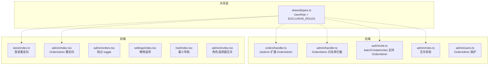

# 设计文档：OrderAdmin 角色（Order Admin Role）

## 概述

新增 `OrderAdmin` 独占角色，专用于订单管理。该角色与现有角色（Admin、SuperAdmin、Speaker、UserGroupLeader、Volunteer）互斥，仅由 SuperAdmin 通过邀请链接创建。OrderAdmin 用户只能访问订单相关的 admin API，前端仅展示订单管理页和设置页。

变更涉及六个层面：

1. **共享类型层**：`UserRole` 联合类型新增 `OrderAdmin`，新增 `EXCLUSIVE_ROLES` 常量
2. **后端访问控制层**：orders handler 允许 OrderAdmin 访问订单 API，admin handler 拒绝 OrderAdmin 访问非订单 API
3. **后端邀请/角色层**：邀请生成支持 OrderAdmin（仅 SuperAdmin），角色分配强制互斥
4. **前端登录/路由层**：OrderAdmin 登录后重定向到订单页，admin dashboard 重定向到订单页
5. **前端 UI 层**：OrderAdmin 看到精简的设置页和最小化导航
6. **i18n 层**：所有语言文件新增 OrderAdmin 标签翻译

设计原则：最小化变更范围，复用现有订单管理 UI，通过白名单模式控制 API 访问。

## 架构

### 变更范围



### 数据流

**OrderAdmin 登录流程：**
```
登录 → store.loginByEmail → 检测 roles 含 OrderAdmin → redirectTo /pages/admin/orders
```

**OrderAdmin API 请求流程：**
```
请求 /api/admin/orders → orders/handler.ts → isAdmin() 含 OrderAdmin → 允许
请求 /api/admin/users → admin/handler.ts → isAdmin() 含 OrderAdmin → 白名单检查 → 403
```

**OrderAdmin 邀请创建流程：**
```
SuperAdmin → invites.tsx → 选择 OrderAdmin → 互斥清除其他角色 → POST /api/admin/invites/batch → batchCreateInvites(roles: ['OrderAdmin'])
```

## 组件与接口

### 1. 共享类型变更（packages/shared/src/types.ts）

**UserRole 类型扩展：**

```typescript
export type UserRole = 'UserGroupLeader' | 'Speaker' | 'Volunteer' | 'Admin' | 'SuperAdmin' | 'OrderAdmin';
```

**新增常量：**

```typescript
/** 独占角色（与其他所有角色互斥） */
export const EXCLUSIVE_ROLES: UserRole[] = ['OrderAdmin'];
```

**数组变更：**
- `ADMIN_ROLES` 不变（仍为 `['Admin', 'SuperAdmin']`）
- `REGULAR_ROLES` 不变（仍为 `['UserGroupLeader', 'Speaker', 'Volunteer']`）
- `ALL_ROLES` 新增 `OrderAdmin`：`[...REGULAR_ROLES, ...ADMIN_ROLES, ...EXCLUSIVE_ROLES]`

**新增辅助函数：**

```typescript
/** 判断用户是否为 OrderAdmin */
export function isOrderAdmin(roles: UserRole[]): boolean {
  return roles.includes('OrderAdmin');
}

/** 判断角色是否为独占角色 */
export function isExclusiveRole(role: UserRole): boolean {
  return EXCLUSIVE_ROLES.includes(role);
}

/** 校验角色组合是否合法（独占角色不能与其他角色共存） */
export function validateRoleExclusivity(roles: UserRole[]): { valid: boolean; message?: string } {
  const hasExclusive = roles.some(r => EXCLUSIVE_ROLES.includes(r));
  if (hasExclusive && roles.length > 1) {
    return { valid: false, message: '独占角色不能与其他角色共存' };
  }
  return { valid: true };
}
```

### 2. 后端订单 Handler 变更（packages/backend/src/orders/handler.ts）

**isAdmin 函数扩展：**

```typescript
function isAdmin(event: AuthenticatedEvent): boolean {
  return hasAdminAccess(event.user.roles as UserRole[]) || isOrderAdmin(event.user.roles as UserRole[]);
}
```

**OrderAdmin 绕过 feature toggle：**

在 admin 路由区域，OrderAdmin 与 SuperAdmin 一样绕过 `adminOrdersEnabled` toggle 检查：

```typescript
if (path.startsWith('/api/admin/')) {
  if (!isAdmin(event)) {
    return errorResponse('FORBIDDEN', '需要管理员权限', 403);
  }
  // OrderAdmin 和 SuperAdmin 绕过 toggle
  if (!isSuperAdmin(event.user.roles as UserRole[]) && !isOrderAdmin(event.user.roles as UserRole[])) {
    const toggles = await getFeatureToggles(dynamoClient, USERS_TABLE);
    if (!toggles.adminOrdersEnabled) {
      return errorResponse('FORBIDDEN', '管理员暂无订单管理权限', 403);
    }
  }
  // ... 路由处理
}
```

### 3. 后端 Admin Handler 变更（packages/backend/src/admin/handler.ts）

**isAdmin 函数扩展：**

```typescript
function isAdmin(event: AuthenticatedEvent): boolean {
  return event.user.roles.some(r => r === 'Admin' || r === 'SuperAdmin' || r === 'OrderAdmin');
}
```

**OrderAdmin 白名单拦截：**

在 `authenticatedHandler` 中，isAdmin 检查通过后，立即检查是否为 OrderAdmin。如果是，仅放行订单相关路由，其余返回 403：

```typescript
// OrderAdmin 白名单：仅允许访问订单相关路由
if (isOrderAdmin(event.user.roles as UserRole[])) {
  // 订单路由由 orders handler 处理，不经过 admin handler
  // admin handler 中没有订单路由，所以 OrderAdmin 在此一律 403
  return errorResponse('FORBIDDEN', 'OrderAdmin 仅可访问订单管理功能', 403);
}
```

> **注意**：订单 admin API（`/api/admin/orders/*`）由 `orders/handler.ts` 处理，不经过 `admin/handler.ts`。因此 OrderAdmin 在 `admin/handler.ts` 中的所有请求都应被拒绝。

### 4. 后端邀请系统变更（packages/backend/src/auth/invite.ts）

**batchCreateInvites 校验扩展：**

当前校验要求所有角色属于 `REGULAR_ROLES`。需要扩展为：
- 如果 roles 包含 `OrderAdmin`，则 roles 必须恰好为 `['OrderAdmin']`（独占）
- 如果 roles 不包含 `OrderAdmin`，保持现有校验（每个角色 ∈ REGULAR_ROLES）

```typescript
// 独占角色校验
const hasExclusive = uniqueRoles.some(r => EXCLUSIVE_ROLES.includes(r));
if (hasExclusive) {
  if (uniqueRoles.length !== 1) {
    return { success: false, error: { code: 'EXCLUSIVE_ROLE_CONFLICT', message: '独占角色不能与其他角色组合' } };
  }
  // 独占角色合法，跳过 REGULAR_ROLES 校验
} else {
  // 现有校验：每个角色 ∈ REGULAR_ROLES
  for (const role of uniqueRoles) {
    if (!REGULAR_ROLES.includes(role)) { ... }
  }
}
```

### 5. 后端 Admin Handler 邀请路由变更

**handleBatchGenerateInvites 权限检查：**

当请求的 roles 包含 `OrderAdmin` 时，调用者必须是 SuperAdmin：

```typescript
async function handleBatchGenerateInvites(event: AuthenticatedEvent) {
  const body = parseBody(event);
  // ... 现有校验 ...
  const roles = body.roles as UserRole[];
  
  // OrderAdmin 邀请仅 SuperAdmin 可创建
  if (roles.includes('OrderAdmin') && !isSuperAdmin(event.user.roles as UserRole[])) {
    return errorResponse('FORBIDDEN', '仅 SuperAdmin 可创建 OrderAdmin 邀请', 403);
  }
  // ... 继续处理 ...
}
```

### 6. 后端角色分配变更（packages/backend/src/admin/roles.ts）

**VALID_ROLES 扩展：**

```typescript
const VALID_ROLES: UserRole[] = ['UserGroupLeader', 'Speaker', 'Volunteer', 'Admin', 'OrderAdmin'];
```

**assignRoles 互斥校验：**

在 assignRoles 函数中，写入前校验角色互斥性：

```typescript
// 独占角色互斥校验
const exclusivityCheck = validateRoleExclusivity(finalRoles as UserRole[]);
if (!exclusivityCheck.valid) {
  return { success: false, error: { code: 'EXCLUSIVE_ROLE_CONFLICT', message: exclusivityCheck.message! } };
}
```

**OrderAdmin 角色分配权限：**

仅 SuperAdmin 可分配 OrderAdmin 角色（类似 Admin 角色的权限要求）：

```typescript
export function validateRoleAssignment(callerRoles: string[], targetRoles: string[]): RoleOperationResult {
  // ... 现有 SuperAdmin/Admin 检查 ...
  if (targetRoles.includes('OrderAdmin') && !callerRoles.includes('SuperAdmin')) {
    return { success: false, error: { code: 'ORDER_ADMIN_REQUIRES_SUPERADMIN', message: '仅 SuperAdmin 可分配 OrderAdmin 角色' } };
  }
  return { success: true };
}
```

### 7. 后端用户管理保护（packages/backend/src/admin/users.ts）

**setUserStatus 和 deleteUser 扩展：**

非 SuperAdmin 不能操作 OrderAdmin 用户：

```typescript
// Only SuperAdmin can manage OrderAdmin users
if (targetRoles.includes('OrderAdmin') && !callerRoles.includes('SuperAdmin')) {
  return {
    success: false,
    error: { code: 'ONLY_SUPERADMIN_CAN_MANAGE_ORDER_ADMIN', message: '仅 SuperAdmin 可管理 OrderAdmin 用户' },
  };
}
```

### 8. 前端 Store 登录重定向（packages/frontend/src/store/index.ts）

**UserRole 类型扩展：**

```typescript
export type UserRole = 'UserGroupLeader' | 'Speaker' | 'Volunteer' | 'Admin' | 'SuperAdmin' | 'OrderAdmin';
```

**loginByEmail 重定向逻辑：**

登录成功后，检测 OrderAdmin 角色并重定向：

```typescript
loginByEmail: async (email, password) => {
  const res = await request<AuthResponse>({ ... });
  setToken(res.accessToken);
  const user = { ...res.user, roles: filterDisabledRoles(res.user.roles) };
  saveUser(user);
  set({ isAuthenticated: true, user });
  
  // OrderAdmin 重定向到订单管理页
  if (user.roles.includes('OrderAdmin')) {
    Taro.redirectTo({ url: '/pages/admin/orders' });
  }
},
```

> 注意：`register` 方法也需要同样的重定向逻辑。

### 9. 前端 Admin Dashboard 重定向（packages/frontend/src/pages/admin/index.tsx）

在 `useEffect` 中，检测 OrderAdmin 并立即重定向：

```typescript
useEffect(() => {
  if (!isAuthenticated) { ... }
  // OrderAdmin 重定向到订单页
  if (user?.roles?.includes('OrderAdmin')) {
    Taro.redirectTo({ url: '/pages/admin/orders' });
    return;
  }
  const hasAdminAccess = user?.roles?.some(r => r === 'Admin' || r === 'SuperAdmin');
  if (!hasAdminAccess) { ... }
  // ... 现有逻辑
}, [isAuthenticated, user]);
```

### 10. 前端订单页变更（packages/frontend/src/pages/admin/orders.tsx）

**OrderAdmin 绕过 feature toggle：**

```typescript
const isOrderAdmin = userRoles.includes('OrderAdmin');

useEffect(() => {
  // OrderAdmin 和 SuperAdmin 始终有权限
  if (!isSuperAdmin && !isOrderAdmin) {
    // 现有 toggle 检查逻辑
  } else {
    fetchStats();
    fetchOrders(activeTab, 1);
  }
}, [...]);
```

**返回按钮行为：**

OrderAdmin 的返回按钮应导航到设置页而非 admin dashboard：

```typescript
const handleBack = () => {
  if (isOrderAdmin) {
    goBack('/pages/settings/index');
  } else {
    goBack('/pages/admin/index');
  }
};
```

### 11. 前端设置页变更（packages/frontend/src/pages/settings/index.tsx）

**OrderAdmin 精简显示：**

```typescript
const isOrderAdmin = userRoles.includes('OrderAdmin');
const isAdmin = userRoles.includes('Admin') || userRoles.includes('SuperAdmin');

// 设置项渲染
// 始终显示：修改密码、主题切换、语言切换、登出
// 仅 Admin/SuperAdmin 显示：管理面板入口
// OrderAdmin 不显示管理面板入口（isAdmin 为 false）
```

由于现有代码中 `isAdmin` 已经只检查 `Admin` 和 `SuperAdmin`，OrderAdmin 自然不会看到管理面板入口。无需额外修改此逻辑。

### 12. 前端 Hub 页导航变更（packages/frontend/src/pages/hub/index.tsx）

**OrderAdmin 最小化导航：**

OrderAdmin 用户在 Hub 页只看到两个入口：订单管理和设置。

```typescript
const isOrderAdmin = user?.roles?.includes('OrderAdmin');

// OrderAdmin 专用布局
if (isOrderAdmin) {
  return (
    <View className='hub-page'>
      {/* 简化 header */}
      <View className='hub-grid'>
        <View className='hub-card' onClick={() => Taro.redirectTo({ url: '/pages/admin/orders' })}>
          {/* 订单管理 */}
        </View>
        <View className='hub-card' onClick={() => Taro.navigateTo({ url: '/pages/settings/index' })}>
          {/* 设置 */}
        </View>
      </View>
    </View>
  );
}
```

**ROLE_CONFIG 扩展：**

```typescript
const ROLE_CONFIG: Record<UserRole, { label: string; className: string }> = {
  // ... 现有角色 ...
  OrderAdmin: { label: 'OrderAdmin', className: 'role-badge--order-admin' },
};
```

### 13. 前端邀请页变更（packages/frontend/src/pages/admin/invites.tsx）

**角色选择器互斥逻辑：**

SuperAdmin 可见 OrderAdmin 选项。选择 OrderAdmin 时清除其他角色，选择其他角色时清除 OrderAdmin：

```typescript
const toggleRole = (role: string) => {
  if (EXCLUSIVE_ROLES.includes(role)) {
    // 选择独占角色：清除其他所有角色
    setFormRoles((prev) => prev.includes(role) ? [] : [role]);
  } else {
    // 选择普通角色：清除独占角色
    setFormRoles((prev) => {
      const withoutExclusive = prev.filter(r => !EXCLUSIVE_ROLES.includes(r));
      return withoutExclusive.includes(role)
        ? withoutExclusive.filter(r => r !== role)
        : [...withoutExclusive, role];
    });
  }
};
```

**ROLE_OPTIONS 条件扩展：**

```typescript
const isSuperAdmin = userRoles.includes('SuperAdmin');

const roleOptions = [
  ...ROLE_OPTIONS,
  ...(isSuperAdmin ? [{ value: 'OrderAdmin', label: 'OrderAdmin', className: 'role-badge--order-admin' }] : []),
];
```

### 14. i18n 翻译变更

所有语言文件新增 `roles.orderAdmin` 翻译键：

| 语言 | 键 | 值 |
|------|-----|-----|
| zh | `roles.orderAdmin` | `订单管理员` |
| en | `roles.orderAdmin` | `Order Admin` |
| ja | `roles.orderAdmin` | `注文管理者` |
| ko | `roles.orderAdmin` | `주문 관리자` |
| zh-TW | `roles.orderAdmin` | `訂單管理員` |

Hub 页 OrderAdmin 导航项翻译：

| 语言 | 键 | 值 |
|------|-----|-----|
| zh | `hub.orderManagement` | `订单管理` |
| en | `hub.orderManagement` | `Order Management` |
| ja | `hub.orderManagement` | `注文管理` |
| ko | `hub.orderManagement` | `주문 관리` |
| zh-TW | `hub.orderManagement` | `訂單管理` |

## 数据模型

### UserRole 类型变更

| 值 | 分类 | 说明 |
|-----|------|------|
| UserGroupLeader | REGULAR_ROLES | 用户组长 |
| Speaker | REGULAR_ROLES | 讲师 |
| Volunteer | REGULAR_ROLES | 志愿者 |
| Admin | ADMIN_ROLES | 管理员 |
| SuperAdmin | ADMIN_ROLES | 超级管理员 |
| **OrderAdmin** | **EXCLUSIVE_ROLES** | **订单管理员（新增）** |

### 角色常量数组

| 常量 | 内容 | 用途 |
|------|------|------|
| `ADMIN_ROLES` | `['Admin', 'SuperAdmin']` | 管理权限判断（不变） |
| `REGULAR_ROLES` | `['UserGroupLeader', 'Speaker', 'Volunteer']` | 普通角色（不变） |
| `EXCLUSIVE_ROLES` | `['OrderAdmin']` | 独占角色互斥检查（新增） |
| `ALL_ROLES` | `[...REGULAR_ROLES, ...ADMIN_ROLES, ...EXCLUSIVE_ROLES]` | 全部角色（扩展） |

### OrderAdmin API 白名单

| 方法 | 路径 | 说明 |
|------|------|------|
| GET | `/api/admin/orders` | 订单列表 |
| GET | `/api/admin/orders/stats` | 订单统计 |
| GET | `/api/admin/orders/:id` | 订单详情 |
| PATCH | `/api/admin/orders/:id/shipping` | 更新物流状态 |

所有其他 `/api/admin/*` 路由对 OrderAdmin 返回 403。


## 正确性属性（Correctness Properties）

*属性（Property）是在系统所有合法执行中都应成立的特征或行为——本质上是对系统应做之事的形式化陈述。属性是人类可读规格与机器可验证正确性保证之间的桥梁。*

### Property 1: 角色互斥不变量（Role exclusivity invariant）

*For any* 角色数组，如果其中包含 `EXCLUSIVE_ROLES` 中的任一角色（如 `OrderAdmin`），则 `validateRoleExclusivity` 应在数组长度 > 1 时返回 `{ valid: false }`，在数组长度 === 1 时返回 `{ valid: true }`。*For any* 不含独占角色的角色数组，`validateRoleExclusivity` 应始终返回 `{ valid: true }`。

**Validates: Requirements 10.1, 10.2, 10.3**

### Property 2: OrderAdmin API 白名单强制执行（OrderAdmin API whitelist enforcement）

*For any* admin API 路径（`/api/admin/*`）不属于订单白名单（`GET /api/admin/orders`, `GET /api/admin/orders/stats`, `GET /api/admin/orders/:id`, `PATCH /api/admin/orders/:id/shipping`），当请求者角色为 `['OrderAdmin']` 时，系统应返回 HTTP 403。

**Validates: Requirements 3.4**

### Property 3: 非 SuperAdmin 不可操作 OrderAdmin 用户（Non-SuperAdmin cannot modify OrderAdmin users）

*For any* 用户操作（setUserStatus、deleteUser），当目标用户角色包含 `OrderAdmin` 且调用者角色不包含 `SuperAdmin` 时，操作应返回 `{ success: false }` 并包含权限错误。

**Validates: Requirements 9.2, 9.3**

### Property 4: 独占角色邀请创建一致性（Exclusive role invite creation consistency）

*For any* 包含独占角色的邀请创建请求，如果 roles 数组恰好为 `['OrderAdmin']`，则创建应成功且存储的 roles 字段恰好为 `['OrderAdmin']`。如果 roles 数组包含 `OrderAdmin` 和其他角色，则创建应失败并返回 `EXCLUSIVE_ROLE_CONFLICT` 错误。

**Validates: Requirements 2.5, 10.3**

## 错误处理

### 新增错误码

| 错误码 | HTTP 状态 | 触发条件 | 消息 |
|--------|----------|---------|------|
| EXCLUSIVE_ROLE_CONFLICT | 400 | 独占角色与其他角色组合 | 独占角色不能与其他角色共存 |
| ORDER_ADMIN_REQUIRES_SUPERADMIN | 403 | 非 SuperAdmin 尝试分配 OrderAdmin | 仅 SuperAdmin 可分配 OrderAdmin 角色 |
| ONLY_SUPERADMIN_CAN_MANAGE_ORDER_ADMIN | 403 | 非 SuperAdmin 尝试操作 OrderAdmin 用户 | 仅 SuperAdmin 可管理 OrderAdmin 用户 |

### 现有错误码复用

| 错误码 | 触发条件 |
|--------|---------|
| FORBIDDEN (403) | OrderAdmin 访问非订单 admin API |
| FORBIDDEN (403) | 非 SuperAdmin 创建 OrderAdmin 邀请 |

### 前端错误处理

- OrderAdmin 访问 admin dashboard → 静默重定向到订单页（无错误提示）
- OrderAdmin 访问非订单 admin 页面 → 重定向到订单页
- 邀请表单中独占角色冲突 → 前端自动处理互斥（无需错误提示）

## 测试策略

### 属性测试（Property-Based Testing）

使用 `fast-check` 库，每个属性测试至少运行 100 次迭代。

**测试文件：** `packages/shared/src/types.test.ts`（扩展现有）

| 属性 | 测试内容 | 生成器 |
|------|---------|--------|
| Property 1 | validateRoleExclusivity 对独占/非独占角色组合的行为 | `fc.subarray(ALL_ROLES)` 组合生成 |

**测试文件：** `packages/backend/src/admin/order-admin-access.property.test.ts`（新建）

| 属性 | 测试内容 | 生成器 |
|------|---------|--------|
| Property 2 | OrderAdmin 对非白名单 admin API 返回 403 | `fc.constantFrom(...NON_ORDER_ADMIN_PATHS)` |
| Property 3 | 非 SuperAdmin 对 OrderAdmin 用户操作返回错误 | `fc.constantFrom('setUserStatus', 'deleteUser')` × `fc.subarray(NON_SUPERADMIN_ROLES)` |

**测试文件：** `packages/backend/src/admin/order-admin-invite.property.test.ts`（新建）

| 属性 | 测试内容 | 生成器 |
|------|---------|--------|
| Property 4 | 独占角色邀请创建的成功/失败行为 | `fc.subarray(ALL_ROLES, { minLength: 1 })` 含/不含 OrderAdmin |

每个测试标注格式：`Feature: order-admin-role, Property N: {property_text}`

### 单元测试

**packages/shared/src/types.test.ts**（扩展）：
- OrderAdmin 在 ALL_ROLES 中
- OrderAdmin 不在 ADMIN_ROLES 中
- OrderAdmin 不在 REGULAR_ROLES 中
- EXCLUSIVE_ROLES 包含 OrderAdmin
- isOrderAdmin 辅助函数正确性
- validateRoleExclusivity 边界情况

**packages/backend/src/orders/handler.test.ts**（扩展）：
- OrderAdmin 可访问 GET /api/admin/orders
- OrderAdmin 可访问 GET /api/admin/orders/stats
- OrderAdmin 可访问 GET /api/admin/orders/:id
- OrderAdmin 可访问 PATCH /api/admin/orders/:id/shipping
- OrderAdmin 绕过 adminOrdersEnabled toggle

**packages/backend/src/admin/handler.test.ts**（扩展）：
- OrderAdmin 访问任何 admin handler 路由返回 403

**packages/backend/src/admin/roles.test.ts**（扩展）：
- assignRoles 含 OrderAdmin 的互斥校验
- 仅 SuperAdmin 可分配 OrderAdmin

**packages/backend/src/admin/users.test.ts**（扩展）：
- 非 SuperAdmin 不能 disable/delete OrderAdmin 用户
- SuperAdmin 可以 disable/delete OrderAdmin 用户

**packages/backend/src/admin/invites.test.ts**（扩展）：
- OrderAdmin 邀请创建成功（roles: ['OrderAdmin']）
- OrderAdmin + 其他角色邀请创建失败
- 非 SuperAdmin 创建 OrderAdmin 邀请被拒绝
