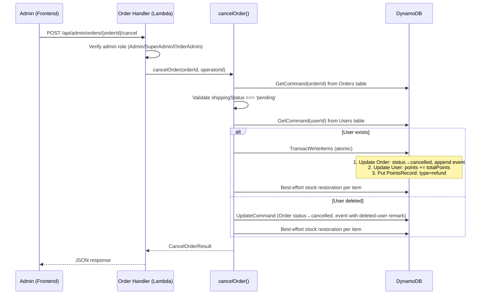
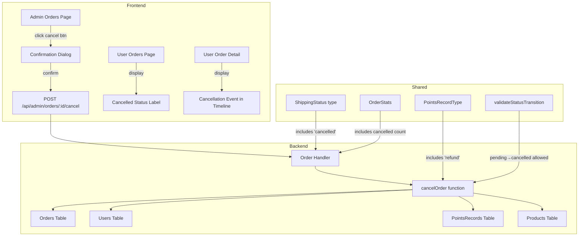

# Design Document: Order Cancel & Refund

## Overview

This feature adds an "Unable to Ship" (无法完成发货) order cancellation and refund capability to the admin order management system. When an admin determines that a pending order cannot be fulfilled, they can cancel the order through a confirmation dialog. The backend atomically refunds the user's points, restores product stock (including size-specific stock), creates an audit trail in the points history, and updates the order status to `"cancelled"`.

The design prioritizes **atomicity** (all-or-nothing via DynamoDB TransactWriteItems), **backward compatibility** (extending existing types without breaking live production), and **graceful degradation** (handling deleted users and missing products).

### Key Design Decisions

1. **Two-phase transaction for deleted products**: Since DynamoDB TransactWriteItems fails entirely if any item doesn't exist, we cannot include stock restoration for potentially-deleted products in the main transaction. Instead, the main transaction handles order status + points refund + points record atomically, and stock restoration is done in a separate best-effort pass. This avoids the entire cancellation failing because a product was removed from the catalog.

2. **`"cancelled"` as a branch state, not a linear status**: The existing `SHIPPING_STATUS_ORDER` array (`['pending', 'shipped']`) represents a linear flow. `"cancelled"` is a terminal branch off `"pending"`, so it is NOT added to `SHIPPING_STATUS_ORDER`. Instead, `validateStatusTransition` gets a special case for `pending → cancelled`.

3. **`"refund"` as a new PointsRecordType**: Refunds are distinct from `"earn"` because they don't increase `earnTotal` (which gates travel sponsorship eligibility). A dedicated type makes audit queries straightforward.

4. **Deleted user handling**: If the user no longer exists, the transaction skips points refund and points record creation but still cancels the order and restores stock. The shipping event remark clearly indicates the user was deleted.

## Architecture



### Component Interaction



## Components and Interfaces

### Backend: New Function — `cancelOrder`

**File**: `packages/backend/src/orders/admin-order.ts`

```typescript
export interface CancelOrderResult {
  success: boolean;
  error?: { code: string; message: string };
  userDeleted?: boolean; // true when user was not found, points not refunded
}

export async function cancelOrder(
  orderId: string,
  operatorId: string,
  dynamoClient: DynamoDBDocumentClient,
  tables: {
    ordersTable: string;
    usersTable: string;
    productsTable: string;
    pointsRecordsTable: string;
  },
): Promise<CancelOrderResult>;
```

### Backend: New Route

**File**: `packages/backend/src/orders/handler.ts`

| Method | Path | Auth | Description |
|--------|------|------|-------------|
| `POST` | `/api/admin/orders/{orderId}/cancel` | Admin, SuperAdmin, OrderAdmin | Cancel a pending order and process refund |

Request body: none (orderId from path parameter).

Response (success): `{ "message": "订单已取消并退还积分" }` or `{ "message": "订单已取消（用户已删除，积分未退还）" }` with HTTP 200.

Response (error): Standard error response with appropriate error code.

### Backend: Updated Function — `getOrderStats`

**File**: `packages/backend/src/orders/admin-order.ts`

The existing `getOrderStats` function will be updated to count `cancelled` orders in addition to `pending` and `shipped`.

### Shared: Type Updates

**File**: `packages/shared/src/types.ts`

```typescript
// Updated ShippingStatus — add 'cancelled'
export type ShippingStatus = 'pending' | 'shipped' | 'cancelled';

// Updated PointsRecordType — add 'refund'
export type PointsRecordType = 'earn' | 'spend' | 'refund';

// Updated OrderStats — add cancelled count
export interface OrderStats {
  pending: number;
  shipped: number;
  cancelled: number;
  total: number;
}

// SHIPPING_STATUS_ORDER remains unchanged: ['pending', 'shipped']
// 'cancelled' is a branch state, not part of the linear flow
```

**File**: `packages/shared/src/types.ts` — `validateStatusTransition`

```typescript
export function validateStatusTransition(
  current: ShippingStatus,
  target: ShippingStatus,
): { valid: boolean; message?: string } {
  // Special case: pending → cancelled is always valid
  if (current === 'pending' && target === 'cancelled') {
    return { valid: true };
  }
  // Existing linear flow logic
  const currentIdx = SHIPPING_STATUS_ORDER.indexOf(current);
  const targetIdx = SHIPPING_STATUS_ORDER.indexOf(target);
  if (targetIdx === currentIdx + 1) {
    return { valid: true };
  }
  return { valid: false, message: '物流状态不可回退' };
}
```

**File**: `packages/shared/src/errors.ts` — New error code

```typescript
// No new error codes needed — reuses ORDER_NOT_FOUND, INVALID_STATUS_TRANSITION, FORBIDDEN
```

### Frontend: Admin Orders Page Updates

**File**: `packages/frontend/src/pages/admin/orders.tsx`

Changes:
1. Add `cancelled` to `STATUS_LABELS` and `STATUS_TABS`
2. Add "Unable to Ship" button in order detail view (visible only when `shippingStatus === 'pending'`)
3. Add confirmation dialog component
4. Add cancel request handler with loading state
5. Update stats display to include cancelled count

### Frontend: User Orders Page Updates

**File**: `packages/frontend/src/pages/orders/index.tsx`

Changes:
1. Add `cancelled` entry to `STATUS_CONFIG` with appropriate icon and class

**File**: `packages/frontend/src/pages/order-detail/index.tsx`

Changes:
1. Add `cancelled` to `STATUS_LABEL_KEY`, `STATUS_ICON`, `STATUS_CLASS`
2. Display refund information when order is cancelled

### Frontend: SCSS Updates

**File**: `packages/frontend/src/pages/admin/orders.scss`

Add styles for:
- `.order-card__status--cancelled` — red/error-themed status badge
- `.cancel-confirm-dialog` — confirmation modal overlay and content
- `.shipping-timeline__item--cancelled` — timeline dot style for cancelled events

**File**: `packages/frontend/src/pages/orders/index.scss`

Add:
- `.orders-status--cancelled` — cancelled status badge for user order list

**File**: `packages/frontend/src/pages/order-detail/index.scss`

Add:
- `.detail-timeline__dot--cancelled` — timeline dot for cancelled events
- `.detail-refund-info` — refund information display block

### Frontend: i18n Updates

All 5 locale files (`zh.ts`, `en.ts`, `zh-TW.ts`, `ja.ts`, `ko.ts`) need new keys:

| Key | zh | en |
|-----|----|----|
| `admin.orders.statusCancelled` | 已取消 | Cancelled |
| `admin.orders.cancelButton` | 无法完成发货 | Unable to Ship |
| `admin.orders.cancelDialogTitle` | 确认取消订单 | Confirm Order Cancellation |
| `admin.orders.cancelDialogMessage` | 确认取消订单 {orderId}？将退还 {points} 积分给用户。 | Cancel order {orderId}? {points} points will be refunded. |
| `admin.orders.cancelConfirmButton` | 确认取消 | Confirm Cancel |
| `admin.orders.cancelSuccess` | 订单已取消并退还积分 | Order cancelled and points refunded |
| `admin.orders.cancelSuccessUserDeleted` | 订单已取消（用户已删除，积分未退还） | Order cancelled (user deleted, points not refunded) |
| `admin.orders.statsCancelled` | 已取消 | Cancelled |
| `orders.statusCancelled` | 已取消 | Cancelled |
| `orders.refundInfo` | 已退还 {points} 积分 | {points} points refunded |

## Data Models

### Orders Table (`PointsMall-Orders`)

**Existing fields** (no schema change, only new status value):

| Field | Type | Change |
|-------|------|--------|
| `orderId` | String (PK) | — |
| `userId` | String | — |
| `items` | List\<OrderItem\> | — |
| `totalPoints` | Number | — |
| `shippingStatus` | String | Now accepts `"cancelled"` in addition to `"pending"` and `"shipped"` |
| `shippingEvents` | List\<ShippingEvent\> | Cancellation event appended |
| `createdAt` | String (ISO) | — |
| `updatedAt` | String (ISO) | Updated on cancellation |

**GSI Impact**: The `shippingStatus-createdAt-index` GSI automatically indexes orders with `shippingStatus = "cancelled"`, so admin queries filtering by cancelled status work without any GSI changes.

### Users Table (`PointsMall-Users`)

| Field | Type | Change |
|-------|------|--------|
| `userId` | String (PK) | — |
| `points` | Number | Increased by `totalPoints` on refund |
| `earnTotal` | Number | **NOT modified** during refund (Req 4.3) |

### Products Table (`PointsMall-Products`)

| Field | Type | Change |
|-------|------|--------|
| `productId` | String (PK) | — |
| `stock` | Number | Increased by item quantity on cancellation |
| `redemptionCount` | Number | Decreased by item quantity on cancellation |
| `sizeOptions` | List\<SizeOption\> | Size-specific stock restored if `selectedSize` present |

### PointsRecords Table (`PointsMall-PointsRecords`)

**New record type for refunds**:

| Field | Value |
|-------|-------|
| `recordId` | ULID |
| `userId` | Order's userId |
| `type` | `"refund"` |
| `amount` | Positive value of `totalPoints` (e.g., `+150`) |
| `source` | `"订单取消退还 {orderId}"` |
| `balanceAfter` | User's points balance after refund |
| `createdAt` | ISO timestamp |

### Transaction Design

**Main transaction** (when user exists) — DynamoDB TransactWriteItems:

1. **Update Order**: Set `shippingStatus = "cancelled"`, append ShippingEvent, update `updatedAt`. ConditionExpression: `shippingStatus = "pending"` (prevents double-cancel race condition).
2. **Update User**: `SET points = points + :totalPoints`. No condition needed (points can always increase).
3. **Put PointsRecord**: Create refund record.

**Stock restoration** (separate, best-effort, per item):

For each order item:
1. Check if product exists (GetCommand)
2. If exists, find sizeOption index if `selectedSize` is set
3. UpdateCommand: `stock += quantity`, `redemptionCount -= quantity`, and optionally `sizeOptions[idx].stock += quantity`
4. If product doesn't exist, skip silently (Req 5.4)

**Rationale for separating stock restoration**: Including product updates in the main transaction would cause the entire cancellation to fail if any product has been deleted. Since stock restoration is a best-effort operation (Req 5.4 explicitly allows skipping deleted products), it's safer to handle it outside the main transaction.

**When user is deleted**: Skip the main transaction entirely. Use a simple UpdateCommand on the order (with ConditionExpression `shippingStatus = "pending"`), then do best-effort stock restoration. No points record is created.

## Correctness Properties

*A property is a characteristic or behavior that should hold true across all valid executions of a system — essentially, a formal statement about what the system should do. Properties serve as the bridge between human-readable specifications and machine-verifiable correctness guarantees.*

### Property 1: Cancellation status gate

*For any* order, calling `cancelOrder` SHALL succeed if and only if the order exists and has `shippingStatus` equal to `"pending"`. For any order with a non-pending status (`"shipped"` or `"cancelled"`), `cancelOrder` SHALL return an `INVALID_STATUS_TRANSITION` error. For any non-existent orderId, it SHALL return `ORDER_NOT_FOUND`.

**Validates: Requirements 3.1, 3.2, 3.3, 6.1**

### Property 2: Refund correctness

*For any* successfully cancelled order with an existing user, the cancellation SHALL: (a) increase the user's `points` by exactly `totalPoints`, (b) create a PointsRecord with `type = "refund"`, `amount` equal to the positive `totalPoints`, `source` matching `"订单取消退还 {orderId}"`, and `balanceAfter` equal to the user's previous points plus `totalPoints`, and (c) leave the user's `earnTotal` field unchanged.

**Validates: Requirements 4.1, 4.2, 4.3**

### Property 3: Stock restoration per item

*For any* successfully cancelled order, for each OrderItem in the order whose product still exists, the product's `stock` SHALL increase by the item's `quantity` and the product's `redemptionCount` SHALL decrease by the item's `quantity`.

**Validates: Requirements 5.1, 5.2**

### Property 4: Size-specific stock restoration

*For any* successfully cancelled OrderItem that has a `selectedSize` value and whose product still exists with matching sizeOptions, the corresponding `sizeOptions[index].stock` SHALL increase by the item's `quantity`.

**Validates: Requirements 5.3**

### Property 5: Authorization gate

*For any* user role, the cancel order endpoint SHALL return HTTP 200 if and only if the role is `Admin`, `SuperAdmin`, or `OrderAdmin`. For any other role, it SHALL return HTTP 403 with a `FORBIDDEN` error.

**Validates: Requirements 7.1, 7.2**

### Property 6: Status transition validation

*For any* pair of ShippingStatus values `(current, target)`, `validateStatusTransition(current, target)` SHALL return `{ valid: true }` if and only if the transition is `pending → shipped` or `pending → cancelled`. All other transitions (including `shipped → cancelled`, `cancelled → pending`, `cancelled → shipped`) SHALL return `{ valid: false }`.

**Validates: Requirements 9.3**

### Property 7: Order stats cancelled count

*For any* set of orders in the database, `getOrderStats` SHALL return a `cancelled` count equal to the number of orders with `shippingStatus === "cancelled"`.

**Validates: Requirements 11.3**

## Error Handling

### Backend Error Cases

| Scenario | Error Code | HTTP Status | Message |
|----------|-----------|-------------|---------|
| Order not found | `ORDER_NOT_FOUND` | 404 | 订单不存在 |
| Order not in pending status | `INVALID_STATUS_TRANSITION` | 400 | 物流状态不可回退 |
| Non-admin user | `FORBIDDEN` | 403 | 需要管理员权限 |
| DynamoDB transaction failure | `INTERNAL_ERROR` | 500 | Internal server error |
| Race condition (double cancel) | `INVALID_STATUS_TRANSITION` | 400 | 物流状态不可回退 (ConditionExpression on order prevents double-cancel) |

### Graceful Degradation

- **Deleted user**: Order is still cancelled, stock is still restored, but points refund and points record are skipped. Response indicates `userDeleted: true` and the ShippingEvent remark reflects this.
- **Deleted product**: Stock restoration for that product is skipped silently. Other products in the order are still restored. The cancellation itself is not affected.
- **Stock restoration failure**: If an individual product's stock restoration UpdateCommand fails (e.g., due to a concurrent modification), the error is logged but does not fail the overall cancellation. The order status and points refund are already committed.

### Race Condition Prevention

The main transaction uses `ConditionExpression: shippingStatus = :pending` on the order update. If two admins try to cancel the same order simultaneously, only one transaction will succeed. The other will receive `INVALID_STATUS_TRANSITION` because the order's status has already changed to `"cancelled"`.

## Testing Strategy

### Unit Tests (Example-Based)

Unit tests cover specific scenarios, edge cases, and UI interactions:

- **cancelOrder with non-existent order** → returns ORDER_NOT_FOUND
- **cancelOrder with shipped order** → returns INVALID_STATUS_TRANSITION
- **cancelOrder with already-cancelled order** → returns INVALID_STATUS_TRANSITION
- **cancelOrder with deleted user** → cancels order, skips points refund, sets correct remark
- **cancelOrder with deleted product** → cancels order, skips stock for missing product, restores others
- **cancelOrder transaction failure** → returns error, no partial changes
- **validateStatusTransition('pending', 'cancelled')** → valid
- **validateStatusTransition('shipped', 'cancelled')** → invalid
- **SHIPPING_STATUS_ORDER does not contain 'cancelled'**
- **Admin orders page renders cancel button only for pending orders**
- **Confirmation dialog shows orderId and totalPoints**
- **Cancel button disabled during loading state**

### Property-Based Tests

Property-based tests verify universal properties across many generated inputs. Each test runs a minimum of 100 iterations.

**Library**: `fast-check` (already used in the project based on existing `.property.test.ts` files)

**Tests to implement**:

1. **Feature: order-cancel-refund, Property 1: Cancellation status gate** — Generate random orders with random statuses, verify cancelOrder succeeds only for pending orders.

2. **Feature: order-cancel-refund, Property 2: Refund correctness** — Generate random orders with random totalPoints and random user points balances, verify points math, record fields, and earnTotal invariance.

3. **Feature: order-cancel-refund, Property 3: Stock restoration per item** — Generate random orders with 1-5 items with random quantities, verify stock and redemptionCount changes match.

4. **Feature: order-cancel-refund, Property 4: Size-specific stock restoration** — Generate random orders with size-enabled items, verify sizeOptions stock restoration.

5. **Feature: order-cancel-refund, Property 5: Authorization gate** — Generate random user roles from ALL_ROLES, verify only admin roles succeed.

6. **Feature: order-cancel-refund, Property 6: Status transition validation** — Generate all pairs of ShippingStatus values, verify validateStatusTransition returns correct results.

7. **Feature: order-cancel-refund, Property 7: Order stats cancelled count** — Generate random sets of orders with random statuses, verify getOrderStats returns correct cancelled count.

### Integration Tests

- End-to-end cancel flow via HTTP handler with mocked DynamoDB
- Admin order list filtering by cancelled status
- Order stats including cancelled count after cancellation
