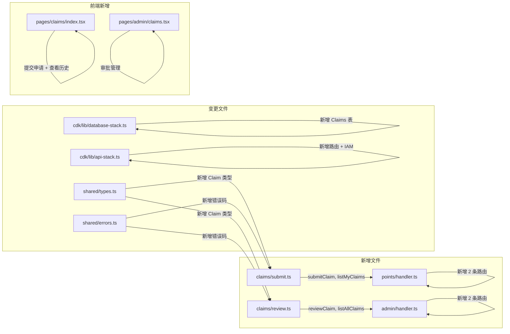

# 技术设计文档 - 积分申请与审批流程（Points Claim Approval）

## 概述（Overview）

本设计为社区成员提供积分申请与管理员审批的完整流程。核心变更包括：

1. **新增 DynamoDB Claims 表**：存储积分申请记录，含 userId-createdAt 和 status-createdAt 两个 GSI
2. **后端新增模块** `claims/submit.ts` 和 `claims/review.ts`：分别处理用户提交/查询申请和管理员审批
3. **Points Handler 路由扩展**：新增 `POST /api/claims` 和 `GET /api/claims` 用户端路由
4. **Admin Handler 路由扩展**：新增 `GET /api/admin/claims` 和 `PATCH /api/admin/claims/{id}/review` 管理端路由
5. **前端新增页面**：用户端积分申请页面 `claims/index.tsx` 和管理端审批页面 `admin/claims.tsx`
6. **CDK 配置**：新增 Claims 表定义、API Gateway 路由、Lambda IAM 权限

设计目标：
- 复用现有架构模式（DynamoDB Query/Scan + 分页、Handler 路由分发、前端 admin 页面模式）
- 审批批准时使用 DynamoDB TransactWriteItems 保证积分发放的原子性
- 权限分级：仅 Admin/SuperAdmin 可审批，仅拥有社区角色的用户可提交申请

---

## 架构（Architecture）

### 变更范围



### 架构决策

| 决策 | 选择 | 理由 |
|------|------|------|
| 申请记录存储 | 新建 Claims 表 | 独立于现有表，数据模型清晰，避免污染 Users/PointsRecords 表 |
| 用户端路由归属 | Points Lambda | 复用现有 Points Lambda 的 Users 表和 PointsRecords 表访问权限 |
| 管理端路由归属 | Admin Lambda | 复用现有 Admin Lambda 的管理员权限校验 |
| 用户申请列表查询 | GSI userId-createdAt-index Query | 按用户分区 + 时间排序，高效分页 |
| 管理端列表查询 | GSI status-createdAt-index Query | 按状态分区 + 时间排序，支持状态筛选 |
| 审批积分发放 | TransactWriteItems | 原子性保证：更新申请状态 + 增加用户积分 + 写积分记录 |
| 图片上传 | 前端直传图片 URL | 复用现有 S3 上传机制，申请记录仅存储 URL 数组 |

---

## 组件与接口（Components and Interfaces）

### 1. 积分申请提交模块（packages/backend/src/claims/submit.ts）

#### 1.1 submitClaim - 提交积分申请

```typescript
interface SubmitClaimInput {
  userId: string;
  userRoles: string[];
  userNickname: string;
  title: string;
  description: string;
  imageUrls?: string[];
  activityUrl?: string;
}

interface SubmitClaimResult {
  success: boolean;
  claim?: ClaimRecord;
  error?: { code: string; message: string };
}

export async function submitClaim(
  input: SubmitClaimInput,
  dynamoClient: DynamoDBDocumentClient,
  claimsTable: string,
): Promise<SubmitClaimResult>;
```

实现要点：
- 校验用户角色包含 Speaker/UserGroupLeader/CommunityBuilder/Volunteer 之一
- 校验 title（1~100 字符）和 description（1~1000 字符）
- 校验 imageUrls 数组长度 ≤ 5（可选）
- 校验 activityUrl 为合法 URL 格式（可选）
- 使用 ULID 生成 claimId，状态设为 pending
- PutCommand 写入 Claims 表

#### 1.2 listMyClaims - 查看我的申请列表

```typescript
interface ListMyClaimsOptions {
  userId: string;
  status?: 'pending' | 'approved' | 'rejected';
  pageSize?: number;
  lastKey?: string;
}

interface ListMyClaimsResult {
  success: boolean;
  claims?: ClaimRecord[];
  lastKey?: string;
  error?: { code: string; message: string };
}

export async function listMyClaims(
  options: ListMyClaimsOptions,
  dynamoClient: DynamoDBDocumentClient,
  claimsTable: string,
): Promise<ListMyClaimsResult>;
```

实现要点：
- 使用 GSI `userId-createdAt-index` 查询，ScanIndexForward=false（倒序）
- 当 status 参数存在时，先查询 `status-createdAt-index` 并用 FilterExpression 过滤 userId；或查询 `userId-createdAt-index` 并用 FilterExpression 过滤 status
- 选择方案：查询 `userId-createdAt-index` + FilterExpression `status = :status`（用户申请量小，过滤开销可忽略）
- pageSize 默认 20，最大 100

### 2. 审批模块（packages/backend/src/claims/review.ts）

#### 2.1 reviewClaim - 审批积分申请

```typescript
interface ReviewClaimInput {
  claimId: string;
  reviewerId: string;
  action: 'approve' | 'reject';
  awardedPoints?: number;   // action=approve 时必填，1~10000
  rejectReason?: string;    // action=reject 时必填，1~500 字符
}

interface ReviewClaimResult {
  success: boolean;
  claim?: ClaimRecord;
  error?: { code: string; message: string };
}

export async function reviewClaim(
  input: ReviewClaimInput,
  dynamoClient: DynamoDBDocumentClient,
  tables: { claimsTable: string; usersTable: string; pointsRecordsTable: string },
): Promise<ReviewClaimResult>;
```

实现要点：
- 先 GetCommand 获取申请记录，不存在返回 CLAIM_NOT_FOUND
- 申请状态非 pending 返回 CLAIM_ALREADY_REVIEWED
- approve 时：校验 awardedPoints（1~10000），使用 TransactWriteItems 原子写入：
  1. 更新 Claims 表：status=approved, awardedPoints, reviewerId, reviewedAt
  2. 更新 Users 表：points += awardedPoints
  3. 写入 PointsRecords 表：type=earn, amount=awardedPoints, source="积分申请审批:claimId"
- reject 时：校验 rejectReason（1~500），UpdateCommand 更新 Claims 表：status=rejected, rejectReason, reviewerId, reviewedAt

#### 2.2 listAllClaims - 管理端查看所有申请

```typescript
interface ListAllClaimsOptions {
  status?: 'pending' | 'approved' | 'rejected';
  pageSize?: number;
  lastKey?: string;
}

interface ListAllClaimsResult {
  success: boolean;
  claims?: ClaimRecordWithUser[];
  lastKey?: string;
  error?: { code: string; message: string };
}

interface ClaimRecordWithUser extends ClaimRecord {
  applicantNickname: string;
  applicantRole: string;
}

export async function listAllClaims(
  options: ListAllClaimsOptions,
  dynamoClient: DynamoDBDocumentClient,
  claimsTable: string,
): Promise<ListAllClaimsResult>;
```

实现要点：
- 当 status 参数存在时，使用 GSI `status-createdAt-index` 查询，ScanIndexForward=false
- 当 status 参数不存在时，使用 Scan + 按 createdAt 倒序排列（申请量 < 1000，Scan 可接受）
- 申请记录中冗余存储 applicantNickname 和 applicantRole，无需额外查询 Users 表

### 3. Points Handler 路由扩展（packages/backend/src/points/handler.ts）

新增路由：

```typescript
// POST /api/claims → handleSubmitClaim
// GET /api/claims → handleListMyClaims
```

新增环境变量：`CLAIMS_TABLE`

### 4. Admin Handler 路由扩展（packages/backend/src/admin/handler.ts）

新增路由正则和处理函数：

```typescript
const CLAIMS_REVIEW_REGEX = /^\/api\/admin\/claims\/([^/]+)\/review$/;

// GET /api/admin/claims → handleListAllClaims
// PATCH /api/admin/claims/{id}/review → handleReviewClaim
```

新增环境变量：`CLAIMS_TABLE`、`POINTS_RECORDS_TABLE`

### 5. 前端积分申请页面（packages/frontend/src/pages/claims/index.tsx）

页面结构：
- 顶部工具栏：返回按钮 + 标题"积分申请"+ 新建申请按钮
- 状态筛选标签栏：全部 | 待审批 | 已批准 | 已驳回
- 申请历史列表：每行显示标题、状态标签、提交时间
- 申请详情弹窗：完整描述、图片预览、活动链接、审批结果
- 新建申请弹窗：标题、描述、图片 URL 输入、活动链接输入

### 6. 前端审批管理页面（packages/frontend/src/pages/admin/claims.tsx）

页面结构：
- 顶部工具栏：返回按钮 + 标题"积分审批"
- 状态筛选标签栏：全部 | 待审批 | 已批准 | 已驳回（默认待审批）
- 申请列表：每行显示申请人昵称、角色徽章、标题、状态标签、提交时间
- 申请详情弹窗：申请人信息、完整描述、图片预览、活动链接
- 批准弹窗：积分数值输入（1~10000）
- 驳回弹窗：驳回原因输入（1~500 字符）

---

## 数据模型（Data Models）

### Claims 表（新增）

| 属性 | 类型 | 说明 |
|------|------|------|
| PK: `claimId` | String | 申请唯一 ID（ULID） |
| `userId` | String | 申请人用户 ID |
| `applicantNickname` | String | 申请人昵称（冗余存储） |
| `applicantRole` | String | 申请人提交时的角色 |
| `title` | String | 申请标题（1~100 字符） |
| `description` | String | 文字描述（1~1000 字符） |
| `imageUrls` | List | 图片 URL 数组（最多 5 张） |
| `activityUrl` | String | 活动/直播链接（可选） |
| `status` | String | pending / approved / rejected |
| `awardedPoints` | Number | 批准时奖励的积分数值 |
| `rejectReason` | String | 驳回原因 |
| `reviewerId` | String | 审批人用户 ID |
| `reviewedAt` | String | 审批时间 ISO 8601 |
| `createdAt` | String | 提交时间 ISO 8601 |

**GSI：**
- `userId-createdAt-index`：PK = `userId`，SK = `createdAt`，用于查询用户自己的申请历史
- `status-createdAt-index`：PK = `status`，SK = `createdAt`，用于管理端按状态筛选

### 新增共享类型（packages/shared/src/types.ts）

```typescript
/** 积分申请状态 */
export type ClaimStatus = 'pending' | 'approved' | 'rejected';

/** 积分申请记录 */
export interface ClaimRecord {
  claimId: string;
  userId: string;
  applicantNickname: string;
  applicantRole: string;
  title: string;
  description: string;
  imageUrls: string[];
  activityUrl?: string;
  status: ClaimStatus;
  awardedPoints?: number;
  rejectReason?: string;
  reviewerId?: string;
  reviewedAt?: string;
  createdAt: string;
}
```

### 新增错误码（packages/shared/src/errors.ts）

| HTTP 状态码 | 错误码 | 消息 | 对应需求 |
|-------------|--------|------|----------|
| 403 | `CLAIM_ROLE_NOT_ALLOWED` | 当前角色无法申请积分 | 1.2 |
| 400 | `INVALID_CLAIM_CONTENT` | 申请内容格式无效 | 1.4 |
| 400 | `CLAIM_IMAGE_LIMIT_EXCEEDED` | 图片数量超出上限（最多 5 张） | 1.6 |
| 400 | `INVALID_ACTIVITY_URL` | 活动链接格式无效 | 1.7 |
| 404 | `CLAIM_NOT_FOUND` | 积分申请不存在 | 3.7 |
| 400 | `CLAIM_ALREADY_REVIEWED` | 该申请已被审批 | 3.7 |
| 400 | `INVALID_POINTS_AMOUNT` | 积分数值无效（1~10000） | 3.4 |
| 400 | `INVALID_REJECT_REASON` | 驳回原因格式无效 | 3.6 |

---

## 正确性属性（Correctness Properties）

*属性（Property）是指在系统所有有效执行中都应成立的特征或行为——本质上是对系统应做什么的形式化陈述。*

### Property 1: 角色校验正确性

*对于任何*用户角色集合，如果该集合不包含 Speaker、UserGroupLeader、CommunityBuilder、Volunteer 中的任何一个，则提交积分申请应被拒绝并返回 CLAIM_ROLE_NOT_ALLOWED；反之，如果包含其中至少一个，则角色校验应通过。

**Validates: Requirements 1.1, 1.2**

### Property 2: 申请内容校验正确性

*对于任何* title 和 description 字符串，如果 title 长度不在 1~100 范围内或 description 长度不在 1~1000 范围内，则提交应被拒绝并返回 INVALID_CLAIM_CONTENT；反之，校验应通过。

**Validates: Requirements 1.3, 1.4**

### Property 3: 用户申请列表隔离性

*对于任何*两个不同的用户 A 和 B，用户 A 调用 listMyClaims 返回的每条记录的 userId 都应等于用户 A 的 userId，不包含用户 B 的任何申请记录。

**Validates: Requirements 2.1**

### Property 4: 状态筛选正确性

*对于任何*有效的 ClaimStatus 筛选值，listMyClaims 使用该状态筛选后返回的每条记录的 status 都应等于指定的筛选值。

**Validates: Requirements 2.2**

### Property 5: 审批批准积分发放原子性

*对于任何*处于 pending 状态的积分申请和任何正整数 awardedPoints（1~10000），批准操作成功后：申请状态应变为 approved，申请人积分余额应增加 awardedPoints，且系统应生成一条 type=earn、amount=awardedPoints 的积分变动记录。

**Validates: Requirements 3.3, 4.1, 4.2**

### Property 6: 审批驳回不影响积分

*对于任何*处于 pending 状态的积分申请，驳回操作成功后：申请状态应变为 rejected，申请人积分余额应保持不变。

**Validates: Requirements 3.5, 4.4**

### Property 7: 已审批申请不可重复审批

*对于任何*状态为 approved 或 rejected 的积分申请，再次审批操作应被拒绝并返回 CLAIM_ALREADY_REVIEWED，且申请记录和用户积分均保持不变。

**Validates: Requirements 3.7**

### Property 8: 积分数值范围校验

*对于任何*非 1~10000 范围内的整数（包括 0、负数、超过 10000 的数），批准操作应被拒绝并返回 INVALID_POINTS_AMOUNT。

**Validates: Requirements 3.4**

---

## 错误处理（Error Handling）

### 新增错误码

在现有 `ErrorCodes` 基础上新增：

```typescript
// packages/shared/src/errors.ts 新增
export const ErrorCodes = {
  // ... 现有错误码 ...
  CLAIM_ROLE_NOT_ALLOWED: 'CLAIM_ROLE_NOT_ALLOWED',
  INVALID_CLAIM_CONTENT: 'INVALID_CLAIM_CONTENT',
  CLAIM_IMAGE_LIMIT_EXCEEDED: 'CLAIM_IMAGE_LIMIT_EXCEEDED',
  INVALID_ACTIVITY_URL: 'INVALID_ACTIVITY_URL',
  CLAIM_NOT_FOUND: 'CLAIM_NOT_FOUND',
  CLAIM_ALREADY_REVIEWED: 'CLAIM_ALREADY_REVIEWED',
  INVALID_POINTS_AMOUNT: 'INVALID_POINTS_AMOUNT',
  INVALID_REJECT_REASON: 'INVALID_REJECT_REASON',
} as const;
```

### 错误处理策略

1. **输入验证错误（4xx）**：直接返回具体错误信息，不重试
2. **审批事务冲突**：TransactWriteItems 失败时返回 INTERNAL_ERROR，前端提示重试
3. **并发审批**：使用 ConditionExpression `status = :pending` 防止重复审批
4. **权限校验顺序**：先检查管理员权限 → 再检查申请是否存在 → 再检查申请状态 → 最后执行操作

---

## 测试策略（Testing Strategy）

### 双重测试方法

延续现有系统的单元测试 + 属性测试双重策略。

### 技术选型

| 类别 | 工具 |
|------|------|
| 测试框架 | Vitest（现有） |
| 属性测试库 | fast-check（现有） |

### 单元测试范围

- **claims/submit.test.ts**：submitClaim 和 listMyClaims 的具体场景
  - 有效角色提交成功
  - 无效角色被拒绝
  - title/description 边界值校验
  - imageUrls 超限被拒绝
  - activityUrl 格式校验
  - 分页查询正确性
- **claims/review.test.ts**：reviewClaim 和 listAllClaims 的具体场景
  - 批准操作成功（积分发放）
  - 驳回操作成功
  - 重复审批被拒绝
  - 积分数值范围校验
  - 驳回原因长度校验
  - 申请不存在返回 404
- **points/handler.test.ts**：新增路由的 handler 集成测试
- **admin/handler.test.ts**：新增路由的 handler 集成测试

### 属性测试范围

**配置要求：**
- 每个属性测试最少运行 100 次迭代
- 标签格式：`Feature: points-claim-approval, Property {number}: {property_text}`

**属性测试清单：**

| 属性编号 | 测试文件 | 测试描述 | 生成器 |
|----------|----------|----------|--------|
| Property 1 | claims/submit.property.test.ts | 角色校验正确性 | 随机角色集合 |
| Property 2 | claims/submit.property.test.ts | 申请内容校验正确性 | 随机长度 title/description |
| Property 3 | claims/submit.property.test.ts | 用户申请列表隔离性 | 随机多用户申请记录 |
| Property 4 | claims/submit.property.test.ts | 状态筛选正确性 | 随机申请记录 + 随机状态筛选 |
| Property 5 | claims/review.property.test.ts | 审批批准积分发放原子性 | 随机 pending 申请 + 随机积分值 |
| Property 6 | claims/review.property.test.ts | 审批驳回不影响积分 | 随机 pending 申请 |
| Property 7 | claims/review.property.test.ts | 已审批申请不可重复审批 | 随机 approved/rejected 申请 |
| Property 8 | claims/review.property.test.ts | 积分数值范围校验 | 随机非法积分值 |
