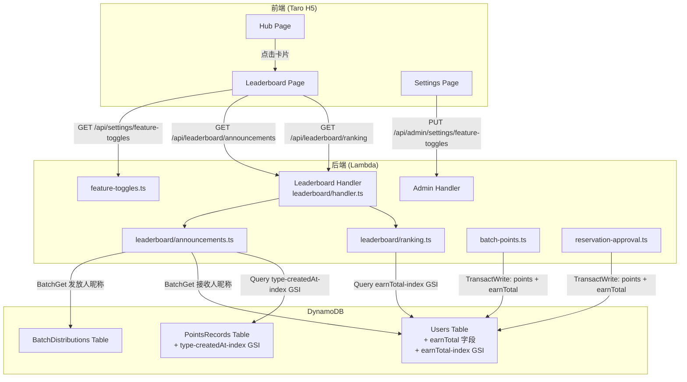

# 设计文档：积分榜单（Points Leaderboard）

## Overview

本功能为社区积分商城系统新增积分榜单模块，包含两个核心子功能：

1. **积分排行榜（Points Ranking）**：按用户累计获得积分（earnTotal）降序排名，支持按角色（All / Speaker / UserGroupLeader / Volunteer）筛选，支持分页。排行榜底部显示可配置的更新频率文案。
2. **积分发放公告栏（Points Announcement）**：展示所有 type="earn" 的 PointsRecords 记录，按时间倒序排列，支持分页。记录按来源类型（批量发放 / 预约审批）以不同格式展示，目的是让社区成员互相监督。

### 关键设计决策

1. **earnTotal 冗余字段 + GSI 方案**：在 Users 表新增 earnTotal 字段，在批量发放和预约审批时原子性递增，避免排行榜查询时实时聚合 PointsRecords。使用 GSI（pk="ALL", SK=earnTotal）实现高效降序查询。
2. **角色筛选在应用层执行**：earnTotal-index GSI 无法按角色分区（角色是数组字段），因此先通过 GSI 按 earnTotal 降序查询，再在应用层按角色过滤。为保证分页正确性，采用"过量查询 + 客户端过滤"策略。
3. **公告栏使用 type-createdAt-index GSI**：新增 GSI 以 type 为分区键、createdAt 为排序键，高效查询所有 type="earn" 记录并按时间倒序返回。
4. **独立 Leaderboard Lambda**：新建独立 Lambda 处理榜单 API，职责单一，仅需读权限，与现有 Admin/Points Lambda 解耦。
5. **feature-toggles 复用**：在现有 feature-toggles 记录中新增 3 个字段（leaderboardRankingEnabled、leaderboardAnnouncementEnabled、leaderboardUpdateFrequency），复用已有的配置读写机制。
6. **前端 Tab 动态显示**：根据 feature-toggles 开关状态动态决定显示哪些 Tab，两个都关闭时显示功能未开放提示。

## Architecture



### 请求流程

1. **排行榜查询**：前端 GET `/api/leaderboard/ranking?role=all&limit=20` → Leaderboard Handler → `getRanking()` → 验证 JWT + 角色权限 → 查询 Users 表 earnTotal-index GSI（降序）→ 应用层角色过滤 → 计算排名序号 → 返回分页结果
2. **公告栏查询**：前端 GET `/api/leaderboard/announcements?limit=20` → Leaderboard Handler → `getAnnouncements()` → 验证 JWT + 角色权限 → 查询 PointsRecords 表 type-createdAt-index GSI（type="earn", 降序）→ BatchGet 用户昵称 → BatchGet 批量发放记录的发放人昵称 → 返回分页结果
3. **earnTotal 维护**：批量发放 / 预约审批时，在现有 TransactWriteCommand 中新增 `earnTotal = earnTotal + :pv` 更新表达式，与 points 更新在同一事务中原子执行

## Components and Interfaces

### 新增后端模块：`packages/backend/src/leaderboard/`

#### `packages/backend/src/leaderboard/handler.ts`

Leaderboard Lambda 入口，路由分发：

| Method | Path | Handler | Permission |
|--------|------|---------|------------|
| GET | `/api/leaderboard/ranking` | `handleGetRanking` | 登录用户（排除 OrderAdmin） |
| GET | `/api/leaderboard/announcements` | `handleGetAnnouncements` | 登录用户（排除 OrderAdmin） |

#### `packages/backend/src/leaderboard/ranking.ts`

```typescript
export interface RankingQueryOptions {
  role: 'all' | 'Speaker' | 'UserGroupLeader' | 'Volunteer';
  limit: number;    // 1~50, 默认 20
  lastKey?: string;  // base64 编码的分页游标
}

export interface RankingItem {
  rank: number;
  nickname: string;
  roles: string[];      // 仅普通角色
  earnTotal: number;
}

export interface RankingResult {
  success: boolean;
  items?: RankingItem[];
  lastKey?: string | null;
  error?: { code: string; message: string };
}

/** 查询积分排行榜 */
export async function getRanking(
  options: RankingQueryOptions,
  dynamoClient: DynamoDBDocumentClient,
  usersTable: string,
): Promise<RankingResult>;

/** 校验并规范化查询参数 */
export function validateRankingParams(query: Record<string, string>): {
  valid: boolean;
  options?: RankingQueryOptions;
  error?: { code: string; message: string };
};

/** 判断用户是否应出现在排行榜中（拥有至少一个普通角色） */
export function isEligibleForRanking(roles: string[]): boolean;

/** 按角色过滤用户 */
export function filterByRole(users: any[], role: string): any[];
```

#### `packages/backend/src/leaderboard/announcements.ts`

```typescript
export interface AnnouncementQueryOptions {
  limit: number;    // 1~50, 默认 20
  lastKey?: string;  // base64 编码的分页游标
}

export interface AnnouncementItem {
  recordId: string;
  recipientNickname: string;
  amount: number;
  source: string;
  createdAt: string;
  targetRole: string;
  activityUG?: string;
  activityDate?: string;
  activityTopic?: string;
  activityType?: string;
  distributorNickname?: string;  // 仅批量发放记录
}

export interface AnnouncementResult {
  success: boolean;
  items?: AnnouncementItem[];
  lastKey?: string | null;
  error?: { code: string; message: string };
}

/** 查询积分发放公告 */
export async function getAnnouncements(
  options: AnnouncementQueryOptions,
  dynamoClient: DynamoDBDocumentClient,
  tables: {
    pointsRecordsTable: string;
    usersTable: string;
    batchDistributionsTable: string;
  },
): Promise<AnnouncementResult>;

/** 判断记录是否为批量发放类型 */
export function isBatchRecord(source: string): boolean;

/** 判断记录是否为预约审批类型 */
export function isReservationRecord(source: string): boolean;
```

### 修改现有模块

#### `packages/backend/src/admin/batch-points.ts`

在 `executeBatchDistribution` 的 TransactWriteCommand 中，为每个用户的 Update 操作新增 earnTotal 递增：

```typescript
// 现有: SET points = points + :pv, updatedAt = :now
// 修改为: SET points = points + :pv, earnTotal = if_not_exists(earnTotal, :zero) + :pv, updatedAt = :now
```

#### `packages/backend/src/content/reservation-approval.ts`

在 `reviewReservation` 的 approve 事务中，为 uploader 的 Update 操作新增 earnTotal 递增：

```typescript
// 现有: SET points = points + :pv, updatedAt = :now
// 修改为: SET points = points + :pv, earnTotal = if_not_exists(earnTotal, :zero) + :pv, updatedAt = :now
```

#### `packages/backend/src/settings/feature-toggles.ts`

扩展 `FeatureToggles` 接口和相关函数：

```typescript
// 新增字段
export interface FeatureToggles {
  // ... 现有字段 ...
  leaderboardRankingEnabled: boolean;        // 默认 false
  leaderboardAnnouncementEnabled: boolean;   // 默认 false
  leaderboardUpdateFrequency: 'daily' | 'weekly' | 'monthly';  // 默认 'weekly'
}
```

### 前端页面

| Page | Path | Description |
|------|------|-------------|
| LeaderboardPage | `/pages/leaderboard/index` | 积分榜单页面（含排行榜和公告栏两个 Tab） |

### Shared Types 扩展（`packages/shared/src/types.ts`）

```typescript
/** 排行榜项 */
export interface LeaderboardRankingItem {
  rank: number;
  nickname: string;
  roles: string[];
  earnTotal: number;
}

/** 公告栏项 */
export interface LeaderboardAnnouncementItem {
  recordId: string;
  recipientNickname: string;
  amount: number;
  source: string;
  createdAt: string;
  targetRole: string;
  activityUG?: string;
  activityDate?: string;
  activityTopic?: string;
  activityType?: string;
  distributorNickname?: string;
}
```

## Data Models

### Users Table（现有表，新增字段和 GSI）

| Attribute | Type | Description |
|-----------|------|-------------|
| earnTotal (新增) | Number | 累计获得积分（所有 type="earn" 的 PointsRecords amount 总和） |
| pk (新增) | String | 固定值 "ALL"，用于 earnTotal-index GSI 分区键 |

**新增 GSI**: `earnTotal-index`
- 分区键: `pk` (String, 固定值 "ALL")
- 排序键: `earnTotal` (Number)
- 用途: 按累计获得积分降序查询排行榜（ScanIndexForward=false）

### PointsRecords Table（现有表，新增 GSI）

**新增 GSI**: `type-createdAt-index`
- 分区键: `type` (String)
- 排序键: `createdAt` (String)
- 用途: 按类型和时间查询积分记录（type="earn", ScanIndexForward=false）

### feature-toggles 记录（现有，新增字段）

| Attribute | Type | Default | Description |
|-----------|------|---------|-------------|
| leaderboardRankingEnabled | Boolean | false | 积分排行榜显示开关 |
| leaderboardAnnouncementEnabled | Boolean | false | 积分发放公告栏显示开关 |
| leaderboardUpdateFrequency | String | "weekly" | 更新频率文案（daily / weekly / monthly） |

## Correctness Properties

*A property is a characteristic or behavior that should hold true across all valid executions of a system — essentially, a formal statement about what the system should do. Properties serve as the bridge between human-readable specifications and machine-verifiable correctness guarantees.*

### Property 1: Ranking results are sorted by earnTotal descending and contain all required fields

*For any* set of eligible users with varying earnTotal values, the ranking query result should be sorted by earnTotal in strictly non-increasing order, and each item should contain a valid rank (positive integer), non-empty nickname, a non-empty roles array (containing only regular roles), and a non-negative earnTotal value.

**Validates: Requirements 3.1, 3.6, 10.4**

### Property 2: Role filtering returns only eligible users with matching roles

*For any* set of users with mixed role assignments and any role filter value (all / Speaker / UserGroupLeader / Volunteer): when filter is a specific role, all returned users must have that role; when filter is "all", all returned users must have at least one regular role (Speaker, UserGroupLeader, Volunteer); in all cases, users who only have admin roles (Admin, SuperAdmin, OrderAdmin) without any regular role must be excluded.

**Validates: Requirements 3.2, 3.3, 3.4**

### Property 3: Paginating through all pages yields the complete sorted dataset

*For any* dataset and any valid page size, concatenating the items from all sequential paginated queries (following lastKey cursors until lastKey is null) should produce a list equal to the complete sorted dataset. No items should be duplicated or missing.

**Validates: Requirements 3.5, 6.3, 10.5, 11.5**

### Property 4: earnTotal is atomically incremented by the exact points amount during distribution

*For any* user with an initial earnTotal value (including 0 or undefined) and any positive integer points amount, after a batch distribution or reservation approval that awards that amount, the user's earnTotal should equal the initial value plus the awarded amount. The earnTotal increment must occur in the same transaction as the points balance update.

**Validates: Requirements 4.1, 4.2, 4.3**

### Property 5: Announcement query returns only earn records, sorted by time, with correct fields

*For any* set of PointsRecords with mixed types (earn/spend), the announcement query should return only records where type="earn", sorted by createdAt in descending order. Each item should contain recordId, recipientNickname, amount, source, createdAt, and targetRole. For batch distribution records (source starting with "批量发放:"), distributorNickname should be present; for other records, it may be absent.

**Validates: Requirements 6.1, 6.2, 6.4, 6.5, 11.4**

### Property 6: Tab visibility is determined by toggle state

*For any* combination of (leaderboardRankingEnabled, leaderboardAnnouncementEnabled) boolean values: when both are true, both tabs should be visible; when only ranking is true, only the ranking tab should be visible without tab switcher; when only announcement is true, only the announcement tab should be visible without tab switcher; when both are false, a "feature not available" message should be shown.

**Validates: Requirements 2.4, 2.5, 2.6, 2.7, 8.3, 8.4**

### Property 7: Update frequency validation accepts only valid values

*For any* string value for leaderboardUpdateFrequency, the validator should accept it if and only if it is one of "daily", "weekly", or "monthly". All other values (including empty string, null, undefined, and arbitrary strings) should be rejected with error code INVALID_REQUEST.

**Validates: Requirements 14.4, 14.5**

## Error Handling

### Backend Error Codes

| Error Code | HTTP Status | Message | Trigger |
|------------|-------------|---------|---------|
| `UNAUTHORIZED` | 401 | 未登录 | 未携带有效 JWT Token |
| `FORBIDDEN` | 403 | 无权访问 | OrderAdmin 角色访问榜单接口 |
| `INVALID_REQUEST` | 400 | 具体错误消息 | 查询参数无效（如 role 值不合法、limit 超范围） |
| `INVALID_REQUEST` | 400 | 更新频率值无效，取值为 daily、weekly 或 monthly | leaderboardUpdateFrequency 值不合法 |
| `INTERNAL_ERROR` | 500 | Internal server error | DynamoDB 查询失败等未预期错误 |

### 分页游标错误处理

- lastKey 参数为 base64 编码的 JSON 字符串，解码失败时返回 `INVALID_PAGINATION_KEY` 错误
- 与现有 batch-points.ts 的分页处理模式一致

### 前端错误处理

- API 请求失败：显示 Toast 提示具体错误消息
- 网络错误：显示通用错误提示"加载失败，请稍后重试"
- 401 未登录：重定向到登录页面
- 403 无权限：显示无权访问提示
- 空数据：显示对应的空状态提示（排行榜空 / 公告栏空）
- 加载中：显示骨架屏（Skeleton）

### earnTotal 一致性保障

- earnTotal 通过 DynamoDB 事务与 points 同步更新，使用 `if_not_exists(earnTotal, :zero) + :pv` 表达式处理字段不存在的情况
- 对于历史用户（earnTotal 字段不存在），排行榜查询时视为 0
- 如需修复历史数据，可编写一次性脚本扫描 PointsRecords 表聚合每个用户的 earn 总和并回填 earnTotal

## Testing Strategy

### 单元测试

使用 Vitest 进行单元测试，覆盖以下场景：

1. **排行榜查询参数验证**：测试 `validateRankingParams` 对各种有效/无效参数的处理
2. **角色过滤逻辑**：测试 `isEligibleForRanking` 和 `filterByRole` 函数
3. **公告栏记录类型判断**：测试 `isBatchRecord` 和 `isReservationRecord` 函数
4. **权限校验**：测试 JWT 验证和 OrderAdmin 角色拦截
5. **feature-toggles 扩展**：测试新增字段的读取和更新
6. **更新频率验证**：测试 leaderboardUpdateFrequency 值校验
7. **Handler 路由**：测试 Leaderboard Handler 的路由分发

### 属性测试（Property-Based Testing）

使用 **fast-check** 库进行属性测试，每个属性测试运行最少 100 次迭代。

每个属性测试必须以注释标注对应的设计文档属性：
- 标签格式：`Feature: points-leaderboard, Property {number}: {property_text}`

属性测试覆盖 7 个核心属性：
1. 排行榜结果排序和字段完整性
2. 角色过滤正确性（含 All 过滤逻辑）
3. 分页完整性（排行榜和公告栏通用）
4. earnTotal 原子递增正确性
5. 公告栏查询过滤、排序和字段正确性
6. Tab 可见性与开关状态的映射
7. 更新频率值校验

### 集成测试

- Leaderboard Handler 路由测试：验证新增路由的请求转发和响应格式
- CDK 合成测试：验证 earnTotal-index GSI、type-createdAt-index GSI、Leaderboard Lambda、API Gateway 路由、IAM 权限配置
- feature-toggles 扩展测试：验证新增字段的读写和默认值处理
