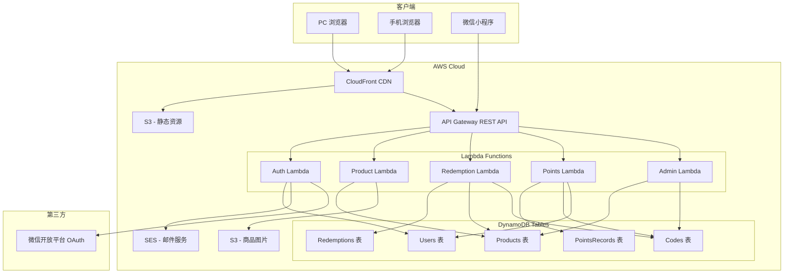
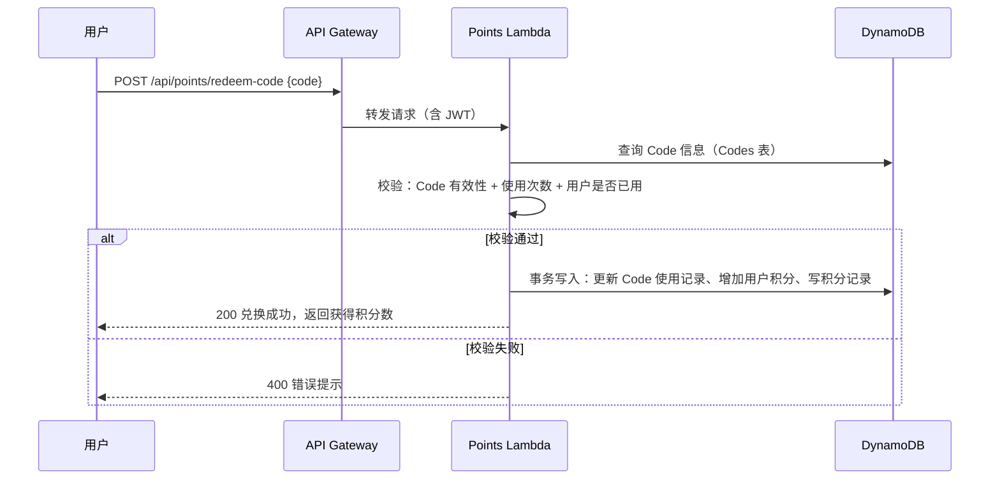

# 技术设计文档 - 积分商城系统（Points Mall）

## 概述（Overview）

积分商城系统是一个基于 AWS Serverless 架构的多端应用，服务于社区活动激励场景。系统核心流程为：管理员生成兑换码 → 用户通过兑换码获取积分 → 用户使用积分或专属 Code 兑换商品。

系统采用前后端分离架构：
- 前端：React SPA（PC/手机端）+ 微信小程序（Taro 框架共享代码）
- 后端：API Gateway + Lambda（Node.js/TypeScript）
- 数据层：DynamoDB（主数据库）+ S3（静态资源和图片）
- CDN：CloudFront 分发前端资源和 API 加速

设计目标：
1. DAU < 1000 场景下月度 AWS 成本 < $50
2. 支持 PC、手机浏览器、微信小程序三端一致体验
3. 四种用户角色的细粒度权限控制
4. 积分和兑换操作的数据一致性保障

---

## 架构（Architecture）

### 整体架构图



### 架构决策说明

| 决策 | 选择 | 理由 |
|------|------|------|
| 前端框架 | React + Taro | Taro 支持编译到 H5 和微信小程序，最大化代码复用 |
| 后端运行时 | Node.js 20.x (TypeScript) | Lambda 冷启动快，与前端共享类型定义 |
| 数据库 | DynamoDB On-Demand | 按需计费，DAU < 1000 场景下几乎免费 |
| 认证方案 | 自建 JWT + 微信 OAuth | 避免 Cognito 费用，JWT 无状态验证适合 Lambda |
| 邮件服务 | SES | 免费套餐每月 62,000 封，足够使用 |
| 文件存储 | S3 + CloudFront | 标准方案，免费套餐覆盖大部分流量 |
| API 风格 | REST | 简单直接，API Gateway 原生支持 |
| IaC 工具 | AWS CDK (TypeScript) | 与后端语言一致，类型安全 |

### 成本估算（DAU < 1000）

| 服务 | 预估月费 |
|------|----------|
| Lambda | ~$1（免费套餐 100 万次/月） |
| API Gateway | ~$3（REST API 按请求计费） |
| DynamoDB On-Demand | ~$2（读写量低） |
| S3 | ~$1（5GB 免费存储） |
| CloudFront | ~$0（1TB 免费传输/月） |
| SES | ~$0（免费套餐内） |
| **合计** | **~$7/月** |


---

## 组件与接口（Components and Interfaces）

### 1. 认证服务（Auth Service）

负责用户注册、登录、Token 管理。

**API 接口：**

| 方法 | 路径 | 描述 |
|------|------|------|
| POST | `/api/auth/wechat/qrcode` | 获取微信扫码登录二维码 |
| POST | `/api/auth/wechat/callback` | 微信扫码回调，完成登录 |
| POST | `/api/auth/register` | 邮箱注册 |
| GET | `/api/auth/verify-email?token=xxx` | 邮箱验证激活 |
| POST | `/api/auth/login` | 邮箱密码登录 |
| POST | `/api/auth/refresh` | 刷新 Token |
| POST | `/api/auth/logout` | 退出登录（清除客户端 Token） |

**关键接口定义：**

```typescript
// 注册请求
interface RegisterRequest {
  email: string;
  password: string; // 至少 8 位，包含字母和数字
  nickname: string;
}

// 登录响应
interface AuthResponse {
  accessToken: string;  // JWT, 有效期 7 天
  user: UserProfile;
}

// 用户信息
interface UserProfile {
  userId: string;
  nickname: string;
  email?: string;
  wechatOpenId?: string;
  roles: UserRole[];
  points: number;
  createdAt: string;
}

type UserRole = 'UserGroupLeader' | 'CommunityBuilder' | 'Speaker' | 'Volunteer';
```

### 2. 商品服务（Product Service）

负责商品的 CRUD 和列表查询。

**API 接口：**

| 方法 | 路径 | 描述 |
|------|------|------|
| GET | `/api/products` | 商品列表（支持筛选） |
| GET | `/api/products/:id` | 商品详情 |
| POST | `/api/admin/products` | 创建商品（管理员） |
| PUT | `/api/admin/products/:id` | 编辑商品（管理员） |
| PATCH | `/api/admin/products/:id/status` | 上架/下架（管理员） |

**关键接口定义：**

```typescript
// 商品基础信息
interface Product {
  productId: string;
  name: string;
  description: string;
  imageUrl: string;
  type: 'points' | 'code_exclusive';
  status: 'active' | 'inactive';
  stock: number;
  redemptionCount: number;
  createdAt: string;
  updatedAt: string;
}

// 积分商品扩展
interface PointsProduct extends Product {
  type: 'points';
  pointsCost: number;
  allowedRoles: UserRole[] | 'all'; // 'all' 表示所有人可兑换
}

// Code 专属商品扩展
interface CodeExclusiveProduct extends Product {
  type: 'code_exclusive';
  eventInfo: string; // 关联活动信息
}

// 商品列表查询参数
interface ProductListQuery {
  type?: 'points' | 'code_exclusive';
  roleFilter?: UserRole; // 按身份筛选可兑换商品
  page?: number;
  pageSize?: number;
}
```

### 3. 积分服务（Points Service）

负责积分的发放、扣减和记录查询。

**API 接口：**

| 方法 | 路径 | 描述 |
|------|------|------|
| POST | `/api/points/redeem-code` | 兑换积分码 |
| GET | `/api/points/balance` | 查询积分余额 |
| GET | `/api/points/records` | 积分变动记录 |

**关键接口定义：**

```typescript
// 兑换码请求
interface RedeemCodeRequest {
  code: string;
}

// 积分记录
interface PointsRecord {
  recordId: string;
  userId: string;
  type: 'earn' | 'spend';
  amount: number;       // 正数表示获得，负数表示消费
  source: string;       // Code 标识或商品名称
  balanceAfter: number; // 变动后余额
  createdAt: string;
}
```

### 4. 兑换服务（Redemption Service）

负责积分商品兑换和 Code 专属商品兑换。

**API 接口：**

| 方法 | 路径 | 描述 |
|------|------|------|
| POST | `/api/redemptions/points` | 积分兑换商品 |
| POST | `/api/redemptions/code` | Code 兑换专属商品 |
| GET | `/api/redemptions/history` | 兑换历史记录 |

**关键接口定义：**

```typescript
// 积分兑换请求
interface PointsRedemptionRequest {
  productId: string;
}

// Code 兑换请求
interface CodeRedemptionRequest {
  productId: string;
  code: string;
}

// 兑换记录
interface RedemptionRecord {
  redemptionId: string;
  userId: string;
  productId: string;
  productName: string;
  method: 'points' | 'code';
  pointsSpent?: number;
  codeUsed?: string;
  status: 'success' | 'pending' | 'failed';
  createdAt: string;
}
```

### 5. 管理服务（Admin Service）

负责用户角色管理和 Code 管理。

**API 接口：**

| 方法 | 路径 | 描述 |
|------|------|------|
| PUT | `/api/admin/users/:id/roles` | 分配/撤销用户角色 |
| POST | `/api/admin/codes/batch-generate` | 批量生成积分码 |
| POST | `/api/admin/codes/product-code` | 生成商品专属码 |
| GET | `/api/admin/codes` | Code 列表及状态 |
| PATCH | `/api/admin/codes/:id/disable` | 禁用 Code |

**关键接口定义：**

```typescript
// 批量生成积分码
interface BatchGenerateCodesRequest {
  count: number;
  pointsValue: number;
  maxUses: number;
}

// 生成商品专属码
interface GenerateProductCodeRequest {
  productId: string;
  count: number;
}

// Code 信息
interface CodeInfo {
  codeId: string;
  codeValue: string;       // 实际兑换码字符串
  type: 'points' | 'product';
  pointsValue?: number;    // 积分码对应积分数
  productId?: string;      // 商品码绑定的商品 ID
  maxUses: number;
  currentUses: number;
  status: 'active' | 'disabled' | 'exhausted';
  usedBy: string[];        // 已使用的用户 ID 列表
  createdAt: string;
}
```

### 组件交互流程

#### 积分兑换商品流程

```mermaid
sequenceDiagram
    participant U as 用户
    participant API as API Gateway
    participant RS as Redemption Lambda
    participant PS as Points Lambda
    participant DB as DynamoDB

    U->>API: POST /api/redemptions/points {productId}
    API->>RS: 转发请求（含 JWT）
    RS->>DB: 查询商品信息（Products 表）
    RS->>DB: 查询用户信息（Users 表）
    RS->>RS: 校验：身份权限 + 积分余额 + 库存
    alt 校验通过
        RS->>DB: 事务写入：扣减积分、减库存、写兑换记录、写积分记录
        RS-->>U: 200 兑换成功
    else 校验失败
        RS-->>U: 400 错误提示
    end
```



#### Code 兑换积分流程




---

## 数据模型（Data Models）

### DynamoDB 表设计

采用单表设计（Single Table Design）以减少表数量和跨表查询，但为了清晰性和维护性，本系统使用多表方案（共 5 张表），在 DAU < 1000 的场景下性能和成本差异可忽略。

### 1. Users 表

| 属性 | 类型 | 说明 |
|------|------|------|
| PK: `userId` | String | 用户唯一 ID（ULID） |
| `email` | String | 邮箱（GSI） |
| `wechatOpenId` | String | 微信 OpenID（GSI） |
| `passwordHash` | String | bcrypt 哈希密码 |
| `nickname` | String | 昵称 |
| `roles` | StringSet | 用户身份集合 |
| `points` | Number | 当前积分余额 |
| `emailVerified` | Boolean | 邮箱是否已验证 |
| `loginFailCount` | Number | 连续登录失败次数 |
| `lockUntil` | Number | 账号锁定截止时间戳 |
| `status` | String | 账号状态：active / locked |
| `createdAt` | String | 创建时间 ISO 8601 |
| `updatedAt` | String | 更新时间 ISO 8601 |

**GSI：**
- `email-index`：PK = `email`，用于邮箱登录查询
- `wechatOpenId-index`：PK = `wechatOpenId`，用于微信登录查询

### 2. Products 表

| 属性 | 类型 | 说明 |
|------|------|------|
| PK: `productId` | String | 商品唯一 ID（ULID） |
| `name` | String | 商品名称 |
| `description` | String | 商品描述 |
| `imageUrl` | String | 商品图片 S3 URL |
| `type` | String | `points` 或 `code_exclusive` |
| `status` | String | `active` 或 `inactive` |
| `stock` | Number | 库存数量 |
| `redemptionCount` | Number | 已兑换次数 |
| `pointsCost` | Number | 所需积分（仅积分商品） |
| `allowedRoles` | StringSet | 允许兑换的角色（仅积分商品，空集表示所有人） |
| `eventInfo` | String | 关联活动信息（仅 Code 专属商品） |
| `createdAt` | String | 创建时间 |
| `updatedAt` | String | 更新时间 |

**GSI：**
- `type-status-index`：PK = `type`，SK = `status`，用于按类型和状态筛选商品

### 3. Codes 表

| 属性 | 类型 | 说明 |
|------|------|------|
| PK: `codeId` | String | Code 唯一 ID（ULID） |
| `codeValue` | String | 兑换码字符串（GSI） |
| `type` | String | `points` 或 `product` |
| `pointsValue` | Number | 积分值（仅积分码） |
| `productId` | String | 绑定商品 ID（仅商品码） |
| `maxUses` | Number | 最大使用次数 |
| `currentUses` | Number | 当前已使用次数 |
| `usedBy` | Map | `{ userId: timestamp }` 记录使用者 |
| `status` | String | `active` / `disabled` / `exhausted` |
| `createdAt` | String | 创建时间 |

**GSI：**
- `codeValue-index`：PK = `codeValue`，用于通过兑换码字符串查询

### 4. Redemptions 表

| 属性 | 类型 | 说明 |
|------|------|------|
| PK: `redemptionId` | String | 兑换记录唯一 ID（ULID） |
| `userId` | String | 用户 ID（GSI） |
| `productId` | String | 商品 ID |
| `productName` | String | 商品名称（冗余存储） |
| `method` | String | `points` 或 `code` |
| `pointsSpent` | Number | 消耗积分数（积分兑换时） |
| `codeUsed` | String | 使用的 Code（Code 兑换时） |
| `status` | String | `success` / `pending` / `failed` |
| `createdAt` | String | 创建时间 |

**GSI：**
- `userId-createdAt-index`：PK = `userId`，SK = `createdAt`，用于查询用户兑换历史

### 5. PointsRecords 表

| 属性 | 类型 | 说明 |
|------|------|------|
| PK: `recordId` | String | 记录唯一 ID（ULID） |
| `userId` | String | 用户 ID（GSI） |
| `type` | String | `earn` 或 `spend` |
| `amount` | Number | 变动数量（正数获得，负数消费） |
| `source` | String | 来源描述（Code 标识或商品名称） |
| `balanceAfter` | Number | 变动后余额 |
| `createdAt` | String | 创建时间 |

**GSI：**
- `userId-createdAt-index`：PK = `userId`，SK = `createdAt`，用于查询用户积分历史

### 数据一致性策略

积分兑换商品涉及多表写入（扣积分、减库存、写记录），使用 DynamoDB TransactWriteItems 保证原子性：

```typescript
// 积分兑换商品的事务写入示例
const transactItems = [
  // 1. 扣减用户积分（条件：余额充足）
  {
    Update: {
      TableName: 'Users',
      Key: { userId },
      UpdateExpression: 'SET points = points - :cost, updatedAt = :now',
      ConditionExpression: 'points >= :cost',
      ExpressionAttributeValues: { ':cost': pointsCost, ':now': now }
    }
  },
  // 2. 减少商品库存（条件：库存 > 0）
  {
    Update: {
      TableName: 'Products',
      Key: { productId },
      UpdateExpression: 'SET stock = stock - :one, redemptionCount = redemptionCount + :one, updatedAt = :now',
      ConditionExpression: 'stock > :zero AND #s = :active',
      ExpressionAttributeNames: { '#s': 'status' },
      ExpressionAttributeValues: { ':one': 1, ':zero': 0, ':active': 'active', ':now': now }
    }
  },
  // 3. 写入兑换记录
  {
    Put: {
      TableName: 'Redemptions',
      Item: redemptionRecord
    }
  },
  // 4. 写入积分变动记录
  {
    Put: {
      TableName: 'PointsRecords',
      Item: pointsRecord
    }
  }
];
```


---

## 正确性属性（Correctness Properties）

*属性（Property）是指在系统所有有效执行中都应成立的特征或行为——本质上是对系统应做什么的形式化陈述。属性是人类可读规范与机器可验证正确性保证之间的桥梁。*

### Property 1: 密码验证规则

*对于任何*密码字符串，如果其长度少于 8 位或不同时包含字母和数字，则注册请求应被拒绝并返回格式错误提示；反之，如果密码满足规则（≥8 位且包含字母和数字），则密码验证应通过。

**Validates: Requirements 1.7**

### Property 2: 邮箱唯一性约束

*对于任何*已注册的邮箱地址，使用相同邮箱再次注册应被拒绝并返回"邮箱已存在"的错误，且不创建新账号。

**Validates: Requirements 1.6**

### Property 3: Token 有效期

*对于任何*成功登录的用户，生成的 JWT Token 的过期时间应恰好为签发时间后 7 天（604800 秒）。

**Validates: Requirements 1.9**

### Property 4: 角色分配与撤销的往返一致性

*对于任何*用户和任何角色子集，分配这些角色后查询用户角色应包含所有已分配角色；撤销某角色后查询用户角色应不再包含该角色。

**Validates: Requirements 3.2, 3.3**

### Property 5: 角色变更后权限即时生效

*对于任何*用户和任何身份限定的积分商品，当用户的角色变更后，该用户对商品的兑换权限判定结果应与其当前角色集合是否包含商品允许角色一致。

**Validates: Requirements 3.4, 5.3**

### Property 6: 积分码兑换正确性

*对于任何*有效的积分兑换码和任何用户，兑换后用户积分余额应增加该 Code 对应的积分数量，且系统应生成一条包含正确时间、Code 标识和积分数量的积分增加记录。

**Validates: Requirements 4.1, 4.2**

### Property 7: Code 使用限制

*对于任何*兑换码，如果该 Code 已被当前用户使用过，或已达到最大使用次数上限，则兑换请求应被拒绝，且用户积分不变。

**Validates: Requirements 4.4, 4.5**

### Property 8: 商品列表仅展示上架商品

*对于任何*商品集合，用户端商品列表查询应只返回状态为 active 的商品，且应包含所有 active 状态的商品。

**Validates: Requirements 5.1, 8.5**

### Property 9: 商品筛选正确性

*对于任何*商品类型筛选条件或角色筛选条件，返回的商品列表中每个商品都应满足筛选条件：按类型筛选时所有商品类型一致，按角色筛选时所有商品允许该角色兑换。

**Validates: Requirements 5.6, 5.7**

### Property 10: 积分兑换商品成功流程

*对于任何*积分充足且角色匹配的用户和任何有库存的积分商品，兑换后用户积分应减少商品所需积分数量，商品库存应减少 1，且系统应生成兑换记录和积分扣减记录。

**Validates: Requirements 6.1, 6.2, 6.3**

### Property 11: 积分兑换失败时状态不变

*对于任何*积分不足或角色不匹配的用户，对积分商品发起兑换请求应被拒绝，且用户积分余额和商品库存均保持不变。

**Validates: Requirements 6.4, 6.5**

### Property 12: Code 专属商品兑换绑定校验

*对于任何* Code 和任何商品，只有当该 Code 的绑定商品 ID 与目标商品 ID 一致时，兑换才应成功；否则应返回"兑换码与商品不匹配"的错误。

**Validates: Requirements 7.1, 7.3**

### Property 13: Code 专属商品兑换不扣积分

*对于任何*通过 Code 成功兑换的专属商品，用户的积分余额应在兑换前后保持不变。

**Validates: Requirements 7.2**

### Property 14: Code 专属商品拒绝积分购买

*对于任何* Code 专属商品，使用积分兑换的请求应被拒绝并返回"该商品仅支持 Code 兑换"的提示。

**Validates: Requirements 7.4**

### Property 15: 批量生成 Code 正确性

*对于任何*批量生成请求（指定数量 N、积分值 V、最大使用次数 M），生成的 Code 数量应等于 N，且每个 Code 的积分值应为 V，最大使用次数应为 M，状态应为 active。对于商品专属码，每个生成的 Code 应正确绑定到指定商品。

**Validates: Requirements 9.1, 9.2**

### Property 16: 禁用 Code 后拒绝兑换

*对于任何*被禁用的 Code，任何用户对该 Code 的兑换请求（无论是积分码还是商品码）都应被拒绝。

**Validates: Requirements 9.4, 9.5**


---

## 错误处理（Error Handling）

### 错误响应格式

所有 API 错误使用统一的 JSON 格式返回：

```typescript
interface ErrorResponse {
  code: string;       // 错误码，如 'INVALID_CODE'
  message: string;    // 用户可读的错误信息
}
```

### 错误码定义

| HTTP 状态码 | 错误码 | 描述 | 对应需求 |
|-------------|--------|------|----------|
| 400 | `INVALID_PASSWORD_FORMAT` | 密码不符合规则 | 1.7 |
| 400 | `INVALID_CODE` | 兑换码无效或不存在 | 4.3 |
| 400 | `CODE_ALREADY_USED` | 兑换码已被当前用户使用 | 4.4 |
| 400 | `CODE_EXHAUSTED` | 兑换码已达使用上限 | 4.5 |
| 400 | `CODE_PRODUCT_MISMATCH` | 兑换码与商品不匹配 | 7.3 |
| 400 | `CODE_ONLY_PRODUCT` | 该商品仅支持 Code 兑换 | 7.4 |
| 400 | `INSUFFICIENT_POINTS` | 积分不足 | 6.4 |
| 400 | `OUT_OF_STOCK` | 商品库存不足 | 6.6 |
| 401 | `TOKEN_EXPIRED` | Token 已过期 | 1.10 |
| 401 | `INVALID_CREDENTIALS` | 邮箱或密码错误 | 1.2 |
| 403 | `NO_REDEMPTION_PERMISSION` | 无兑换权限（身份不匹配） | 6.5 |
| 403 | `ACCOUNT_LOCKED` | 账号已锁定 | 1.8 |
| 409 | `EMAIL_ALREADY_EXISTS` | 邮箱已被注册 | 1.6 |

### 错误处理策略

1. **输入验证错误（4xx）**：直接返回具体错误信息，不重试
2. **DynamoDB 事务冲突**：自动重试最多 3 次（指数退避）
3. **微信 API 调用失败**：返回友好提示，建议用户稍后重试
4. **Lambda 超时**：API Gateway 返回 504，前端显示网络错误提示
5. **未预期错误**：记录到 CloudWatch Logs，返回通用 500 错误

### 并发控制

- 积分兑换使用 DynamoDB TransactWriteItems 保证原子性
- Code 使用次数更新使用条件表达式（ConditionExpression）防止超卖
- 库存扣减使用条件表达式确保库存 > 0

---

## 测试策略（Testing Strategy）

### 双重测试方法

本系统采用单元测试 + 属性测试的双重策略：

- **单元测试**：验证具体示例、边界情况和错误条件
- **属性测试**：验证跨所有输入的通用属性

两者互补：单元测试捕获具体 bug，属性测试验证通用正确性。

### 技术选型

| 类别 | 工具 |
|------|------|
| 测试框架 | Vitest |
| 属性测试库 | fast-check |
| API 集成测试 | supertest |
| 覆盖率工具 | Vitest 内置 c8 |

### 单元测试范围

单元测试聚焦于：
- 具体示例：微信登录流程、邮箱注册流程、商品 CRUD 操作
- 边界情况：Code 不存在/已失效（4.3）、库存为零（6.6）、Code 已使用/已失效（7.5）
- 错误条件：各种 4xx 错误场景
- 集成点：DynamoDB 事务操作、微信 OAuth 回调

### 属性测试范围

每个正确性属性对应一个属性测试，使用 fast-check 库实现。

**配置要求：**
- 每个属性测试最少运行 100 次迭代
- 每个测试必须用注释引用设计文档中的属性编号
- 标签格式：`Feature: points-mall, Property {number}: {property_text}`

**属性测试清单：**

| 属性编号 | 测试描述 | 生成器 |
|----------|----------|--------|
| Property 1 | 密码验证规则 | 随机字符串（各种长度和字符组合） |
| Property 2 | 邮箱唯一性约束 | 随机邮箱地址 |
| Property 3 | Token 有效期 | 随机用户凭证 |
| Property 4 | 角色分配与撤销往返 | 随机用户 + 随机角色子集 |
| Property 5 | 角色变更后权限生效 | 随机用户角色 + 随机商品角色限制 |
| Property 6 | 积分码兑换正确性 | 随机积分值的 Code + 随机用户 |
| Property 7 | Code 使用限制 | 随机 Code（已用/已达上限） |
| Property 8 | 商品列表仅展示上架商品 | 随机商品集合（混合 active/inactive） |
| Property 9 | 商品筛选正确性 | 随机商品集合 + 随机筛选条件 |
| Property 10 | 积分兑换成功流程 | 随机用户（积分充足）+ 随机商品 |
| Property 11 | 积分兑换失败状态不变 | 随机用户（积分不足/角色不匹配）+ 随机商品 |
| Property 12 | Code 专属商品绑定校验 | 随机 Code + 随机商品组合 |
| Property 13 | Code 专属兑换不扣积分 | 随机用户 + 随机 Code 专属商品 |
| Property 14 | Code 专属商品拒绝积分购买 | 随机 Code 专属商品 |
| Property 15 | 批量生成 Code 正确性 | 随机数量/积分值/使用次数 |
| Property 16 | 禁用 Code 后拒绝兑换 | 随机被禁用的 Code + 随机用户 |

### 测试示例

```typescript
import { describe, it, expect } from 'vitest';
import fc from 'fast-check';

// Feature: points-mall, Property 1: 密码验证规则
describe('Property 1: 密码验证规则', () => {
  it('不符合规则的密码应被拒绝', () => {
    fc.assert(
      fc.property(
        fc.oneof(
          // 少于 8 位
          fc.string({ maxLength: 7 }),
          // 纯字母
          fc.stringOf(fc.char().filter(c => /[a-zA-Z]/.test(c)), { minLength: 8 }),
          // 纯数字
          fc.stringOf(fc.char().filter(c => /[0-9]/.test(c)), { minLength: 8 })
        ),
        (password) => {
          expect(validatePassword(password).valid).toBe(false);
        }
      ),
      { numRuns: 100 }
    );
  });
});

// Feature: points-mall, Property 8: 商品列表仅展示上架商品
describe('Property 8: 商品列表仅展示上架商品', () => {
  it('返回的商品应全部为 active 状态', () => {
    fc.assert(
      fc.property(
        fc.array(arbitraryProduct()),
        (products) => {
          const result = filterActiveProducts(products);
          expect(result.every(p => p.status === 'active')).toBe(true);
          expect(result.length).toBe(products.filter(p => p.status === 'active').length);
        }
      ),
      { numRuns: 100 }
    );
  });
});
```
