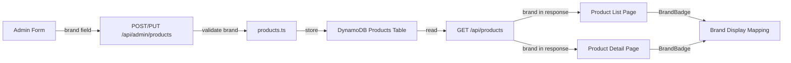

# Design Document: Product Brand Logo

## Overview

为商品添加可选的 `brand` 字段，允许管理员在创建/编辑商品时选择品牌（AWS / 亚马逊云科技UG / 亚马逊云科技），并在商品详情页和列表页展示对应的品牌徽章。

该功能是对现有 Product 数据模型的轻量扩展：
- 新增一个可选字段 `brand?: 'aws' | 'ug' | 'awscloud'`
- 无需数据库迁移，已有商品默认无品牌标识
- 后端增加验证逻辑，前端增加选择器和展示组件

## Architecture



变更范围：
1. **Shared types** (`packages/shared/src/types.ts`) — 新增 `ProductBrand` 类型和 `VALID_BRANDS` 常量
2. **Shared errors** (`packages/shared/src/errors.ts`) — 新增 `INVALID_BRAND` 错误码
3. **Backend** (`packages/backend/src/admin/products.ts`) — 新增 `validateBrand()` 函数，在 create/update 流程中调用
4. **Backend handler** (`packages/backend/src/admin/handler.ts`) — 在 `handleCreateProduct` 中传递 `brand` 字段
5. **Frontend admin** (`packages/frontend/src/pages/admin/products.tsx`) — 新增品牌单选组件
6. **Frontend detail** (`packages/frontend/src/pages/product/index.tsx`) — 新增品牌徽章展示
7. **Frontend list** (`packages/frontend/src/pages/index/index.tsx`) — 新增品牌小标识
8. **Backend feature-toggles** (`packages/backend/src/settings/feature-toggles.ts`) — 新增 `brandLogoEnabled` 字段到 `FeatureToggles` 接口和默认值
9. **Frontend settings** (`packages/frontend/src/pages/admin/settings.tsx`) — 在 SuperAdmin 设置页 feature-toggles 区域新增 "品牌 Logo 显示" 开关
10. **Frontend detail/list** — 品牌徽章渲染前检查 `brandLogoEnabled` 开关状态

## Components and Interfaces

### Shared Types

```typescript
// packages/shared/src/types.ts
export type ProductBrand = 'aws' | 'ug' | 'awscloud';
export const VALID_BRANDS: ProductBrand[] = ['aws', 'ug', 'awscloud'];

// Product interface 新增字段
export interface Product {
  // ... existing fields ...
  brand?: ProductBrand;
}
```

### Shared Errors

```typescript
// packages/shared/src/errors.ts
export const ErrorCodes = {
  // ... existing codes ...
  INVALID_BRAND: 'INVALID_BRAND',
};

export const ErrorMessages = {
  // ... existing messages ...
  INVALID_BRAND: 'brand 值无效，仅允许 aws、ug、awscloud',
};
```

### Backend Validation

```typescript
// packages/backend/src/admin/products.ts
import { VALID_BRANDS } from '@points-mall/shared';

export function validateBrand(
  brand: unknown,
): { code: string; message: string } | null {
  if (brand === undefined || brand === null || brand === '') return null;
  if (typeof brand !== 'string' || !VALID_BRANDS.includes(brand as any)) {
    return { code: ErrorCodes.INVALID_BRAND, message: ErrorMessages.INVALID_BRAND };
  }
  return null;
}
```

在 `createPointsProduct`、`createCodeExclusiveProduct` 和 `updateProduct` 中调用 `validateBrand`。

### Frontend Brand Display Mapping

```typescript
// 品牌显示映射（在前端组件中使用）
const BRAND_DISPLAY: Record<string, string> = {
  aws: 'AWS',
  ug: '亚马逊云科技UG',
  awscloud: '亚马逊云科技',
};
```

### Admin Form — Brand Selector

在商品表单的 description 字段下方、images 字段上方，添加一组 radio button：
- 三个选项：AWS / 亚马逊云科技UG / 亚马逊云科技
- 支持点击已选中项取消选择（设为无品牌）
- 编辑时根据已有 `brand` 值预选

### Detail Page — Brand Badge

在商品名称附近展示品牌徽章：
- 使用 styled text badge（与现有 role-badge 风格一致）
- 无 brand 时不渲染任何内容

### List Page — Brand Indicator

在商品卡片上展示小型品牌标识：
- 位于卡片 body 区域，商品名称旁或下方
- 紧凑设计，不影响现有布局
- 无 brand 时不渲染

### Feature Toggle — brandLogoEnabled

在现有 `FeatureToggles` 接口和相关类型中新增 `brandLogoEnabled` 字段：

```typescript
// packages/backend/src/settings/feature-toggles.ts
export interface FeatureToggles {
  // ... existing fields ...
  /** Whether brand logos are displayed on product detail and list pages */
  brandLogoEnabled: boolean;
}

// DEFAULT_TOGGLES 中新增：
brandLogoEnabled: true,  // 默认启用品牌 Logo 显示
```

同时更新：
- `UpdateFeatureTogglesInput` 接口新增 `brandLogoEnabled: boolean`
- `updateFeatureToggles` 函数的验证逻辑和 UpdateExpression 中新增该字段
- `getFeatureToggles` 函数读取时使用 `result.Item.brandLogoEnabled !== false`（默认 true）

前端 `FeatureToggles` 接口（`packages/frontend/src/pages/admin/settings.tsx`）同步新增 `brandLogoEnabled: boolean`，默认值 `true`。

SuperAdmin 设置页在 feature-toggles 分类下新增一个 Switch 开关：
- 标签：品牌 Logo 显示
- 描述：控制商品详情页和列表页是否展示品牌徽章
- 绑定 `settings.brandLogoEnabled`

前端商品详情页和列表页在渲染品牌徽章前，从 `/api/settings/feature-toggles` 读取 `brandLogoEnabled`，仅当为 `true` 时渲染。管理员商品表单中的品牌选择器不受此开关影响。

## Data Models

### DynamoDB Products Table

无 schema 变更。`brand` 作为可选属性存储在现有 Product item 中：

| 属性 | 类型 | 说明 |
|------|------|------|
| brand | String (optional) | `'aws'` \| `'ug'` \| `'awscloud'`，缺失表示无品牌 |

已有商品不受影响，查询时 `brand` 字段为 `undefined`。

## Correctness Properties

*A property is a characteristic or behavior that should hold true across all valid executions of a system — essentially, a formal statement about what the system should do. Properties serve as the bridge between human-readable specifications and machine-verifiable correctness guarantees.*

### Property 1: Brand validation accepts valid values and rejects all others

*For any* string input, the `validateBrand` function SHALL return `null` (accept) if and only if the input is one of `'aws'`, `'ug'`, or `'awscloud'`; for any other non-empty string, it SHALL return an error with code `INVALID_BRAND`. For `undefined`, `null`, or empty string, it SHALL return `null` (accept, meaning no brand).

**Validates: Requirements 2.1, 2.2, 2.3**

### Property 2: Brand display mapping is total and correct

*For any* valid `ProductBrand` value, the brand display mapping SHALL return a non-empty display string. The mapping SHALL be a bijection — distinct brand values produce distinct display strings.

**Validates: Requirements 3.3, 4.2, 5.4**

## Error Handling

| 场景 | 错误码 | HTTP 状态 | 说明 |
|------|--------|-----------|------|
| 创建/更新商品时 brand 值无效 | `INVALID_BRAND` | 400 | 仅接受 `'aws'`、`'ug'`、`'awscloud'` |
| 无 brand 字段 | 无错误 | 200/201 | 正常处理，商品无品牌标识 |

前端处理：
- 品牌选择器使用 radio button，用户只能选择有效值或不选，不会产生无效输入
- API 错误通过现有 `setError` 机制展示

## Testing Strategy

### Unit Tests (Example-based)

- 创建商品不带 brand，验证成功且返回无 brand 字段
- 创建商品带 brand='aws'，验证成功且返回 brand='aws'
- 更新商品 brand 从 'aws' 改为 'ug'，验证更新成功
- 更新商品移除 brand（设为 undefined），验证成功
- 前端：渲染品牌选择器，验证三个选项存在
- 前端：渲染有 brand 的商品卡片，验证徽章显示
- 前端：渲染无 brand 的商品卡片，验证无徽章

### Property Tests

使用 `fast-check` 进行属性测试，每个属性最少 100 次迭代：

- **Feature: product-brand-logo, Property 1: Brand validation accepts valid values and rejects all others**
  - 生成任意字符串，验证 validateBrand 的返回值与输入是否在有效集合中一致
- **Feature: product-brand-logo, Property 2: Brand display mapping is total and correct**
  - 对所有有效 brand 值，验证映射返回非空且唯一的显示字符串

### Integration Tests

- API 端到端：创建带 brand 的商品 → 列表 API 返回 brand → 详情 API 返回 brand
- API 端到端：创建不带 brand 的商品 → API 响应中无 brand 字段
