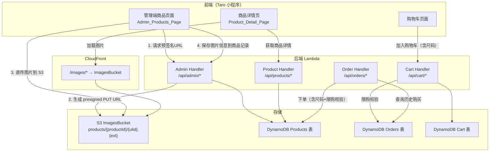

# 技术设计文档 - 商品管理增强（多图上传、尺码管理、限购设置）

## 概述

本设计文档描述积分商城系统（Points Mall）商品管理模块的三项增强功能的技术实现方案：

1. **多图上传**：通过 S3 预签名 URL 实现图片上传，支持最多 5 张商品图片，前端管理端支持图片排序和删除，商品详情页以 Swiper 轮播展示。
2. **尺码/规格管理**：商品可启用尺码选项，每个尺码独立库存，总库存为各尺码库存之和。下单时扣减对应尺码库存。
3. **限购设置**：管理员可为商品设置每人限购数量，下单和加购物车时校验用户历史购买数量。

### 关键设计决策

| 决策 | 方案 | 理由 |
|------|------|------|
| 图片上传方式 | S3 预签名 URL（PUT） | 前端直传 S3，不经过 Lambda，避免 Lambda 6MB payload 限制 |
| 图片存储路径 | `products/{productId}/{ulid}.{ext}` | 按商品分组，ulid 保证唯一性 |
| 图片访问方式 | 通过 CloudFront `/images/*` 路径 | 已有 CDN 配置，无需额外设置 |
| 尺码库存模型 | `sizeOptions` 数组嵌入商品记录 | 尺码数量有限（通常 ≤10），无需独立表 |
| 总库存计算 | 写入时计算 `stock = sum(sizeOptions[].stock)` | 保持与现有 stock 字段兼容，列表页无需额外查询 |
| 限购校验数据源 | 查询 Orders 表中该用户该商品的历史购买数量 | 订单是购买的最终记录，准确可靠 |
| 限购校验时机 | 下单时 + 加购物车时 | 双重校验，下单时为最终保障 |

---

## 架构

### 系统架构图



### 变更范围

| 模块 | 文件 | 变更类型 |
|------|------|----------|
| 共享类型 | `packages/shared/src/types.ts` | 修改：扩展 Product、CartItem、OrderItem 类型 |
| 管理端后端 | `packages/backend/src/admin/products.ts` | 修改：创建/更新商品支持新字段 |
| 管理端后端 | `packages/backend/src/admin/images.ts` | 新增：图片上传预签名 URL 生成、图片删除 |
| 管理端后端 | `packages/backend/src/admin/handler.ts` | 修改：新增图片相关路由 |
| 商品查询 | `packages/backend/src/products/detail.ts` | 修改：返回 images、sizeOptions、限购信息 |
| 购物车 | `packages/backend/src/cart/cart.ts` | 修改：加购时支持尺码、限购校验 |
| 订单 | `packages/backend/src/orders/order.ts` | 修改：下单时支持尺码库存扣减、限购校验 |
| CDK | `packages/cdk/lib/api-stack.ts` | 修改：Admin Lambda 增加 S3 权限，新增图片路由 |
| 前端管理页 | `packages/frontend/src/pages/admin/products.tsx` | 修改：图片上传 UI、尺码配置 UI、限购设置 UI |
| 前端详情页 | `packages/frontend/src/pages/product/index.tsx` | 修改：Swiper 轮播、尺码选择器、限购提示 |

---

## 组件与接口

### 1. 图片上传服务（Image_Upload_Service）

新增文件 `packages/backend/src/admin/images.ts`

#### 接口定义

```typescript
/** 图片信息 */
interface ProductImage {
  key: string;       // S3 对象 key，如 "products/abc123/01HX.jpg"
  url: string;       // CloudFront 访问 URL，如 "/images/products/abc123/01HX.jpg"
}

/** 生成预签名上传 URL */
interface GetUploadUrlInput {
  productId: string;
  fileName: string;       // 原始文件名，用于提取扩展名
  contentType: string;    // MIME 类型，如 "image/jpeg"
}

interface GetUploadUrlResult {
  success: boolean;
  data?: {
    uploadUrl: string;    // S3 预签名 PUT URL
    key: string;          // S3 对象 key
    url: string;          // CDN 访问路径
  };
  error?: { code: string; message: string };
}

async function getUploadUrl(
  input: GetUploadUrlInput,
  currentImageCount: number,
  s3Client: S3Client,
  bucketName: string,
): Promise<GetUploadUrlResult>

/** 删除 S3 图片 */
async function deleteImage(
  key: string,
  s3Client: S3Client,
  bucketName: string,
): Promise<{ success: boolean; error?: { code: string; message: string } }>
```

#### API 路由

| 方法 | 路径 | 说明 |
|------|------|------|
| POST | `/api/admin/products/{id}/upload-url` | 生成预签名上传 URL |
| DELETE | `/api/admin/products/{id}/images/{key}` | 删除商品图片 |

### 2. 商品管理服务扩展（Product_Admin_Service）

修改 `packages/backend/src/admin/products.ts`

#### 扩展的输入类型

```typescript
interface CreatePointsProductInput {
  // ... 现有字段
  images?: ProductImage[];
  sizeOptions?: SizeOption[];
  purchaseLimitEnabled?: boolean;
  purchaseLimitCount?: number;
}

interface SizeOption {
  name: string;    // 尺码名称，如 "S", "M", "L"
  stock: number;   // 该尺码库存
}
```

#### 业务规则

- 创建/更新商品时，若提供 `sizeOptions`，自动计算 `stock = sum(sizeOptions[].stock)`
- 尺码名称不可重复（同一商品内）
- 启用尺码时至少需要一个尺码选项
- 启用限购时 `purchaseLimitCount` 必须为正整数（≥1）
- 更新 `images` 数组时，自动将 `images[0].url` 同步到 `imageUrl` 字段
- 删除所有图片时，`imageUrl` 设为空字符串

### 3. 订单服务扩展（Order_Service）

修改 `packages/backend/src/orders/order.ts`

#### 限购校验逻辑

```typescript
/** 查询用户对某商品的历史购买总数量 */
async function getUserProductPurchaseCount(
  userId: string,
  productId: string,
  dynamoClient: DynamoDBDocumentClient,
  ordersTable: string,
): Promise<number>
```

- 查询 Orders 表 `userId-createdAt-index` GSI，获取该用户所有订单
- 遍历每个订单的 `items` 数组，累加 `productId` 匹配的 `quantity`
- 在 `createOrder` 中，对启用限购的商品，校验 `历史购买数量 + 本次数量 ≤ purchaseLimitCount`

#### 尺码库存扣减逻辑

- 订单项新增 `selectedSize?: string` 字段
- 下单时，若商品启用尺码，使用 DynamoDB UpdateExpression 扣减 `sizeOptions` 中对应尺码的 stock
- 同时扣减商品总 `stock`（保持一致性）

### 4. 购物车服务扩展（Cart_Service）

修改 `packages/backend/src/cart/cart.ts`

- `CartItem` 新增 `selectedSize?: string` 字段
- `addToCart` 新增参数 `selectedSize`
- 同一商品不同尺码视为不同购物车项
- 加购时校验限购：查询历史购买数量 + 购物车中该商品数量 + 1 ≤ purchaseLimitCount

---

## 数据模型

### Products 表扩展字段

| 字段 | 类型 | 说明 |
|------|------|------|
| `images` | `ProductImage[]` | 商品图片数组，有序，最多 5 张 |
| `sizeOptions` | `SizeOption[]` \| `undefined` | 尺码选项数组，未启用时为 undefined |
| `purchaseLimitEnabled` | `boolean` | 是否启用限购，默认 false |
| `purchaseLimitCount` | `number` \| `undefined` | 限购数量，仅在 purchaseLimitEnabled=true 时有效 |

```typescript
/** 扩展后的商品图片信息 */
interface ProductImage {
  key: string;   // S3 key: "products/{productId}/{ulid}.{ext}"
  url: string;   // CDN 路径: "/images/products/{productId}/{ulid}.{ext}"
}

/** 尺码选项 */
interface SizeOption {
  name: string;  // 尺码名称
  stock: number; // 该尺码库存
}

/** 扩展后的 Product 接口 */
interface Product {
  // ... 现有字段保持不变
  images?: ProductImage[];
  sizeOptions?: SizeOption[];
  purchaseLimitEnabled?: boolean;
  purchaseLimitCount?: number;
}
```

### CartItem 扩展

```typescript
interface CartItem {
  productId: string;
  quantity: number;
  addedAt: string;
  selectedSize?: string;  // 新增：选择的尺码
}
```

### OrderItem 扩展

```typescript
interface OrderItem {
  productId: string;
  productName: string;
  imageUrl: string;
  pointsCost: number;
  quantity: number;
  subtotal: number;
  selectedSize?: string;  // 新增：选择的尺码
}
```

### 数据兼容性

- 所有新字段均为可选（`?`），现有商品数据无需迁移
- `images` 为空或 undefined 时，前端回退到 `imageUrl` 字段
- `sizeOptions` 为 undefined 时，商品按现有逻辑处理（无尺码）
- `purchaseLimitEnabled` 为 false 或 undefined 时，不进行限购校验


---

## 正确性属性（Correctness Properties）

*属性（Property）是指在系统所有合法执行中都应成立的特征或行为——本质上是对系统应做什么的形式化陈述。属性是人类可读规格说明与机器可验证正确性保证之间的桥梁。*

### Property 1: 图片 S3 Key 格式正确

*For any* productId 和任意包含扩展名的文件名，生成的 S3 key 应匹配正则 `^products\/[A-Za-z0-9]+\/[A-Za-z0-9]+\.\w+$`，且 key 中包含传入的 productId，扩展名与原始文件名一致。

**Validates: Requirements 1.2**

### Property 2: 图片数量上限不变量

*For any* 商品和任意数量的上传请求，当商品已有的图片数量 ≥ 5 时，上传请求应被拒绝并返回错误；当图片数量 < 5 时，上传请求应成功。商品的 images 数组长度始终 ≤ 5。

**Validates: Requirements 1.3, 1.4**

### Property 3: imageUrl 同步不变量

*For any* 商品，当 images 数组非空时，imageUrl 应等于 images[0].url；当 images 数组为空或 undefined 时，imageUrl 应为空字符串。此规则在每次图片增删和排序操作后都应成立。

**Validates: Requirements 1.7, 1.8, 2.3**

### Property 4: 尺码总库存等于各尺码库存之和

*For any* 启用尺码选项的商品和任意 sizeOptions 数组（每个元素 stock ≥ 0），保存后商品的 stock 字段应等于 `sizeOptions.reduce((sum, s) => sum + s.stock, 0)`。

**Validates: Requirements 3.4**

### Property 5: 尺码名称唯一性

*For any* sizeOptions 数组，若其中存在两个或以上元素的 name 相同，则保存操作应被拒绝并返回错误。

**Validates: Requirements 3.6**

### Property 6: 限购数量必须为正整数

*For any* 启用限购（purchaseLimitEnabled = true）的商品，purchaseLimitCount 必须为正整数（≥ 1）。对于任意非正整数值（0、负数、小数、undefined），保存操作应被拒绝。

**Validates: Requirements 5.4, 5.5**

### Property 7: 下单限购校验

*For any* 启用限购的商品、任意用户和任意购买数量，若该用户对该商品的历史购买总数量 + 本次购买数量 > purchaseLimitCount，则下单应被拒绝；若 ≤ purchaseLimitCount，则限购校验应通过。

**Validates: Requirements 6.2, 6.3**

### Property 8: 加购物车限购校验

*For any* 启用限购的商品和任意用户，若该用户购物车中该商品数量 + 历史购买数量 + 新增数量 > purchaseLimitCount，则加购应被拒绝。

**Validates: Requirements 6.5, 6.6**

### Property 9: 尺码库存扣减正确性

*For any* 启用尺码的商品和任意选定尺码的订单，下单后该尺码的 stock 应减少订单数量，商品总 stock 也应减少相同数量，其他尺码的 stock 不变。

**Validates: Requirements 4.7**

### Property 10: 尺码信息持久化完整性

*For any* 包含尺码商品的订单或购物车操作，持久化后的记录应包含 selectedSize 字段，且其值与用户选择的尺码一致。

**Validates: Requirements 4.5, 4.6**

### Property 11: 向后兼容性

*For any* 未启用尺码（sizeOptions 为 undefined）且未启用限购（purchaseLimitEnabled 为 false 或 undefined）的商品，下单和加购流程的行为应与增强前完全一致——不进行尺码校验，不进行限购校验，库存扣减方式不变。

**Validates: Requirements 4.8, 6.4**

---

## 错误处理

### 新增错误码

| 错误码 | HTTP 状态码 | 消息 | 触发场景 |
|--------|------------|------|----------|
| `IMAGE_LIMIT_EXCEEDED` | 400 | 图片数量已达上限（最多 5 张） | 商品已有 5 张图片时请求上传 |
| `INVALID_FILE_TYPE` | 400 | 不支持的文件类型 | 上传非图片文件（仅允许 jpg/jpeg/png/webp） |
| `IMAGE_NOT_FOUND` | 404 | 图片不存在 | 删除不存在的图片 |
| `SIZE_OPTIONS_REQUIRED` | 400 | 请至少添加一个尺码 | 启用尺码但 sizeOptions 为空 |
| `DUPLICATE_SIZE_NAME` | 400 | 尺码名称不能重复 | sizeOptions 中有重复 name |
| `SIZE_REQUIRED` | 400 | 请选择尺码 | 有尺码商品下单/加购时未提供 selectedSize |
| `SIZE_NOT_FOUND` | 400 | 所选尺码不存在 | 提供的 selectedSize 不在商品 sizeOptions 中 |
| `SIZE_OUT_OF_STOCK` | 400 | 所选尺码库存不足 | 对应尺码库存不足 |
| `PURCHASE_LIMIT_INVALID` | 400 | 请设置有效的限购数量（至少为 1） | 启用限购但数量无效 |
| `PURCHASE_LIMIT_EXCEEDED` | 400 | 超出限购数量，您已购买 X 件，最多还可购买 Y 件 | 下单/加购超出限购 |

### 错误处理策略

- 所有新增错误码添加到 `packages/shared/src/types.ts` 的 `ErrorCodes` 和 `ErrorMessages` 常量中
- 图片上传失败（S3 错误）返回 500，前端提示"上传失败，请重试"
- 预签名 URL 生成失败返回 500
- 限购校验的错误消息包含具体数字（已购买 X 件，还可购买 Y 件），方便用户理解

---

## 测试策略

### 属性测试（Property-Based Testing）

使用 `fast-check` 库进行属性测试，每个属性测试至少运行 100 次迭代。

| 属性 | 测试文件 | 说明 |
|------|----------|------|
| Property 1 | `admin/images.property.test.ts` | 生成随机 productId 和文件名，验证 key 格式 |
| Property 2 | `admin/images.property.test.ts` | 生成随机 currentImageCount (0-10)，验证上限逻辑 |
| Property 3 | `admin/products.property.test.ts` | 生成随机 images 数组，验证 imageUrl 同步 |
| Property 4 | `admin/products.property.test.ts` | 生成随机 sizeOptions 数组，验证 stock 计算 |
| Property 5 | `admin/products.property.test.ts` | 生成含重复名称的 sizeOptions，验证拒绝 |
| Property 6 | `admin/products.property.test.ts` | 生成随机 purchaseLimitCount 值，验证校验 |
| Property 7 | `orders/order.property.test.ts` | 生成随机历史购买数量和本次数量，验证限购 |
| Property 8 | `cart/cart.property.test.ts` | 生成随机购物车状态和历史购买，验证限购 |
| Property 9 | `orders/order.property.test.ts` | 生成随机尺码订单，验证库存扣减 |
| Property 10 | `orders/order.property.test.ts` | 生成随机尺码订单，验证 selectedSize 持久化 |
| Property 11 | `orders/order.property.test.ts` | 生成无尺码无限购商品，验证行为不变 |

每个属性测试必须包含注释标签：
```
// Feature: product-management-enhancement, Property {N}: {property_text}
```

### 单元测试

| 测试文件 | 覆盖内容 |
|----------|----------|
| `admin/images.test.ts` | 预签名 URL 生成、图片删除、文件类型校验 |
| `admin/products.test.ts` | 扩展：尺码创建/更新/删除、限购设置、images 字段更新 |
| `orders/order.test.ts` | 扩展：尺码库存扣减、限购校验、错误场景 |
| `cart/cart.test.ts` | 扩展：带尺码加购、限购校验、同商品不同尺码 |
| `products/detail.test.ts` | 扩展：返回 images、sizeOptions、限购信息 |

### 测试配置

- 属性测试使用 `fast-check`（项目已有依赖）
- 每个属性测试配置 `numRuns: 100`
- 使用 `vitest` 作为测试运行器（项目已有配置）
- DynamoDB 操作使用 mock（与现有测试模式一致）
