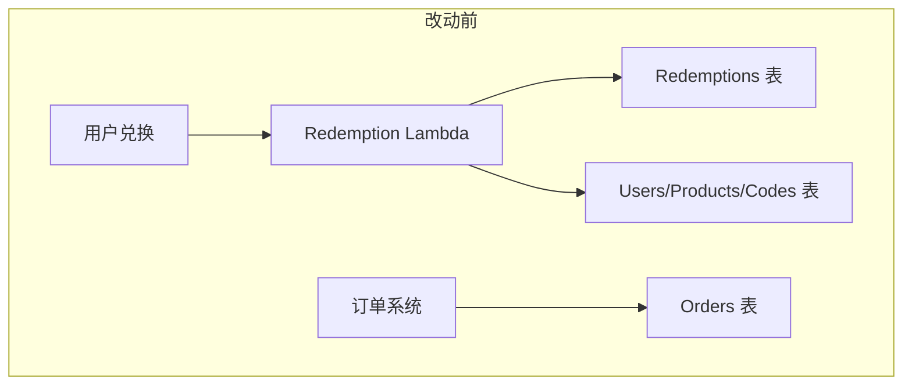
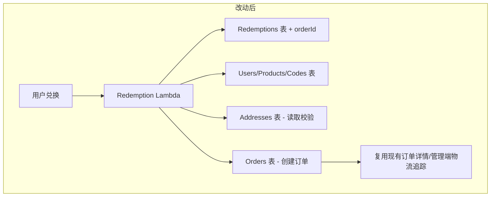

# 技术设计文档 - 兑换记录统一与物流追踪

## 概述

本设计将兑换系统与订单系统打通，解决三个核心问题：

1. **兑换历史 API 响应格式不匹配**：后端 `getRedemptionHistory` 返回 `{ records, lastKey }`（游标分页），前端 `ProfilePage` 期望 `{ items, total, page, pageSize }`（页码分页）。需将后端改为页码分页并统一字段名。
2. **兑换流程缺少收货地址**：`redeemWithPoints` 和 `redeemWithCode` 均不接受 `addressId`，导致实物商品无法配送。需在两个兑换函数中增加地址校验。
3. **兑换记录无订单关联**：兑换成功后仅写入 Redemptions 表，不创建 Orders 表记录。需在兑换事务中同步创建订单，并在 RedemptionRecord 中保存 `orderId`。

改动范围：
- **后端**：`history.ts`（分页重构）、`points-redemption.ts`（增加 addressId + 创建订单）、`code-redemption.ts`（增加 addressId + 创建订单）、`handler.ts`（传递新环境变量和参数）
- **共享类型**：`types.ts`（RedemptionRecord 增加 `orderId`、`shippingStatus`）
- **CDK**：`api-stack.ts`（Redemption Lambda 增加 Addresses/Orders 表权限和环境变量）
- **前端**：`redeem/index.tsx`（地址选择器）、`profile/index.tsx`（兑换记录展示物流状态和跳转）

---

## 架构

### 改动前后对比





### 核心设计决策

1. **在兑换事务中同步创建订单**：将订单创建加入现有的 `TransactWriteCommand`，保证兑换记录和订单的原子性。DynamoDB 事务最多支持 100 个操作项，当前积分兑换事务有 4 项（扣积分、减库存、写兑换记录、写积分记录），Code 兑换有 3 项（更新码、减库存、写兑换记录），增加 1 项写订单后仍远低于上限。

2. **地址校验在事务外执行**：地址读取（`GetCommand`）在事务前完成，与现有 `order.ts` 中 `createOrder` 的模式一致。地址数据在事务期间不会被删除（极低概率竞态，可接受）。

3. **兑换历史改为页码分页**：放弃游标分页（`lastKey`），改为与 `getOrders` 一致的页码分页。由于兑换记录量级有限（单用户通常 < 1000 条），全量查询后内存分页是可接受的方案，与现有订单列表实现保持一致。

4. **订单 `source` 字段区分来源**：在 Orders 表记录中增加 `source` 字段（`points_redemption` | `code_redemption` | `cart`），用于区分订单来源。现有购物车订单默认 `source: 'cart'`。

5. **复用现有订单系统**：兑换创建的订单与购物车订单结构完全一致，复用现有的订单详情页、管理端订单列表、物流状态更新等功能，无需额外开发。

---

## 组件与接口

### 1. 兑换历史 API 重构

**文件**：`packages/backend/src/redemptions/history.ts`

当前接口签名：
```typescript
// 改动前
getRedemptionHistory(userId, dynamoClient, redemptionsTable, { pageSize?, lastKey? })
→ { success, records?, lastKey? }
```

改动后：
```typescript
// 改动后
getRedemptionHistory(userId, dynamoClient, redemptionsTable, ordersTable, { page?, pageSize? })
→ { success, items?, total?, page?, pageSize? }
```

实现策略：
- 查询 `userId-createdAt-index` GSI 获取全部兑换记录（`ScanIndexForward: false`）
- 对含有 `orderId` 的记录，批量查询 Orders 表获取 `shippingStatus`
- 内存分页：`items = allRecords.slice((page-1)*pageSize, page*pageSize)`
- 返回字段名改为 `items`、`total`、`page`、`pageSize`

### 2. 积分兑换增加地址和订单

**文件**：`packages/backend/src/redemptions/points-redemption.ts`

接口变更：
```typescript
// 改动前
interface RedeemWithPointsInput {
  productId: string;
  userId: string;
}

// 改动后
interface RedeemWithPointsInput {
  productId: string;
  userId: string;
  addressId: string;  // 新增
}

interface RedeemWithPointsResult {
  success: boolean;
  redemptionId?: string;
  orderId?: string;  // 新增
  error?: { code: string; message: string };
}
```

新增逻辑（在现有校验之后、事务之前）：
1. 校验 `addressId` 非空，否则返回 `NO_ADDRESS_SELECTED`
2. 从 Addresses 表读取地址，校验存在且 `userId` 匹配，否则返回 `ADDRESS_NOT_FOUND`
3. 在事务中增加一个 `Put` 操作写入 Orders 表
4. 在兑换记录的 `Put` 操作中增加 `orderId` 字段

新增的表依赖：`addressesTable`、`ordersTable`

### 3. Code 兑换增加地址和订单

**文件**：`packages/backend/src/redemptions/code-redemption.ts`

接口变更：
```typescript
// 改动前
interface RedeemWithCodeInput {
  productId: string;
  code: string;
  userId: string;
}

// 改动后
interface RedeemWithCodeInput {
  productId: string;
  code: string;
  userId: string;
  addressId: string;  // 新增
}

interface RedeemWithCodeResult {
  success: boolean;
  redemptionId?: string;
  orderId?: string;  // 新增
  error?: { code: string; message: string };
}
```

新增逻辑与积分兑换类似，区别在于：
- Code 兑换订单的 `totalPoints` 为 0
- 订单 `source` 为 `code_redemption`

### 4. Redemption Handler 适配

**文件**：`packages/backend/src/redemptions/handler.ts`

变更：
- 读取新环境变量 `ADDRESSES_TABLE`、`ORDERS_TABLE`
- `handleRedeemWithPoints`：从请求体解析 `addressId`，传入 `redeemWithPoints`
- `handleRedeemWithCode`：从请求体解析 `addressId`，传入 `redeemWithCode`
- `handleGetHistory`：改为解析 `page`/`pageSize` 查询参数，传入 `ordersTable`
- 兑换成功响应中增加 `orderId` 字段

### 5. CDK 权限变更

**文件**：`packages/cdk/lib/api-stack.ts`

新增两行：
```typescript
addressesTable.grantReadData(redemptionFn);
ordersTable.grantReadWriteData(redemptionFn);
```

Redemption Lambda 的环境变量 `tableEnv` 已包含 `ADDRESSES_TABLE` 和 `ORDERS_TABLE`（在 `commonFnProps` 中统一设置），无需额外添加。

### 6. 前端兑换页面 - 地址选择器

**文件**：`packages/frontend/src/pages/redeem/index.tsx`

新增功能：
- 页面加载时调用 `GET /api/addresses` 获取用户地址列表
- 自动选中 `isDefault: true` 的地址
- 在积分兑换和 Code 兑换确认区域上方展示地址卡片（收件人、手机号、详细地址）
- 点击地址卡片展开地址选择列表
- 无地址时显示"请添加收货地址"提示，提供跳转至 `/pages/address/index` 的入口
- 未选择地址时禁用"确认兑换"按钮
- 兑换请求中携带 `addressId`
- 兑换成功后可跳转至订单详情页（使用返回的 `orderId`）

### 7. 前端个人中心 - 兑换记录展示

**文件**：`packages/frontend/src/pages/profile/index.tsx`

变更：
- `RedemptionRecord` 接口增加 `orderId?` 和 `shippingStatus?` 字段
- 兑换记录列表项增加物流状态标签（待发货/已发货/运输中/已签收）
- 点击兑换记录跳转至 `/pages/order-detail/index?id={orderId}`

---

## 数据模型

### RedemptionRecord 类型变更

**文件**：`packages/shared/src/types.ts`

```typescript
// 改动前
export interface RedemptionRecord {
  redemptionId: string;
  userId: string;
  productId: string;
  productName: string;
  method: RedemptionMethod;
  pointsSpent?: number;
  codeUsed?: string;
  status: RedemptionStatus;
  createdAt: string;
}

// 改动后
export interface RedemptionRecord {
  redemptionId: string;
  userId: string;
  productId: string;
  productName: string;
  method: RedemptionMethod;
  pointsSpent?: number;
  codeUsed?: string;
  status: RedemptionStatus;
  orderId?: string;        // 新增：关联的订单 ID
  createdAt: string;
}
```

### 兑换创建的订单记录结构

写入 Orders 表的记录与现有购物车订单结构一致，增加 `source` 字段：

```typescript
{
  orderId: string;           // ULID
  userId: string;
  items: [{
    productId: string;
    productName: string;
    imageUrl: string;
    pointsCost: number;      // 积分兑换时为实际积分，Code 兑换时为 0
    quantity: 1;             // 兑换固定为 1
    subtotal: number;        // 同 pointsCost
  }];
  totalPoints: number;       // 积分兑换时为 pointsCost，Code 兑换时为 0
  shippingAddress: {
    recipientName: string;
    phone: string;
    detailAddress: string;
  };
  shippingStatus: 'pending';
  shippingEvents: [{
    status: 'pending';
    timestamp: string;
    remark: '兑换订单已创建';
  }];
  source: 'points_redemption' | 'code_redemption';  // 新增字段
  createdAt: string;
  updatedAt: string;
}
```

### 兑换历史 API 响应格式

```typescript
// 改动后的响应
{
  items: Array<RedemptionRecord & { shippingStatus?: ShippingStatus }>;
  total: number;
  page: number;
  pageSize: number;
}
```

每条记录在有 `orderId` 时，额外附带该订单的 `shippingStatus`。


---

## 正确性属性（Correctness Properties）

*属性（Property）是指在系统所有合法执行中都应成立的特征或行为——本质上是对系统应做什么的形式化陈述。属性是人类可读规格说明与机器可验证正确性保证之间的桥梁。*

### Property 1: 兑换历史分页响应格式正确

*For any* 用户的兑换记录集合和任意合法的 page/pageSize 参数，`getRedemptionHistory` 返回的响应必须包含 `items`（数组）、`total`（总记录数）、`page`（当前页码）、`pageSize`（每页数量）四个字段，且 `items` 中每条记录包含 `redemptionId`、`productName`、`method`、`status`、`createdAt` 字段，`items` 的长度不超过 `pageSize`，`items` 按 `createdAt` 降序排列。

**Validates: Requirements 1.1, 1.2, 1.3, 1.5**

### Property 2: 兑换请求缺少 addressId 时被拒绝

*For any* 积分兑换或 Code 兑换请求，若请求中未提供 `addressId`（undefined/空字符串），则兑换函数必须返回 `success: false` 且错误码为 `NO_ADDRESS_SELECTED`。

**Validates: Requirements 2.1, 2.2, 3.1, 3.2**

### Property 3: 兑换请求的地址归属校验

*For any* 积分兑换或 Code 兑换请求，若提供的 `addressId` 对应的地址不存在或不属于当前用户，则兑换函数必须返回 `success: false` 且错误码为 `ADDRESS_NOT_FOUND`。

**Validates: Requirements 2.3, 2.4, 3.3, 3.4**

### Property 4: 成功兑换创建正确的订单记录

*For any* 成功的积分兑换或 Code 兑换，Orders 表中必须存在一条对应的订单记录，满足：`shippingStatus` 为 `pending`，`shippingEvents` 包含一条初始事件（status: 'pending'），`shippingAddress` 与用户选择的地址一致，`source` 字段为 `points_redemption`（积分兑换）或 `code_redemption`（Code 兑换），积分兑换订单的 `totalPoints` 等于商品积分价格，Code 兑换订单的 `totalPoints` 为 0。

**Validates: Requirements 4.1, 4.2, 4.3, 4.5**

### Property 5: 兑换记录和响应包含 orderId

*For any* 成功的积分兑换或 Code 兑换，兑换函数的返回结果必须包含非空的 `orderId`，且 Redemptions 表中对应的兑换记录也包含相同的 `orderId`。

**Validates: Requirements 4.4, 4.6**

### Property 6: 兑换历史包含订单关联信息

*For any* 兑换历史 API 返回的记录，若该记录有关联的 `orderId`，则响应中必须同时包含该订单的 `shippingStatus` 字段，且其值与 Orders 表中对应订单的 `shippingStatus` 一致。

**Validates: Requirements 6.1, 6.2**

---

## 错误处理

### 新增错误场景

| 场景 | 错误码 | HTTP 状态码 | 消息 |
|------|--------|------------|------|
| 兑换请求缺少 addressId | `NO_ADDRESS_SELECTED` | 400 | 请选择收货地址 |
| addressId 对应地址不存在或不属于用户 | `ADDRESS_NOT_FOUND` | 400 | 收货地址不存在 |

这两个错误码已在 `packages/shared/src/errors.ts` 中定义，无需新增。

### 事务失败处理

兑换事务（`TransactWriteCommand`）增加订单写入后，可能的失败场景：
- **积分不足**（`ConditionExpression` 失败）：事务整体回滚，不创建订单
- **库存不足**（`ConditionExpression` 失败）：事务整体回滚，不创建订单
- **Code 已使用**（`ConditionExpression` 失败）：事务整体回滚，不创建订单

所有场景下，由于使用 DynamoDB 事务，兑换记录和订单记录要么同时成功，要么同时不存在，保证数据一致性。

### 兑换历史查询订单状态失败

当 `getRedemptionHistory` 批量查询 Orders 表获取 `shippingStatus` 时，若某个 `orderId` 对应的订单不存在（极端情况），该记录的 `shippingStatus` 返回 `undefined`，不影响其他记录的正常返回。

---

## 测试策略

### 单元测试

1. **history.ts 重构测试**：
   - 验证空记录返回 `{ items: [], total: 0, page: 1, pageSize: 20 }`
   - 验证分页参数边界（page=0、pageSize=0、超出范围的页码）
   - 验证含 orderId 的记录正确附带 shippingStatus

2. **points-redemption.ts 地址校验测试**：
   - 缺少 addressId 返回 NO_ADDRESS_SELECTED
   - 无效 addressId 返回 ADDRESS_NOT_FOUND
   - 地址属于其他用户返回 ADDRESS_NOT_FOUND
   - 成功兑换后 Orders 表有对应记录

3. **code-redemption.ts 地址校验测试**：
   - 同上，针对 Code 兑换路径
   - Code 兑换订单 totalPoints 为 0

4. **handler.ts 路由测试**：
   - 验证请求体缺少 addressId 时返回 400
   - 验证兑换成功响应包含 orderId

### 属性测试（Property-Based Testing）

使用 `fast-check` 库，每个属性测试至少运行 100 次迭代。

- **Property 1 测试**：生成随机兑换记录数组和随机 page/pageSize，验证响应格式和排序
  - Tag: `Feature: redemption-order-unification, Property 1: 兑换历史分页响应格式正确`

- **Property 2 测试**：生成随机合法兑换输入但 addressId 为空/undefined，验证拒绝
  - Tag: `Feature: redemption-order-unification, Property 2: 兑换请求缺少 addressId 时被拒绝`

- **Property 3 测试**：生成随机用户和不匹配的地址，验证拒绝
  - Tag: `Feature: redemption-order-unification, Property 3: 兑换请求的地址归属校验`

- **Property 4 测试**：生成随机合法兑换输入（含有效地址），执行兑换后验证 Orders 表记录
  - Tag: `Feature: redemption-order-unification, Property 4: 成功兑换创建正确的订单记录`

- **Property 5 测试**：生成随机合法兑换输入，执行兑换后验证返回值和 Redemptions 表中的 orderId
  - Tag: `Feature: redemption-order-unification, Property 5: 兑换记录和响应包含 orderId`

- **Property 6 测试**：生成随机兑换记录（部分含 orderId），模拟 Orders 表数据，验证历史 API 返回的 shippingStatus 一致性
  - Tag: `Feature: redemption-order-unification, Property 6: 兑换历史包含订单关联信息`
