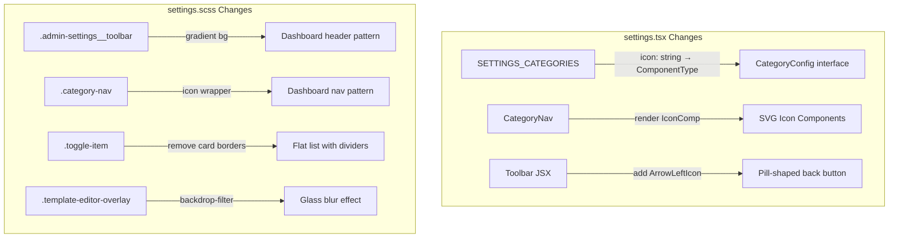

# Design Document: Settings Page UI/UX Polish

## Overview

This design applies visual refinements to the admin settings page (`packages/frontend/src/pages/admin/settings.tsx` + `settings.scss`) to match the quality of the recently redesigned admin dashboard (`packages/frontend/src/pages/admin/index.tsx`). The changes are purely cosmetic and structural — no backend changes, no new files, no new components outside the two existing files.

The current settings page has functional category navigation, collapsible sections, toggle items, a permissions matrix, an email template editor modal, and a SuperAdmin transfer section. However, it uses emoji characters for category icons, has inconsistent spacing, lacks the toolbar polish of the dashboard header, and has several visual hierarchy issues.

### Key Design Decisions

1. **Two-file scope**: All changes are confined to `settings.tsx` and `settings.scss`. No new component files, no new utility files.

2. **SVG icon components replace emoji**: The `SETTINGS_CATEGORIES` config changes from `icon: string` (emoji) to `icon: React.ComponentType<{ size: number; color: string }>`, matching the `DashboardCategory` pattern from `index.tsx`. All 7 icons come from `packages/frontend/src/components/icons/`.

3. **Dashboard pattern reuse**: The `CategoryNav` component adopts the same rendering pattern as `DashboardCategoryNav` — instantiating the icon component with `size` and `color` props, with color switching between `--text-secondary` (default) and `--text-inverse` (active).

4. **Toolbar gradient header**: The toolbar adopts the dashboard's `linear-gradient(135deg, --bg-surface, --bg-elevated)` background pattern with a pill-shaped back button using `ArrowLeftIcon`.

5. **Flat toggle list layout**: Toggle items drop their individual card borders in favor of a flat list with `--card-border` dividers between items, reducing visual noise.

6. **Modal backdrop blur**: The email template editor modal overlay gains `backdrop-filter: blur(4px)` for a modern glass effect.

7. **Three-tier responsive padding**: Content area uses `--space-3` (mobile), `--space-4` (tablet), `--space-6` (desktop), matching the dashboard's responsive breakpoints exactly.

8. **No new dependencies**: Uses only existing Taro components, existing SVG icon components, and existing CSS variables from `app.scss`.

## Architecture

### Change Scope

```
settings.tsx
├── Import: Add SVG icon component imports (SettingsIcon, KeyIcon, ProfileIcon, MailIcon, LocationIcon, GiftIcon, AdminIcon, ArrowLeftIcon)
├── SETTINGS_CATEGORIES: Change icon type from string to React.ComponentType
├── CategoryNav: Update to render SVG icon components (match DashboardCategoryNav pattern)
├── Toolbar JSX: Add ArrowLeftIcon, update className structure
├── EmailTemplateEditorModal: No JSX changes (styling only via SCSS)
└── All other JSX: No changes (functionality preserved)

settings.scss
├── Toolbar: Gradient background, pill-shaped back button
├── CategoryNav: SVG icon rendering styles (match dashboard-category-nav)
├── Toggle items: Flat list layout with dividers
├── Permissions matrix: Minor refinements (already well-styled)
├── Email template modal: Backdrop blur, max-height 85vh, close button sizing
├── Responsive breakpoints: Three-tier padding (mobile/tablet/desktop)
└── prefers-reduced-motion: Ensure all new transitions are covered
```

### Component Changes Diagram



## Components and Interfaces

### 1. SETTINGS_CATEGORIES Configuration Change

**Current** (emoji strings):
```typescript
interface CategoryConfig {
  key: string;
  label: string;
  icon: string;
}

const SETTINGS_CATEGORIES: CategoryConfig[] = [
  { key: 'feature-toggles', label: '功能开关', icon: '⚡' },
  { key: 'admin-permissions', label: '管理员权限', icon: '🔑' },
  // ...
];
```

**New** (SVG icon components, matching `DashboardCategory` from `index.tsx`):
```typescript
interface CategoryConfig {
  key: string;
  label: string;
  icon: React.ComponentType<{ size: number; color: string }>;
}

const SETTINGS_CATEGORIES: CategoryConfig[] = [
  { key: 'feature-toggles', label: '功能开关', icon: SettingsIcon },
  { key: 'admin-permissions', label: '管理员权限', icon: KeyIcon },
  { key: 'content-roles', label: '内容角色权限', icon: ProfileIcon },
  { key: 'email-notifications', label: '邮件通知', icon: MailIcon },
  { key: 'travel-sponsorship', label: '差旅赞助', icon: LocationIcon },
  { key: 'invite-settings', label: '邀请设置', icon: GiftIcon },
  { key: 'superadmin', label: '超级管理员', icon: AdminIcon },
];
```

### 2. CategoryNav Component Update

**Current**: Renders `<Text className='category-nav__icon'>{cat.icon}</Text>` (emoji string).

**New**: Renders SVG icon component with dynamic color, matching `DashboardCategoryNav` pattern from `index.tsx`:

```tsx
function CategoryNav({
  categories,
  activeCategory,
  onCategoryChange,
}: {
  categories: CategoryConfig[];
  activeCategory: string;
  onCategoryChange: (key: string) => void;
}) {
  return (
    <View className='category-nav'>
      {categories.map((cat) => {
        const isActive = activeCategory === cat.key;
        const IconComp = cat.icon;
        return (
          <View
            key={cat.key}
            className={`category-nav__item${isActive ? ' category-nav__item--active' : ''}`}
            onClick={() => onCategoryChange(cat.key)}
          >
            <View className='category-nav__icon'>
              <IconComp size={18} color={isActive ? 'var(--text-inverse)' : 'var(--text-secondary)'} />
            </View>
            <Text className='category-nav__label'>{cat.label}</Text>
          </View>
        );
      })}
    </View>
  );
}
```

Key differences from current:
- `cat.icon` is now a component, not a string
- Icon wrapper is `<View>` instead of `<Text>` (to hold the SVG component)
- Color switches between `--text-secondary` (default) and `--text-inverse` (active)
- Size is fixed at 18 (matching dashboard)

### 3. Toolbar/Header Update

**Current**: Plain `--bg-surface` background, simple text back button.

**New**: Gradient background with `ArrowLeftIcon` in a pill-shaped back button:

```tsx
<View className='admin-settings__toolbar'>
  <View className='admin-settings__back' onClick={handleBack}>
    <ArrowLeftIcon size={16} color='var(--accent-primary)' />
    <Text className='admin-settings__back-text'>{t('admin.settings.backButton')}</Text>
  </View>
  <Text className='admin-settings__title'>{t('admin.settings.title')}</Text>
  <View style={{ width: '60px' }} />
</View>
```

### 4. Import Additions

Add to the top of `settings.tsx`:
```typescript
import {
  SettingsIcon,
  KeyIcon,
  ProfileIcon,
  MailIcon,
  LocationIcon,
  GiftIcon,
  AdminIcon,
  ArrowLeftIcon,
} from '../../components/icons';
```

### 5. No JSX Changes to Functional Components

The following components have **no JSX changes** — all their visual refinements are handled purely through SCSS:
- `CollapsibleSection` — spacing/padding changes via SCSS only
- `EmailTemplateEditorModal` — backdrop blur, sizing, close button via SCSS only
- Toggle items — flat list layout via SCSS only
- Permissions matrix — minor refinements via SCSS only
- Transfer section — no changes
- Invite settings — no changes

## Data Models

No data model changes. The only structural change is the `CategoryConfig.icon` field type changing from `string` to `React.ComponentType<{ size: number; color: string }>`. This is a local interface within `settings.tsx`, not a shared type.

No API changes. No backend changes.

## SCSS Changes Detail

### Toolbar Styles

```scss
.admin-settings {
  &__toolbar {
    display: flex;
    align-items: center;
    justify-content: space-between;
    padding: var(--space-4) var(--space-5);
    background: linear-gradient(135deg, var(--bg-surface) 0%, var(--bg-elevated) 100%);
    border-bottom: 1px solid var(--card-border);
  }

  &__back {
    display: inline-flex;
    align-items: center;
    gap: var(--space-2);
    padding: var(--space-2) var(--space-3);
    background: var(--bg-elevated);
    border: 1px solid var(--card-border);
    border-radius: var(--radius-md);
    color: var(--accent-primary);
    cursor: pointer;
    transition: background-color var(--transition-fast);

    &:hover {
      background: var(--bg-hover);
    }
  }

  &__back-text {
    font-family: var(--font-body);
    font-size: var(--text-body-sm);
    font-weight: 500;
    color: var(--accent-primary);
  }

  &__title {
    font-family: var(--font-display);
    font-size: var(--text-h3);
    font-weight: 700;
    color: var(--text-primary);
  }
}
```

### Category Navigation Styles (matching dashboard pattern)

```scss
.category-nav {
  display: flex;
  flex-direction: column;
  gap: var(--space-1);
  padding: var(--space-3);
  background: var(--bg-surface);
  border-right: 1px solid var(--card-border);
  min-width: 220px;

  &__item {
    display: flex;
    align-items: center;
    gap: var(--space-3);
    padding: var(--space-3) var(--space-4);
    border-radius: var(--radius-md);
    cursor: pointer;
    background: transparent;
    transition: background var(--transition-fast), color var(--transition-fast);

    &:hover {
      background: var(--bg-hover);
    }

    &--active {
      background: var(--accent-primary);

      &:hover {
        background: var(--accent-primary);
      }

      .category-nav__label {
        color: var(--text-inverse);
      }
    }
  }

  &__icon {
    flex-shrink: 0;
    display: flex;
    align-items: center;
    justify-content: center;
  }

  &__label {
    font-family: var(--font-body);
    font-size: var(--text-body-sm);
    font-weight: 500;
    color: var(--text-primary);
    white-space: nowrap;
  }
}
```

### Toggle Item Flat List Layout

```scss
.toggle-item {
  display: flex;
  align-items: center;
  justify-content: space-between;
  gap: var(--space-4);
  padding: var(--space-4) var(--space-5);
  border-bottom: 1px solid var(--card-border);
  transition: background-color var(--transition-fast);

  /* Remove individual card styling */
  background: transparent;
  border-radius: 0;
  border-left: none;
  border-right: none;
  border-top: none;

  &:last-child {
    border-bottom: none;
  }

  &:hover {
    background: var(--bg-hover);
  }

  /* ... info, label, desc, switch styles unchanged ... */
}
```

### Content Area Category Title

```scss
.settings-content__category-title {
  font-family: var(--font-display);
  font-size: var(--text-h3);
  font-weight: 700;
  color: var(--text-primary);
  margin-bottom: var(--space-5);
}
```

### Email Template Modal Enhancements

```scss
.template-editor-overlay {
  /* Add backdrop blur */
  backdrop-filter: blur(4px);
}

.template-editor {
  max-height: 85vh;
  box-shadow: var(--shadow-lg);

  &__header {
    padding: var(--space-5);
  }

  &__title {
    font-size: var(--text-h3);
  }

  &__close {
    width: 32px;
    height: 32px;

    &:hover {
      background: var(--bg-hover);
      color: var(--text-primary);
    }
  }
}
```

### Three-Tier Responsive Padding

```scss
/* Mobile: compact */
@media (max-width: 767px) {
  .settings-content {
    padding: var(--space-3);
  }

  .category-nav {
    flex-direction: row;
    overflow-x: auto;
    border-right: none;
    border-bottom: 1px solid var(--card-border);
    min-width: unset;
    padding: var(--space-2) var(--space-3);
    gap: var(--space-2);
    background: var(--bg-surface);
    -webkit-overflow-scrolling: touch;

    &::-webkit-scrollbar {
      display: none;
    }
  }

  .category-nav__item {
    flex-shrink: 0;
    padding: var(--space-2) var(--space-3);
  }

  .template-editor-overlay {
    padding: var(--space-3);
  }

  .template-editor {
    max-width: 100%;
  }

  .permissions-matrix {
    overflow-x: auto;

    &__header,
    &__row {
      min-width: 480px;
    }
  }
}

/* Tablet: medium */
@media (min-width: 768px) and (max-width: 1023px) {
  .settings-content {
    padding: var(--space-4);
  }
}

/* Desktop: generous */
@media (min-width: 1024px) {
  .settings-content {
    padding: var(--space-6);
  }
}
```

### Reduced Motion

```scss
@media (prefers-reduced-motion: reduce) {
  .collapsible-section__chevron {
    transition: none;
  }
  .collapsible-section__content {
    transition: none;
  }
  .admin-settings__back {
    transition: none;
  }
  .category-nav__item {
    transition: none;
  }
  .toggle-item {
    transition: none;
  }
  .permissions-matrix__row {
    transition: none;
  }
  .template-editor-overlay {
    backdrop-filter: none;
  }
}
```

## Error Handling

No new error handling. All existing error handling is preserved identically:

- **Feature toggle fetch failure**: Existing catch handler keeps defaults — unchanged
- **Authentication guard**: Existing `useEffect` redirects non-authenticated users — unchanged
- **SuperAdmin guard**: Existing `useEffect` redirects non-SuperAdmin users — unchanged
- **Toggle API failures**: Existing optimistic update + revert pattern — unchanged
- **Email template save failures**: Existing error toast pattern — unchanged
- **Transfer failures**: Existing error code mapping — unchanged

The only new UI behaviors (SVG icons, gradient toolbar, flat toggle list, backdrop blur) are purely visual with no failure modes.

## Testing Strategy

### Why Property-Based Testing Does Not Apply

This feature is a pure UI/UX visual polish:
- No data transformations, parsers, serializers, or algorithms
- No business logic changes — all toggle/API behavior is preserved identically
- No input space that varies meaningfully across generated inputs
- Changes are CSS styling, icon component swaps, and JSX structure adjustments

There are no universal properties to test across generated inputs. PBT is not the right tool for verifying visual styling, layout spacing, or icon rendering. The correct approach is example-based tests for the data configuration and manual visual verification for the styling changes.

### Unit Tests (Example-Based)

Using the project's existing Vitest setup:

1. **SETTINGS_CATEGORIES icon type**: Verify all 7 entries in `SETTINGS_CATEGORIES` have an `icon` field that is a function (React component), not a string.

2. **SETTINGS_CATEGORIES icon mapping**: Verify the specific icon component assigned to each category key matches the requirements (e.g., `feature-toggles` → `SettingsIcon`, `admin-permissions` → `KeyIcon`).

3. **SETTINGS_CATEGORIES completeness**: Verify all 7 category keys are present: `feature-toggles`, `admin-permissions`, `content-roles`, `email-notifications`, `travel-sponsorship`, `invite-settings`, `superadmin`.

4. **No emoji in SETTINGS_CATEGORIES**: Verify no entry in `SETTINGS_CATEGORIES` has a string-type `icon` field (regression guard against emoji reintroduction).

### Manual Testing Checklist

Since this is a visual polish, manual verification is essential:

**Icons & Navigation**
- [ ] All 7 category nav items show SVG icons (no emoji)
- [ ] Active category icon color is `--text-inverse` (light on purple)
- [ ] Inactive category icon color is `--text-secondary`
- [ ] Category nav matches dashboard sidebar visual pattern

**Toolbar**
- [ ] Toolbar has gradient background (surface → elevated)
- [ ] Back button is pill-shaped with `ArrowLeftIcon` + text
- [ ] Back button hover shows `--bg-hover` background
- [ ] Title uses `--font-display` at `--text-h3` size

**Toggle Items**
- [ ] Toggle items render as flat list with dividers (no individual card borders)
- [ ] Last toggle item in each section has no bottom border
- [ ] Toggle items show `--bg-hover` on hover
- [ ] Toggle switch is vertically centered with label text

**Permissions Matrix**
- [ ] Header row has `--bg-elevated` background
- [ ] Data rows have hover feedback
- [ ] Column headers are center-aligned
- [ ] Switches are center-aligned in columns

**Email Template Modal**
- [ ] Overlay has backdrop blur effect
- [ ] Modal max-height is 85vh with scrollable body
- [ ] Close button is 32×32
- [ ] Title uses `--text-h3` size
- [ ] Variable tags use `--font-mono` with accent-tinted background

**Responsive**
- [ ] Mobile (<768px): Horizontal scrollable tab bar, `--space-3` content padding
- [ ] Tablet (768–1023px): `--space-4` content padding
- [ ] Desktop (≥1024px): `--space-6` content padding
- [ ] Mobile: Permissions matrix scrolls horizontally
- [ ] Mobile: Modal uses full-width with `--space-3` outer padding

**Accessibility**
- [ ] All interactive elements have visible focus states (global `*:focus-visible` rule)
- [ ] `prefers-reduced-motion: reduce` disables all transitions and backdrop blur
- [ ] Modal overlay click-to-dismiss still works
- [ ] Form inputs have associated label text

**Functional Preservation**
- [ ] All feature toggles save correctly via API
- [ ] All admin permission toggles save correctly
- [ ] Content role permissions matrix saves correctly
- [ ] All 5 email notification toggles work
- [ ] "编辑模板" buttons open the correct template editor
- [ ] Email template locale tabs, editing, validation, and save work
- [ ] Email template seed button works
- [ ] Travel sponsorship toggle and threshold inputs work
- [ ] Invite expiry day selector works
- [ ] SuperAdmin transfer flow works end-to-end
- [ ] Authentication and role guards redirect correctly
