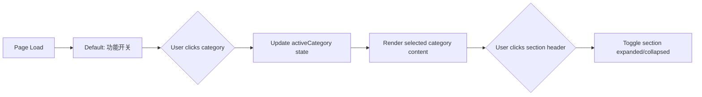
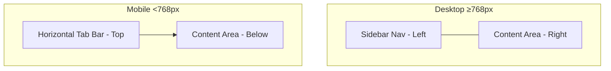

# Design Document: Settings Panel Redesign

## Overview

This design reorganizes the SuperAdmin settings page (`packages/frontend/src/pages/admin/settings.tsx`, 1087 lines) from a single long scrolling list into a category-based navigation layout with collapsible sections. The redesign is purely frontend — no backend changes, no new API endpoints, no data model changes. All existing controls, API calls, and state management remain identical.

The current page renders ~20+ toggle items, a permissions matrix, email notification controls, travel sponsorship inputs, invite expiry selector, and SuperAdmin transfer form in one continuous scroll. The redesign groups these into 7 navigable categories with a sidebar (desktop) or horizontal tab bar (mobile).

### Key Design Decisions

1. **Single-file refactor**: The redesign stays within `settings.tsx` and `settings.scss`. No new component files are created — the page is self-contained and the sub-components (CategoryNav, CollapsibleSection) are small enough to live as local components within the same file.

2. **State-driven navigation**: Active category is managed via a `useState<string>` hook. Only the active category's content renders, reducing DOM size and improving perceived performance.

3. **CSS-only collapsible sections**: Expand/collapse uses CSS `max-height` transitions with a state toggle, avoiding third-party animation libraries. The chevron rotation uses CSS transform.

4. **No new dependencies**: The redesign uses only existing Taro components (`View`, `Text`, `Switch`, `Input`) and the project's CSS variable design system.

## Architecture

### Component Hierarchy

```
AdminSettingsPage
├── Toolbar (existing, unchanged)
├── SettingsLayout (new wrapper)
│   ├── CategoryNav (new)
│   │   └── CategoryNavItem × 7
│   └── SettingsContent (new wrapper)
│       └── [Active Category Content]
│           ├── CollapsibleSection (new)
│           │   └── [Existing controls, unchanged]
│           └── CollapsibleSection
│               └── [Existing controls, unchanged]
└── EmailTemplateEditorModal (existing, unchanged)
```

### Navigation Flow



### Responsive Layout



## Components and Interfaces

### CategoryNav Component

A local component within `settings.tsx` that renders the category navigation.

```typescript
interface CategoryConfig {
  key: string;           // unique identifier, e.g. 'feature-toggles'
  label: string;         // display name, e.g. '功能开关'
  icon: string;          // icon character or SVG reference
}

const SETTINGS_CATEGORIES: CategoryConfig[] = [
  { key: 'feature-toggles', label: '功能开关', icon: '⚡' },
  { key: 'admin-permissions', label: '管理员权限', icon: '🔑' },
  { key: 'content-roles', label: '内容角色权限', icon: '👥' },
  { key: 'email-notifications', label: '邮件通知', icon: '✉' },
  { key: 'travel-sponsorship', label: '差旅赞助', icon: '✈' },
  { key: 'invite-settings', label: '邀请设置', icon: '📨' },
  { key: 'superadmin', label: '超级管理员', icon: '⭐' },
];
```

**Props:**
```typescript
interface CategoryNavProps {
  categories: CategoryConfig[];
  activeCategory: string;
  onCategoryChange: (key: string) => void;
}
```

**Behavior:**
- Renders as vertical sidebar list on desktop (≥768px)
- Renders as horizontal scrollable tab bar on mobile (<768px)
- Active item highlighted with `--accent-primary` background
- Each item shows icon + text label

### CollapsibleSection Component

A local component that wraps a group of related controls with expand/collapse behavior.

**Props:**
```typescript
interface CollapsibleSectionProps {
  title: string;
  description?: string;
  defaultExpanded?: boolean;  // defaults to true
  children: React.ReactNode;
}
```

**Behavior:**
- Header row with title, optional description, and chevron icon
- Click header toggles expanded/collapsed state
- Chevron rotates: right (collapsed) → down (expanded)
- Content area animates via `max-height` + `overflow: hidden` with `--transition-fast` (150ms)
- All sections default to expanded on initial render

### Category Content Mapping

Each category renders a function that returns the existing controls, wrapped in CollapsibleSection components:

| Category Key | Sections | Existing Controls |
|---|---|---|
| `feature-toggles` | 1 section: "功能开关" | codeRedemptionEnabled, pointsClaimEnabled toggles |
| `admin-permissions` | 1 section: "管理员权限" | 6 admin permission toggles (products, orders, content review, categories, email products, email content) |
| `content-roles` | 1 section: "角色权限矩阵" | Permissions matrix (Speaker/UserGroupLeader/Volunteer × 4 permissions) |
| `email-notifications` | 2 sections: "通知开关" + "模板管理" | 5 email toggles with edit buttons + seed templates button |
| `travel-sponsorship` | 1 section: "差旅赞助设置" | Travel toggle + domestic/international threshold inputs |
| `invite-settings` | 1 section: "邀请有效期" | Invite expiry day selector (1/3/7) |
| `superadmin` | 1 section: "权限转移" | Transfer section (user selector, password, confirm) |

### State Additions

Only two new state variables are added to `AdminSettingsPage`:

```typescript
const [activeCategory, setActiveCategory] = useState<string>('feature-toggles');
const [collapsedSections, setCollapsedSections] = useState<Set<string>>(new Set());
```

All existing state variables (`settings`, `contentRolePermissions`, `travelSettings`, `inviteSettings`, `adminUsers`, `transferPassword`, etc.) remain unchanged.

## Data Models

No data model changes. All existing TypeScript interfaces remain identical:

- `FeatureToggles` — feature toggle state
- `ContentRolePermissions` / `RolePermissions` — permissions matrix
- `TravelSponsorshipSettings` — travel sponsorship config
- `InviteSettings` — invite expiry config
- `AdminUserItem` — transfer target user
- `EmailToggleConfig` — email notification config
- `EmailTemplate` / `NotificationType` — email template editor

No new API endpoints. No changes to request payloads or responses.

## Error Handling

No new error handling is needed. All existing error handling patterns are preserved:

- **Toggle failures**: Optimistic update with revert on API error (existing `handleToggle`, `handlePermissionToggle`)
- **Travel settings**: Input validation on blur with toast feedback (existing `handleDomesticBlur`, `handleInternationalBlur`)
- **Transfer**: Inline error display with specific error code mapping (existing `handleTransfer`)
- **Auth guards**: Redirect non-authenticated/non-SuperAdmin users (existing `useEffect` guard)

The only new UI behavior (category navigation, section collapse) is purely local state with no failure modes.

## Testing Strategy

### Why Property-Based Testing Does Not Apply

This feature is a pure UI reorganization:
- No data transformations or business logic changes
- No parsers, serializers, or algorithms
- No input space that varies meaningfully
- All controls are moved, not modified

There are no universal properties to test across generated inputs. The correct approach is example-based unit tests that verify the UI structure and interaction behavior.

### Unit Tests (Example-Based)

Tests should be written using the project's existing Vitest setup. Since this is a Taro mini-program, component rendering tests may be limited. Focus on:

1. **Category configuration completeness**: Verify `SETTINGS_CATEGORIES` contains all 7 expected categories with correct keys and labels.

2. **Default state**: Verify `activeCategory` defaults to `'feature-toggles'` and all sections default to expanded.

3. **CollapsibleSection toggle logic**: Test the toggle function that manages `collapsedSections` Set — adding/removing keys correctly.

4. **Category content mapping**: Verify each category key maps to the correct set of controls (can be tested as a data structure check).

### Manual Testing Checklist

Since this is a UI layout change, manual verification is essential:

- [ ] All 7 categories are visible in navigation
- [ ] Clicking each category shows the correct controls
- [ ] All toggles still trigger correct API calls
- [ ] Permissions matrix still works correctly
- [ ] Email template editor modal still opens/closes
- [ ] Travel sponsorship inputs still validate on blur
- [ ] Invite expiry selector still works
- [ ] SuperAdmin transfer still works end-to-end
- [ ] Sidebar layout on desktop (≥768px)
- [ ] Horizontal tab bar on mobile (<768px)
- [ ] Collapsible sections expand/collapse with animation
- [ ] `prefers-reduced-motion` disables animations
- [ ] All text uses correct design system fonts
- [ ] All colors use CSS variables (no hardcoded values)
