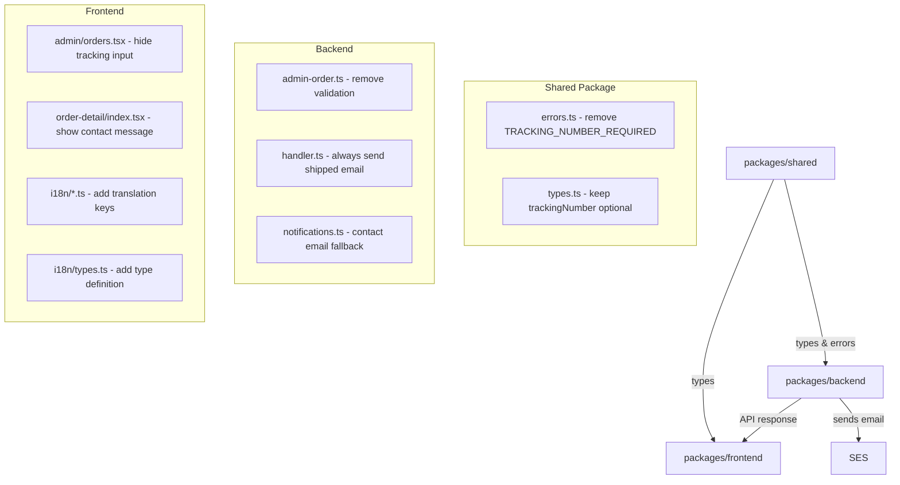

# Design Document: Simplified Shipping

## Overview

This feature simplifies the shipping/fulfillment flow by removing the tracking number requirement. Currently, admins must enter a tracking number when marking an order as "shipped", and buyers see that tracking number on their order detail page. The simplified flow:

1. **Backend**: Remove the `TRACKING_NUMBER_REQUIRED` validation from `updateShipping()` so orders can be shipped without a tracking number
2. **Admin UI**: Hide the tracking number input field from the ship form when target status is "shipped"
3. **Buyer UI**: Replace tracking number display with a contact email message (`yuanliang@busite.cn`) on the order detail page
4. **i18n**: Add translation keys for the contact message across all 5 supported locales
5. **Shared package**: Remove the `TRACKING_NUMBER_REQUIRED` error code while keeping `trackingNumber` as an optional field for backward compatibility
6. **Email**: Update the shipped email notification to include the contact email message when no tracking number is provided

### Design Decisions

- **Backward compatibility**: The `trackingNumber` field remains optional in `UpdateShippingRequest` and `OrderResponse` types. Existing orders with tracking numbers will continue to work. The backend still stores a tracking number if one is provided.
- **Contact email hardcoded in i18n**: The contact email `yuanliang@busite.cn` is embedded directly in the i18n translation strings rather than being a configurable setting. This keeps the implementation simple since the email is unlikely to change frequently.
- **Error code removal vs deprecation**: The `TRACKING_NUMBER_REQUIRED` error code will be fully removed (not just deprecated) from `ErrorCodes`, `ErrorHttpStatus`, and `ErrorMessages` since no code path will produce it after this change.

## Architecture

The change touches 4 packages across the monorepo:



The data flow for shipping an order changes from:

**Before**: Admin enters tracking number → Backend validates tracking number required → Stores tracking number → Sends email with tracking number → Buyer sees tracking number

**After**: Admin clicks ship → Backend updates status (no tracking validation) → Sends email with contact email message → Buyer sees contact email message

## Components and Interfaces

### 1. Backend: `updateShipping()` in `admin-order.ts`

**Current behavior**: Returns `TRACKING_NUMBER_REQUIRED` error when `status === 'shipped'` and `trackingNumber` is missing or empty.

**New behavior**: Remove the tracking number validation block (lines checking `status === 'shipped' && (!trackingNumber || trackingNumber.trim() === '')`). The function still stores `trackingNumber` if provided (backward compatibility).

```typescript
// REMOVE this block from updateShipping():
// if (status === 'shipped' && (!trackingNumber || trackingNumber.trim() === '')) {
//   return { success: false, error: { code: ErrorCodes.TRACKING_NUMBER_REQUIRED, ... } };
// }
```

### 2. Backend: `handleUpdateShipping()` in `handler.ts`

**Current behavior**: Passes `trackingNumber` to `sendOrderShippedEmail()`. If no tracking number, the email still sends but with empty tracking info.

**New behavior**: No change needed to the handler call — `sendOrderShippedEmail` already receives `trackingNumber` which may be `undefined`. The email function itself handles the fallback.

### 3. Backend: `sendOrderShippedEmail()` in `notifications.ts`

**Current behavior**: Passes `trackingNumber ?? ''` as a template variable. When empty, the email template shows an empty tracking number field.

**New behavior**: When `trackingNumber` is undefined or empty, pass the contact email message as the `trackingNumber` variable value so the email template displays the contact information instead.

```typescript
const CONTACT_EMAIL = 'yuanliang@busite.cn';

const variables: Record<string, string> = {
  nickname: user.nickname,
  orderId,
  trackingNumber: trackingNumber && trackingNumber.trim()
    ? trackingNumber
    : `如需查询发货状态，请邮件联系 ${CONTACT_EMAIL}`,
};
```

### 4. Shared: `errors.ts`

Remove `TRACKING_NUMBER_REQUIRED` from:
- `ErrorCodes` object
- `ErrorHttpStatus` record
- `ErrorMessages` record

### 5. Shared: `types.ts`

No changes needed. `trackingNumber` is already optional in both `UpdateShippingRequest` and `OrderResponse`.

### 6. Frontend: Admin Orders Page (`admin/orders.tsx`)

- Hide the tracking number input field when the target shipping status is `'shipped'`
- Remove client-side validation that requires tracking number for shipping
- Hide the tracking number display section in admin order detail view

### 7. Frontend: Buyer Order Detail Page (`order-detail/index.tsx`)

- When `shippingStatus === 'shipped'`: display the contact email message from i18n instead of tracking number
- When `shippingStatus === 'pending'` or `'cancelled'`: do not display the contact email message
- Hide the tracking number display entirely for shipped orders

### 8. Frontend: i18n Module

Add new key `shippingContactMessage` to the `orderDetail` section in all locale files and the type definition:

| Locale | Key | Value |
|--------|-----|-------|
| zh | `orderDetail.shippingContactMessage` | `如需查询发货状态，请邮件联系 yuanliang@busite.cn` |
| en | `orderDetail.shippingContactMessage` | `To check shipping status, please email yuanliang@busite.cn` |
| ja | `orderDetail.shippingContactMessage` | `配送状況を確認するには、yuanliang@busite.cn までメールでお問い合わせください` |
| ko | `orderDetail.shippingContactMessage` | `배송 상태를 확인하려면 yuanliang@busite.cn으로 이메일 문의해 주세요` |
| zh-TW | `orderDetail.shippingContactMessage` | `如需查詢發貨狀態，請郵件聯繫 yuanliang@busite.cn` |

## Data Models

No data model changes. The existing `OrderResponse` type already has `trackingNumber` as an optional field:

```typescript
interface OrderResponse {
  orderId: string;
  userId: string;
  items: OrderItem[];
  totalPoints: number;
  shippingAddress: { recipientName: string; phone: string; detailAddress: string };
  shippingStatus: ShippingStatus;
  trackingNumber?: string;  // remains optional — no change
  shippingEvents: ShippingEvent[];
  createdAt: string;
  updatedAt: string;
}
```

Existing orders with tracking numbers stored in DynamoDB will continue to work. New orders shipped without tracking numbers will simply not have the `trackingNumber` attribute set.

## Correctness Properties

*A property is a characteristic or behavior that should hold true across all valid executions of a system — essentially, a formal statement about what the system should do. Properties serve as the bridge between human-readable specifications and machine-verifiable correctness guarantees.*

### Property 1: Shipping without tracking number always succeeds

*For any* pending order, calling `updateShipping` with status `"shipped"` and any trackingNumber value (undefined, empty string, whitespace, or absent) SHALL return `{ success: true }` and update the order's shippingStatus to `"shipped"`.

**Validates: Requirements 1.1, 1.2, 1.4**

### Property 2: Provided tracking number is stored on the order

*For any* pending order and any non-empty tracking number string, calling `updateShipping` with status `"shipped"` and that tracking number SHALL store the tracking number on the order record, preserving the exact value.

**Validates: Requirements 1.3**

### Property 3: Shipped email without tracking number contains contact email

*For any* order shipped without a tracking number, the `sendOrderShippedEmail` function SHALL produce an email where the template variables include the contact email address `yuanliang@busite.cn` in place of the tracking number.

**Validates: Requirements 6.2**

## Error Handling

### Removed Error Path

The `TRACKING_NUMBER_REQUIRED` error code and its associated HTTP 400 response are removed entirely. The `updateShipping` function will no longer check for tracking number presence when `status === 'shipped'`.

### Preserved Error Paths

All other error paths in `updateShipping` remain unchanged:
- `ORDER_NOT_FOUND` (404) — order doesn't exist
- `INVALID_STATUS_TRANSITION` (400) — invalid status flow (e.g., shipped → pending)

### Frontend Error Handling

- The admin ship form no longer needs to handle `TRACKING_NUMBER_REQUIRED` error responses
- Remove the `trackingNumberRequired` i18n key usage from the admin orders page validation logic

### Email Error Handling

- `sendOrderShippedEmail` continues to be best-effort (errors are caught and logged, never fail the shipping update)
- When no tracking number is provided, the function substitutes the contact email message — no new error paths introduced

## Testing Strategy

### Property-Based Tests (using fast-check)

Property-based tests will validate the three correctness properties above. Each test runs a minimum of 100 iterations with randomly generated inputs.

- **Library**: `fast-check` (already used in the project for other property tests)
- **Tag format**: `Feature: simplified-shipping, Property N: <description>`

Tests:
1. Generate random pending orders + random trackingNumber values (undefined, empty, whitespace) → verify `updateShipping` succeeds
2. Generate random pending orders + random non-empty tracking numbers → verify tracking number is stored
3. Generate random order data without tracking number → verify email variables contain contact email

### Unit Tests (example-based)

- **Backend `updateShipping`**: Specific examples for shipped without tracking, shipped with tracking, shipped with empty string tracking
- **Backend `sendOrderShippedEmail`**: Verify email content with and without tracking number
- **Shared `errors.ts`**: Verify `TRACKING_NUMBER_REQUIRED` is not in `ErrorCodes`
- **i18n**: Verify all 5 locales have the `shippingContactMessage` key with correct values

### Integration / Manual Tests

- **Admin flow**: Ship an order without entering tracking number → verify order status updates
- **Buyer flow**: View shipped order detail → verify contact email message is displayed
- **Backward compat**: Ship an order WITH a tracking number → verify it still works and tracking number is stored
