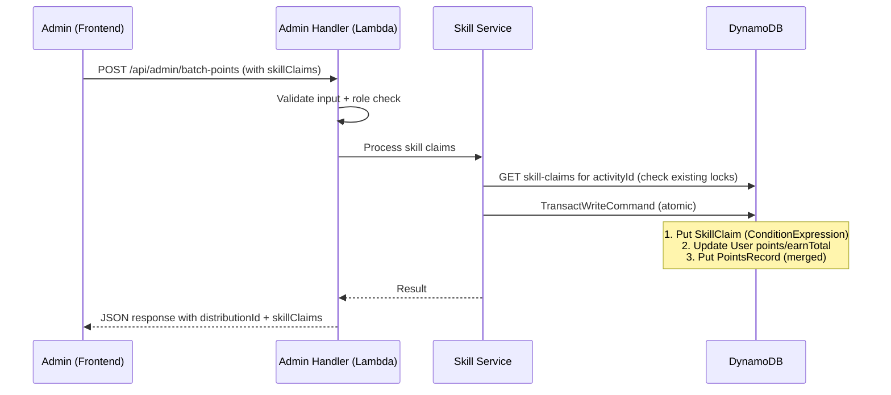
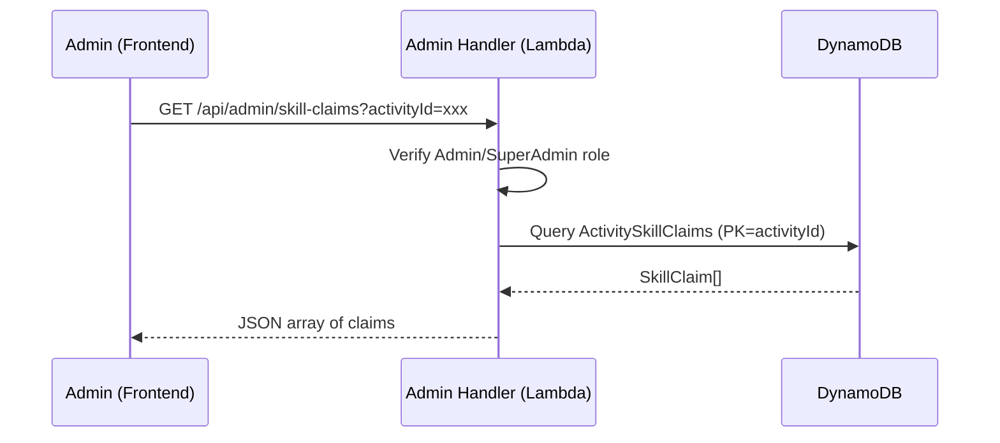
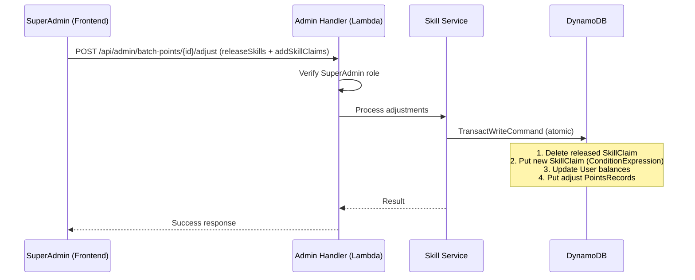

# Design Document: Skill Claims（技能分发放）

## Overview

本设计在现有批量发放（batch-points）系统上扩展"技能分"能力。当管理员为 UserGroupLeader（UGL）角色发放活动积分时，可同时为每位 UGL 勾选其在该活动中提供的技能贡献（`liveSupport` 直播支持 / `promoWriting` 宣传文案创作），系统据此发放额外的技能分。

### Key Design Decisions

1. **独立表存储技能锁**：新建 `PointsMall-ActivitySkillClaims` 表（PK=`activityId`, SK=`skill`），利用 DynamoDB 主键唯一性天然实现全局互斥锁，无需额外的锁机制。

2. **ConditionExpression 强制互斥**：写入 Skill_Claim 时使用 `attribute_not_exists(activityId)` 条件表达式，确保并发场景下同一活动同一技能只能被一位 UGL 占用。

3. **合并到现有 TransactWriteCommand**：技能分写入（Skill_Claim Put + User Update + PointsRecord Put）与活动分写入合并到同一事务中，保证原子性。

4. **单条 PointsRecord 合并规则**：同一用户在同一次发放中无论获得活动分、技能分还是两者兼有，均只产生一条 PointsRecord，`amount` 为总和，`source` 字段拼接来源说明。

5. **配置快照（pointsAwarded）**：Skill_Claim 写入时从 PointsRuleConfig 读取当前技能分数额作为快照存储，后续配置变更不影响已写入的历史记录。

6. **调整页仅回退活动分**：当 SuperAdmin 从某次发放中移除参与者时，仅回退活动分部分，保留该用户的 Skill_Claim 与技能分（only-skill 场景仍合法）。

## Architecture



### Query Flow



### Adjust Flow



## Components and Interfaces

### Backend Components

#### 1. Skill Claims Service (`packages/backend/src/admin/skill-claims.ts`)

新模块，负责技能认领的核心逻辑：

```typescript
// 技能类型
export type SkillType = 'liveSupport' | 'promoWriting';

// 技能认领请求项
export interface SkillClaimInput {
  skill: SkillType;
  userId: string;
}

// 技能认领记录（DynamoDB item）
export interface SkillClaimRecord {
  activityId: string;       // PK
  skill: SkillType;         // SK
  userId: string;
  userNickname: string;
  claimedAt: string;        // ISO 8601
  claimedBy: string;        // 操作管理员 userId
  distributionId: string;
  pointsAwarded: number;    // 写入时刻的配置快照
}

// 查询接口
export async function getSkillClaimsForActivity(
  activityId: string,
  dynamoClient: DynamoDBDocumentClient,
  tableName: string,
): Promise<SkillClaimRecord[]>;

// 验证 skillClaims 输入
export function validateSkillClaimsInput(
  skillClaims: unknown,
  targetRole: string,
): ValidationResult;

// 构建技能分事务项（供 batch-points 调用）
export function buildSkillClaimTransactItems(
  skillClaims: SkillClaimInput[],
  context: SkillClaimContext,
): TransactWriteItem[];
```

#### 2. Extended Batch Points (`packages/backend/src/admin/batch-points.ts`)

扩展现有 `BatchDistributionInput` 接口：

```typescript
export interface BatchDistributionInput {
  // ... existing fields ...
  skillClaims?: SkillClaimInput[];  // 新增可选字段
}
```

扩展 `executeBatchDistribution` 逻辑：
- 验证 `skillClaims` 输入合法性
- 计算每位用户的合并积分（活动分 + 技能分）
- 将 Skill_Claim Put 操作合并到 TransactWriteCommand
- 生成合并的 PointsRecord（单条/用户）

#### 3. Extended Batch Points Adjust (`packages/backend/src/admin/batch-points-adjust.ts`)

扩展 `AdjustmentInput` 接口：

```typescript
export interface AdjustmentInput {
  // ... existing fields ...
  releaseSkills?: Array<{ skill: SkillType }>;
  addSkillClaims?: Array<{ skill: SkillType; userId: string }>;
}
```

#### 4. Extended Feature Toggles (`packages/backend/src/settings/feature-toggles.ts`)

扩展 `PointsRuleConfig`：

```typescript
export interface PointsRuleConfig {
  // ... existing fields ...
  liveSupportPoints: number;    // 默认 30
  promoWritingPoints: number;   // 默认 30
}
```

#### 5. Admin Handler Route (`packages/backend/src/admin/handler.ts`)

新增路由：
- `GET /api/admin/skill-claims?activityId={activityId}` → 查询活动技能锁

### Frontend Components

#### 1. Skill Icons Component

在批量发放页 UGL 列表每行右侧渲染两个 Heroicons SVG 图标：
- `video-camera`（24×24）→ liveSupport
- `pencil-square`（24×24）→ promoWriting

状态：
- **可勾选**：正常颜色 + cursor-pointer
- **已勾选（本次）**：高亮填充色
- **已占用（他人）**：降低透明度 + cursor-not-allowed + tooltip 显示占用者昵称
- **禁用（非 UGL / 无 activityId）**：不渲染

#### 2. Adjust Page Skill Lock Panel

调整页新增"活动技能锁"区块：
- 显示 liveSupport / promoWriting 当前占用者
- "释放"按钮 → 确认弹窗（提示扣回分数）
- "指派"按钮 → UGL 选择器

### API Interfaces

| Method | Path | Auth | Description |
|--------|------|------|-------------|
| GET | `/api/admin/skill-claims?activityId={id}` | Admin/SuperAdmin | 查询活动技能锁 |
| POST | `/api/admin/batch-points` | Admin/SuperAdmin | 批量发放（扩展 skillClaims） |
| POST | `/api/admin/batch-points/{id}/adjust` | SuperAdmin | 调整（扩展 releaseSkills/addSkillClaims） |

## Data Models

### PointsMall-ActivitySkillClaims Table

| Field | Type | Description |
|-------|------|-------------|
| `activityId` | String (PK) | 活动 ID |
| `skill` | String (SK) | 技能类型：`liveSupport` \| `promoWriting` |
| `userId` | String | 认领者 userId |
| `userNickname` | String | 认领者昵称 |
| `claimedAt` | String | ISO 8601 时间戳 |
| `claimedBy` | String | 执行操作的管理员 userId |
| `distributionId` | String | 关联的发放记录 ID |
| `pointsAwarded` | Number | 写入时刻的技能分快照值 |

**Key Schema**: PK = `activityId`, SK = `skill`
**Billing**: PAY_PER_REQUEST
**互斥保证**: 写入时 `ConditionExpression: attribute_not_exists(activityId)` 确保 `(activityId, skill)` 全局唯一

### Extended PointsRuleConfig

```typescript
{
  // ... existing fields ...
  liveSupportPoints: 30,    // 直播支持技能分，正整数，默认 30
  promoWritingPoints: 30,   // 宣传文案创作技能分，正整数，默认 30
}
```

### Extended Distribution Record

```typescript
{
  // ... existing fields ...
  skillClaims?: Array<{
    skill: SkillType;
    userId: string;
    userNickname: string;
    pointsAwarded: number;
  }>;
}
```

### PointsRecord Source Format

| Scenario | source 格式 |
|----------|-------------|
| 仅活动分 | `"批量发放:UserGroupLeader\|{ugName}\|{topic}\|{date}"` |
| 仅技能分 | `"批量发放:技能:liveSupport+promoWriting\|{ugName}\|{topic}\|{date}"` |
| 活动分+技能分 | `"批量发放:UserGroupLeader+技能:liveSupport\|{ugName}\|{topic}\|{date}"` |

### Transaction Operation Count

每位用户在事务中占用的操作数：
- 仅活动分：2 ops（Update User + Put PointsRecord）
- 仅技能分（1 skill）：3 ops（Put SkillClaim + Update User + Put PointsRecord）
- 仅技能分（2 skills）：4 ops（2× Put SkillClaim + Update User + Put PointsRecord）
- 活动分 + 1 skill：3 ops（Put SkillClaim + Update User + Put PointsRecord）
- 活动分 + 2 skills：4 ops（2× Put SkillClaim + Update User + Put PointsRecord）

加上 Distribution Record Put（1 op），总上限需 ≤ 100。

## Correctness Properties

*A property is a characteristic or behavior that should hold true across all valid executions of a system — essentially, a formal statement about what the system should do. Properties serve as the bridge between human-readable specifications and machine-verifiable correctness guarantees.*

### Property 1: Mutex — 技能锁全局唯一性

*For any* `activityId` and *for any* sequence of skill claim write operations targeting that activity, the `PointsMall-ActivitySkillClaims` table SHALL contain at most 1 record for `(activityId, 'liveSupport')` and at most 1 record for `(activityId, 'promoWriting')`.

**Validates: Requirements 16.1, 9.1**

### Property 2: Points Conservation — 积分守恒

*For any* successful batch distribution request (containing `userIds` and/or `skillClaims`), the sum of all affected users' `Users.points` increments SHALL equal the sum of (`userIds.length × activityPoints`) + (sum of each skill claim's configured `skillPoints`).

**Validates: Requirements 16.2, 10.5**

### Property 3: Record Merge Invariant — 合并记录不变量

*For any* successful batch distribution request, *for any* user U who appears in `userIds` and/or `skillClaims`, the system SHALL create exactly 1 PointsRecord for U in this distribution, and its `amount` SHALL equal the sum of U's activity points (if in `userIds`) plus U's skill points (if in `skillClaims`).

**Validates: Requirements 16.3, 10.1, 10.2, 10.3**

### Property 4: Transaction Atomicity — 技能认领原子性

*For any* batch distribution request containing `skillClaims`, the system outcome SHALL be exactly one of: (a) all skill claims written + all user balances updated + all PointsRecords created; or (b) no skill claims written + no user balances modified + no PointsRecords created. There SHALL be no partial state.

**Validates: Requirements 16.4, 9.3, 9.4**

### Property 5: Adjust Preserves Skill Claims — 调整保留技能认领

*For any* adjustment request that removes participant X from a distribution where X received both activity points and skill points, the Skill_Claim record in `PointsMall-ActivitySkillClaims` SHALL remain unchanged, and X's `Users.points` decrease SHALL equal exactly the distribution's activity points value (skill points portion preserved in balance).

**Validates: Requirements 16.5, 12.7**

### Property 6: Role Restriction — 角色限制

*For any* batch distribution request where `targetRole !== 'UserGroupLeader'` and `skillClaims` is non-empty, the system SHALL reject the request with error code `SKILL_NOT_ALLOWED_FOR_ROLE` and SHALL NOT modify any user balance, write any PointsRecord, or create any Skill_Claim.

**Validates: Requirements 16.6, 7.7**

### Property 7: Lock Release Authority — 释放权限与金额正确性

*For any* adjustment request containing `releaseSkills` or `addSkillClaims`, the caller SHALL have `SuperAdmin` role. When a SuperAdmin releases a Skill_Claim, the original holder's `Users.points` decrease SHALL equal exactly the `pointsAwarded` field value stored in that Skill_Claim record (the historical snapshot, not the current config value).

**Validates: Requirements 16.7, 12.3, 12.8**

### Property 8: Config Snapshot Invariant — 配置快照不变量

*For any* Skill_Claim record, its `pointsAwarded` field SHALL equal the value of the corresponding PointsRuleConfig field (`liveSupportPoints` or `promoWritingPoints`) at the moment of write, and SHALL remain unchanged regardless of subsequent PointsRuleConfig updates.

**Validates: Requirements 16.8**

## Error Handling

| Error Code | HTTP Status | Trigger Condition |
|------------|-------------|-------------------|
| `INVALID_REQUEST` | 400 | skillClaims 格式错误、userId 无效、activityId 缺失 |
| `INVALID_SKILL_TYPE` | 400 | skill 值不在 `['liveSupport', 'promoWriting']` |
| `DUPLICATE_SKILL_IN_REQUEST` | 400 | 同一请求中同一 skill 出现两次 |
| `SKILL_NOT_ALLOWED_FOR_ROLE` | 400 | targetRole 非 UGL 但携带 skillClaims |
| `SKILL_ALREADY_CLAIMED` | 409 | 技能锁已被他人占用（ConditionExpression 失败） |
| `BATCH_TOO_LARGE` | 400 | 事务操作数超过 DynamoDB 100 条上限 |
| `FORBIDDEN` | 403 | 非 Admin/SuperAdmin 调用，或非 SuperAdmin 执行释放/指派 |
| `ACTIVITY_NOT_FOUND` | 404 | activityId 在 Activities 表中不存在 |

### Error Recovery Strategy

1. **SKILL_ALREADY_CLAIMED**：前端收到后重新调用 `GET /api/admin/skill-claims` 刷新锁状态，提示用户该技能已被占用。
2. **BATCH_TOO_LARGE**：前端在提交前预计算操作数，超限时提示用户减少选择人数。
3. **Transaction failure**：DynamoDB TransactWriteCommand 保证原子性，失败时无需手动回滚。

## Testing Strategy

### Property-Based Tests (fast-check)

使用 `fast-check` 库实现属性测试，每个属性最少 100 次迭代：

- **Property 1 (Mutex)**：生成随机 activityId + 多次并发 claim 尝试，验证表中每个 (activityId, skill) 最多 1 条记录
- **Property 2 (Points Conservation)**：生成随机 userIds + skillClaims 组合，验证余额增量总和等于预期
- **Property 3 (Record Merge)**：生成随机分发场景，验证每用户恰好 1 条 PointsRecord 且 amount 正确
- **Property 4 (Atomicity)**：生成包含冲突 claim 的请求，验证全部成功或全部失败
- **Property 5 (Adjust Preserves)**：生成调整场景，验证移除参与者后 SkillClaim 保留
- **Property 6 (Role Restriction)**：生成非 UGL 角色 + skillClaims，验证拒绝且无状态变更
- **Property 7 (Release Authority)**：生成释放场景，验证扣减金额等于 pointsAwarded 快照
- **Property 8 (Config Snapshot)**：生成 claim 后修改配置，验证 pointsAwarded 不变

**Tag format**: `Feature: skill-claims, Property {N}: {property_text}`

### Unit Tests (Vitest)

- 输入验证：各种非法 skillClaims 格式
- 边界条件：空 skillClaims、空 userIds、两者都空
- 三种发放场景的具体示例
- PointsRecord source 字符串格式验证
- 事务操作数计算与上限检查
- 调整页释放/指派的具体示例

### Integration Tests

- CDK synth 验证新表定义与权限
- API 路由注册验证
- 端到端发放 + 查询 + 调整流程

### Test Configuration

```typescript
// vitest.config.ts — property tests
{
  test: {
    include: ['**/*.property.test.ts'],
    testTimeout: 30000, // property tests may take longer
  }
}
```

每个属性测试使用 `fc.assert(fc.property(...), { numRuns: 100 })` 配置。
